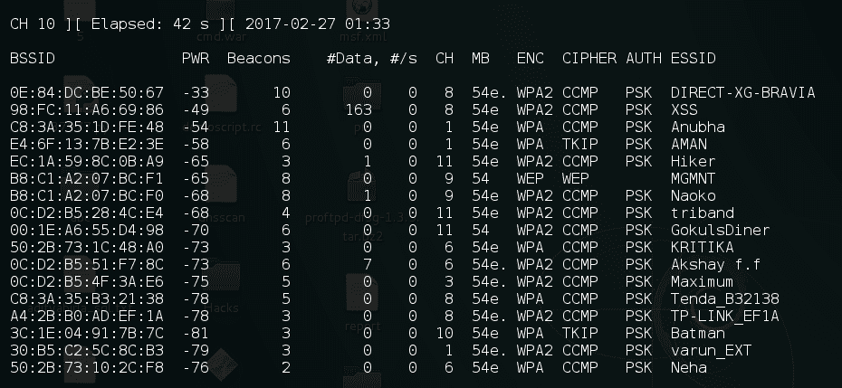
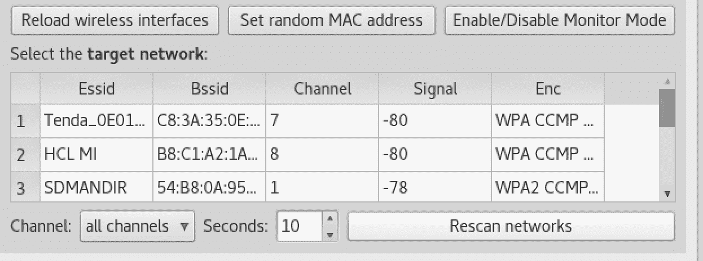
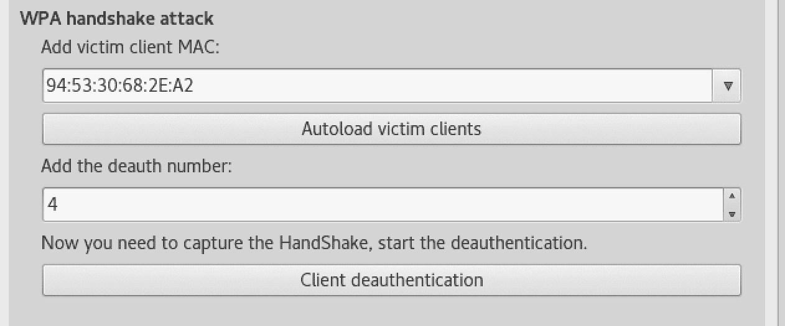
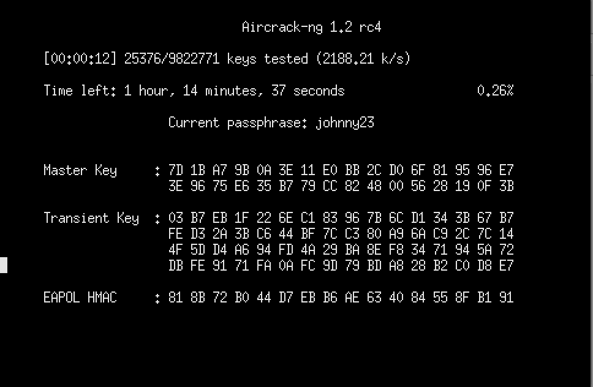
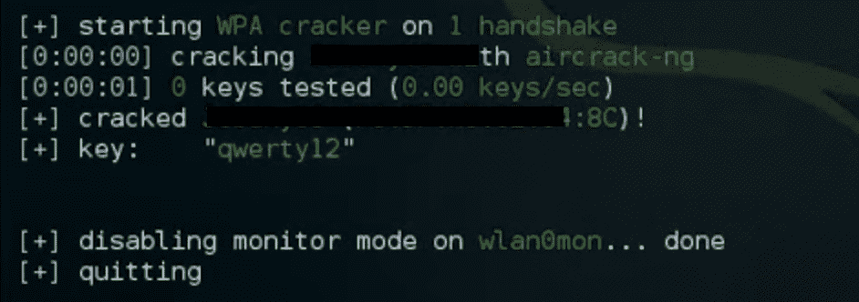
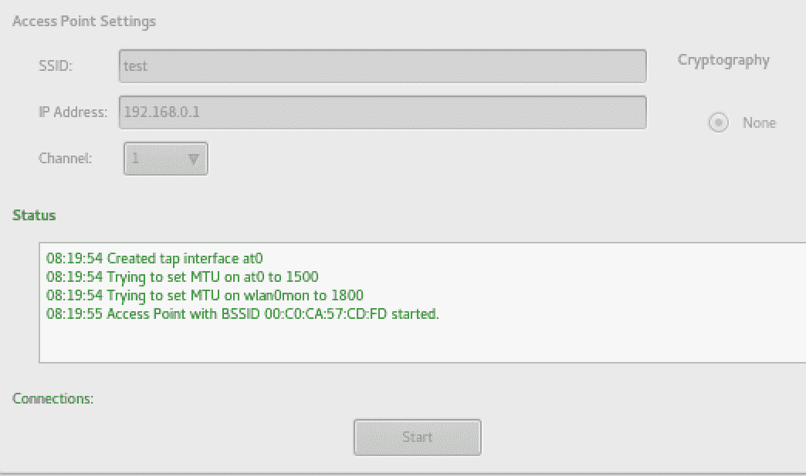
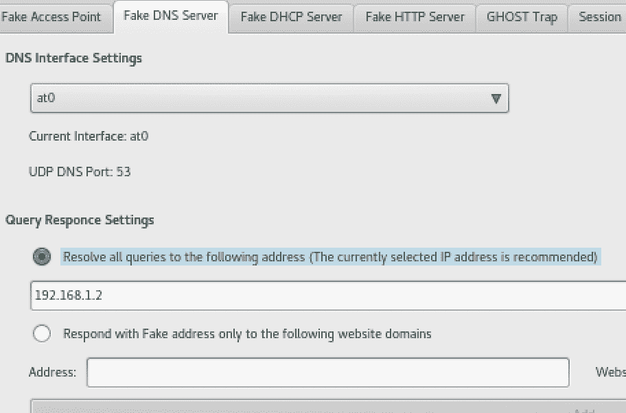
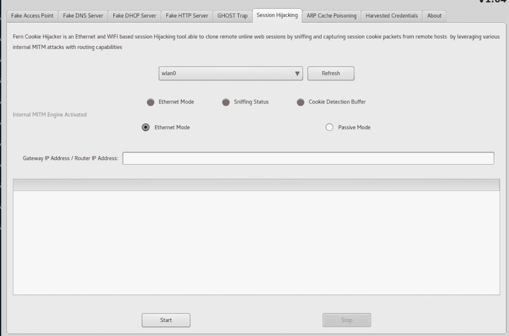

# 第六章：无线攻击-超越 Aircrack-ng

在本章中，我们将涵盖以下内容：

+   老牌 Aircrack

+   与 Gerix 一起

+   处理 WPAs

+   使用 Ghost Phisher 拥有员工帐户

+   Pixie dust 攻击

# 介绍

如官方网站上所述：

“Aircrack-ng 是一个完整的工具套件，用于评估 Wi-Fi 网络安全性。

它专注于 Wi-Fi 安全的不同领域：

+   *监控：数据包捕获和将数据导出到文本文件，以便第三方工具进一步处理*

+   *攻击：重放攻击，去认证，伪造接入点和其他通过数据包注入*

+   *测试：检查 Wi-Fi 卡和驱动程序功能（捕获和注入）*

+   *破解：WEP 和 WPA PSK（WPA 1 和 2）*

# 老牌 Aircrack

Aircrack 是一个用于网络的软件套件，包括网络探测器，数据包嗅探器和 WEP/WPA2 破解器。它是开源的，专为 802.11 无线局域网设计（有关更多信息，请访问[`en.wikipedia.org/wiki/IEEE_802.11`](https://en.wikipedia.org/wiki/IEEE_802.11)）。它包括各种工具，如`aircrack-ng`，`airmon-ng`，`airdecap`，`aireplay-ng`，`packetforge-ng`等。

在这个示例中，我们将涵盖使用 Aircrack 套件破解无线网络的一些基础知识。您将学习使用`airmon-ng`，`aircrack-ng`，`airodump-ng`等工具来破解我们周围无线网络的密码。

# 准备就绪

我们需要有一个支持数据包注入的 Wi-Fi 硬件。 Alfa Networks 的 Alfa 卡，TP-Link TL-WN821N 和 EDIMAX EW-7811UTC AC600 是我们可以使用的一些卡。在这个例子中，我们使用 Alfa 卡。

# 如何做...

以下步骤演示了 Aircrack：

1.  我们输入`airmon-ng`命令，以检查我们的卡是否被 Kali 检测到：


1.  接下来，我们需要使用以下命令将我们的适配器设置为监视模式：

```
 airmon-ng start wlan0mon 
```

以下屏幕截图显示了前面命令的输出：


1.  现在，为了查看附近运行的路由器，我们使用以下命令：

```
 airodump-ng wlan0mon
```

以下屏幕截图显示了前面命令的输出：



1.  在这里，我们注意到我们想要破解的网络的`BSSID`；在我们的例子中，它是`B8:C1:A2:07:BC:F1`，频道号是`9`。我们通过按*Ctrl* + *C*停止该过程，并保持窗口打开。

1.  现在我们使用`airodump-ng`捕获数据包，并使用`-w`开关将这些数据包写入文件：

```
 airodump-ng -w packets -c 9 --bssid B8:C1:A2:07:BC:F1 wlan0mon
```

以下屏幕截图显示了前面命令的输出：


1.  现在我们需要观察信标和数据列；这些数字从`0`开始，并随着数据包在路由器和其他设备之间传递而增加。我们至少需要 20,000 个初始化向量才能成功破解**有线等效隐私**（**WEP**）密码：

1.  为了加快进程，我们打开另一个终端窗口并运行`aireplay-ng`，并使用以下命令执行伪身份验证：

```
 aireplay-ng -1 0 -e <AP ESSID> -a <AP MAC> -h <OUR MAC> wlan0mon 
       {fake authentication}
```

以下屏幕截图显示了前面命令的示例：


1.  现在让我们使用以下命令进行 ARP 数据包重放：

```
 aireplay-ng -3 -b BSSID wlan0mon
```

以下屏幕截图显示了前面命令的示例：


1.  一旦我们有足够的数据包，我们就开始`aircrack-ng`，并提供我们保存数据包的文件名：

```
 aircrack-ng filename.cap
```

以下屏幕截图显示了前面命令的示例：


1.  一旦破解，我们应该在屏幕上看到密码：


# 它是如何工作的...

这种攻击的思想是尽可能多地捕获数据包。每个数据包包含一个**初始化向量**（**IV**），其大小为 3 个字节，并与之关联。我们只需捕获尽可能多的 IV，然后在其上使用 Aircrack 来获取我们的密码。

# 与 Gerix 一起

在上一个教程中，您学会了如何使用 Aircrack 套件来破解 WEP。在这个教程中，我们将使用基于 GUI 的工具 Gerix，它使 Aircrack 套件易于使用，并使我们的无线网络审计更加容易。Gerix 是由 J4r3tt 开发的基于 Python 的工具。

# 准备就绪

让我们使用以下命令安装 Gerix：

```
git clone https://github.com/J4r3tt/gerix-wifi-cracker-2.git
```

# 如何操作...

以下步骤演示了 Gerix 的使用：

1.  下载完成后，我们进入下载的目录并运行以下命令：

```
 cd gerix-wifi-cracker-2
```

1.  我们使用以下命令运行工具：

```
 python gerix.py
```

上述命令可以在以下截图中看到：


1.  窗口打开后，我们点击“配置”选项卡中的“启用/禁用监视模式”，如下截图所示：


1.  然后，我们点击“重新扫描网络”：



1.  这将显示可用的接入点列表和它们使用的认证类型。我们选择一个带有 WPA 的接入点，然后切换到 WPA 选项卡。

1.  在这里，我们点击“常规功能”，然后点击“开始捕获”：


1.  由于 WPA 攻击需要捕获握手，我们需要一个站点已连接到接入点。因此，我们点击“自动加载受害者客户端”或输入自定义受害者 MAC：



1.  接下来，我们选择去认证号。我们在这里选择`0`以执行去认证攻击，然后点击“客户端去认证”按钮：


1.  我们应该看到一个弹出窗口，它会为我们执行去认证：


在 airodump 窗口中，我们应该看到已捕获到握手。

1.  现在我们准备破解 WPA，我们切换到 WEP 破解选项卡，在 WPA 暴力破解中，我们给出一个字典的路径，然后点击“Aircrack-ng - 破解 WPA 密码”：


1.  我们应该看到 Aircrack 窗口，当密码被破解时它会显示给我们：



1.  同样，这个工具也可以用来破解 WEP/WPA2 网络。

# 处理 WPA

Wifite 是一个仅适用于 Linux 的工具，旨在自动化无线审计过程。它需要安装 Aircrack 套件、Reaver、Pyrit 等才能正常运行。它已预装在 Kali 中。在这个教程中，您将学习如何使用 wifite 来破解一些 WPA。

# 如何操作...

要了解 Wifite，请按照以下步骤操作：

1.  我们可以通过输入以下命令来启动 Wifite：

```
 wifite
```

上述命令显示了所有可用网络的列表，如下截图所示：


1.  然后我们按下*Ctrl* + *C*来停止；然后它会要求您选择要尝试破解的网络：


1.  我们输入我们的数字并按*Enter*。工具会自动尝试使用不同的方法来破解网络，最终，如果成功破解，它会显示密码：


我们将看到以下密码：



# 使用 Ghost Phisher 拥有员工账户

Ghost Phisher 是一个无线网络审计和攻击软件，它创建一个网络的虚假接入点，欺骗受害者连接到它。然后为受害者分配一个 IP 地址。该工具可用于执行各种攻击，如凭据钓鱼和会话劫持。它还可以用于向受害者传递 meterpreter 有效载荷。在这个教程中，您将学习如何使用该工具执行各种网络钓鱼攻击或窃取 cookies 等。

# 如何操作...

可以在下面看到 Ghost Phisher 的使用：

1.  我们使用`ghost-phisher`命令启动它：


1.  在这里，我们选择我们的接口并点击“设置监视器”：


1.  现在我们输入我们想要创建的接入点的详细信息：



1.  然后，我们点击“开始”以创建一个新的无线网络并使用该名称。

1.  然后，我们切换到虚假 DNS 服务器。在这里，我们需要提到受害者打开任何网页时将被引导到的 IP 地址：



1.  然后我们启动 DNS 服务器。

1.  然后，我们切换到虚假 DHCP 服务器。在这里，我们需要确保当受害者尝试连接时，他/她会被分配一个 IP 地址：


1.  完成后，我们点击“开始”以启动 DHCP 服务。

1.  如果我们想要钓鱼并捕获凭据，我们可以通过在虚假 HTTP 服务器选项卡中设置选项来将他们引导到我们的钓鱼页面。在这里，我们可以上传我们想要显示的 HTML 页面或提供我们想要克隆的 URL。我们启动服务器：


1.  在下一个选项卡中，我们看到 Ghost Trap；这个功能允许我们执行 Metasploit 有效载荷攻击，它将要求受害者下载我们准备好的 meterpreter 有效载荷，一旦执行，我们将获得一个 meterpreter 连接。

1.  在会话劫持选项卡中，我们可以监听和捕获可能通过网络的会话。我们在这里需要做的就是输入网关或路由器的 IP 地址，然后点击“开始”，它将检测并显示任何捕获的 cookie/会话：



1.  我们在 HTTP 服务器中捕获的凭据可以在收获的凭据选项卡中看到。

# Pixie dust 攻击

**Wi-Fi Protected Setup**（**WPS**）于 2006 年推出，供希望连接到家庭网络而不必记住 Wi-Fi 的复杂密码的家庭用户使用。它使用八位数的 PIN 来验证客户端到网络的身份。

Pixie dust 攻击是一种暴力破解八位数 PIN 的方法。如果路由器易受攻击，这种攻击可以在几分钟内恢复 PIN。另一方面，简单的暴力破解需要几个小时。在这个教程中，您将学习如何执行 pixie dust 攻击。

可以在[`docs.google.com/spreadsheets/d/1tSlbqVQ59kGn8hgmwcPTHUECQ3o9YhXR91A_p7Nnj5Y/edit?pref=2&pli=1#gid=2048815923`](https://docs.google.com/spreadsheets/d/1tSlbqVQ59kGn8hgmwcPTHUECQ3o9YhXR91A_p7Nnj5Y/edit?pref=2&pli=1#gid=2048815923)找到攻击将起作用的易受攻击的路由器列表。

# 准备工作

我们需要启用 WPS 的网络。否则，它将无法工作。

# 如何做...

要了解 pixie dust，请按照以下步骤：

1.  我们使用以下命令在监视器模式下启动我们的接口：

```
 airmon-ng start wlan0
```

1.  然后，我们需要找到启用 WPS 的网络；我们可以使用以下命令来做到这一点：

```
 wash -i <monitor mode interface> -C
```

以下截图显示了上述命令的示例：


1.  现在我们使用以下命令运行`reaver`：

```
 reaver -i wlan0mon -b [BSSID] -vv -S -c [AP channel]
```

以下截图显示了上述命令的示例：


1.  完成后，我们应该看到 PIN。

# 还有更多...

以下是一些可以在攻击无线网络时参考的优秀文章：

+   [`www.hackingtutorials.org/wifi-hacking-tutorials/pixie-dust-attack-wps-in-kali-linux-with-reaver/`](http://www.hackingtutorials.org/wifi-hacking-tutorials/pixie-dust-attack-wps-in-kali-linux-with-reaver/)

+   [`www.kalitutorials.net/2014/04/hack-wpawpa2-wps-reaver-kali-linux.html`](http://www.kalitutorials.net/2014/04/hack-wpawpa2-wps-reaver-kali-linux.html)
