# 第十一章：随身携带的 Kali - NetHunters 和树莓派

在本章中，我们将介绍以下内容：

+   在树莓派上安装 Kali

+   安装 NetHunter

+   超人打字 - HID 攻击

+   我可以给手机充电吗？

+   设置恶意接入点

# 介绍

在某些情况下，在进行渗透测试时，客户可能要求我们进行适当的红队攻击。在这种情况下，手持笔记本电脑走进办公室可能看起来可疑，这就是这一章派上用场的原因。我们可以使用小型设备，如手机或树莓派来进行红队行动，并有效地进行渗透测试。在本章中，我们将讨论如何在树莓派和兼容的手机上设置 Kali Linux，并使用它来对网络执行一些酷炫的攻击。

# 在树莓派上安装 Kali

树莓派是一台价格实惠的 ARM 计算机。它非常小巧，便于携带，因此非常适合用于类似 Kali Linux 的系统进行便携式设备的渗透测试。

在这个教程中，您将学习如何在树莓派上安装 Kali Linux 镜像。

# 准备工作

树莓派支持 SD 卡。在树莓派上设置 Kali 的最佳方法是创建一个可引导的 SD 卡并将其插入 Pi。

# 如何做...

要在树莓派上安装 Kali，请按照以下步骤进行：

1.  我们将首先从 Offensive Security 的网站[`www.offensive-security.com/kali-linux-arm-images/`](https://www.offensive-security.com/kali-linux-arm-images/)下载镜像：


1.  镜像下载完成后，我们可以使用不同的方法将该镜像写入我们的存储卡。

1.  在 Linux/macOS 上，可以使用`dd`实用程序来完成。可以使用以下命令使用`dd`实用程序：

```
        dd if=/path/to/kali-2.1.2-rpi.img of=/dev/sdcard/path bs=512k  
```

1.  完成此过程后，我们可以将 SD 卡插入 Pi 并启动它。

1.  我们将看到我们的 Kali 启动：


我们可以参考此链接以获取更详细的指南：[`docs.kali.org/downloading/kali-linux-live-usb-install`](https://docs.kali.org/downloading/kali-linux-live-usb-install)。

# 安装 NetHunter

如 Offensive Security 官方维基所述：

“Kali NetHunter 是一个包括强大的**移动渗透测试平台**的 Android ROM 叠加层。该叠加层包括自定义内核、Kali Linux chroot 和一个配套的 Android 应用程序，可以更轻松地与各种安全工具和攻击进行交互。除了 Kali Linux 中的渗透测试工具库外，NetHunter 还支持几个其他类别，如**HID 键盘攻击**、**BadUSB 攻击**、**Evil AP MANA 攻击**等等。有关组成 NetHunter 的各个部分的更多信息，请查看我们的 NetHunter 组件页面。NetHunter 是由 Offensive Security 和社区开发的开源项目。”

在这个教程中，您将学习如何在 Android 设备上安装和配置 NetHunter，并使用它执行攻击。我们可以在[`github.com/offensive-security/kali-nethunter/wiki`](https://github.com/offensive-security/kali-nethunter/wiki)找到支持的硬件列表。

# 准备工作

在开始之前，我们需要将设备 root，并安装 Team Win Recovery Project 作为自定义恢复。

# 如何做...

安装 NetHunter，请按照以下步骤进行：

1.  我们下载 NetHunter ZIP 文件并将其复制到 SD 卡，然后将手机重新启动到恢复模式。我们正在使用安装了 Cyanogenmod 12.1 的 OnePlus One。可以通过同时按下电源和音量减按钮来启动恢复模式。

1.  一旦进入恢复模式，我们选择屏幕上的安装并选择 ZIP 文件。我们可以从[`www.offensive-security.com/kali-linux-nethunter-download`](https://www.offensive-security.com/kali-linux-nethunter-download)下载 ZIP 文件：


1.  完成后，我们重新启动手机，应该在应用菜单中看到 NetHunter。

1.  但在开始之前，我们需要从 Play 商店在手机上安装 BusyBox：

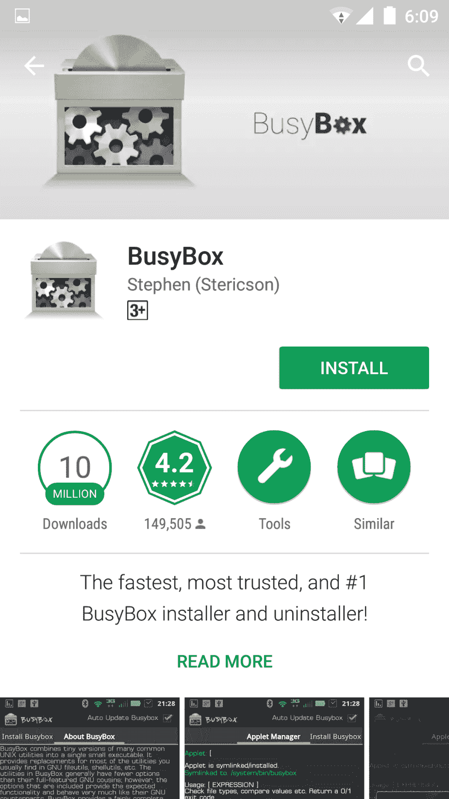

1.  完成后，我们运行该应用程序并点击安装：

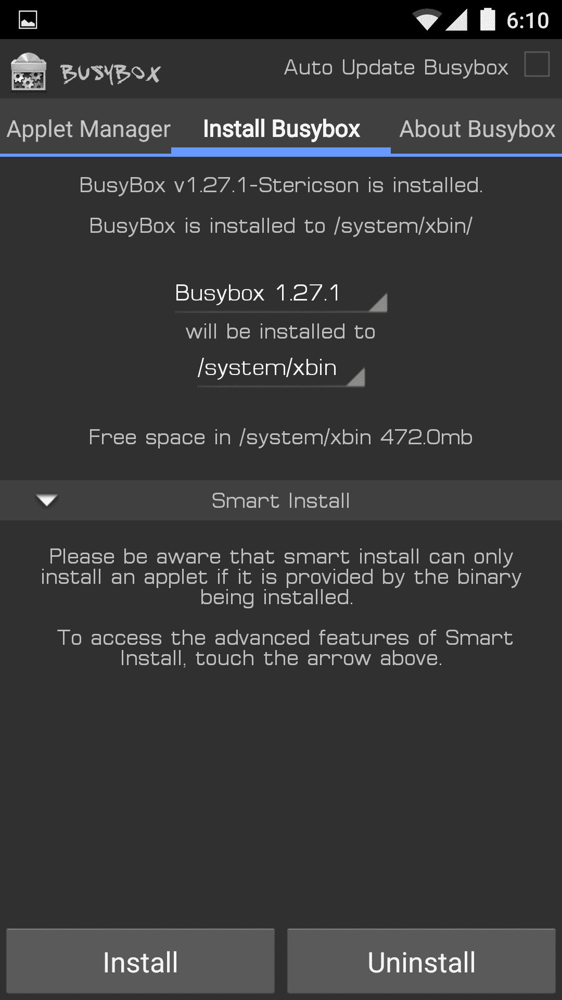

1.  接下来，我们打开 NetHunter，并从菜单中选择 Kali Chroot Manager：

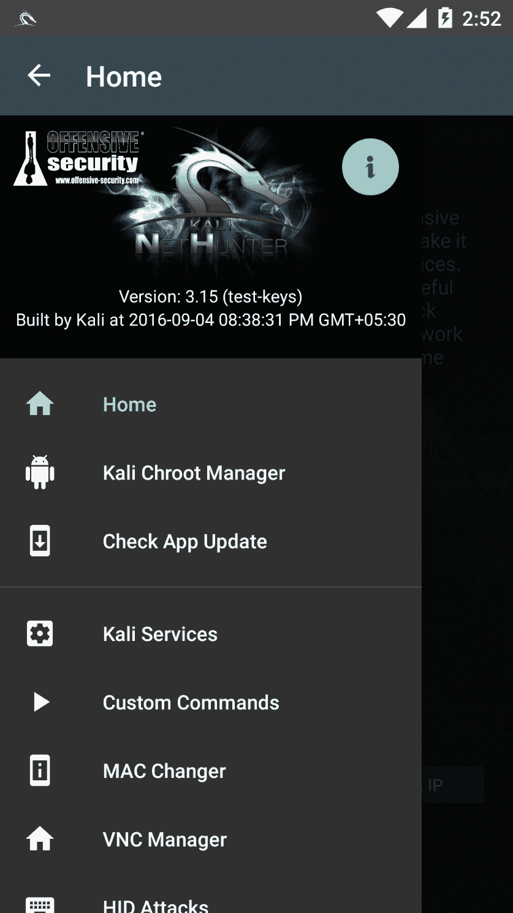

1.  我们点击添加 METAPACKAGES，然后我们将准备好进行下一个教程：

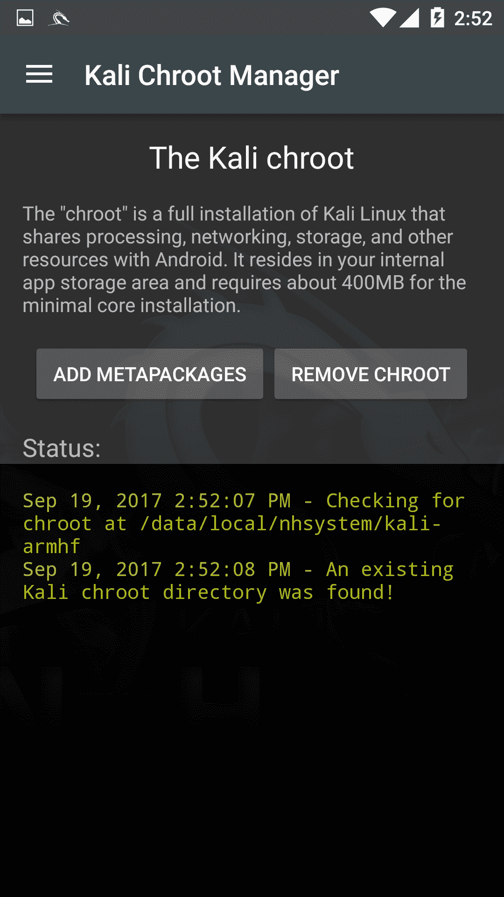

# 超人打字 - HID 攻击

NetHunter 具有一个功能，允许我们将我们的设备和 OTG 电缆行为键盘，因此可以在任何连接的 PC 上键入任何给定的命令。这使我们能够执行 HID 攻击。

“HID（人体接口设备）攻击向量是定制硬件和通过键盘仿真绕过限制的显着组合。因此，当我们插入设备时，它将被检测为键盘，并且使用微处理器和板载闪存存储，您可以向目标机器发送一组非常快速的按键，从而完全破坏它。”

- https://www.safaribooksonline.com/library/view/metasploit/9781593272883/

# 如何操作...

要执行 HID 攻击，请按照以下步骤进行操作：

1.  我们可以通过打开 NetHunter 应用程序来执行它们。

1.  在菜单中，我们选择 HID 攻击：

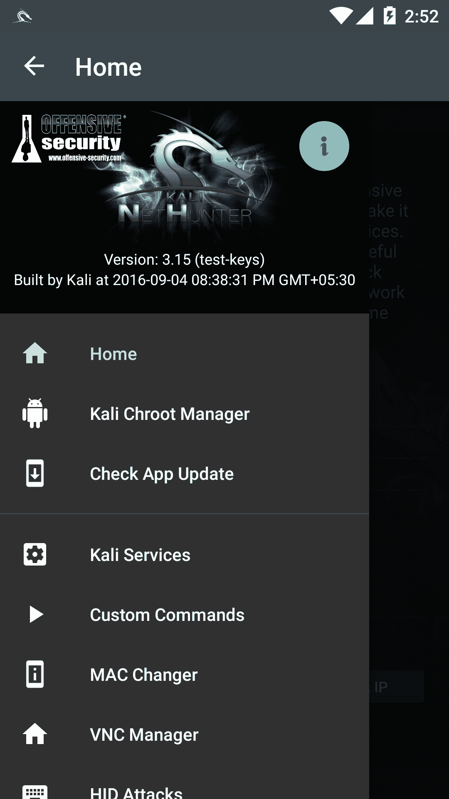

1.  我们将看到两个选项卡：PowerSploit 和 Windows CMD：


1.  让我们尝试 Windows CMD；在编辑源框中，我们可以输入要执行的命令。我们甚至可以从选项中选择 UAC Bypass，以便在不同版本的 Windows 上以管理员身份运行命令：

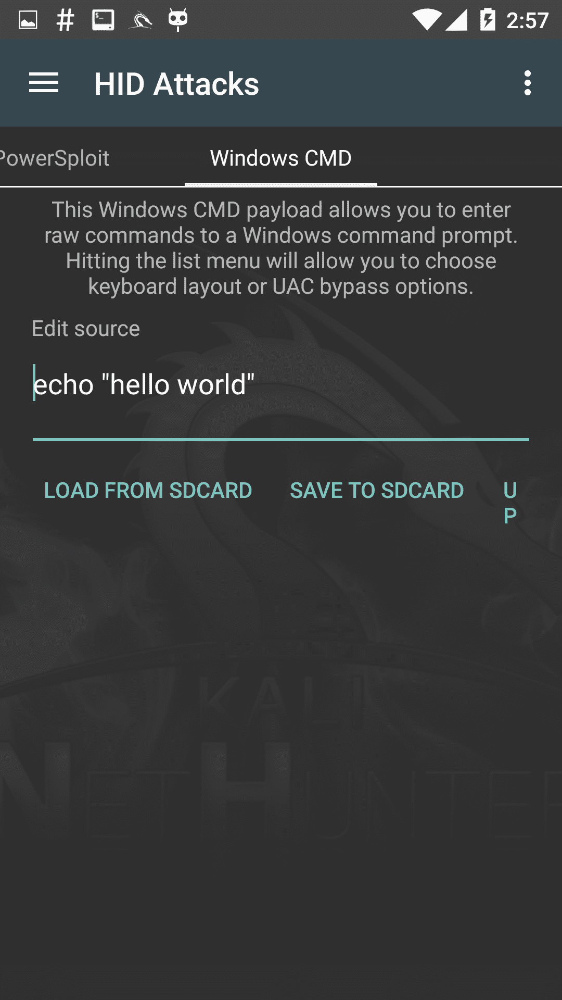

1.  我们从 UAC Bypass 菜单中选择 Windows 10，然后输入一个简单的命令：

```
        echo "hello world"  
```


1.  然后，我们将手机连接到 Windows 10 设备，并从菜单中选择执行攻击：

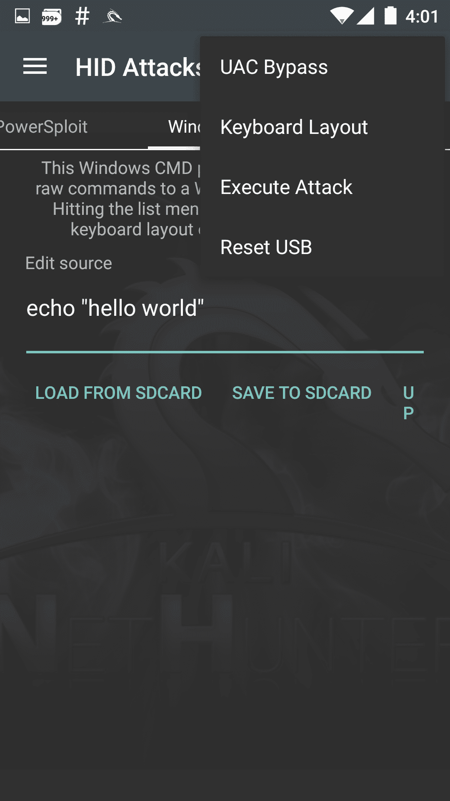

1.  我们将看到命令被执行：


有关更多信息，请访问[`github.com/offensive-security/kali-NetHunter/wiki/NetHunter-HID-Attacks`](https://github.com/offensive-security/kali-nethunter/wiki/NetHunter-HID-Attacks)。

# 我可以给手机充电吗？

在这个教程中，我们将看一种不同类型的 HID 攻击，称为 DuckHunter HID。这使我们能够将臭名昭著的 USB Rubber Ducky 脚本转换为 NetHunter HID 攻击。

# 如何操作...

要执行 DuckHunter HID 攻击，请按照以下步骤进行操作：

1.  我们可以通过打开 NetHunter 应用程序来执行它们。

1.  在菜单中，我们选择 DuckHunter HID 攻击。

1.  转换选项卡是我们可以输入或加载我们的脚本以执行的地方：


1.  让我们从使用一个简单的“Hello world！”脚本开始。

1.  我们在任何设备上打开文本编辑器，然后连接我们的设备并点击播放按钮。

1.  我们将看到这是自动在编辑器中输入的：

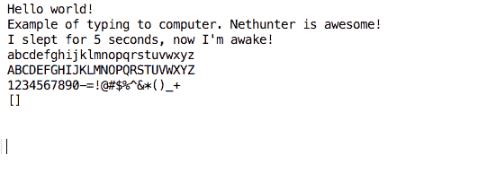

1.  互联网上有多个脚本可用于使用 NetHunter 执行多个攻击：


1.  这些可以下载并加载到 NetHunter 中，然后稍后用于利用受害者的 PC；列表可以在[`github.com/hak5darren/USB-Rubber-Ducky/wiki/Payloads`](https://github.com/hak5darren/USB-Rubber-Ducky/wiki/Payloads)找到。

更多信息可以在[`github.com/hak5darren/USB-Rubber-Ducky/wiki`](https://github.com/hak5darren/USB-Rubber-Ducky/wiki)找到。

# 设置一个邪恶的接入点

MANA 工具包是由 SensePost 创建的邪恶接入点实施工具包，可用于执行 Wi-Fi、AP 和 MITM 攻击。一旦受害者连接到我们的接入点，我们将能够执行多个操作，您将在本教程中了解到。

# 如何操作...

要设置一个邪恶的接入点，请按照以下步骤进行操作：

1.  这很容易使用。在 NetHunter 菜单中，我们选择 Mana Wireless Toolkit：


1.  它在常规设置选项卡中打开。在这里，我们可以选择接口和其他选项，比如捕获 cookies。这可以用来通过使用 NetHunter 支持的外部无线网卡执行恶意双胞胎攻击来执行无线攻击：

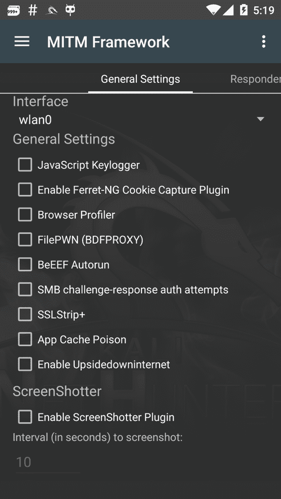

1.  在前几章中，您了解了 responder。我们可以通过这个工具包使用 responder 来捕获网络哈希。

1.  首先，我们连接到我们想要执行攻击的网络。

1.  接下来，我们切换到 Responder Settings 选项卡，并勾选我们希望执行的攻击。我们选择 wlan0 作为我们的接口。

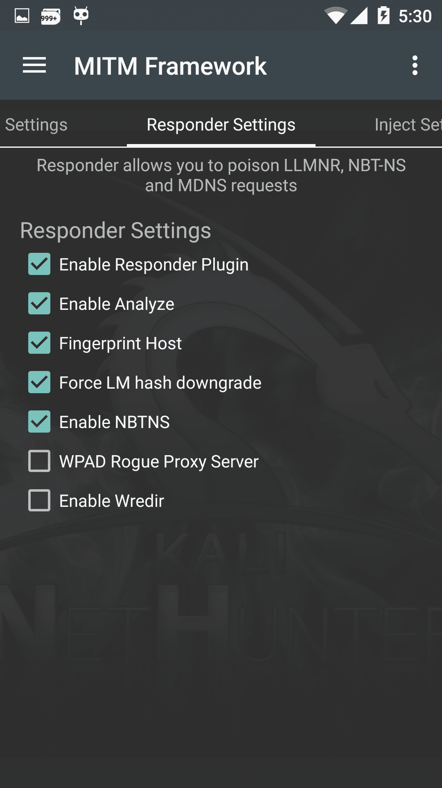

1.  要更改要监听的接口，我们切换到常规设置选项卡，并从下拉列表中选择接口列表中的接口：


1.  现在我们点击右侧选项菜单中的 Start mitm attack。

1.  我们将看到一个终端窗口打开，我们的攻击将被执行。我们将看到攻击捕获的主机信息以及密码哈希：

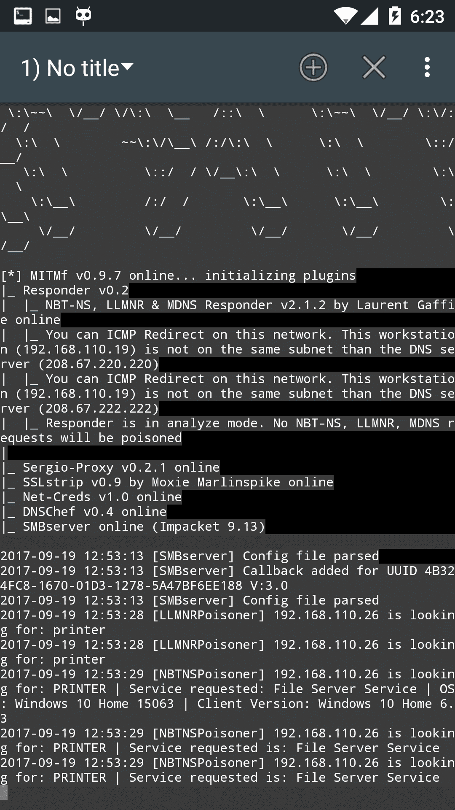

1.  同样，还有其他攻击，比如 Nmap 扫描、生成 Metasploit 有效载荷等。

有关更多信息，请访问[`github.com/offensive-security/kali-NetHunter/wiki`](https://github.com/offensive-security/kali-NetHunter/wiki)。
