# 第二章：网络信息收集

在本章中，我们将介绍以下教程：

+   发现网络上的活动服务器

+   绕过 IDS/IPS/防火墙

+   发现网络上的端口

+   使用 unicornscan 进行更快的端口扫描

+   服务指纹识别

+   使用 nmap 和 xprobe2 确定操作系统

+   服务枚举

+   开源信息收集

# 介绍

在本章中，我们将学习如何在网络上检测活动服务器和网络设备，并执行服务指纹识别和枚举以进行信息收集。收集信息对于成功的漏洞评估和渗透测试至关重要。接下来，我们将运行扫描程序来查找检测到的服务中的漏洞。除此之外，我们还将编写 bash 脚本，以便加快发现-枚举-扫描的过程。

# 发现网络上的活动服务器

在这个教程中，我们将学习如何使用两种方法进行网络设备/机器的发现：**被动信息收集**和**主动信息收集**。

作为被动信息收集的一部分，我们将检查环境的网络流量，然后进行主动信息收集，我们将向网络发送数据包以检测活动的机器和正在运行的服务。

## 准备工作

为了开始这个教程，我们将使用一个名为**netdiscover**的简单 ARP 嗅探/扫描工具。这是一个可以用于主动/被动 ARP 侦察的网络发现工具。

## 操作步骤...

让我们从被动侦察开始：

1.  要启动 netdiscover，请确保您通过 Wi-Fi 连接并具有有效的 IP 地址。打开终端并输入以下命令进行被动侦察：

```
netdiscover - p

```

输出将如下截图所示：


1.  要执行对网络的主动扫描以发现活动 IP，请在终端中输入以下命令：

```
netdiscover -i eth0

```

输出将如下截图所示：

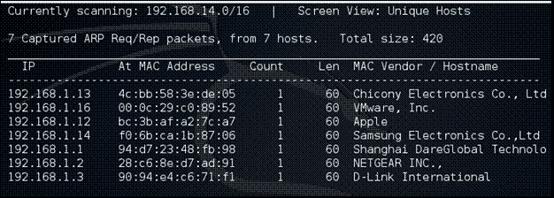

1.  如果您想保存 netdiscover 的输出，可以使用以下命令：

```
netdiscover -i eth0 > localIPS.txt

```

1.  几秒钟后（例如，10 秒），使用*Ctrl* + *C*终止程序，文件的输出将看起来像以下内容：

1.  另一种执行快速有效扫描的方法是使用`nmap`命令。要通过简单的 ping 扫描检测网络范围内的活动系统，请在终端中使用以下命令：

```
nmap -sP 192.168.1.0/24

```

输出将如下截图所示：

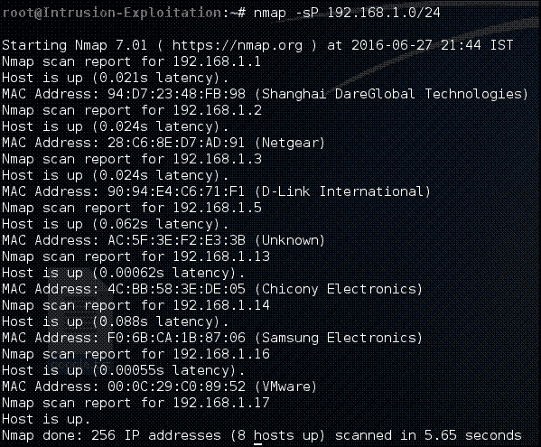

1.  您还可以将 nmap 工具的输出保存到文件中。我们所要做的就是添加一些 bash 脚本，并在终端中输入以下命令：

```
nmap -sP <IP address range>/<class subnet> | grep "report for" |        cut -d " " -f5 > nmapliveIPs.txt

```

让我们了解这个命令：第一个`nmap`命令的输出作为管道符后面的第二个命令的输入。在第二个命令中，grep 命令搜索包含"report for"的行，因为这将是指定 IP 正在响应的语句。找到包含"report for "的行的输出被转发到管道符后面的第三个命令。在第三个命令中，我们执行一个 cut 操作，我们说比较分隔符是"空格"在行中，并获取第 5 个字段，即在基于"空格"分隔的情况下的第五个单词。

文件的输出将只包含我们可以继续用于进一步评估的 IP 地址：


这个文件将用于进一步的引用，以自动化一系列扫描请求，因为所有 IP 都已经提取到一个文件中。

## 工作原理...

因此，我们使用的少数工具的工作原理如下：

+   `netdiscover`：此命令使用以下开关：

+   `-p`：此开关用于以被动模式运行；它确保不会自己发送任何数据包，只是作为我们网络接口卡上的监听器

+   `-i`：此开关用于指定用于检测活动 IP 的接口

我们还看到输出可以存储在文件中以供以后参考。

+   `nmap`：此命令使用以下开关：

+   `-sP`：此开关也被视为`-sn`开关，用于 ping 扫描

我们还使用了 bash 脚本将 ping 扫描的输出保存在文件中，调用了基本逻辑。

在本教程中，我们已经学会了如何检测网络中所有活动的 IP，并在下一个教程中对其进行了开放端口分析。

## 还有更多...

netdiscover 工具中提供了更多功能，可帮助加快流程。它们如下：

+   `-h`：此功能加载 netdiscover 使用的帮助内容

+   `-r`：此功能允许您执行范围扫描，而不是自动扫描

+   `-s`：此功能为您提供在每个请求之间休眠的选项

+   `-l`：此功能允许您提供一个包含要扫描的 IP 范围列表的文件

+   `-f`：此功能启用快速模式扫描；与正常检测技术相比，它节省了大量时间

nmap 工具还支持许多用于检测活动 IP 的选项：

+   `-sL`：这是一个简单的列表扫描，用于指定要检查的 IP 地址文件

+   `-sn`：这是一个简单的 ping 扫描程序，用于确定活动 IP。

+   `-PS`/`PA`/`PU`/`PY TCP SYN`/`ACK`：用于 UDP 或 SCTP 端口检测

+   `--traceroute`：此选项允许对每个主机进行跟踪跳径

## 另请参阅

有关主动和被动扫描以及更多相同工具的信息，请参阅以下链接：

+   [`tools.kali.org/tools-listing`](http://tools.kali.org/tools-listing)获取工具集

+   [`nmap.org/docs.html`](https://nmap.org/docs.html)

# 绕过 IDS/IPS/防火墙

在本教程中，我们将看一下 nmap 支持的一些开关，这些开关可用于绕过 IDS/IPS/防火墙。许多时候，当我们执行扫描时，我们会遇到防火墙。如果防火墙配置不正确，我们将能够执行 nmap 的以下防火墙规避命令。

## 准备就绪

我们将使用 nmap 进行此活动。让我们从我们已检测到的机器开始运行一些规避开关。

## 如何做...

对于本教程，我们将执行以下步骤：

1.  我们将使用分段数据包开关执行发现：

分段数据包开关将 TCP 标头分成几个数据包，以使数据包过滤器、入侵检测系统和其他麻烦更难检测到正在进行的活动扫描。可能会发生失败的情况，因为一些程序可能无法处理微小的数据包。要了解更详细的信息，请访问[`nmap.org/book/man-bypass-firewalls-ids.html`](https://nmap.org/book/man-bypass-firewalls-ids.html)。

我们将输入以下命令：

```
nmap -f <ip address>

```

输出将如下截图所示：

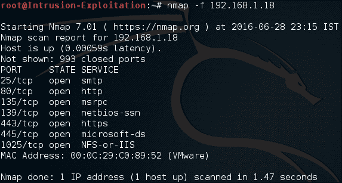

1.  另一个开关是 nmap 中可用的`mtu`开关，当我们执行分段扫描时，nmap 将数据包分成 8 字节或更少，因此要理解一个 30 字节的数据包将被分成 4 个数据包，重新指定`-f`后，数据包将被分成 16 字节，从而减少了片段，mtu 允许我们指定我们想要用于扫描目的的自己的偏移大小。

要在此处通过 MTU 执行规避，请在终端中输入以下命令：

```
nmap -mtu 24 <ip address>

```

### 注意

有关 MTU 开关的更多信息，请参阅[`nmap.org/book/man-bypass-firewalls-ids.html`](https://nmap.org/book/man-bypass-firewalls-ids.html)。

输出将如下截图所示：


1.  在这里，我们将使用欺骗攻击。在终端中输入以下命令：

```
nmap -D <Fake IP>,<Fake IP>,<Fake IP> <Real IP>

```

输出将如下截图所示：


1.  在这里，我们将进行自定义端口攻击。在终端中输入以下命令：

```
nmap -source-port 53 <IP address>

```

输出将如下截图所示：

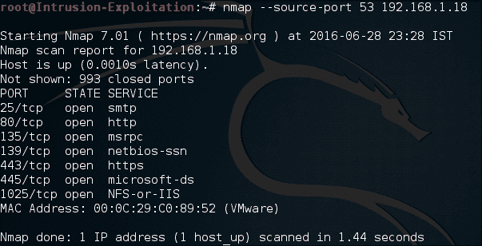

以下是一个示例，以帮助您更好地理解情景：


注意端口如何响应正常扫描与分段扫描。这表明我们能够绕过防火墙并检测到开放端口。

## 工作原理...

让我们了解这些开关是如何工作的：

+   `-f`：这种技术已经在配置错误的防火墙上使用了相当长的时间。它的作用是发送较小的数据包，以规避防火墙。

+   `-mtu <8,16,24,32>`：**MTU**代表**最大传输单元**。在这里，我们可以手动指定数据包的大小；一旦我们指定大小，nmap 将发送指定大小的数据包来执行扫描活动。

+   `-D`：这用于欺骗数据包，提及我们选择的源 IP，以便在日志中创建垃圾条目，并且很难定位扫描是从哪个系统发起的。

+   `--source-port`：大多数情况下，防火墙为网络中的各种设备设置了允许传入规则的特定端口。这可以通过使用可能在系统上允许传入访问的自定义源端口来利用，以执行扫描活动。

## 还有更多...

在规避标准中还有一些其他技术；例如，附加随机数据、MAC 欺骗和错误校验扫描。这可以作为自学内容。

# 发现网络上的端口

在这个示例中，我们将使用我们扫描并保存在文件中的活动 IP 列表来执行信息收集，目的是扫描这些 IP 上的开放端口。我们将使用 nmap 及其功能来发现开放端口。

## 准备就绪

我们将使用 nmap 工具来检测 IP 上的开放端口。让我们从检测特定 IP 上的开放端口的过程开始。

## 如何做...

对于这个示例，您需要执行以下步骤：

1.  我们将在终端中输入以下命令来运行 nmap：

```
nmap <ip address>

```

输出将如下截图所示：


1.  我们甚至可以通过使用详细开关来检查工具的操作，通过在终端中输入以下命令：

```
nmap -v <IP address>

```

输出将如下截图所示：

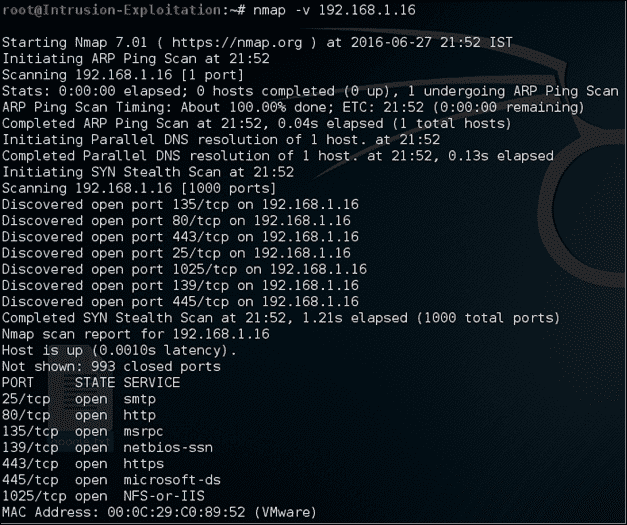

1.  默认情况下，它只扫描 1,000 个知名端口集。如果我们有兴趣将扫描偏好设置为前 100 个端口，我们可以在终端中运行以下命令：

```
nmap --top-ports <number> <ip address>

```

输出将如下截图所示：


1.  我们甚至可以将端口扫描限制为特定端口或 IP 的一系列端口。我们可以运行以下命令来查看相同的内容：

```
nmap -p <port range> <IP address>

```

输出将如下截图所示：


1.  可能存在这样的情况，我们想知道整个网络范围内有哪些 IP 运行了特定服务。我们在终端中运行以下命令：

```
nmap -p <port number> <IP address>

```

输出如下所示：

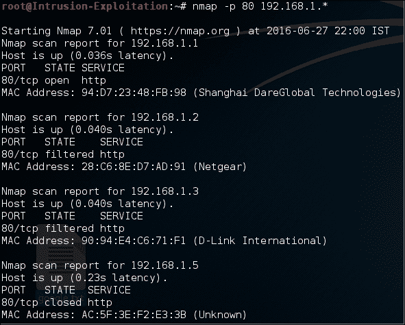

1.  假设我们想要检查特定系统上有哪些 UDP 端口是开放的。我们可以通过在终端中输入以下命令来检查：

```
nmap -sU <IP Address>

```

输出将如下截图所示：


1.  在上一个示例中，我们看到我们已经将活动 IP 的输出保存在一个文件中；现在让我们看看如何从文件中导入 IP 并执行简单的 TCP 扫描。

打开终端并输入以下命令，确保正确输入 IP 文件的路径：

```
nmap -sT -iL /root/nmapliveIPs.txt

```

输出将如下截图所示：


1.  可以使用以下命令将实时 IP 扫描结果保存在文件中：

```
nmap -sT -iL /root/nmapliveIPs.txt > openports.txt

```

1.  Nmap 还有一个图形化版本；它被命名为 zenmap，看起来如下：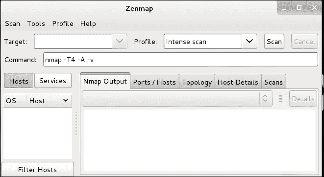

## 它是如何工作的...

让我们了解一下这些开关是如何工作的：

+   `Nmap <IP 地址>`：仅对著名端口执行 SYN 扫描，并得出基本信息

+   `-v`：切换到详细模式，从而提供有关扫描类型的更多信息

+   `--top-ports <number>`：这个开关告诉 nmap 从著名的端口库中扫描给定数量的端口

+   `-p`：这个开关告诉 nmap 它应该只扫描开关后面提到的端口号

+   `-sU`：这是 nmap 中的一个 UDP 开关，告诉它通过发送 UDP 数据包并检测相应的响应来扫描开放端口

+   `-sT`：这是一个 TCP 开关，告诉 nmap 与目标网络建立连接，以确保端口确实是打开的

+   `-iL`：这个开关告诉 nmap 输入可以从`-iL`开关后面提到的文件中获取

在这个配方中，我们已经看到了如何检测开放端口；这将帮助我们进行接下来的配方。

## 还有更多...

nmap 中还有许多其他选项，可以用来扫描基于协议的开放端口，以及其他有效扫描技术，尝试保持对网络中运行的扫描器的低级别检测。工具中有用的命令如下：

+   `-sS`：这个命令执行一个 SYN 扫描（最快和最准确的扫描-推荐）

+   `-sX`：这个命令执行一个 Xmas 扫描

+   `-sF`：这个命令执行一个 FIN 扫描

+   `-sN`：这个命令执行一个 Null 扫描

+   `-sU`：这个命令执行一个 UDP 扫描。然而，它并不是很准确，因为 UDP 是无状态的

## 另请参阅

+   对于 Zenmap（nmap 的图形化版本），我们建议您访问[`nmap.org/book/man-port-scanning-techniques.html`](http://nmap.org/book/man-port-scanning-techniques.html) 作为参考。它可以在**Kali Linux** | **信息收集** | **网络扫描仪** | **Zenmap**下找到

# 使用 unicornscan 进行更快的端口扫描

Unicornscan 是另一个工作非常快的扫描器，其核心原因是工具实现的方法。它使用异步无状态 TCP 扫描的技术，在其中对 TCP 标志和 UDP 进行所有可能的变化。在这个配方中，我们将看看如何利用 unicornscan 及其高级功能。

## 准备工作

为了开始使用 unicornscan，我们将从我们的 IP 范围中取一个 IP，并深入了解工具的功能。

## 如何操作...

让我们按照以下步骤进行：

1.  打开终端并输入以下命令进行简单的 unicornscan：

```
unicornscan <IP address>

```

输出将如下截图所示：


1.  如果您想在执行命令时看到它正在做什么的细节，我们可以使用以下命令使用详细脚本：

```
unicornscan -v <IP address>

```

输出将如下截图所示：

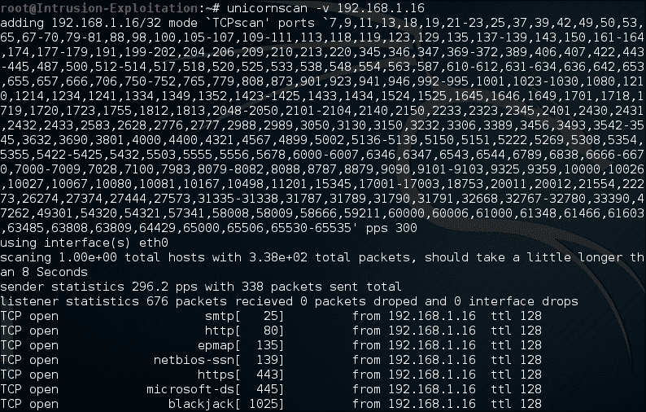

我们可以看到它在执行扫描时考虑的端口。

1.  假设我们也想对 UDP 进行相同的操作。在终端中输入以下命令：

```
unicornscan -v -m U <IP address>

```

输出将如下截图所示：


1.  还有更多选项可用。要检查它们，请在终端中输入以下命令：

```
Unicornscan -h

```

输出将如下截图所示：


## 它是如何工作的...

配方中提到的命令的工作如下：

+   `Unicornscan <IP 地址>`：在这种情况下，unicornscan 运行默认的`TCP SYN`扫描（unicornscan 中的参数将是`-mTS`在 IP 上）并扫描`unicornscan.conf`文件中的快速端口，该文件位于`/etc/Unicornscan/unicornscan.conf`。

+   `-v`：这个开关告诉扫描器进入详细模式，并提供更多关于它在执行扫描时正在做什么的信息。

+   -m U：`-m`开关代表要使用的扫描模式。在这种情况下，我们使用了`U`，这意味着扫描类型应该是 UDP。

在这个示例中，我们已经看到了如何有效地使用 unicornscan 获取有关开放端口的信息，并且我们可以在不同的开关之间切换。

## 还有更多...

unicornscan 中还有许多其他可用于改进扫描偏好的开关。建议尝试并熟悉它们：

```
Unicornscan -h

```

# 服务指纹识别

在这个示例中，我们将看看如何分析开放端口，以确定开放端口上运行的是什么样的服务。这将帮助我们了解目标 IP 是否运行了任何易受攻击的软件。这就是为什么服务指纹识别是一个必要且非常重要的步骤。

## 准备工作

我们将使用 nmap 对目标 IP 的服务进行指纹识别。Nmap 是一个多功能工具，可以从主机发现到漏洞评估；服务指纹识别也是其中的一部分。

## 操作步骤...

步骤如下：

1.  使用 nmap，在终端中运行以下命令以获得服务枚举结果：

```
nmap -sV <IP address>

```

输出将如下截图所示：

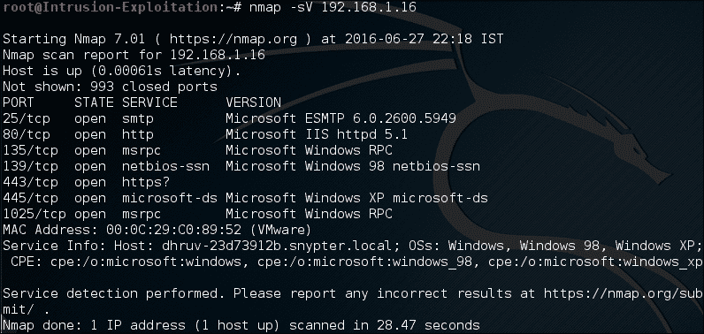

1.  我们甚至可以使用 UDP 扫描开关以及服务检测开关来枚举目标 IP 上运行的 UDP 服务：

```
Nmap -sU -sV <IP address>

```

输出将如下截图所示：


1.  我们可以使用以下命令加快扫描速度：

```
nmap -T4 -F -sV  <IP address>

```

有关使用的开关的详细信息在*工作原理*部分提供。要获取更多详细信息，请访问[`nmap.org/book/man-port-specification.html`](https://nmap.org/book/man-port-specification.html)和[`nmap.org/book/man-version-detection.html`](https://nmap.org/book/man-version-detection.html)。

输出将如下截图所示：


在这里我们可以看到正常扫描和定时扫描之间的差异几乎是 60 秒以上。

## 工作原理...

以下是我们使用的开关列表及其解释，以便更好地理解：

+   `-sV`：这代表版本检测；它探测所有开放端口，并尝试解析抓取的横幅信息以确定服务版本。

+   `-T4`：`T`代表精细的时间控制，`4`代表执行扫描的速度级别。时间范围从 0 到 5：(0)患妄想症，(1)鬼鬼祟祟，(2)礼貌，(3)正常，(4)侵略性，(5)疯狂。(0)和(1)通常有助于 IDS 逃避，而(4)告诉 nmap 假设我们在一个快速可靠的网络上，从而加快扫描速度。

+   `-F`：这是快速模式；它扫描的端口比默认扫描少。

在这个示例中，我们已经学会了如何使用 nmap 对开放端口进行指纹识别，以检测运行的服务及其相应的版本。这将在以后帮助我们检测操作系统。

## 还有更多...

我们甚至可以查看 Kali 发行版中提供的其他工具，这些工具处理服务枚举。我们可以检查一些列在**Kali Linux** | **信息收集** | **<services>**下的工具。

在 nmap `-sV`检测中还有详细的开关可用：

+   `--all-ports`：这告诉 nmap 确保对所有开放端口上运行的服务版本进行指纹识别。

+   `--version-intensity`：这告诉 nmap 使用强度值从 0 到 9 进行扫描，9 是最有效的指纹识别。

端口枚举后，攻击者可以通过一些谷歌搜索或查看[exploit-db.com](http://exploit-db.com)、[securityfocus.com](http://securityfocus.com)等网站，找出端口上运行的软件版本是否容易受到攻击向量的影响。

# 使用 nmap 和 xprobe2 确定操作系统

在这个配方中，我们将使用工具来确定目标 IP 正在运行的操作系统类型。将目标 IP 与相应的操作系统进行映射是必要的，以帮助筛选和验证漏洞。

## 准备工作

在这个配方中，我们将使用 nmap 工具来确定操作系统。我们只需要一个 IP 地址，针对该地址我们将运行 OS 枚举扫描。其他可以使用的工具包括 hping 和 xprobe2。

## 如何做...

让我们开始确定操作系统：

1.  打开终端并输入以下内容：

```
nmap -O <IP address>

```

输出将如下截图所示：

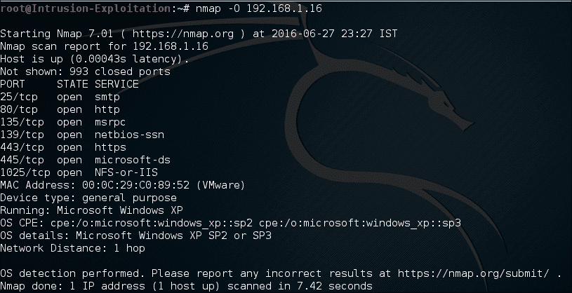

我们可以使用高级运算符以更积极的方式找出操作系统。在终端中输入以下命令：

```
nmap O --osscan-guess <IP address>

```

输出将如下截图所示：


这表明使用 nmap 中操作系统检测的其他参数，我们可以得到最佳匹配的可能想法。

1.  Xprobe2 使用了与 nmap 不同的方法。它使用模糊签名匹配来提供可能的操作系统。打开终端并输入以下命令：

```
xprobe2 <IP Address>

```

输出将如下截图所示：


我们无法确定哪种扫描器是最好的，因为每个扫描器都有其自己的实现方法。为了证明我们所说的，让我们看看以下情景。我们设置了一个用于枚举操作系统的常见目标。目标是[www.google.com](http://www.google.com)。

以下截图显示了 nmap 的结果：

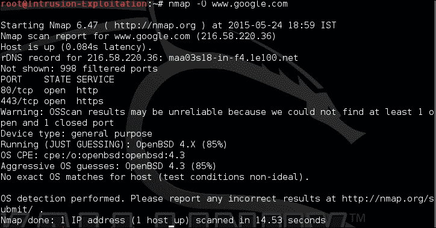

以下截图显示了 Xprobe 的结果：


## 它是如何工作的...

Nmap 执行基于 TCP/IP 堆栈指纹识别的操作系统确定活动。它发送一系列数据包，包括 TCP 和 UDP 数据包，并分析所有响应。然后将它们与 nmap 引擎中可用的签名进行比较，以确定最佳匹配的操作系统，并告诉我们目标机器的操作系统可能是什么。在前面的情景中，有一个目标 IP 没有提供任何操作系统详细信息；这是因为 nmap 工具无法将任何响应与工具中可用的签名匹配。

让我们看一下上面使用的开关的一些细节：

+   `-O`参数使 nmap 引擎开始根据从横幅检索到的信息来确定可能的操作系统。它提到，如果在目标 IP 上找到一个开放和一个关闭的 TCP 端口，那么它会更有效。 

+   `--osscan-guess`参数使 nmap 引擎在无法找到完美匹配时显示检测到的签名的最佳可能匹配项。

Xprobe2 有大约 14 个模块，可用于扫描远程目标上运行的操作系统的检测。

在这个配方中，我们学习了如何有效地使用不同的扫描器确定操作系统。我们现在将使用这些信息来继续下一个配方。

## 还有更多...

nmap 操作系统发现模块中还有其他选项，如下所示：

+   `--osscan-limit`：此参数将仅限于有希望的目标进行检测；如果它没有找到任何端口打开，它将跳过目标。这在扫描多个目标时节省了大量时间。

+   `--max-os-tries`：这用于设置 nmap 应尝试检测的次数。默认情况下，它尝试五次；这可以设置为较低的值以避免耗时。

# 服务枚举

一旦服务被指纹识别，我们就可以执行枚举。可以使用许多不同的来源来实现这个配方的目标。在这个配方中，我们将看看如何使用各种工具执行服务发现扫描，包括以下内容：

+   SMB 扫描

+   SNMP 扫描

+   使用**NSE**（**nmap 脚本引擎**）引擎

**Nbtscan**是 Kali 中的一个脚本，用于枚举目标 IP 的 NetBIOS 名称。它可以用作 SMB 枚举的早期部分。它基本上请求以人类可读格式的 NetBIOS 名称的状态查询。

## 准备工作

在本教程中，我们将使用工具枚举上述所有服务。

## 如何做...

对于本教程，步骤如下：

1.  为了枚举 NetBIOS 名称，我们将在终端中运行以下命令：

```
nbtscan <IP address>

```

输出将如下截图所示：


1.  您还可以在终端中使用以下命令对类范围进行 NetBIOS 枚举：

```
nbtscan -r <IP address>/<class range>

```

输出将如下截图所示：


1.  要执行 SMB 扫描，我们可以使用命令如`enum4linux`。在终端中输入以下命令开始 SMB 扫描：

```
enum4linux <IP address>

```

输出将如下截图所示：


此外，它甚至提供共享枚举信息以检查系统上可用的共享：

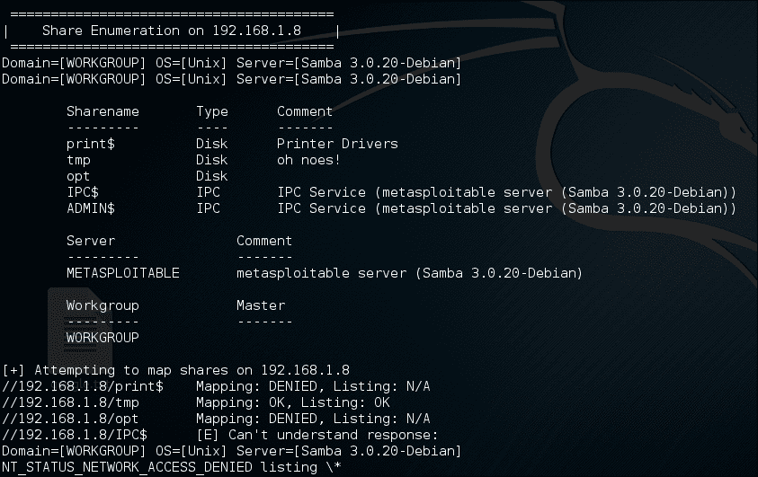

它甚至显示了目标上的密码策略（如果有的话）：


正如您所看到的，enum4 Linux 是一个强大的工具，特别是在启用空会话的情况下。

### 注意

从维基百科了解空会话的参考：空会话是对基于 Windows 的计算机上的进程间通信网络服务的匿名连接。该服务旨在允许命名管道连接。但是，它可以被利用来检索信息。要了解空会话的基本知识，请访问[`www.softheap.com/security/session-access.html`](http://www.softheap.com/security/session-access.html)。可以在[`pen-testing.sans.org/blog/2013/07/24/plundering-windows-account-info-via-authenticated-smb-sessions`](https://pen-testing.sans.org/blog/2013/07/24/plundering-windows-account-info-via-authenticated-smb-sessions)上了解详细的渗透测试场景。

1.  让我们继续进行 SNMP 扫描。为此，我们将使用一个名为 SnmpWalk 的扫描工具，并开始浏览**MIB**（**管理信息库**）树。

首先在终端中输入以下命令：

```
snmpwalk -c public -v1 <IP address>

```

输出将如下截图所示：

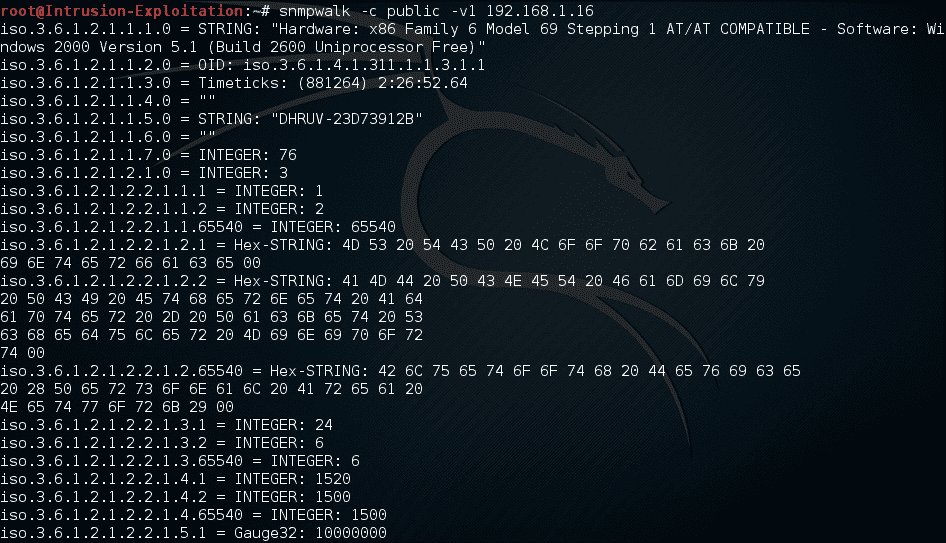

1.  当我们尝试访问 SNMP 服务时，我们可以看到获取了大量信息，默认字符串为 public，如果未更改。为了确保我们不会获取太多信息，并且有序地请求信息，我们可以利用 MIB 树。

例如，如果我们希望仅提取系统用户，则可以使用此值`1.3.6.1.4.1.77.1.2.25`，在终端中输入以下命令：

```
snmpwalk -c public -v1 <IP address> <MIB value>

```

输出将如下截图所示：


1.  我们将使用 nmap 查找开放端口的漏洞。Nmap 有一个用于评估目的的脚本的大列表，可以在`/usr/share/nmap/scripts/`中找到。输出将如下截图所示：

这些脚本需要不时更新。

选择目标后，我们将对其运行 nmap 脚本。

1.  打开终端并输入以下命令以执行脚本扫描：

```
nmap -sC <IP address >

```

### 注意

这将运行与开放端口匹配的所有可能的脚本。

输出将如下截图所示：

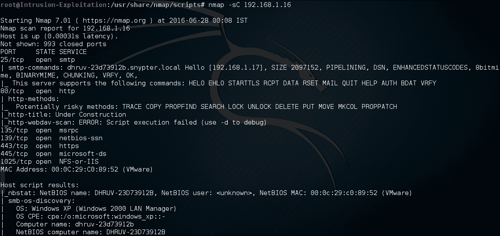

1.  我们甚至可以将扫描范围缩小到特定服务。在终端中键入以下命令，仅运行与 SMB 服务相关的所有枚举脚本：

```
nmap -sT --script *smb-enum* <IP address>

```

输出将如下截图所示：

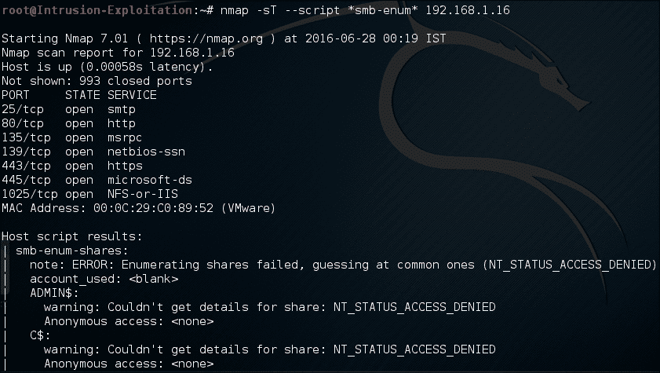

1.  但是，我们应该意识到有一些脚本可能会在尝试分析目标是否容易受攻击时使服务停滞或崩溃。这些可以通过使用不安全的参数来调用，例如在终端中输入以下命令：

```
nmap -sT -p 139,443 --script smb-check-vulns --script-      args=unsafe=1 <IP address>

```

输出如下截图所示：

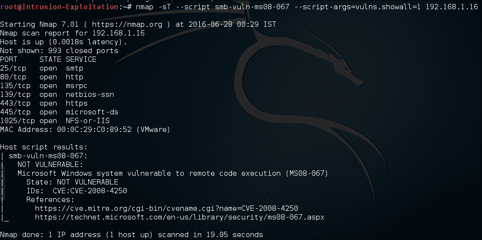

这告诉我们端口是否容易受到任何攻击。

## 它是如何工作的...

让我们了解一下本教程中使用的一些开关：

在 Nbtscan 中，我们使用了`-r`开关，告诉 nbtscan 扫描给定的整个类网络/子网；它查询 UDP 端口`137`上的所有系统。此端口有一个服务引用为“网络邻居”，也称为 netbios。当此端口接收到查询时，它会响应该系统上所有正在运行的服务。

`enum4linux`是一个枚举几乎所有可能信息的脚本，包括 RID 循环、用户列表、共享枚举、识别远程操作系统的类型、正在运行的服务是什么、密码策略等等，如果目标 IP 容易受到空会话认证的攻击。

以下是 SnmpWalk 中使用的开关：

+   `-c`：此开关告诉 SnmpWalk 它是什么类型的社区字符串。默认情况下，SNMP 社区字符串是 public。

+   `-v1`：此开关指定 SNMP 版本为 1。我们甚至可以使用 2c 或 3，这取决于它正在运行的 SNMP 服务版本的类型。

+   `dnsenum`：这是一个 DNS 枚举工具。它基本上从 DNS 服务器中枚举所有与 DNS 相关的信息，并检查是否可能进行区域传输。

+   `-sC`：此开关使 nmap 能够运行默认 NSE 脚本，用于检测目标 IP 上检测到的所有开放端口，从存储库中。

+   `--script`：此开关使我们能够指定要执行的脚本。我们可以使用正则表达式，如前面的示例所示。

+   `--script-args=unsafe=1`：此开关使 nmap 能够运行危险的脚本，以评估端口是否容易受到某种攻击。之所以不是默认脚本分析的一部分，是因为有时这些脚本可能导致远程服务崩溃并变得不可用，导致 DOS 情况。

在这个教程中，我们学习了如何在 nmap 检测到的服务上运行不同的脚本，以及如何运行危险的枚举脚本。

## 还有更多...

建议为了更好地运行脚本，我们应该使用 Zenmap。我们可以创建一个配置文件并选择要执行的脚本。

在 Zenmap 中，转到**配置文件** | **新配置文件**或**命令** | **脚本**，并选择要测试的脚本。

# 开源信息收集

在这个教程中，我们将看看如何使用专为在线信息收集而设计的工具。我们将介绍用于收集有关 Whois、域工具和 MX 邮件服务器信息的工具。Shodan 是一个强大的搜索引擎，可以在互联网上为我们定位驱动器。借助各种过滤器，我们可以找到有关我们目标的信息。在黑客中，它也被称为世界上最危险的搜索引擎。

## 准备工作

我们将利用诸如 DNsenum 之类的工具进行 Whois 枚举，找出与域相关的所有 IP 地址，以及 Shodan 如何为我们提供所搜索目标的开放端口信息。

## 如何操作...

步骤如下：

1.  对于 DNS 扫描，我们将使用一个名为 DNsenum 的工具。让我们从在终端中输入以下命令开始：

```
dnsenum <domainname>

```

输出如下截图所示：

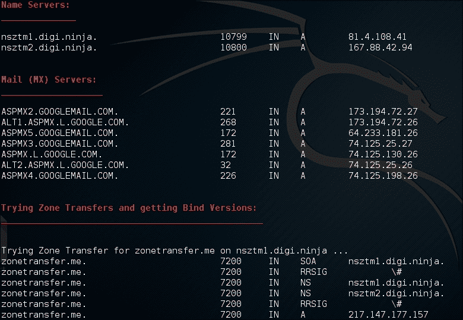

1.  我们还可以使用可用于通过谷歌抓取搜索更多子域的功能。输入以下命令：

```
dnsenum -p 5 -s 20 facebook.com

```

输出如下截图所示：

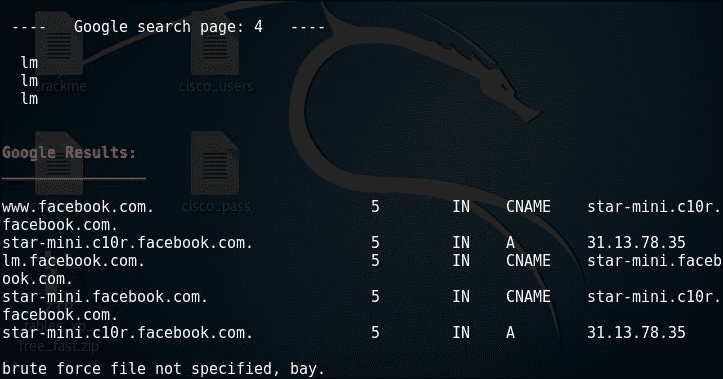

正如我们所看到的，`p`和`s`开关告诉 dnsenum 在 4 页谷歌搜索中搜索，并从谷歌中拉取最大数量的抓取条目。

1.  dnsenum 的另一个特性是提供一个子域字典文件列表，以查找有效的子域和它们的地址。可以通过发出以下命令来完成相同的操作：

```
 dnsenum -f subdomains.txt facebook.com

```

在这里，子域是可能的子域的自定义列表，我们得到以下输出：


回到简单的 DNS 枚举，我们执行了上面的操作，观察到输出包含大量信息，因此最好将输出保存在文件中。一种选择是使用以下命令将输出推送到文件中：

```
dnsenum <domain name> > dnsenum_info.txt

```

输出将如下截图所示：


然而，如果我们需要将输出枚举用于另一个工具，我们必须使用 dnsenum 提供的开关以 XML 格式输出，因为大多数工具支持 XML 导入功能。使用以下命令：

```
dnsenum -o dnsenum_info <domain name>

```

输出将如下截图所示：


1.  当我们使用 head 命令输出文件时，我们得到以下内容：

1.  `dnsenum`命令为您提供了有关目标的大量信息：

+   名称服务器：名称服务器是处理有关域名各种服务位置的查询的服务器

+   MX 记录：这指定了与给定主机的邮件服务器对应的 IP。

+   主机地址：这指定了服务器托管的 IP 地址

+   子域：主站点的一个子集；例如，[mail.google.com](http://mail.google.com)和[drive.google.com](http://drive.google.com)是[google.com](http://google.com)的子域。

+   反向查找：查询 DNS 服务器以查找域名的 IP 地址

1.  在[`www.shodan.io`](http://www.shodan.io)上注册 Shodan，并单击“探索”以浏览可见的功能列表。

1.  现在转到网络摄像头部分，您将看到所有具有网络摄像头服务器运行在其系统上的 IP 列表。

1.  假设您设法获取了目标 IP 或 Web URL；只需在搜索过滤器中输入 IP，就可以检索大量信息，如下截图所示：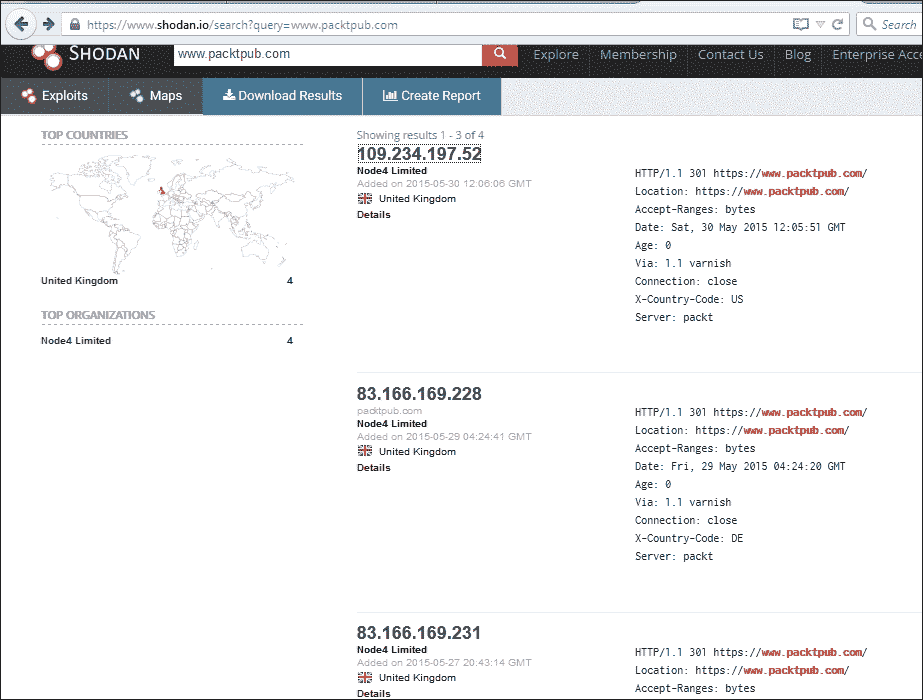

1.  假设您想要检查属于某个国家的所有服务器；在搜索过滤器中，输入`Country:IN`。

您可以看到它获取了大量的输出：


1.  这是特定 IP 地址的输出方式：

1.  在左上角，当您单击**查看全部...**选项卡时，您将获得 Shodan 所有可用功能的列表：

正如我们所看到的，提供的功能数量是庞大的。我们应该花时间逐一探索所有选项。

## 工作原理...

`dnsenum <domain name>`语法查询所述域名的 DNS 服务器，然后是名称服务器和邮件服务器。它还执行检查是否可以进行区域传输。

使用的命令如下：

+   `-o`：当与文件名一起指定时，这将提供所做的 DNS 枚举的基于 XML 的输出

+   `-p = pages <value>`：在抓取名称时要处理的谷歌搜索页面数；默认为 20 页；必须指定`-s`开关

+   `-s = scrap <value>`：从谷歌中抓取的子域的最大数量

+   `-f, = file <file>`：从此文件中读取子域以执行暴力破解

Shodan 有一个庞大的过滤器列表；上面使用的过滤器如下：

+   **国家**：这指定了搜索给定目标的国家；通常由国家代码标识

## 还有更多...

可以通过使用 Shodan 搜索引擎进行更多的信息收集。

Shodan 搜索引擎允许用户通过不同的过滤器组合在互联网上找到特定类型的计算机或设备。这可以是一个收集有关目标信息的重要资源。我们可以通过访问[`www.shodanhq.com/help/filters`](http://www.shodanhq.com/help/filters)了解更多关于 Shodan 过滤器的信息。
