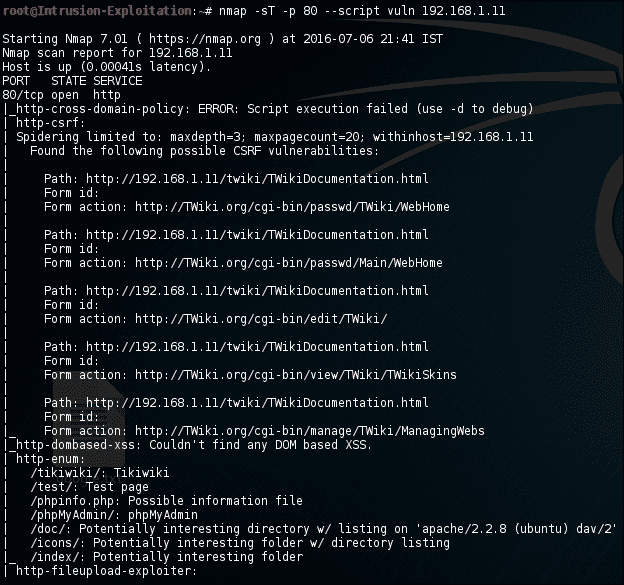
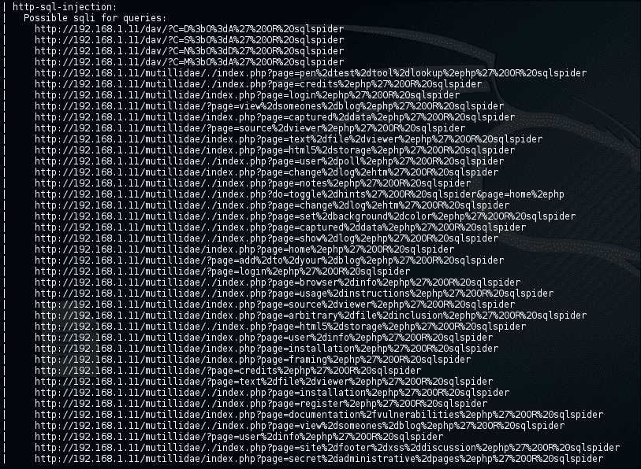
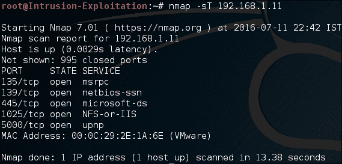
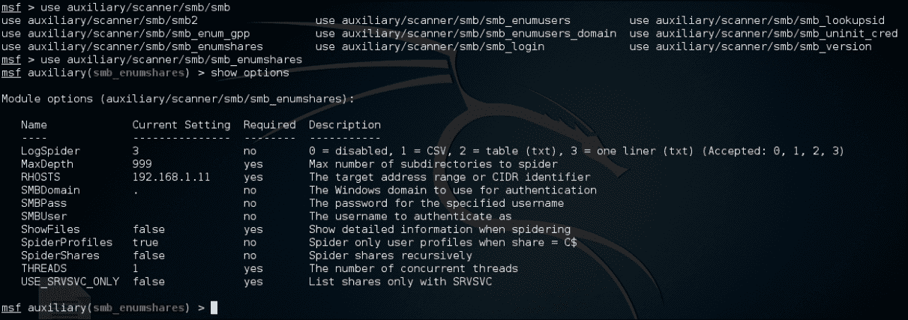
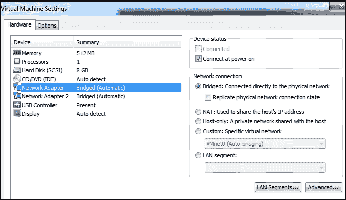
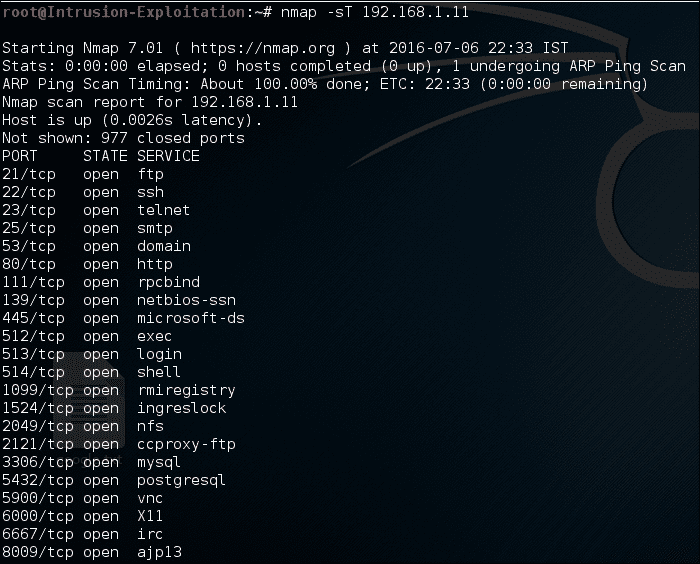
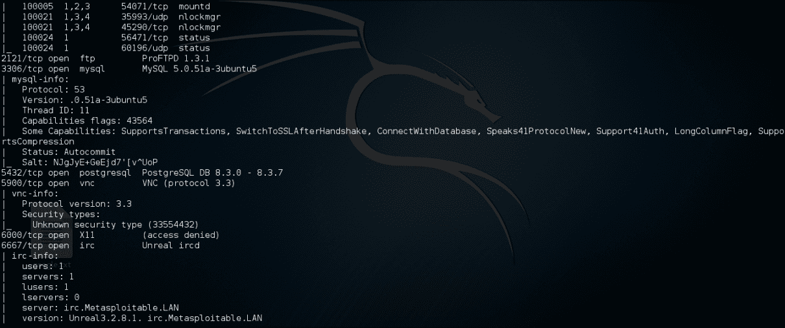
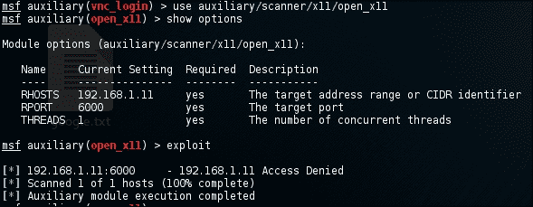
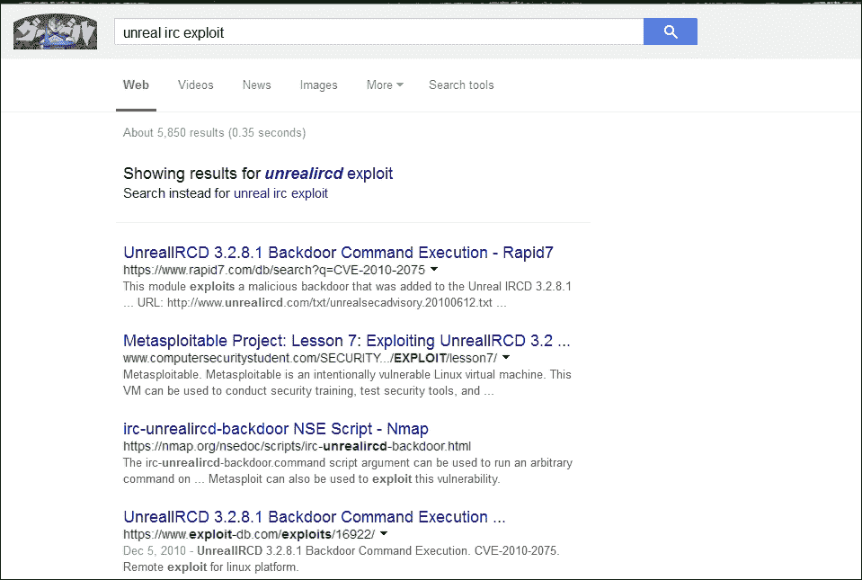

# 第三章：网络漏洞评估

在本章中，我们将涵盖以下内容：

+   使用 nmap 进行手动漏洞评估

+   将 nmap 与 Metasploit 集成

+   使用 Metasploit 进行 Metasploitable 评估的详细步骤

+   使用 OpenVAS 框架进行漏洞评估

# 介绍

之前，我们已经涵盖了在网络上发现活动服务器以及服务枚举。在这里，我们将讨论什么是漏洞评估。漏洞评估是一个过程，测试人员旨在确定端口上运行的服务，并检查它们是否存在漏洞。当利用漏洞时，可能会导致我们获得未经身份验证的访问、拒绝服务或信息泄露。漏洞评估是必不可少的，因为它给我们提供了被测试网络安全的全面图景。

在本章中，我们将检查运行在开放端口上的服务是否存在漏洞。了解服务运行的操作系统非常重要，因为这是在涉及远程代码执行的漏洞发现中的关键因素之一。原因是不同操作系统上的相同服务由于架构差异将具有不同的漏洞利用。让我们谈谈一个漏洞：SMB 服务，根据 MS08-067 netapi 漏洞是易受攻击的。这个漏洞存在于旧的 Windows 系统上，但在新系统上不存在。例如，Windows XP 容易受到这种攻击的影响；然而，Windows Vista 不会，因为它已经修补了。因此，了解系统正在运行的操作系统和服务包版本，以及开放端口上的服务，如果要发现任何漏洞，这是非常重要的。在本章中，我们将学习在目标 IP 上检测漏洞的不同方法。

# 使用 nmap 进行手动漏洞评估

到目前为止，很明显 nmap 从 IP 发现开始就扮演着非常重要的角色。nmap 还具有漏洞评估功能，通过**Nmap 脚本引擎**（**NSE**）实现。它允许用户运行漏洞检测脚本。NSE 包含一组非常庞大的脚本，涵盖了从发现到利用的各种脚本。这些脚本位于`nmap`文件夹中，并按其类别进行了分离。可以通过阅读位于`nmap`文件夹中的`scripts.db`文件更好地理解这些类别。然而，在本章中，我们将限制自己只进行漏洞检测。

## 准备工作

为了开始本章，我们将使用 nmap 来检查位于`scripts`文件夹下的 nmap 中的 NSE 脚本。为了演示目的，我们将使用 Metasploitable 2 和 Windows XP SP1。

## 如何做...

此食谱的步骤如下：

1.  我们应该首先看看 NSE 脚本的位置。输入以下命令：

```
ls /usr/share/nmap/scripts/

```

输出将如下截屏所示：


1.  为了了解这些脚本属于的所有不同类别，输入：

```
cat /usr/share/nmap/scripts/script.db | grep "vuln"

```

输出将如下截屏所示：


1.  您可能会注意到前面的截图中有一个名为`vuln`的类别。我们将主要使用这个类别。要运行简单的`vuln`类别扫描，请在终端窗口上使用以下命令：

```
nmap -sT --script vuln <IP Address> 

```

1.  假设我们只想快速评估几组端口。我们可以运行基于端口的`vuln`评估扫描：

```
nmap -sT -p <ports> --script vuln <IP Address>

```

输出将如下截屏所示：



我们可以看到它揭示了很多信息，并向我们展示了许多可能的攻击向量；它甚至检测到了 SQL 注入以进行潜在攻击：



1.  假设我们想知道脚本类别`vuln`的详细信息。我们可以通过在终端中输入以下命令来简单检查：

```
nmap --script-help vuln

```

输出将如下截屏所示：


1.  让我们检查远程运行的机器是否容易受到 SMB 的攻击。我们首先找出 SMB 端口是否开放：

```
nmap -sT -p 139,445 <IP address>

```

输出将如下截屏所示：



1.  一旦我们检测到端口是开放的，我们运行一个`smb`漏洞检测脚本，如下所示：

```
nmap -sT -p 139,445 --script smb-vuln-ms08-067 <IP address>

```

输出将如下截屏所示：


因此，可以使用 nmap 中可用的各种带有`vuln`类别的脚本对目标 IP 进行评估，并根据端口和服务运行情况找出漏洞。

## 工作原理...

理解所有参数相当容易；我们一直在玩 NSE 引擎中可用的脚本。让我们了解一下这种方法中使用的一些命令：

+   `scripts.db`文件包含了所有 NSE 分类信息，用于指定哪些脚本可以被视为特定类型的漏洞。有不同的类别，如`auth`、`broadcast`、`brute`、`default`、`dos`、`discovery`、`exploit`、`external`、`fuzzer`、`intrusive`、`malware`、`safe`、`version`和`vuln`。

+   在前面的示例中，我们使用了带有`vuln`参数的`nmap`命令。我们只是指示 nmap 使用`vuln`类别并运行所有类别为`vuln`的脚本。

### 注意

这个扫描需要很长时间，因为它将在许多检测到的开放端口上运行许多漏洞评估。

+   在某个时候，我们为`vuln`类别扫描指定了一个额外的端口参数。这只是确保脚本仅在指定的端口上运行，而不是其他端口，从而节省了我们大量的时间。

+   `--script-help <filename>|<category>|<directory>|<expression>|all[,...]`命令是 NSE 引擎的帮助功能。`help`命令应始终与 NSE 脚本的类别或特定文件名或表达式一起使用。例如，要检查所有与 SMB 相关的帮助，可以简单地使用表达式`*smb*`。

+   在`--script-args=unsafe=1`命令中，`script-args`语法类似于要传递给我们刚选择的脚本的附加参数；在这种情况下，我们正在传递一个额外的`unsafe`参数，值为`1`，表示脚本有权限运行可能导致服务崩溃的危险脚本。

## 还有更多...

我们已经学会了如何使用 NSE 进行漏洞评估。`script-args`参数用于许多目的，例如提供用户名和密码的文件，指定给定服务的凭据，以便 NSE 可以在认证后提取信息等。这是建议的，以便您更深入地了解`script-args`功能。

## 另请参阅...

+   更多信息可以在 NSE 文档中找到，网址为[`nmap.org/book/nse-usage.html`](https://nmap.org/book/nse-usage.html)。

# 将 nmap 与 Metasploit 集成

仅使用 nmap 进行漏洞评估是不够的，因为漏洞数量日益增加。一个月内报告了许多漏洞，因此建议您使用多个漏洞扫描工具。在上一章中，我们看到了如何将 nmap 扫描的输出导出到 XML 文件；在这里，我们将学习如何将 nmap 输出与 Metasploit 集成，用于漏洞评估。

## 准备工作

我们首先需要在 Kali Linux 机器上设置和更新 Metasploit。

需要注意的一点是，为了演示目的，我们已经向 Windows 操作系统添加了更多服务，以更好地了解活动，因为默认情况下只有少数端口是开放的。为了准备这项活动，我们对 Windows 机器进行了扫描，并保存了相同的 XML 输出。

## 操作步骤...

1.  首先，我们将使用以下命令将 nmap XML 文件保存为 Metasploitable 2 服务器：

```
nmap -sT -oX Windows.xml <IP Address>

```

文件将保存在您终端的当前工作目录中。

1.  为了启动 Metasploit，我们将启动 Metasploit 程序中涉及的服务。我们将启动 Postgres SQL 服务和 Metasploit 服务。要做到这一点，请使用以下命令：

```
      service postgresql start
      service metasploit start

```

输出将如下截屏所示：


1.  一旦服务启动，我们将通过在命令行中输入以下内容来启动 Metasploit：

```
msfconsole

```

输出将如下截屏所示：


1.  首先，我们将把 nmap 扫描导入 Metasploit。为此，请输入以下命令：

```
      db_import /root/Windows.xml
      db_import <path to the file>

```

该命令从指定路径导入文件。请确保记下从读者存储文件的路径导入。


1.  一旦导入成功，我们将在 Metasploit 中使用以下命令搜索运行 SMB 服务的 IP：

```
Services -p 445 -R

```

这将产生以下输出：


1.  现在我们已经发现有一个感兴趣的端口，我们将尝试深入挖掘。让我们尝试显示 SMB 共享。在 Metasploit 控制台中输入以下内容：

```
use auxiliary/scanner/smb/smb_enumshares

```

输出将如下截屏所示：



1.  为了列出可用的共享，我们将运行扫描器辅助模块。只需在 Metasploit 控制台中输入`run`或`exploit`，这两个命令都可以完成工作。

输出将如下截屏所示：


1.  正如我们所看到的，我们能够收到一个 IP 地址的详细信息。让我们更仔细地查看一下活动主机。我们将尝试枚举此主机可用的管道审计员类型。在 Metasploit 控制台中输入以下内容：

```
use auxiliary/scanner/smb/pipe_auditor

```

命名管道用作通信的端点；它是客户端和服务器之间的逻辑连接；`smb`命名管道与与 Server Message Block 相关的连接有关。如果我们幸运的话，我们可能能够检索到像可用的公共共享这样的信息。

完成后，您可以检查所有参数是否正确输入。由于在检查攻击之前必须输入一些选项卡，您可以使用以下命令：

```
      show options
      run

```

它应该是这样的：


1.  在检查给定端口的漏洞时，发现 SMB 共享对于早于 Windows XP Service Pack 2 的所有 Windows 版本都容易受到`ms08_067_netapi`攻击。让我们尝试找出我们的活动主机是否容易受到这种攻击。在 Metasploit 窗口中输入以下内容以加载`ms08_067_netapi`模块：

```
use exploit/windows/smb/ms08_067_netapi

```

要检查 IP 是否存在漏洞，请使用`check`命令，您将得到输出，说明它是否可能是一个成功的攻击向量：


正如您所看到的，目标是有漏洞的。

## 工作原理...

正如你所看到的，我们首先将 nmap 结果导入到 Metasploit 中。当我们在 nmap 中有大量 IP 输出时，这非常方便，因为我们可以导入所有这些 IP，并在方便的时候执行漏洞评估阶段。让我们来看看我们使用的所有命令的理解：

+   `service postgresql start`：这将启动 Postgres SQL 服务。

+   `service metasploit start`：这将启动 Metasploit 客户端服务

+   `msfconsole`：这将启动 Metasploit 控制台

+   `db_import`：此命令允许 Metasploit 从 XML 文件中导入 nmap 结果，并将其添加到包含通过 nmap 获得的所有信息的主机列表的数据库中

+   `services -p（端口号）-R`：此命令显示在指定端口上运行的服务，如果存在满足条件的 IP，则会通过`-R`命令将其添加到 Metasploit 主机列表中

+   `use <扫描模块>`：`use`命令选择要从 Metasploit 中选择的模块类型

+   `check`：在某些情况下，Metasploit 允许用户运行检查命令，该命令会对服务进行指纹识别，并告诉我们它是否存在漏洞。但在 DDOS 模块的情况下不起作用。

## 还有更多...

+   Metasploit 中还有更多可帮助您操作不同辅助模块的选项

# 使用 Metasploit 进行 Metasploitable 评估的演练

在本节中，我们将学习如何对一个名为 Metasploitable 2 的易受攻击的服务器进行评估。本节将为您介绍在漏洞评估环境中进行的一些评估测试。漏洞评估是一个非常广泛的阶段。我们需要执行许多任务，比如找出服务器上开放的端口，运行在这些端口上的服务，以及这些服务是否存在漏洞。同样的，也可以通过在线搜索已知的服务漏洞来完成。所有的信息收集和漏洞兼容性检查都可以在漏洞评估结束时完成。我们开始利用系统进行 root 或 shell 攻击的地方可以称为渗透测试。

## 准备工作...

对于这个练习，我们需要 Metasploitable 2，这是一个故意创建的虚拟机，其中包含许多含有漏洞的服务。可以在（[`www.vulnhub.com/entry/metasploitable-2,29/`](https://www.vulnhub.com/entry/metasploitable-2,29/)）下载这个虚拟机，以及我们已经拥有的 Kali Linux 虚拟机。我们将首先看看如何安装和设置 Metasploitable 2 实验室，以便开始漏洞评估。

## 如何操作...

1.  一旦图像被下载，将其加载到虚拟机中。可以使用 Virtual box 或 VMplayer；安装如下：

1.  加载后，它将加载到虚拟机中。它将显示在**虚拟**选项卡中，如下所示：

1.  将**网络适配器**设备配置为**桥接**模式，以便获得 LAN IP。对于 VMware 用户，右键单击图像，单击**设置**，选择网络适配器选项并选择桥接模式。对于 VirtualBox 用户，右键单击 Metasploitable 图像，选择**设置**，转到网络并将**连接到**选项设置为**桥接**。

用户也可以选择将其设置为**NAT**或**仅主机**模式；确保两台机器都处于相同的网络设置；然而，在**仅主机**模式下，用户将无法访问互联网。由于此活动是在受控环境中进行的，设置已被允许为**桥接**网络。然而，作为读者，建议您将这些虚拟机保持在**NAT**环境或**仅主机**环境中：



1.  一旦完成，启动机器。由于我们已将连接设置为桥接，我们将自动分配 IP。可以使用`ifconfig`命令检查。但是，如果我们没有分配一个，以超级用户身份运行`dhclient`。用户名为`msfadmin`，密码为`msfadmin`。

1.  我们现在将在我们的 Kali 机器上开始漏洞评估。首先，我们将执行一个`nmap`扫描，以查看 Metasploitable 2 机器上的开放端口。在 Kali 终端中输入以下命令：

```
nmap -sT <IP address>

```

输出将如下截图所示：



1.  一旦找到端口号，我们将运行信息收集模块或 NSE 脚本以获取更多信息。在终端中输入以下命令：

```
nmap -sT -T4 -A -sC <IP Address>

```

输出为我们提供了大量信息。让我们来看一下：


前面的截图显示了服务器正在运行`ftp`、`openssh`、`telnet`、`smtp`、`domain`等。已检索到更多信息。让我们看看以下截图：



我们还可以看到系统上运行着`mysql`服务、`postgresql`服务、`vnc`服务、`x11`和`IRC`。现在让我们开始对 Metasploitable 2 服务器进行漏洞评估。

1.  在整个过程中，我们将使用 Metasploit。让我们分析`ftp`服务，看看它是否容易受到已知组件的攻击。如果`Rhosts`选项没有显示我们的目标 IP 地址，我们可以手动填写。在 Metasploit 控制台中输入以下命令：

```
      use auxiliary/scanner/ftp/anonymous
      show options
      set Rhosts <IP Address>
      exploit

```

输出如下截图所示：


1.  我们将尝试使用`mysql`的身份验证绕过，看看我们是否成功。在`msf`终端上运行以下命令：

```
      use auxiliary/scanner/mysql/mysql_authbypass_hashdump
      exploit

```

输出如下截图所示：


1.  我们还知道有一个运行中的`nfs`服务。让我们运行信息收集模块`nfsmount`。输入以下命令：

```
      use auxiliary/scanner/nfs/nfsmount
      show options
      exploit

```

输出如下截图所示：


1.  我们甚至可以通过`metasploit`模块对`postgresql`服务进行暴力破解攻击。要做到这一点，在`mfs`终端中输入以下命令：

```
      use auxiliary/scanner/postgres/postgres_login
      exploit

```

输出如下截图所示：


1.  还有一个`smtp`服务正在运行。我们可以运行 Metasploit 的`smtp enumuser`脚本来列出可用的用户名。在`msf`终端中输入以下命令：

```
      use auxiliary/scanner/smtp/smtp_enum
      exploit

```

输出如下截图所示：


1.  我们还对 VNC 服务进行了评估。要做到这一点，在`msf`终端中输入以下命令：

```
      use auxiliary/scanner/vnc/vnc_logins
      Show options
      exploit

```

输出如下截图所示：


1.  有一个`x11`插件用于检查开放的`x11`连接。让我们测试系统上是否运行了`x11`服务。在`msf`终端中输入以下内容：

```
      use auxiliary/scanner/x11/open_x11
      show options
exploit 

```

输出如下截图所示：



1.  服务器还在端口`6667`上运行一个 IRC 频道。IRC 的名称是`unreal IRC`。为了验证，您可以使用 nmap 在给定端口上运行版本检测扫描。如果我们搜索该服务的可能漏洞，我们会看到以下内容：

点击[`www.exploit-db.com/exploits/16922/`](https://www.exploit-db.com/exploits/16922/)链接，我们看到以下内容：


这证实了 IRC 服务可能容易受到后门命令执行的攻击。

## 工作原理...

我们已成功评估了 Metasploitable 2 服务器。我们没有完成所有测试，但我们已经涵盖了其中的一些。

我们使用了以下命令：

+   `use auxiliary/scanner/ftp/anonymous`：该命令加载匿名`ftp`评估脚本，这将帮助我们了解指定的 IP 是否容易受到匿名 ftp 的攻击。

+   `use auxiliary/scanner/mysql/mysql_authbypass_hashdump`：该命令加载`mysql`身份验证绕过`hashdump`检查（如果可用）。

+   `use auxiliary/scanner/nfs/nfsmount`：该命令加载`nfs`检查，并显示服务器共享了哪些内容。

+   `use auxiliary/scanner/postgres/postgres_login`：该模块使用可用的凭据列表进行暴力破解。

+   `use auxiliary/scanner/smtp/smtp_enum`：该命令加载模块，帮助列出 SMTP 服务上可用的用户名。

+   `use auxiliary/scanner/vnc/vnc_login`：该命令加载`vnc`凭据`bruteforce`脚本。

+   `use auxiliary/scanner/x11/open_x11`：该命令在 Metasploit 上加载`x11`开放终端枚举脚本。

+   `show options`：此命令显示执行脚本所需的参数。这里提到的所有脚本都符合此描述。

+   `exploit/run`：此命令执行脚本并提供相应脚本运行的输出。

## 还有更多...

更多的扫描脚本可以在`/usr/share/metasploit-framework/modules/auxiliary/scanner`目录下找到。

它应该看起来像这样：


这些都是漏洞评估的所有可用脚本，只要我们找到在目标机器上运行的相应脚本。

## 另请参阅...

+   有关更多信息，请访问[`www.offensive-security.com/metasploit-unleashed/auxiliary-module-reference/`](https://www.offensive-security.com/metasploit-unleashed/auxiliary-module-reference/)。

# 使用 OpenVAS 框架进行漏洞评估

我们已经看到了如何使用`metasploit`，`nmap`脚本进行手动漏洞评估测试。现在我们将看看如何使用自动化扫描程序。OpenVAS 是一个框架，包括几个具有全面和强大的漏洞扫描能力的服务和工具。OpenVAS 是 Kali Linux 操作系统的一部分。它可以在[`www.openvas.org/`](http://www.openvas.org/)下载，并且是开源软件。在这个教程中，我们将学习如何设置 OpenVAS。我们将安装、更新并开始使用这些服务。以下是了解扫描程序如何运行的架构：


### 注意

在[`www.openvas.org/`](http://www.openvas.org/)找到更多关于 OpenVAS 的信息。

## 准备工作

首先，我们必须更新所有软件包和库。安装 OpenVAS 完成后，我们将更新插件并在 Metasploitable 2 机器上使用扫描程序。

## 如何做...

1.  首先，我们将更新和升级我们的操作系统，以确保我们的软件包和库是最新的。为此，请在命令行中输入以下内容：

```
apt-get update && apt-get upgrade

```

输出将如下截图所示：


1.  更新和升级所有软件包需要一些时间。完成后，浏览到以下位置并启动 OpenVAS 设置：

1.  设置是自解释的，您将看到以下屏幕。它更新了 OpenVAS NVT Feed，如下截图所示：

1.  随着安装的进行，它会更新 CVE feeds。**CVE**代表**通用漏洞和暴露**。

输出将如下截图所示：


1.  下载完成后，将创建一个用户并向我们提供服务，如下截图所示：

1.  现在，我们将使用终端中的以下命令检查安装是否已正确完成：

```
openvas-check-setup

```

输出将如下截图所示：


安装成功后，将显示以下内容：


1.  这表明我们的安装已经成功。我们将立即重新启动服务：

```
      openvas-stop
      openvas-start

```

输出将如下截图所示：


1.  让我们也为用户创建一个新密码，以及一个新用户：

```
      openvasmd --user=admin --new-password=<Your password>
      openvasmd --create-user <Your Username>

```

输出将如下截图所示：


1.  既然我们知道安装已经成功完成，我们将访问 Greenbone Security Assistant。在 Iceweasel 浏览器中输入`https://127.0.0.1:9392/login/login.html` URL 并输入我们的凭据：

1.  登录后，屏幕将如下所示。我们将输入目标 IP 地址，如下截图所示：

1.  一旦我们点击**开始扫描**选项，扫描器将利用其对所有插件的知识，并检查应用程序上是否存在已知漏洞。这是一个耗时的过程，完全取决于服务器上开放的端口数量。扫描完成后，将显示检测到的漏洞总数：

1.  如前面的截图所示，要查看报告，我们将点击**扫描管理**选项卡，然后点击**报告**选项，这将带我们到报告页面。然后，我们将选择我们扫描的 IP 地址，这将显示所有的漏洞：

1.  我们可以导出包含这些细节的 PDF 报告。在报告上方，就像鼠标指针在下面的截图中所示的那样，会有一个下载选项，我们可以从那里保存：

1.  保存的 PDF 文件将如下截图所示：

然后可以使用此文件来枚举不同类型的漏洞，然后我们可以检查漏洞列表中是否存在任何误报。

## 工作原理...

正如您所看到的，设置和操作 OpenVAS 漏洞扫描器非常简单。让我们看看后端实际发生了什么，以及我们使用的一些前面的命令的含义。

让我们先看看命令：

+   `openvas-check-setup`：此命令验证我们的 OpenVAS 设置是否正确安装，并警告我们任何文件安装不完整。它还建议任何必要的修复以使软件正常运行。

+   `openvas-stop`：此命令停止 OpenVAS 中涉及的所有服务，如 OpenVAS 扫描仪、管理器和 Greenbone 安全助理。

+   `openvas-start`：此命令启动 OpenVAS 中涉及的所有服务，如 OpenVAS 扫描仪、管理器和 Greenbone 安全助理。

+   `openvasmd --user=<您的用户名> --new-password=<您的密码>`：此命令帮助设置创建的用户的新密码。

+   `openvasmd --create-user <用户名>`：此命令创建一个指定用户名的用户。

当我们启动扫描时，扫描器会加载所有模块和插件，对所有可用的端口进行评估。该过程如下：

+   扫描开放端口

+   运行所有开放端口及其服务的插件

+   运行来自 CVE 数据库和 OpenVAS NVT feeds 的已知漏洞

+   基于插件评估，我们得到了我们正在评估的目标的可能漏洞的输出

## 还有更多...

我们甚至可以通过 Greenbone 安全助理中的**配置**选项卡根据自己的需要配置扫描。我们还可以设置系统的凭据进行系统配置审查，并自定义警报、过滤器和要扫描的端口。

仅通过查看一些示例，很难理解“漏洞评估”这个术语。需要有一个可以遵循的标准，以便基本了解评估的实际发生情况。在本节中，我们将学习漏洞评估的含义。

漏洞评估有时会与渗透测试混淆。整个漏洞评估过程的核心目的是识别系统、环境或组织的威胁。在漏洞评估过程中，主要目标是找到系统的入口点，并查明它们是否使用了易受攻击的服务或易受攻击的组件。然后进行严格的测试，以确定系统上是否存在各种已知威胁。

然而，渗透测试是一种超越简单识别的东西。当您开始攻击系统以获得 shell 或崩溃服务时，您就参与了渗透测试。为了对漏洞评估有组织的方法，可以参考开源。有一篇非常好的文章，可以帮助理解 Daniel Meissler 撰写的漏洞评估和渗透测试之间的微妙差别。以下是文章的链接：[`danielmiessler.com/study/vulnerability-assessment-penetration-test/`](https://danielmiessler.com/study/vulnerability-assessment-penetration-test/)。

一些测试方法的例子如下：

+   **渗透测试执行标准**（**PTES**）

+   **开放网络应用安全项目**（**OWASP**）：Web 应用程序测试指南

+   **开放源安全测试方法手册**（**OSSTMM**）

+   Web 应用程序黑客方法论（Web 应用程序黑客手册）

### PTES

渗透测试执行标准可在[`www.pentest-standard.org/index.php/Main_Page`](http://www.pentest-standard.org/index.php/Main_Page)找到，包括七个主要部分：

+   *前期互动*

+   *情报收集*

+   *威胁建模*

+   *漏洞分析*

+   *利用*

+   *后期利用*

+   *报告*

正如 PTES 所总结的：“*漏洞测试是发现系统和应用程序中可以被攻击者利用的缺陷的过程。这些缺陷可以是主机和服务配置错误，或不安全的应用程序设计。尽管用于查找缺陷的过程因特定组件的测试而异，并且高度依赖于特定组件的测试，但是一些关键原则适用于该过程。*”

PTES 是一系列非常详细的技术指南，可以在[`www.pentest-standard.org/index.php/PTES_Technical_Guidelines`](http://www.pentest-standard.org/index.php/PTES_Technical_Guidelines)找到。

### OWASP

开放网络应用安全项目主要处理基于 Web 应用程序的安全评估。OWASP 是一个旨在提高软件安全性的非营利性慈善组织。它是一个广泛使用的基于 Web 的安全组织。OWASP 可以在[`www.owasp.org/`](https://www.owasp.org/)找到。

OWASP 的目标最好由组织本身总结：“*每个人都可以自由参与 OWASP，我们所有的材料都在自由和开放的软件许可下可用。您可以在我们的维基或链接到我们的维基上找到关于 OWASP 的一切信息，以及我们的 OWASP 博客上的最新信息。OWASP 不认可或推荐商业产品或服务，这使我们的社区能够保持与全球软件安全最优秀的头脑的集体智慧保持供应商中立。*

*我们要求社区注意 OWASP 品牌的不当使用，包括我们的名称、标志、项目名称和其他商标问题。*

OWASP 测试指南可以在[`www.owasp.org/index.php/Web_Application_Penetration_Testing`](https://www.owasp.org/index.php/Web_Application_Penetration_Testing)找到。

### Web 应用程序黑客方法论

这种方法已经在书中得到很好的定义，《Web 应用程序黑客手册：发现和利用安全漏洞，第 2 版》。同样可以在[`www.amazon.in/Web-Application-Hackers-Handbook-Exploiting/dp/8126533404/&keywords=web+application+hackers+handbook`](http://www.amazon.in/Web-Application-Hackers-Handbook-Exploiting/dp/8126533404/&keywords=web+application+hackers+handbook)上找到。

总结该方法，请查看以下图表：


## 另请参阅...

+   有关 OpenVAS 工作原理的更多信息，请参考 NetSecNow 的视频教程[`www.youtube.com/watch?v=0b4SVyP0IqI`](https://www.youtube.com/watch?v=0b4SVyP0IqI)。
