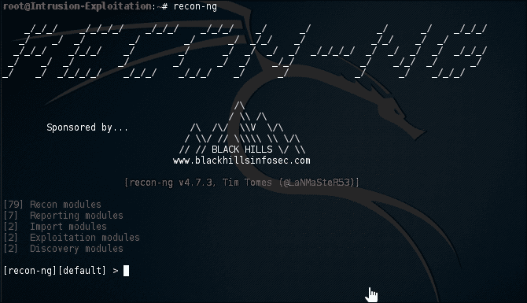
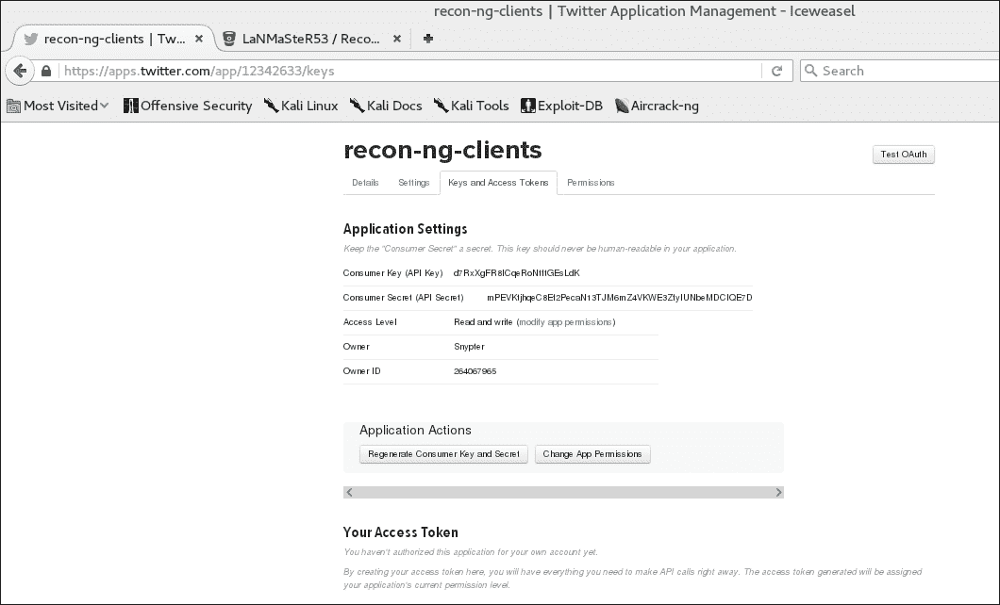
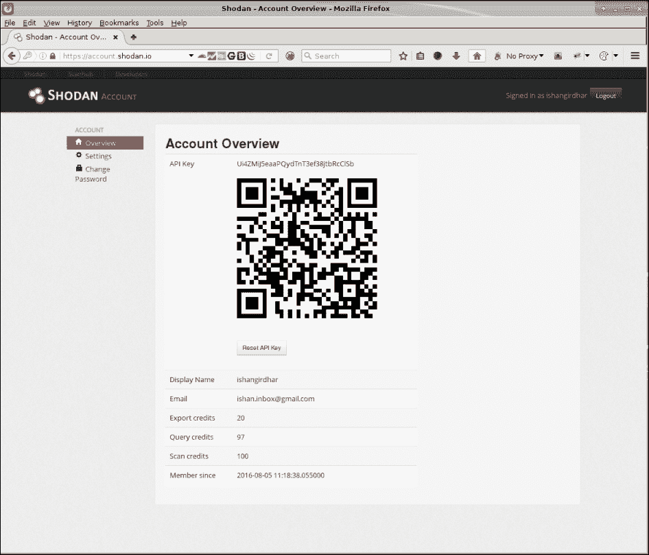
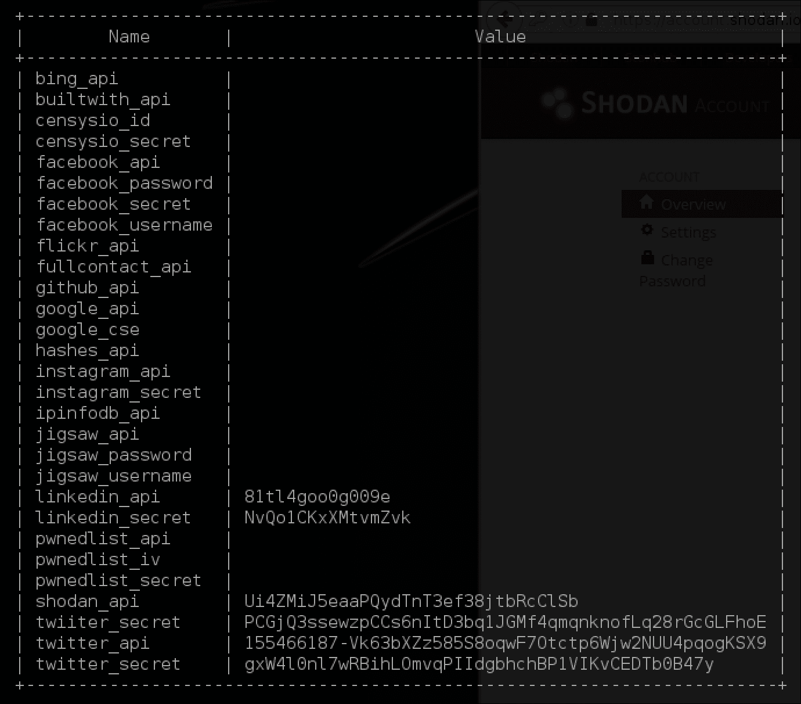
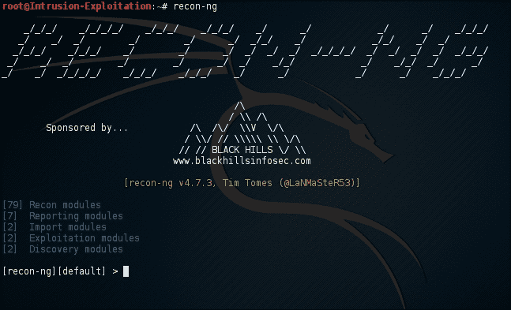
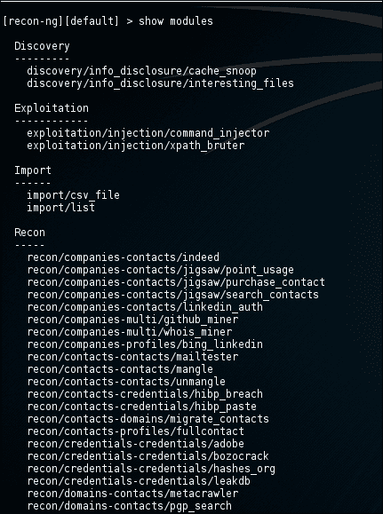
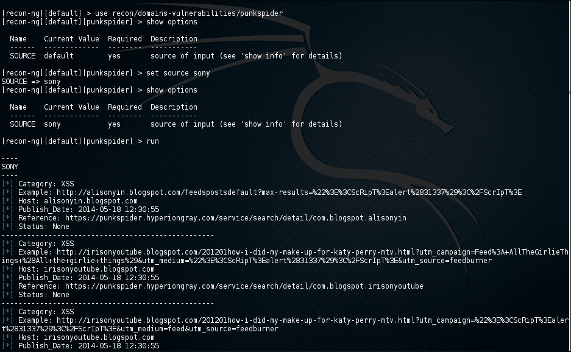
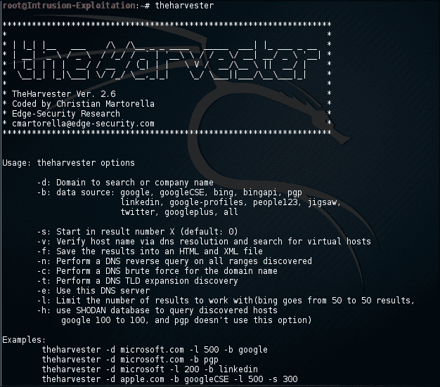

# 第五章：Web 应用程序信息收集

在本章中，我们将涵盖以下内容：

+   为 recon-ng 设置 API 秘钥

+   使用 recon-ng 进行侦察

+   使用 theharvester 收集信息

+   使用 DNS 协议进行信息收集

+   Web 应用程序防火墙检测

+   HTTP 和 DNS 负载均衡器检测

+   使用 DirBuster 发现隐藏的文件/目录

+   使用 WhatWeb 和 p0f 检测 CMS 和插件

+   查找 SSL 密码漏洞

# 介绍

攻击的一个最重要的阶段是信息收集。

为了能够发动成功的攻击，我们需要尽可能多地收集关于目标的信息。因此，我们获得的信息越多，成功攻击的可能性就越高。

同样重要的是，不仅收集信息，而且以清晰的方式记录信息也非常重要。Kali Linux 发行版有几个工具，可以从各种目标机器中记录、整理和组织信息，从而实现更好的侦察。诸如**Dradis**、**CaseFile**和**KeepNote**之类的工具就是其中的一些例子。

# 为 recon-ng 设置 API 秘钥

在这个教程中，我们将看到在开始使用 recon-ng 之前，我们需要设置 API 秘钥。Recon-ng 是最强大的信息收集工具之一；如果使用正确，它可以帮助渗透测试人员从公共来源收集相当多的信息。最新版本的 recon-ng 提供了灵活性，可以将其设置为各种社交网络网站中的自己的应用程序/客户端。

## 准备工作

对于这个教程，您需要一个互联网连接和一个网络浏览器。

## 如何操作...

1.  要设置 recon-ng API 秘钥，打开终端，启动 recon-ng，并输入以下截图中显示的命令：

1.  接下来，输入`keys list`，如下截图所示：

1.  让我们首先添加`twitter_api`和`twitter_secret`。登录 Twitter，转到[`apps.twitter.com/`](https://apps.twitter.com/)，并创建一个新的应用程序，如下截图所示：

1.  点击**创建应用程序**；一旦应用程序创建完成，转到**Keys and Access Tokens**选项卡，并复制秘钥和 API 秘钥，如下截图所示：

1.  复制 API 秘钥，重新打开终端窗口，并运行以下命令以添加秘钥：

```
Keys add twitter_api <your-copied-api-key>

```

1.  现在使用以下命令输入`twitter_secret`到 recon-ng 中：

```
keys add  twitter_secret <you_twitter_secret>

```

1.  添加了秘钥后，您可以通过输入以下命令在 recon-ng 工具中看到添加的秘钥：

```
keys list

```

1.  现在，让我们添加 Shodan API 秘钥。添加 Shodan API 秘钥非常简单；你只需要在[`shodan.io`](https://shodan.io)创建一个帐户，然后点击右上角的**My Account**。您将看到**Account Overview**页面，在那里您可以看到一个 QR 码图像和 API 秘钥，如下截图所示：

1.  复制您帐户中显示的 API 秘钥，并使用以下命令将其添加到 recon-ng 中：

```
keys add shodan_api <apikey>

```

## 它是如何工作的...

在这个教程中，我们学习了如何将 API 秘钥添加到 recon-ng 工具中。在这里，为了演示这一点，我们创建了一个 Twitter 应用程序，使用了`twitter_api`和`twitter_secret`，并将它们添加到了 recon-ng 工具中。结果如下截图所示：



类似地，如果您想要从这些来源收集信息，您需要在 recon-ng 中包含所有的 API 秘钥。

在下一个教程中，我们将学习如何使用 recon-ng 进行信息收集。

# 使用 recon-ng 进行侦察

在这个教程中，我们将学习使用 recon-ng 进行侦察。Recon-ng 是一个用 Python 编写的全功能 Web 侦察框架。具有独立模块、数据库交互、内置便利函数、交互式帮助和命令完成，recon-ng 提供了一个强大的环境，可以快速而彻底地进行开源基于 Web 的侦察。

## 准备工作

在安装 Kali Linux 之前，您需要一个互联网连接。

## 操作步骤...

1.  打开终端并启动 recon-ng 框架，如下面的屏幕截图所示：

1.  Recon-ng 看起来和感觉像 Metasploit。要查看所有可用的模块，请输入以下命令：

```
show modules

```

1.  Recon-ng 将列出所有可用的模块，如下面的屏幕截图所示：

1.  让我们继续使用我们的第一个信息收集模块；输入以下命令：

```
use recon/domains-vulnerabilities/punkspider

```

1.  现在，输入以下屏幕截图中显示的命令：

1.  如您所见，已经发现了一些漏洞，并且它们是公开可用的。

1.  让我们使用另一个模块，从[xssed.com](http://xssed.com/)获取任何已知和报告的漏洞。XSSed 项目由 KF 和 DP 于 2007 年 2 月初创建。它提供有关跨站脚本漏洞相关的所有信息，并且是最大的 XSS 易受攻击网站的在线存档。这是一个收集 XSS 信息的良好存储库。首先，输入以下命令：

```
      Show module
      use recon/domains-vulnerabilities/xssed
      Show Options
      Set source Microsoft.com
      Show Options
      RUN

```

您将看到以下屏幕截图中显示的输出：


1.  如您所见，recon-ng 已经从 XSSed 汇总了公开可用的漏洞，如下面的屏幕截图所示：

1.  同样，您可以继续使用不同的模块，直到获得有关目标的所需信息。

# 使用 theharvester 收集信息

在这个教程中，我们将学习使用 theharvester。该程序的目标是从不同的公共来源（如搜索引擎、PGP 密钥服务器和 Shodan 计算机数据库）收集电子邮件、子域、主机、员工姓名、开放端口和横幅。

## 准备工作

对于这个教程，您需要一个互联网连接。

## 操作步骤...

1.  打开终端并启动 theharvester，如下面的屏幕截图所示：

1.  theharvester 帮助还显示了示例语法。为了演示目的，我们将使用以下命令：

```
# theharvester -d visa.com -l 500 -b all

```

1.  成功执行上述命令将给出以下信息：

```
*******************************************************************
    *                                                                 *    * | |_| |__   ___    /\  /\__ _ _ ____   _____  ___| |_ ___ _ __  *
 * | __| '_ \ / _ \  / /_/ / _` | '__\ \ / / _ \/ __| __/ _ \ '__| *
 * | |_| | | |  __/ / __  / (_| | |   \ V /  __/\__ \ ||  __/ |    *
 *  \__|_| |_|\___| \/ /_/ \__,_|_|    \_/ \___||___/\__\___|_|    *
 *                                                                 *
    * TheHarvester Ver. 2.5                                           *
    * Coded by Christian Martorella                                   *
    * Edge-Security Research                                          *
    * cmartorella@edge-security.com                                   *
    *******************************************************************
Full harvest..
[-] Searching in Google..
 Searching 0 results...
 Searching 100 results...
 Searching 200 results...
[-] Searching in PGP Key server..
[-] Searching in Bing..
 Searching 50 results...
 Searching 100 results...
 ...
[-] Searching in Exalead..
 Searching 50 results...
 Searching 100 results...
 ...
[+] Emails found:
------------------
phishing@visa.com
vpp@visa.com
v@e-visa.com
...
[+] Hosts found in search engines:
------------------------------------
[-] Resolving hostnames IPs... 
23.57.249.100:usa.visa.com
23.57.249.100:www.visa.com
...
[+] Virtual hosts:
==================
50.56.17.39  jobs.<strong>visa<
50.56.17.39  jobs.visa.com
...

```

## 工作原理...

在这个教程中，theharvester 搜索不同的来源，如搜索引擎、PGP 密钥服务器和 Shodan 计算机数据库，以获取信息。对于想要了解攻击者可以看到有关其组织的信息的任何人来说，这也是有用的。您可以访问[`tools.kali.org/information-gathering/theharvester`](http://tools.kali.org/information-gathering/theharvester)获取更多信息，如项目主页和 GitHub 代码存储库。

在第 2 步中，`-d`代表域，`-l`限制结果的数量，`-b`代表数据源。在我们的情况下，我们有`-b`作为查找电子邮件和数据源中可用的公共主机的手段。

# 使用 DNS 协议进行信息收集

在这个教程中，我们将学习使用各种可用的工具/脚本来收集有关您的 Web 应用程序域的信息。**DNS**代表**域名系统**，如果您正在执行黑盒测试，它可以为您提供大量信息。

## 准备工作

对于这个教程，您需要一个互联网连接。

## 操作步骤...

1.  我们将使用 DNSenum 进行 DNS 枚举。要开始 DNS 枚举，打开终端并输入以下命令：

```
dnsenum --enum zonetransfer.me

```

1.  我们应该得到一些信息，比如主机、域名服务器、电子邮件服务器，如果幸运的话，还有区域传输：

1.  接下来，DNSRecon 工具也可以在 Kali Linux 中使用。DNSRecon 通常是首选的选择，因为它更可靠，结果被正确解析，并且可以轻松地导入到其他漏洞评估和利用工具中。

1.  要使用 DNSRecon，请打开终端并输入以下命令：

```
      dnsrecon -d zonetransfer.me -D /usr/share/wordlists/dnsmap.txt      -t std --xml dnsrecon.xml

```

1.  枚举结果输出如下：

## 它是如何工作的...

在这个教程中，我们使用了 DNSenum 来枚举各种 DNS 记录，如 NS、MX、SOA 和 PTR 记录。DNSenum 还尝试执行 DNS 区域传输，如果存在漏洞。然而，DNSRecon 是一个更强大的 DNS 工具。它具有高度可靠的、更好的结果解析和更好的结果集成到其他 VA/利用工具中。

在第 4 步，使用`-d`命令进行域扫描开关，大写`-D`用于对主机名执行字典暴力破解，`-D`的参数应指向一个单词列表，例如`/usr/share/wordlists/dnsmap.txt`，为了指定这是一个标准扫描，我们使用了（`-t std`）开关，并将输出保存到一个文件（`-xml dnsrecon.xml`）。

## 还有更多...

Kali Linux 中有多个可用的脚本，其中一些脚本或多或少地执行相同的操作。根据您的评估类型和可用时间，您应该考虑使用以下 DNS 工具：

+   **DNSMap**：DNSmap 主要用于渗透测试人员在基础设施安全评估的信息收集/枚举阶段使用。在枚举阶段，安全顾问通常会发现目标公司的 IP 网络块、域名、电话号码等。

+   **DNSTracer**：这确定给定 DNS 从哪里获取其信息，并跟踪 DNS 服务器链返回到知道数据的服务器。

+   **Fierce**：这是专门用于定位可能的目标，无论是在公司网络内还是外部。只列出那些目标（除非使用`-nopattern`开关）。不执行利用（除非您使用`-connect`开关故意进行恶意操作）。Fierce 是一种侦察工具。Fierce 是一个 Perl 脚本，可以使用多种策略快速扫描域（通常只需几分钟，假设没有网络延迟）。

# Web 应用程序防火墙检测

在这个教程中，我们将学习使用一个名为**WAFW00F**的工具。WAFW00F 可以识别和指纹**Web 应用程序防火墙**（**WAF**）产品。

## 准备工作

对于这个教程，您需要一个互联网连接。

## 如何操作...

1.  WAFW00F 非常简单易用。只需打开终端并输入以下命令：

```
wafw00f https://www.microsoft.com

```

输出将如下截图所示：


1.  同样，您可以不断更改目标域以查找 Web 应用程序防火墙的存在。

## 它是如何工作的...

在这个教程中，我们使用了 WAFW00F 来识别是否有任何 Web 应用程序防火墙正在运行。准确检测 Web 应用程序防火墙可以帮助您在渗透测试期间节省大量时间。

WAFW00F 的工作方式如下：

+   它发送一个正常的 HTTP 请求并分析响应；这可以识别多个 WAF 解决方案

+   如果不成功，它会发送一些（可能恶意的）HTTP 请求，并使用简单的逻辑来推断是哪种 WAF

+   如果这也不成功，它会分析先前返回的响应，并使用另一个简单的算法来猜测是否有 WAF 或安全解决方案正在积极响应我们的攻击

有关更多详细信息，请查看主站点上的源代码，[github.com/sandrogauci/wafw00f](http://github.com/sandrogauci/wafw00f)。

# HTTP 和 DNS 负载均衡器检测

在这个示例中，我们将学习如何使用 lbd 检测 HTTP 和 DNS 负载均衡器。**Lbd**（**负载均衡检测器**）检测给定域名是否使用 DNS 和/或 HTTP 负载均衡（通过服务器和日期：标头以及服务器响应之间的差异）。

## 准备工作

对于这个示例，您需要一个互联网连接。

## 如何操作...

1.  打开终端并输入以下命令：

```
lbd google.com

```

1.  成功检测到 HTTP 和 DNS 负载均衡器将产生以下输出：

1.  另一个例子是检测到 DNS 负载均衡器和 HTTP 负载均衡器，如下截图所示：

1.  需要在这里理解的一件事是，lbd 并不完全可靠；它只是一个检查负载均衡是否完成的概念验证。您可以在终端上阅读到它可能产生误报，但这是一个很棒的工具。

1.  另一个可以帮助我们了解 DNS 负载均衡器是否真的存在的工具是 dig 工具。让我们更详细地看一下；输入以下命令：

```
dig A google.com

```

输出将如下截图所示：


1.  `ANSWER SECTION`显示了[microsoft.com](http://microsoft.com)的不同基于 DNS 的负载均衡器。用于测试基于 HTTP 的负载均衡器的工具是 Halberd。为了检查 Halberd 的工作原理，请在 Kali 终端中输入以下内容：

```
halberd http://www.vmware.com

```

输出将如下截图所示：


## 工作原理...

在这个示例中，我们使用 lbd 来查找 DNS 和 HTTP 负载均衡器。在渗透测试的早期阶段获得这些信息可以节省很多时间，因为您可以选择适当的工具和方法，找到 Web 应用程序安全问题。

这个命令`lbd kali.org`非常简单。Ldb 是工具名称，它接受一个参数，即需要检查的域名或 IP 名称。前述工具的工作原理如下所述：

+   **Lbd**：这个工具基于两个参数进行负载均衡：DNS 和 HTTP。对于 DNS，它通常使用轮询技术来确定是否存在多个负载均衡器。对于 HTTP，负载均衡是通过 cookies 进行检查；它通过会话状态检查不同的请求是否由负载均衡器后面实际的服务器发送和接收。另一种 HTTP 方法是时间戳；它试图检测时间戳的差异，以帮助我们检测是否存在负载均衡器。在前述例子中，我们看到负载均衡器是基于内容长度区分的。

+   **DIG**：这代表**Domain Information Groper**，是一个枚举给定域的详细信息的 Linux 命令。我们使用 A 记录来检查 groper 上可用的 DNS 服务器，以确定是否存在基于 DNS 的负载均衡器。多个 A 记录条目通常表明存在 DNS 负载均衡器。

+   **Halberd**：这是一个基于 HTTP 的负载均衡器检测器。它检查 HTTP 响应头、cookies、时间戳等的差异。在上述参数中的任何差异都将证明存在基于 HTTP 的负载均衡器。在前面的例子中，我们检查 VMware 上是否存在基于 HTTP 的负载均衡器，如果我们发现检测到两个不同的实例，一个具有 Akamai 标头，另一个没有相同的标头。

# 使用 DirBuster 发现隐藏文件/目录

在这个示例中，我们将学习如何使用 DirBuster 工具。DirBuster 工具查找 Web 服务器上的隐藏目录和文件。有时，开发人员会留下一个可访问但未链接的页面；DirBuster 旨在找到这些可能存在潜在漏洞的文件。这是一个由 OWASP 的出色贡献者开发的基于 Java 的应用程序。

## 准备工作

对于这个步骤，您需要一个互联网连接。

## 如何操作...

1.  从**Kali Linux** | **Web 应用程序分析** | **Web 爬虫和目录暴力** | **Dirbuster**启动 DirBuster，如下面的屏幕截图所示：

1.  打开 DirBuster 并输入您的目标 URL；在我们的案例中，我们将输入`http://demo.testfire.net`以进行演示，如下面的屏幕截图所示：

1.  基于选择列表的暴力破解。浏览并导航到`/usr/share/dirbuster/wordlists`，然后选择`directory_list_medium.txt`，如下面的屏幕截图所示：

1.  单击**选择列表**并在文件扩展名列中输入`php`（根据目标使用的技术），如下面的屏幕截图所示：

1.  单击**开始**，DirBuster 将开始暴力破解目录和文件，如下面的屏幕截图所示：

1.  正如您所看到的，DirBuster 已经开始暴力破解文件和目录。您可以单击**响应**列以对所有具有**200** HTTP 代码的文件/文件夹进行排序，如下面的屏幕截图所示：

1.  现在，您可以花一些时间访问这些链接，并调查哪些看起来有趣并且可以用于进一步攻击。例如，在我们的案例文件中，`/pr/docs.xml`文件似乎是独立的文件，位于服务器上，没有在站点地图或`robots.txt`文件中提到。右键单击该条目，然后选择**在浏览器中打开**，如下面的屏幕截图所示：

1.  文件已在浏览器中打开；正如您所看到的，这是一个 XML 文件，本来不应该是公共文件，它在应用程序中也没有链接，但是可以访问，如下面的屏幕截图所示：

1.  同样，您可以继续调查其他文件和文件夹，这些文件和文件夹可能泄露大量信息，或者一些备份文件或开发页面，这些可能存在漏洞。

## 工作原理...

在这个步骤中，我们使用了 DirBuster 来查找 Web 服务器上可用的隐藏目录和文件。DirBuster 生成了一个包含最常见 Web 服务器目录的字典文件，并从字典中读取值并向 Web 服务器发出请求以检查其存在。如果服务器返回 200 HTTP 头代码，这意味着该目录存在；如果服务器返回 404 HTTP 头代码，这意味着该目录不存在。但是，重要的是要注意，401 和 403 的 HTTP 状态代码也可能指向文件或目录的存在，但除非经过身份验证，否则不允许打开。

与此同时，一些构建良好的应用程序也会对未知文件和文件夹返回 200 OK，以干扰 DirBuster 等工具。因此，了解应用程序的行为方式非常重要，基于这一点，您可以进一步调整您的扫描策略和配置。

通过这种方式，我们能够找到某些未在应用程序中链接但在 Web 服务器上可用的文件和文件夹。

# 使用 WhatWeb 和 p0f 进行 CMS 和插件检测

在这个步骤中，我们将学习如何使用 Kali 中提供的不同工具，这些工具可以用来确定已安装的插件。如果应用程序是基于 CMS 构建的，那么它们很可能会使用某些插件。通常存在的主要漏洞通常是开发人员在这些 CMS 中使用的第三方插件。查找已安装的插件及其版本可以帮助您寻找可用于易受攻击插件的漏洞利用。

## 准备工作

对于这个步骤，您需要一个互联网连接。

## 如何操作...

1.  让我们从 Kali Linux 中的第一个工具**WhatWeb**开始。WhatWeb 用于识别网站。它的目标是回答问题：“那是什么网站？”WhatWeb 可以识别 Web 技术，包括**内容管理系统**（**CMS**）、博客平台、统计/分析软件包、JavaScript 库、Web 服务器和嵌入式设备。WhatWeb 有超过 900 个插件，每个插件用于识别不同的东西。WhatWeb 还可以识别版本号、电子邮件地址、帐户 ID、Web 框架模块、SQL 错误等。WhatWeb 非常易于使用。打开终端并输入以下命令：

```
whatweb ishangirdhar.com

```

输出如下屏幕截图所示：


1.  如您所见，它非常准确地发现了这是一个 WordPress 安装。它还检测到了 DNS 和 HTTP 负载均衡器使用的常见插件。

1.  假设您已经发现您的一个目标正在使用 WordPress 或 Drupal 作为 CMS，并且您想进一步查找已安装的插件、它们的版本以及该插件的最新可用版本。

1.  Plecost 是 Kali 中另一个流行的工具，用于检测 CMS 插件和 WordPress 指纹识别。

1.  打开终端并输入以下命令：

```
      plecost -n 100 -s 10 -M 15 -i /usr/share/plecost      /wp_plugin_list.txt ishangirdhar.com

```

这个语法意味着使用 100 个插件（`-n 100`），在探测之间休眠 10 秒（`-s 10`），但不超过 15 个（`-M 15`），并使用插件列表（`-i /usr/share/plecost/wp_plugin_list.txt`）来扫描给定的 URL（`ishangirdhar.com`）。

## 工作原理...

在这个教程中，我们学会了使用 WhatWeb，它可以非常准确地对服务器进行指纹识别，并提供 CMS、插件、Web 服务器版本、使用的编程语言以及 HTTP 和 DNS 负载均衡器的详细信息。在本教程的后面，我们还学会了使用 plecost 来扫描 WordPress 安装以对已安装的 WordPress 插件进行指纹识别。

大多数 WhatWeb 插件都非常全面，可以识别从微妙到明显的各种线索。例如，大多数 WordPress 网站可以通过 meta HTML 标签进行识别，但少数 WordPress 网站会删除这个标识标签，尽管这并不会阻止 WhatWeb。WordPress WhatWeb 插件有超过 15 个测试，包括检查 favicon、默认安装文件、登录页面，并检查相对链接中是否包含`/wp-content/`。

WordPress 指纹识别工具**plecost**，可以搜索并检索运行 WordPress 的服务器上关于插件及其版本的信息。它可以分析单个 URL，也可以根据 Google 索引的结果进行分析。此外，它还显示与每个插件相关的 CVE 代码（如果有的话）。Plecost 检索包含在 WordPress 支持的网站上的信息，并且还允许在 Google 索引的结果上进行搜索。

## 还有更多...

除了我们刚刚看到的之外，还有其他可用的工具。例如，用于扫描 WordPress、Drupal 和 Joomla 的工具如下：

+   **WpScan**: [`wpscan.org/`](http://wpscan.org/)

+   **DrupalScan**: [`github.com/rverton/DrupalScan`](https://github.com/rverton/DrupalScan)

+   **Joomscan**: [`sourceforge.net/projects/joomscan/`](http://sourceforge.net/projects/joomscan/)

# 查找 SSL 密码漏洞

在这个教程中，我们将学习使用工具来扫描易受攻击的 SSL 密码和与 SSL 相关的漏洞。

## 准备工作

对于这个教程，您需要一个互联网连接。

## 如何操作...

1.  打开终端并启动 SSLScan 工具，如下面的屏幕截图所示：

1.  要使用 SSLScan 扫描目标，请运行以下命令：

```
sslscan demo.testfire.net

```

1.  SSLScan 将测试 SSL 证书支持的所有密码。弱密码将显示为红色和黄色。强密码将显示为绿色：

```
root@Intrusion-Exploitation:~# sslscan demo.testfire.net
Version: -static
OpenSSL 1.0.1m-dev xx XXX xxxx
Testing SSL server demo.testfire.net on port 443
 TLS renegotiation:
Secure session renegotiation supported
 TLS Compression:
Compression disabled
 Heartbleed:
TLS 1.0 not vulnerable to heartbleed
TLS 1.1 not vulnerable to heartbleed
TLS 1.2 not vulnerable to heartbleed
 Supported Server Cipher(s):
Accepted  SSLv3    128 bits  RC4-SHA
Accepted  SSLv3    128 bits  RC4-MD5
Accepted  SSLv3    112 bits  DES-CBC3-SHA
Accepted  TLSv1.0  256 bits  ECDHE-RSA-AES256-SHA
Accepted  TLSv1.0  256 bits  AES256-SHA
Accepted  TLSv1.0  128 bits  ECDHE-RSA-AES128-SHA
Accepted  TLSv1.0  128 bits  AES128-SHA
Accepted  TLSv1.0  128 bits  RC4-SHA
Accepted  TLSv1.0  128 bits  RC4-MD5
Accepted  TLSv1.0  112 bits  DES-CBC3-SHA
Accepted  TLSv1.1  256 bits  ECDHE-RSA-AES256-SHA
Accepted  TLSv1.1  256 bits  AES256-SHA
Accepted  TLSv1.1  128 bits  ECDHE-RSA-AES128-SHA
Accepted  TLSv1.1  128 bits  AES128-SHA
Accepted  TLSv1.1  128 bits  RC4-SHA
Accepted  TLSv1.1  128 bits  RC4-MD5
Accepted  TLSv1.1  112 bits  DES-CBC3-SHA
Accepted  TLSv1.2  256 bits  ECDHE-RSA-AES256-SHA
Accepted  TLSv1.2  256 bits  AES256-SHA256
Accepted  TLSv1.2  256 bits  AES256-SHA
Accepted  TLSv1.2  128 bits  ECDHE-RSA-AES128-SHA256
Accepted  TLSv1.2  128 bits  ECDHE-RSA-AES128-SHA
Accepted  TLSv1.2  128 bits  AES128-SHA256
Accepted  TLSv1.2  128 bits  AES128-SHA
Accepted  TLSv1.2  128 bits  RC4-SHA
Accepted  TLSv1.2  128 bits  RC4-MD5
Accepted  TLSv1.2  112 bits  DES-CBC3-SHA
 Preferred Server Cipher(s):
SSLv3    128 bits  RC4-SHA
TLSv1.0  128 bits  AES128-SHA
TLSv1.1  128 bits  AES128-SHA
TLSv1.2  128 bits  AES128-SHA256
 SSL Certificate:
Signature Algorithm: sha1WithRSA
RSA Key Strength:    2048
Subject:  demo.testfire.net
Issuer:   demo.testfire.net
root@Intrusion-Exploitation:~# D

```

1.  我们的下一个工具是 SSLyze，由 iSEC Partners 开发。

1.  打开终端并调用 SSLyze 帮助，如下面的屏幕截图所示：

1.  要测试一个域的支持密码的全面列表，请在终端中输入以下命令：

```
sslyze -regular demo.testfire.net

```

1.  如果服务器在端口`443`上运行 SSL，输出应该像这样：

1.  这个教程中的最后一个工具是 TLSSLed。打开终端并调用该工具，如下面的屏幕截图所示：

1.  现在使用以下命令启动 TLSSLed：

```
root@Intrusion-Exploitation:~# tlssled demo.testfire.net 443

```

1.  TLSSEled 还显示了所有的 cookie，其中是否设置了安全和 HttpOnly 标志，这在以后利用 XSS 攻击应用程序时可能是有用的信息。

## 工作原理...

在这个教程中，我们使用了三种工具来扫描目标域上的 SSL 证书，以查找弱密码和 SSL 漏洞，比如 Heartbleed。这些工具中的每一个都有它们独特的信息表示方式。SSLScan 试图检查目标是否容易受到 Heartbleed 的攻击，同时还会扫描弱密码。SSLyze 专注于速度，并且还支持 SMTP、XMPP、LDAP、POP、IMAP、RDP 和 FTP 协议上的 StartTLS 握手。TLSSLed 是一个使用 SSLScan 创建的工具，但它提供了更多信息。

SSLyze 是一个 Python 工具，可以通过连接到服务器来分析服务器的 SSL 配置。它旨在快速全面，应该有助于组织和测试人员识别影响其 SSL 服务器的错误配置。SSLyze 由 iSEC Partners 开发。

TLSSLed 是一个 Linux shell 脚本，其目的是评估目标 SSL/TLS（HTTPS）Web 服务器实现的安全性。它基于 SSLScan，这是一个基于 OpenSSL 库和`openssl s_client`命令行工具的彻底的 SSL/TLS 扫描程序。当前的测试包括检查目标是否支持 SSLv2 协议，空密码，以及基于密钥长度（40 或 56 位）的弱密码，强密码的可用性（如 AES），数字证书是否是 MD5 签名的，以及当前的 SSL/TLS 重新协商能力。

偶尔，您还应该彻底查看证书错误。您还可以根据证书错误发现属于同一组织的相关域和子域，因为有时组织会为不同的域购买 SSL 证书，但会重用它们，这也会导致无效的证书名称错误。
