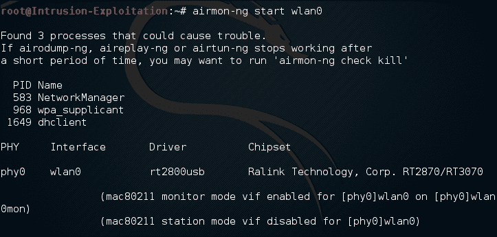
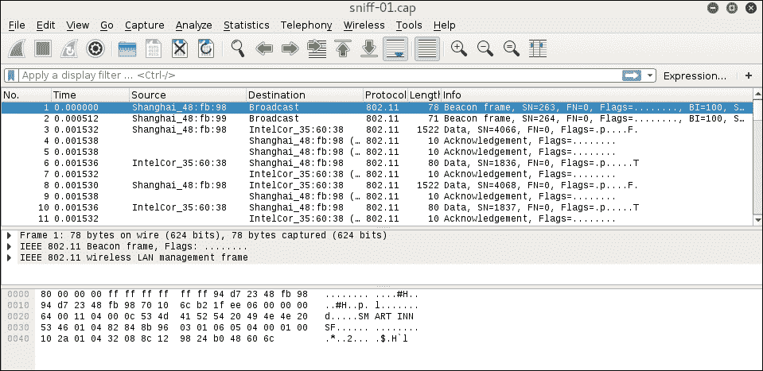
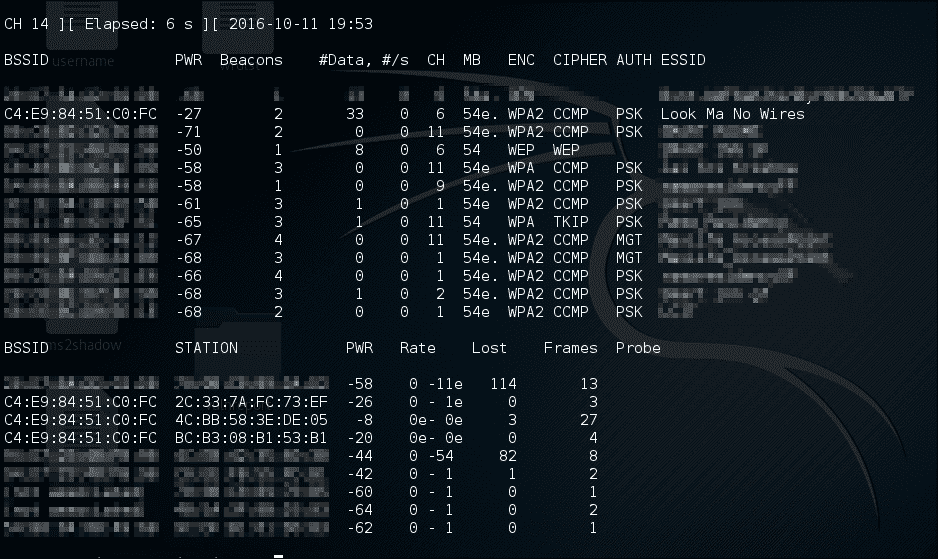
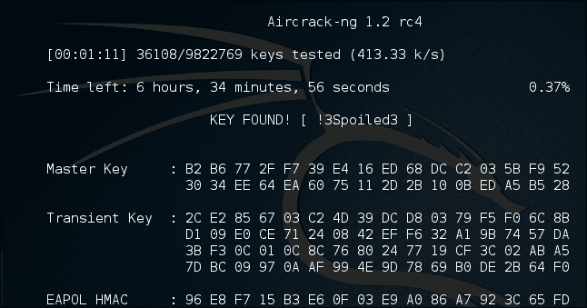
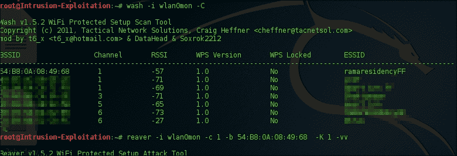

# 第十章：无线利用

在本章中，我们将涵盖以下内容：

+   建立无线网络

+   绕过 MAC 地址过滤

+   嗅探网络流量

+   破解 WEP 加密

+   破解 WPA/WPA2 加密

+   破解 WPS

+   拒绝服务攻击

# 介绍

当前，无线网络正在兴起。随时随地需要即时网络访问或在任何地点随时上网的能力正在增加。员工和访客都需要进入企业网络，需要访问互联网以进行演示或推销产品；甚至员工的移动设备可能需要遵循 BYOD 政策进行无线访问。然而，应该知道，关于安全性的无线协议确实存在一些问题。通过 Mac ID 来猜测设备的正确性是唯一的方法，这是可以被利用的。在本章中，我们将探讨无线网络中观察到的不同漏洞。在我们深入之前，让我们了解一些术语：

+   Wi-Fi 接口模式

+   主：接入点或基站

+   托管：基础设施模式（客户端）

+   点对点：设备对设备

+   网状：（网状云/网络）

+   中继器：范围扩展器

+   监视器：RFMON=

+   Wi-Fi 帧

+   管理帧：

+   信标帧：接入点定期发送信标帧以宣布其存在并传递信息，如时间戳、SSID 和有关接入点的其他参数，以供范围内的无线网卡选择与之关联的最佳接入点的基础。无线网卡不断扫描所有 802.11 无线电信道，并侦听信标，作为选择与之关联的最佳接入点的基础。

+   探测：两种类型：探测请求和探测响应：

+   探测请求帧：当需要从另一个站点获取信息时，站点会发送探测请求帧。例如，无线网卡会发送探测请求以确定范围内有哪些接入点。

+   探测响应帧：在接收到探测请求帧后，站点将以探测响应帧作出响应，其中包含能力信息、支持的数据速率等。

# 建立无线网络

无线测试的最关键部分是确保测试人员的无线设置的正确性。需要对适当的测试环境进行广泛的配置，用户应该对无线通信协议有相当的了解。整个测试的核心组件之一是无线适配器。错误的无线适配器可能会破坏整个测试活动。依赖于软件，aircrack-ng 套件在无线测试中发挥了重要作用。无线适配器的兼容性列表可以在[`www.aircrack-ng.org/doku.php?id=compatibility_drivers`](https://www.aircrack-ng.org/doku.php?id=compatibility_drivers)找到。对于我们的演示目的，我们将使用 ALFA 卡型号**ALFA AWUS0360H**；它支持**b**和**g**协议。Kali 支持的一些无线适配器有：

+   Atheros AR9271

+   Ralink RT3070

+   Ralink RT3572

+   Realtek 8187L（无线 G 适配器）

在选择 Wi-Fi 卡时，可以考虑以下内容以进行更好的选择：

+   802.11a-5 GHZ 速率：最高 54 Mbps

+   802.11b-2.4 GHZ 速率：最高 11 Mbps

+   802.11g-2.4 GHZ 速率：最高 54 Mbps

+   802.11n-2.4 GHZ 速率：最高 300 Mbps

+   802.11ac（草案）-5 GHZ 速率：最高 1.73Gps！！！

## 准备工作

我们将通过托管在虚拟机上的 Kali 机器进行无线测试。要设置无线网络，我们需要 Kali 操作系统、无线适配器和目标无线连接。一旦这些都准备好了，我们就可以开始我们的渗透测试阶段。

## 如何做...

1.  要在虚拟机上设置网卡，我们需要确保在 VMplayer 的编辑虚拟机设置中打开“自动连接新 USB 设备”选项，如下面的屏幕截图所示：

一旦设备被检测到，使用以下命令进行检查：

```
      ifconfig wlan0

```

输出将如下截图所示：


1.  让我们检查是否可以启用监视模式。**监视**模式允许具有**无线网络接口控制器**（**WNIC**）的计算机监视从无线网络接收到的所有流量：

```
      airmon-ng start wlan0

```

输出将如下截图所示：



1.  由于我们看到一些潜在有问题的服务正在运行，我们将不得不禁用它们。我们可以通过使用`kill`命令和前面截图中提到的进程 ID（`PID`）来杀死进程：

```
      airmon-ng stop wlan0mon
      kill ( PID's)

```

输出将如下截图所示：


1.  现在我们可以开始检查是否可以打开**监视**模式：

1.  我们已经设置好了适配器并打开了监视模式。现在我们可以开始练习了。

# 绕过 MAC 地址过滤

MAC 地址是尝试在无线网络上进行身份验证的用户的唯一标识。通常作为最佳实践，用户倾向于对他们的网络进行 Mac 过滤以保护自己免受攻击者的侵害；然而，更改 Mac 地址并攻击网络非常容易。在这个教程中，我们将看到如何更改无线网卡的 Mac 地址。

## 准备工作

执行此练习需要一个无线网卡和一台 Kali 机器。在这个教程中，我们将扫描可用的网络和连接到网络的设备，然后我们将把无线网卡的 Mac ID 更改为连接到网络的主机的 Mac ID。

## 操作步骤...

1.  在开始之前，请确保通过在其接口上发出停止监视命令来停止在上一个教程中启用的**监视**模式：

```
      airmon-ng stop wlan0mon

```

1.  让我们使用以下命令检查我们设备的 MAC 地址：

```
      ifconfig wlan0

```

输出将如下截图所示：


1.  现在我们将使用以下命令禁用网络接口：

```
      ifconfig wlan0 down

```

1.  现在我们选择一个网络设备，并使用`macchanger`来更改我们的 Mac 地址。我们将把它更改为一个合法的经过身份验证的用户的 Mac 地址，可以通过运行下一个教程中解释的`airodump-ng`命令来找到：

```
      macchanger -m xx:xx:xx:xx:xx:xx wlan0

```

输出将如下截图所示：


1.  在没有 Mac 过滤的情况下，如果用户决定保持匿名，可以从以下位置获取随机的 Mac 地址：

```
      macchanger -r wlan0

```

输出将如下截图所示：


1.  现在我们可以使用以下命令启用无线设备：

```
      ifconfig wlan0 up

```

## 还有更多...

这是任何渗透测试活动开始之前的基本步骤，现在我们将研究破解无线协议。

# 嗅探网络流量

在这个教程中，我们将了解使用无线适配器来嗅探无线数据包的基础知识；为了这样做，我们将不得不将无线网卡切换到**监视**模式。对于嗅探，我们将使用`aircrack-ng`套件中的`airodump-ng`命令。

## 准备工作

我们将在这个练习中使用 Alfa 卡；确保无线适配器像之前的教程中那样连接，我们就可以开始嗅探流量了。

## 操作步骤...

1.  如果无线设备未打开，请使用以下命令打开它：

```
ifconfig wlan0 up 

```

1.  使用以下命令将卡放入监视模式：

```
      airmon-ng start wlan0

```

输出将如下截图所示：


1.  现在我们有了一个监视接口，我们将发出：

```
airodump-ng wlan0mon 

```

输出将如下截图所示：


1.  我们也可以捕获特定的 ESSID；我们只需要提到一个特定的频道并写入一个文件；在这种情况下，我们正在写入一个名为 sniff 的文件：

```
      airodump-ng wlan0mon --channel 6 -w sniff

```

输出将如下截图所示：


1.  然后可以在浏览器、Wireshark 或 Excel 中查看这些数据包，具体取决于扩展名。Wireshark 用于打开 CAP 文件，如下截图所示：

1.  一旦我们捕获了数据包，就可以使用键盘组合*Ctrl* + *C*终止它，文件将以 CAP 扩展名保存。

## 工作原理...

`airodump-ng`命令是`aircrack-ng`套件的一部分，它执行将网络上所有嗅探到的数据包转储的任务；这些数据包以`.cap`扩展名保存，并可以在 Wireshark 中打开。

## 还有更多...

到目前为止，我们已经介绍了嗅探无线数据包的基础知识。除此之外，我们还可以开始了解如何破解无线加密。

# 破解 WEP 加密

在这个示例中，我们将学习关于 WEP 加密破解。**有线等效隐私**（**WEP**）是一种安全协议，规定在 IEEE **无线保真**（**Wi-Fi**）标准 802.11b 中，并旨在为**无线局域网**（**WLAN**）提供与通常预期的有线局域网相当的安全和隐私级别。WEP 使用 RC4 加密，在 Internet 上作为 HTTPS 的一部分被广泛使用。这里的缺陷不是 RC4，而是 RC4 的实现方式。问题在于 IV 的重用。在这个练习中，我们将使用一个名为**Wifite**的工具。这个工具用于攻击多个 WEP、WPA 和 WPS 加密的网络。这个工具是可定制的，并且只需几个参数就可以自动化。Wifite 旨在成为“设置并忘记”的无线审计工具。

## 准备工作

对于这个活动，我们将需要 wifite（预装在 Kali 中），一个活动和运行的无线适配器，以及一个运行 WEP 加密的无线路由器。

## 如何操作...

1.  要确保 wifite 框架已更新，请输入以下命令：

```
      wifite -upgrade

```

1.  要列出所有可用的无线网络，请输入以下命令：

```
      wifite -showb

```

输出如下截图所示：


1.  通过这个命令，可以查看附近所有可用的无线设备。使用*Ctrl* + *C*来中断脚本。

1.  使用以下命令再次启动 Wifite：

```
      Wifite

```

输出如下截图所示：


1.  正如我们所看到的，该命令已列出了所有检测到的无线网络及其 ESSID、BSSID 等。记住与目标 ID 对应的数字。现在我们应该退出列表模式，并输入以下键盘组合：

```
      Ctrl + C
      3

```

输出如下截图所示：


1.  一旦我们按下*Ctrl* + *C*组合，它会提示我们提供目标编号。完成后，wifite 将自动开始进行 WEP 破解并给出密码。

## 工作原理...

在后台，框架最初的操作是使用`airmon-ng`命令将无线适配器置于监视模式，这是`aircrack-ng`套件的一部分，并开始枚举列表：

+   `wifite -upgrade`：此命令将 wifite 框架升级到最新版本

+   `wifite -showb`：此命令列出网络中检测到的所有可用无线网络

WEP 破解的工作原理如下：

WEP 准备密钥计划（种子）；这是用户共享的秘密密钥与随机生成的 24 位初始化向量（IV）的连接。 IV 增加了秘密密钥的寿命，因为站点可以为每个帧传输更改 IV。然后，WEP 将该输出作为生成密钥流的伪随机数生成器的结果“种子”发送。这个密钥流的长度等于帧有效负载的长度加上 32 位（**完整性检查值**（**ICV**））。

WEP 失败的原因是 IV 太短且以明文形式存在；RC4 生成的 24 位字段密钥流相对较小。由于 IV 是静态的且 IV 流很短，因此它们被重复使用。关于 IV 的设置或更改没有标准；可能存在同一供应商的无线适配器最终具有相同 IV 序列的情况。

攻击者可以继续嗅探数据并收集所有可用的 IV，然后成功破解密码。更多信息，请访问[`www.isaac.cs.berkeley.edu/isaac/wep-faq.html`](http://www.isaac.cs.berkeley.edu/isaac/wep-faq.html)。

## 还有更多...

当 wifite 提示我们选择一个网络时，我们可以使用`all`功能；然而，你应该牢记你所在国家的 IT 和网络安全法律，以避免做任何非法的事情。

# 破解 WPA/WPA2 加密

在这个食谱中，我们将看到攻击者如何破解 WPA2 加密。WPA Wi-Fi 保护访问是 WEP 加密之后的继任者，因为 WEP 加密失败。在 WPA2-PSK 中，我们强制受害者与无线路由器进行多次认证握手，并捕获所有流量，因为握手包含预共享密钥。一旦我们获得了大量的握手，我们尝试基于字典的密码猜测来对捕获的数据包进行猜测，以查看我们是否能成功猜出密码。在这个食谱中，我们将看到 WPA/WPA2 如何被破解。

## 准备工作

为此，我们将完全依赖于`aircrack-ng`套件；因为它在 Kali 中预先构建，我们不需要进行太多配置。我们还需要一个使用 WPA/WPA2 加密的无线路由器。让我们开始吧。

## 如何做...

1.  首先，我们将使用以下命令将我们的无线设备切换到监视模式：

```
      airmon-ng start wlan0

```

1.  我们可以使用以下命令列出所有可用的无线网络：

```
      airodump-ng wlan0mon

```

输出将如下截图所示：



1.  现在我们已经有了可用无线网络的列表和我们的网络 BSSID 和 ESSID，我们可以开始捕获专门针对该信道的数据包：

```
      airodump-ng --bssid xx:xx:xx:xx:xx:xx -c X --write WPACrack        wlan0mon

```

输出将如下截图所示：


1.  现在我们将不得不对现有客户端进行去认证，以捕获他们对无线路由器的握手请求，因为它将包含认证凭据。只有在去认证期间，我们才能成功捕获加密密码：

```
      aireplay-ng --deauth 1000 -a xx:xx:xx:xx:xx:xx wlan0mon

```

输出将如下截图所示：


1.  现在经过认证的用户将被迫重新认证近 1000 次，之后，如果我们在右上角查看我们的`airodump-ng`，我们将找到 WPA 握手，这意味着我们成功捕获了流量。我们现在可以通过按*Ctrl* + *C*来终止转储。认证数据包越多，我们破解密码的机会就越大。

1.  现在我们将开始对转储文件进行 WPA 破解。我们需要注意文件名以多个扩展名保存，并根据迭代号添加了`-01`；`rockyou.txt`是一个包含常用密码和字母数字组合的字典，将用于对捕获文件进行猜测密码：

```
      aircrack-ng WPACrack-01.cap -w /usr/share/wordlists/rockyou.txt

```

输出将如下截图所示：



1.  我们已成功解密密码。

## 它是如何工作的...

让我们了解前面食谱的命令：

+   `airmon-ng start wlan0`：这将启动无线适配器并将其设置为监视模式；监视模式对于在网络上注入和嗅探数据包是必不可少的

+   `airodump-ng wlan0mon`：此命令列出了可用的无线网络，我们可以捕获其数据包

```
      airodump-ng --bssid xx:xx:xx:xx:xx:xx -c X --write WPACrack      wlan0mon:
```

以下是该命令的解释：

+   `--bssid`：这是路由器的 MAC 地址，是提供无线网络的站点

```
      aireplay-ng --deauth 100 -a xx:xx:xx:xx:xx:xx wlan0mon:

```

以下是该命令的解释：

+   `--deauth`：此命令向经过身份验证的客户端发送`RESET`数据包，以便当它们尝试重新认证时，我们可以捕获握手数据以进行破解。

`Aireplay-ng`，`airodump-ng`和`airmon-ng`命令都是 aircrack 的一部分。

## 还有更多...

这种方法基本上被视为暴力破解，这是目前破解 WPA 的唯一方法。支持 WPS 的路由器也可以被破解。在下一个步骤中，我们将看看如何破解 WPS。

# 破解 WPS

**WPS**代表**Wi-Fi Protected Setup**。这是在 2006 年引入的，WPS 的主要目的是简化将新设备添加到网络的过程；不需要记住长长的 WPA 或 WEP 密码。然而，WPS 的安全性很快就消失了；2011 年揭示了一个影响支持 WPS 的无线路由器的重大安全漏洞。

## 准备工作

对于这个步骤，我们将使用一个名为**Reaver**的工具。这是一个在 Kali Linux 中预安装的开源 WPS 破解工具。Reaver 对 WPS PIN 号进行暴力破解。一旦获得 WPS PIN，就可以恢复 WPA PSK。对于这个练习，我们需要一个启用了 WPS 功能的无线路由器。

## 如何操作...

1.  要扫描启用了 WPS 的路由器，有一个与 Reaver 一起提供的名为`wash`的软件包；输入以下命令以列出启用 WPS 的设备。请注意，需要监视模式来查看信标数据包，了解 AP 是否支持 WPS，并确定 WPS 访问是否被锁定。这有助于我们了解攻击是否可能：

```
      wash -i wlan0mon

```

输出将如下截图所示：


1.  如果用户出现以下错误，输入以下命令：

```
      wash -i wlan0mon -C

```

输出将如下截图所示：



1.  我们使用`-C`命令来忽略**FCS**（**Frame Check Sequence**）错误。一旦获得 AP 的 BSSID，我们将使用`reaver`命令尝试使用 Pixie Dust 方法进行 WPS 攻击：

```
reaver -i wlan0mon -c 1 -b xx:xx:xx:xx:xx:xx -K X -vv 

```

输出将如下截图所示：


1.  如果无线设备包含空格，则会提到网络名称。Reaver 开始 Pixie Dust 攻击以暴力破解 PIN，并且大约需要 5 到 10 分钟。**PixieWPS**是一种用于离线暴力破解 WPS PIN 的工具，同时利用了一些无线接入点的低或不存在的熵。如果我们运行非 Pixie Dust 攻击，时间可能会升至 5 或 6 小时：

## 工作原理...

让我们深入了解命令及其功能：

+   `wash -i wlan0mon`：此命令扫描所有启用 WPS 的设备。

+   `wash -i wlan0mon -C`：`-C`命令忽略 FCS 数据包

+   `reaver -i wlan0mon -c X -b xx:xx:xx:xx:xx:xx -K x -vv`

+   `-i`：这指定与指定接口的交互

+   `-b`：这指定使用 BSSID

+   `-K（x）`：`X`是数字类型，`K`是设置 Pixie Dust 的参数

+   `-c`：指定网络运行的信道

+   `-vv`：这会显示有关脚本正在执行的更多非关键信息，以更好地理解过程

## 还有更多...

PixieWPS 是一种用于离线暴力破解 WPS PIN 的工具，同时利用了一些无线接入点的低或不存在的熵，也被称为 Pixie Dust 攻击；这是 Dominique Bongard 发现的。PixieWPS 工具（由 wiire 开发）诞生于 Kali 论坛。

在下一个步骤中，我们将看到拒绝服务攻击是如何在网络上发生的。

# 拒绝服务攻击

最主要的攻击之一是拒绝服务攻击，整个无线网络都可以被破坏；在这种攻击中，合法用户将无法访问网络。无线网络很容易受到这种攻击。由于用户的识别是基于 Mac 地址的，因此很难追踪这种活动的来源。这种情况发生的几种方式包括伪造假的源地址，或者通过复制路由器请求配置更改。一些设备也会通过完全关闭网络来响应 DoS 攻击。一种方法是向无线网络发送垃圾数据包或持续向网络上的所有用户发送 Deauth 数据包。

在这个教程中，我们将看到 DoS 攻击是如何发生的。

## 准备工作

我们需要一个正在积极浏览互联网或网络的用户，另一端我们将有我们的 Kali Linux 机器和连接到它的无线适配器。

## 操作步骤...

1.  执行 DoS 攻击最简单的方法之一是 Deauth 攻击；在这里，我们将使用`aireplay`通过以下命令对网络执行 Deauth 攻击：

```
      aireplay-ng --deauth 100 -a (BSSID) -c wlan0mon

```

输出将如下截图所示：


1.  Websploit 中还有一些有效载荷；其中一个称为 Wi-Fi 干扰器。在 Kali 终端中使用以下命令执行：

```
      websploit
      use wifi/wifi_jammer
      show options
      set bssid xx:xx:xx:xx:xx:xx
      set essid xx:xx:xx:xx:xx:xx
      set interface wlanx
      set channel x
      run

```

输出将如下截图所示：


1.  与`bssid`的连接被渲染为不可访问：

## 工作原理...

让我们了解在这个教程中使用的命令：

+   `aireplay-ng --deauth 100 -a (BSSID) -c wlan0mon`：这里，`--deauth`命令启动一个`deauth`请求，后跟`100`，指定`deauth`请求发送 100 次。

如果攻击者想要持续发送 Deauth 并且永不停止，可以使用`--deauth 0`向目标发送无休止的`deauth`请求。

+   `websploit`：这将初始化 Websploit 框架

+   使用 wifi/ wifi_jammer：这个命令将加载干扰器模块

+   `set bssid xx:xx:xx:xx:xx:xx`：其中`xx:xx:xx:xx:xx:xx`将是`bssid`；对`essid`也是一样的

+   设置接口 wlanx：`wlanx`将是我们的适配器连接的接口

+   `run`：这将执行脚本并启动攻击

## 还有更多...

无线攻击很难被发现；最好的方法就是采取预防和加固措施。SANS 已经制定了一个非常好的清单，讨论了无线网络的加固措施。可以在[`www.sans.org/score/checklists/wireless`](https://www.sans.org/score/checklists/wireless)找到。

还有其他工具可以提供无线攻击的上述功能。

对于理解 BSSID、ESSID 和监视模式有困难的读者，这里有一个解释：

+   **BSSID**：这是接入点的 Mac 地址；BSSID 代表基础服务站 ID。

+   **ESSID**：这是 WLAN 网络的名称，用户连接到 WLAN 网络时看到的可读名称。

+   **监视模式**：这允许无线网络接口监视无线网络上的所有流量，无论是从客户端到 AP，AP 到客户端，还是 AP 到客户端的广播。监视模式用于数据包分析，上面提到的大多数工具都使用它。

**AP**代表接入点。它也被视为用于连接客户端的无线设备；无线路由器就是一个接入点。攻击者可以创建一个虚假的接入点，并可以操纵用户连接到它。

**Beacon frame**是无线标准中的管理帧；它包含有关网络的信息，并定期传输以宣布 WLAN 网络的存在。

这就是无线测试章节的结束。
