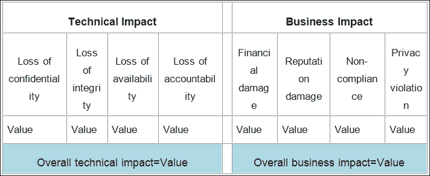

# 附录 A. 渗透测试 101 基础

在本章中，我们将涵盖以下主题：

+   介绍

+   什么是渗透测试

+   什么是漏洞评估

+   渗透测试与漏洞评估的区别

+   渗透测试的目标

+   渗透测试的类型：

+   黑盒

+   白盒

+   灰盒

+   谁应该进行渗透测试

+   这里的目标是什么

+   一般渗透测试阶段

+   收集要求

+   准备测试计划

+   渗透测试的不同阶段

+   提供测试客观性和边界

+   项目管理和第三方批准

+   漏洞的分类化

+   威胁管理

+   资产风险评级

+   报告

+   结论

# 介绍

对于任何组织来说，保护 IT 基础设施和客户数据至关重要；信息安全计划确保任何系统的可靠、不间断和安全运行。信息安全是一个广泛的领域，可以根据效率和专业知识划分为几个类别，如 Web 应用程序安全、移动应用程序安全和网络安全。

每个类别都有自己的背景要求，例如，开发人员可以成为优秀的 Web 应用程序测试人员，移动应用程序开发人员可以更好地掌握移动应用程序安全性，网络和系统管理员可以成为网络/系统/DevOps 安全工程师。并不一定需要有先前的知识，但需要对他们进行安全评估的领域有很好的了解。

在本章中，我们将学习渗透测试方法论。我们将列出在开始渗透测试之前应该注意的所有事项。您应该对诸如什么是渗透测试？它与漏洞评估有何不同？为什么我们作为一个组织要进行渗透测试？以及谁应该进行渗透测试-内部团队还是专门从事安全评估的外部供应商，都应该有清晰的答案。

# 什么是渗透测试？

渗透测试是从内部或外部对系统进行安全定向探测，几乎没有或没有系统本身的先验知识，以寻找攻击者可能利用的漏洞。当我们谈论渗透测试时，它不仅限于独立的机器；它可以是任何组合的 Web 或网络应用程序、主机或网络，以及云端或内部。换句话说，渗透测试是对 IT 基础设施的所有组件进行评估的活动，包括但不限于操作系统、网络通信协议、应用程序、网络设备、物联网连接设备、物理安全和人类心理，使用与攻击者完全相同的目标方法和方法，但由经过授权和经验丰富的安全专业人员在组织的董事会或经理批准的范围内执行。

维基百科提供的定义是：“渗透测试，非正式地称为 pen test，是对计算机系统的攻击，旨在寻找安全漏洞，可能获取对计算机的功能和数据的访问权限”。模拟内部渗透或外部渗透的变化，以及提供的目标信息量的不同，都有各自的好处，但实际上取决于什么能给您最大的保证，以及当时的需求是什么。

# 什么是漏洞评估

漏洞评估是将网络服务和版本与公开可用的漏洞进行映射的活动。它是非侵入性的，但基于主动收集的信息，并与不同版本的可用漏洞相关联。

漏洞评估可以在 Web 应用程序、网络协议、网络应用程序、网络设备和云端或本地服务器上执行。有时，雇主、组织或客户可能需要漏洞评估，因为他们担心进行渗透测试会破坏系统或丢失数据，或者两者都会发生。

值得注意的是，漏洞评估并不是实际的开发，而是匹配来自公共来源的相关数据，这些数据提到了网络/系统上给定服务版本的利用可能性。它包含误报。

# 渗透测试与漏洞评估

渗透测试和漏洞评估之间的一个主要区别在于实质上的开发部分。在漏洞评估中不进行开发，但开发是渗透测试的主要焦点和实际结果。

以下是其他值得注意的区别：

| **区别** | **漏洞评估** | **渗透测试** |
| --- | --- | --- |
| 自动化 | 可以完全自动化，达到令人满意和可靠的结果。 | 可以在一定程度上自动化，但需要熟练的个人来寻找所有可能的漏洞，并实际利用这些信息来从不同入口渗透系统。 |
| 时间 | 由于可以自动化，显然需要较少的时间，取决于检查的数量和正在检查的系统数量。但通常可以在单台机器上的几分钟内完成。 | 由于是手动的，需要人的效率和创造力来跳出思维定势并利用漏洞获得访问权限。可能需要数天才能完全获得对充分保护的系统的访问权限。 |
| 噪音水平 | 被动且产生较少日志 | 嘈杂且具有攻击性；产生大量日志并且可能非常混乱 |
| 误报 | 报告误报 | 消除误报 |
| 方法 | 程序化 | 直觉 |
| 测试性质 | 相同的测试/扫描 | 准确/彻底 |
| 开发 | 不适用 | 对系统具有完全访问权限 |

# 渗透测试的目标

渗透测试的目标非常简单明了；渗透测试为高管、架构师和产品经理提供了组织安全状况的全方位鸟瞰图。渗透测试还帮助决策者了解实际攻击的形式以及对业务、收入和声誉的影响。该过程涉及对潜在漏洞的严格分析，这些漏洞可能是由于网络、硬件、固件或软件缺陷的不良或不当配置而产生。它还有助于通过缩小安全风险范围和了解当前安全措施的有效性来专注于重要事项。还有其他主要原因：

+   **作为起点**：要解决问题，首先需要识别问题。这正是渗透测试所做的；它有助于识别问题及其所在位置。它帮助您了解可能发生侵犯的地方以及可能发生侵犯的确切原因，以便组织可以制定行动计划以在未来减轻这些安全问题。

+   **优先处理风险**：识别安全问题是渗透测试的主要目标。在了解存在安全问题后，它还有助于根据其影响和严重性对提出的安全问题进行优先处理。

+   **改善组织的整体安全性**：渗透测试不仅有助于识别技术安全问题，还有助于识别非技术问题，比如攻击可以多快被识别，一旦被识别可以采取什么行动，如何升级，升级给谁，以及在发生违规事件时该怎么办。它可以让人了解实际攻击的样子。它还有助于确定一个漏洞是技术漏洞还是非技术漏洞，比如用户点击网络钓鱼邮件直接给攻击者访问他们的笔记本电脑，打败了所有的网络安全设备和防火墙规则。这显示了员工安全信息培训的不足。

# 渗透测试类型

为了成功进行渗透测试活动，需要对整个流程进行规划。

也有不同类型的方法：

+   黑盒方法

+   白盒方法

+   灰盒方法

以下部分是测试阶段最常见的规范/方法。

## 黑盒

在黑盒方法中，测试人员对基础架构一无所知并进行测试。这就像在黑暗中射击，通常是真实攻击的方式；唯一的缺点是进行测试的时间限制，因为攻击者有很多时间来计划和准备他们的攻击；然而，测试人员没有，这将影响财务状况。黑盒方法通常如下进行：

+   枚举网络、应用程序、服务器等

+   对认证领域进行暴力破解

+   扫描网络以找到漏洞

+   在测试环境中测试利用

+   调整利用

+   执行利用

+   深入挖掘进入内部网络

+   清理

## 白盒

这种方法是一种非常广泛的方法，进行了广泛的测试，主要是因为在白盒中所有的凭据、源代码、网络架构、操作系统配置、数据库配置和防火墙规则都存在。这种审计需要很长时间，但也提供了公司脆弱性的精确信息，原因是整个工作范围都是 readily available，没有猜测的成分；一切都是显而易见的。步骤包括以下内容：

+   审查源代码

+   审查网络设备、操作系统和数据库的配置文件

+   使用域和服务器凭据扫描网络

+   识别漏洞

+   测试利用

+   执行利用

+   清理

## 灰盒

这是介于前面讨论的两种方法之间的方法。有部分详细信息可用于进行审计--例如，网络范围是什么，应用程序、服务器等的凭据是什么。此外，在灰盒活动中，防火墙规则被设置为允许流量，以了解进行渗透测试的原因。步骤包括以下内容：

+   使用提供的详细信息访问设备、应用程序和服务器

+   扫描和评估系统和应用程序

+   识别漏洞

+   利用漏洞

+   深入挖掘

+   执行利用

+   清理

# 谁应该进行渗透测试？

这是一个具有挑战性的问题；在这里要意识到的一件重要的事情是，任何具有安全知识，随时了解每天的漏洞情况，过去进行过渗透测试活动，熟悉漏洞，并且具有经验和良好认证的人更适合进行这样的活动。

在考虑这一点时，有两件事可以做：一是建立一个内部安全部门，定期进行渗透活动，并实时监视任何活动威胁，并在实时识别和减轻威胁，或者雇佣外部团队进行渗透测试活动，每年或每季度进行一次。通常，最好和成本效益最高的方式是拥有一个了解渗透测试并能够借助 CERT、Exploit-DB、NVD 等进行实时评估的内部测试团队。拥有一个安全团队总比没有任何安全措施要好；就像人们说的，预防总比不预防好。

当我们谈论外包时，我们需要了解这项活动将每年进行一次或每季度进行四次，这通常是一项非常昂贵的活动。人们需要仔细评估情况，并决定外部实体是否有效，还是内部团队是否有效；两者都有各自的优缺点。其中一个标准包括信任度和保持来进行渗透测试的人员发现的漏洞的保密性；人们永远不知道其他人的动机。此外，在外包活动时，必须付出很多思考，以确保信息不会泄露。当这项活动每年进行一次时，人们也无法清楚地了解其基础架构；它只能展示组织在那个时间点的样子。

网络和设备安全存在一些误解，每个人都需要明确：

+   没有什么是百分之百安全的

+   部署防火墙并不能使网络百分之百免受入侵尝试

+   IDS/IPS 并不能百分之百地防止攻击者

+   杀毒软件并不总是能够保护系统免受 0day 攻击

+   不上网也不能完全保护您免受攻击

+   每年进行测试也不能为另一年提供安全保障

# 这里的目标是什么？

目标是确保网络中的系统及其漏洞得到识别，并对其进行缓解，以便未来不会发生针对这些已知漏洞的攻击，并确保网络中的每个设备都得到识别，以及其开放的端口和缺陷。

# 一般渗透测试阶段

成功的渗透尝试分阶段进行，以了解或复制相同的需求，需要了解渗透测试的核心阶段。

该过程可以分解如下：

1.  收集需求

1.  准备和规划（阶段、目标、批准）

1.  评估/检测设备及其漏洞

1.  实际攻击

1.  漏洞的分类/报告

1.  威胁管理/资产风险评级

1.  报告

让我们简要了解这些过程。

## 收集需求

在这个阶段，我们尽可能多地收集关于我们目标的信息，比如识别 IP 地址和端口细节。一旦完成这一步，就可以收集有关其运行的操作系统版本和端口上运行的服务以及它们的版本的更多信息。此外，还可以对防火墙规则或对架构施加的网络限制进行绘制。

作为攻击者，我们会做以下事情：

+   确保检测到的所有 IP 地址在操作系统和设备类型方面都得到识别

+   识别开放的端口

+   识别在这些端口上运行的服务

+   如果可能的话，了解这些服务的版本细节

+   电子邮件 ID 泄露、邮件网关泄露等

+   绘制范围内整个局域网/广域网网络的地图

## 准备和规划

整个活动的一个非常关键的阶段是规划和准备；对此的微小偏差可能是灾难性的。为了理解这一点，需要了解渗透测试是一项消耗底层基础设施大量带宽的活动。没有组织希望在核心业务时间或业务高峰期使其网络陷入停滞。其他因素可能包括过多的流量导致网络拥塞和崩溃。在开始活动之前，还有许多其他关键因素需要解决。应该召集利益相关者进行启动会议，并明确确定测试的边界，即测试应该在哪些地方和哪些区域进行。一旦确定了这一点，就可以确定执行活动的有效时间，以确保网络不受影响，业务不受影响。还应考虑执行此活动所需的时间；有必要定义一个时间表，因为这会影响财务状况和测试人员的可用性。还应记录要测试和审计的设备的入围名单。

应在会议中讨论对各个入围设备进行渗透测试的时间。将关键服务器和非关键服务器进行分类，并决定它们进行测试的时间，以确保业务不受影响。组织应该决定是否要通知他们的团队正在进行渗透测试；这样做将确保业务不受影响，然而，检测到事件的主动性将超出范围。不通知团队正在进行渗透测试可能有其优点和缺点；其中一个是，如果网络团队检测到攻击，他们将按程序进行全面封锁网络，这可能导致业务损失，并减缓业务功能，导致部分混乱。

如果组织计划外包渗透测试活动，应签署协议规定，在测试范围内获取的所有信息和机密文件不得外泄，第三方将遵守保密协议，所有获取的信息和发现的漏洞都将保留在组织内部。

## 定义范围

一旦活动的所有准备和规划工作完成，渗透测试人员可以开始书中描述的整个活动。本书涵盖了从信息收集、漏洞评估、渗透测试、深入挖掘等整个过程的所有部分。一旦发现漏洞，就应制定渗透测试计划并付诸实施。

## 进行渗透测试

在这里，渗透测试人员必须决定要对哪些系统进行测试，比如，为了概括，假设有 n 个系统，其中 m 个系统是台式机。然后，测试应该集中在 n-m 个系统上，例如服务器。在这里，测试人员可以了解它们是什么类型的设备，然后可以开始利用。利用应该是一个计时活动，因为应用程序或设备崩溃的可能性可能会增加，如果利用失败，业务可能会受到影响。一旦确定了漏洞的数量，就应制定一个时间表，规定允许执行整个测试活动的时间。

可以使用各种工具，正如我们在本章中所见。Kali 提供了执行活动所需的所有工具的广泛资源。还可以与组织澄清社会工程是否是渗透测试的可接受方面；如果是，这些方法也可以包括在内并付诸执行。

## 漏洞分类

所有成功和失败的利用应该在这里进行映射，并且它们应该根据关键、高、中和低的评级进行分类。这个结论可以通过受影响设备的关键性和漏洞的 CVSS 评级或风险评级的协助来完成。风险是通过考虑许多因素来计算的：*风险 = 可能性 * 影响*。

## 资产风险评级

有各种因素需要考虑以下事项：

+   估计可能性的因素

+   估计风险的因素

以下是来自 OWASP 的图表，帮助理解估计可能性的因素：

为了了解漏洞影响的估计，我们参考以下图表：

## 报告

这是管理层查看的关键部分，对网络渗透测试所做的所有辛勤工作都体现在报告中。报告必须非常谨慎地完成，应该提供执行的所有活动的所有细节，并且报告应该涵盖并为所有层次理解：开发层、管理层和更高的管理层。

报告应包括所做的分析，并且漏洞需要根据风险评级显示。按照风险评级报告漏洞总是最佳实践，关键的漏洞在顶部，最低的在底部。这有助于管理层更好地了解漏洞，并且可以根据漏洞的风险评级采取行动。

报告的内容应包括以下内容：

+   覆盖报告整体要点的索引

+   需要关注的顶级漏洞列表

+   所有发现的摘要

+   范围，由组织定义

+   在审计阶段发现的任何限制或障碍

+   所有漏洞的详细列表

+   漏洞的描述及其证据

+   修复漏洞的建议

+   修复漏洞的替代方案

+   术语表

# 结论

这项活动可以得出成功的结论。然而，人们必须知道这并不是一个百分之百可靠的机制。这是因为渗透测试人员被给予有限的时间来执行活动，而攻击者没有时间表，随着时间的推移，他们可以制定一种方法来模拟攻击，收集多个漏洞。
