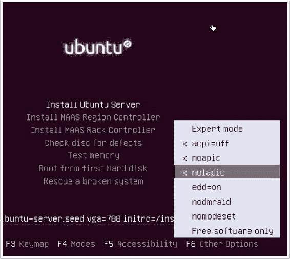
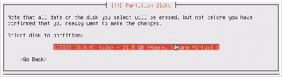
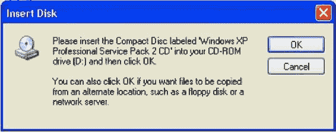
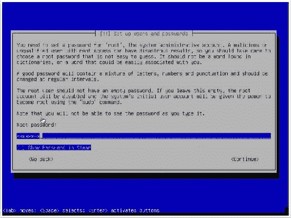
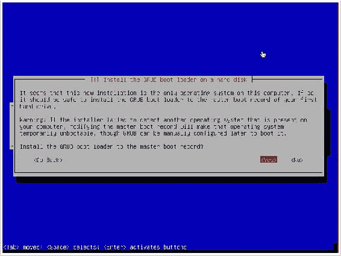

# 第一章：入门

本章将介绍以下内容：

+   使用 VMware Player 配置安全实验室（Windows）

+   使用 VMware Fusion 配置安全实验室（macOS）

+   安装 Ubuntu Server

+   安装 Metasploitable2

+   安装 Windows Server

+   增加 Windows 攻击面

+   安装 Kali Linux

+   使用文本编辑器（Vim 和 GNU nano）

+   保持 Kali 更新

+   管理 Kali 服务

+   配置和使用 SSH

+   在 Kali Linux 上安装 Nessus

# 介绍

本章介绍了设置和配置虚拟安全实验室的基础知识，虚拟安全实验室可以用来练习本书中大多数场景和练习。章节内容包括虚拟化软件的安装、虚拟环境中各种系统的安装，以及一些将用于练习的工具的配置。

# 使用 VMware Player 配置安全实验室（Windows）

通过在 Windows 工作站上安装 VMware Player，你可以在资源相对较少的 Windows PC 上运行虚拟安全实验室。你可以免费获得 VMware Player，或者以低价购买功能更强大的 VMware Player Plus。

# 准备工作

要在 Windows 系统上下载并安装 VMware Player，请按照以下步骤操作：

1.  要在 Windows 工作站上安装 VMware Player，你需要首先下载软件。你可以在 [`my.vmware.com/web/vmware/free`](https://my.vmware.com/web/vmware/free) 下载 VMware Workstation Player 的免费版本。

1.  在此页面上，向下滚动到 VMware Workstation Player 链接，然后点击下载。

1.  在打开的页面上，选择 Windows 64 位安装包，然后点击下载。

1.  也有适用于 Linux 64 位系统的安装包。

# 如何操作……

按照以下步骤设置虚拟环境：

1.  下载软件包后，你应该能够在默认的下载目录中找到它。双击该目录中的可执行文件开始安装过程。启动后，只需按照屏幕上的指示完成安装。

1.  安装完成后，你应该能够通过桌面图标、快速启动图标或从“所有程序”中启动 VMware Player。加载后，你将看到虚拟机库。此时库中尚未包含任何虚拟机，但它们将在你创建时显示在屏幕左侧，如下图所示：


1.  一旦你打开 VMware Workstation Player，你可以选择创建一个新的虚拟机来开始。这样会启动一个非常易于使用的虚拟机安装向导：


1.  安装向导中首先需要执行的任务是定义安装介质。您可以选择直接从主机的光驱安装，或者使用 ISO 镜像文件。此部分讨论的大多数安装将使用 ISO 文件，您可以在每个特定的操作步骤中找到获取这些 ISO 文件的途径。

1.  现在，我们假设我们浏览到一个现有的 ISO 文件并点击了“下一步”。VMware Workstation Player 将尝试确定您选择的 ISO 文件的操作系统。在某些情况下，它无法识别，并会询问您正在安装哪种操作系统。在本例中，我们将选择 Debian 8.x 并点击“下一步”：


1.  然后，您需要为虚拟机分配一个名称。虚拟机名称只是一个任意值，用作标签来标识并与库中的其他虚拟机区分开来。由于安全实验室通常按不同操作系统进行分类，因此在虚拟机名称中指明操作系统会很有用：


1.  下一屏幕要求输入安装的最大大小值。虚拟机只会按需占用硬盘空间，但不会超过此处指定的值。您应该了解操作系统的最小磁盘空间要求，并适当分配空间。此外，您还可以定义虚拟机是被包含在一个文件中，还是分散在多个文件中，如以下截图所示：


1.  完成磁盘容量指定后，您将看到如下界面：


1.  最后一步会提供配置摘要。您可以选择“完成”按钮以最终确定虚拟机的创建，或者选择“自定义硬件…”按钮以调整更高级的配置。请查看以下截图以了解高级配置：


1.  高级配置设置使您可以完全控制共享资源、虚拟硬件配置和网络设置。大多数默认配置应该足够用于您的安全实验室，但如果稍后需要进行更改，您可以通过访问虚拟机设置重新调整这些配置。当您完成高级配置设置后，您将看到类似以下的界面：


1.  安装向导完成后，您应该会在虚拟机库中看到新的虚拟机。在这里，您可以通过按下“播放虚拟机”按钮来启动它。通过打开多个 VMware Workstation Player 实例并在每个实例中运行一个唯一的虚拟机，可以同时运行多个虚拟机。

# 工作原理……

VMware 创建了一个虚拟化环境，在这个环境中，单一主机系统的资源可以共享，从而创建整个网络环境。像 VMware 这样的虚拟化软件使得搭建个人独立学习用的安全实验室变得更加简单且便宜。

# 在 VMware Fusion (macOS) 上配置安全实验室

你还可以通过在 Mac 上安装 VMware Fusion，轻松地运行虚拟安全实验室。VMware Fusion 需要购买许可证，但价格非常合理。

# 准备就绪

要在你的 Mac 上安装 VMware Player，首先需要下载软件。要下载免费试用版或购买软件，请访问[`www.vmware.com/products/fusion/`](https://www.vmware.com/products/fusion/)。

# 如何操作…

以下步骤将帮助你在 macOS 上设置虚拟环境：

1.  一旦软件包下载完成，你应该能够在默认的下载目录中找到它。运行 `.dmg` 安装文件，并按照屏幕上的指示进行安装。

1.  安装完成后，你可以从 Dock 或 Finder 中的`应用程序`目录启动 VMware Fusion。启动后，你将看到虚拟机库窗口。此时，虚拟机库中还没有任何虚拟机，但随着你在屏幕左侧创建它们，它们会逐渐出现在库中。以下截图展示了虚拟机库窗口：


1.  要开始操作，请点击屏幕左上角的“添加”按钮，然后点击“新建”。这将启动虚拟机安装向导。安装向导是一个非常简单的引导过程，帮助你设置虚拟机，如下图所示：


1.  第一步要求你选择安装方式。VMware Fusion 提供了从光盘或映像（ISO 文件）安装的选项，并且提供多种技术来迁移现有系统到新的虚拟机。对于本节讨论的所有虚拟机，请选择第一个选项。

1.  在选择第一个选项“从光盘或映像安装”后，系统会提示你选择要使用的安装光盘或映像。如果没有自动填充内容，或者自动填充的选项不是你想要安装的映像，点击“使用其他光盘或光盘映像...”按钮。这将打开 Finder，允许你浏览并选择想要使用的映像。关于如何获取具体的系统映像文件，本章后续的配方会进行讨论。如果你看到一个带有“使用简易安装”选项的屏幕，只需取消选中“使用简易安装”选项并点击“继续”。


1.  最后，我们会看到完成窗口：


1.  在选择了你想使用的镜像文件后，点击继续按钮，你将进入总结页面。该页面会显示你所选择的配置概览。如果你希望更改这些设置，请点击自定义设置按钮；如果不需要更改，点击完成按钮来创建虚拟机。点击后，你将被要求保存与虚拟机关联的文件。你用来保存的名称将成为虚拟机的名称，并显示在你的虚拟机库中，如下图所示：


1.  随着你添加更多虚拟机，你会看到它们出现在屏幕左侧的虚拟机库中。选择特定虚拟机后，你可以通过点击顶部的启动按钮来启动它。此外，你还可以使用设置按钮来修改配置，或者使用快照按钮在不同时间点保存虚拟机。你可以通过独立启动每个虚拟机，实现同时运行多个虚拟机。

# 它是如何工作的…

在 macOS 操作系统中使用 VMware Fusion，你可以创建一个虚拟化实验环境，在 Apple 主机上构建整个网络环境。像 VMware 这样的虚拟化软件使得为个人独立学习建立安全实验室变得更加容易和便宜。

# 安装 Ubuntu Server

Ubuntu Server 是一个易于使用的 Linux 发行版，可用于托管网络服务和/或用于安全实验室测试的易受攻击软件。如果你更喜欢其他 Linux 发行版，也可以随意使用；然而，Ubuntu 是一个很好的选择，尤其适合初学者，因为有大量公开的参考资料和资源。

# 准备工作

在 VMware 中安装 Ubuntu Server 之前，你需要下载镜像光盘（ISO 文件）。这个文件可以从 Ubuntu 的官方网站 [`www.ubuntu.com/server`](http://www.ubuntu.com/server) 下载。为了本书的目的，我们将使用 Ubuntu 16.10。

# 如何操作…

现在虚拟机已经准备好，但首先，我们需要在虚拟机上安装 Ubuntu。请按照以下步骤在虚拟机上安装 Ubuntu：

1.  在镜像文件加载并从中启动虚拟机后，你将看到默认的 Ubuntu 菜单，如下图所示。该菜单包含多个安装和诊断选项，可以使用键盘进行导航。对于标准安装，请确保选中“安装 Ubuntu Server”选项，然后按*Enter*键：


1.  按下*F6*键并勾选以下选项：acpi=off、noapic 和 nolapic。完成后，点击安装 Ubuntu Server：



1.  当安装过程开始时，系统会要求你回答一系列问题以定义系统的配置。前两个选项要求你指定语言和居住国家。回答这些问题后，你将需要定义键盘布局配置，如下图所示：


1.  有多种选项可供选择来定义键盘布局。一个选项是检测模式，在此模式下，你需要按一系列键，Ubuntu 将自动检测你使用的键盘布局。你可以通过点击“是”来启用键盘检测。或者，你也可以通过点击“否”手动选择键盘布局。默认情况下，该过程会根据你的国家和语言默认选择最可能的选项。

1.  定义键盘布局后，系统会要求你为系统输入主机名。如果你将该系统加入到一个域中，确保主机名是唯一的。接下来，系统会要求输入新用户的全名和用户名。与用户的全名不同，用户名应由一串小写字母组成。用户名中也可以包含数字，但数字不能是第一个字符。请看以下截图：


1.  提供新账户的用户名后，你将被要求设置密码。确保密码是你能记住的，因为稍后你可能需要访问该系统以修改配置。请看以下截图：


1.  提供密码后，系统会要求你决定是否加密每个用户的主目录。虽然这提供了额外的安全性，但在实验环境中并非必需，因为系统中不会保存任何实际的敏感数据。接下来，你将被要求配置系统时钟，如下图所示：


1.  尽管你的系统使用的是内部 IP 地址，它会尝试确定公用 IP 地址，并通过该地址推测适当的时区。如果 Ubuntu 提供的时区猜测正确，选择“是”；如果不正确，选择“否”以手动选择时区。选择时区后，你将被要求定义磁盘分区配置，如下图所示：


1.  如果没有特别的理由选择其他选项，建议选择默认选项。在安全实验室中，你通常不需要进行手动分区，因为每台虚拟机通常只会使用一个单独的分区。选择分区方式后，你将被要求选择磁盘。除非你为虚拟机添加了额外的磁盘，否则这里应该只会看到以下选项：



1.  选择磁盘后，你将被要求审查配置。验证所有内容无误后，确认安装。接下来，你会被问到要为引导分区选择的卷组大小。这应该是你为磁盘指定的全部大小，如下截图所示：


1.  在安装过程之前，你会被要求配置 HTTP 代理。对于本书的目的，单独的代理并不必要，你可以将此字段留空：


1.  接下来，你会被问到如何管理系统的升级。请选择“不自动更新”选项：


1.  最后，你会被询问是否要在操作系统上安装任何软件，如下截图所示：


1.  要选择任何给定的软件，请使用空格键。为了增加攻击面，我已经包括了多个服务，只有虚拟主机和额外的手动软件包选择被排除。选定所需的软件包后，按*Enter*键完成该过程。系统会问你一些关于你选择安装的软件的问题。只需按照提示操作，对于大多数情况，默认选项即可：


1.  软件安装完成后，系统会问你是否希望将 GRUB 引导加载程序安装到硬盘上。选择“是”，然后你的安装过程就完成了。

# 工作原理…

Ubuntu Server 没有图形用户界面，只能通过命令行操作。为了有效使用它，

我建议你使用 SSH。要配置和使用 SSH，请参考*配置和*

*稍后在本章中使用 SSH*的配方。

# 安装 Metasploitable2

**Metasploitable2**是一个故意存在漏洞的 Linux 发行版，也是一个非常有效的安全训练工具。它包含大量易受攻击的网络服务，并且还包括几个易受攻击的 Web 应用程序。

# 准备就绪

在你的虚拟安全实验室安装 Metasploitable2 之前，你需要从网上下载它。有许多镜像站和种子文件可以选择。获取 Metasploitable2 的一个相对简单的方法是通过 SourceForge 从以下网址下载：[`sourceforge.net/projects/metasploitable/files/Metasploitable2/`](http://sourceforge.net/projects/metasploitable/files/Metasploitable2/)。

# 如何操作…

安装 Metasploitable2 可能是你在安全实验室中进行的最简单的安装之一。因为它在从 SourceForge 下载后已经准备好作为 VMware 虚拟机。

1.  一旦 ZIP 文件下载完成，你可以通过在资源管理器或 Finder 中双击它，轻松地在 Windows 或 macOS 上解压其内容。请看以下截图：


1.  解压缩后，ZIP 文件会返回一个包含五个附加文件的目录。目录中包括 VMware 的 VMX 文件。要在 VMware 中使用 Metasploitable2，只需点击文件下拉菜单中的“打开”，然后浏览到通过 ZIP 解压缩过程创建的目录，打开`Metasploitable.vmx`，如以下截图所示：


1.  打开 VMX 文件后，它应该会出现在你的虚拟机库中。从库中选择它，点击“运行”以启动虚拟机并显示以下屏幕：


1.  当虚拟机加载完成后，启动画面将出现，并请求登录凭据。默认凭据是`msfadmin`，用户名和密码均为该值。此机器也可以通过 SSH 访问，稍后在*配置和使用 SSH*的章节中会介绍。

# 它是如何工作的……

Metasploitable 是为了安全测试教育而构建的。它是一个非常有效的工具，但必须小心处理。Metasploitable 系统绝不应暴露于任何不可信的网络中。它绝不应分配公开可路由的 IP 地址，也不应使用端口转发将服务通过**网络地址转换**（**NAT**）接口暴露。

# 安装 Windows Server

在测试实验室中拥有一个 Windows 操作系统对学习安全技能至关重要，因为它是生产系统中使用最广泛的操作系统环境。在提供的场景中，使用的是 Windows XP **Service Pack 2**（**SP2**）。由于 Windows XP 是一个较旧的操作系统，因此在测试环境中可以利用其许多缺陷和漏洞。

# 准备工作

要完成本食谱中讨论的任务以及本书后续的一些练习，你需要获得一个 Windows 操作系统的副本。如果可能，应该使用 Windows XP SP2，因为这是在编写本书时使用的操作系统。选择此操作系统的原因之一是它不再得到 Microsoft 的支持，并且可以相对轻松且几乎无成本地获取。然而，由于它不再得到支持，你需要从第三方供应商处购买或通过其他方式获取它。获取此产品的方式由你决定。

# 如何操作……

让我们在虚拟机上安装 Windows XP：

1.  从 Windows XP 镜像文件启动后，会加载一个蓝色的菜单界面，询问一系列问题，引导你完成安装过程。最初，你需要定义操作系统将要安装到的分区。除非你对虚拟机进行了自定义更改，否则这里应该只有一个选项。然后，你可以选择快速格式化或全盘格式化。无论哪种选择，都足以满足虚拟机的需求。

1.  在回答完这些初步问题后，你将收到一系列有关操作系统配置的问题。然后，你将被引导到以下屏幕：


1.  首先，系统会要求你提供名称和组织名称。名称会分配给创建的初始账户，而组织名称仅用于元数据目的，对操作系统的性能没有影响。

1.  接下来，系统会要求你提供计算机名称和管理员密码，如下图所示：


1.  如果你将系统加入到域中，建议使用一个独特的计算机名称。管理员密码应该是你能记住的，因为你需要登录到这个系统以进行测试或配置更改。然后，系统会要求你设置日期、时间和时区。通常这些会自动填写，但请确保它们是正确的，因为错误的日期和时间配置可能会影响系统性能。请查看以下截图：


1.  配置时间和日期后，系统会要求你将计算机加入工作组或域。书中讨论的大多数练习都可以使用这两种配置之一来执行。然而，有一些远程 SMB 审计任务需要系统加入域。以下截图展示了“帮助保护你的电脑”窗口：


1.  安装过程完成后，系统会提示你通过自动更新来帮助保护你的电脑。默认选项是启用自动更新。然而，由于我们希望增加可供测试的机会，因此我们将选择“稍后再说”选项。

# 工作原理…

Windows XP SP2 是任何初学者安全实验室的绝佳补充。由于它是一个较旧的操作系统，因此存在大量可以测试和利用的漏洞。然而，随着你在渗透测试技术方面的熟练度提升，重要的是要通过引入更新、更安全的操作系统（如 Windows 7）来进一步提升你的技能。

# 增加 Windows 攻击面

为了进一步增加 Windows 操作系统的攻击面，重要的是要添加易受攻击的软件，并启用或禁用某些集成功能。

# 准备工作

在修改 Windows 配置以增加攻击面之前，你需要将操作系统安装到你的虚拟机之一。如果尚未完成此操作，请参阅前面的步骤。

# 操作方法…

现在，按照以下步骤使 Windows XP 更加脆弱：

1.  启用远程服务，尤其是未修补的远程服务，通常是向系统引入漏洞的有效方法。首先，您需要在 Windows 系统上启用**简单网络管理协议**（**SNMP**）。为此，请打开左下角的“开始”菜单，然后点击“控制面板”。双击“添加或删除程序”图标，再点击屏幕左侧的“添加/删除 Windows 组件”链接，您将看到如下屏幕：


1.  在这里，您将看到一个可以在操作系统上启用或禁用的组件列表。向下滚动到“管理和监控工具”并双击打开其中的选项，如下图所示：


1.  打开后，确保“简单网络管理协议”和“WMI SNMP 提供程序”两个复选框已勾选。这样将允许对系统执行远程 SNMP 查询。点击“确定”后，这些服务的安装将开始。此安装将需要 Windows XP 的镜像光盘，VMware 可能在虚拟机镜像创建后删除了该光盘。如果是这种情况，您将看到一个弹出窗口要求您插入光盘，如下图所示：



1.  要使用光盘镜像，请访问虚拟机设置。确保启用了虚拟光驱，然后浏览主机文件系统中的 ISO 文件以添加光盘：


1.  一旦检测到光盘，SNMP 服务的安装将自动完成。Windows 组件向导窗口应在安装完成时通知您。除了添加服务外，您还应该删除一些操作系统中默认包含的服务。为此，请再次打开控制面板并双击“安全中心”图标。向下滚动页面，点击“Windows 防火墙”链接，并确保该功能已关闭，如下图所示：


1.  关闭 Windows 防火墙功能后，点击“确定”返回上一级菜单。再次向下滚动，点击“自动更新”链接，确保它也已关闭。

# 它是如何工作的…

在操作系统上启用功能服务和禁用安全服务会大大增加被攻破的风险。通过增加操作系统中存在的漏洞数量，我们也增加了学习攻击模式和利用机会的数量。本特定步骤仅涉及通过操作 Windows 集成功能来增加攻击面。但它也可以通过安装各种已知存在漏洞的第三方软件包来达到同样效果。

易受攻击的软件包可以在以下网址找到：

[`www.exploit-db.com/`](http://www.exploit-db.com/)

[`www.oldversion.com/`](http://www.oldversion.com/)

# 安装 Kali Linux

**Kali Linux** 被誉为最优秀的黑客发行版之一，提供了完整的渗透测试工具集。开发人员最近发布了 Kali Linux 2016.2，巩固了他们将其打造为滚动发行版的努力。与 GNOME 一起发布的还有其他桌面环境，如 e17、LXDE、Xfce、MATE 和 KDE。在未来的每周更新中，Kali Linux 将持续更新最新的改进和工具。本书中将使用 Kali Linux 2016.2 与 GNOME 作为开发环境，来讨论本书中涉及的许多扫描脚本。

# 准备中

在您的虚拟安全测试实验室安装 Kali Linux 之前，您需要获取

从可信的来源下载 ISO 文件（镜像文件）。Kali Linux ISO 文件可以在 [`www.kali.org/downloads/`](http://www.kali.org/downloads/) 下载。

# 如何操作…

这些步骤将指导您在虚拟机上安装 Kali Linux：

1.  选择 Kali Linux ISO 文件后，系统会询问您正在安装的操作系统。目前，Kali Linux 基于 Debian 8.x 构建。选择此选项并点击继续：


1.  您将看到一个完成屏幕，但我们先来定制设置。Kali Linux 至少需要 15 GB 的硬盘空间和最低 512 MB 的内存：


1.  从 Kali Linux 镜像文件启动后，您将看到初始启动菜单。此时，向下滚动到第六个选项“Install”，按下 *Enter* 键以开始安装过程：


1.  启动后，您将通过一系列问题来完成安装过程。首先，您将被要求提供您的位置（国家）和语言。然后，您可以选择手动设置键盘配置或使用自动检测过程。

1.  下一步将要求您为系统提供主机名。如果系统将加入域，请确保主机名是唯一的，如下图所示：


1.  接下来，您需要为 root 账户设置密码。建议设置一个复杂的密码，以防止轻易被破解。请看下面的截图：



1.  接下来，系统会询问您所在的时区。系统会使用 IP 地理定位来猜测您的位置。如果猜测不正确，请手动选择正确的时区：


1.  对于磁盘分区的设置，使用默认方法和分区方案应该足够满足实验室需求：


1.  建议使用镜像源来确保您的 Kali Linux 软件保持最新：


1.  接下来，你将被要求提供一个 HTTP 代理地址。本书中的任何练习都不需要外部 HTTP 代理，因此可以留空：


1.  最后，选择“Yes”安装 GRUB 启动加载器，然后按*Enter*键完成安装过程。当系统加载时，你可以使用安装过程中提供的 root 账户和密码登录：



# 它是如何工作的……

Kali Linux 是一个 Debian Linux 发行版，预装了大量第三方渗透测试工具。虽然所有这些工具都可以独立获取和安装，但 Kali Linux 所提供的组织和实现方式使其成为任何严肃渗透测试人员的有用工具。

# 使用文本编辑器（Vim 和 GNU nano）

文本编辑器将被频繁使用来创建或修改文件系统中的现有文件。每当你想在 Kali 中创建自定义脚本时，都应使用文本编辑器。每当你想修改配置文件或现有的渗透测试工具时，也应使用文本编辑器。

# 准备工作

在 Kali Linux 中使用文本编辑器工具之前，不需要进行额外的步骤。Vim 和 GNU nano 是集成工具，已经预装在操作系统中。

# 如何操作……

使用 Linux 编辑器：

1.  要在 Kali 中使用 Vim 文本编辑器创建文件，请使用`vim`命令，后跟要创建或修改的文件名：


在提供的示例中，使用`vim`命令创建一个名为`vim_demo.txt`的文件。由于当前目录中没有该文件，Vim 会自动创建一个新文件并打开一个空白文本编辑器。

1.  要开始在编辑器中输入文本，请按*I*键或*Insert*按钮。然后，开始输入所需的文本，如下所示：


在提供的示例中，仅添加了一行文本。然而，在大多数情况下，当创建新文件时，你可能会使用多行文本。

1.  完成后，按下*Esc*键退出插入模式并进入 Vim 的命令模式。然后，输入`:wq`并按*Enter*键保存。接着，你可以使用以下 bash 命令来验证文件是否存在并检查其内容：


可以使用`ls`命令查看当前目录的内容。在这里，你可以看到`vim_demo.txt`文件已被创建。可以使用`cat`命令来读取和显示文件的内容。

1.  另一种可用的文本编辑器是 GNU nano。GNU nano 的基本用法与 Vim 非常相似。要开始使用，请使用`nano`命令，后跟要创建或修改的文件名：


在提供的示例中，使用`nano`命令打开一个名为`nano_demo.txt`的文件。由于当前没有该名称的文件，因此会创建一个新文件。

1.  与 Vim 不同，这里没有独立的命令模式和写入模式。相反，文件写入是自动完成的，命令通过按下*Ctrl*键并结合特定字母键来执行。你可以随时在文本编辑器界面的底部看到这些命令的列表：


在示例中，向`nano_demo.txt`文件写入了一行内容。要关闭编辑器，可以使用*Ctrl* + *X*。然后系统会提示你是否保存文件，按`y`保存或按`n`不保存。系统还会询问你确认写入的文件名。默认情况下，文件名会填充为执行`nano`命令时所提供的名称。不过，你可以修改该值，并将文件内容保存到不同的文件名中，如下所示：


1.  完成后，可以再次使用`ls`和`cat`命令来验证文件是否已写入目录，并分别验证文件的内容。

本教程的目的是讨论如何使用这两款编辑器编写和操作文件。然而，值得注意的是，这两款文本编辑器都非常强大，拥有大量其他文件编辑功能。欲了解更多关于这两款编辑器的使用信息，请使用`man`命令后接特定文本编辑器的名称，查看其手册。

# 它是如何工作的……

文本编辑器不过是命令行驱动的文字处理工具。每一个工具及其相关功能都可以在没有图形界面的情况下执行。由于缺乏图形组件，这些工具所需的资源非常少，运行速度极快。因此，它们非常适合快速修改文件或通过远程终端接口（如 SSH 或 Telnet）进行处理。

# 保持 Kali 更新

现在我们已经安装了 Kali Linux，接下来我们需要保持其更新，确保工具、补丁和改进始终是最新的。

# 准备工作

在修改 Kali Linux 配置之前，你需要在虚拟机上安装操作系统。如果你还没有完成这一步，请参考*安装 Kali Linux*这篇教程。

# 如何操作……

Kali Linux 在安装后应该已经准备好并配置完成，但我们还是需要进行检查。Kali 使用名为`apt-get`的软件包管理器。

1.  我们要做的第一件事是检查`apt-get`用于查找更新的源。进入`/etc/apt/`目录，你应该能看到一个名为`sources.list`的文件。如果该文件不存在，也没关系；我们将会创建它。

1.  在终端运行以下命令。如果文件存在，它会被打开；如果不存在，则会创建该文件：


1.  现在，如果以下资源尚未添加到文件中，我们需要将它们添加进去。确保不要添加任何额外的资源，以免破坏你的 Kali 安装：

```
 deb http://http.kali.org/kali kali-rolling main non-free contrib

```

1.  你的文件应该如下所示：


1.  一旦文件与我们之前所述的匹配，保存并关闭它。现在我们将运行一些命令。这些命令应该定期运行，以保持系统更新。`apt-get upgrade` 和 `apt-get dist-upgrade` 命令后面加上的 `-y` 标志表示在提示时默认选择 *yes*：


1.  命令执行可能需要一段时间，所以你可以在等待时去喝杯咖啡。重启 Kali Linux，过程就完成了。你将需要定期运行之前的命令，以保持系统最新。

# 工作原理……

使用 Kali Linux 的滚动更新可以让你获取应用程序和测试工具的最新软件包版本，而不需要等待操作系统下一个静态版本的发布。Kali Linux 默认预装了 `apt-get`，这是与 Ubuntu 相同的软件包管理工具，也是 Kali Linux 用来保持系统更新的工具。

# 管理 Kali 服务

在 Kali Linux 中，某些服务自动启动会非常有用。例如，假设我希望能够通过 SSH 连接到我的 Kali Linux 发行版（在 *配置和使用 SSH* 这一节中有讲解）。默认情况下，Kali 中的 SSH 服务器不会自动启动，因此我需要登录虚拟机，打开终端，运行命令以启动该服务。

# 准备工作

在修改 Kali Linux 配置之前，你需要已经在虚拟机上安装了操作系统。如果你还没有做这一步，请参考 *安装 Kali Linux* 这一节。

# 如何操作……

使用 Kali Linux：

1.  我们首先登录到 Kali Linux 发行版并打开一个终端窗口。输入以下命令：


1.  很可能它已经安装，你会看到类似下面的信息：


1.  既然我们知道它已安装，让我们查看服务是否正在运行。从终端中输入以下命令：


1.  如果 SSH 服务器未运行，你会看到类似以下内容：


1.  按 *Ctrl* + *C* 返回提示符。现在让我们启动服务并通过输入以下命令再次检查状态：


1.  你现在应该会看到类似下面的内容：


1.  现在，服务正在运行。太好了，但如果我们重启计算机，我们会发现该服务不会自动启动。为了让服务在每次启动时都能自动启动，我们需要进行一些配置更改。Kali Linux 采取了一些额外的措施，确保你不会让服务自动启动。具体来说，它有一个服务白名单和黑名单文件。因此，要使 SSH 服务在启动时自动启动，我们需要将 SSH 服务从黑名单中移除。为此，打开一个终端窗口并输入以下命令：


1.  导航到标记为 `List of blacklisted init scripts` 的部分，找到 `ssh`。现在，我们只需在该行的开头添加一个 `#` 符号，保存文件并退出。文件应如下图所示：


1.  现在我们已经移除了黑名单策略，接下来只需要启用 SSH 在启动时自动运行。为此，请从终端运行以下命令：


就是这样！现在，当您重新启动时，服务将自动启动。您可以使用相同的程序在启动时自动启动其他服务。

# 它是如何工作的……

`rc.local` 文件在所有正常的 Linux 服务启动后执行。它可用于启动您希望在开机后可用的服务。

# 配置和使用 SSH

同时处理多个虚拟机可能会变得繁琐、耗时且令人沮丧。为了减少从一个 VMware 屏幕跳转到另一个屏幕的需求，并提高虚拟系统之间的通信便利性，配置并启用每个虚拟机上的 SSH 非常有帮助。本篇将讨论如何在每个 Linux 虚拟机上使用 SSH。

# 准备工作

要在虚拟机上使用 SSH，您必须首先在主机系统上安装 SSH 客户端。大多数 Linux 和 macOS 系统都集成了 SSH 客户端，并可以通过终端接口访问。如果您使用的是 Windows 主机，您需要下载并安装一个 Windows 终端服务客户端。一个免费的、易于使用的客户端是 PuTTY。

PuTTY 可以从 [`www.putty.org/`](http://www.putty.org/) 下载。

# 如何操作……

跟着步骤配置 Kali Linux 上的 SSH 客户端（我们使用的是 PuTTY）：

1.  您最初需要直接从图形桌面界面的终端启用 SSH。此命令需要在虚拟机客户端中直接运行。除了 Windows XP 虚拟机外，实验室中的其他所有虚拟机都是 Linux 发行版，应该原生支持 SSH。如果您按照 *管理 Kali 服务* 的方法操作，SSH 服务应该已经在运行。如果没有，启用方法几乎适用于所有 Linux 发行版，如下所示：


1.  `/etc/init.d/ssh start` 命令将启动该服务。如果您没有以 root 用户身份登录，需要在此命令前加上 `sudo`。

1.  如果收到错误提示，可能是设备上未安装 SSH 守护进程。如果是这种情况，可以使用 `apt-get install ssh` 命令安装 SSH 守护进程。然后，可以使用 `ifconfig` 获取系统的 IP 地址，用于建立 SSH 连接。

1.  启用后，您可以通过 SSH 从主机系统访问 VMware 客户系统。为此，请最小化虚拟机并打开主机的 SSH 客户端。

1.  如果你使用的是 macOS 或 Linux 作为主机系统，可以直接从终端调用客户端。或者，如果你在 Windows 主机上运行虚拟机，则需要使用终端模拟器，如 PuTTY。在以下示例中，SSH 会话是通过提供 Kali 虚拟机的 IP 地址来建立的：

下载示例代码

你可以从[`www.packtpub.com`](http://www.packtpub.com)账户下载所有已购买的 Packt 图书的示例代码文件。如果你是从其他地方购买的这本书，可以访问[`www.packtpub.com/support`](http://www.packtpub.com/support)并注册，文件会直接通过电子邮件发送给你。

1.  设置好连接配置后，点击“打开”按钮以启动会话。然后，系统会提示输入用户名和密码。我们需要输入连接目标系统的凭据。完成身份验证后，我们将获得远程终端访问权限，如下图所示：


1.  通过在远程主机的`authorized_keys`文件中提供你的公钥，可以避免每次都进行身份验证。具体操作流程如下：

```
 ssh-copy-id (user)@(host)

```


1.  完成上述步骤后，你应该能够在不输入密码的情况下直接通过 SSH 连接：


# 它是如何工作的…

SSH 建立了客户端和服务器之间的加密通信通道。这个通道可用于提供远程管理服务，并通过**安全拷贝**（**scp**）安全地传输文件。

# 在 Kali Linux 上安装 Nessus

Nessus 是一款功能强大的漏洞扫描器，可以安装在 Kali Linux 平台上。本节将讨论安装、启用并激活 Nessus 服务的过程。

# 准备工作

在尝试在 Kali Linux 上安装 Nessus 漏洞扫描器之前，你需要获取插件源激活码。这个激活码是必须的，用于获取 Nessus 用于评估网络系统的审计插件。如果你仅在家中或实验室中使用 Nessus，可以免费获得一个*家庭源密钥*。另外，如果你打算将 Nessus 用于生产系统的审计，你需要获取一个*专业源密钥*。无论哪种情况，你都可以在[`www.tenable.com/products/nessus/nessus-plugins/obtain-an-activation-code`](http://www.tenable.com/products/nessus/nessus-plugins/obtain-an-activation-code)上获得该激活码。

# 如何操作…

要在系统上安装 Nessus，请按以下步骤操作：

1.  一旦你获得了插件激活码，你需要下载 Nessus 安装包，下载地址为 [`www.tenable.com/products/nessus/select-your-operating-system`](http://www.tenable.com/products/nessus/select-your-operating-system)。以下截图展示了 Nessus 可以运行的各种平台及其对应的安装包：


1.  选择与你安装的操作系统架构相匹配的安装包。选择后，阅读并同意 Tenable 提供的订阅协议。系统将自动下载安装包。点击“保存文件”，然后选择你希望保存的位置：


1.  在提供的示例中，我将安装包保存到了根目录。一旦下载完成，你可以通过命令行完成安装。这可以通过 SSH 或图形桌面上的终端以以下方式完成：


1.  使用 `ls` 命令验证安装包是否在当前目录中。你应该会在响应中看到它。然后可以使用 **debian 包管理器**（**dpkg**）工具安装该服务。

1.  `-i` 参数告诉包管理器安装指定的包。安装完成后，可以使用命令 `/etc/init.d/nessusd start` 启动服务。Nessus 完全通过 Web 界面运行，并且可以轻松地从其他机器访问。如果你想从 Kali 系统管理 Nessus，可以通过 Web 浏览器访问 `https://127.0.0.1:8834/`。

1.  或者，你可以通过网页浏览器使用 Kali Linux 虚拟机的 IP 地址，从远程系统（如主机操作系统）访问它。在提供的示例中，从主机操作系统访问 Nessus 服务的适当 URL 是 `https://172.16.36.244:8834`：


1.  默认情况下，Nessus 服务使用自签名 SSL 证书，因此你会收到不受信任的连接警告。对于安全实验室的使用，你可以忽略此警告并继续操作。可以通过展开“我理解风险”选项来实现，如下图所示：


1.  展开此选项后，你可以点击“添加例外”按钮。这将防止你每次尝试访问服务时都要处理此警告。添加服务为例外后，你将看到欢迎界面。从这里点击“开始使用”按钮，接着会跳转到下一个界面：


1.  首先需要设置的配置是管理员的用户帐户和相关密码。这些凭据将用于登录并使用 Nessus 服务。在输入新用户名和密码后，点击“下一步”继续；你将看到以下屏幕：


1.  然后，你需要输入插件订阅激活码。如果没有激活码，请参考本教程的*准备工作*部分。最后，在输入激活码后，你将返回登录页面并要求输入用户名和密码。在这里，你需要输入在安装过程中创建的相同凭据。以下是 Nessus 每次访问该 URL 时加载的默认屏幕：


# 它是如何工作的…

一旦正确安装，Nessus 漏洞扫描器应该可以从主机系统以及所有安装了图形网页浏览器的虚拟机中访问。这是因为 Nessus 服务托管在 TCP 端口`8834`上，并且主机与所有其他虚拟系统的网络接口都位于相同的私有 IP 地址空间中。
