# 第二章：侦察

本章将包括以下内容：

+   使用 Google 查找子域名

+   使用 theHarvester 查找电子邮件地址

+   使用`host`命令枚举 DNS

+   使用 DNSRecon 枚举 DNS

+   使用`dnsenum`命令枚举 DNS

# 引言

在本章中，我们将开始收集关于目标的信息。这一过程从利用公共来源的被动信息收集技术开始，然后转向对目标的主动扫描。此时，我们需要讨论我们的策略。一旦确定目标，我们就需要开始收集它们的信息。关键信息之一是它们的域名。**域名系统**（**DNS**）是一个数据库系统，用于查找域名的 IP 地址，或者给定一个 IP 地址，提供与之相关联的域名。识别与目标相关联的域名和子域名将帮助我们更好地了解目标的资产和组织。我们首先使用 Google 和其他公共来源来揭示我们能找到的信息。这就是所谓的**侦察**或**被动信息收集**。

当我们完成利用公共来源找到的信息后，我们将进入主动信息收集阶段。这里的界定是，接下来我们将与目标的资产进行物理交互。我们首先通过主动查询目标的 DNS 服务器来获取更多信息。利用这些信息，我们可以开始缩小目标范围。本次操作的目标是发现适合进一步调查的目标网络。

接下来，在第三章《*发现*》中，我们进行发现扫描，以识别网络上的活动主机。在渗透测试的背景下，这通常是为了识别潜在的攻击目标。这里的目标不是耗费资源去收集关于目标的信息，而是简单地找出目标在逻辑上的位置。我们发现的最终成果应该是一个 IP 地址列表，接下来可以用于进一步分析。

在识别 IP 地址之后，我们将识别这些机器的开放端口；这在第四章《*端口扫描*》中有所介绍。在识别开放端口后，我们需要确定服务及其版本、操作系统和其他尽可能多的细节；这在第五章《*指纹识别*》中有所介绍。利用这里找到的信息，我们将寻找目标资产上的特定漏洞；这在第六章《*漏洞扫描*》中有所介绍。下图总结了上述方法：

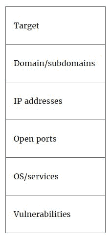

# 使用 Google 查找子域名

很多信息可以通过公开的来源收集。作为渗透测试者，我们应当利用任何方法以匿名的方式收集关于目标的有价值信息。

# 准备工作

执行这个操作只需要互联网连接和一个网页浏览器。

# 如何进行…

在这个例子中，我们将使用 Google 搜索引擎；然而，请注意，实际上有许多其他搜索引擎可以提供类似的信息，并且在某些情况下，它们还可以提供更多或不同的数据。Google 搜索引擎提供了一些搜索操作符，可以帮助你在执行查询时缩小搜索结果范围。对渗透测试者特别有用的几个操作符包括`site:`、`inurl:`和`intitle:`。

对于我们的目的（查找子域），我们将使用`site:`搜索操作符，如下所示：

1.  访问[`www.google.com`](https://www.google.com)，我们将搜索属于`google.com`域的站点。我们通过搜索`site:google.com`来实现，如下图所示：


1.  正如你所看到的，Google 找到了大约 29 亿个结果，但几乎所有结果都是`www.google.com`子域。因此，我们的下一步是过滤掉这些结果，以便继续查找独特的子域。我们通过修改查询`site:google.com -site:www.google.com`来完成这一操作，如下图所示：

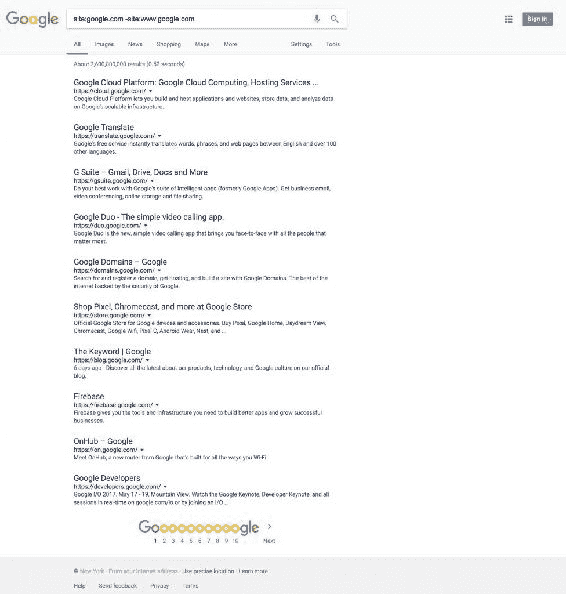

1.  我们找到了 cloud.google.com、translate.google.com、gsuite.google.com、duo.google.com、domains.google.com、store.google.com、blog.google.com、firebase.google.com、on.google.com 和 developers.google.com 等附加子域。在某些情况下，你可能需要多次重复这一过程，逐步排除已找到的子域：

`site:google.com -site:www.google.com -site:cloud.google.com -site:translate.google.com -site:gsuite.google.com -site:duo.google.com -site:domains.google.com -site:store.google.com -site:blog.google.com -site:firebase.google.com -site:on.google.com -site:developers.google.com`

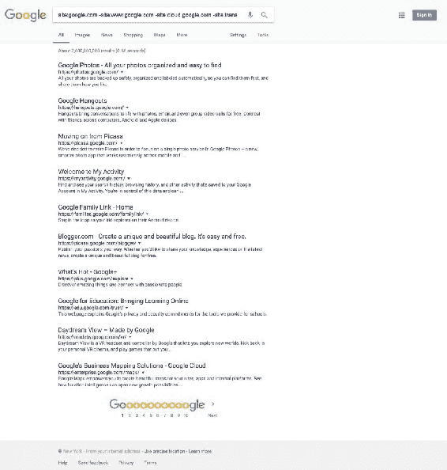

# 它是如何工作的…

Google 是一个功能强大的工具，拥有丰富的知识。学习如何使用它的搜索操作符，对于渗透测试者来说，非常有用和有价值。

# 使用 theHarvester 查找电子邮件地址

通过公开可用的信息，我们还可以收集关于目标组织成员的个人信息。这种被动信息收集对于社会工程学或部署攻击可能非常有价值。

# 准备工作

theHarvester 在 Kali Linux 上预装。如果你使用的是其他 Linux/Unix 发行版，可以从[`github.com/laramies/theHarvester`](https://github.com/laramies/theHarvester)下载并安装。

# 如何进行…

theHarvester 是一个非常出色的工具，可以从公共来源收集有关一个组织的信息。使用该工具，我们可以查询 Google、Bing、Twitter、LinkedIn 等多个来源。

1.  要查看 theHarvester 的帮助和选项，只需打开终端并输入以下命令：

```
 theharvester

```

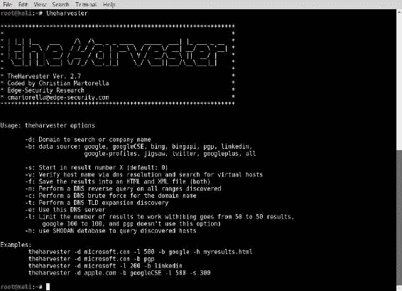

1.  为了使用 Google 搜索引擎从 `google.com` 查找电子邮件地址，我们将使用以下命令：

```
 theharvester -d google.com -l 500 -b google

```

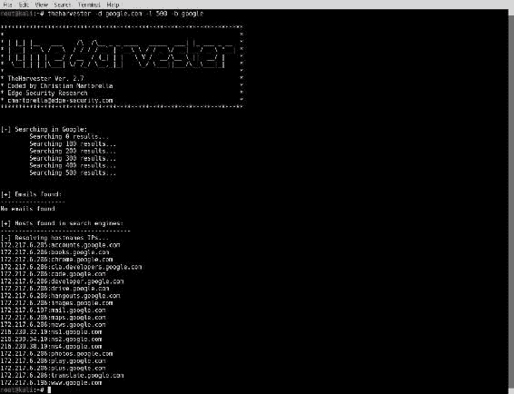

1.  该命令使用 `-d` 作为我们要搜索的域名，`-l` 用于限制结果数量，`-b` 用于定义数据源。此外，我们还可以使用 `-f` 标志将结果写入文件。

1.  theHarvester 并不总是返回电子邮件地址。如果我们使用 LinkedIn 作为数据源，可以获取用户列表。然而，对于这个域名，我们没有收到任何电子邮件地址：

```
 theharvester -d google.com -l 500 -b linkedin

```

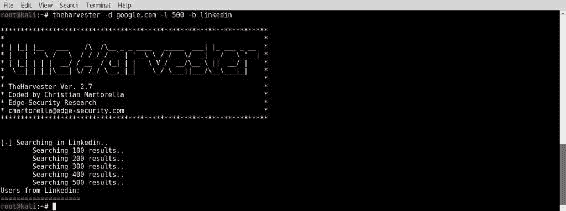

1.  我们还可以搜索所有数据源。通过此操作，我们不仅会发现电子邮件地址，还能找到主机和虚拟主机。

```
 theharvester -d google.com -l 500 -b all

```

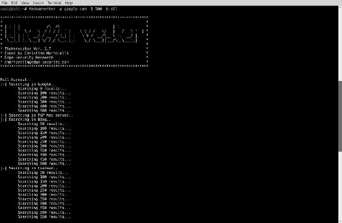

1.  TheHarvester 开始查询所有数据源，然后输出其发现结果：

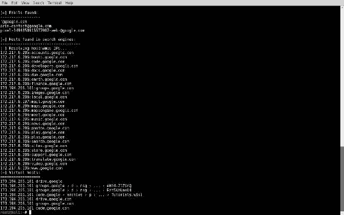

# 它是如何工作的…

theHarvester 是一个优秀的工具，它查询公开的数据源并提供您传递给它的域名信息。该信息包括子域名、LinkedIn 用户和电子邮件地址。

# 使用 `host` 命令枚举 DNS

前一部分讲解了如何使用公开的 Google 搜索引擎查找子域名。虽然这很有用，但我们不应假设所有的子域名都能通过这种方法找到。接下来的几部分将讲解如何使用主动发现方法来查找子域名。

# 准备工作

为了准备使用 `host` 命令，您只需从 Kali Linux 发行版中打开终端。

`host` 命令是 Unix、Linux 和 macOS 系统的标准命令。

# 如何执行...

使用 `host` 命令：

1.  DNS 服务器是地址簿；因此，通常它们会透露至少一些关于它们所掌管域名的信息。`host` 命令是一个执行 DNS 查找的工具。所以我们可以使用 `host` 命令来调查目标域名的信息。我们可以使用 `-a` 标志进行全面查找，或者使用 `-t` 标志后跟类型来获取特定信息：

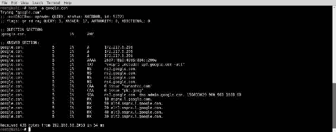

1.  以下命令将显示与 `google.com` 相关的名称服务器：

```
 host -t ns google.com

```

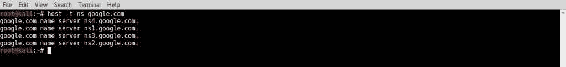

1.  以下命令将显示该域名的邮件服务器详细信息：

```
 host -t mx google.com

```

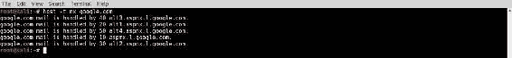

1.  至少现在我们应该有负责 `google.com` 的 DNS 和邮件服务器，但我们还能找到与 `google.com` 域名相关的其他内容吗？在之前的练习中，我们已经找到了一些相关的 Web 服务器。让我们更仔细地查看一下：

```
 host google.com

```

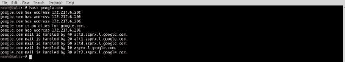

1.  如果我们尝试一些不存在的内容呢？我们可以期望得到什么结果？

```
 host madeupsub.google.com

```


1.  我们收到错误消息，表示找不到该子域名。知道这一点后，我们可以测试一些常见子域名，看看它们是否存在。一些常见的子域名包括 mail、blog、ftp、dev、admin、wiki 和 help。当然，这并不是一个完整的列表，可能还有一些不常见的子域名。

1.  我们也可以使用 `host` 命令执行区域传输。为了做到这一点，我们需要分析的域名和相应的 nameserver 地址。请记住，通常 DNS 配置为不允许进行传输。我们来尝试使用之前找到的 nameserver `ns1.google.com` 来进行 `google.com` 的传输：

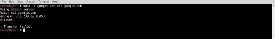

1.  有时候一个组织可能有大量的 nameserver。在这种情况下，自动化该过程是有意义的。

1.  在接下来的 bash 脚本中，我们首先为给定域名生成一个 nameserver 列表，然后遍历每个 nameserver，尝试进行区域传输：

```
        #!/bin/bash

        if [ ! $1 ]; then 
        echo "Usage: #./dns-find-transfer.sh <domain>"; 
        exit; 
        fi

        for server in $(host -t ns $1 |cut -d" " -f4);do
        printf $server | sed 's/.$//'
        host -l $1 $server |grep "Address: " | cut -d: -f2 |
         sed 's/...$//'
        done

```

1.  现在我们可以运行脚本并查看结果：

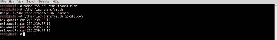

# 它是如何工作的…

`host` 命令是一个简单的工具，用于查询主机或 IP 地址的相关信息。

# 使用 DNSRecon 枚举 DNS

在接下来的部分中，我们将探索一些可以帮助我们进行 DNS 侦察的工具。实际上，这意味着识别我们目标组织的 DNS 服务器，进而获取它们包含的 DNS 条目。

# 准备工作

DNSRecon 已预装在 Kali Linux 上。如果你使用的是其他 Linux/Unix 发行版，它可以从 [`github.com/darkoperator/dnsrecon`](https://github.com/darkoperator/dnsrecon) 下载并安装。

# 如何操作…

DNSRecon 是由 Carlos Perez 编写的 Python 脚本，用于进行 DNS 侦察。它可以枚举常规 DNS 记录，执行区域传输，执行反向查找，进行子域名暴力破解等功能。它甚至可以执行 Google 扫描，自动化我们在 *使用 Google 查找子域名* 部分中讨论的过程。要查看 `dnsrecon` 的使用信息，请在 `/usr/share/dnsrecon` 目录中运行以下命令：

```
dnsrecon -h

```

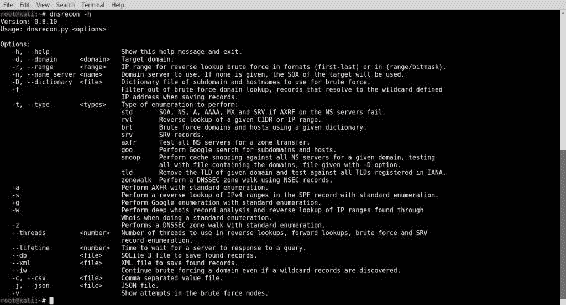

# 标准 DNS 枚举

标准 DNS 枚举应该提供 SOA、NS、A、AAAA、MX 和 SRV 记录（如有）。如果我们运行 `dnsrecon` 而不传递类型（`-t`）标志，它将执行标准枚举。为了传递我们希望扫描的域名，我们使用域名（`-d`）标志，后跟目标域名。要对我们的目标域名 [google.com](http://google.com) 执行标准枚举，请运行以下命令：

```
dnsrecon -d google.com

```

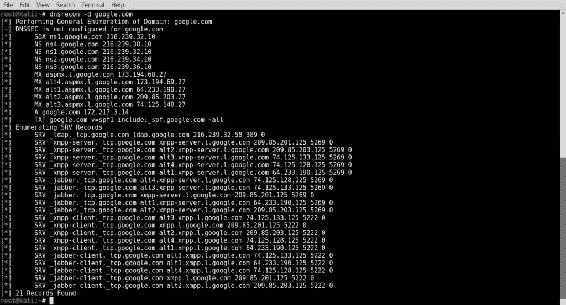

# 反向查找

我们还可以使用 `dnsrecon` 通过提供一个 IP 地址范围来执行反向查找。我们使用范围（`-r`）标志，后跟我们希望其执行查找的 IP 范围，如以下示例所示：

```
dnsrecon -r 216.239.34.00-216.239.34.50

```

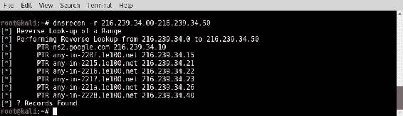

# 区域传输

DNS 区域传输是域名管理员用于将其 DNS 数据库复制到组织 DNS 服务器的工具。问题是，这可能会泄露很多关于组织基础设施的信息。因此，通常 DNS 服务器会配置为不允许区域传输。要使用`dnsrecon`尝试区域传输，我们需要使用`-a`标志（AXFR），或者可以使用`-t`标志并指定类型为`axfr`。`axfr`类型是表示 DNS 区域传输的查询类型。运行区域传输的命令如下：

```
dnsrecon -d google.com -a

```

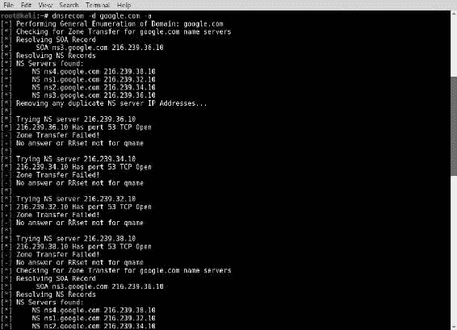

如你所见，在我们的例子中，区域传输失败了，但尝试一下并无妨。偶尔，你可能会遇到配置不当的 DNS 服务器，未能正确阻止此类操作。

# 它是如何工作的…

DNS 服务器的设计是接收查询并提供地址信息。`dnsrecon`脚本利用此功能来枚举 DNS 服务器，从而揭示有关组织基础设施的信息。

# 使用`dnsenum`命令枚举 DNS

与`dnsrecon`类似，`dnsenum`是用于枚举 DNS 信息的工具。`dnsenum`脚本是由 Filip Waeytens 编写的一个多线程 Perl 脚本，用于进行 DNS 侦察。它可以用于枚举域名的 DNS 信息，以便寻找不连续的 IP 块。它不仅帮助发现不连续的 IP 块，还提供其他几种信息，如主机地址的*A*记录、线程化的名称服务器、线程化的 MX 记录以及线程化的*bind 版本*。

# 准备工作

`dnsenum`脚本在 Kali Linux 上是预安装的。如果你使用的是其他 Linux/Unix 发行版，可以从[`github.com/fwaeytens/dnsenum`](https://github.com/fwaeytens/dnsenum)下载并安装。

# 它是如何做到的…

要查看`dnsenum`命令的使用信息，请从终端运行以下命令：

```
dnsenum -h

```

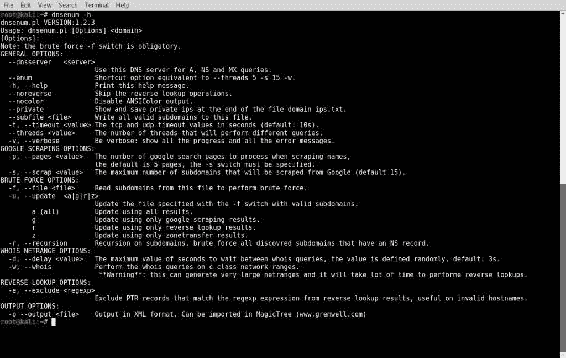

# 默认设置

如果我们不使用任何标志运行`dnsenum`，它将以默认设置运行。默认设置如下：

+   `thread 5`（如前所述，脚本是多线程的；此设置决定了它将使用多少个线程）

+   `s 15`（这决定了它从 Google 抓取的最大子域数）

+   `-w`（此标志告诉脚本运行`whois`查询）

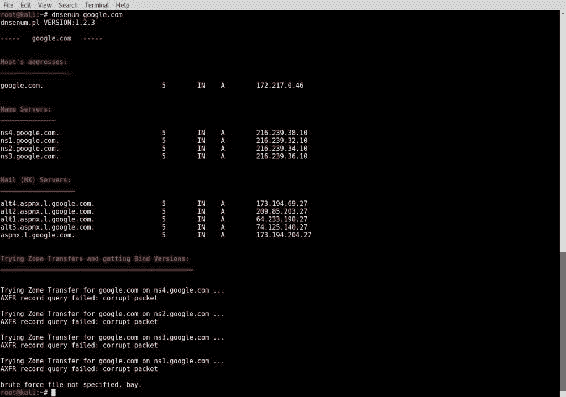

# 暴力破解

`dnsenum`命令的真正亮点在于暴力破解，它是递归进行的。这意味着当它识别出`subdomain.domain.com`时，它将开始暴力破解`subdomain.subdomain.domain.com`。显然，即使它是多线程脚本，这个过程可能也需要一些时间。

在接下来的示例中，我们将使用`dnsenum`命令进行子域名的暴力破解，但首先，我们需要一份供`dnsenum`使用的子域名列表。有一个非常有趣的项目叫做**dnspop**，它能识别出顶级子域名。

该项目可以在 [`github.com/bitquark/dnspop`](https://github.com/bitquark/dnspop) 找到。我们不需要下载和安装 Python 脚本，因为结果也发布在 [`github.com/bitquark/dnspop/tree/master/results`](https://github.com/bitquark/dnspop/tree/master/results)。我已经下载了包含前 1000 个最流行子域的列表，并将其放置在 `/usr/share/wordlists/subdomains/` 目录中。

我创建了子域目录，并命名为 `subdomains_popular_1000`。

现在我们有了 `dnsenum` 可以用来进行暴力破解的名称列表。暴力破解子域的命令使用 `-f` 标志，后跟文件路径/名称，如果需要，还可以使用递归标志 (`-r`) 来递归枚举子域。命令如下所示：

```
dnsenum -f /usr/share/wordlists/subdomains/subdomains_popular_1000 -r google.com 

```

上述命令执行以下操作：

1.  首先，`dnsenum` 命令执行默认的查找操作：

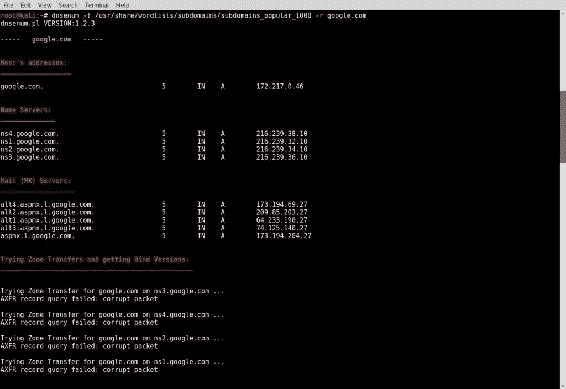

1.  接下来，`dnsenum` 开始暴力破解子域：

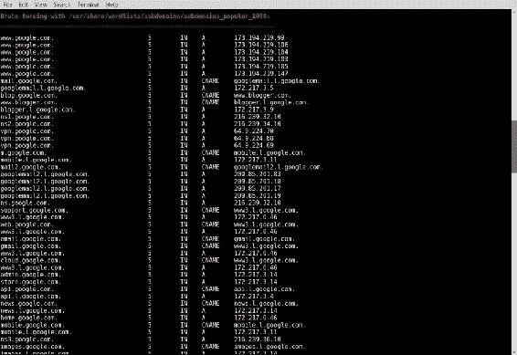

1.  一旦完成对子域的暴力破解，它将开始递归地进行暴力破解：

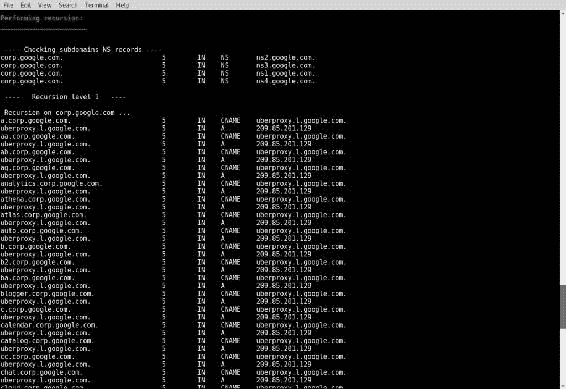

# 它是如何工作的……

`dnsenum` 命令有许多选项可以使用，且此脚本会根据所选选项收集信息或执行相应的操作。一旦你枚举了 DNS，使用 `–o` 或 `--output <file>` 选项将输出写入 XML 文件。
