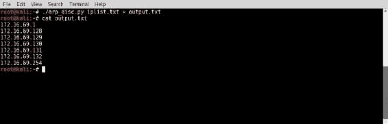
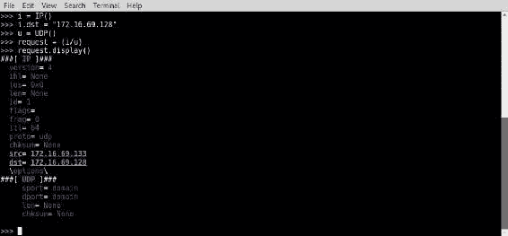
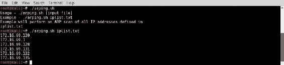
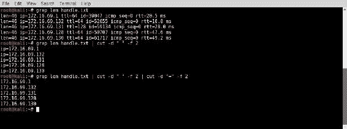
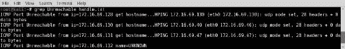
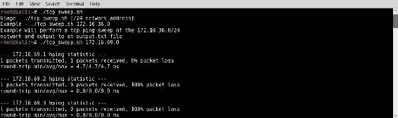

# 第三章：主机发现

本章将包括以下几种方法：

+   使用 Scapy 执行主机发现（第 2/3/4 层）

+   使用 Nmap 执行主机发现（第 2/3/4 层）

+   使用 ARPing 执行主机发现（第 2 层）

+   使用 netdiscover 执行主机发现（第 2 层）

+   使用 Metasploit 执行主机发现（第 2 层）

+   使用 ICMP 执行主机发现

+   使用 fping 执行主机发现

+   使用 hping3 执行主机发现（第 3/4 层）

# 引言

**主机发现扫描**是识别网络中在线主机的过程。在渗透测试中，通常执行此操作以识别潜在的攻击目标。

渗透测试中，通常执行此操作以识别潜在的攻击目标。

本章的目标不是耗尽资源来收集关于目标的信息，而是仅仅找到目标在逻辑上的位置。我们的最终发现结果应是一个 IP 地址列表，之后可以用于进一步分析。在本章中，我们将讨论如何通过使用在 OSI 模型第 2 层、第 3 层和第 4 层的协议来发现网络中的主机。

# 了解 OSI 模型

在具体讨论每种扫描技术之前，我们应先介绍一些基本原则。**开放系统互联**（**OSI**）模型是**国际标准化组织**（**ISO**）的标准，定义了网络系统之间的通信方式。该模型分为七层，定义了应用内容如何由一个系统发送或由另一个系统接收。OSI 模型的上层（5-7 层）主要用于与用户交互，而下层（1-4 层）则处理编码、格式化和传输。这些层包括：

| **OSI 模型** | **层描述** | **协议** |
| --- | --- | --- |
| 第 7 层：应用层 | 该层涉及发送和接收数据的应用软件 | HTTP、FTP 和 Telnet |
| 第 6 层：表示层 | 该层定义数据的格式或组织方式 | ASCII、JPEG、PDF、PNG 和 DOCX |
| 第 5 层：会话层 | 该层涉及应用会话控制、管理、同步和终止 | NetBIOS、PPTP、RPC 和 SOCKS |
| 第 4 层：传输层 | 该层涉及端到端的通信服务 | TCP 和 UDP |
| 第 3 层：网络层 | 该层涉及逻辑系统寻址 | IPv4、IPv6、ICMP 和 IPSec |
| 第 2 层：数据链路层 | 该层涉及物理系统寻址 | ARP |
| 第 1 层：物理层 | 该层涉及通过电缆传输的数据流 |  |

OSI 模型的较低层主要用于确保网络流量成功到达预定目的地。在这些较低层中，许多常用协议需要目标系统的响应，因此，潜在的攻击者可以利用这些协议识别存活的系统。本节剩余部分讨论的技术将利用第二、三、四层的协议来发现存活的网络系统。在详细讨论每个具体方法之前，我们将简要介绍所使用的协议及其如何被用于发现。

使用 ARP 进行第二层发现的优缺点如下：

+   **优点**：

    +   非常快

    +   高度可靠

+   **缺点**：

    +   无法发现远程系统（不可路由协议）

第二层发现扫描使用 **地址解析协议**（**ARP**）流量进行。ARP 是一个第二层协议，主要用于将逻辑第三层 IP 地址转换为物理第二层 MAC 地址。当系统需要定位与目标 IP 地址对应的物理地址时，它会在本地网络段广播一个 ARP 请求包。这个 ARP 请求实际上是在问整个网络：“谁拥有这个 IP 地址？”具有指定 IP 地址的系统会直接回复询问系统，发送包含其第二层 MAC 地址的 ARP 回复。询问系统会更新其 ARP 缓存，这是一个记录 IP 地址与 MAC 地址关联的临时记录，然后开始与该主机进行通信。ARP 可以用于发现网络中的存活主机，因为它在响应请求之前不采用任何形式的身份验证或授权。

由于这一点，入侵者连接到本地网络并枚举存活主机变得可能且简单。可以通过发送一系列 ARP 请求来获取完整的 IP 地址列表，然后记录接收到响应的查询 IP 地址。ARP 发现既有优点也有缺点。它在发现扫描中非常有用，因为它是最快且最可靠的发现协议。不幸的是，它也是一个不可路由的协议，只能用于发现本地子网中的主机。

使用 ICMP 进行第三层发现的优缺点如下：

+   **优点**：

    +   可以发现远程系统（可路由协议）

    +   仍然相对较快

+   **缺点**：

    +   比 ARP 发现慢

    +   经常被防火墙过滤

层 3 发现可能是网络管理员和技术人员最常用的发现技术。著名的 ping 命令行工具，它在 Windows 和 *nix 系统上都可以找到，使用的是层 3 发现。此形式的发现使用了互联网控制消息协议（ICMP）。虽然 ICMP 有多个功能，其中一个特别有用来识别活动系统的是使用回显请求和回显响应消息。ICMP 回显请求是一个系统向另一个系统发出“你在吗？”的技术等价物。ICMP 回显响应则是接收系统可以回答“我在”的一种方式。为了确定某个 IP 地址上是否存在主机，系统可以向该地址发送 ICMP 回显请求。如果该 IP 地址上有主机且一切按预期工作，主机将返回 ICMP 回显回复。这个协议可以通过在 IP 地址列表上循环执行该序列来进行主机发现。

输出将仅包括那些收到回复的 IP 地址列表。层 3 发现是有效的，因为它使用可路由协议来识别活动主机。然而，使用它也有一些缺点。ICMP 发现没有 ARP 发现快。而且，ICMP 发现不如 ARP 发现可靠，因为有些主机被故意配置为不响应 ICMP 流量，防火墙也常常被配置为丢弃 ICMP 流量。尽管如此，它仍然是一种快速且常用的发现潜在目标的方式，适用于远程地址范围。

层 4 发现非常有效，因为公开可路由的系统通常仅存在于公共 IP 空间，因为它们托管的网络服务是通过**传输控制协议**（**TCP**）或**用户数据报协议**（**UDP**）提供的。在安全性较差的环境中，可以通过向远程服务器的 IP 地址发送几乎任何 UDP 或 TCP 请求来引发回复。然而，如果使用了有状态过滤，则可能只能通过向与活动服务相关联的端口地址发送 SYN 请求，才能从远程服务获得回复。即使在具有高级过滤的高度安全环境中，只要提供了正确的请求，大多数情况下仍然可以进行发现。然而，由于 UDP 和 TCP 服务有 65,536 个可能的端口地址，全面的发现过程可能会非常耗时。层 4 发现的最佳方法是找到 TCP 和 UDP 技术之间的彻底性与迅速性的平衡。

层 4 发现通过 TCP 的优缺点如下：

+   **优点**：

    +   可以发现远程系统（可路由协议）

    +   比 ICMP 更可靠（过滤较少或选择性实施）

+   **缺点**：

    +   有状态防火墙过滤器可能会产生不可靠的结果

    +   彻底的发现过程可能会很耗时

使用 TCP 进行第 4 层探测是通过向潜在目标地址发送带有各种 TCP 标志位的 TCP 数据包来完成的。不同的标志配置可以触发不同的响应，用于识别在线主机。未经请求的 TCP 结束（**FIN**）或 **确认（**ACK**）数据包通常会触发远程服务器的 **重置（**RST**）响应。发送到远程服务器的 **同步（**SYN**）数据包通常会触发 SYN+ACK 或 RST 响应，具体取决于服务的状态。目的是不是为了请求特定的响应，而是为了请求任何响应。来自给定 IP 地址的任何响应都确认了一个在线系统的存在。

使用 UDP 进行第 4 层探测的优缺点如下：

+   **优点**：

    +   可以发现远程系统（可路由协议）

    +   甚至可以发现所有 TCP 服务都被过滤的远程主机

+   **缺点**：

    +   ICMP 端口不可达响应的不一致使用和过滤使得不加区别的探测变得不可靠

    +   特定服务探测技术限制了彻底性，并增加了所需的扫描时间

UDP 探测涉及向不同的目标端口发送 UDP 探测数据包，试图从在线主机获取响应。UDP 探测有时能有效识别所有 TCP 服务被过滤的在线主机。然而，UDP 探测可能很棘手，因为一些 UDP 服务会回复 ICMP 端口不可达响应，而另一些则仅会回复特定请求，这些请求与正在运行的服务相对应。此外，ICMP 流量通常会被防火墙的出站限制过滤，这使得执行不加区别的 UDP 探测变得困难。因此，有效的 UDP 探测扫描通常需要不同的技术，这些技术根据服务的不同而有所不同。

# 使用 Scapy 执行主机发现（第 2/3/4 层）

Scapy 是一个功能强大的交互式工具，可以用来捕获、分析、操作，甚至创建符合协议的网络流量，然后将其注入到网络中。Scapy 还是一个可以在 Python 中使用的库，提供了创建高效脚本来执行网络流量处理和操作的能力。我们将在这里演示如何使用 Scapy 在第 2、3 和 4 层执行探测：

1.  首先，我们将使用 Scapy 和 Python 在第 2 层执行 ARP 探测。

1.  接下来，我们将使用 Scapy 在第 3 层注入并分析 ICMP 流量。

1.  最后，我们将使用 Scapy 和 Python 执行第 4 层探测，使用 UDP 和 TCP。

# 准备就绪

要使用 Scapy 执行 ARP 发现，你需要至少一台 **局域网**（**LAN**）中的系统来响应 ARP 请求。在提供的示例中，使用了 Linux 和 Windows 系统的组合。有关在本地实验环境中设置系统的更多信息，请参见 第一章中的 *安装 Metasploitable2* 和 *安装 Windows Server* 配方，*入门指南*。

使用 Scapy 执行第 3 层和第 4 层的发现不需要实验环境，因为互联网上的许多系统会回复 ICMP 回显请求，以及 TCP 和 UDP 流量。然而，强烈建议你仅在自己的实验室中进行任何类型的网络扫描，除非你已经完全熟悉适用于你的法律规定。如果你希望在实验室中执行此技术，你将需要至少一台可以响应 ICMP、TCP 和 UDP 请求的系统。在提供的示例中，使用了 Linux 和 Windows 系统的组合。有关在本地实验环境中设置系统的更多信息，请参见 第一章中的 *安装 Metasploitable2* 和 *安装 Windows Server* 配方，*入门指南*。

此外，本节需要将脚本写入文件系统，可以使用 Vim 或 GNU nano 等文本编辑器。有关编写脚本的更多信息，请参见 第一章中的 *使用文本编辑器（Vim 和 GNU nano）* 配方，*入门指南*。

# 如何操作…

让我们逐层了解发现过程。在这一层中，我们将使用 Scapy 在第 2、3 和 4 层进行发现。

# 第 2 层发现 - ARP

为了理解 ARP 发现的工作原理，我们将从使用 Scapy 构建自定义数据包开始，这将允许我们通过 ARP 在局域网上识别主机：

1.  要在 Kali Linux 中开始使用 Scapy，请从终端输入 `scapy` 命令。然后，你可以使用 `display()` 函数查看任何在 Scapy 中创建的 ARP 对象的默认配置，如下所示：


1.  请注意，IP 和 MAC 源地址都会自动配置为与运行 Scapy 的主机关联的值。除非你正在伪造一个替代源地址，否则这些值不需要为任何 Scapy 对象进行更改。ARP 的默认操作码值自动设置为 `who-has`，这表示数据包将请求 IP 和 MAC 地址的关联。在这种情况下，我们只需要提供目标 IP 地址。为此，我们可以通过将 ARP 函数赋值给一个变量来创建一个对象。变量名无关紧要（在示例中，使用了变量名 `arp_request`）。

请查看以下命令：


1.  请注意，`display()`函数也可以应用于创建的 ARP 对象，以验证配置值是否已更新。对于这个练习，请使用一个对应于你实验室网络中活动机器的目标 IP 地址。然后可以使用`sr1()`函数通过网络发送请求并返回第一个响应：


1.  或者，你可以直接调用该函数并传递任何特殊配置作为参数来执行相同的任务，如下图所示。这可以避免使用不必要的变量杂乱，并且还可以通过一行代码完成整个任务。


1.  请注意，在这些情况下，都会返回一个响应，表示`172.16.69.128`的 IP 地址对应于`00:0C:29:96:81:f2`的 MAC 地址。如果你执行相同的任务，但将目标 IP 地址分配为不对应于你实验室网络中活动主机的地址，则不会收到任何响应，函数将继续无限期地分析本地接口上的传入流量。

1.  你可以使用*Ctrl* + *C*强制终止该函数。或者，你可以指定超时参数来避免这个问题。当 Scapy 在 Python 脚本中使用时，超时将变得至关重要。要使用超时，应该向发送/接收函数提供一个额外的参数，指定等待响应的秒数：


1.  通过使用超时函数，发送到未响应主机的请求将在指定时间后返回，表示捕获了`0`个答案。此外，通过调用该变量，还可以将此函数接收到的响应设置为一个变量，随后可以对响应进行处理：


1.  Scapy 也可以作为 Python 脚本语言中的一个库来使用。这可以有效地自动化在 Scapy 中执行的冗余任务。Python 和 Scapy 可以用来按顺序循环遍历本地子网中的每个可能的主机地址，并向每个地址发送 ARP 请求。一个可用于在一系列主机上执行二层发现的功能脚本示例如下：

```
        #!/usr/bin/python

        import logging
        import subprocess
        logging.getLogger("scapy.runtime").setLevel(logging.ERROR)
        from scapy.all import *

        if len(sys.argv) != 2:
         print "Usage - ./arp_disc.py [interface]"
         print "Example - ./arp_disc.py eth0"
         print "Example will perform an ARP scan of the local 
           subnet to which eth0 is assigned"
         sys.exit()

        interface = str(sys.argv[1])
        ip = subprocess.check_output("ifconfig " + interface +
         " | grep 'inet ' |  awk '{ print $2 }' 
         | cut -d ':' -f2", shell=True).strip()
        prefix = ip.split('.')[0] + '.' + ip.split('.')[1] +
         '.' +ip.split('.')[2] + '.'

        for addr in range(0,254):
         answer=sr1(ARP(pdst=prefix+str(addr)),timeout=1,verbose=0)
          if answer == None:
            pass
          else:
            print prefix+str(addr)

```

+   脚本的第一行指明了 Python 解释器的位置，这样可以在不将其传递给解释器的情况下执行脚本。然后脚本导入了所有 Scapy 函数，并且定义了 Scapy 日志级别，以消除脚本中不必要的输出。

+   子进程库也被导入，以便从系统调用中轻松提取信息。第二段代码是一个条件判断，评估是否向脚本提供了所需的参数。如果执行时没有提供所需的参数，脚本将输出一个关于如何使用脚本的说明。该说明包括工具的用法、示例以及此示例将执行的任务的解释。

+   在这段代码之后，有一行独立的代码，它将提供的参数赋值给接口变量。接下来的代码块使用`check_output()`子进程函数执行`ifconfig`系统调用，并结合`grep`和`cut`提取从提供的本地接口中获取的 IP 地址。然后将此输出赋值给`ip`变量。

+   然后使用`split`函数从 IP 地址字符串中提取`/24`网络前缀。例如，如果`ip`变量包含`192.168.11.4`字符串，则`192.168.11`的值将被赋值给`prefix`变量。

+   最后一段代码是一个`for`循环，用于执行实际的扫描。`for`循环遍历从`0`到`254`之间的所有值，每次迭代时，该值会被追加到网络前缀中。在前面的例子中，对于每个`192.168.11.0`到`192.168.11.254`之间的 IP 地址，会广播一个 ARP 请求。对于每个有响应的活跃主机，相关的 IP 地址会被打印到屏幕上，表示该主机在局域网中是活跃的。

1.  一旦脚本被写入本地目录，可以使用终端中的点和正斜杠，后跟可执行脚本的名称来执行它。请查看以下执行脚本的命令：


1.  如果脚本在执行时没有提供任何参数，则会输出用法说明。用法输出指示该脚本需要一个定义扫描所用接口的参数。在以下示例中，脚本使用`eth0`接口执行：


1.  脚本运行后，它将确定所提供接口的本地子网，执行该子网的 ARP 扫描，并基于主机对这些 IP 地址的响应输出活动的 IP 地址列表。此外，可以在脚本运行的同时运行 Wireshark，以观察每个地址的请求如何依次广播，以及活跃主机如何响应这些请求，如下图所示：


1.  此外，还可以轻松地将脚本的输出重定向到文本文件中，然后用于后续分析。可以使用大于号（`>`）后跟文本文件名来重定向输出。以下是一个示例：


1.  一旦输出被重定向到输出文件（`output.txt`），你可以使用`ls`命令验证该文件是否已写入文件系统，或者使用`cat`命令查看文件的内容。该脚本也可以很容易地修改，仅对文本文件中包含的某些 IP 地址执行 ARP 请求。为此，我们首先需要创建一个我们希望扫描的 IP 地址列表。你可以使用 GNU nano 或 Vim 文本编辑器。为了评估脚本的功能，包含一些之前发现的活动地址，以及同一范围内随机选择的其他地址，这些地址不对应任何活动主机。要在 Vim 或 GNU nano 中创建输入文件，可以使用以下命令之一：


1.  一旦创建了输入文件（`iplist.txt`），你可以使用`cat`命令验证其内容。如果文件正确创建，你应该看到你在文本编辑器中输入的相同 IP 地址列表：


1.  要创建一个接受文本文件作为输入的脚本，我们可以修改前一个练习中的现有脚本，或创建一个新的脚本文件。为了在脚本中使用这份 IP 地址列表，我们需要在 Python 中执行一些文件操作。一个可行的脚本示例如下所示：

```
        #!/usr/bin/python

        import logging
        logging.getLogger("scapy.runtime").setLevel(logging.ERROR)
        from scapy.all import *

        if len(sys.argv) != 2:
         print "Usage - ./arp_disc.py [filename]"
         print "Example - ./arp_disc.py iplist.txt"
         print "Example will perform an ARP scan of 
           the IP addresses  listed in iplist.txt"
         sys.exit()

        filename = str(sys.argv[1])
        file = open(filename,'r')

        for addr in file:
         answer = sr1(ARP(pdst=addr.strip()),timeout=1,verbose=0)
         if answer == None:
             pass
         else:
             print addr.strip()

```

1.  这个脚本与之前用于循环遍历序列的脚本之间唯一的区别，是创建了一个名为`file`的变量，而不是`interface`。然后使用`open()`函数打开与脚本位于同一目录中的`iplist.txt`文件来创建一个对象。`r`值也传递给该函数，以指定对文件的只读访问。`for`循环遍历文件中列出的每个 IP 地址，并输出对广播 ARP 请求做出响应的 IP 地址。此脚本可以按照前面讨论的相同方式执行：


1.  如果脚本在没有任何参数的情况下执行，使用方法将输出到屏幕。该输出提示此脚本需要一个参数，该参数定义了要扫描的 IP 地址输入列表。在以下示例中，脚本使用执行目录中的`iplist.txt`文件执行：


1.  执行后，脚本将只输出输入文件中存在并且对 ARP 请求流量有响应的 IP 地址。每个地址都表示局域网中活跃的系统。如前所述，脚本的输出可以轻松地通过大于符号重定向到文件，并指定输出文件的名称：



1.  一旦输出被重定向到输出文件，你可以使用 `ls` 命令来验证文件是否已写入文件系统，或者你可以使用 `cat` 命令来查看文件的内容。

# 第三层发现 - ICMP

为了使用 Scapy 发送 ICMP 回显请求，我们需要开始堆叠层以发送请求。堆叠数据包时的一个好规则是沿着 OSI 模型的层次结构进行操作。你可以通过使用斜杠分隔每一层来堆叠多个层。为了生成 ICMP 回显请求，需要将 IP 层与 ICMP 请求层堆叠在一起：

1.  要开始，使用 `scapy` 命令打开 Scapy 交互式控制台，然后将 `IP` 对象分配给一个变量：


1.  在提供的示例中，`display()` 函数用于查看对象属性在分配给 `ip` 变量后默认的配置。默认情况下，`IP` 对象被配置为使用回环 IP 地址 `127.0.0.1` 进行发送和接收。要更改 Scapy 中对象的任何属性，你需要将 `[object].[attribute]` 设置为所需的值。在这种情况下，我们希望将目标 IP 地址更改为我们希望发送 ICMP 请求的系统的地址，具体操作如以下命令所示：


1.  在将新值分配给目标地址属性后，可以通过再次调用 `display()` 函数来验证更改。请注意，当目标 IP 地址值更改为任何其他值时，源地址也会自动从回环地址更新为与默认接口关联的 IP 地址。现在，`IP` 对象的属性已经适当修改，我们需要在我们的数据包堆栈中创建第二层。接下来要添加到堆栈的层是 ICMP 层，我们将把它分配给一个单独的变量：


1.  在提供的示例中，ICMP 对象被初始化为 `ping` 变量名。然后，可以调用 `display()` 函数来显示 ICMP 属性的默认配置。要执行 ICMP 回显请求，默认配置已足够。现在，两个层已经正确配置，它们可以堆叠起来准备发送。在 Scapy 中，可以通过使用斜杠分隔每一层来堆叠层。请看以下命令：


1.  一旦堆叠的层被分配给变量，`display()` 函数将显示整个堆栈。以这种方式堆叠层的过程通常被称为数据报封装。现在，层已经堆叠完毕，请求已经准备好通过网络发送。这可以通过 Scapy 中的 `sr1()` 函数完成：


1.  在提供的示例中，`sr1()`函数被分配给`ping_reply`变量。这将执行该函数，并将结果传递给该变量。在收到回应后，`display()`函数被应用于`ping_reply`变量，以查看响应的内容。请注意，该数据包是从我们发送初始请求的主机发送的，目标地址是我们 Kali 系统的 IP 地址。另外，请注意，响应的 ICMP 类型是回显应答。根据这个示例，使用 Scapy 发送和接收 ICMP 似乎是功能正常的，但如果你尝试用一个没有响应的目标地址进行相同的操作，你会很快发现问题：


1.  示例输出被截断，但这个输出会持续不断，直到你通过*Ctrl* + *C*强制中断。如果没有向函数提供超时值，`sr1()`函数将继续监听，直到收到响应。如果主机未启动或 IP 地址未与任何主机关联，将不会发送响应，函数也不会退出。为了在脚本中有效使用此函数，应该定义一个超时值：


1.  通过将超时值作为第二个参数传递给`sr1()`函数，若在指定的秒数内未收到响应，过程将退出。在提供的示例中，`sr1()`函数用于向一个没有响应的地址发送 ICMP 请求，1 秒后退出，因为没有收到回应。在目前提供的示例中，我们已经将函数分配给变量，创建了可以持久化并可操作的对象。然而，这些函数不一定要分配给变量，也可以通过直接调用函数来生成：


1.  在这里提供的示例中，之前通过四个独立命令完成的所有工作实际上可以通过直接调用函数来通过单个命令完成。请注意，如果向一个在超时值指定的时间内没有回复的 IP 地址发送 ICMP 请求，调用该对象将会导致异常。由于没有收到回应，本示例中设置为响应的答案变量从未被初始化：


1.  这些不同的响应知识可以用来生成一个脚本，该脚本会依次对多个 IP 地址执行 ICMP 请求。脚本将循环通过目标 IP 地址中最后一个八位字节的所有可能值，并为每个值发送一个 ICMP 请求。每次返回`sr1()`函数时，都会评估响应以确定是否收到回显响应：

```
        #!/usr/bin/python

        import logging
        logging.getLogger("scapy.runtime").setLevel(logging.ERROR)
        from scapy.all import *

        if len(sys.argv) != 2:
         print "Usage - ./pinger.py [/24 network address]"
         print "Example - ./pinger.py 172.16.36.0"
         print "Example will perform an ICMP scan of
           the 172.16.36.0/24 range"
         sys.exit()

        address = str(sys.argv[1])
        prefix = address.split('.')[0] + '.' + address.split('.')[1]
          + '.' +address.split('.')[2] + '.'

        for addr in range(1,254):
         answer=sr1(ARP(pdst=prefix+str(addr)),timeout=1,verbose=0)
         if answer == None:
             pass
         else:
             print prefix+str(addr)

```

+   脚本的第一行指示了 Python 解释器的位置，以便可以在不将其传递给解释器的情况下执行脚本。然后，脚本导入所有 Scapy 函数，并定义 Scapy 日志级别，以消除脚本中不必要的输出。

+   第二块代码是一个条件测试，用于评估是否已为脚本提供所需的参数。如果在执行时没有提供所需的参数，脚本将输出适当脚本使用的说明。该说明包括工具的使用方法、一个示例以及通过此示例将执行的任务的解释。

+   在此块代码之后，提供的值将分配给`address`变量。然后使用该值提取网络前缀。例如，如果`address`变量包含`192.168.11.0`字符串，则`192.168.11`的值将被分配给`prefix`变量。

+   最后一块代码是一个`for`循环，用于执行实际的扫描。`for`循环会遍历`0`到`254`之间的所有值，并且对于每次迭代，值会附加到网络前缀上。在前面提供的示例中，ICMP 回显请求将发送到`192.168.11.0`到`192.168.11.254`之间的每个 IP 地址。对于每个有响应的活动主机，相应的 IP 地址将打印到屏幕上，以指示该主机在局域网中处于活动状态。

1.  一旦脚本被写入本地目录，你可以使用一个点和正斜杠，在终端中执行该脚本，后跟可执行脚本的名称：


1.  如果脚本在没有任何参数的情况下执行，使用方法将输出到屏幕上。该使用说明表明此脚本需要一个参数，用于定义要扫描的`/24`网络。在提供的示例中，脚本使用`172.16.36.0`网络地址执行。然后，脚本输出`/24`网络范围内的活动 IP 地址列表。此输出还可以通过大于号后跟输出文件名来重定向到输出文本文件中。以下是一个示例：


1.  然后可以使用`ls`命令来验证输出文件是否已写入文件系统，或者使用`cat`命令查看其内容。此脚本也可以修改为接受一系列 IP 地址作为输入。为此，`for`循环必须更改为循环读取指定文本文件中的行。以下是一个示例：

```
        #!/usr/bin/python

        import logging
        logging.getLogger("scapy.runtime").setLevel(logging.ERROR)
        from scapy.all import *

        if len(sys.argv) != 2:
         print "Usage - ./pinger.py [filename]"
         print "Example - ./pinger.py iplist.txt"
         print "Example will perform an ICMP ping scan
           of the IP addresses listed in iplist.txt"
         sys.exit()

        filename = str(sys.argv[1])
        file = open(filename,'r')

        for addr in file:
         ans=sr1(IP(dst=addr.strip())/ICMP(),timeout=1,verbose=0)
         if ans == None:
           pass
         else:
            print addr.strip()

```

1.  与之前的脚本相比，唯一的主要区别是此脚本接受一个输入`filename`作为参数，然后循环扫描此文件中列出的每个 IP 地址。与另一个脚本类似，最终的输出将包括一个简单的 IP 地址列表，列出那些对 ICMP 回显请求做出响应的系统的 IP 地址：


1.  此脚本的输出可以像这样重定向到输出文件。执行脚本时，输入文件作为参数提供，然后通过大于符号和输出文本文件的名称重定向输出。以下是一个示例：


# 第 4 层发现 - TCP 和 UDP

要验证从活跃主机收到 RST 响应，我们可以使用 Scapy 发送一个 TCP ACK 数据包到已知的活跃主机。在提供的示例中，ACK 数据包将被发送到 TCP 目标端口` 80 `。该端口通常用于运行 HTTP Web 服务。演示中使用的主机目前在此端口上运行 Apache 服务。

1.  为此，我们需要构建请求的每一层。首先要构建的层是 IP 层。请看以下命令：


1.  在这里，我们将` i `变量初始化为` IP `对象，然后重新配置标准配置，将目标地址设置为我们目标服务器的 IP 地址。请注意，当目标地址提供了除回环地址以外的任何 IP 地址时，源 IP 地址会自动更新。接下来，我们需要构建的层是 TCP 层。可以在以下命令中看到：


1.  在这里，我们将` t `变量初始化为` TCP `对象。请注意，对象的默认配置已经将目标端口设置为 HTTP 或端口` 80 `。在这里，我们只需要将 TCP 标志从 SYN（` S `）更改为 ACK（` A `）。现在，可以通过用正斜杠分隔每一层来构建堆栈，具体见以下命令：


1.  在这里，我们将整个请求堆栈设置为请求变量。现在，可以通过发送和接收函数将请求发送到网络中，然后评估响应以确定目标地址的状态：


1.  请注意，远程系统响应了一个 TCP 数据包，并且设置了 RST 标志。这由分配给` flags `属性的` R `值表示。请求堆栈的整个过程以及发送和接收响应，可以通过直接调用函数将其压缩为单个命令：


1.  现在，我们已经确定了与发送到活跃主机开放端口的 ACK 数据包相关的响应，接下来让我们尝试向活跃系统的关闭端口发送类似的请求，并确定响应中是否有任何变化：


1.  在这个请求中，目标 TCP 端口从默认端口`80`更改为端口`1111`（一个没有服务运行的端口）。请注意，从开放端口和关闭端口返回的响应是相同的。无论扫描端口上是否有服务在运行，活跃的系统都会返回一个 RST 响应。此外，还应注意，如果类似的扫描发送到与活跃系统无关的 IP 地址，则不会返回任何响应。可以通过将请求中的目标 IP 地址修改为与网络上实际系统无关的地址来验证这一点：


1.  因此，回顾一下，我们发现无论端口状态如何，发送到任何端口的 ACK 数据包都会返回一个 RST 数据包，但如果没有活跃主机与该 IP 地址关联，则不会收到响应。这是一个好消息，因为它意味着我们可以通过只与每个系统的单个端口进行交互，在大量系统上执行发现扫描。结合使用 Scapy 和 Python，我们可以快速循环遍历`/24`网络范围内的所有地址，并仅向每个系统的一个 TCP 端口发送一个 ACK 数据包。通过评估每个主机返回的响应，我们可以轻松输出一个活跃 IP 地址列表：

```
        #!/usr/bin/python

        import logging
        logging.getLogger("scapy.runtime").setLevel(logging.ERROR)
        from scapy.all import *

        if len(sys.argv) != 2:
         print "Usage - ./ACK_Ping.py [/24 network address]"
         print "Example - ./ACK_Ping.py 172.16.36.0"
         print "Example will perform a TCP ACK ping scan
           of the 172.16.36.0/24 range"
         sys.exit()

        address = str(sys.argv[1])
        prefix = address.split('.')[0] + '.' + address.split('.')[1]
         + '.' + address.split('.')[2] + '.'

        for addr in range(1,254):
        response = sr1(IP(dst=prefix+str(addr))/
        TCP(dport=80,flags='A'),timeout=1,verbose=0)
         try:
             if int(response[TCP].flags) == 4:
                 print "172.16.36."+str(addr)
         except:
             pass

```

1.  提供的示例脚本相对简单。在循环遍历 IP 地址最后一个八位字节的所有可能值时，ACK 数据包被发送到 TCP 端口`80`，并评估响应以确定响应中 TCP 标志的整数值是否为`4`（与单独的 RST 标志相关的值）。如果数据包有 RST 标志，脚本将输出返回响应的系统的 IP 地址。如果没有收到响应，则 Python 无法测试响应变量的值，因为没有为其分配任何值。因此，如果没有返回响应，将发生异常。如果返回异常，脚本将继续运行。最终输出是一个活跃目标 IP 地址的列表。可以使用一个句点和斜杠，然后是可执行脚本的名称来执行此脚本：


1.  可以使用类似的发现方法，通过 UDP 协议执行第 4 层的发现。为了确定我们是否能够使用 UDP 协议发现主机，我们需要确定如何触发任何活跃主机的响应，无论系统是否在 UDP 端口上运行服务。为了尝试这个方法，我们将首先在 Scapy 中构建请求栈：



1.  请注意，UDP 对象的默认源端口和目标端口是 DNS。这是一个常用的服务，可以用于将域名解析为 IP 地址。按原样发送请求对于判断 IP 地址是否与活动主机相关联几乎没有帮助。发送此请求的示例如下所示：


1.  尽管与目标 IP 地址相关联的主机是活动的，但我们没有收到任何响应。具有讽刺意味的是，没有响应的原因实际上是目标系统上正在使用 DNS 服务。尽管你可能会自然地认为，相反的做法有时可以通过探测那些没有运行服务的 UDP 端口来更有效地识别主机，前提是 ICMP 流量没有被防火墙阻止。这是因为，活动的服务通常配置为仅响应包含特定内容的请求。现在，我们将尝试向一个未使用的不同 UDP 端口发送相同的请求：


1.  通过将请求的目标端口更改为`123`并重新发送，我们现在收到的响应表明目标端口不可达。如果你检查此响应的源 IP 地址，你会看到它是从原始请求发送到的主机发送的。这一响应确认了原始目标 IP 地址上的主机是活动的。不幸的是，在这些情况下，响应并不总是会返回。此技术的有效性很大程度上取决于你正在探测的系统及其配置。正因如此，UDP 发现通常比 TCP 发现更难执行。它永远不像简单地发送一个带有单个标志的 TCP 数据包那么容易。如果确实存在服务，通常需要特定服务的探测。

幸运的是，有多种相当复杂的 UDP 扫描工具，可以使用一系列的 UDP 请求和特定服务探测来判断某个活动主机是否与给定的 IP 地址相关联。

# 它是如何工作的……

在 Scapy 中，通过使用`sr1()`（发送/接收一个）函数，可以进行 ARP 第 2 层发现。该函数注入一个由提供的参数定义的数据包，然后等待接收单个响应。在这种情况下，会广播一个 ARP 请求，函数将返回响应。Scapy 库使得将此技术轻松集成到脚本中，并能够测试多个系统。

这里使用 Scapy 进行了 ICMP 第 3 层发现，通过构造一个包含 IP 层和附加 ICMP 请求的请求来实现。IP 层允许数据包被路由到本地网络之外，而 ICMP 请求则用来从远程系统获取响应。使用这种技术在 Python 脚本中，可以按顺序执行此任务，以扫描多个系统或整个网络范围。

Scapy 使用 TCP 和 UDP 第四层发现方法，构建自定义请求，通过每个协议识别存活的主机。在 TCP 的情况下，构建并发送自定义 ACK 数据包到每个目标系统的任意端口。如果收到 RST 回复，则系统被识别为存活。或者，向任意端口发送空的 UDP 请求，试图引发 ICMP 端口不可达响应。通过响应来判断系统是否存活。这些技术中的每一种都可以在 Python 脚本中使用，用于对多个主机或地址范围执行发现。

# 使用 Nmap 执行主机发现（第二、三、四层）

**网络映射器**（**Nmap**）是 Kali Linux 中最有效和最具功能性的工具之一。Nmap 可用于执行多种不同的扫描技术，并且高度可定制。本书中将频繁提到这个工具。在本节中，我们将讨论如何使用 Nmap 执行 ARP 的第二层扫描、ICMP 的第三层扫描，以及利用 TCP/UDP 的第四层扫描。

# 准备工作

若要使用 Nmap 执行 ARP 发现，你需要在局域网上至少有一台系统能够响应 ARP 请求。在所提供的示例中，使用了 Linux 和 Windows 系统的组合。关于在本地实验室环境中设置系统的更多信息，请参考第一章《入门》中的*安装 Metasploitable2*和*安装 Windows Server*的配方。

使用 Nmap 执行第三层和第四层发现不需要实验室环境，因为互联网上许多系统都会回复 ICMP 回显请求，以及 TCP 和 UDP 流量。然而，强烈建议你仅在自己的实验室环境中进行任何类型的网络扫描，除非你对所受管辖的法律规定非常熟悉。如果你希望在实验室中执行该技术，你至少需要有一个系统能够响应 ICMP、TCP 和 UDP 请求。在所提供的示例中，使用了 Linux 和 Windows 系统的组合。关于在本地实验室环境中设置系统的更多信息，请参考第一章《入门》中的*安装 Metasploitable2*和*安装 Windows Server*的配方。此外，本节将需要编写脚本到文件系统中，可以使用如 Vim 或 GNU nano 的文本编辑器进行编写。关于编写脚本的更多信息，请参考第一章《入门》中的*使用文本编辑器（VIM 和 GNU nano）*配方。

# 操作步骤…

如同前面的方法，我们将逐层进行。在这一层，我们将使用 Nmap 执行第二、三、四层的发现。

# 第二层发现 - ARP

Nmap 是执行自动化第二层发现扫描的另一种选择，只需一个命令即可完成。Nmap 将`-sn`选项称为 ping 扫描。尽管**ping 扫描**这个术语自然让你认为是在进行第三层发现，但它实际上是自适应的：

1.  假设指定的是同一局域网子网中的地址作为参数，可以使用以下命令执行第二层扫描：


1.  此命令将向局域网广播地址发送 ARP 请求，并根据接收到的响应判断主机是否存活。或者，如果命令用于扫描不活跃的主机的 IP 地址，响应将指示该主机已关闭：


1.  可以修改此命令，通过破折号表示法对一系列 IP 地址进行第二层发现扫描。要扫描完整的`/24`地址范围，可以使用`0-255`：


1.  使用此命令将会向该范围内的所有主机广播 ARP 请求，并确定每个积极响应的主机。此扫描也可以通过输入 IP 地址列表来执行，使用`-iL`选项：


1.  当使用`-sn`选项时，Nmap 会首先尝试通过第二层 ARP 请求来定位主机，如果主机未在局域网内找到，才会使用第三层 ICMP 请求。注意，针对本地网络（`172.16.36.0/24`私有地址范围）的 Nmap ping 扫描会返回 MAC 地址，这是因为 MAC 地址是通过 ARP 响应从主机处返回的。然而，如果相同的 Nmap ping 扫描针对远程网络上的主机进行，响应中将不会包含系统的 MAC 地址：


1.  当针对远程网络范围（公用地址范围`74.125.21.0/24`）执行时，可以看到使用了第三层发现，因为没有返回 MAC 地址。这表明，当可能时，Nmap 会自动利用第二层发现的速度，但在必要时，它会使用可路由的 ICMP 请求来发现第三层上的远程主机。如果你在进行 Nmap ping 扫描时使用 Wireshark 监控流量，也可以看到这一点，尤其是当扫描本地网络上的主机时。

1.  在以下截图中，你可以看到 Nmap 利用 ARP 请求识别本地段上的主机：


# 第三层发现 - ICMP

Nmap 是一个自适应工具，会根据需要自动调整并使用第二层、第三层或第四层发现技术。如果在 Nmap 中使用`-sn`选项扫描本地网络段上不存在的 IP 地址，将使用 ICMP 回显请求来确定主机是否存活并响应。

1.  要执行单个目标的 ICMP 扫描，使用带有`-sn`选项的 Nmap，并将要扫描的 IP 地址作为参数传递：


1.  此命令的输出将指示设备是否在线，并提供有关执行的扫描的详细信息。另外，请注意也识别了系统名称。Nmap 还执行 DNS 解析以在扫描输出中提供此信息。它还可以用来扫描顺序范围内的 IP 地址，使用破折号表示法。Nmap 默认是多线程的，并行运行多个进程。因此，Nmap 在返回扫描结果方面非常快速。请看以下命令：


1.  在提供的示例中，Nmap 用于扫描整个`/24`网络范围。为了方便查看，该命令的输出被截断了。通过使用 Wireshark 分析通过接口传递的流量，您可能会注意到地址并未按顺序扫描。这可以在以下截图中看到。这进一步证明了 Nmap 的多线程特性，并说明了如何从队列中启动地址作为其他进程完成：


1.  或者，Nmap 也可以用来扫描输入文本文件中的 IP 地址。可以使用`-iL`选项，后跟文件名或文件路径来实现：


1.  在提供的示例中，执行目录中存在一个包含六个 IP 地址的列表。然后将此列表输入到 Nmap 中，并尝试识别列出的每个地址的活动主机：


# 第四层发现 - TCP 和 UDP

Nmap 中有用于同时发现 TCP 和 UDP 主机的选项。Nmap 的 UDP 发现已经配置使用唯一的负载以触发来自响应速度较慢的端口服务的回复：

1.  要执行 UDP 发现扫描，请与要测试的端口一起使用`-PU`选项：


1.  同样，也可以配置 Nmap UDP ping 请求到由输入列表定义的一系列 IP 地址。在这里，我们将使用同一目录中的`iplist.txt`文件来扫描列出的每个主机：


1.  虽然这些示例中的每一个输出都表明发现了六台主机，但这并不一定表示这六台主机都是通过 UDP 发现方法发现的。除了对 UDP 端口`53`进行探测外，Nmap 还将利用任何其他发现技术来发现指定范围或输入列表中的主机。尽管`-sn`选项有效地防止 Nmap 执行 TCP 端口扫描，但它并不能完全隔离我们的 UDP ping 请求。

1.  虽然没有有效的方法来单独隔离这个任务，但你可以通过在 Wireshark 或 TCPdump 中分析流量来确定哪些主机是通过 UDP 请求发现的。或者，Nmap 也可以像我们在 Scapy 中讨论的那样执行 TCP ACK ping。要使用 ACK 数据包识别存活主机，请结合使用`-PA`选项和你想使用的端口：


1.  TCP ACK ping 发现方法也可以使用短横符号表示的主机范围进行操作，或者可以基于输入列表在指定的主机地址上执行：


# 它是如何工作的…

Nmap 通过向一系列 IP 地址的广播地址发送 ARP 请求来执行第 2 层扫描，并通过标记响应来识别存活主机。然而，由于此功能已集成到 Nmap 中，因此只需提供适当的参数即可执行。

Nmap 通过向提供的 IP 地址范围或文本文件中的每个 IP 地址发送 ICMP 回显请求来执行第 3 层扫描。由于 Nmap 是一个多线程工具，多个请求会并行发送，结果会迅速返回给用户。由于 Nmap 的发现功能具有适应性，它只有在 ARP 发现无法有效定位本地子网中的主机时，才会使用 ICMP 发现。或者，如果 ARP 发现和 ICMP 发现都无法有效识别给定 IP 地址上的存活主机，则将采用第 4 层发现技术。

Nmap 通过向目标系统的任意端口发送一系列 TCP ACK 数据包来执行第 4 层扫描，并尝试获取 RST 响应，作为系统存活的指示。然而，Nmap 用于执行 UDP 发现的技术与我们在 Scapy 中讨论的技术略有不同。Nmap 不仅仅依赖于 ICMP 主机不可达响应（这些响应可能不一致或被阻塞），还通过向目标端口发送特定服务的请求，尝试获取响应来执行主机发现。

# 使用 ARPing 执行主机发现（第 2 层）

ARPing 是一个命令行网络工具，功能类似于常用的`ping`工具。通过提供 IP 地址作为参数，该工具可以判断给定 IP 是否为本地网络上的存活主机。本文将讨论如何使用 ARPing 扫描网络中的存活主机。

# 准备工作

要使用 ARPing 执行 ARP 发现，你需要确保局域网中至少有一台系统能够响应 ARP 请求。在提供的示例中，使用了 Linux 和 Windows 系统的组合。有关如何在本地实验环境中设置系统的更多信息，请参阅 第一章中的 *安装 Metasploitable2* 和 *安装 Windows Server* 相关内容，*入门* 部分。此外，本节还需要编写一个脚本到文件系统中，可以使用 Vim 或 GNU nano 等文本编辑器进行编辑。有关编写脚本的更多信息，请参阅 第一章中的 *使用文本编辑器（Vim 和 GNU nano）* 相关内容，*入门* 部分。

# 如何操作…

ARPing 是一种工具，可以用来发送 ARP 请求，并识别主机是否存活并响应：

1.  该工具的使用方法是简单地将 IP 地址作为参数传递给它：


1.  在提供的示例中，发送了一个 ARP 请求到广播地址，请求 `172.16.36.135` IP 地址的物理位置。正如输出所示，主机 `00:0C:29:3D:84:32` 的 MAC 地址收到了一条单一的回复。若使用 bash 脚本同时对多个主机执行该操作，则此工具在进行第二层发现扫描时能更有效地使用。为了测试 bash 中每个实例的响应，我们应该确定一个唯一的字符串，该字符串出现在响应中，表明存在活动主机，而当没有收到响应时，则不包含该字符串。

1.  为了识别一个唯一的字符串，应该向一个没有响应的 IP 地址发送 ARPing 请求：


1.  通过分析成功和失败的 ARPing 响应，可以注意到，只有在与提供的 IP 地址相关联的主机存在时，字符串中的唯一字节才会出现在响应中，并且该字节也会出现在包含 IP 地址的行内。通过对该响应进行 grep 操作，我们可以提取每个响应主机的 IP 地址：


1.  在对实际主机 IP 地址执行 ARPing 时，使用 grep 查找该唯一字符串会返回一行，其中包含该 IP 地址，如前面一组命令中的第一次响应所示。当对一个没有实际主机关联的 IP 地址执行相同的操作时，则不会返回任何内容，如前面一组命令中的最后一次响应所示。通过使用 `cut` 命令，并指定特定的分隔符（`-d`）和字段（`-f`）值，我们可以快速从该字符串中提取 IP 地址。命令行功能 `cut` 可以在 bash 中用来基于指定的分隔符将一行分隔成数组，然后可以通过指定字段返回特定值。通过多次管道操作输出，我们可以轻松地从返回的字符串中提取 MAC 地址。请查看以下命令集：


1.  我们只需通过操作分隔符和传递给`cut`函数的字段值，就可以轻松从返回的字符串中提取 IP 地址：


1.  在识别出如何从正面 ARPing 响应中提取 IP 地址后，我们可以轻松地通过循环将此任务传递给 bash 脚本，并输出活动 IP 地址的列表。使用此技术的脚本示例如下：

```
        #!/bin/bash

        if [ "$#" -ne 1 ]; then
        echo "Usage - ./arping.sh [interface]"
        echo "Example - ./arping.sh eth0"
        echo "Example will perform an ARP scan of the 
          local subnet to which eth0 is assigned"
        exit
        fi

        interface=$1
        prefix=$(ifconfig $interface | grep 'inet ' 
        | awk '{ print $2 }'| cut -d ':' -f 2 | cut -d '.' -f 1-3)

        for addr in {1..254}; do
        arping -c 1 $prefix.$addr | grep "bytes from" 
        | cut -d " " -f 5 | cut -d "(" -f 2 | cut -d ")" -f 1 &
        done

```

+   在提供的 bash 脚本中，第一行定义了 bash 解释器的位置。随后的代码块执行了一个测试，以确定是否提供了预期的参数。通过评估提供的参数数量是否不等于`1`来进行此判断。如果未提供预期的参数，则输出脚本的使用方式，并且脚本退出。使用方式的输出指示脚本期望本地接口名称作为参数。

+   下一个代码块将提供的参数分配给`interface`变量。然后，`interface`值被传递给`ifconfig`，并使用该输出提取网络前缀。例如，如果提供的接口的 IP 地址是`192.168.11.4`，则前缀变量将被分配为`192.168.11`。接着，使用`for`循环遍历最后一个八位字节的值，生成本地`/24`网络中的每个可能 IP 地址。对于每个可能的 IP 地址，都会发出一个`arping`命令。然后，将每个请求的响应传递过来，并使用`grep`提取包含`bytes from`短语的行。如前所述，这将仅提取包含活动主机 IP 地址的行。

+   最后，使用一系列`cut`函数从该输出中提取 IP 地址。

1.  注意，在`for`循环任务的末尾使用了与分号不同的&符号。该符号允许任务并行执行，而不是顺序执行。这大大减少了扫描 IP 范围所需的时间。请看以下一组命令：


1.  你可以轻松地将脚本的输出重定向到一个文本文件，供后续分析使用。输出可以通过大于号进行重定向，后面跟着文本文件的名称。这里可以看到一个示例：


1.  一旦输出被重定向到输出文件中，你可以使用`ls`命令验证该文件是否已写入文件系统，或者可以使用`cat`命令查看文件内容。这个脚本也可以修改为从输入文件读取，并仅验证该文件中列出的主机是否存活。对于以下脚本，你需要一个包含 IP 地址列表的输入文件。为此，我们可以使用上一个脚本中讨论的 Scapy 脚本所用的相同输入文件：

```
        #!/bin/bash

        if [ "$#" -ne 1 ]; then
        echo "Usage - ./arping.sh [input file]"
        echo "Example - ./arping.sh iplist.txt"
        echo "Example will perform an ARP scan of all IP addresses
         defined in iplist.txt"
        exit
        fi

        file=$1

        for addr in $(cat $file); do
        arping -c 1 $addr | grep "bytes from" 
        | cut -d " " -f 5 | cut -d "(" -f 2 | cut -d ")" -f 1 &
        done

```

1.  这个脚本与前一个脚本的主要区别在于，它不再提供接口名称，而是在执行脚本时提供输入列表的文件名。这个参数会传递给 `file` 变量。然后使用 `for` 循环遍历文件中的每个值以执行 ARPing 任务。要执行脚本，使用一个句点和正斜杠，后面跟上可执行脚本的名称：



1.  如果执行脚本时没有提供任何参数，则会返回脚本的使用说明。这些使用说明表明应将输入文件作为参数提供。当完成此操作后，脚本将执行，并返回输入的 IP 地址列表中的活动 IP 地址。像前面讨论的那样，脚本的输出可以很容易地重定向到一个输出文件中，使用大于符号。以下是一个示例：


1.  一旦输出被重定向到输出文件，您可以使用 `ls` 命令验证文件是否已写入文件系统，或者使用 `cat` 命令查看文件的内容。

# 它是如何工作的……

ARPing 是一个旨在验证单个主机是否在线的工具。然而，它简单易用，使得在 bash 中操作它扫描多个主机变得非常容易。这是通过循环一系列 IP 地址实现的，然后将这些地址作为参数传递给该工具。

# 使用 netdiscover 执行主机发现（第二层）

netdiscover 工具用于通过主动和被动的 ARP 分析来识别网络主机。它最初是为无线接口编写的，但在交换环境中也可以使用。在本食谱中，我们将讨论如何使用 netdiscover 进行主动和被动扫描。

# 准备工作

要使用 netdiscover 执行 ARP 发现，您需要至少有一个系统在局域网中能够响应 ARP 请求。在提供的示例中，使用了 Linux 和 Windows 系统的组合。有关在本地实验环境中设置系统的更多信息，请参阅 第一章中的 *安装 Metasploitable2* 和 *安装 Windows Server* 相关内容，*入门*。

# 如何操作……

一个专门设计用于执行第二层发现的工具是 netdiscover。

1.  `netdiscover` 命令可以通过传递 CIDR 表示法的网络范围作为参数，同时使用 `-r` 选项，扫描一系列 IP 地址。


1.  输出将生成一个表格，列出活动 IP 地址、相应的 MAC 地址、响应次数、响应长度以及 MAC 供应商：


1.  `netdiscover`命令也可以用来扫描来自输入文本文件的 IP 地址。与其将 CIDR 范围表示法作为参数传递，不如使用`-l`选项，配合输入文件的名称或路径：


运行命令后，我们可以在终端窗口中看到显示的结果：


1.  这个工具与其他工具的一个独特之处在于它能够执行被动发现。对整个子网中的每个 IP 地址广播 ARP 请求有时会触发安全设备（如**入侵检测系统**（**IDS**）或**入侵防御系统**（**IPS**））的警报或响应。一个更加隐蔽的方法是监听 ARP 流量，因为扫描系统会自然地与网络中的其他系统交互，然后记录从 ARP 响应中收集的数据。这种被动扫描技术可以使用`-p`选项执行：


1.  这种技术在收集信息时会明显更慢，因为请求必须通过正常的网络交互来获得，但它也不太可能引起任何不必要的注意。如果在无线网络上运行，这种技术会更为有效，因为混杂模式的无线适配器会接收到其他设备的 ARP 回复。

1.  为了在交换环境中有效工作，你需要访问 SPAN 或 TAP，或者需要超载 CAM 表以迫使交换机开始广播所有流量。

# 它是如何工作的…

使用 netdiscover 进行 ARP 发现的基本原理与我们之前讨论的第 2 层发现方法本质相同。这种工具与我们讨论过的一些其他工具的主要区别包括被动发现模式和输出中包含 MAC 厂商信息。在大多数情况下，被动模式在交换网络中没有用，因为接收 ARP 响应仍然需要与发现的客户端进行某些交互，尽管这些交互与 netdiscover 工具无关。然而，理解这个功能及其在广播网络（如集线器或无线网络）中的潜在用途仍然很重要。netdiscover 工具通过评估返回的 MAC 地址的前半部分（前三个八位组`/24`位）来识别 MAC 厂商。这部分地址标识了网络接口的制造商，通常能很好地指示设备的硬件制造商。

# 使用 Metasploit 进行主机发现（第 2 层）

Metasploit 主要是一种漏洞利用工具，接下来的章节将详细讨论其功能。然而，除了其主要功能外，Metasploit 还拥有许多辅助模块，可以用于各种扫描和信息收集任务。特别有一个辅助模块，可以在本地子网上执行 ARP 扫描。这对于许多人来说非常有用，因为 Metasploit 是大多数渗透测试人员熟悉的工具，将此功能集成到 Metasploit 中，可以减少在测试过程中所需的工具数量。本教程将演示如何使用 Metasploit 执行 ARP 发现。

# 准备工作

要使用 Metasploit 执行 ARP 发现，您需要在局域网中至少有一台能够响应 ARP 请求的系统。在提供的示例中，使用了 Linux 和 Windows 系统的组合。如需了解如何在本地实验环境中设置系统，请参考第一章中的*安装 Metasploitable2*和*安装 Windows Server*章节。

# 如何操作……

尽管 Metasploit 通常被视为一种漏洞利用框架，但它也拥有大量可用于扫描和信息收集的辅助模块。其中有一个辅助模块，可以用于执行第 2 层发现。

1.  启动 Metasploit 框架时，使用`msfconsole`命令。然后，可以使用`use`命令配合所需的模块来配置扫描：


1.  选择模块后，可以使用`show options`命令查看可配置的选项：


1.  这些是配置选项，用于指定扫描目标、扫描系统和扫描设置的信息。大多数关于此次扫描的信息可以通过检查扫描系统的接口配置来收集。方便的是，可以在 Metasploit 框架控制台中传递系统 shell 命令。

1.  在以下示例中，系统调用在不离开 Metasploit 框架控制台界面的情况下执行`ifconfig`命令：


1.  本次扫描使用的接口是`eth1`接口。由于第 2 层扫描仅对识别本地子网中的活动主机有效，我们应根据扫描系统的 IP 地址和子网掩码来确定扫描范围。在此案例中，IP 地址和子网掩码表明我们应该扫描`172.16.69.0/24`范围。此外，扫描系统的源 IP 地址和 MAC 地址可以在这些配置中找到。要在 Metasploit 中定义这些配置，请使用`set`命令，后接要定义的变量和要赋予它的值：


1.  设置好扫描配置后，可以使用`show options`命令再次查看设置。这时应该显示出所有之前设置的值：


1.  确认所有设置正确配置后，可以使用`run`命令启动扫描。这个特定模块将打印出通过 ARP 发现的所有活动主机。它还会显示**网络接口卡**（**NIC**）的供应商信息，该信息由发现主机的 MAC 地址的前三个字节定义：


# 如何运作…

Metasploit 执行 ARP 发现的基本原理依然是一样的。一系列 ARP 请求会广播出去，ARP 响应会被记录并输出。Metasploit 辅助模块的输出提供了所有活动系统的 IP 地址，并在括号中提供了 MAC 供应商名称。

# 使用 hping3 进行主机发现（第 3/4 层）

一个更为多功能的发现工具是`hping3`，它可以用来通过多种不同方式进行主机发现。与`fping`相比，它更强大，因为它可以采用多种不同的发现技术，但作为扫描工具，它的作用较小，因为它只能针对单一主机进行扫描。然而，通过 bash 脚本，可以克服这一不足。本教程将演示如何使用`hping3`在远程主机上执行第 3 层和第 4 层的发现。

# 准备工作

使用`hping3`进行第 3 层发现不需要实验环境，因为互联网上许多系统都会回应 ICMP 回显请求，以及 TCP 和 UDP 流量。然而，强烈建议你仅在自己的实验室内进行任何类型的网络扫描，除非你完全了解自己所受管辖的相关法律规定。如果你希望在实验室中使用此技术，你至少需要有一台能响应 ICMP、TCP 和 UDP 请求的系统。在提供的示例中，使用了 Linux 和 Windows 系统的组合。有关在本地实验室环境中设置系统的更多信息，请参考第一章中的*安装 Metasploitable2*和*安装 Windows Server*。此外，本节还需要编写脚本并将其保存到文件系统中，可以使用 Vim 或 GNU nano 等文本编辑器。有关编写脚本的更多信息，请参考第一章中的*使用文本编辑器（Vim 和 GNU nano）*。

# 如何操作…

和之前一样，我们将逐层分析。让我们逐层进行发现步骤。在这一层，我们将使用 hping3 在第 3 层和第 4 层执行发现。

# 第 3 层发现 - ICMP

`hping3`命令是一款功能强大的发现工具，具有广泛的选项和模式可供选择。它能够在第 3 层和第 4 层进行发现操作。

1.  要使用`hping3`执行单一主机地址的基本 ICMP 发现，只需传递要测试的 IP 地址和所需的 ICMP 扫描模式：


1.  在提供的演示中，处理过程是通过*Ctrl* + *C*停止的。类似于标准的`ping`工具，`hping3`的 ICMP 模式将继续运行，除非在初始命令中指定了发送的数据包数量。为了定义发送的尝试次数，应包括`-c`选项，并提供一个整数值来表示所需的尝试次数：


1.  虽然`hping3`默认不支持扫描多个系统，但可以通过 bash 脚本轻松实现。为了做到这一点，我们必须首先识别与活动地址相关的输出与与无响应地址相关的输出之间的区别。

1.  为了实现这一点，我们应该在没有主机分配的 IP 地址上使用相同的命令：


1.  通过识别与每个请求相关的响应，我们可以确定一个唯一的字符串，可以用来`grep`；这个字符串将从不成功的 ping 尝试中隔离出成功的尝试。在`hping3`中，您可能会注意到，长度值仅在返回响应的情况下显示。基于此，我们可以通过 grep 查找`len`来提取成功的尝试。

1.  为了确定这种方法在脚本中的有效性，我们应该尝试将前两个命令连接在一起，然后将输出通过管道传递给`grep`函数。假设我们选择的字符串对于成功的尝试是唯一的，那么我们应该只看到与活动主机相关的输出：


1.  尽管期望的结果是如此，但在此情况下，`grep`函数似乎并未有效地应用于输出。由于`hping3`的输出显示处理方式使得很难将其管道传递给`grep`函数并只提取所需的行，我们可以尝试通过其他方式解决这个问题。具体来说，我们将尝试确定是否可以将输出重定向到文件中，然后直接从文件中使用`grep`。为此，我们将尝试将之前使用的两个命令的输出传递到`handle.txt`文件中：


1.  尽管这个尝试并不完全成功，因为输出并没有完全重定向到文件中，但通过读取文件，我们可以看到足够的输出内容，足以创建一个有效的脚本。具体来说，我们能够重定向一个仅与成功的 ping 尝试相关的独特行，并且该行中包含相应的 IP 地址。为了验证这个变通方法是否可行，我们将尝试遍历 `/24` 范围内的每个地址，然后将结果传递到 `handle.txt` 文件中：


我们现在可以打开 `handle.txt` 文件，查看脚本的输出：


1.  尽管进行了这些操作，仍然会有大量输出（为方便起见，提供的输出已被截断），这些输出包含了所有未重定向到文件的部分。然而，以下脚本的成功并不依赖于初始循环中的过多输出，而是依赖于从输出文件中提取必要信息的能力：


1.  完成扫描循环后，可以使用 `ls` 命令在当前目录中识别输出文件，然后可以直接从该文件中使用 `grep` 提取包含 `len` 的唯一字符串。在输出中，我们可以看到列出了每个活动主机。此时，剩下的唯一任务就是从该输出中提取 IP 地址，然后将整个过程重构为一个功能性脚本。请看以下一组命令：



1.  通过将输出管道传递到一系列 `cut` 函数中，我们可以从输出中提取 IP 地址。现在，我们已经成功找到了扫描多个主机并轻松识别结果的方法，接下来我们应该将其集成到一个脚本中。以下是一个示例，展示了如何将这些操作整合到一个功能性脚本中：

```
        #!/bin/bash

        if [ "$#" -ne 1 ]; then
        echo "Usage - ./ping_sweep.sh [/24 network address]"
        echo "Example - ./ping_sweep.sh 172.16.36.0"
        echo "Example will perform an ICMP ping sweep of the
          172.16.36.0/24 network and output to an output.txt file"
        exit
        fi

        prefix=$(echo $1 | cut -d '.' -f 1-3)

        for addr in $(seq 1 254); do
        hping3 $prefix.$addr --icmp -c 1 >> handle.txt;
        done

        grep len handle.txt | cut -d " " -f 2 
        | cut -d "=" -f 2 >> output.txt
        rm handle.txt

```

+   在提供的 bash 脚本中，第一行定义了 bash 解释器的位置。接下来的代码块执行一个测试，判断是否提供了预期的一个参数。通过评估传入的参数数量是否不等于 `1` 来确定这一点。如果没有提供预期的参数，则输出脚本的使用方式，并退出脚本。使用输出会指示脚本预期 `/24` 网络地址作为参数。

+   下一行代码从提供的网络地址中提取网络前缀。例如，如果提供的网络地址是 `192.168.11.0`，则前缀变量将被赋值为 `192.168.11`。然后在 `/24` 范围内的每个地址上执行 `hping3` 操作，并将每个任务的输出结果放入 `handle.txt` 文件中。

+   完成后，`grep`用于从`handle.txt`文件中提取与活动主机响应相关的行，然后从这些行中提取 IP 地址。最终的 IP 地址将被传入`output.txt`文件，并从目录中删除临时的`handle.txt`文件。

1.  该脚本可以通过一个句点和正斜杠来执行，后面跟着可执行脚本的名称：


1.  完成后，脚本应该将`output.txt`文件返回到执行目录。可以使用`ls`进行验证，并可以使用`cat`命令查看此文件的内容：


1.  当脚本运行时，你仍然会看到与最初循环执行任务时相同的大量输出。幸运的是，你发现的主机列表不会在这些输出中丢失，因为它会每次方便地写入到输出文件中。

# 第 4 层发现 - TCP 和 UDP

与 Nmap 不同，`hping3`通过隔离任务，使得通过 UDP 探测发现的主机非常容易识别。

1.  通过使用`--udp`选项指定 UDP 模式，可以尝试通过 UDP 探测来触发活动主机的响应：


1.  在提供的演示中，使用*Ctrl* + *C*停止了该过程。当在 UDP 模式下使用`hping3`时，发现过程将无限继续，除非在初始命令中定义了特定的包数。要定义发送的尝试次数，应该使用`-c`选项，并附上一个表示所需尝试次数的整数值：


1.  尽管`hping3`默认不支持扫描多个系统，但通过使用 bash 脚本，我们可以过滤结果，仅显示活动地址。为此，我们首先需要识别与活动地址相关的输出与与无响应地址相关的输出之间的区别。为此，我们应该对一个没有主机分配的 IP 地址使用相同的命令：


1.  通过识别与每个请求相关的响应，我们可以确定一个独特的字符串，可以使用`grep`进行筛选；这个字符串将把成功的发现尝试与不成功的尝试区分开。在之前的请求中，你可能已经注意到，短语`ICMP Port Unreachable`只有在返回响应的情况下才会出现。基于此，我们可以通过 grep 搜索`Unreachable`来提取成功的尝试。

1.  为了确定这种方法在脚本中的有效性，我们应该尝试将之前的两个命令连接起来，然后将输出通过管道传递给`grep`函数。假设我们选择的字符串确实是成功尝试的唯一标识，我们应该只看到与活动主机相关的输出：


1.  尽管期望的结果是如此，但在这种情况下，`grep`函数似乎并未有效地应用于输出。由于`hping3`的输出显示处理使得难以将其传递给`grep`函数并仅提取所需的行，我们可以尝试通过其他方式解决这个问题。具体来说，我们将尝试确定输出是否可以重定向到文件，然后可以直接从文件中 grep。为此，我们将尝试将之前使用的两个命令的输出传递到`handle.txt`文件中：


1.  尽管这一尝试没有完全成功，因为输出没有完全重定向到文件，但通过阅读文件我们可以看到足够的输出用于创建有效的脚本。具体来说，我们能够重定向一个仅与成功的 ping 尝试相关并包含相应 IP 地址的唯一行。为了检查这种解决方法是否可行，我们将尝试循环遍历`/24`范围内的每个地址，然后将结果传递到`handle.txt`文件中：


现在，我们可以通过查看`handle.txt`的内容来查看结果：


1.  通过这种方式，仍然有大量的输出（为了方便，提供的输出已被截断），它包含了所有未重定向到文件的输出部分。然而，脚本的成功并不取决于这个初始循环的过多输出，而是取决于从输出文件中提取必要信息的能力。这可以通过以下命令看到：



1.  完成扫描循环后，可以使用`ls`命令在当前目录中识别输出文件，然后直接从该文件中 grep 出`Unreachable`的唯一字符串，如下所示。在输出中，我们可以看到通过 UDP 探测发现的每个存活主机都被列出。此时，唯一剩下的任务是从这个输出中提取 IP 地址，并将整个过程重新构建成一个单一的功能脚本：


1.  通过将输出传递给一系列的`cut`函数，我们可以从输出中提取 IP 地址。现在，我们已经成功找到了一种扫描多个主机并轻松识别结果的方法，接下来应该将其集成到脚本中：

```
        #!/bin/bash

        if [ "$#" -ne 1 ]; then
        echo "Usage - ./udp_sweep.sh [/24 network address]"
        echo "Example - ./udp_sweep.sh 172.16.36.0"
        echo "Example will perform a UDP ping sweep of the                       172.16.36.0/24 network and output to an output.txt file"
        exit
        fi

        prefix=$(echo $1 | cut -d '.' -f 1-3)

        for addr in $(seq 1 254); do
        hping3 $prefix.$addr --udp -c 1 >> handle.txt;
        done

        grep Unreachable handle.txt | cut -d " " -f 5 | cut -d "="
         -f 2 >> output.txt
        rm handle.txt

```

+   在提供的 bash 脚本中，第一行定义了 bash 解释器的位置。接下来的代码块执行了一个测试，以确定是否提供了预期的一个参数。这是通过评估提供的参数数量是否不等于`1`来确定的。如果没有提供预期的参数，脚本会输出用法并退出。用法输出指示该脚本期望将`/24`网络地址作为参数。

+   下一行代码从提供的网络地址中提取网络前缀。例如，如果提供的网络地址是`192.168.11.0`，则前缀变量将被赋值为`192.168.11`。`hping3`操作将在`/24`范围内的每个地址上执行，且每个任务的输出结果将被写入`handle.txt`文件中。

+   完成后，使用`grep`从`handle.txt`文件中提取与活跃主机响应相关的行，然后从这些行中提取 IP 地址。

1.  结果 IP 地址将被传入`output.txt`文件中，并且临时的`handle.txt`文件将从目录中删除：


现在，我们可以查看`output.txt`文件的内容：


1.  当脚本运行时，你仍然会看到最初遍历任务时看到的大量输出。幸运的是，你发现的主机列表不会丢失在这些输出中，因为它会在每次输出时方便地写入你的输出文件中。你还可以使用`hping3`进行 TCP 发现。TCP 模式实际上是`hping3`的默认发现模式，通过将要扫描的 IP 地址传递给`hping3`即可使用该模式：


1.  就像我们为循环遍历`/24`网络并使用`hping3`进行 UDP 发现编写的 bash 脚本一样，我们可以为 TCP 发现编写一个类似的脚本。首先，必须确定在与活跃主机相关的输出中存在但在与无响应主机相关的输出中不存在的唯一短语。为此，我们需要评估每个主机的响应：


1.  在这种情况下，长度值仅出现在与活跃主机相关的输出中。我们可以再次编写一个脚本，将输出重定向到临时的`handle.txt`文件，然后通过`grep`命令从该文件中提取活跃主机：

```
        #!/bin/bash

        if [ "$#" -ne 1 ]; then
        echo "Usage - ./tcp_sweep.sh [/24 network address]"
        echo "Example - ./tcp_sweep.sh 172.16.36.0"
        echo "Example will perform a tcp ping sweep of the                       172.16.36.0/24 network and output to an output.txt file"
        exit
        fi

        prefix=$(echo $1 | cut -d '.' -f 1-3)

        for addr in $(seq 1 254); do
        hping3 $prefix.$addr -c 1 >> handle.txt;
        done

        grep len handle.txt | cut -d " " -f 2 
        | cut -d "=" -f 2 >> output.txt
        rm handle.txt

```

1.  该脚本的运行方式与为 UDP 发现编写的脚本类似。唯一的不同之处在于循环序列中执行的命令、grep 值以及提取 IP 地址的过程。运行后，脚本将生成一个`output.txt`文件，其中包含通过 TCP 发现识别到的主机的 IP 地址列表：



1.  你可以使用`ls`命令确认输出文件已写入执行目录，并使用`cat`命令读取其内容。以下示例可以看到这一点：


# 它是如何工作的……

为了有效地使用`hping3`进行第 3 层发现，使用了一个 bash 脚本按顺序执行 ICMP 回显请求。这得益于成功和失败请求所生成的独特响应。通过在循环中传递该功能，并使用`grep`查找独特的响应，我们能够有效地开发一个脚本，在多个系统上顺序执行 ICMP 发现，并输出存活主机的列表。

对于第 4 层发现，`hping3`使用 ICMP 主机不可达响应来通过 UDP 请求识别存活主机，并使用空标志扫描通过 TCP 请求识别存活主机。对于 UDP 发现，一系列空的 UDP 请求会发送到任意目的端口，试图引发响应。对于 TCP 发现，一系列 TCP 请求会发送到目的端口`0`，且没有激活任何标志位。在提供的示例中，这引发了带有 ACK+RST 标志的响应。每个任务都通过 bash 中的循环执行，以对多个主机或地址范围进行扫描。

# 使用 ICMP 进行主机发现

第 3 层发现可能是网络管理员和技术人员最常用的工具。它使用著名的 ICMP `ping`工具来识别存活主机。本节将演示如何使用`ping`工具对远程主机执行第 3 层发现。

# 准备工作

使用`ping`进行第 3 层发现无需实验室环境，因为互联网上许多系统会响应 ICMP 回显请求。然而，强烈建议你仅在自己的实验室环境中执行任何类型的网络扫描，除非你完全了解适用的法律法规。如果你希望在实验室中使用此技术，至少需要一台能够响应 ICMP 请求的系统。在提供的示例中，使用了 Linux 和 Windows 系统的组合。有关在本地实验室环境中设置系统的更多信息，请参阅第一章中的*安装 Metasploitable2*和*安装 Windows Server*食谱，*入门*部分。此外，本节需要编写一个脚本到文件系统中，可以使用文本编辑器如 Vim 或 GNU nano。有关编写脚本的更多信息，请参阅第一章中的*使用文本编辑器（Vim 和 GNU nano）*食谱，*入门*部分。

# 如何操作...

1.  大多数在 IT 行业工作的人都对`ping`工具相当熟悉。要使用`ping`来判断主机是否存活，只需向命令传递一个参数，定义你想要测试的 IP 地址：


1.  当发出此命令时，ICMP 回显请求将直接发送到提供的 IP 地址。为了收到该 ICMP 回显请求的回复，必须满足几个条件。这些条件如下：

    +   测试的 IP 地址必须分配给某个系统

    +   系统必须是活跃且在线的

    +   扫描系统到目标 IP 必须有可用的路由

    +   系统必须配置为响应 ICMP 流量

    +   扫描系统和目标 IP 之间不应有任何主机或网络防火墙被配置为丢弃 ICMP 流量

1.  正如你所看到的，有很多变量需要考虑到 ICMP 发现的成功。这也是 ICMP 可能不太可靠的原因，但与 ARP 不同，ICMP 是可路由的协议，并且可以用于发现局域网之外的主机。注意，在前面的例子中，`^C` 出现在 `ping` 命令的输出中。这表示使用了一个转义序列（特别是 *Ctrl* + *C*）来停止该过程。与 Windows 不同，Linux 操作系统中集成的 `ping` 命令默认会无限期地 ping 目标主机。

1.  然而，`-c` 选项可以用来指定要发送的 ICMP 请求数。使用此选项时，一旦超时或每个发送的数据包都收到回复，过程将优雅地结束。请查看以下命令：


1.  就像 ARPing 可以在 bash 脚本中用于并行循环多个 IP 地址一样，`ping` 也可以与 bash 脚本结合使用，在多个主机上并行执行第 3 层发现。要编写脚本，我们需要识别与成功和失败的 ping 请求相关的不同响应。为此，我们应该首先 ping 一个我们知道是在线且响应 ICMP 的主机，然后再对一个没有响应的地址进行 ping 请求。以下命令演示了这一点：


1.  与 ARPing 请求一样，来自唯一字符串的字节仅出现在与在线 IP 地址相关的输出中，并且它们也出现在包含此地址的行中。同样，我们可以使用 `grep` 和 `cut` 的组合从任何成功的 ping 请求中提取 IP 地址：


1.  通过在包含多个目标 IP 地址范围的循环中使用此任务序列，我们可以快速识别对 ICMP 回显请求做出响应的在线主机。输出结果是一个简单的在线 IP 地址列表。使用此技术的示例脚本可以在这里看到：

```
        #!/bin/bash

        if [ "$#" -ne 1 ]; then
        echo "Usage - ./ping_sweep.sh [/24 network address]"
        echo "Example - ./ping_sweep.sh 172.16.36.0"
        echo " Example will perform an ICMP ping sweep of the 
          172.16.36.0/24 network and output to an output.txt file"
        exit
        fi

        prefix=$(echo $1 | cut -d '.' -f 1-3)

        for addr in $(seq 1 254); do
        ping -c 1 $prefix.$addr | grep "bytes from" 
        | cut -d " " -f 4 | cut -d ":" -f 1 &
        done

```

+   在提供的 Bash 脚本中，第一行定义了 Bash 解释器的位置。接下来的代码块执行一个测试，判断是否提供了预期的一个参数。这是通过检查提供的参数数量是否不等于 `1` 来确定的。如果未提供预期的参数，脚本会输出用法信息，并退出。用法输出表明脚本期待 `/24` 网络地址作为参数。

+   下一行代码从提供的网络地址中提取网络前缀。例如，如果提供的网络地址是 `192.168.11.0`，则前缀变量将被赋值为 `192.168.11`。然后使用 `for` 循环遍历最后一个八位字节的值，生成本地 `/24` 网络中的每个可能 IP 地址。对于每个可能的 IP 地址，都会发出一个 `ping` 命令。每个请求的响应随后被管道传送，并使用 `grep` 提取包含 `bytes from` 字符串的行。这将仅提取包含活跃主机 IP 地址的行。

+   最后，一系列 `cut` 函数用于从该输出中提取 IP 地址。注意，在 `for` 循环任务的末尾使用了一个与号（&），而不是分号。与号允许任务并行执行，而不是按顺序执行。这大大减少了扫描 IP 范围所需的时间。

1.  然后可以通过一个点和正斜杠来执行脚本，后跟可执行脚本的名称：


1.  当没有提供任何参数执行时，脚本返回用法信息。然而，当提供网络地址值时，任务序列开始，并返回一个活跃 IP 地址的列表。如前面脚本中所讨论，脚本的输出也可以重定向到文本文件以供后续使用。可以通过使用大于号并跟随输出文件的名称来完成此操作。


1.  在提供的示例中，使用 `ls` 命令确认输出文件已创建。可以通过将文件名作为参数传递给 `cat` 命令来查看该输出文件的内容。

# 它是如何工作的…

Ping 是 IT 行业中一个广为人知的工具，其现有功能已经能够识别活跃主机。然而，它的设计初衷是为了确定单个主机是否在线，而不是作为扫描工具。此处的 Bash 脚本基本上实现了与在 `/24` CIDR 范围内每个可能的 IP 地址上使用 `ping` 相同的功能。但与手动执行这项繁琐任务不同，Bash 允许我们通过循环快速简便地执行此任务。

# 使用 fping 执行主机发现

一个与知名`ping`工具非常相似的工具是`fping`。然而，它还内建了许多`ping`中没有的附加功能。这些附加功能使得`fping`可以作为一个功能强大的扫描工具使用，而无需额外的修改。本篇将演示如何使用`fping`对远程主机进行三层发现。

# 准备工作

使用`fping`进行三层发现不需要实验室环境，因为互联网上许多系统会对 ICMP 回显请求作出响应。然而，强烈建议您仅在自己的实验室中进行任何类型的网络扫描，除非您对所在地区的法律法规有充分了解。如果您希望在自己的实验室中使用此技术，您需要至少有一台能够响应 ICMP 请求的系统。在提供的示例中，使用了 Linux 和 Windows 系统的组合。有关在本地实验室环境中设置系统的更多信息，请参阅第一章中的*安装 Metasploitable2*和*安装 Windows Server*。

# 操作方法……

`fping`命令与`ping`工具非常相似，增加了一些附加功能。它可以像`ping`一样用于向单个目标发送 ICMP 回显请求，以确定该目标是否存活。

1.  只需将 IP 地址作为参数传递给`fping`工具即可：


1.  与标准的`ping`工具不同，`fping`在收到一个回复后会停止发送 ICMP 回显请求。收到回复后，它将表示与该地址对应的主机是存活的。或者，如果没有收到来自该地址的响应，`fping`默认会尝试四次与系统联系，然后才判断主机不可达：


1.  这个默认的连接尝试次数可以通过使用`-c`（计数）选项来修改，并为其提供一个整数值，定义要进行的尝试次数：


1.  以这种方式执行时，输出稍显难懂，但通过仔细分析可以理解。任何主机的输出包括 IP 地址、尝试次数（`xmt`）、收到的回复次数（`rcv`）和丢包百分比（`%loss`）。

1.  在提供的示例中，发现第一个地址是在线的。这一点可以通过收到的字节数和回复延迟来证明。您还可以通过检查丢包百分比来轻松判断是否存在与所提供 IP 地址关联的存活主机。如果丢包百分比为 100，则未收到任何回复。与`ping`（通常作为故障排除工具使用）不同，`fping`具备了扫描多个主机的集成功能。

1.  一系列连续的主机可以通过`fping`扫描，使用`-g`选项动态生成 IP 地址列表。要指定扫描范围，将该参数传递给所需连续范围内的第一个和最后一个 IP 地址：


1.  生成列表选项还可以基于 CIDR 范围表示法生成列表。同样，`fping`会循环遍历这个动态生成的列表并扫描每个地址：


1.  最后，`fping`还可以通过输入文本文件的内容扫描一系列地址。要使用输入文件，请使用`-f`（文件）选项，并提供文件名或输入文件的路径：


# 它是如何工作的……

`fping`工具执行 ICMP 发现的方式与我们之前讨论的其他工具相同。对于每个 IP 地址，`fping`会发送一个或多个 ICMP 回显请求，然后评估收到的响应，以识别活跃主机。`fping`还可以通过提供适当的参数来扫描一个系统范围或 IP 地址输入列表。因此，我们不需要像使用`ping`时那样通过 bash 脚本操作工具，使其成为有效的扫描工具。
