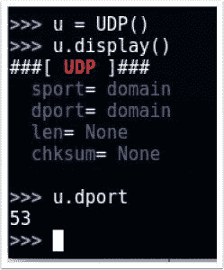
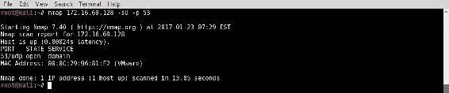
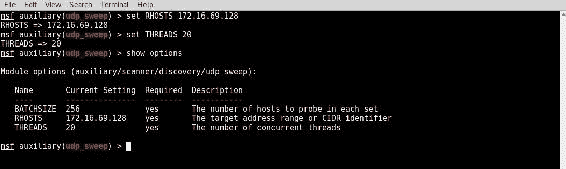
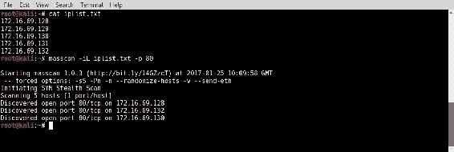

# 第四章：端口扫描

本章包括以下内容：

+   使用 Scapy 进行端口扫描

+   使用 Nmap 进行端口扫描

+   使用 Metasploit 进行端口扫描

+   使用 hping3 进行端口扫描

+   使用 DMitry 进行端口扫描

+   使用 Netcat 进行端口扫描

+   使用 masscan 进行端口扫描

# 介绍

确定目标系统上开放的端口是定义攻击面下一个关键步骤。开放的端口对应着系统上正在运行的网络服务。编程错误或实现缺陷可能使这些服务容易受到攻击，有时甚至导致系统完全被攻破。为了确定可能的攻击向量，必须首先枚举项目范围内所有远程系统上的开放端口。这些开放端口对应的服务可能使用 UDP 或 TCP 流量进行通讯。TCP 和 UDP 都是传输协议。**传输控制协议**（**TCP**）是两者中更常用的，提供面向连接的通信方式。**用户数据报协议**（**UDP**）则是无连接的协议，有时用于那些传输速度比数据完整性更重要的服务。用于枚举这些服务的渗透测试技术叫做**端口扫描**。与前一章节讨论的主机发现不同，这些技术应当能够提供足够的信息，来识别服务是否与设备或服务器上的某个特定端口相关联。在具体介绍以下列出的方法之前，我们将讨论一些关于端口扫描的基本原理。

# UDP 端口扫描

由于 TCP 是一个更常用的传输层协议，基于 UDP 的服务往往被忽略。尽管有自然倾向忽视 UDP 服务，但要全面了解任何目标的攻击面，完全列举这些服务是至关重要的。UDP 扫描通常具有挑战性、繁琐且耗时。本章中的前三个方案将介绍如何在 Kali Linux 中使用不同的工具进行 UDP 端口扫描。为了理解这些工具的工作原理，理解将要使用的两种 UDP 扫描方法非常重要。第一种技术将在第一个方案中介绍，它完全依赖于 ICMP 端口不可达响应。这种扫描方法假设任何没有活动服务的 UDP 端口会返回 ICMP 端口不可达响应，缺乏此响应则被解释为活动服务的迹象。虽然这种方法在某些情况下有效，但当主机没有生成端口不可达响应，或者端口不可达的回复被速率限制或防火墙过滤时，可能会返回不准确的结果。第二种和第三种方案中介绍的替代方法是使用特定服务的探测工具，尝试获取响应，这表明目标端口上正在运行预期的服务。虽然这种方法非常有效，但也可能非常耗时。

# TCP 端口扫描

在本章中，将介绍几种不同的 TCP 扫描方法。这些技术包括隐匿扫描、连接扫描和僵尸扫描。要理解这些扫描技术的工作原理，首先需要了解 TCP 连接是如何建立和维持的。TCP 是一个面向连接的协议，数据只有在两个系统之间建立连接后才会通过 TCP 进行传输。建立 TCP 连接的过程通常被称为三次握手，这个名称指的是连接过程中的三个步骤。以下图表以图形方式展示了这个过程：


一个 TCP **SYN** 数据包从希望与目标设备的端口建立连接的设备发送出去。如果接收端口关联的服务接受该连接，它将回复一个同时激活**SYN**和**ACK**位的 TCP 数据包。只有当请求系统以 TCP **ACK**响应回传时，连接才算建立。这个三步过程在两台系统之间建立了一个 TCP 会话。所有 TCP 端口扫描技术都会以某种方式执行这一过程，以识别远程主机上的活动服务。

连接扫描和隐身扫描都相对容易理解。连接扫描用于为每个扫描的端口建立完整的 TCP 连接。也就是说，对于每个扫描的端口，都会完成完整的三次握手。如果连接成功建立，则该端口被判定为开放。另一方面，隐身扫描则不建立完整的连接。隐身扫描也称为 SYN 扫描或半开放扫描。对于每个扫描的端口，发送一个 SYN 包到目标端口，所有回复 SYN+ACK 包的端口被认为正在运行服务。由于没有从发起系统发送最终的 ACK 包，连接保持半开放状态。这被称为隐身扫描，因为只记录已建立连接的日志系统不会记录任何扫描的证据。

本章将讨论的最后一种 TCP 扫描方法是名为**僵尸扫描**的技术。僵尸扫描的目的是在不留下任何与该系统交互的证据的情况下，映射远程系统的开放端口。僵尸扫描的工作原理较为复杂。进行僵尸扫描的步骤如下：

1.  为你的僵尸主机确定一个远程系统。这个系统应具有以下特点：

    +   它处于空闲状态，不主动与网络中的其他系统进行通信。

    +   它使用递增的 IPID 序列。

1.  向该僵尸主机发送一个 SYN+ACK 包，并记录初始的 IPID 值。

1.  发送一个伪造源 IP 地址为僵尸系统的 SYN 包到扫描目标系统。

1.  根据扫描目标端口的状态，以下两种情况之一将发生：

    +   如果端口开放，扫描目标将返回一个 SYN+ACK 包给僵尸主机，它认为是该主机发送了原始的 SYN 请求。在这种情况下，僵尸主机将对这个未经请求的 SYN+ACK 包响应一个 RST 包，从而将其 IPID 值增加一。

    +   如果端口关闭，扫描目标将返回一个 RST 响应给僵尸主机，它认为是该主机发送了原始的 SYN 请求。此 RST 包不会引发僵尸主机的响应，IPID 不会递增。

1.  再次向僵尸主机发送一个 SYN+ACK 包，并评估返回的 RST 响应的最终 IPID 值。如果该值递增了 1，则扫描目标的端口是关闭的；如果该值递增了 2，则扫描目标的端口是开放的。

下图展示了使用僵尸主机扫描开放端口时的交互过程：


要执行僵尸扫描，首先应向僵尸系统发送一个初始的 **SYN/ACK** 请求，以确定返回的 **RST** 数据包中的当前 **IPID** 值。然后，向扫描目标发送伪造的 **SYN** 数据包，源 IP 地址为僵尸系统的 IP。如果端口开放，扫描目标将向僵尸系统发送 **SYN/ACK** 响应。由于僵尸系统并没有实际发送初始的 **SYN** 请求，它会将 **SYN/ACK** 响应视为未经请求的响应，并将 **RST** 数据包返回给目标，从而将其 **IPID** 增加 1。最后，应向僵尸系统发送另一个 **SYN/ACK** 数据包，僵尸系统会返回一个 **RST** 数据包，并再次增加 **IPID**。从初始响应中增加了两个 **IPID** 表明所有这些事件已经发生，扫描系统上的目标端口是开放的。相反，如果扫描目标的端口关闭，则会发生一系列不同的事件，最终 **RST** 响应的 **IPID** 值仅增加 1。

以下图示展示了与关闭端口的僵尸扫描相关的事件顺序：


如果扫描目标的目标端口关闭，**RST** 数据包将作为响应发送到僵尸系统，回应最初伪造的 **SYN** 数据包。由于 **RST** 数据包不会请求响应，僵尸系统的 **IPID** 值将不会增加。因此，最终返回扫描系统的 **RST** 数据包在响应 **SYN/ACK** 数据包时，**IPID** 仅增加 1。此过程可以对每个要扫描的端口进行操作，并可用于在远程系统上映射开放端口，而不会留下扫描系统执行扫描的任何证据。

# 使用 Scapy 进行端口扫描（UDP、隐形扫描、连接扫描和僵尸扫描）

Scapy 是一个可以用来构造并注入自定义数据包到网络中的工具。我们将首先使用 Scapy 扫描活动的 UDP 服务。可以通过向目标端口发送空的 UDP 数据包，然后识别那些没有以 ICMP 端口不可达响应回传的端口来完成这项任务。

接下来，我们将使用 Scapy 执行 TCP 隐形扫描。TCP 端口隐形扫描通过在目标端口上执行部分三次握手来确定端口是否接受连接。这种类型的扫描被称为隐形扫描、SYN 扫描或半开扫描。

接下来，我们将使用 Scapy 执行 TCP 连接扫描。通常，TCP 连接扫描比 SYN 扫描要简单一些。这是因为 TCP 连接扫描不需要生成和注入 SYN 扫描中使用的原始数据包所需的高级权限。Scapy 是这一规则的一个重要例外。实际上，使用 Scapy 完成一个完整的三次握手 TCP 连接非常困难且不切实际。然而，为了更好地理解这个过程，我们将看看如何使用 Scapy 执行连接扫描。

最后，我们将使用 Scapy 执行僵尸扫描。通过这种扫描方法，可以识别目标系统上开放的端口，而不向该系统发出任何互动的信号。这种极其隐匿的扫描方式被称为僵尸扫描，只有在网络中存在另一个低网络活动且具有递增 IPID 序列的系统时，才能进行这种扫描。

# 准备工作

要使用 Scapy 执行 UDP 扫描，你需要有一个远程系统，该系统通过 UDP 运行网络服务。在提供的示例中，使用的是 Metasploitable2 实例来执行此任务。要使用 Scapy 执行隐匿式和连接式 TCP 扫描，你需要有一个远程系统，该系统通过 TCP 运行可访问的网络服务。在提供的示例中，使用的是 Metasploitable2 实例来执行此任务。要使用 Scapy 执行僵尸扫描，你需要有一个运行 TCP 服务的远程系统和另一个具有递增 IPID 序列的远程系统。在提供的示例中，使用 Metasploitable2 安装作为扫描目标，Windows XP 安装作为递增 IPID 僵尸。

有关如何设置 Metasploitable2 的更多信息，请参见第一章，*入门*。此外，本节还需要使用 Vim 或 GNU nano 等文本编辑器编写脚本到文件系统中。有关如何编写脚本的更多信息，请参见第一章，*入门*中的*使用文本编辑器（Vim 和 GNU nano）*。

# 如何执行…

我们从使用 Scapy 进行 UDP 端口扫描开始。

# 使用 Scapy 进行 UDP 端口扫描

使用 Scapy，我们可以快速理解 UDP 扫描的基本原理。为了准确确认某个端口上是否存在 UDP 服务，我们需要从该服务获取回应。这可能非常困难，因为许多 UDP 服务只会对特定的服务请求做出回应。了解特定服务的信息可以让我们更容易准确识别该服务；然而，也有一些通用技术可以用来确定某个 UDP 端口上是否运行服务，并且这些方法具有一定的准确性。我们将使用的技术是通过 ICMP 端口不可达回复来识别关闭的 UDP 端口：

1.  要向任何给定端口发送 UDP 请求，我们首先需要构建该请求的各个层。我们需要构建的第一层是 IP 层：


1.  为了构建我们请求的 IP 层，我们需要将 `IP` 对象赋值给 `i` 变量。通过调用 `display()` 函数，我们可以识别对象的属性配置。默认情况下，发送和接收地址都设置为回环地址 `127.0.0.1`。这些值可以通过更改目标地址来修改，将 `i.dst` 设置为我们希望扫描的地址的字符串值。再次调用 `display()` 函数时，我们看到不仅目标地址已更新，而且 Scapy 还自动将源 IP 地址更新为与默认接口相关联的地址。现在我们已经构建了请求的 IP 层，可以继续构建 UDP 层：



1.  为了构建我们请求的 UDP 层，我们使用与构建 IP 层时相同的技术。在提供的示例中，UDP 对象被赋值给了 `u` 变量。如前所述，可以通过调用 `display()` 函数来查看默认配置。在这里，我们可以看到源端口和目标端口的默认值都列为 `domain`。正如你可能猜到的那样，这是为了指示与端口 `53` 相关联的 DNS 服务。DNS 是一种常见的服务，通常可以在网络化系统上发现。为了确认这一点，可以通过直接引用变量名和属性来调用其值。然后，可以通过将属性设置为新的端口目标值来修改它，如下所示：


1.  在前面的示例中，目标端口被设置为 `123`，这是 **网络时间协议**（**NTP**）端口。现在我们已经创建了 IP 和 UDP 层，接下来我们需要通过堆叠这些层来构建请求：


1.  我们可以通过用斜杠分隔变量来堆叠 IP 和 UDP 层。然后可以将这些层设置为一个新的变量，代表整个请求。接着，我们可以调用 `display()` 函数来查看请求的配置。一旦请求构建完成，它可以传递给 `sr1()` 函数，以便我们分析响应：


1.  也可以在不独立构建和堆叠每一层的情况下执行相同的请求。相反，我们可以通过直接调用函数并传递适当的参数，使用单行命令来完成，如下所示：


1.  请注意，这些请求的响应包含一个 ICMP 包，其中类型字段指示主机不可达，代码字段指示端口不可达。如果 UDP 端口关闭，通常会返回此响应。现在，我们应该尝试修改请求，将其发送到与远程系统实际服务对应的目标端口。为此，我们将目标端口改回端口 `53`，然后再次发送请求，如下所示：


1.  当相同的请求发送到实际服务时，不会收到任何回复。这是因为系统上运行的 DNS 服务在 UDP 端口 `53` 上只会响应服务特定的请求。了解这一差异后，可以用于扫描 ICMP 主机不可达的回复，然后通过标记未响应的端口来识别潜在的服务：

```
        #!/usr/bin/python

        import logging
        logging.getLogger("scapy.runtime").setLevel(logging.ERROR)

        from scapy.all import *
        import time
        import sys

        if len(sys.argv) != 4:
          print "Usage - ./udp_scan.py [Target-IP] [First Port]
            [Last Port]"
          print "Example - ./upd_scan.py 10.0.0.5 1 100"
          print "Example will UDP port scan ports 1 through
            100 on 10.0.0.5"
          sys.exit()
        else:
          ip = sys.argv[1]
          start = int(sys.argv[2])
          end = int(sys.argv[3])

        for port in range(start,end):
          ans = sr1(IP(dst=ip)/UDP(dport=port),timeout=5,verbose =0)
          time.sleep(1)
          if ans == None:
            print port
          else:
            pass

```

1.  提供的 Python 脚本按顺序向前一百个端口发送 UDP 请求。如果没有收到响应，则认为该端口是开放的。确保通过运行 `chmod 777 udp_scan.py` 修改文件的权限。运行此脚本后，我们可以识别所有没有返回 ICMP 主机不可达回复的端口：


1.  使用 5 秒的超时来调整由于 ICMP 主机不可达限速所导致的延迟响应。即使在这个相对较大的响应接受窗口下，这种扫描方式有时仍然不可靠。因此，UDP 探测扫描通常是一个更有效的替代方案。

# 使用 Scapy 进行隐形扫描

以下步骤演示了如何使用 Scapy 进行扫描：

1.  为了演示如何执行 SYN 扫描，我们使用 Scapy 构建一个 TCP SYN 请求，并识别与开放端口、关闭端口和未响应系统相关的响应。

1.  要向任何给定端口发送 TCP SYN 请求，首先需要构建该请求的各层。我们需要构建的第一层是 IP 层：


1.  要为我们的请求构建 IP 层，我们需要将 `IP` 对象分配给 `i` 变量。通过调用 `display()` 函数，我们可以识别该对象的属性配置。默认情况下，发送和接收地址都设置为回送地址 `127.0.0.1`。可以通过修改目标地址来更改这些值，将 `i.dst` 设置为我们希望扫描的地址的字符串值。再次调用 `display()` 函数后，我们可以看到，不仅目标地址已经更新，Scapy 还会自动将源 IP 地址更新为与默认接口关联的地址。

1.  现在我们已经构建了请求的 IP 层，接下来可以进行 TCP 层的构建：


1.  为了构建我们请求的 TCP 层，我们使用与构建 IP 层时相同的技术。在提供的示例中，`TCP` 对象被分配给 `t` 变量。如前所述，我们可以通过调用 `display()` 函数来识别默认配置。在这里，我们可以看到目标端口的默认值是 HTTP 端口 `80`。对于我们的初始扫描，我们保持默认的 TCP 配置不变。

1.  现在我们已经创建了 IP 层和 TCP 层，我们需要通过堆叠这些层来构建请求，具体如下：


1.  我们可以通过用斜杠分隔变量来堆叠 IP 和 TCP 层。然后，可以将这些层赋值给一个新变量，这个变量将代表整个请求。接着，我们可以调用 `display()` 函数来查看请求的配置。一旦请求构建完成，它就可以传递给 `sr1()` 函数，以便我们分析响应，具体如下：


1.  我们可以在不独立构建和堆叠每个层的情况下执行相同的请求。相反，我们可以通过直接调用函数并传递适当的参数，使用一个单行命令，具体如下：


1.  请注意，当 SYN 数据包发送到目标 Web 服务器的 TCP 端口 `80` 时，服务器在该端口运行 HTTP 服务，响应的 TCP 标志值为 `SA`，表示 SYN 和 ACK 标志位都被激活。该响应表示指定的目标端口已打开并接受连接。如果同样类型的数据包发送到一个不接受连接的端口，将返回不同的响应：


1.  当一个 SYN 请求发送到一个关闭的端口时，会返回一个 TCP 标志值为 `RA` 的响应，这表明 RST 和 ACK 标志位都被激活。ACK 标志位只是用来确认请求已被接收，而 RST 标志位则用来终止通信，因为端口不接受连接。或者，如果 SYN 数据包发送到一个处于关闭状态或处于防火墙后面的系统（该防火墙过滤此类请求），则很可能不会收到响应。因此，在脚本中使用 `sr1()` 函数时，应该始终使用超时选项，以确保脚本不会在无响应的主机上卡住：


1.  如果在对无响应主机使用该函数时未指定超时值，函数将会无限期地继续。在演示中，为函数的完成提供了 1 秒的超时值。可以评估响应值，以确定是否收到了回复。我们来检查一下。

1.  使用 Python 可以轻松测试变量，以识别是否已经通过`sr1()`函数为其分配了一个值。这可以作为一个初步检查，判断是否接收到了任何响应。对于已接收到的响应，可以执行后续检查，确定该响应是否表示一个开放或关闭的端口。所有这些都可以轻松地在 Python 脚本中按顺序实现，如下所示：

```
        #!/usr/bin/python

        import logging
        logging.getLogger("scapy.runtime").setLevel(logging.ERROR)

        from scapy.all import *
        import sys

        if len(sys.argv) != 4:
            print "Usage - ./syn_scan.py [Target-IP] [First Port]
              [Last Port]"
            print "Example - ./syn_scan.py 10.0.0.5 1 100"
            print "Example will TCP SYN scan ports 1 through
              100 on 10.0.0.5"
            sys.exit()
        else:
            ip = sys.argv[1]
            start = int(sys.argv[2])
            end = int(sys.argv[3])

        for port in range(start,end):
            ans = sr1(IP(dst=ip)/TCP(dport=port),timeout=1,verbose =0)
            if ans == None:
                pass
            else:
                if int(ans[TCP].flags) == 18:
                    print port
                else:
                    pass

```

1.  在提供的 Python 脚本中，用户被提示输入一个 IP 地址，然后脚本对定义的端口序列执行 SYN 扫描。接着，脚本评估每次连接尝试的响应，以确定响应中是否激活了 SYN 和 ACK TCP 标志。SYN+ACK 的 TCP 标志是 0x12，即十进制的 18。如果响应中仅包含这些标志，则会输出接收到的相应端口号：


1.  运行脚本后，输出将指示系统中任何开放的前`100`个端口，并提供 IP 地址：


# 使用 Scapy 进行连接扫描

让我们执行以下步骤，通过 Scapy 运行连接扫描：

1.  使用 Scapy 运行完整的连接扫描可能比较困难，因为系统内核对你使用 Scapy 修改数据包的行为并不知情，并且试图阻止你与远程系统建立完整的三次握手。

1.  你可以通过发送 SYN 请求并使用 Wireshark 或 TCP dump 嗅探相关流量来看到这种活动的实际操作。

1.  当你从远程系统收到 SYN+ACK 响应时，Linux 内核会将其解释为未经请求的响应，因为它无法得知你在 Scapy 中发出的请求，系统会自动响应一个 TCP RST 数据包，从而终止握手过程。考虑以下示例：

```
        #!/usr/bin/python

        import logging
        logging.getLogger("scapy.runtime").setLevel(logging.ERROR)
        from scapy.all import *

        response = sr1(IP(dst="172.16.69.128")/TCP(dport=80,flags='S'))
        reply = sr1(IP(dst="172.16.69.128")
        /TCP(dport=80,flags='A',ack=(response[TCP].seq + 1)))

```

1.  这个 Python 脚本可以作为一个概念验证示例，演示系统破坏三次握手的问题。该脚本假设你将其指向一个具有开放端口的实时系统，因此假定在响应初始 SYN 请求时会返回 SYN+ACK 回复。尽管最终的 ACK 回复会被发送以完成握手，但 RST 数据包会阻止连接的建立。

1.  我们可以通过查看发送和接收的数据包进一步演示这一点：

```
        #!/usr/bin/python

        import logging
        logging.getLogger("scapy.runtime").setLevel(logging.ERROR)
        from scapy.all import *

        SYN = IP(dst="172.16.69.128")/TCP(dport=80,flags='S')

        print "-- SENT --"
        SYN.display()

        print "nn-- RECEIVED --"
        response = sr1(SYN,timeout=1,verbose=0)
        response.display()

        if int(response[TCP].flags) == 18:
            print "nn-- SENT --"
            ACK = IP(dst="172.16.69.128")/
            TCP(dport=80,flags='A',ack=(response[TCP].seq + 1))
            response2 = sr1(ACK,timeout=1,verbose=0)
            ACK.display()
            print "nn-- RECEIVED --"
            response2.display()
        else:
            print "SYN-ACK not returned"

```

1.  在这个 Python 脚本中，每个发送的数据包都会在传输之前显示，每个接收到的数据包都会在到达时显示。通过检查每个数据包中激活的 TCP 标志，可以清楚地看到三次握手失败。请看脚本生成的输出：


1.  在脚本的输出中，可以看到四个数据包。第一个数据包是发送的 SYN 请求，第二个数据包是接收到的 SYN+ACK 回复，第三个数据包是发送的 ACK 回复，随后接收到一个 RST 数据包，作为对最终 ACK 回复的响应。正是这个最终的数据包表明在建立连接时遇到了问题。虽然可以使用 Scapy 完成完整的三次握手，但这需要对本地 iptables 进行一些干扰。具体来说，只有在抑制发送到远程系统的 RST 数据包时，才能完成握手。通过使用 iptables 建立过滤规则，可以丢弃 RST 数据包，从而在不被系统干扰的情况下完成三次握手（不建议在持续使用中使用此配置）。

1.  为了演示完整的三次握手成功完成，我们使用 Netcat 建立了一个监听的 TCP 服务，然后使用 Scapy 尝试连接到打开的套接字：


1.  在提供的示例中，在 TCP 端口`4444`上打开了一个监听服务。然后，我们可以修改之前讨论过的脚本，尝试连接到端口`4444`上的 Netcat TCP 服务，如下所示：

```
        #!/usr/bin/python

        import logging
        logging.getLogger("scapy.runtime").setLevel(logging.ERROR)
        from scapy.all import *

        response = sr1(IP(dst="172.16.36.135")/
        TCP(dport=4444,flags='S'))
        reply = sr1(IP(dst="172.16.36.135")/
        TCP(dport=4444,flags='A',ack=(response[TCP].seq + 1)))

```

1.  在这个脚本中，向监听端口发送了一个 SYN 请求，然后发送了一个 ACK 回复，回应预期的 SYN+ACK 回复。为了验证连接尝试是否仍被系统生成的 RST 数据包中断，应在运行 Wireshark 捕获请求序列时执行此脚本。

1.  我们在 Wireshark 中应用了一个过滤器，以隔离连接尝试序列。使用的过滤器是`tcp && (ip.src == 172.16.69.128 || ip.dst == 172.16.69.128)`。这个过滤器仅用于显示与被扫描系统之间的 TCP 流量。如下截图所示：


1.  现在我们已经识别出了具体的问题，我们可以建立一个过滤器，允许我们压制该系统生成的 RST 响应。可以通过修改本地 iptables 来建立这个过滤器，如下所示：

按照以下方式修改本地 iptables 会影响系统与目标系统之间的 TCP/IP 事务处理，阻止所有出站的 RST 响应。确保在完成此操作后删除创建的 iptables 规则，或者使用以下命令清空 iptables：`iptables --flush`。

1.  在提供的示例中，修改了本地的 iptables，以压制所有发送到我们扫描目标地址的 TCP RST 数据包。然后可以使用`--list`选项查看 iptables 条目并验证配置更改已生效。为了进行另一次连接尝试，我们需要确保 Netcat 仍在目标的端口`4444`上监听，如下所示：


1.  前面介绍过的相同的 Python 脚本应该再次运行，并让 Wireshark 在后台捕获流量。使用之前讨论过的显示过滤器，我们可以轻松地聚焦于我们需要的流量。注意，三次握手的所有步骤现在已经完成，并且没有受到系统生成的 RST 数据包的干扰，如下图所示：


1.  此外，如果我们查看运行在目标系统上的 Netcat 服务，我们会注意到已经建立了连接。这进一步证实了成功建立连接的证据。

1.  虽然这是一个有用的练习，用于理解和排查 TCP 连接，但重要的是不要让 iptable 规则保持不变。RST 数据包是 TCP 通信的重要组成部分，完全抑制这些响应可能会严重影响正常的通信功能。以下命令可以用来清空我们的 iptables 规则，并验证清空是否成功：


1.  正如示例所示，应该使用 `--flush` 选项来清除已做的 iptable 条目。我们可以通过使用 `--list` 选项再次验证 iptable 条目是否已被移除。

# 使用 Scapy 进行僵尸扫描

所有 IP 数据包中都有一个 ID 号。根据系统的不同，这个 ID 号可能是随机生成的，可能始终为零，或者每发送一个 IP 数据包时，它会递增。如果发现一个主机具有增量的 IPID 序列，并且该主机没有与其他联网系统交互，它可以用作识别其他系统开放端口的手段。我们可以通过发送一系列 IP 数据包并分析响应来识别远程系统的 IPID 序列模式：


如果我们向一个空闲的 Windows 系统发送两个 IP 数据包，我们可以检查响应中 IP 层的 ID 属性的整数值。

请注意，第一个请求的回复 ID 为 `61`，第二个请求的回复 ID 为 `62`。

这个主机确实有增量的 IPID 序列，如果假设它保持空闲状态，它可以作为一个有效的僵尸主机进行僵尸扫描：

1.  要执行僵尸扫描，必须先向僵尸系统发送初始的 SYN+ACK 请求，以确定返回的 RST 数据包中的当前 IPID 值。

1.  然后，发送一个伪造的 SYN 数据包到扫描目标，源 IP 地址为僵尸系统的地址。如果端口开放，扫描目标将会向僵尸主机发送一个 SYN+ACK 响应。由于僵尸主机并没有实际发送初始的 SYN 请求，它将会将这个 SYN+ACK 请求视为非预期的，并向目标发送一个 RST 数据包，从而使其 IPID 增加 1。

1.  最后，应向僵尸系统发送另一个 SYN+ACK 数据包，僵尸系统将返回一个 RST 数据包，并再增加一次 IPID。如果 IPID 从最初的响应增加了两次，则表示所有这些事件已经发生，且扫描的系统的目的端口是开放的。

1.  另外，如果扫描目标上的端口关闭，将会发生一系列不同的事件，这些事件只会导致最终的 RST 响应增加一个。如果扫描目标上的目的端口关闭，将会向僵尸系统发送一个 RST 数据包，作为对最初伪造的 SYN 数据包的响应。

1.  由于一个 RST 数据包不会要求回应，僵尸系统的 IPID 值不会增加。因此，作为对 SYN+ACK 数据包响应返回给扫描系统的最终 RST 数据包，其 IPID 只会增加一个。

1.  为了简化此过程，可以编写以下 Python 脚本，该脚本不仅能识别一个可用的僵尸系统，还能对扫描目标执行僵尸扫描：

```
       #!/usr/bin/python

       import logging
       logging.getLogger("scapy.runtime").setLevel(logging.ERROR)
       from scapy.all import *

       def ipid(zombie):
           reply1 = sr1(IP(dst=zombie)
           /TCP(flags="SA"),timeout=2,verbose=0)
           send(IP(dst=zombie)/TCP(flags="SA"),verbose=0)
           reply2 = sr1(IP(dst=zombie)
           /TCP(flags="SA"),timeout=2,verbose=0)
           if reply2[IP].id == (reply1[IP].id + 2):
               print "IPID sequence is incremental and target appears 
                 to be idle. ZOMBIE LOCATED"
               response = raw_input("Do you want to use this zombie to 
                 perform a scan? (Y or N): ")
               if response == "Y":
                   target = raw_input("Enter the IP address of the
                     target system: ")
                   zombiescan(target,zombie)
           else:
               print "Either the IPID sequence is not incremental or 
                 the target is not idle. NOT A GOOD ZOMBIE"

       def zombiescan(target,zombie):
           print "nScanning target " + target + " with zombie "
            + zombie
           print "n---------Open Ports on Target--------n"
           for port in range(1,100):
                try:
                   start_val = sr1(IP(dst=zombie)
                   /TCP(flags="SA",dport=port),timeout=2,verbose=0)
                   send(IP(src=zombie,dst=target)
                   /TCP(flags="S",dport=port),verbose=0)
                   end_val = sr1(IP(dst=zombie)
                   /TCP(flags="SA"),timeout=2,verbose=0)
       if end_val[IP].id == (start_val[IP].id + 2):
          print port
       except:
           pass

       print "-----------Zombie Scan Suite------------n"
       print "1 - Identify Zombie Hostn"
       print "2 - Perform Zombie Scann"
       ans = raw_input("Select an Option (1 or 2): ")
       if ans == "1":
           zombie = raw_input("Enter IP address to test
            IPID sequence: ")
           ipid(zombie)
       else:
           if ans == "2":
           zombie = raw_input("Enter IP address for zombie system: ")
           target = raw_input("Enter IP address for scan target: ")
           zombiescan(target,zombie)

```

1.  执行此脚本后，用户会被提示选择两个选项。选择选项`1`，我们可以扫描或评估目标的 IPID 序列，以确定主机是否是一个可用的僵尸。如果假设该主机处于空闲状态并且 IPID 序列递增，则该主机会被标记为僵尸，用户将被要求使用该僵尸进行扫描。

1.  如果进行扫描，将会为前 100 个 TCP 端口地址执行之前讨论的过程，如下所示：


# 它是如何工作的…

在这个方案中，UDP 扫描是通过识别那些没有回应 ICMP 端口不可达响应的端口来进行的。由于 ICMP 端口不可达响应通常会被限流，这个过程可能非常耗时。有时它也可能是一种不可靠的方法，因为有些系统不会生成这些响应，而且防火墙通常会过滤 ICMP 响应。

隐匿扫描通过向远程系统上的目标 TCP 端口发送初始 SYN 数据包请求来执行，端口的状态通过返回的响应类型来确定。如果远程系统返回 SYN+ACK 响应，则表示它准备建立连接，可以认为该端口是开放的。如果服务返回 RST 数据包，则表示该端口已关闭，不接受连接。此外，如果没有返回任何响应，则可能表示扫描系统和远程系统之间存在防火墙，防火墙正在丢弃请求。这也可能表示机器已经关闭，或者目的 IP 地址没有对应的系统。

TCP 连接扫描通过执行完整的三次握手来与远程目标系统上所有扫描的端口建立连接。端口的状态基于是否建立了连接来确定。如果建立了连接，则该端口被判定为开放。如果无法建立连接，则该端口被判定为关闭。

僵尸扫描是一种隐蔽的方式，用于枚举目标系统上的开放端口，而不会留下与目标系统交互的痕迹。通过向目标系统发送伪造的请求和向僵尸系统发送合法请求的组合，我们可以通过评估来自僵尸系统的响应的 IPID 值，映射目标系统上的开放端口。

# 使用 Nmap 进行端口扫描（UDP、隐形扫描、连接扫描、僵尸扫描）

Nmap 可以用于执行 UDP、TCP 隐形扫描、TCP 连接扫描和僵尸扫描。在本节中，我们将讨论如何进行每种类型的扫描。Nmap 执行 UDP 扫描的方法更为复杂，尝试通过注入特定服务的探测请求来识别活动服务，从而获取确认服务存在的正面响应。我们还将讨论 Nmap 如何处理隐形扫描和 TCP 连接扫描。最后，我们将介绍 Nmap 的一种非常有效的扫描模式——僵尸扫描。

# 准备工作

要使用 Nmap 执行 UDP、TCP 隐形扫描、TCP 连接扫描或僵尸扫描，您需要一台远程系统，该系统正在通过 UDP 和 TCP 提供网络服务。在提供的示例中，使用 Metasploitable2 实例作为扫描目标，使用安装了 Windows XP 的系统作为增量 IPID 僵尸。在提供的示例中，使用了 Linux 和 Windows 系统的组合。

有关如何在本地实验环境中设置系统的更多信息，请参考 第一章 中的 *安装 Metasploitable2* 和 *安装 Windows Server* 配方，*入门* 部分。此外，本节内容将需要使用文本编辑器（如 Vim 或 GNU nano）将脚本写入文件系统。有关如何编写脚本的更多信息，请参考 第一章 中的 *使用文本编辑器（Vim 和 GNU nano）* 配方，*入门* 部分。

# 如何操作…

让我们从使用 Nmap 进行 UDP 扫描开始。

# 使用 Nmap 进行 UDP 扫描

UDP 扫描通常具有挑战性、耗时且枯燥。许多系统会限制 ICMP 主机不可达回复，这可能会显著增加扫描大量端口和/或系统所需的时间。幸运的是，Nmap 的开发者提供了一个更复杂且更加高效的工具，可以用来识别远程系统上的 UDP 服务。

1.  要使用 Nmap 执行 UDP 扫描，应使用 `-sU` 选项，并指定要扫描的主机的 IP 地址：


1.  尽管 Nmap 是为了通过自定义有效负载从 UDP 端口请求回复以支持多种服务，但当没有使用其他参数指定目标端口时，它仍然需要大量时间来扫描默认的 1,000 个端口。从输出底部的扫描元数据中可以看到，默认扫描几乎需要 20 分钟才能完成。或者，我们可以通过执行有针对性的扫描来缩短所需的扫描时间，如下命令所示：



1.  如果我们指定需要扫描的特定端口，执行 UDP 扫描所需的时间可以大幅减少。这可以通过执行 UDP 扫描并使用`-p`选项指定端口来完成。

1.  在前面的示例中，我们仅对端口`53`进行了扫描，尝试识别 DNS 服务。也可以对多个指定端口进行扫描，如下所示：


1.  在提供的示例中，扫描了前 100 个端口。使用破折号符号并指定要扫描的第一个和最后一个端口来完成此操作。然后，Nmap 会启动多个进程，用于同时扫描这两个值之间的所有端口。

1.  有时，需要对多个系统执行 UDP 分析。可以使用 Nmap 通过破折号符号和定义最后一个八位组的值范围来扫描一系列主机，如下所示：


1.  在提供的示例中，对`172.16.69.0/24`范围内的所有在线主机进行了扫描。每个主机都被扫描以确定端口`53`上是否正在运行 DNS 服务。另一种替代选项是使用 IP 地址输入列表扫描多个主机。

1.  为此，应该使用`-iL`选项，并将其传递为同一目录中文件的名称或其他目录中文件的完整路径。以下是前者的示例：


1.  在提供的示例中，执行了扫描，以确定在执行目录中的`iplist.txt`文件中的任何系统上，端口`123`是否正在运行 NTP 服务。

# 使用 Nmap 进行隐形扫描

与大多数扫描要求一样，Nmap 有一个选项可以简化和优化执行 TCP 隐形扫描的过程：

1.  要使用 Nmap 执行 TCP 隐形扫描，应该使用`-sS`选项，并指定要扫描的主机的 IP 地址：


1.  在提供的示例中，对指定 IP 地址的 TCP 端口`80`执行了 SYN 扫描。与使用 Scapy 时解释的技术类似，Nmap 监听响应并通过分析接收到的响应中激活的 TCP 标志来识别开放端口。我们还可以通过传递逗号分隔的端口号列表，使用 Nmap 对多个指定端口进行扫描，如下所示：


1.  在提供的示例中，对指定目标 IP 地址的`21`、`80`和`443`端口进行了 SYN 扫描。我们还可以使用 Nmap 通过指定要扫描的第一个和最后一个端口号（用破折号分隔）来扫描一系列主机：


1.  在提供的示例中，对 TCP 端口`20`至`25`进行了 SYN 扫描。除了可以指定要扫描的端口外，Nmap 还预先配置了 1,000 个常用端口的列表。我们可以通过不提供任何端口规格来扫描这些端口，只需运行 Nmap：


1.  在提供的示例中，扫描了 Nmap 定义的 1,000 个常用端口，以识别 Metasploitable2 系统上大量开放端口。虽然这种技术有效地识别了大多数服务，但它可能无法识别较为隐蔽的服务或不常见的端口关联。

1.  如果要对所有可能的 TCP 端口进行扫描，则需要扫描所有可能的端口地址值。定义源端口和目标端口地址的 TCP 头部分长度均为 16 位。此外，每个位可以保持 1 或 0 的值。因此，共有 2¹⁶，即 65,536 个可能的 TCP 端口地址。为了扫描整个可能的地址空间，需要提供一个从 0 到 65535 的端口范围，如下所示：


1.  在提供的示例中，对 Metasploitable2 系统上所有 65,536 个可能的 TCP 地址进行了扫描。请注意，在此扫描中，识别到的服务比标准 Nmap 1,000 扫描识别到的服务要多。这证明了在尝试识别目标的所有可能攻击面时，进行完整扫描始终是最佳实践。Nmap 还可以用于扫描一系列主机的 TCP 端口，使用破折号符号：


1.  在提供的示例中，对指定地址范围内的所有主机的 TCP 端口`80`进行了 SYN 扫描。尽管此扫描仅在单个端口上执行，Nmap 还可以同时扫描多个系统上的多个端口和端口范围。此外，Nmap 还可以配置为基于输入的 IP 地址列表扫描主机。这可以使用`-iL`选项，并指定文件名（如果文件存在于执行目录中）或文件路径。然后，Nmap 会循环遍历输入列表中的每个地址，并对该地址执行指定的扫描：


# 使用 Nmap 进行连接扫描

Nmap 具有一个选项，可以简化并精简执行 TCP 连接扫描的过程：

1.  要使用 Nmap 执行 TCP 连接扫描，应使用`-sT`选项并指定要扫描的主机的 IP 地址，如下所示：


1.  在提供的示例中，对指定 IP 地址的 TCP 端口`80`进行了 TCP 连接扫描。类似于使用 Scapy 的技术，Nmap 会监听响应并通过分析收到的响应中激活的 TCP 标志来识别开放端口。我们还可以使用 Nmap 执行多端口扫描，只需传递一个以逗号分隔的端口号列表，如下所示：


1.  在提供的示例中，对指定目标 IP 地址的端口`21`、`80`和`443`进行了 TCP 连接扫描。我们还可以使用 Nmap 通过指定要扫描的第一个和最后一个端口号，并使用短横线符号分隔它们，来扫描一系列顺序主机：


1.  在提供的示例中，对 TCP 端口`20`至`25`进行了 TCP 连接扫描。除了可以指定要扫描的端口外，Nmap 还预配置了一个包含 1,000 个常用端口的列表。我们可以通过不提供任何端口规格直接运行 Nmap 来扫描这些端口：


1.  在提供的示例中，扫描了 Nmap 定义的 1,000 个常见端口，以识别 Metasploitable2 系统上的大量开放端口。尽管这种技术在识别大多数服务时有效，但它可能无法识别一些不常见的服务或端口关联。

1.  要扫描所有可能的 TCP 端口，必须扫描所有可能的端口地址值。定义源端口和目标端口地址的 TCP 头部部分均为 16 位长。此外，每个位可以保留 1 或 0 的值。因此，有 2¹⁶，即 65,536 个可能的 TCP 端口地址。为了扫描所有可能的地址空间，需要提供一个端口范围`0-65535`，如下所示：


1.  在提供的示例中，扫描了 Metasploitable2 系统上的所有 65,536 个 TCP 地址。请注意，在此扫描中识别出的服务数量多于标准 Nmap 1,000 扫描。这证明了当试图识别目标上的所有可能攻击面时，全面扫描始终是最佳实践。Nmap 还可以通过使用短横线符号来扫描一系列顺序主机上的 TCP 端口：


1.  在提供的示例中，对指定主机范围内的所有主机的 TCP 端口`80`进行了 TCP 连接扫描。虽然此扫描仅针对单个端口进行，但 Nmap 也可以同时扫描多个系统上的多个端口和端口范围。此外，Nmap 还可以配置为基于输入的 IP 地址列表扫描主机。

1.  这可以使用`-iL`选项完成，然后指定文件名（文件是否存在于执行目录中）或文件的路径。Nmap 然后会遍历输入列表中的每个地址，并对该地址执行指定的扫描，如下所示：


# 使用 Nmap 进行僵尸扫描

这些步骤将帮助你在 Nmap 上执行僵尸扫描：

1.  也可以使用 Nmap 中的选项执行僵尸扫描。然而，在使用 Nmap 的僵尸扫描之前，我们可以通过扫描整个地址范围并使用 Metasploit 评估 IPID 序列模式，快速找到任何可用的僵尸候选主机。

1.  为此，我们需要通过`msfconsole`命令打开 Metasploit，并选择 IPID 序列`auxiliary`模块，如下所示：


1.  此`auxiliary`模块可以用于扫描一系列连续的主机地址或网络范围（如 CIDR 表示法定义的）。为了提高扫描速度，应将`THREADS`变量增加到所需的并发任务数，如下所示：


1.  一旦所需的变量值被填充完成，我们可以再次使用`show options`命令验证扫描配置。然后，可以使用`run`命令执行 IPID 序列扫描：


1.  当 IPID 序列扫描模块遍历所提供的网络范围时，它将识别已发现主机的 IPID 序列模式，并指示它们是零、随机还是增量。

1.  僵尸扫描的理想候选主机是具有增量 IPID 序列且不会与网络上其他系统频繁交互的主机。一旦识别出增量空闲主机，我们可以使用 Nmap 中的`-sI`选项，并传递需要用作扫描的僵尸主机的 IP 地址，来执行僵尸扫描：


1.  在提供的示例中，针对扫描目标`172.16.69.128`的前 100 个 TCP 端口进行了僵尸扫描。`172.16.69.128`作为空闲主机被用作僵尸主机，并使用了`-Pn`选项，防止 Nmap 尝试 ping 扫描目标。

1.  在此演示中，我们识别并枚举了所有列出的开放端口，并且从未直接与扫描目标交互。相反，源地址伪造的包被发送到扫描目标，唯一的直接交互是在扫描系统与僵尸主机之间。

# 它是如何工作的…

尽管 Nmap 仍需应对与 UDP 扫描相关的许多挑战，但它仍然是一个非常有效的解决方案，因为它经过优化，能够使用最有效、最快的技术组合来识别活动服务。

使用 Nmap 进行 SYN 扫描的基本原理与之前讨论的一致。然而，借助多线程能力，Nmap 成为执行这类扫描的快速且高效的工具。

执行 TCP 连接扫描的工具通过执行完整的三次握手来与远程目标系统上的所有扫描端口建立连接。端口的状态是根据是否建立了连接来确定的。如果建立了连接，则该端口被认为是开放的；如果未能建立连接，则该端口被认为是关闭的。

僵尸扫描的基本原理与前面使用 Scapy 执行该任务时讨论的相同。然而，使用 Nmap 的僵尸扫描模式使我们能够使用一个集成的、广为人知的工具快速执行相同的任务。

# 使用 Metasploit 进行端口扫描（UDP、隐匿和连接）

Metasploit 具有辅助模块，可以用来执行 UDP、SYN 和 TCP 连接扫描。使用 Metasploit 进行扫描以及利用漏洞可以有效减少完成渗透测试所需的工具总数。本示例展示了如何使用 Metasploit 执行端口扫描。

# 准备工作

要使用 Metasploit 执行 UDP、TCP 隐匿扫描和 TCP 完全连接扫描，你需要一个运行 UDP 和 TCP 网络服务的远程系统。在提供的示例中，使用 Metasploitable2 实例来执行此任务。有关如何设置 Metasploitable2 的更多信息，请参阅 第一章，*入门*。

# 如何操作…

让我们从使用 Metasploit 进行 UDP 扫描开始。

# 使用 Metasploit 进行 UDP 扫描

在定义要运行的模块之前，需要先打开 Metasploit：

1.  要在 Kali Linux 中打开 Metasploit，我们在终端会话中使用 `msfconsole` 命令，方法如下：


1.  要在 Metasploit 中运行 UDP 扫描模块，我们使用 `use` 命令，并指定 `auxiliary` 模块的相对路径。选择模块后，可以使用 `show options` 命令来识别和/或修改扫描配置。该命令将显示四个列标题，包括：`Name`（名称）、`Current Setting`（当前设置）、`Required`（是否必需）和 `Description`（描述）。`Name` 列标识每个可配置变量的名称；`Current Setting` 列列出任何给定变量的现有配置；`Required` 列标识是否需要为某个变量提供值；`Description` 列描述每个变量的功能。任何给定变量的值都可以使用 `set` 命令修改，并提供新值作为参数：



1.  在提供的示例中，`RHOSTS`值已更改为我们希望扫描的远程系统的 IP 地址。此外，线程数已更改为`20`。`THREADS`值定义了将在后台执行的并发任务数。确定线程值的关键是找到一个合理的平衡点，既能显著提高任务速度，又不会过度消耗系统资源。对于大多数系统，`20`个线程是一个快速且相对安全的并发进程数量。更新必要的变量后，可以再次使用`show options`命令验证配置。一旦验证了所需的配置，即可启动扫描，如下所示：


1.  `run`命令用于在 Metasploit 中执行选定的`auxiliary`模块。在所提供的示例中，`run`命令执行了针对指定 IP 地址的 UDP 扫描。`udp_sweep`模块也可以使用破折号符号对一系列地址进行扫描：


1.  在提供的示例中，对通过`RHOSTS`变量指定的十个主机地址执行了 UDP 扫描。同样，`RHOSTS`也可以用来通过 CIDR 表示法定义网络范围，如下所示：


# 使用 Metasploit 进行隐匿扫描

Metasploit 具有一个`auxiliary`模块，可用于对指定的 TCP 端口执行 SYN 扫描：

1.  在 Kali Linux 中打开 Metasploit，我们在终端会话中使用`msfconsole`命令，如下所示：


1.  要在 Metasploit 中运行 SYN 扫描模块，使用`use`命令并指定`auxiliary`模块的相对路径。一旦选择了模块，可以使用`show options`命令来识别和/或修改扫描配置。此命令会显示四个列标题，分别是`Name`（名称）、`Current Setting`（当前设置）、`Required`（是否必需）和`Description`（描述）。`Name`列标识每个可配置变量的名称，`Current Setting`列列出了任何给定变量的现有配置，`Required`列标识是否需要为任何给定变量提供值，最后，`Description`列描述了每个变量的功能。可以使用`set`命令和提供的新值作为参数来更改任何给定变量的值：


1.  在提供的示例中，`RHOSTS` 值更改为我们希望扫描的远程系统的 IP 地址。此外，线程数更改为 `20`。`THREADS` 值定义了将在后台执行的并发任务数。确定线程值的关键是找到一个良好的平衡，以便显著提高任务速度，同时不过度消耗系统资源。对于大多数系统，`20` 个线程是一个快速且相对安全的并发进程数。`PORTS` 值设置为 TCP 端口 `80`（HTTP）。更新必要的变量后，可以使用 `show options` 命令再次验证配置。一旦验证了所需的配置，可以按如下方式启动扫描：


1.  `run` 命令在 Metasploit 中用于执行所选的 `auxiliary` 模块。在提供的示例中，`run` 命令执行了对指定 IP 地址的端口 `80` 进行的 TCP SYN 扫描。我们还可以通过提供第一个和最后一个端口值，并使用破折号表示法，运行该 TCP SYN 扫描模块以扫描一系列连续的 TCP 端口：


1.  在提供的示例中，对指定的远程主机的前 100 个 TCP 端口地址进行了 TCP SYN 扫描。尽管此扫描识别了目标系统上的多个服务，但除非扫描了所有可能的端口地址，否则我们无法确定是否已经识别了所有服务。定义源端口和目标端口地址的 TCP 头部部分都是 16 位长。此外，每个位可以保持值 1 或 0。因此，共有 2¹⁶，即 65,536 个可能的 TCP 端口地址。要扫描整个可能的地址空间，需要提供从 0 到 65535 的端口范围，如下所示：


1.  在提供的示例中，通过扫描所有可能的 TCP 端口地址，识别了远程系统上所有开放的 TCP 端口。我们还可以修改扫描配置，使用破折号表示法扫描一系列连续的地址：


1.  在提供的示例中，对由 `RHOSTS` 变量指定的所有主机地址执行了端口 `80` 的 TCP SYN 扫描。同样，`RHOSTS` 可以用来通过 CIDR 表示法定义一个网络范围：


# 使用 Metasploit 进行连接扫描

Metasploit 有一个 `auxiliary` 模块，可以用来对指定的 TCP 端口执行 TCP 连接扫描：

1.  要在 Kali Linux 中打开 Metasploit，请在终端会话中使用 `msfconsole` 命令，如下所示：


1.  要调用 Metasploit 中的 TCP 连接扫描模块，请使用 `use` 命令和 `auxiliary` 模块的相对路径。选择模块后，可以使用 `show options` 命令来识别和/或修改扫描配置。此命令将显示四个列标题，包括：`Name`（名称）、`Current Setting`（当前设置）、`Required`（是否必需）和 `Description`（描述）。`Name` 列标识每个可配置变量的名称。`Current Setting` 列列出了给定变量的现有配置。`Required` 列标识某个变量是否需要值。最后，`Description` 列描述了每个变量的功能。我们可以使用 `set` 命令并通过提供新值作为参数来更改任何给定变量的值，如下所示：


1.  在提供的示例中，`RHOSTS` 值被更改为我们希望扫描的远程系统的 IP 地址。`PORTS` 值设置为 TCP 端口 `80`（HTTP）。在更新必要的变量后，可以使用 `show options` 命令再次验证配置。验证完所需的配置后，启动扫描。`run` 命令用于在 Metasploit 中执行选定的 `auxiliary` 模块。在提供的示例中，`run` 命令执行了对指定 IP 地址的端口 `80` 进行 TCP 连接扫描。

这个 TCP 连接扫描也可以通过提供起始和结束端口值，并用破折号分隔，来对一系列顺序的 TCP 端口进行扫描：


1.  在提供的示例中，设置扫描了前 100 个 TCP 端口地址。此外，线程数被更改为 `20`。`THREADS` 值定义了后台执行的并发任务数。确定线程值的过程是找到一个合适的平衡点，以显著提高任务速度，同时不至于过度消耗系统资源。对于大多数系统来说，`20` 个线程是一个快速且相对安全的并发进程数。尽管这个扫描识别了目标系统上的多个服务，但如果没有扫描所有可能的端口地址，就无法确保识别出所有服务。定义源端口和目标端口地址的 TCP 头部部分的长度均为 16 位。而且，每一位可以保留 1 或 0 的值。因此，可能的 TCP 端口地址有 2¹⁶ 或 65,536 个。为了扫描所有可能的地址空间，需要提供一个从 0 到 65535 的端口范围，如下所示：


1.  在提供的示例中，通过扫描所有可能的 TCP 端口地址，识别出了远程系统上的所有开放的 TCP 端口。我们还可以修改扫描配置，使用破折号符号扫描一系列顺序的地址：


1.  在所提供的示例中，对 `RHOSTS` 变量指定的所有主机地址上的端口 `22`、`80` 和 `443` 执行了 TCP 连接扫描。类似地，可以使用 `RHOSTS` 来使用 CIDR 表示法定义网络范围：


# 它是如何工作的……

使用 Metasploit `auxiliary` 模块进行 UDP 扫描不如使用 Nmap 进行的 UDP 扫描全面。它仅针对有限数量的服务，但在这些端口上识别活动服务的效果非常好，并且比大多数其他可用的 UDP 扫描解决方案更快。

Metasploit 的 SYN 扫描背后的基本原理与 `auxiliary` 模块与其他任何 SYN 扫描工具基本相同。对于每个被扫描的端口，都会发送一个 SYN 数据包，并使用 SYN+ACK 响应来识别活动服务。使用 Metasploit 对某些人来说可能更具吸引力，因为它提供了交互式控制台，并且它是大多数渗透测试人员已经熟知的工具。

定义如何通过 Metasploit 执行 TCP 连接扫描的基本原理与之前讨论的其他工具相同。使用 Metasploit 执行此类型扫描的优势在于，它可以减少一个人需要熟悉的工具数量。

# 使用 hping3 进行端口扫描（隐身扫描）

除了我们已经学到的发现技术，`hping3` 命令还可以用于执行端口扫描。这个具体的操作示例展示了如何使用 `hping3` 命令来执行 TCP 隐身扫描。

# 准备工作

要使用 `hping3` 命令执行 TCP 隐身扫描，您需要有一个远程系统，该系统正在通过 TCP 提供可访问的网络服务。在所提供的示例中，使用的是 Metasploitable2 实例来执行此任务。有关如何设置 Metasploitable2 的更多信息，请参见 第一章，*入门*。

# 如何操作……

除了已经提到的发现功能外，`hping3` 命令还可以用于执行 TCP 端口扫描：

1.  要使用 `hping3` 执行端口扫描，我们需要使用 `--scan` 模式，并通过整数值来指示要扫描的端口号：


1.  在所提供的示例中，执行了对指定 IP 地址的 TCP 端口 `80` 的 SYN 扫描。`-S` 选项标识发送到远程系统的数据包中激活的 TCP 标志。表格显示了接收到的响应包的属性。如输出所示，收到了 SYN+ACK 响应，这表明目标主机的端口 `80` 是开放的。此外，我们还可以通过传递以逗号分隔的端口号系列来扫描多个端口，如下所示：


1.  在提供的扫描输出中，可以看到只有在接收到 SYN+ACK 响应时，结果才会显示。注意，发送到端口 `443` 的 SYN 请求所对应的响应没有显示。如输出中所示，我们可以通过增加 `-v` 选项来查看所有响应。此外，可以通过传递第一个和最后一个端口地址值，使用破折号符号表示法扫描连续范围的端口，如下所示：


1.  在提供的示例中，100 个端口的扫描足以识别 Metasploitable2 系统上的多个服务。然而，要执行所有可能的 TCP 端口扫描，需要扫描所有可能的端口地址值。定义源和目标端口地址的 TCP 头部部分的长度都是 16 位，每个位可以保持 1 或 0 的值。因此，共有 2¹⁶，即 65,536 个可能的 TCP 端口地址。为了扫描所有可能的地址空间，需提供一个端口范围，从 0 到 65535，如下所示：


# 它是如何工作的…

`hping3` 工具与之前提到的一些其他工具有所不同，因为它没有 SYN 扫描模式，而是允许你指定在发送 TCP 数据包时启用的 TCP 标志位。在本食谱中提供的示例中，`-S` 选项指示 `hping3` 使用 SYN 标志来发送 TCP 数据包。

# 使用 DMitry 进行端口扫描（连接）

另一个可以用来对远程系统执行 TCP 连接扫描的工具是 DMitry。与 Nmap 和 Metasploit 不同，DMitry 是一个非常简单的工具，我们可以使用它进行快速且轻松的扫描，而无需管理复杂的配置。这个具体的食谱展示了如何使用 DMitry 执行 TCP 连接扫描。

# 准备工作

要使用 `dmitry` 命令执行完整的连接扫描，你需要有一个远程系统，该系统通过 TCP 提供网络服务。在提供的示例中，使用了 Metasploitable2 实例来执行此任务。有关如何设置 Metasploitable2 的更多信息，请参考 第一章，*入门指南*。

# 如何操作…

DMitry 是一个多用途工具，可以用于对目标系统执行 TCP 扫描。它的功能有限，但它是一个简单的工具，可以快速有效地使用：

1.  要查看 `dmitry` 命令的可用选项，我们在终端中执行以下程序，不带任何参数：


1.  如使用说明中所示，`-p` 选项可以用于执行 TCP 端口扫描。为此，我们将此选项与要扫描的系统的 IP 地址一起使用。DMitry 有 150 个常用的预配置端口，它会扫描这些端口，并显示任何找到的开放端口。考虑以下示例：


1.  使用 DMitry 进行 TCP 端口扫描的自定义选项较少，但它可以快速有效地评估单个主机上常用的服务。我们还可以使用`-o`选项将 DMitry 扫描的结果输出到文本文件，并在执行目录中指定输出文件名：


# 工作原理…

`dmitry`命令执行 TCP 连接扫描的基本原理与之前讨论的其他工具相同。DMitry 的实用性主要体现在与其他工具相比，它的简便性。与 Nmap 或 Metasploit 需要管理多个配置选项不同，我们只需指定适当的模式并传递目标 IP 地址，就可以轻松启动 DMitry。它会快速扫描 150 个最常用的端口，并输出这些端口中所有开放的端口值。

# 使用 Netcat 进行端口扫描（连接）

由于 Netcat 是一个网络套接字连接和管理工具，它可以轻松地转变为 TCP 端口扫描工具。本示例展示了如何使用 Netcat 执行 TCP 连接扫描。

# 准备就绪

要使用 Netcat 执行完整的连接扫描，你需要有一台运行 TCP 网络服务的远程系统。在提供的示例中，使用 Metasploitable2 实例来执行此任务。有关如何设置 Metasploitable2 的更多信息，请参见第一章，*入门*。

# 如何操作…

Netcat 是一个极其有用的多功能网络工具，可以用于各种用途。Netcat 的一个有效用途是执行端口扫描：

1.  要识别使用选项，可以使用`-h`选项调用 Netcat(`nc`)，如下所示：


1.  如使用输出所示，`-z`选项可以有效用于扫描。要扫描目标系统的 TCP 端口`80`，我们使用`-n`选项表示将使用 IP 地址，`-v`选项用于详细输出，`-z`选项用于扫描，具体如下：


1.  对开放端口进行扫描尝试将返回 IP 地址、端口地址和端口状态。对活动主机的封闭端口进行相同的扫描将显示连接被拒绝。我们可以将此过程自动化，使用以下命令进行循环扫描：


1.  一系列连续的端口号可以通过循环传递，并且所有端口可以轻松快速地扫描。然而，在提供的示例中，开放和关闭的端口的输出都被包含了。如果扫描的端口数量较少，这样是可以接受的。但如果扫描大量端口，可能会很不方便逐一筛选出开放的端口，因为要找到开放的端口需要从所有关闭的端口中筛选出来。因此，我们可以本能地尝试将输出管道化，并通过 grep 命令过滤出与开放端口相关的行，如下所示：


1.  然而，在尝试将输出管道化并从中使用 grep 命令时，仍然会返回全部的输出。这是因为 Netcat 将输出传递给`STDERR`而不是`STDOUT`。为了有效地从此工具的输出中 grep，需要使用`2>&1`将输出重定向到`STDOUT`，如下所示：


1.  通过将输出传递给`STDOUT`，然后从中使用 grep 命令，我们能够隔离出提供开放端口详细信息的输出行。我们还可以更加简洁，仅提取我们需要的信息。如果正在扫描的是单个主机，我们可能只需要关注第三和第四个字段：


1.  要从输出中提取这些字段，可以使用`cut`函数将行以空格为分隔符分割，然后指定要输出的字段。然而，还有一种有效的方法可以在不通过循环传递工具的情况下，在 Netcat 中指定端口范围。通过将`nc`作为一系列连续的端口地址值传递，Netcat 将自动只显示开放的端口：


1.  同样地，我们需要将其输出传递给`STDOUT`，才能将其管道化到`cut`函数。通过显示字段`2`到`4`，我们可以将输出限制为 IP 地址、端口地址和相关服务，如下所示：


1.  使用 bash 中的循环函数，我们可以用 Netcat 扫描多个连续的主机地址，然后提取相同的详细信息，以识别不同扫描的 IP 地址上哪些端口是开放的：


# 它是如何工作的…

执行 TCP 连接扫描的工具通过执行完整的三次握手与远程目标系统上扫描的所有端口建立连接。端口的状态是根据是否建立了连接来判断的。如果连接成功，端口被认为是开放的；如果无法建立连接，端口则被认为是关闭的。

# 使用 masscan 进行端口扫描（隐匿扫描）

`masscan` 工具是最快的互联网端口扫描器；事实上，它能够在不到 6 分钟的时间内扫描整个互联网。这显然需要充足的硬件和网络带宽。`masscan` 工具通过异步传输运行，这正是它能够如此快速扫描的原因。使用 `masscan` 时需要注意的一点是，它使用的是自定义的 TCP/IP 协议栈，因此需要小心避免与本地 TCP/IP 协议栈发生冲突。本示例演示了如何使用 `masscan` 命令执行 TCP 隐形扫描。

# 准备工作

要使用 `masscan` 命令进行隐形扫描，您需要有一台运行网络服务的远程系统。在提供的示例中，使用了 Metasploitable2 实例来执行此任务。有关如何设置 Metasploitable2 的更多信息，请参阅 第一章，*入门指南*。

# 如何操作…

跟随以下步骤，使用 `masscan` 命令进行隐形扫描：

1.  `masscan` 工具是一个极其快速的端口扫描器。要查看 `masscan` 帮助文件，应使用 `-h` 选项调用 `masscan` 命令，如下所示：


1.  `masscan` 的开发者尽力使其用法与 `Nmap` 相似。要查看 `masscan` 的使用选项，使用 `--nmap` 选项调用 `masscan` 命令，如下所示：


1.  当使用 `masscan` 替代 `nmap` 时，可以将其视为默认启用了 `-sS` 标志。因此我们不需要告诉它我们正在进行隐形扫描。`masscan` 和 `nmap` 之间的一个区别是，`masscan` 没有设置默认端口，因此我们必须定义要检查的端口。一个 `masscan` 扫描将使用 `masscan` 命令、要扫描的主机的 IP 地址和 `-p`（端口）来进行扫描，如下所示：


1.  在提供的示例中，对指定 IP 地址的 TCP 端口 `80` 执行了 SYN 扫描。与使用 Nmap 时解释的技术类似，`masscan` 监听响应，并通过分析接收到的任何响应中激活的 TCP 标志来识别开放的端口。我们还可以使用 `masscan` 命令通过传递逗号分隔的端口号列表，在多个指定端口上执行扫描，如下所示：


1.  在提供的示例中，针对指定目标 IP 地址的端口 `21`、`80` 和 `443` 执行了 SYN 扫描。我们也可以通过使用破折号符号分隔扫描的首尾端口号，使用 Nmap 扫描一系列连续的主机：


1.  如果需要对所有可能的 TCP 端口进行扫描，则需要扫描所有可能的端口地址值。定义源端口和目标端口地址的 TCP 头部分都长 16 位。此外，每个比特位可以保持值 1 或 0。因此，存在 2¹⁶ 或 65,536 个可能的 TCP 端口地址。为了扫描所有可能的地址空间，需要提供端口范围 0 到 65535，如下所示：


1.  在提供的示例中，对 Metasploitable2 系统上的 65,536 个可能的 TCP 地址进行了扫描。在尝试识别目标的所有潜在攻击面时，完整扫描始终是最佳实践。`masscan` 命令也可以用于按顺序扫描一系列主机的 TCP 端口，使用短横线表示法：


1.  在提供的示例中，对指定地址范围内的所有主机执行了 TCP 端口 `80` 的 SYN 扫描。虽然此次扫描仅针对单个端口执行，但 `masscan` 也能够扫描多个端口和多个系统上的端口范围。此外，masscan 还可以配置为基于输入的 IP 地址列表来扫描主机。可以使用 `-iL` 选项，然后指定文件名（如果文件存在于执行目录中）或文件路径。然后，`masscan` 工具会依次遍历输入列表中的每个地址，并针对该地址执行指定的扫描：



# 它是如何工作的……

使用 `masscan` 进行 SYN 扫描的基本原理与前面讨论的相同。然而，在异步模式下，`masscan` 是执行这类扫描的快速且高效的方法。`masscan` 工具为您提供了扫描互联网并收集信息的最快方式。它使用自定义的 TCP/IP 堆栈，以避免冲突，并为您提供最佳的兼容性和灵活性。
