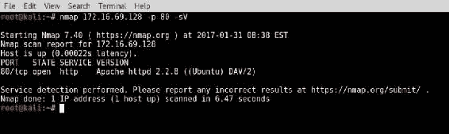
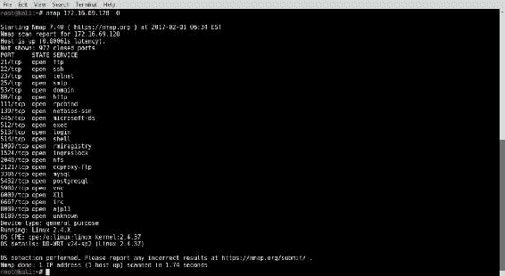

# 第五章：指纹识别

在识别目标范围内的活动系统并枚举这些系统的开放端口后，接下来需要开始收集有关它们及其与开放端口相关的服务的信息。在本章中，我们将讨论使用 Kali Linux 对系统和服务进行指纹识别的不同技术。这些技术将包括横幅获取、服务探测识别、操作系统识别、SNMP 信息收集以及防火墙识别。本章中的具体方法包括以下内容：

+   使用 Netcat 获取横幅

+   使用 Python 套接字获取横幅

+   使用 DMitry 获取横幅

+   使用 Nmap NSE 获取横幅

+   使用 Amap 获取横幅

+   使用 Nmap 进行服务识别

+   使用 Amap 进行服务识别

+   使用 Scapy 进行操作系统识别

+   使用 Nmap 进行操作系统识别

+   使用 xprobe2 进行操作系统识别

+   使用 p0f 进行被动操作系统识别

+   使用 Onesixtyone 进行 SNMP 分析

+   使用 SNMPwalk 进行 SNMP 分析

+   使用 Scapy 进行防火墙识别

+   使用 Nmap 进行防火墙识别

+   使用 Metasploit 进行防火墙识别

# 介绍

在处理列表中提到的具体方法之前，我们应当先探讨一些本章其余部分中会讨论的基本原理。本章中的每一个方法都会介绍可用于执行一些特定任务的工具。这些任务包括横幅获取、服务识别、操作系统识别、SNMP 分析和防火墙识别。每一项任务都服务于一个共同的目标，那就是尽可能多地收集目标系统的信息，以便能够迅速高效地对该系统进行攻击。

在投入大量时间和资源尝试识别远程服务之前，我们应当判断该远程服务是否会主动向我们揭示自身信息。服务横幅包含在与远程服务建立连接时立即返回的输出文本。历史上，网络服务通常会在服务横幅中披露制造商、软件名称、服务类型，甚至版本号。幸运的是，对于渗透测试人员而言，这些信息在识别软件中的已知弱点、缺陷和漏洞时非常有用。服务横幅可以通过简单地连接到远程终端服务来读取。然而，为了使这成为一个有效的信息收集工具，它应该实现自动化，这样我们就不必手动连接到远程主机上的每个服务。本章中将讨论的横幅获取工具将自动化横幅获取任务，以识别尽可能多的开放服务。

如果远程服务未主动披露其运行的软件和/或版本，我们将需要付出更多努力来识别该服务。通常可以通过识别独特的行为或请求独特的响应来确定服务。由于响应或行为上的细微差异，通常还可以识别特定服务的版本。然而，了解所有这些独特的特征对于任何人来说都很难记住。幸运的是，已经创建了许多工具，用于向远程服务发送大量探测，分析目标服务的响应和行为。类似地，响应的变化也可以用来识别远程服务器或工作站上运行的操作系统。这些工具将在涉及服务识别和操作系统识别的食谱中进行讨论。

**简单网络管理协议** (**SNMP**) 是一种旨在为各种类型的网络设备提供远程管理服务的协议。使用 SNMP 进行管理时，通过社区字符串进行身份验证。设备通常会使用默认的社区字符串进行部署。当发生这种情况时，攻击者通常可以远程收集大量目标设备的配置信息，在某些情况下，甚至可以重新配置设备。利用 SNMP 进行信息收集的技术将在涉及 SNMP 分析的食谱中讨论。

在收集潜在目标信息的同时，了解可能影响成功侦察或攻击的障碍也很重要。防火墙是网络设备或软件，用于有选择性地限制网络流量的流向，通常是流入或流出特定目标或来源的流量。防火墙通常被配置为防止远程访问特定服务。了解防火墙对攻击系统与目标之间的流量进行修改的情况，对于试图识别规避或绕过其过滤器的方式至关重要。识别防火墙设备和服务的技术将在涉及防火墙识别的食谱中进行讨论。

# 使用 Netcat 获取横幅

Netcat 是一个多功能的网络工具，可以在 Kali Linux 上执行多种信息收集和扫描任务。本食谱将演示如何使用 Netcat 获取服务横幅，从而识别与目标系统开放端口相关的服务。

# 准备工作

要使用 Netcat 收集服务横幅，你需要有一个远程系统运行网络服务，并且在客户端设备连接时自动披露信息。在提供的示例中，使用了 Metasploitable2 实例来执行此任务。有关如何设置 Metasploitable2 的更多信息，请参阅第一章中的*安装 Metasploitable2*配方，*入门*部分。

# 如何操作……

跟随步骤使用 Netcat 收集横幅信息：

1.  要使用 Netcat 抓取服务横幅，必须建立与远程系统上目标端口的套接字连接。为了快速了解 Netcat 的使用方式以及如何用它完成此任务，可以查看其使用帮助。这可以通过使用`-h`选项来完成：


1.  通过查看此工具提供的各种选项，我们可以确定，通过指定选项，后跟 IP 地址和端口号，可以连接到所需的端口：


1.  在提供的示例中，已连接到`172.16.69.128`上的 Metasploitable2 系统的`22`端口。使用了`-v`选项来提供详细输出，并且使用了`-n`选项通过 IP 地址连接，而不进行 DNS 解析。在这里，我们可以看到远程主机返回的横幅标识了该服务为 SSH，供应商为 OpenSSH，甚至明确标识了版本为 4.7。Netcat 保持一个打开的连接，因此在读取横幅后，你可以通过*Ctrl* + *C*强制关闭连接：


1.  通过对同一系统的`21`端口执行类似的扫描，我们可以轻松获取运行中的 FTP 服务的服务和版本信息。在这些情况下，很多有用的信息都会被披露。了解系统上运行的服务和版本常常是漏洞的一个关键指示，可以用来利用并攻破系统。

# 它是如何工作的……

Netcat 能够从这些服务中抓取横幅，因为这些服务被配置为在客户端连接时自动披露此信息。过去，服务和版本的自我披露做法常常被用来确保连接的客户端正连接到其预定的目标。随着开发者安全意识的提高，这种做法逐渐不再常见。然而，仍然有不少开发不成熟或较旧的遗留服务，提供过多的信息作为服务横幅。

# 使用 Python 套接字抓取横幅

Python 中的`socket`模块可用于连接远程端口上运行的网络服务。本节将演示如何使用 Python 套接字获取服务横幅，以便识别目标系统上开放端口所关联的服务。

# 准备工作

要使用 Python 收集服务横幅，你需要一个运行网络服务的远程系统，当客户端设备连接到它们时会披露信息。在提供的示例中，使用了 Metasploitable2 实例来执行此任务。有关设置 Metasploitable2 的更多信息，请参考 第一章中 *安装 Metasploitable2* 的相关内容，*入门*。此外，本食谱还需要使用文本编辑器（如 Vim 或 GNU nano）编写一个脚本并保存到文件系统。有关编写脚本的更多信息，请参考 第一章中 *使用文本编辑器（Vim 和 GNU nano）* 的相关内容，*入门*。

# 如何操作……

让我们使用 Python 来收集横幅信息：

1.  你可以使用 Python 交互式解释器直接与远程网络服务进行交互。你可以通过直接调用 Python 解释器来开始使用它。在这里，你可以导入任何你希望使用的特定模块。在这个例子中，我们将导入 `socket` 模块：


1.  在提供的示例中，创建了一个名为 `bangrab` 的新套接字。`AF_INET` 参数用于指示套接字将使用 IPv4 地址，`SOCK_STREAM` 参数用于指示将使用 TCP 协议。一旦创建了套接字，就可以使用 `connect()` 函数来初始化连接。在这个示例中，`bangrab` 套接字连接到 Metasploitable2 远程主机 `172.16.69.128` 上的端口 `21`。

1.  连接后，可以使用 `recv()` 函数从套接字连接的服务中接收内容。如果有可用的信息，它将作为输出打印出来。在这里，我们可以看到由 Metasploitable2 服务器上运行的 FTP 服务提供的横幅。最后，`close()` 函数可以用于优雅地结束与远程服务的连接。如果我们尝试连接到一个不接受连接的服务，Python 解释器将返回一个错误：


1.  如果尝试连接到 Metasploitable2 系统上的 TCP 端口 `443`，将返回一个错误，指示连接被拒绝。这是因为该远程端口没有运行任何服务。然而，即使目标端口上有服务运行，也不意味着一定会有服务横幅可用。通过与 Metasploitable2 系统上的 TCP 端口 `80` 建立连接可以看到这一点：


1.  本系统的端口 `80` 上运行的服务正在接受连接，但未向连接客户端提供服务横幅。如果使用 `recv()` 函数，但没有可接收的数据，函数将会阻塞。为了自动化在 Python 中收集横幅的操作，必须使用替代方案来识别是否有横幅可以抓取，然后再调用该函数。`select()` 函数为此问题提供了一个便捷的解决方案：


1.  创建一个 `select` 对象并将其设置为名为 `ready` 的变量。该对象传递四个参数，包括读取列表、写入列表、异常列表和定义超时时间的整数值。在此情况下，我们只关心套接字是否准备好进行读取，因此第二和第三个参数为空。返回一个数组，数组中的值对应于这三种列表的每个项。

1.  我们只关心 `bangrab` 套接字是否有内容可以读取。为了确定是否有内容，我们可以测试数组中的第一个值，如果该值存在，则可以从套接字中接收内容。整个过程可以自动化为一个可执行的 Python 脚本：

```
        #!/usr/bin/python

        import socket
        import select
        import sys

        if len(sys.argv) != 4:
         print "Usage - ./banner_grab.py [Target-IP] [First Port]
          [Last Port]"
         print "Example - ./banner_grab.py 10.0.0.5 1 100"
         print "Example will grab banners for TCP ports 1
          through 100 on 10.0.0.5"
         sys.exit()

        ip = sys.argv[1]
        start = int(sys.argv[2])
        end = int(sys.argv[3])

        for port in range(start,end):
         try:
           bangrab = socket.socket(socket.AF_INET, socket.SOCK_STREAM)
           bangrab.connect((ip, port))
           ready = select.select([bangrab],[],[],1)
           if ready[0]:
             print "TCP Port " + str(port) + " - " + bangrab.recv(4096)
             bangrab.close()
           except:
             pass

```

1.  在此脚本中，接受三个参数作为输入：

    +   第一个参数是用于测试服务横幅的 IP 地址

    +   第二个参数表示要扫描的端口范围中的第一个端口号

    +   第三个也是最后一个参数表示要扫描的端口范围中的最后一个端口号

1.  执行此脚本时，它将使用 Python 套接字连接到远程系统中所有在范围内的端口，并收集并打印所有识别出的服务横幅。通过修改文件权限并直接从编写脚本所在的目录中调用它，可以执行此脚本：


# 它是如何工作的……

本食谱中介绍的 Python 脚本通过利用 `socket` 库来工作。脚本循环遍历每个指定的目标端口地址，并尝试与该端口建立 TCP 连接。如果连接成功并且从目标服务接收到横幅信息，该横幅将被打印到脚本的输出中。如果无法与远程端口建立连接，脚本将继续尝试循环中的下一个端口地址。同样，如果连接成功但没有返回横幅，连接将被关闭，脚本将继续执行循环中的下一个端口。

# 使用 DMitry 获取服务横幅

DMitry 是一个简单且高效的工具，可以用来连接到远程端口上运行的网络服务。本食谱将演示如何使用 DMitry 扫描获取服务横幅，以识别目标系统上开放端口所关联的服务。

# 准备工作

要使用 DMitry 收集服务横幅，您需要有一个远程系统，该系统运行网络服务，当客户端设备连接到这些服务时，会披露相关信息。在所提供的示例中，使用了 Metasploitable2 实例来执行此任务。有关设置 Metasploitable2 的更多信息，请参阅 第一章 中的 *安装 Metasploitable2* 配方，*入门* 部分。

# 如何操作……

执行以下步骤以使用 DMitry 获取横幅信息：

1.  正如本书中先前讨论的端口扫描教程，DMitry 可用于快速扫描 150 个最常用的 TCP 端口。这可以通过使用 `-p` 选项来完成：


1.  该端口扫描选项是执行 DMitry 横幅抓取所必需的。还可以在尝试连接这 150 个端口时，使用 DMitry 抓取任何可用的横幅。这可以通过将 `-b` 选项与 `-p` 选项结合使用来完成：


# 它是如何工作的……

DMitry 是一个非常简单的命令行工具，可以以最小的开销执行横幅抓取任务。与其指定应该尝试抓取横幅的端口，DMitry 可以通过仅在少量预定义的常用端口上进行横幅抓取来简化过程。来自这些端口地址上运行的服务的横幅将返回并显示在脚本的终端输出中。

# 使用 Nmap NSE 进行横幅抓取

Nmap 有一个集成的 **Nmap 脚本引擎**（**NSE**）脚本，可以用来读取远程端口上运行的网络服务的横幅。这个教程将展示如何使用 Nmap NSE 获取服务横幅，从而识别目标系统上开放端口所关联的服务。

# 准备就绪

要使用 Nmap NSE 收集服务横幅，您需要有一个远程系统，该系统运行网络服务，当客户端设备连接到这些服务时，会披露相关信息。在所提供的示例中，使用了 Metasploitable2 实例来执行此任务。有关设置 Metasploitable2 的更多信息，请参阅 第一章 中的 *安装 Metasploitable2* 配方，*入门* 部分。

# 如何操作……

让我们使用 Nmap NSE 获取横幅信息：

1.  Nmap NSE 脚本可以通过在 Nmap 中使用 `--script` 选项并指定所需脚本的名称来调用。对于这个特定的脚本，应该使用 `-sT` 完全连接扫描，因为只有在建立完全的 TCP 连接时，才能收集服务横幅。该脚本将应用于与 Nmap 请求扫描的相同端口：


1.  在提供的示例中，扫描了 Metasploitable2 系统的 TCP 端口 `22`。除了指示该端口开放外，Nmap 还使用横幅脚本收集了与该端口相关的服务横幅。此技术也可以通过 `--` 符号应用于端口的连续范围：


# 它是如何工作的……

执行横幅抓取侦察的另一个优秀选项是使用 Nmap NSE 脚本。这可以通过两种方式有效地简化信息收集过程：首先，因为 Nmap 很可能已经是你工具库中的一部分，用于目标和服务发现；其次，因为横幅抓取过程可以与这些扫描一起运行。使用额外的`--script`选项和`banner`参数的 TCP 连接扫描可以完成服务枚举和横幅抓取的任务。

# 使用 Amap 进行横幅抓取

Amap 是一个应用映射工具，可以用于读取来自远程端口上运行的网络服务的横幅。本教程将演示如何使用 Amap 获取服务横幅，以识别目标系统上开放端口关联的服务。

# 准备工作

要使用 Amap 收集服务横幅，你需要有一个远程系统在运行网络服务，当客户端设备连接到这些服务时会披露信息。在提供的示例中，使用了 Metasploitable2 实例来执行此任务。有关设置 Metasploitable2 的更多信息，请参考 第一章中的 *安装 Metasploitable2* 教程，*开始使用*。

# 如何进行……

以下步骤将引导你使用 Amap 收集服务横幅信息：

1.  Amap 中的 `-B` 选项可以用于以横幅模式运行应用程序。这将使其收集指定 IP 地址和服务端口的横幅。通过指定远程 IP 地址和服务号，可以使用 Amap 收集来自单个服务的横幅：


1.  在提供的示例中，Amap 已从 Metasploitable2 系统的端口 `21` 上抓取了服务横幅（系统地址为 `172.16.69.128`）。此命令也可以修改为扫描端口的连续范围。要扫描所有可能的 TCP 端口，必须扫描所有可能的端口地址值。定义源端口和目标端口地址的 TCP 头部分别为 16 位长度，每个位可以保持 `1` 或 `0` 的值。因此，可能的 TCP 端口地址总共有 2¹⁶，即 65,536 个。

要扫描整个可能的地址空间，必须提供端口范围 `1-65535`：


1.  Amap 输出的标准结果提供了一些不必要和冗余的信息，这些信息可以从输出中提取出来。具体来说，移除扫描元数据、`Banner on` 短语以及整个扫描过程中保持不变的 IP 地址可能会很有帮助。为了移除扫描元数据，我们必须使用 `grep` 命令输出特定于某个输出条目的短语，这个短语在扫描元数据描述中不存在。为此，我们可以使用 `grep` 命令查找单词 `on`：


1.  然后，我们可以通过使用冒号分隔符切割每一行输出，并只提取 `2-5` 字段，来从输出中提取 `Banner on` 短语和冗余的 IP 地址：


# 它是如何工作的…

定义 Amap 如何完成横幅抓取任务的基本原理与之前讨论的其他工具相同。Amap 会遍历目标端口地址列表，尝试与每个端口建立连接，然后在连接到服务时接收任何返回的横幅信息。

# 使用 Nmap 进行服务识别

尽管横幅抓取有时可以成为非常有价值的信息来源，但服务横幅中版本泄露的情况越来越少见。Nmap 提供了一个远超简单横幅抓取技术的服务识别功能。本食谱将演示如何使用 Nmap 基于探测响应分析来执行服务识别。

# 准备工作

要使用 Nmap 执行服务识别，您需要一个远程系统，该系统正在运行可以进行探测和检查的网络服务。在提供的示例中，使用了 Metasploitable2 实例来执行此任务。有关设置 Metasploitable2 的更多信息，请参阅 第一章 中的 *安装 Metasploitable2* 食谱，*入门* 部分。

# 如何操作…

我们已经获得了服务横幅信息，现在让我们使用 Nmap 执行服务识别：

1.  为了理解 Nmap 服务识别功能的有效性，我们应该考虑一个没有提供自我披露服务横幅的服务。通过使用 Netcat 连接到 Metasploitable2 系统的 TCP 端口 `80`（这是本章 *使用 Netcat 进行横幅抓取* 食谱中讨论的技术），我们可以看到仅通过建立 TCP 连接并没有呈现任何服务横幅：


1.  然后，要在相同端口上执行 Nmap 服务扫描，我们可以使用 `-sV` 选项并结合 IP 和端口指定：



1.  如示范中所示，Nmap 能够识别服务、厂商以及产品的具体版本。这个服务识别功能也可以用于指定的端口序列。也可以不指定端口号，使用 Nmap 扫描 1,000 个常见端口，并尝试识别所有已识别的监听服务：


# 它是如何工作的…

Nmap 服务识别会发送一系列全面的探测请求，然后分析这些请求的响应，试图根据服务特有的签名和预期行为来识别服务。此外，你可以在服务识别的输出底部看到，Nmap 依赖用户的反馈以确保其服务签名的持续可靠性。

# 使用 Amap 进行服务识别

Amap 是 Nmap 的一个“表亲”，专门设计用于识别网络服务。在本节中，我们将解释如何使用 Amap 执行服务识别。

# 准备工作

要使用 Amap 执行服务识别，你需要有一个远程系统在运行可以被探测和检查的网络服务。在提供的示例中，使用 Metasploitable2 实例来执行此任务。有关设置 Metasploitable2 的更多信息，请参考第一章中 *安装 Metasploitable2* 的内容，*入门* 部分。

# 如何操作…

Amap 是专门为服务识别设计的，下面我们将通过这些步骤使用 Amap 执行服务识别：

1.  要在单个端口上执行服务识别，运行 Amap 并指定 IP 地址和端口号：


1.  Amap 也可以使用破折号表示法扫描一系列连续的端口号。为此，请执行 `amap` 命令，指定 IP 地址，并通过第一个端口号、破折号（`-`）以及范围中的最后一个端口号来表示端口范围：


1.  除了识别它能够识别的任何服务外，Amap 还会在输出末尾生成一个列表，指示任何未识别的端口。这个列表不仅包括运行着无法识别的服务的开放端口，还包括所有已扫描的关闭端口。虽然仅扫描 10 个端口时，输出结果还算可管理，但扫描更大范围的端口时就会变得非常烦人。为了抑制未识别端口的信息，可以使用 `-q` 选项：


1.  请注意，Amap 会显示一般性和更具体签名的匹配情况。在提供的示例中，运行在端口`22`上的服务被识别为匹配 SSH 签名，同时也匹配了更具体的 `openssh` 签名。将签名匹配结果与服务横幅并排显示也有助于进一步确认。可以使用 `-b` 选项将横幅附加到与每个端口相关联的输出中：


1.  对大量端口进行服务识别扫描，或对所有 65,536 个端口进行全面扫描时，如果对每个服务使用每个可能的签名探测，可能会花费异常长的时间。为了提高服务识别扫描的速度，可以使用 `-1` 参数，在服务匹配到签名后停止分析该服务：


# 它是如何工作的……

Amap 执行服务识别的基本原理与 Nmap 使用的原理相似。通过注入一系列探测请求，试图获取独特的响应，以便识别运行在特定端口上的服务的软件和版本。然而，需要注意的是，尽管 Amap 是服务识别的一个备选方案，它不像 Nmap 那样频繁更新和维护。因此，Amap 产生可靠结果的可能性较小。

# 使用 Scapy 进行操作系统识别

有许多技术可以用来尝试识别你正在与之通信的设备的操作系统。真正有效的操作系统识别工具是强大的，并且使用大量技术来分析其结果。然而，Scapy 可以单独分析这些因素。本教程将展示如何通过检查返回的 TTL 值，使用 Scapy 进行操作系统识别。

# 准备工作

要使用 Scapy 识别 TTL 响应中的差异，你需要有一个远程系统，运行 Linux/Unix 操作系统，并且有一个远程系统，运行 Windows 操作系统，以供分析。在提供的示例中，使用了 Metasploitable2 和 Windows XP 的安装版本。有关在本地实验室环境中设置系统的更多信息，请参阅第一章中的 *安装 Metasploitable2* 和 *安装 Windows Server* 章节，*入门指南*。此外，本节还需要使用文本编辑器（如 Vim 或 GNU nano）编写脚本到文件系统中。有关编写脚本的更多信息，请参阅第一章中的 *使用文本编辑器（Vim 和 GNU nano）* 章节，*入门指南*。

# 如何操作……

以下步骤将帮助你使用 Scapy 进行操作系统识别：

1.  Windows 和 Linux/Unix 操作系统的默认 TTL 起始值不同。这个因素可以用来尝试识别你正在与之通信的操作系统类型。以下表格总结了这些值：

| **操作系统** | **标准 TTL 值** |
| --- | --- |
| 微软 Windows 操作系统 | 128 |
| Linux/Unix 操作系统 | 64 |

1.  一些基于 Unix 的系统会从默认 TTL 值`255`开始；然而，为了简化这个练习，我们将使用提供的值作为本食谱中任务的前提。为了分析来自远程系统的响应中的 TTL 值，我们首先需要构建一个请求。在这个例子中，我们将使用**互联网控制消息协议**（**ICMP**）回显请求。为了发送 ICMP 请求，我们必须首先构建该请求的各个层。我们需要构建的第一层是 IP 层：


1.  为了构建请求的 IP 层，我们应该将`IP`对象分配给`i`变量。通过调用`display()`函数，我们可以识别该对象的属性配置。默认情况下，发送和接收地址都设置为回环地址`127.0.0.1`。这些值可以通过更改目标地址来修改，将`i.dst`设置为我们希望扫描的地址的字符串值。

1.  通过再次调用`display()`函数，我们可以看到，不仅目标地址已更新，Scapy 还会自动将源 IP 地址更新为与默认接口关联的地址。现在，我们已经构建了请求的 IP 层，接下来应该构建 ICMP 层：


1.  为了构建我们请求的 ICMP 层，我们将使用与构建 IP 层时相同的技术。在提供的示例中，ICMP 对象被分配给了`ping`变量。如前所述，可以通过调用`display()`函数来识别默认配置。默认情况下，ICMP 类型已设置为`echo-request`。现在，我们已经创建了 IP 和 ICMP 层，我们需要通过堆叠这些层来构建请求：


1.  IP 和 ICMP 层可以通过用斜杠分隔变量来堆叠。然后，这些层可以设置为一个新的变量，代表整个请求。接着，可以调用`display()`函数来查看请求的配置。一旦请求构建完成，就可以将其传递给`sr1()`函数以分析响应：


1.  这个请求可以在不独立构建和堆叠每一层的情况下执行。相反，可以通过直接调用函数并传递适当的参数来使用一个单行命令：


1.  请注意，来自 Linux 系统的响应的 TTL 值为 `64`。可以对 Windows 系统的 IP 地址执行相同的测试，并注意 TTL 值响应的差异：


1.  请注意，Windows 系统返回的响应的 TTL 值为 `128`。这种响应的变化可以很容易地在 Python 中进行测试：


1.  通过发送相同的请求，可以测试 TTL 值的整数等效值，以确定其是否小于或等于 `64`，如果是这种情况，我们可以假设该设备很可能运行 Linux/Unix 操作系统。否则，如果值大于 64，则可以假设该设备很可能运行 Windows 操作系统。可以使用可执行的 Python 脚本自动化整个过程：

```
        #!/usr/bin/python

        from scapy.all import *
        import logging
        logging.getLogger("scapy.runtime").setLevel(logging.ERROR)
        import sys

        if len(sys.argv) != 2:
          print "Usage - ./ttl_id.py [IP Address]"
          print "Example - ./ttl_id.py 10.0.0.5"
          print "Example will perform ttl analysis to
           attempt to determine whether the system is Windows
           or Linux/Unix"
          sys.exit()

        ip = sys.argv[1]

        ans = sr1(IP(dst=str(ip))/ICMP(),timeout=1,verbose=0)
        if ans == None:
          print "No response was returned"
        elif int(ans[IP].ttl) <= 64:
          print "Host is Linux/Unix"
        else:
          print "Host is Windows"

```

1.  提供的 Python 脚本将接受一个参数，该参数为需要扫描的 IP 地址。根据返回响应的 TTL 值，脚本将尽最大努力猜测远程操作系统。可以通过使用 `chmod` 命令更改文件权限，并直接从脚本所在的目录调用该脚本来执行：


# 它是如何工作的…

Windows 操作系统传统上将网络流量的起始 TTL 值设置为 `128`，而 Linux/Unix 操作系统传统上将网络流量的起始 TTL 值设置为 `64`。假设从一个设备到另一个设备的跳数不超过 64 次，可以安全地假设 Windows 系统会以 TTL 值在 65 到 128 之间的范围内传输响应，而 Linux/Unix 系统会以 TTL 值在 1 到 64 之间的范围内传输响应。当扫描系统与远程目标之间存在设备拦截请求并重新打包时，这种识别方法可能会变得不太有用。

# 使用 Nmap 进行操作系统识别

尽管 TTL 分析在识别远程操作系统时有帮助，但更全面的解决方案更为理想。Nmap 具有一个操作系统识别功能，远远超出了简单的 TTL 分析。本教程将演示如何使用 Nmap 基于探针响应分析进行操作系统识别。

# 准备工作

要使用 Nmap 执行操作系统识别，您需要有一个远程系统运行可以进行探测和检查的网络服务。在提供的示例中，使用 Windows XP 安装来执行此任务。有关设置 Windows 系统的更多信息，请参阅 第一章 中的 *安装 Windows 服务器* 配方，*入门指南*。

# 如何操作…

让我们使用 Nmap 进行操作系统识别：

1.  要执行 Nmap 操作系统识别扫描，应该使用 IP 地址和 `-O` 选项调用 Nmap：



1.  在提供的输出中，Nmap 会指示运行的操作系统，或者可能提供几个可能的操作系统列表。在这种情况下，Nmap 已经指示远程系统正在运行 Windows XP 或 Windows Server 2003。

# 如何操作……

Nmap 的操作系统识别通过发送一系列综合的探测请求，并分析这些请求的响应，试图基于操作系统特定的特征和预期行为来识别底层的操作系统。此外，您可以看到在操作系统识别输出的底部，Nmap 依赖于用户反馈来确保其服务特征的持续可靠性。

# 使用 xprobe2 进行操作系统识别

**xprobe2** 工具是一个综合性工具，旨在识别远程操作系统。此配方将演示如何使用 `xprobe2` 命令，基于探测响应分析来执行操作系统识别。

# 准备工作

要使用 `xprobe2` 命令进行操作系统识别，您需要一个远程系统，且该系统正在运行可以被探测和检查的网络服务。在提供的示例中，使用了一个 Metasploitable2 实例来执行此任务。有关设置 Metasploitable2 的更多信息，请参阅 第一章 中的 *安装 Metasploitable2* 配方，*开始使用* 部分。

# 如何操作……

以下步骤将指导您使用 `xprobe2` 命令进行操作系统识别：

1.  要在远程系统上执行操作系统识别扫描，您需要使用 `xprobe2` 命令，并向程序传递一个包含要扫描系统的 IP 地址的单一参数：


1.  此工具的输出可能有些误导。有几种不同的 Linux 内核，表示该操作系统的 100% 可能性。显然，这不可能是正确的。

1.  xprobe2 工具实际上是根据与目标系统确认的与该操作系统相关的可能签名的数量来计算这个百分比的。

1.  不幸的是，正如从该输出中可以看到的那样，签名并不够细致，无法区分次要版本。尽管如此，这个工具仍然可以作为识别目标操作系统的有用附加资源。

# 如何操作……

xprobe2 识别远程操作系统的基本原理与 Nmap 使用的原理相同。xprobe2 的操作系统识别通过发送一系列综合的探测请求，并分析这些请求的响应，试图基于操作系统特定的特征和预期行为来识别底层的操作系统。

# 使用 p0f 进行被动操作系统识别

**p0f** 工具是一款综合性的工具，旨在识别远程操作系统。与这里讨论的其他工具不同，它被设计为被动地进行操作系统识别，而不直接与目标系统进行交互。本教程将展示如何使用 `p0f` 命令执行被动操作系统识别。

# 准备工作

要使用 `p0f` 命令进行操作系统识别，你需要一个正在运行网络服务的远程系统。在提供的示例中，使用了 Metasploitable2 实例来执行此任务。有关如何设置 Metasploitable2 的更多信息，请参阅 第一章中的 *安装 Metasploitable2* 配方，*入门* 部分。

# 如何操作……

以下步骤将帮助你使用 `p0f` 命令执行被动操作系统识别：

1.  如果你直接从命令行执行 `p0f` 命令，而没有任何先前的环境设置，你会注意到它不会提供太多信息，除非你直接与网络上的某些系统交互：


1.  这种信息的缺乏表明，与我们讨论的其他工具不同，`p0f` 并不会主动探测设备以尝试确定其操作系统。相反，它只是安静地监听。

1.  我们可以通过在一个独立的终端中运行 Nmap 扫描来生成流量，但那样就违背了被动操作系统识别工具的初衷。相反，我们需要找到一种方式，将流量通过我们的本地接口进行路由，以便我们可以被动地分析它。

1.  Ettercap 提供了一个优秀的解决方案，能够通过提供中毒 ARP 缓存的功能来创建一个**中间人攻击**（**MITM**）场景。为了使两个系统之间的流量通过你的本地接口重新路由，你需要对这两个系统进行 ARP 中毒：


1.  在提供的示例中，`ettercap` 命令在命令行中执行。`-M` 选项定义了由 `arp:remote` 参数指定的模式。这表示将执行 ARP 中毒，并且将嗅探来自远程系统的流量。开头和结尾的斜杠中的 IP 地址表示要中毒的系统。`-T` 选项表示操作将在纯文本界面中执行，`-w` 选项用于指定将流量捕获保存到的文件。

1.  一旦你建立了 MITM，你可以在一个独立的终端中再次执行 `p0f`。假设这两个被攻击的主机正在进行通信，你应该能看到以下流量：


1.  所有通过`p0f`监听器的包都会被标记为未知，或者与特定的操作系统签名相关联。完成足够的分析后，您应该通过输入`q`优雅地关闭 Ettercap 文本界面。这将重新 ARP 受害者，以确保不会发生服务中断：


# 它是如何工作的…

ARP 欺骗通过使用虚假的 ARP 响应，欺骗受害系统将目标 IP 地址与 MITM 系统的 MAC 地址关联。MITM 系统将接收来自两个中毒系统的流量，并将流量转发给目标接收方。这将允许 MITM 系统从网络中嗅探所有流量。通过分析这些流量中的独特行为和签名，p0f 可以在不直接探测设备响应的情况下识别网络中设备的操作系统。

# 使用 Onesixtyone 进行 SNMP 分析

**Onesixtyone** 是一个 SNMP 分析工具，其名称来源于 SNMP 操作的 UDP 端口。它是一个非常简单的 SNMP 扫描器，只请求任何指定 IP 地址的系统描述值。

# 准备工作

要使用 Onesixtyone 进行 SNMP 分析，您需要具备启用 SNMP 并能够被探测和检查的设备。在提供的示例中，使用了 Windows XP 安装进行此任务。如需了解更多关于设置 Windows 系统的信息，请参考第一章中的*安装 Windows Server*配方，*入门指南*。

# 如何操作…

让我们使用`onesixtyone`命令进行 SNMP 分析：

1.  要使用`onesixtyone`命令，您可以将目标 IP 地址和社区字符串作为参数传递：


1.  在提供的示例中，使用了社区字符串`public`来查询`172.16.69.129`设备的系统描述。这是各种网络设备使用的最常见的默认社区字符串之一。根据输出，远程主机用描述字符串回应了查询，标识了自身。

# 它是如何工作的…

SNMP 是一种协议，用于管理联网设备并促进这些设备之间的信息共享。在企业网络环境中，通常需要使用此协议；然而，系统管理员经常未修改用于跨 SNMP 设备共享信息的默认社区字符串。在这种情况下，可以通过正确猜测这些设备使用的默认社区字符串来收集关于网络设备的信息。

# 使用 SNMPwalk 进行 SNMP 分析

**SNMPwalk** 是一个更复杂的 SNMP 扫描器，可用于从具有可猜测的 SNMP 社区字符串的设备收集大量信息。SNMPwalk 会循环执行一系列请求，以尽可能多地收集该服务的信息。

# 准备工作

要使用 SNMPwalk 执行 SNMP 分析，您需要启用 SNMP 并且可以被探测和检查的设备。在提供的示例中，使用 Windows XP 的安装来执行此任务。有关如何设置 Windows 系统的更多信息，请参见 第一章 中的 *安装 Windows Server* 章节， *入门*。

# 如何操作…

以下步骤将指导您使用 `snmpwalk` 命令执行 SNMP 分析：

1.  要执行 `snmpwalk` 命令，工具应传递一系列参数，包括要分析的系统的 IP 地址、要使用的社区字符串以及系统采用的 SNMP 版本：


1.  要针对启用了 SNMP 的 Windows XP 系统使用 SNMPwalk，使用默认的社区字符串 `public`，版本为 `2c`。这会生成大量的输出，示范中已进行了截断。

1.  注意，默认情况下，所有识别的信息前面都有查询的 OID 值。可以通过将输出传递给 `cut` 函数来清理这些标识符：


1.  请注意，SNMPwalk 的输出不仅提供了系统标识符。通过检查输出，有些信息可能看起来显而易见，而有些则可能看起来更为晦涩。然而，通过彻底分析，您可以收集到关于目标系统的大量信息：


1.  在输出的一个片段中，可以看到一系列的十六进制值和 IP 地址以列表形式展示。通过参考网络上已知系统的网络接口，可以明显看出这些是 ARP 缓存的内容。它标识了设备上存储的 IP 地址和 MAC 地址关联：


1.  此外，输出中还可以找到正在运行的进程列表和已安装的应用程序。这些信息在枚举目标系统上运行的服务和识别潜在的漏洞方面非常有用，这些漏洞可能被利用。

# 它是如何工作的…

与 Onesixtyone 不同，SNMPwalk 不仅能够识别常见或默认的 SNMP 社区字符串的使用情况，还能够利用这些配置通过 SNMP 从目标系统收集大量信息。这是通过一系列 SNMP `GETNEXT` 请求来实现的，本质上是暴力请求系统通过 SNMP 提供的所有信息。

# 使用 Scapy 进行防火墙识别

通过评估从选择的分组注入返回的响应，可以确定远程端口是否被防火墙设备过滤。为了深入理解这个过程是如何工作的，我们可以通过 Scapy 在数据包级别执行此任务。

# 准备工作

要使用 Scapy 进行防火墙识别，您需要一个运行网络服务的远程系统。此外，您还需要实现某种类型的过滤机制。这可以通过独立的防火墙设备或主机上的过滤机制（如 Windows 防火墙）来完成。通过操作防火墙设备上的过滤设置，您应该能够修改注入数据包的响应。

# 如何做到这一点……

让我们使用 Scapy 进行防火墙识别：

1.  为了有效确定 TCP 端口是否被过滤，必须同时发送 TCP SYN 数据包和 TCP ACK 数据包到目标端口。根据这些数据包的响应情况，我们可以判断端口是否被过滤。最有可能的是，注入这两个数据包会导致四种不同响应组合中的一种。我们将讨论每种情况，它们表明目标端口的过滤状态，以及如何测试每种情况。这四种可能的响应组合包括：

    +   SYN 请求没有响应，ACK 请求 RST 响应

    +   SYN 请求 SYN+ACK 或 SYN+RST 响应，ACK 请求没有响应

    +   SYN 请求 SYN+ACK 或 SYN+RST 响应，ACK 请求 RST 响应

    +   SYN 请求没有响应，ACK 请求没有响应

1.  在第一个场景中，我们应该考虑一种配置，其中注入的 SYN 数据包没有响应，而 ACK 数据包则会收到 RST 响应。为了测试这一点，我们应该先向目标端口发送一个 TCP ACK 数据包。要将 TCP ACK 数据包发送到任何给定端口，首先必须构建请求的各个层。我们需要构建的第一层是 IP 层：


1.  为了构建请求的 IP 层，我们应该将`IP`对象赋值给`i`变量。通过调用`display()`函数，我们可以识别该对象的属性配置。默认情况下，发送和接收地址都设置为`127.0.0.1`回环地址。可以通过修改目标地址来改变这些值，将`i.dst`设置为我们希望扫描的地址的字符串值。

1.  通过再次调用`display()`函数，我们可以看到，不仅目标地址已经更新，Scapy 还会自动更新源 IP 地址为与默认接口相关联的地址。现在我们已经构建了请求的 IP 层，接下来应该进入 TCP 层：


1.  为了构建请求的 TCP 层，我们将使用与 IP 层相同的技术。在提供的示例中，`TCP`对象被赋值给`t`变量。如前所述，可以通过调用`display()`函数来识别默认配置。在这里，我们可以看到源端口的默认值设置为端口`21`（FTP），目标端口的默认值设置为端口`80`（HTTP）。

1.  目标端口值可以通过将其设置为新的端口目标值来修改，`flags` 值应该设置为 `A`，以表示 ACK 标志位应该被激活。现在我们已经创建了 IP 和 TCP 层，我们需要通过堆叠这些层来构建请求：


1.  IP 和 TCP 层可以通过用斜杠分隔变量来堆叠。这些层可以设置为等于一个新的变量，表示整个请求。然后可以调用 `display()` 函数来查看请求的配置。一旦请求构建完成，就可以将其传递给 `sr1()` 函数，以便分析响应：


1.  可以通过直接调用函数并传递适当的参数来执行相同的请求，而无需独立构建和堆叠每一层。这样可以使用一个单行命令来完成：


1.  请注意，在这个特定场景中，接收到一个 RST 数据包作为对注入的 ACK 数据包的响应。测试的下一步是以相同的方式注入一个 SYN 数据包：


1.  以相同方式发送 SYN 请求后，未收到响应，并且当超时值被超出时，函数停止执行。这种响应组合表明启用了状态检测过滤。该套接字拒绝所有传入连接，通过丢弃 SYN 请求来实现，但 ACK 数据包不会被过滤，以确保外向连接和持续通信仍然可行。这种响应组合可以在 Python 中进行测试，以识别状态过滤的端口：


1.  在使用 Scapy 构建每个请求后，用于评估这些响应的测试是确定是否从 ACK 或 SYN 注入中接收到响应，但不会同时从两者中接收到响应。这个测试有效地用于识别当前场景和下一个场景，其中 SYN 注入会收到回复，而 ACK 注入则不会。一个 SYN+ACK 或 RST+ACK 响应由 SYN 注入引发，但 ACK 注入没有响应的场景，也是状态检测过滤的一个标志。该测试方法保持不变。

首先，应该向目标端口发送一个 ACK 数据包：


1.  请注意，在提供的示例中，这次注入没有引发响应。或者，如果注入 SYN 数据包，则如果端口开放，将收到带有 SYN+ACK 标志位激活的响应；如果端口关闭，则会收到带有 RST+ACK 标志位激活的响应：


1.  在这种情况下可以执行完全相同的测试，因为该测试通过确定是否有两个注入请求中的任何一个引发响应（而不是两个都引发响应）来识别是否存在状态检测过滤：


1.  这种响应组合表明正在对 ACK 数据包执行有状态过滤，任何在正确会话上下文之外发送的 ACK 数据包都将被丢弃。然而，端口并没有完全被过滤，从对入站连接尝试的响应可以看出这一点。另一种可能的情况是，如果 SYN 和 ACK 注入都得到了预期的响应。在这种情况下，没有任何过滤的迹象。为了测试这种情况，应该进行 ACK 注入并分析响应：


1.  如果端口未过滤，发送一个未经请求的 ACK 数据包到目标端口应会导致返回一个 RST 数据包。这个 RST 数据包表明 ACK 数据包是超出上下文发送的，旨在终止通信。发送 ACK 注入后，还应该向同一端口发送一个 SYN 注入：


1.  如果端口未过滤且处于打开状态，将返回一个 SYN+ACK 响应。注意，TCP `flags` 属性的实际值是一个值为 `18` 的长变量。这个值可以通过 `int` 函数轻松转换为整数。`18` 是 TCP 标志位序列的十进制值。SYN 标志位的十进制值为 `2`，ACK 标志位的十进制值为 `16`。假设没有有状态过滤的迹象，我们可以通过评估 TCP `flags` 值的整数转换，在 Python 中测试端口是否未过滤且已打开：


1.  可以执行类似的测试，以确定端口是否未过滤且已关闭。一个未过滤且已关闭的端口将激活 RST 和 ACK 标志位。如前所述，ACK 标志位的十进制值为 `16`，RST 标志位的十进制值为 `4`。因此，未过滤且关闭端口的 TCP `flags` 值的预期整数转换应为 `20`：


1.  最后，我们应该考虑一种没有收到 SYN 或 ACK 注入响应的情况。在这种情况下，当提供的超时值超过时，`sr1()` 函数的两个实例将被中止：


1.  两个注入都没有响应，很可能表明端口是无状态过滤的，并且无论状态如何都会丢弃所有入站流量，或者可能是远程主机宕机的迹象。人们可能会首先想到，可以通过在先前开发的测试序列末尾附加一个 `else` 执行流程，在 Python 中测试这一点。如果没有收到一个或两个注入的响应，理论上应该执行这个 `else` 操作。简而言之，如果没有收到响应，`else` 操作会被执行：


1.  虽然理论上它似乎可行，但在实践中效果较差。如果对没有值的变量进行值测试，Python 实际上会返回一个错误。为了避免这个问题，首先应该检查的条件是是否收到了任何回复：


1.  然后，整个测试序列可以集成到一个功能脚本中。该脚本将接受两个参数，包括目标 IP 地址和待测试端口。然后将注入 ACK 和 SYN 数据包，并存储任何收到的响应以供评估。

1.  接下来，将执行一系列四个测试，以确定端口是否存在过滤。首先，将执行一个测试，以确定是否收到了任何响应。如果没有收到响应，则输出将指示远程主机已关闭或端口处于无状态过滤状态并丢弃所有流量。如果收到任何响应，将执行一个测试，以确定它是对一个注入的响应而非两个。如果是这种情况，输出将指示该端口是有状态过滤的。

1.  最后，如果从两个注入中都收到了响应，则该端口将被识别为未过滤，并且会评估 TCP `flags` 值，以确定该端口是开放还是关闭：

```
        #!/usr/bin/python

        import sys
        import logging
        logging.getLogger("scapy.runtime").setLevel(logging.ERROR)
        from scapy.all import *

        if len(sys.argv) != 3:
            print "Usage - ./ACK_FW_detect.py [Target-IP]
             [Target Port]"
            print "Example - ./ACK_FW_detect.py 10.0.0.5 443"
            print "Example will determine if filtering exists
             on port 443 of host 10.0.0.5"
            sys.exit()

        ip = sys.argv[1]
        port = int(sys.argv[2])

        ACK_response =
        sr1(IP(dst=ip)/TCP(dport=port,flags='A'),timeout=1,verbose=0)
        SYN_response =
        sr1(IP(dst=ip)/TCP(dport=port,flags='S'),timeout=1,verbose=0)
        if (ACK_response == None) and (SYN_response == None):
            print "Port is either unstatefully filtered or
             host is down"
        elif ((ACK_response == None) or (SYN_response == None))
         and not
        ((ACK_response == None) and (SYN_response == None)):
            print "Stateful filtering in place"
        elif int(SYN_response[TCP].flags) == 18:
            print "Port is unfiltered and open"
        elif int(SYN_response[TCP].flags) == 20:
            print "Port is unfiltered and closed"
        else:
            print "Unable to determine if the port is filtered"

```

1.  在本地文件系统中创建脚本后，需要更新文件权限以允许执行该脚本。可以使用 `chmod` 命令来更新这些权限，然后可以通过直接调用该脚本并传递预期的参数来执行它：


# 它是如何工作的…

SYN 和 ACK TCP 标志在有状态网络通信中扮演重要角色。SYN 请求允许建立新的 TCP 会话，而 ACK 响应用于维持会话直到关闭。一个端口如果仅响应其中一种类型的数据包，而非另一种，极有可能受到基于会话状态的流量限制过滤。通过识别这种情况，可以推断该端口存在有状态过滤。

# 使用 Nmap 进行防火墙识别

Nmap 拥有简化的防火墙过滤识别功能，可以基于 ACK 探测响应来识别端口上的过滤。此功能可以用于测试单个端口或多个端口的过滤状态。

# 准备工作

要使用 Nmap 执行防火墙识别，你需要有一个远程系统正在运行网络服务。此外，你还需要实现某种类型的过滤机制。这可以通过独立的防火墙设备或基于主机的过滤（如 Windows 防火墙）来完成。通过操作防火墙设备上的过滤设置，你应该能够修改扫描结果。

# 它是如何实现的…

这些步骤将帮助你使用 Nmap 来识别防火墙：

1.  要执行 Nmap 防火墙 ACK 扫描，应该使用 `nmap` 调用，指定 IP 地址、目标端口和 `-sA` 选项：


1.  在没有通过防火墙路由流量的情况下，对我的本地网络中的 Metasploitable2 系统执行此扫描时，响应表明 TCP 端口 `22`（SSH）是未过滤的。可以通过执行相同的扫描而不提供端口规格来对 Nmap 的 1,000 个常见端口进行端口过滤评估：


1.  当对本地网络中的 Metasploitable2 系统进行扫描时，该系统没有位于任何防火墙之后，结果显示所有扫描的端口都未被过滤。如果相同的扫描针对一个位于包过滤防火墙之后的目标进行，则所有端口都会被识别为已过滤，除了防火墙不限制流量的端口。当扫描端口范围时，输出只包含未过滤的端口。

1.  要扫描所有可能的 TCP 端口，必须扫描所有可能的端口地址值。定义源和目标端口地址的 TCP 头部部分都是 16 位长，每一位可以保持 `1` 或 `0` 的值。因此，可能的 TCP 端口地址有 2¹⁶，即 65,536 个。要扫描所有可能的地址空间，必须提供端口范围 `1-65535`：


# 它是如何工作的…

除了 Nmap 提供的许多其他功能外，它还可以用来识别防火墙过滤。Nmap 执行此类防火墙识别的方式，主要通过使用在 Scapy 例子中讨论的相同技术。向目标端口发送 SYN 和未经请求的 ACK 数据包组合，并分析响应以确定过滤的状态。

# 使用 Metasploit 进行防火墙识别

Metasploit 有一个扫描 `auxiliary` 模块，可以用来执行多线程的网络端口分析，以确定这些端口是否被过滤，这基于 SYN/ACK 探针响应分析。

# 准备工作

要使用 Metasploit 执行防火墙识别，您需要有一台运行网络服务的远程系统。此外，您还需要实施某种类型的过滤机制。这可以通过独立的防火墙设备或基于主机的过滤，如 Windows 防火墙来完成。通过操作防火墙设备上的过滤设置，您应该能够修改扫描结果。

# 如何操作…

让我们使用 Metasploit 来执行防火墙识别：

1.  要使用 Metasploit 的 ACK 扫描模块进行防火墙和过滤器识别，首先必须在 Kali Linux 的终端中启动 MSF 控制台，然后使用 `use` 命令选择所需的 `auxiliary` 模块：


1.  选择模块后，可以使用`show options`命令来识别和/或修改扫描配置。该命令将显示四个列标题，包括：`Name`、`Current Setting`、`Required`和`Description`：

    +   `Name`列标识每个可配置变量的名称。

    +   `Current Setting`列列出了任何给定变量的现有配置。

    +   `Required`列标识某个给定变量是否需要值。

    +   `Description`列描述了每个变量的功能。

1.  任何给定变量的值都可以使用`set`命令进行更改，并提供新值作为参数：


1.  在提供的示例中，`RHOSTS`值被更改为我们希望扫描的远程系统的 IP 地址。此外，线程数被更改为`25`。`THREADS`值定义了在后台执行的并发任务数量。确定线程值的过程是找到一个良好的平衡点，既能显著提高任务的速度，又不会过度消耗系统资源。对于大多数系统来说，`25`个线程是一个快速且相对安全的并发进程数。

1.  更新必要的变量后，可以再次使用`show options`命令验证配置。确认所需的配置后，可以启动扫描：


结果已被截断以节省空间。以下是我们扫描的结论：


在这个例子中，唯一提供的输出是关于扫描的元数据，用于指示扫描的系统数量以及模块执行已经完成。由于被扫描的 Metasploitable2 系统没有处于任何防火墙后面，因此 SYN 和 ACK 注入的响应在端口之间完全相同，所以没有输出。

# 它是如何工作的…

Metasploit 提供了一个`auxiliary`模块，通过许多在前述教程中讨论过的相同技术来执行防火墙识别。然而，Metasploit 还提供了在框架的上下文中执行此分析的能力，这个框架也可以用于其他信息收集，甚至是利用攻击。
