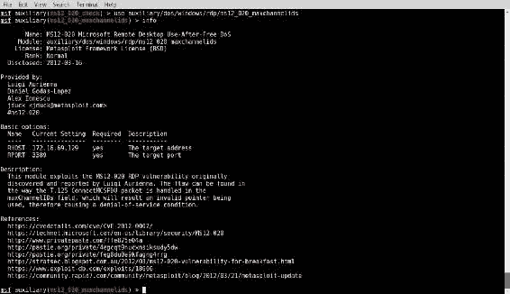
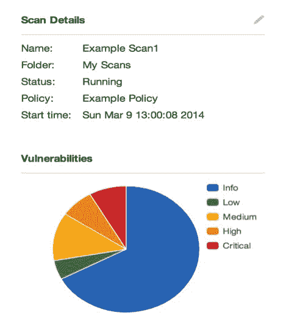

# 第六章：漏洞扫描

本章包含以下用于执行自动化漏洞扫描的配方：

+   使用 Nmap 脚本引擎进行漏洞扫描

+   使用 MSF 辅助模块进行漏洞扫描

+   使用 Nessus 创建扫描策略

+   使用 Nessus 进行漏洞扫描

+   使用 OpenVAS 进行漏洞扫描

+   使用 HTTP 交互验证漏洞

+   使用 ICMP 交互验证漏洞

# 介绍

虽然通过查看服务指纹识别结果并研究与已识别版本相关的漏洞来识别许多潜在漏洞是可能的，但这通常会耗费极大的时间。有一些更简化的替代方案，通常可以为您完成这项工作的很大一部分。这些替代方案包括使用自动化脚本和程序，通过扫描远程系统来识别漏洞。未经身份验证的漏洞扫描器通过向服务发送一系列独特的探测请求，试图获取指示漏洞存在的响应。相反，经过身份验证的漏洞扫描器会直接使用提供的凭据查询远程系统，获取关于已安装应用程序、运行的服务、文件系统和注册表内容的信息。

# 使用 Nmap 脚本引擎进行漏洞扫描

**Nmap 脚本引擎 (NSE)** 提供了大量的脚本，可以用于执行一系列自动化任务来评估远程系统。Kali 中可以找到的现有 NSE 脚本被分为多个不同的类别，其中之一是漏洞识别。

# 准备工作

要使用 NSE 执行漏洞分析，您需要有一个运行 TCP 或 UDP 网络服务的系统。在提供的示例中，使用了一个存在漏洞的 SMB 服务的 Windows XP 系统。有关如何设置 Windows 系统的更多信息，请参阅第一章中的 *安装 Windows Server* 章节，*入门*部分。

# 如何做到这一点…

要使用 Nmap 脚本引擎获取所有漏洞信息，请执行以下步骤：

1.  有许多不同的方法可以识别与任何给定 NSE 脚本相关的功能。最有效的方法之一是参考位于 Nmap 脚本目录中的 `script.db` 文件。要查看文件内容，可以使用 `cat` 命令，如下所示：


1.  `script.db` 文件是一个非常简单的索引，显示每个 NSE 脚本的文件名及其所属类别。这些类别是标准化的，便于使用 `grep` 查找特定类型的脚本。漏洞扫描脚本的类别名称为 `vuln`。要识别所有漏洞脚本，可以使用 `grep` 搜索 `vuln` 关键词，并通过 `cut` 命令提取每个脚本的文件名。以下是一个截断的输出示例：


1.  为了进一步评估前面列表中任何给定脚本的使用，可以使用 `cat` 命令读取与 `script.db` 文件位于同一目录中的 `.nse` 文件。由于大多数描述性内容通常位于文件的开头，建议将内容通过管道传输到 `more` 工具，这样就可以从上到下阅读该文件，如下所示：


1.  在提供的示例中，我们可以看到 `smb-vuln-ms10-054.nse` 脚本检查与 SMB 服务相关的远程内存损坏漏洞。在这里，可以找到漏洞的描述以及指向 **常见漏洞和暴露** (**CVE**) 编号的参考，CVE 编号可以在线查询以获取更多信息。继续阅读，你可以更深入地了解该脚本，如下所示：


1.  继续往下阅读，我们可以找到有关脚本特定参数、适当用法以及预期脚本输出的示例。需要特别注意的是，存在一个不安全的参数，可以设置为 `0`（未启用）或 `1`（启用）。这是 Nmap 漏洞脚本中的一个常见参数，理解它的使用非常重要。

1.  默认情况下，`unsafe` 参数的值设置为 `0`。当这个值被设置时，Nmap 不会执行可能导致拒绝服务攻击的测试。虽然这听起来是最优选择，但通常意味着许多测试的结果将不那么准确，甚至一些测试根本不会执行。为了进行更彻底和准确的扫描，建议启用 `unsafe` 参数，但这应仅在授权的测试窗口内对生产系统进行操作。要运行漏洞扫描，应使用 `nmap --script` 参数指定特定的 NSE 脚本，并通过 `nmap --script-args` 参数传递所有脚本特定的参数。

1.  此外，为了以最少的干扰输出运行漏洞扫描，Nmap 应配置为仅扫描与扫描服务对应的端口，如下所示：


1.  还有一个 NSE 脚本，我想特别提一下，因为它提供了关于漏洞扫描实践的重要教训。这个脚本是 `smb-vuln-ms10-061.nse`。可以通过使用 `cat` 命令查看脚本的内容，然后使用 `more` 命令分页阅读，从上到下查看脚本的详细信息：


1.  这个漏洞是 Stuxnet 蠕虫利用的四个漏洞之一。该脚本以安全的方式检查漏洞，且不会导致远程系统崩溃，因为这不是一个内存损坏漏洞。为了使检查生效，它需要访问远程系统上至少一个共享的打印机。默认情况下，它会尝试使用 LANMAN API 列举打印机，但在某些系统上默认情况下此 API 不可用。在这种情况下，用户应当指定打印机共享名称作为打印机脚本参数。为了查找打印机共享，可以使用`smb-enum-shares`。

1.  此外，在某些系统上，访问共享需要有效的凭证，这些凭证可以通过`smb`库的参数`smbuser`和`smbpassword`来指定。这个漏洞之所以有趣，是因为在实际利用之前，必须满足多个条件：

+   首先，系统必须运行其中一个受影响的操作系统（XP、Server 2003 SP2、Vista、Server 2008 或 Windows 7）。

+   第二，它必须缺少`MS10-061`补丁，该补丁修复了代码执行漏洞。

+   最后，系统上的本地打印共享必须是公开可访问的。有趣的是，可以审计远程 SMB 打印队列服务，以确定系统是否打了补丁，无论系统上是否存在现有的打印机共享。正因为如此，对于什么是脆弱系统的解读各有不同。有些漏洞扫描器会将未打补丁的系统标记为易受攻击，但实际上漏洞无法被利用。另一种情况是，像 NSE 脚本这样的漏洞扫描工具会评估所有必要条件，以确定系统是否容易受到攻击。

1.  在提供的示例中，扫描的系统没有打补丁，但它也没有远程打印机共享。请查看以下示例：


1.  在提供的示例中，Nmap 已经确认该系统不易受攻击，因为它没有远程打印机共享。虽然漏洞无法被利用，但有些人仍然认为漏洞存在，因为该系统没有打补丁，如果管理员决定共享打印机，这个漏洞就可以被利用。这就是为什么所有漏洞扫描工具的结果必须被评估，以充分理解它们的结果。

1.  一些扫描器会选择仅评估有限的条件，而另一些则会更为彻底。很难说哪种方法最合适。大多数渗透测试人员可能更倾向于被告知系统因环境因素而不易受攻击，这样他们就不会浪费大量时间尝试利用一个无法被利用的漏洞。

1.  另外，系统管理员可能更倾向于知道系统缺少`MS10-061`补丁，以便即使在现有条件下漏洞无法被利用，系统也能得到完全保护。

# 工作原理…

大多数漏洞扫描器通过评估不同的响应来尝试确定系统是否容易受到特定攻击的威胁。在某些情况下，漏洞扫描可能仅仅是与远程服务建立 TCP 连接，并通过自我披露的横幅识别已知的漏洞版本。在其他情况下，可能会向远程服务发送一系列复杂的探测和特别构造的请求，试图获取与特定攻击相关的独特响应。在提供的 NSE 漏洞脚本示例中，如果激活了`unsafe`参数，漏洞扫描实际上会尝试利用该漏洞。

# 使用 MSF 辅助模块进行漏洞扫描

类似于 NSE 中的漏洞扫描脚本，Metasploit 也提供了许多有用的漏洞扫描器。像 Nmap 的脚本一样，这些大多数都是相对有针对性的，用于扫描特定的服务。

# 准备工作

要使用 Metasploit 辅助模块进行漏洞分析，你需要一个正在运行 TCP 或 UDP 网络服务的系统。在提供的示例中，使用了一个 Windows XP 系统，且该系统有 RDP 服务。有关设置 Windows 系统的更多信息，请参阅第一章中*安装 Windows Server*的内容，*入门*部分。

# 如何执行…

让我们使用 MSF 辅助模块执行漏洞扫描：

1.  有多种不同的方法可以在 Metasploit 中识别漏洞扫描辅助模块。一种有效的方法是浏览到`/auxiliary/scanner`目录，因为大多数漏洞识别脚本都位于此目录下。请查看以下示例：


1.  这些脚本的布局相当标准化，任何给定脚本的描述可以通过使用`cat`命令从上到下阅读脚本，然后将输出通过 more 工具查看来识别。在提供的示例中，我们可以看到脚本测试了 MySQL 数据库服务中存在的身份验证绕过漏洞。或者，可以在 MSF 控制台界面中搜索漏洞识别模块。要打开此界面，应该使用`msfconsole`命令。

1.  然后可以结合特定与服务相关的关键词使用`search`命令，或者使用`scanner`关键词查询`auxiliary/scanner`目录下的所有脚本，如下所示：


1.  一旦识别出一个看起来有前景的脚本，可以使用 `use` 命令结合相对路径来激活该脚本。激活后，可以使用以下 `info` 命令来读取有关该脚本的更多详细信息，包括详情、描述、选项和参考文献：


1.  选择模块后，可以使用 `show options` 命令来识别和/或修改扫描配置。此命令将显示四个列标题：`Name`、`Current Setting`、`Required` 和 `Description`。`Name` 列标识每个可配置变量的名称。`Current Setting` 列列出任何给定变量的现有配置。`Required` 列标识是否需要为任何给定变量提供值。`Description` 列描述每个变量的功能。可以使用 `set` 命令并提供新值作为参数来更改任何给定变量的值，如下所示：


1.  在这种特定情况下，系统被发现存在漏洞。既然已识别出存在漏洞的系统，就有相应的利用模块可以实际对该漏洞系统造成拒绝服务攻击。在提供的示例中可以看到这一点：



# 它是如何工作的……

大多数漏洞扫描器通过评估多种不同的响应来判断系统是否容易受到特定攻击。在某些情况下，漏洞扫描可能仅仅是通过建立与远程服务的 TCP 连接并通过自我披露的横幅识别出一个已知的易受攻击的版本。其他情况下，可能会向远程服务发送一系列复杂的探测和特殊设计的请求，试图引发仅对易受特定攻击的服务产生的独特响应。在前面的示例中，很可能脚本的作者找到了通过请求生成仅由已修补或未修补的系统生成的独特响应的方法，然后将此作为判断任何给定远程系统是否可被利用的依据。

# 使用 Nessus 创建扫描策略

Nessus 是最强大且全面的漏洞扫描器之一。通过针对一个系统或一组系统，它将自动扫描所有可识别服务上的大量漏洞。可以在 Nessus 中创建扫描策略，以更细致地定义它所测试的漏洞类型和执行的扫描类型。本教程将解释如何在 Nessus 中配置独特的扫描策略。

# 准备工作

要在 Nessus 中配置扫描策略，首先需要在 Kali Linux 渗透测试平台上安装一个有效的 Nessus 副本。由于 Nessus 是一款授权产品，它并不会默认安装在 Kali 中。有关如何在 Kali 上安装 Nessus 的详细信息，请参考第一章中的*安装 Nessus 到 Kali Linux*一节，*入门*。

# 如何操作……

以下步骤将指导您使用 Nessus 创建扫描策略：

1.  要在 Nessus 中配置新的扫描策略，您首先需要访问 Nessus 的网页界面，网址为 `https://localhost:8834` 或 `https://127.0.0.1:8834`。如果您不是从运行 Nessus 的同一系统访问网页界面，则应指定适当的 IP 地址或主机名。

1.  一旦网页界面加载完成，您需要使用安装过程中配置的账户或安装后创建的其他账户登录。登录后，页面顶部的“Policies”选项卡应该被选中。如果没有配置其他策略，您将看到一个空列表，并有一个标有“New Policy”的按钮。点击该按钮开始构建您的第一个扫描策略。

1.  点击“New Policy”后，策略向导界面将弹出，显示多个预配置的扫描模板，这些模板可用于加速扫描策略的创建过程。正如您在下方截图中看到的，每个模板都包括名称，并附有简要的功能描述：


1.  在大多数情况下，至少有一个预配置的扫描配置会与您的目标相似。所有模板中最常用的可能是“Basic Network Scan”。请记住，选择任何一个选项后，您仍然可以修改现有配置的每个细节。它们只是为了帮助您更快地入门。或者，如果您不想使用现有模板，您可以向下滚动并选择“Advanced Scan”选项，这将允许您从头开始。

1.  如果选择任何一个预配置的模板，您将经过一个简单的三步过程来完成您的扫描配置。该过程总结如下：

    1.  第 1 步允许您配置基本信息，包括配置文件的名称、描述和可见性（公共或私人）。公共配置文件将对所有 Nessus 用户可见，而私有配置文件仅对创建它们的用户可见。

    1.  第 2 步将简单地询问扫描是内部扫描还是外部扫描。外部扫描是针对公开可访问主机进行的扫描，通常位于企业网络的 DMZ 区域。外部扫描不要求您在同一网络上，可以跨互联网执行。相反，内部扫描是在网络内部执行的，需要直接访问扫描目标的局域网（LAN）。

    1.  第三步，即最后一步，要求为扫描设备提供认证凭证，可以使用 SSH 或 Windows 认证。完成后，新配置的个人资料将出现在“配置文件”标签访问时显示的先前为空的列表中。如下图所示：


1.  这种方法使得创建新扫描配置文件快速而简便，但无法提供太多对测试漏洞和执行扫描类型的控制。要修改更详细的配置，点击新创建的策略名称，然后点击高级模式链接。在此配置模式下，选项非常全面和具体。屏幕左侧可以访问四个不同的菜单，其中包括：

+   一般设置：该菜单提供基本配置，详细的端口扫描选项，定义了如何进行发现和服务枚举的操作，并包含定义关于速度、限制、并行度等方面的性能选项。

+   凭证：该菜单允许配置 Windows 凭证、SSH、Kerberos，甚至多个明文协议选项（不推荐）。

+   插件：该菜单提供对 Nessus 插件的极为细致的控制。插件是 Nessus 中用于特定审计或漏洞检查的术语。你可以根据功能类型启用或禁用一组审计，甚至可以逐个调整特定插件。

+   偏好设置：该菜单涵盖了 Nessus 的所有较为晦涩的操作功能配置，如 HTTP 认证、暴力破解设置和数据库交互。

# 工作原理…

扫描策略定义了 Nessus 用来决定扫描如何进行的配置值。这些扫描策略可以简单到完成简单扫描向导设置所需的三步，也可以复杂到每个独特插件的定义，以及自定义认证和操作配置的应用。

# 使用 Nessus 执行漏洞扫描

Nessus 是目前最强大且最全面的漏洞扫描器之一。通过定位单个系统或一组系统，它将自动扫描所有可识别服务中的大量漏洞。一旦配置好扫描策略来定义 Nessus 扫描器的配置，该扫描策略可以用于对远程目标进行扫描评估。本教程将解释如何使用 Nessus 执行漏洞扫描。

# 准备工作

要在 Nessus 中配置扫描策略，首先必须在 Kali Linux 渗透测试平台上安装并运行功能正常的 Nessus 版本。因为 Nessus 是一款付费产品，所以 Kali 默认并不预装它。有关如何在 Kali 上安装 Nessus 的详细信息，请参考 第一章《入门》中的*在 Kali Linux 上安装 Nessus*一节。此外，在使用 Nessus 执行扫描之前，至少需要创建一个扫描策略。有关如何在 Nessus 中创建扫描策略的详细信息，请参考前面的章节。

# 如何操作...

让我们借助 Nessus 执行一个漏洞扫描：

1.  要在 Nessus 中开始一个新的扫描，首先需要确保屏幕顶部选择了“Scans”标签。如果之前没有运行过任何扫描，屏幕中间将显示一个空白列表。要执行初始扫描，你需要点击屏幕左侧的蓝色“New Scan”按钮，如下图所示：


1.  这将需要一些基本的配置信息。你将看到一系列字段，包括“Name”、“Policy”、“Folder”和“Targets”：

    +   “Name”字段仅作为唯一标识符，用于将扫描结果与其他扫描结果区分开来。如果你进行大量扫描，建议在扫描名称中尽量具体。

    +   第二个字段是“Policy”字段，它定义了扫描的所有详细信息。这个字段允许你选择要使用的扫描策略。如果你不熟悉扫描策略的工作原理，请参考前面的章节。任何已登录用户创建的公共或私有扫描策略都应显示在“Policy”下拉菜单中。

    +   “Folder”字段定义了扫描结果将被存放的文件夹。将扫描结果按文件夹进行组织，在你需要整理大量扫描结果时会非常有帮助。可以通过在主扫描菜单中点击“New Folder”来创建新的扫描文件夹。

    +   最后一个字段是“Targets”。这个字段定义了要扫描的系统。在这里，你可以输入单个主机的 IP 地址、一组 IP 地址、一个连续的 IP 地址范围、一个 CIDR 范围，或者一组 IP 范围。你也可以使用主机名，前提是扫描器能够通过 DNS 正确解析主机名为 IP 地址。

    +   最后，还有一个选项可以上传包含目标列表的文本文件，文件格式可以是上述任何一种，下面是相关截图：


1.  配置完扫描后，可以通过屏幕底部的“Launch”按钮执行扫描。扫描将立即添加到扫描列表中，并且结果可以实时查看，如下图所示：


1.  即使扫描正在运行，您也可以点击扫描名称并开始查看识别出的漏洞。颜色编码用于快速简便地识别漏洞数量及其严重程度，如下图所示：


1.  点击示例扫描后，我们可以看到正在扫描的两个主机。第一个指示扫描已完成，而第二个主机完成了 2%。漏洞列中显示的条形图显示了每个给定主机关联的漏洞数量。或者，您可以点击屏幕顶部的漏洞链接，以按发现的漏洞组织查找，并且可以看到每个漏洞被识别出的主机数量。

1.  在屏幕右侧，我们可以看到一个类似的饼图，但这个饼图对应于所有扫描的主机，如下图所示：



1.  此饼图还清晰定义了每种颜色的含义，从关键漏洞到信息详细信息。通过选择任何特定主机 IP 地址的链接，您可以查看为该主机识别出的具体漏洞信息。


1.  此漏洞列表标识了插件名称，通常提供对发现内容的简要描述和严重级别。作为渗透测试者，关键和高危漏洞通常是最具有前景的，尤其是如果您正在寻求在目标系统上实现远程代码执行。通过单击任何一个明显的漏洞，您可以获取有关该漏洞的大量信息，如下图所示：


1.  除了描述和修补信息之外，本页面还将提供进一步研究的替代来源，特别是（对于渗透测试者而言）显示是否存在漏洞利用的信息。本页面还经常指示可用漏洞是否为公开漏洞，或者是否存在于 Metasploit、CANVAS 或 Core Impact 等利用框架中。

# 工作原理...

大多数漏洞扫描器将通过评估多种不同的响应来操作，以尝试确定系统是否容易受到特定攻击的影响。在某些情况下，漏洞扫描可能仅是简单地与远程服务建立 TCP 连接，并通过自我披露的横幅标识已知的易受攻击版本。在其他情况下，可能会向远程服务发送复杂的一系列探针和特别制作的请求，以试图获得对特定攻击易受影响的服务唯一响应。Nessus 将大量测试序列化在一起，以尝试生成给定目标的完整攻击面的图像。

# 使用 OpenVAS 进行漏洞扫描

**开放漏洞评估系统**（**OpenVAS**）是一款免费的漏洞扫描和管理套件。OpenVAS 和 Nessus 相似；实际上，OpenVAS 是从 Nessus 的最后一个免费版本分支出来的。在本教程中，我们将介绍如何安装并使用 OpenVAS 执行扫描。

# 准备工作

要使用 OpenVAS 执行漏洞扫描，你需要有一个可供扫描的远程系统。在提供的示例中，我们使用了 Metasploitable2 的实例来执行此任务。有关如何设置 Metasploitable2 的更多信息，请参考第一章，*入门指南*。

# 如何操作...

以下步骤将引导你使用 OpenVAS 执行漏洞扫描：

1.  OpenVAS 并没有预装在 Kali Linux 上，但安装和运行它是一个简单的过程。首先，我们将使用 `apt-get` 命令安装该软件；当提示继续时，输入 `Y`：


1.  安装成功后，运行 `openvas-setup` 命令：


1.  设置过程中需要一些时间来配置并安装漏洞测试脚本。配置完成后，记下所创建的密码。在登录 OpenVAS Web 界面时需要使用此密码：


1.  一旦 OpenVAS 安装并配置完成，我们可以使用 `openvas-start` 命令启动它：


1.  现在，我们可以通过本地浏览器访问 OpenVAS Web 界面，地址是 `https://127.0.0.1:9392/`。我们可以使用 `admin` 作为用户名，以及在 `openvas-setup` 过程结束时收到的密码进行身份验证：


1.  成功认证后，你将看到 OpenVAS 仪表盘。在这里（如果有的话），你可以查看扫描和漏洞的统计信息。由于我们刚刚安装了 OpenVAS，目前没有数据可以显示。我们可以通过运行扫描来更改这一点。为此，进入顶部菜单中的 Scans（扫描）并选择 Tasks（任务）：


1.  在任务页面上，前往页面左上角的魔杖图标并选择任务向导：


1.  在任务向导界面，我们会被要求输入一个 IP 地址或主机名。对于我们的示例，我们将使用 Metasploitable2 机器的 IP 地址 `172.16.69.128`，然后点击开始扫描按钮：


1.  向导完成后，OpenVAS 将开始扫描分配的目标。执行各种扫描和测试时，可能需要一些时间。完成后，你应该能看到一个总结：


1.  要查看 OpenVAS 扫描结果，进入菜单中的 Scans（扫描）部分并选择 Results（结果）：


1.  在这里，您可以看到扫描结果。图表展示了按类别（高、媒介、低、日志）和 **常见漏洞评分系统** (**CVSS**) 显示的漏洞数量。根据图表，我们可以看到每个漏洞的列表、严重性以及其位置：


# 工作原理…

大多数漏洞扫描器通过评估不同响应的多种方式来判断系统是否容易受到特定攻击的影响。在某些情况下，漏洞扫描可能只是通过建立与远程服务的 TCP 连接，并通过自我披露的横幅来识别已知的漏洞版本。在其他情况下，可能会向远程服务发送一系列复杂的探测和特别设计的请求，尝试获取仅在特定攻击易受影响的服务上才会出现的响应。OpenVAS 将大量的测试序列结合在一起，尝试生成目标攻击面完整的图像。

# 使用 HTTP 交互验证漏洞

作为渗透测试员，任何漏洞利用的最佳结果是实现远程代码执行。然而，也有一些情况，我们可能只想确定远程代码执行漏洞是否可被利用，而不希望实际完成整个利用和后期利用过程。一种方法是创建一个 Web 服务器，记录交互并使用给定的漏洞利用代码执行，导致远程主机与 Web 服务器进行交互。这个示例将演示如何编写一个自定义脚本，通过 HTTP 流量验证远程代码执行漏洞。

# 准备工作

要通过 HTTP 交互验证漏洞，您需要有一个运行存在远程代码执行漏洞的软件的系统。此外，本部分还需要编写一个脚本，并将其保存到文件系统中，您可以使用如 Vim 或 GNU nano 这样的文本编辑器来完成。有关编写脚本的更多信息，请参阅 第一章 中的 *使用文本编辑器（Vim 和 GNU nano）* 章节，*入门*。

# 如何操作…

让我们通过 HTTP 交互来验证漏洞：

1.  在实际利用给定漏洞之前，我们必须部署一个 Web 服务器来记录与之的交互。可以通过以下简单的 Python 脚本来完成：

```
        #!/usr/bin/python

        import socket

        print "Awaiting connection...n"

        httprecv = socket.socket(socket.AF_INET, socket.SOCK_STREAM)
        httprecv.setsockopt(socket.SOL_SOCKET, socket.SO_REUSEADDR, 1)
        httprecv.bind(("0.0.0.0",8000))
        httprecv.listen(2)

        (client, ( ip,sock)) = httprecv.accept()
        print "Received connection from : ", ip
        data = client.recv(4096)
        print str(data)

        client.close()
        httprecv.close()

```

1.  提供的 Python 脚本使用 `socket` 库生成一个 Web 服务器，该服务器监听所有本地接口的 TCP 端口 `8000`。当收到来自客户端的连接时，脚本将返回客户端的 IP 地址和发送的请求。

1.  要使用此脚本验证漏洞，我们需要执行代码，使远程系统与托管的 Web 服务进行交互。但在执行此操作之前，我们需要使用以下命令启动我们的脚本：


1.  接下来，我们需要利用一个漏洞来实现远程代码执行。通过查看 Metasploitable2 盒子的 Nessus 扫描结果，我们可以看到运行中的 FTP 服务存在一个后门，通过提供包含笑脸符号的用户名即可触发——这可不是开玩笑！它实际上被包含在一个生产环境中的 FTP 服务里。为了尝试利用此漏洞，我们将首先使用适当的用户名连接到服务，如下所示：


1.  在尝试使用包含笑脸符号的用户名进行连接后，远程主机的 TCP 端口`6200`应该会打开一个后门。我们甚至不需要输入密码。相反，可以使用*Ctrl* + *C*退出 FTP 客户端，然后使用 Netcat 连接到已打开的后门，如下所示：


1.  在与开放端口建立 TCP 连接后，我们可以使用我们的脚本来验证是否能够执行远程代码。为此，我们尝试使用`wget`命令与 HTTP 检测服务器的 URL 进行连接。尝试执行此代码后，我们可以通过查看脚本输出，验证 HTTP 请求是否已被接收：


# 它是如何工作的…

该脚本通过识别来自远程主机的连接尝试来工作。通过执行使远程系统连接回我们监听服务器的代码，就可以验证通过利用特定漏洞是否可能进行远程代码执行。如果远程服务器上未安装`wget`或`curl`，可能需要采用其他方式来识别远程代码执行。

# 使用 ICMP 交互验证漏洞

作为渗透测试员，任何给定漏洞的最佳结果是实现远程代码执行。然而，也有一些情况，我们可能只是想确定远程代码执行漏洞是否可被利用，但并不想实际执行整个漏洞利用和后期利用过程。一种方法是运行一个记录 ICMP 流量的脚本，然后在远程系统上执行`ping`命令。本食谱将展示如何编写自定义脚本，以通过 ICMP 流量验证远程代码执行漏洞。

# 准备工作

要通过 ICMP 流量日志验证漏洞，您需要一个运行有可利用代码执行漏洞的远程系统。此外，本部分还需要编写脚本并使用文本编辑器（如 Vim 或 GNU nano）将其写入文件系统。如需了解如何编写脚本，请参阅第一章《入门》中的*使用文本编辑器（Vim 和 GNU nano）*部分。

# 如何操作…

使用 ICMP 交互执行漏洞验证操作：

1.  在实际利用某个漏洞之前，我们必须部署一个脚本来记录传入的 ICMP 流量。这可以通过使用 Scapy 的简单 Python 脚本完成，如下所示：

```
        #!/usr/bin/python

        import logging
        logging.getLogger("scapy.runtime").setLevel(logging.ERROR)
        from scapy.all import *

        def rules(pkt):
        try:
        if (pkt[IP].dst=="172.16.69.133") and (pkt[ICMP]):
          print str(pkt[IP].src) + " is exploitable"
        except:
          pass

        print "Listening for Incoming ICMP Traffic.
         Use Ctrl+C to stop listening"

        sniff(lfilter=rules,store=0)

```

1.  提供的 Python 脚本嗅探所有传入的流量，并标记任何针对扫描系统的 ICMP 流量源为漏洞。为了使用此脚本验证漏洞是否可以被利用，我们需要执行一些代码，迫使远程系统向我们的扫描系统发送 ping 请求。为了演示这一点，我们可以使用 Metasploit 启动一个远程代码执行漏洞。但在此之前，我们需要先启动我们的脚本，步骤如下：


1.  接下来，我们需要利用一个可以实现远程代码执行的漏洞。通过查看 Windows XP 机器的 Nessus 扫描结果，我们可以看到该系统易受`MS08-067`漏洞的攻击。为了验证这一点，我们将利用该漏洞，使用一个有效载荷来执行`ping`命令回传至扫描系统，步骤如下：


1.  在 Metasploit 中的漏洞利用配置为使用`windows/exec`有效载荷，该有效载荷在被利用的系统中执行代码。这个有效载荷被配置为向我们的扫描系统发送一个 ICMP 回显请求。执行后，我们可以通过查看仍在监听的原始脚本来确认漏洞利用是否成功，步骤如下：


# 工作原理…

该脚本通过监听来自远程主机的 ICMP 流量来工作。通过执行使远程系统向我们的监听服务器发送`echo`请求的代码，我们可以验证通过利用特定漏洞实现远程代码执行的可能性。
