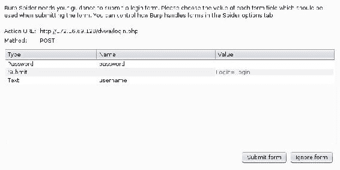

# 第八章：使用 Burp Suite 工作

在本章中，我们将探索以下步骤：

+   在 Kali Linux 上配置 Burp Suite

+   使用 Burp Suite 定义一个 Web 应用程序目标

+   使用 Burp Suite Spider

+   使用 Burp Suite 代理

+   使用 Burp Suite 参与工具

+   使用 Burp Suite Web 应用程序扫描器

+   使用 Burp Suite Intruder

+   使用 Burp Suite 比较器

+   使用 Burp Suite Repeater

+   使用 Burp Suite 解码器

+   使用 Burp Suite Sequencer

+   使用 Burp Suite 扩展程序

+   使用 Burp Suite Clickbandit

# 简介

Burp Suite 是一套集成工具，用于测试 Web 应用程序。虽然大多数工具在免费版本中都可用，但某些自动化和扫描功能需要专业版，这个升级的费用是非常值得的。个人而言，我认为它是测试 Web 应用程序时不可或缺的工具。

# 在 Kali Linux 上配置 Burp Suite

Burp Suite 代理是目前最强大的 Web 应用程序审计工具之一。但是，这并不是一个可以轻松启动的工具。必须修改 Burp Suite 应用程序和关联的 Web 浏览器中的配置，以确保彼此之间的正常通信。

# 准备工作

在 Kali Linux 中首次执行 Burp Suite 无需任何操作。免费版本是一个集成工具，已经安装好了。或者，如果选择使用专业版，可以在 [`pro.portswigger.net/buy/`](https://pro.portswigger.net/buy/) 购买许可证。

许可证价格相对较低，而且附加功能是非常值得的。但是，免费版本仍然非常有用，并且在用户的大多数核心功能中没有任何费用。

# 如何做…

让我们通过以下步骤在 Kali Linux 上配置 Burp Suite：

1.  Burp Suite 是一个 GUI 工具，需要访问图形桌面才能运行。因此，它不能通过 SSH 使用。在 Kali Linux 中启动 Burp Suite 有两种方法。您可以通过导航到应用程序菜单中的 Applications | Kali Linux | Top 10 Security Tools | burpsuite 来浏览到它。或者，您可以通过在 bash 终端中传递给 Java 解释器来执行它，如下所示：

```
 root@kali:~# java -jar /usr/bin/burpsuite

```

1.  当您启动 Burp Suite 时，将询问您是否要使用临时项目、磁盘上的新项目或打开现有项目。对于我们现在的目的，让我们使用默认的临时项目选项：


1.  当要求选择配置时，请选择使用 Burp 默认设置：


1.  一旦 Burp Suite 载入，确保代理监听器处于活动状态，并在所需端口上运行。在提供的示例中，使用 TCP 端口 `8080`。可以通过选择 Proxy 标签，然后在其下方选择 Options 标签来验证这些配置，如下面的截图所示：


在这里，你会看到所有代理监听器的列表。如果没有任何监听器，添加一个。要在 Kali Linux 中与 Mozilla Firefox 浏览器一起使用它，请将监听器配置为在`127.0.0.1`地址上的专用端口上监听。同时，确保激活“运行”复选框。在 Burp Suite 中配置完监听器后，你还需要修改 Mozilla Firefox 浏览器的配置，使流量通过代理转发。

1.  为此，点击侧边栏顶部的 Firefox 图标打开 Mozilla Firefox。打开后，展开下拉菜单，点击“偏好设置”以获得以下截图：


在 Mozilla Firefox 的偏好设置菜单中，点击菜单底部的“高级选项”按钮，然后选择“网络”标签。

1.  然后，点击“连接”标题下的“设置”按钮。这将弹出“连接设置”配置菜单，如下图所示：


默认情况下，代理单选按钮设置为“使用系统代理设置”。需要将其更改为“手动代理配置”。手动代理配置应该与 Burp Suite Proxy 监听器配置相同。在提供的示例中，HTTP 代理地址设置为`127.0.0.1`，端口值设置为 TCP `8080`。要捕获其他流量（如 HTTPS），请勾选“将此代理服务器用于所有协议”复选框。

1.  为了验证一切是否正常工作，尝试使用 Firefox 浏览器浏览一个网站，如下图所示：


1.  如果你的配置正确，你应该能看到浏览器尝试连接，但浏览器中不会显示任何内容。这是因为浏览器发送的请求被代理拦截了。代理拦截是 Burp Suite 中默认的配置。为了确认请求是否成功捕获，请返回到 Burp Suite 的代理界面，如下所示：


1.  在这里，你应该能看到捕获到的请求。为了继续使用浏览器进行其他操作，你可以通过点击“拦截已开启”按钮将其禁用，或者将浏览器中的代理设置更改回“使用系统代理设置”选项，仅在使用 Burp 时使用手动代理设置。

# 它是如何工作的…

在 Burp Suite 中进行的初始配置会在 TCP `8080`上创建一个监听端口。Burp Suite 使用这个端口来拦截所有的网页流量，并接收返回的响应流量。通过将 IceWeasel 浏览器的代理配置指向这个端口，我们表明浏览器中生成的所有流量都应该通过 Burp Suite Proxy。得益于 Burp 提供的功能，我们现在可以任意修改途中的流量。

# 使用 Burp Suite 定义 Web 应用目标

在执行渗透测试时，确保您的攻击只针对预定系统非常重要。攻击无意目标可能会导致法律责任。为了最小化这种风险，定义 Burp Suite 中的评估范围至关重要。在这个指南中，我们将讨论如何使用 Burp Suite 代理定义评估范围内的目标。

# 准备工作

要使用 Burp Suite 执行 web 应用程序分析，您需要有一个远程系统运行一个或多个 web 应用程序。在提供的示例中，使用了 Metasploitable2 实例来执行此任务。Metasploitable2 在 TCP 端口 `80` 上运行着多个预安装的易受攻击的 web 应用程序。有关设置 Metasploitable2 的更多信息，请参考 第一章 中的 *安装 Metasploitable2* 配方，*入门指南*。此外，您的 web 浏览器需要配置为将 web 流量通过 Burp Suite 的本地实例传输。

# 如何进行…

接下来的步骤将指导您使用 Burp Suite 进行 web 应用程序分析：

1.  Burp Suite 界面最左侧的标签是 Target（目标）。该标签下有两个子标签，分别是 Site map（站点地图）和 Scope（范围）。Site map 标签会随着通过代理的 web 浏览器访问内容而自动填充。Scope 标签允许用户配置站点和站点内容，以便将其包括或排除在评估范围之外。

1.  要将一个新站点添加到评估范围中，请点击“包括在范围内”表格下方的“添加”按钮。请查看以下截图：


1.  添加范围内的内容可以是一个 IP 地址范围，也可以是一个单独的文件。协议选项有一个下拉菜单，包含 ANY、HTTP 或 HTTPS 值。Host 或 IP 范围字段可以包括单一主机名、单一 IP 或 IP 地址范围。此外，Port 和 File 字段也有文本框。可以将这些字段留空，以限制范围的具体性。这些字段应使用正则表达式进行填写。

1.  在提供的示例中，插入符号用于打开每个正则表达式，美元符号用于关闭它们，反斜杠用于转义 IP 地址中句点的特殊含义。本书并不涉及正则表达式的使用，但互联网上有许多资源可以公开获取，以解释其用法。一个很好的网络入门教程是您可以用来熟悉正则表达式的 [`www.regular-expressions.info/`](http://www.regular-expressions.info/)。

# 它是如何工作的…

正则表达式逻辑上定义了何种条件下，给定的主机、端口或文件可被视为在范围内。定义 Burp Suite 中的评估范围会影响其与 web 内容交互时的操作方式。Burp Suite 的配置将决定哪些操作可以或不能在定义的范围内或范围外的对象上执行。

# 使用 Burp Suite 蜘蛛抓取

要有效地攻击 Web 应用程序，了解服务器上所有托管的 Web 内容是非常重要的。可以使用多种技术来发现 Web 应用程序的完整攻击面。一个可以快速识别目标 Web 页面中引用的关联内容的工具是蜘蛛工具。在本食谱中，我们将讨论如何使用 Burp Suite 来蜘蛛抓取 Web，识别范围内的内容。

# 准备工作

要使用 Burp Suite 执行针对目标的 Web 应用程序分析，您需要有一台运行一个或多个 Web 应用程序的远程系统。在提供的示例中，使用了 Metasploitable2 实例来执行此任务。Metasploitable2 上安装了多个预装的易受攻击的 Web 应用程序，运行在 TCP 端口`80`上。有关设置 Metasploitable2 的更多信息，请参见第一章中的*安装 Metasploitable2*食谱，*快速入门*部分。此外，您的 Web 浏览器需要配置为通过 Burp Suite 的本地实例代理 Web 流量。

# 如何操作…

让我们使用**Burp Suite Spider**进行 Web 应用攻击：

1.  要开始自动抓取您之前定义范围的 Web 内容，请点击屏幕顶部的蜘蛛选项卡。下面会有两个额外的选项卡，分别是控制和选项。

1.  **选项**选项卡允许用户定义蜘蛛抓取执行的配置，包括详细设置、深度、流量限制、表单提交等。考虑自动蜘蛛的配置非常重要，因为它会向所有在范围内的网页内容发送请求，这可能会对某些网页内容造成干扰甚至损害。

1.  配置完成后，可以选择**控制**选项卡开始自动蜘蛛抓取。默认情况下，蜘蛛选项卡是暂停的。点击指示按钮即可启动蜘蛛抓取。随着蜘蛛抓取的进展，**目标**选项卡下的站点地图将会自动更新。请查看以下截图：


1.  根据定义的配置，Burp Suite 可能会要求您与它在蜘蛛抓取过程中遇到的任何表单进行交互。为任何识别的表单输入参数，或者通过选择“忽略表单”按钮跳过表单，如下截图所示：



1.  或者，您也可以通过右键点击站点地图选项卡中的任何特定位置，然后点击“蜘蛛抓取此分支”来从该位置开始抓取。这样会递归地抓取所选对象及其包含的所有文件或目录。请查看以下截图：


# 它是如何工作的…

Burp Suite Spider 工具通过解析所有已知的 HTML 内容并提取到其他 Web 内容的链接来工作。然后分析这些链接内容，发现其中的更多链接内容。这个过程会无限进行，直到达到可用链接内容的数量、指定的深度层数以及处理额外请求的并发线程数为止。

# 使用 Burp Suite Proxy

尽管 Burp Suite 提供了许多工具，其主要功能是作为一个拦截代理。这意味着 Burp Suite 能够捕获请求和响应，并在将它们转发到目标之前进行修改。在本配方中，我们将讨论如何使用 Burp Suite Proxy 拦截和/或记录请求。

# 准备工作

要使用 Burp Suite 对目标执行 Web 应用分析，您需要一个运行着一个或多个 Web 应用的远程系统。在提供的示例中，使用了 Metasploitable2 实例来执行此任务。Metasploitable2 在 TCP 端口 `80` 上运行着几个预装的易受攻击的 Web 应用。有关设置 Metasploitable2 的更多信息，请参阅 第一章 中的 *安装 Metasploitable2* 配方，*入门*部分。此外，您的 Web 浏览器需要配置为通过本地实例的 Burp Suite 代理 Web 流量。

# 如何操作…

以下步骤将指导您使用 Burp Suite Proxy 拦截记录请求：

1.  Burp Suite Proxy 功能可以在被动或拦截模式下使用。如果拦截被禁用，所有请求和响应将仅在 HTTP 历史记录选项卡中记录。这些记录可以通过选项卡浏览，并通过从列表中选择，可以查看任何请求和/或响应的详细信息，如下图所示：


1.  另外，也可以点击 Intercept 按钮来捕获传输到目标服务器的流量。这些请求可以在 Proxy 选项卡中进行修改，然后转发到目标或丢弃。

1.  通过选择选项卡，可以重新配置拦截代理，定义拦截的请求类型，或甚至启用拦截响应，以便在它们呈现在浏览器中之前进行处理，如下图所示：


# 它是如何工作的…

Burp Suite Proxy 可以拦截或被动地记录来自附加浏览器的流量，因为它被逻辑配置为位于浏览器与任何远程设备之间。浏览器被配置为将所有请求发送到 Burp Proxy，然后 Proxy 将它们转发到任何外部主机。由于这种配置，Burp 可以在请求和响应传输过程中进行捕获，或者它可以记录所有进出客户端浏览器的通信。

# 使用 Burp Suite 进行 Web 应用分析

Burp Suite 还提供了多个可以用于基本信息收集和目标概况分析的工具。这些工具被称为**交互工具**。在本节中，我们将讨论如何使用 Burp Suite 中的辅助交互工具来收集或组织目标信息。

# 准备工作

要使用 Burp Suite 对目标进行 Web 应用程序分析，您需要一个远程系统，该系统运行着一个或多个 Web 应用程序。在提供的示例中，使用 Metasploitable2 实例来执行此任务。Metasploitable2 在 TCP 端口 `80` 上运行多个预安装的漏洞 Web 应用程序。有关设置 Metasploitable2 的更多信息，请参考第一章的 *安装 Metasploitable2* 部分，*入门指南*。此外，您的 Web 浏览器需要配置为通过本地的 Burp Suite 实例代理 Web 流量。

# 如何进行…

让我们使用 Burp Suite 中的辅助交互工具收集或组织目标信息：

1.  可以通过右键单击 Site map 选项卡中的任何对象，然后向下滚动到展开菜单并选择所需的工具来访问交互工具。默认情况下，选定的交互工具将递归地针对所选对象，涵盖其中所有文件和目录。请参考以下屏幕截图：


1.  我们将按照菜单中出现的顺序介绍每个交互工具。为了便于组织，我认为最好按照以下要点进行介绍：

    +   搜索：此工具可用于搜索术语、短语或正则表达式。它将返回包含查询术语的所有 HTTP 请求或响应。对于每个返回的条目，查询的术语将在请求或响应中被突出显示。

    +   查找评论：此工具将搜索指定网页内容中的所有 JavaScript、HTML 以及其他代码源，并定位所有评论。这些评论也可以导出以供以后查看。有时这非常有用，因为一些开发人员通常会在他们编写的代码的注释中留下敏感信息。

    +   查找脚本：此工具将识别 Web 内容中的所有客户端和服务器端脚本。

    +   查找引用：此工具将解析所有 HTML 内容并识别其他引用的内容。

    +   分析目标：此工具将识别指定网页内容中的所有动态内容、静态内容和参数。这对于组织测试具有大量参数和/或动态内容的 Web 应用程序尤其有用。

    +   发现内容：此工具可通过循环遍历词汇表和定义的文件扩展名列表来暴力破解目录和文件名。

    +   安排任务：此工具允许用户定义任务的开始和结束时间，并在 Burp Suite 中启动和停止各种任务。

    +   模拟手动测试：此工具提供了一种绝妙的方式，能让你看起来像是正在对 Web 应用程序进行手动分析，实际上你可能已经去喝咖啡和吃甜甜圈了。这个工具除了迷惑老板外，完全没有实际功能。

# 它是如何工作的…

Burp Suite 的参与工具以多种方式工作，具体取决于使用的工具。许多参与工具会执行搜索，并检查已收到的响应以查找特定类型的内容。Discover content 工具通过循环遍历定义的词汇列表，提供了通过暴力破解文件和目录名称来发现新的 Web 内容的功能。

# 使用 Burp Suite Web 应用扫描器

Burp Suite 也可以作为有效的 Web 应用漏洞扫描器。此功能可用于执行被动分析和主动扫描。在本教程中，我们将讨论如何使用 Burp Suite 执行被动和主动漏洞扫描。

# 准备工作

要使用 Burp Suite 对目标执行 Web 应用分析，你需要有一个远程系统，运行着一个或多个 Web 应用程序。在提供的示例中，使用了一个 Metasploitable2 实例来执行此任务。Metasploitable2 在 TCP 端口 `80` 上运行着多个预装的漏洞 Web 应用程序。有关设置 Metasploitable2 的更多信息，请参阅 第一章 中的 *安装 Metasploitable2* 部分，*入门指南*。

此外，你的网页浏览器需要配置为通过本地 Burp Suite 实例代理网页流量。

# 如何操作…

使用 Burp Suite 执行被动和主动漏洞扫描：

1.  默认情况下，Burp Suite 将在连接到代理时被动扫描所有通过浏览器访问的在范围内的网页内容。**被动扫描**一词是指 Burp Suite 被动观察与服务器之间的请求和响应，并检查这些内容是否有漏洞的证据。

1.  被动扫描不涉及注入任何探针或其他尝试确认怀疑漏洞的行为。请看以下截图：


1.  主动扫描可以通过右键单击“站点地图”选项卡中的任何对象，或右键单击“代理”选项卡下的 HTTP 历史记录选项卡中的任何请求，然后选择“主动扫描此分支”或“执行主动扫描”来进行，具体操作如以下截图所示：


1.  选择“主动扫描此分支”后，你将看到可以选择的扫描选项。选择你的偏好，点击“下一步”，然后你将看到一个待扫描内容的列表：


1.  所有主动扫描的结果可以通过选择扫描器下的“扫描队列”标签进行查看。双击任何特定的扫描条目，你可以查看与该扫描相关的特定发现，如下面的截图所示：


1.  主动扫描配置可以通过选择“选项”标签来操作。在这里，你可以定义执行的测试类型、执行速度以及测试的全面性。需要注意的是，扫描器将进行的测试类型：


# 它是如何工作的…

Burp Suite 的被动扫描器通过评估浏览器与其通信的任何远程服务器之间传输的流量来工作。这对于识别一些显而易见的漏洞非常有用，但不足以验证当前 Web 服务器上存在的许多更为严重的漏洞。主动扫描器通过向请求中识别的参数发送一系列探测来工作。这些探测可以用于识别许多常见的 Web 应用漏洞，如目录遍历、跨站脚本和 SQL 注入。

# 使用 Burp Suite Intruder

Burp Suite 中的另一个非常有用的工具是 Intruder 功能。此功能允许通过提交大量请求并在请求中操作预定义的有效载荷位置来进行快速攻击。在本章节中，我们将讨论如何使用 Burp Suite Intruder 自动化请求内容的操作。

# 准备工作

要使用 Burp Suite 对目标执行 Web 应用分析，你需要有一个远程系统运行一个或多个 Web 应用。在提供的示例中，使用了 Metasploitable2 实例来执行此任务。Metasploitable2 预装了几个脆弱的 Web 应用，并在 TCP 端口 `80` 上运行。有关设置 Metasploitable2 的更多信息，请参考 第一章中的 *安装 Metasploitable2* 章节，*入门指南*。此外，您的 Web 浏览器需要配置为通过本地实例的 Burp Suite 代理 Web 流量。

# 如何操作…

以下步骤将指导你使用 Burp Suite Intruder 自动化请求内容的操作：

1.  要使用 Burp Suite Intruder，需要从通过拦截获取的传输请求或代理历史记录中发送请求。使用这两种方式中的任何一种，右键点击请求，然后选择“发送到 Intruder”，如下面的截图所示：


1.  在提供的示例中，用户名和密码被输入到 DVWA 的暴力破解应用的登录门户中。发送到 Intruder 后，负载可以通过 Positions 标签进行设置。为了尝试暴力破解管理员账户，唯一需要设置的负载位置是密码参数的值，如下图所示：


1.  一旦定义了负载位置，就可以通过 Payloads 标签配置将要注入的负载。为了执行字典攻击，可以使用自定义字典列表或内置列表。在提供的示例中，使用内置的 Passwords 列表来执行攻击，如下图所示：


1.  配置好攻击后，可以点击屏幕顶部的“Start Attack”按钮。这将快速提交一系列请求，通过将列表中的每个值替换到负载位置。成功的尝试通常可以通过响应的变化来识别。

1.  为了确定是否有请求产生了明显不同的响应，可以通过长度对结果进行排序。可以通过点击“Length”表头来完成此操作。通过按降序对表格进行排序，我们可以发现有一个响应比其他响应更长。

1.  这是与正确密码相关的响应（密码恰好是`password`）。以下截图展示了这一点。成功的登录尝试将在接下来的步骤中得到进一步确认，讨论了如何使用 Comparer：


# 工作原理…

Burp Suite Intruder 通过自动化负载操作来工作。它允许用户在请求中指定一个或多个负载位置，并提供大量选项来配置这些负载位置在每次迭代时将如何改变所提供的值。

# 使用 Burp Suite Comparer

在进行 Web 应用评估时，能够轻松识别 HTTP 请求或响应的变化通常非常重要。Comparer 功能通过提供变化的图形化概览简化了这一过程。在本步骤中，我们将讨论如何使用 Burp Suite Comparer 识别和评估不同的服务器响应。

# 准备工作

要使用 Burp Suite 执行针对目标的 Web 应用程序分析，您需要一个远程系统，该系统正在运行一个或多个 Web 应用程序。在提供的示例中，使用了 Metasploitable2 实例来执行此任务。Metasploitable2 上预安装了多个易受攻击的 Web 应用程序，并且运行在 TCP 端口 `80` 上。有关设置 Metasploitable2 的更多信息，请参阅 第一章 中的 *安装 Metasploitable2* 章节，*入门*。此外，您的 Web 浏览器需要配置为通过本地实例的 Burp Suite 代理 Web 流量。

# 操作方法…

以下步骤将指导您使用 Burp Suite Comparer 识别和评估服务器响应的变化：

1.  对于一个一致响应中任何异常的例外情况，通常都值得进行调查。响应中的变化通常是有效载荷产生某些期望结果的有力迹象。

1.  在之前使用 Burp Suite Intruder 对 DVWA 登录进行暴力破解的演示中，特别有一个有效载荷生成的响应比其他所有响应都要长。

1.  要评估响应的变化，右键点击该事件，然后点击“发送到比较器（响应）”，如下面的截图所示。对其中一个控制示例也应进行相同的操作：


1.  将每个事件发送到 Comparer 后，可以通过选择屏幕顶部的 Comparer 标签来评估它们。确保为项目 1 选择了之前的一个响应，并为项目 2 选择了另一个响应，如下面的截图所示：


1.  在屏幕右下角，有一个选项可以选择比较单词或比较字节。在此特定情况下，选择“单词”选项。通过这样做，我们可以看到响应中修改的部分内容表明登录成功。任何已修改、删除或添加的内容都会在两个响应之间突出显示，并使得视觉比较变得非常容易，如下面的截图所示：


# 工作原理…

Burp Suite Comparer 通过分析任何两个内容来源之间的差异来工作。这些差异被识别为已被修改、删除或添加的内容。快速隔离内容中的变化对于确定特定操作对 Web 应用程序行为的不同影响是非常有效的。

# 使用 Burp Suite Repeater

在进行 Web 应用评估时，经常会遇到需要手动测试以利用特定漏洞的情况。捕获每一个响应、修改它，然后转发出去可能会变得非常耗时。Burp Suite 的 Repeater 功能通过允许对单个请求进行一致的操作和提交，而无需每次都在浏览器中重新生成流量，从而简化了这一过程。在本教程中，我们将讨论如何使用 Burp Suite Repeater 执行手动文本审计。

# 准备工作

要使用 Burp Suite 对目标进行 Web 应用分析，你需要拥有一台运行着一个或多个 Web 应用的远程系统。在提供的示例中，使用了 Metasploitable2 实例来执行此任务。Metasploitable2 在 TCP 端口`80`上运行着多个预安装的易受攻击的 Web 应用程序。有关设置 Metasploitable2 的更多信息，请参阅第一章中的*安装 Metasploitable2*章节，*入门*部分。此外，你的 Web 浏览器需要配置为通过 Burp Suite 的本地实例代理 Web 流量。

# 如何操作……

在以下步骤的帮助下，我们将使用 Burp Suite Repeater 执行手动文本审计：

1.  要使用 Burp Suite Repeater，需要从拦截过程中捕获的请求或代理历史中将请求发送到 Repeater。无论哪种方式，都可以右键点击该请求，然后选择“发送到 Repeater”，如下所示的屏幕截图所示：


1.  在提供的示例中，系统要求用户提供一个名称，并且服务器在 HTML 响应中返回了所提供的输入。为了测试是否存在跨站脚本攻击的可能性，我们应该首先注入一系列常见的攻击字符，如下所示的屏幕截图所示：


1.  在发送一系列字符后，我们可以看到所有字符都出现在 HTML 内容中，并且没有被转义。这是一个非常强烈的指示，表明该功能容易受到跨站脚本攻击。为了测试此漏洞的可利用性，我们可以输入标准的 token 请求 `<script>alert('xss')</script>`，如下所示的屏幕截图所示：


1.  通过查看返回的 HTML 内容，我们可以看到标记的开头 `<script>` 标签已从响应中剥离。这很可能表明存在黑名单，禁止在输入中使用 `<script>` 标签。黑名单的问题在于，它通常可以通过稍微修改输入来绕过。在这种情况下，我们可以尝试通过修改开头标签中的几个字符的大小写来绕过黑名单，如下所示的屏幕截图所示：


1.  通过使用 `<ScRiPt>` 标签，我们可以看到所施加的限制已被绕过，开闭标签都包含在响应中。这可以通过在浏览器中发出请求来确认，如下图所示：


1.  要在客户端浏览器中评估响应，右键点击请求并选择“浏览器中请求”。这将生成一个 URL，用于在已连接到 Burp Proxy 的浏览器中重新发出请求，如下图所示：


1.  我们可以手动复制提供的 URL 或通过点击复制按钮来复制该 URL。然后可以将此 URL 粘贴到浏览器中，浏览器将发出请求。假设跨站脚本攻击成功，客户端的 JavaScript 代码将在浏览器中渲染，并且屏幕上会出现一个警告框，如下图所示：


# 工作原理…

Burp Suite Repeater 通过提供基于文本的界面来与 Web 进行交互。Repeater 允许用户直接操作请求，而不是与 web 浏览器交互，这对于测试某些情况非常有用，这些情况的实际 HTML 输出比它在浏览器中的呈现方式更为关键。

# 使用 Burp Suite Decoder

在处理 web 应用程序流量时，您将经常遇到因混淆或功能性原因而被编码的内容。Burp Suite Decoder 允许根据需要对请求和响应内容进行解码或编码。在本示例中，我们将讨论如何使用 Burp Suite Decoder 对内容进行编码和解码。

# 准备工作

要使用 Burp Suite 对目标进行 web 应用程序分析，您需要有一个运行着一个或多个 web 应用程序的远程系统。在提供的示例中，使用了 Metasploitable2 实例来执行此任务。Metasploitable2 已经预装了多个易受攻击的 web 应用程序，并运行在 TCP 端口 `80` 上。有关如何设置 Metasploitable2 的更多信息，请参考 第一章 中的 *安装 Metasploitable2* 配方，*入门指南*。此外，您的 web 浏览器需要配置为通过 Burp Suite 的本地实例代理 web 流量。

# 如何操作…

让我们使用 Burp Suite Decoder 对内容进行编码和解码：

1.  要将给定值传递给 Burp Suite Decoder，请高亮显示所需的字符串，右键点击它，然后选择发送到解码器。在提供的示例中，`Cookie` 参数的值被发送到解码器，如下图所示：


1.  通过点击“智能解码”按钮，Burp Suite 会自动识别编码方式为 URL 编码，并在原本输入编码文本的区域下方进行解码，如下图所示：


1.  如果 Burp Suite 无法确定使用的编码类型，可以对多种不同类型的编码进行手动解码，包括 URL、HTML、Base64、ASCII 十六进制等。还可以使用解码器对输入的字符串进行编码，方法是使用“编码为...”功能。

# 它是如何工作的…

Burp Suite Decoder 提供了一个平台，用于在与 Web 应用程序交互时进行内容的编码和解码。此工具非常有用，因为在 Web 上经常使用多种编码类型来处理和混淆内容。此外，智能解码工具会检查任何给定输入中的已知模式或签名，以确定应用于内容的编码类型，然后对其进行解码。

# 使用 Burp Suite Sequencer

Web 应用程序的会话通常通过会话 ID 令牌来维护，这些令牌由随机或伪随机值组成。因此，随机性对于这些应用程序的安全性至关重要。在本节中，我们将讨论如何收集生成的值，并使用 Burp Suite Sequencer 测试它们的随机性。

# 准备开始

要使用 Burp Suite 对目标进行 Web 应用程序分析，您需要有一台运行一个或多个 Web 应用程序的远程系统。在提供的示例中，使用 Metasploitable2 实例来执行此任务。Metasploitable2 在 TCP 端口 `80` 上运行多个预安装的易受攻击的 Web 应用程序。有关如何设置 Metasploitable2 的更多信息，请参考 第一章中的 *安装 Metasploitable2* 章节，*入门指南*。此外，您的 Web 浏览器需要配置为通过本地实例的 Burp Suite 代理 Web 流量。

# 如何执行此操作…

让我们使用 Burp Suite Sequencer 测试生成值的随机性：

1.  要使用 Burp Suite Sequencer，必须向其发送包含 `Set-Cookie` 头部值或其他伪随机数值的响应进行测试。这可以通过代理选项卡下的 HTTP 历史记录标签发送，也可以通过在浏览器接收响应之前拦截响应发送，如下图所示：


1.  Burp 会自动将所有在响应中设置的 Cookie 值填充到 Cookie 下拉菜单中。或者，您可以使用自定义位置字段，然后点击配置按钮，指定响应中的任何位置进行测试，如下图所示：


1.  在定义要测试的值之后，点击“开始实时捕获”按钮。这将开始提交大量请求，以获取定义参数的其他值。在提供的示例中，Burp 将发出大量请求，其中 `PHPSESSID` 值从请求中剥离。

1.  这将导致服务器为每个请求生成一个新的会话令牌。通过这样做，我们可以获取一组值样本，这些值可以进行 FIPS 测试。这将包括一系列评估生成的伪随机数相关熵的测试。所有这些测试都可以以易于理解的图形格式表示，如下所示的截图所示：


1.  对于高精度和彻底的 FIPS 测试，需要总共 20,000 个值，但也可以用 100 个值进行分析。除了进行实时捕获，手动加载标签页还可以用于上传或粘贴待测试的值列表。

# 它是如何工作的…

Burp Suite Sequencer 对伪随机数样本进行多种不同的数学评估，试图确定它们生成时所使用的熵源质量。通过发出精心构造的请求，利用实时捕获可以生成样本值，这些请求将导致新的值被分配。通常通过从请求中删除现有的 cookie 值来完成这一操作，以便响应提供一个新的会话令牌，形式为新的`Set-Cookie`响应头。

# 使用 Burp Suite 扩展功能

Burp Suite 提供了一种通过 Burp Suite 扩展器扩展工具功能的方法。你可以通过用 Java、Python 或 Ruby 编写自己的扩展，或安装现有的扩展来实现这一点。本节将向你展示如何安装并使用后者。

如果你有兴趣构建自己的扩展，请参考[`portswigger.net/burp/extender/`](https://portswigger.net/burp/extender/)上的文档。

# 准备工作

要使用 Burp Suite 对目标进行 Web 应用程序分析，你需要有一台运行着一个或多个 Web 应用程序的远程系统。在提供的示例中，使用 Metasploitable2 实例来执行此任务。Metasploitable2 在 TCP 端口`80`上运行着多个预安装的漏洞 Web 应用程序。有关设置 Metasploitable2 的更多信息，请参考第一章中的*安装 Metasploitable2*部分，*入门指南*。此外，你的 Web 浏览器需要配置为通过本地实例的 Burp Suite 代理 Web 流量。

# 如何操作…

以下步骤将帮助你使用 Metasploitable2 进行 Web 应用程序分析：

1.  要安装 Burp Suite 扩展，首先我们需要进入扩展器标签页并点击 BApp 商店。在这里，有许多可以安装并使用的扩展：


1.  我们将来看看 Logger++扩展。如果我们选择它，我们可以看到它为 Burp 添加的额外功能描述。在这种情况下，该扩展可用于记录 Burp Suite 所有工具发出的请求和响应，并且还提供导出功能。要使用此扩展，我们首先点击“安装”按钮：


1.  安装完成后，您会注意到在 Burp 界面中出现了一个新的标签叫做 Logger++。如果我们点击它并进入选项，我们可以指定是否仅记录范围内的项目以及我们希望它捕获哪些工具。选择“仅范围内项目”：


1.  为了演示 Logger++的功能，我们将点击回目标标签并爬取`dvwa`目录：


1.  现在，如果我们回到 Logger++标签并点击查看日志，我们可以看到我们的请求。此外，如果我们想将这些请求保存为`.csv`文件，我们可以从选项界面进行操作：


# 它是如何工作的…

Burp Suite Extender 使我们能够通过预构建的扩展或利用 Burp Extender API 构建自己的扩展，为 Burp Suite 添加额外的功能和测试。

# 使用 Burp Suite Clickbandit

Burp Suite Clickbandit 提供了一种工具，帮助识别点击劫持攻击。点击劫持是指攻击者的网页利用透明层。当用户点击页面的某个地方，以为他们正在与看到的内容交互时，实际上他们可能在不知情的情况下点击了这些透明层。Burp 提供了一个很好的工具来帮助发现此类漏洞。

# 准备工作

要使用 Burp Suite 执行 Web 应用程序分析，您需要有一个远程系统运行一个或多个 Web 应用程序。在提供的示例中，使用 Metasploitable2 实例执行此任务。Metasploitable2 上预装了多个易受攻击的 Web 应用程序，这些应用程序运行在 TCP 端口`80`上。有关设置 Metasploitable2 的更多信息，请参阅第一章中的*安装 Metasploitable2*配方，“入门”部分。另外，您的 Web 浏览器需要配置为通过本地实例的 Burp Suite 代理 Web 流量。

# 如何操作…

以下步骤将指导您使用 Burp Suite Clickbandit 发现点击劫持：

1.  为了发现点击劫持请求，我们首先要查看 Burp Suite Scanner，因为它可以识别潜在易受点击劫持攻击的页面。这些页面通过“可框架响应（潜在的点击劫持）”的问题类型进行标识。在这种情况下，以下页面可能存在漏洞（`http://172.16.69.128/mutillidae/framing.php`）：


1.  选择相关问题后，我们上移到 Burp 菜单并选择 Burp Clickbandit，如下图所示：


1.  Burp 会呈现一个屏幕，描述需要执行的操作，并提供一个按钮，“复制 Clickbandit 到剪贴板”。点击它：


1.  接下来，我们打开浏览器并导航到潜在的易受攻击页面（`http://172.16.69.128/mutillidae/framing.php`）：


1.  在浏览器中，我们需要从菜单中打开开发者控制台并选择网页控制台：


1.  在页面底部，我们粘贴之前复制的 Clickbandit 代码，并按下*Enter*键：


1.  Clickbandit 将潜在易受攻击的页面嵌入。点击页面内部后，我们可以看到它实际上正在执行点击劫持攻击：


# 它是如何工作的…

Burp Suite 提供了一个工具，可以将目标网页嵌入并揭示点击劫持请求。
