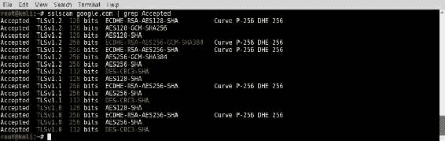
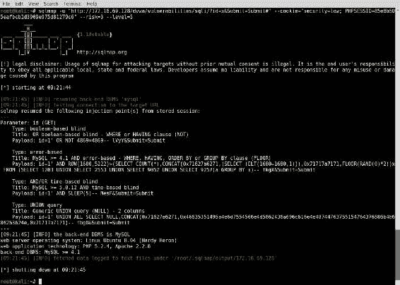
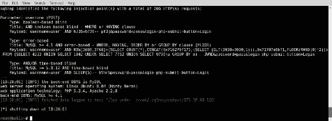
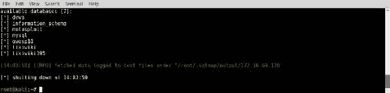
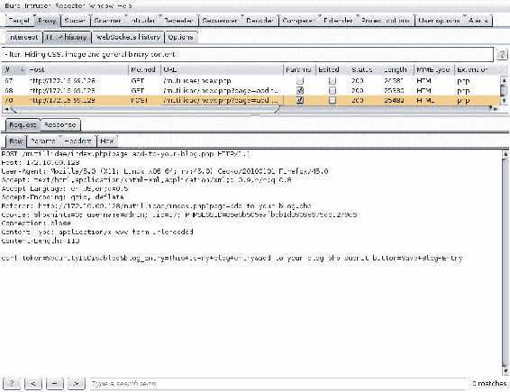

# 第九章：Web 应用扫描

本章包含以下用于执行 Web 应用程序漏洞扫描的食谱：

+   使用 Nikto 进行 Web 应用扫描

+   使用 SSLScan 进行 SSL/TLS 扫描

+   使用 SSLyze 进行 SSL/TLS 扫描

+   使用 sqlmap 进行 GET 方法 SQL 注入

+   使用 sqlmap 进行 POST 方法 SQL 注入

+   使用 sqlmap 捕获 SQL 注入

+   自动化 CSRF 测试

+   使用 HTTP 流量验证命令注入漏洞

+   使用 ICMP 流量验证命令注入漏洞

# 介绍

近年来，我们看到越来越多的媒体报道有关大型公司和政府数据泄露的事件，随着安全意识的普及，利用标准外围服务渗透一个组织的网络变得越来越困难。与这些服务相关的已知公开漏洞通常会迅速得到修补，攻击面变得非常小。相反，Web 应用程序通常包含自定义代码，这些代码通常不会像独立供应商的网络服务那样接受相同程度的公共审查。Web 应用程序通常是组织外围的薄弱环节，因此，对这些服务进行适当的扫描和评估至关重要。

在具体讨论每个食谱之前，我们将讨论一些关于 sqlmap 的常见信息。sqlmap 是 Kali Linux 中的一个集成命令行工具，通过自动化整个过程，大大减少了利用 SQL 注入漏洞所需的努力。sqlmap 通过提交一个包含大量已知 SQL 注入查询的请求列表来工作。它经过多年的高度优化，能够根据之前查询的响应智能地修改注入尝试。

# 使用 Nikto 进行 Web 应用扫描

Nikto 是 Kali Linux 中的一个命令行工具，可以用于评估 Web 应用程序的已知安全问题。Nikto 会通过目标应用程序进行爬取，并发送多个预配置的请求，尝试识别应用程序中可能存在的危险脚本和文件。在本部分中，我们将讨论如何使用 Nikto 对 Web 应用程序进行扫描，并如何解读扫描结果。

# 准备工作

要使用 Nikto 对目标进行 Web 应用分析，你需要一个远程系统，该系统正在运行一个或多个 Web 应用程序。在提供的示例中，使用 Metasploitable2 实例来执行此任务。Metasploitable2 在 TCP 端口`80`上运行多个预安装的易受攻击的 Web 应用程序。有关设置 Metasploitable2 的更多信息，请参考第一章中的*安装 Metasploitable2*部分，*入门*。

# 如何操作…

让我们使用 Nikto 进行 Web 应用扫描：

1.  运行 Nikto 的语法和使用复杂性主要取决于所扫描应用程序的性质。要查看该工具的用法和语法概览，可以使用 `nikto -help` 命令。

1.  在第一个提供的示例中，对 `google.com` 执行了扫描。`-host` 参数可以用来指定要扫描的目标的主机名值。`-port` 选项定义了 Web 服务运行的端口。`-ssl` 选项指示 Nikto 在扫描之前与目标 Web 服务器建立 SSL/TLS 会话，如下所示：


1.  另外，`-host` 参数也可以用来定义目标系统的 IP 地址值，以供扫描。`-nossl` 参数可以用来指示 Nikto 不使用任何传输层安全。

1.  `-vhost` 选项可用于指定 HTTP 请求中主机头的值。这在多个虚拟主机名托管在同一 IP 地址上的情况下尤其有用。请看下面的示例：


1.  在下面的示例中，执行了针对 Metasploitable2 系统上托管的 Web 服务的 Nikto 扫描。由于该 Web 服务托管在 TCP 端口 `80` 上，这是 Nikto 的默认扫描端口，因此没有使用 `-port` 参数。此外，由于默认情况下，Nikto 不会尝试通过端口 `80` 进行 SSL/TLS 连接，因此也没有使用 `-nossl` 参数：


1.  Nikto 扫描 Metasploitable2 网络服务的结果显示了一些经常被 Nikto 识别的项目。这些项目包括危险的 HTTP 方法、默认安装文件、暴露的目录列表、敏感信息泄露以及应限制访问的文件。了解这些文件在尝试获取服务器访问权限或识别漏洞时常常非常有用。

# 工作原理……

Nikto 通过引用 `robots.txt` 文件、爬取应用程序的表面以及循环检查已知包含敏感信息、易受攻击的内容或因内容和/或功能性质而应限制访问的文件列表，来识别潜在的有趣文件。

# 使用 SSLScan 进行 SSL/TLS 扫描

**SSLScan** 是 Kali Linux 中的一个集成命令行工具，可以用来评估远程网络服务的 SSL/TLS 支持的安全性。在本例中，我们将讨论如何对 Web 应用程序运行 SSLScan，并且如何解读和/或处理输出结果。

# 准备工作

要使用 SSLScan 对目标执行 SSL/TLS 分析，你需要拥有一台运行了启用 SSL 或 TLS 的 Web 服务的远程系统。在提供的示例中，我们使用 Google 和 Metasploitable2 实例的组合来执行此任务。有关如何设置 Metasploitable2 的更多信息，请参阅 第一章中的 *安装 Metasploitable2* 配方，*入门指南*。

# 如何操作…

以下步骤将指导你使用 SSLScan 执行 SSL/TLS 扫描：

1.  SSLScan 可以作为一个有效的工具，用于对目标 Web 服务器的 SSL/TLS 配置进行简化分析。要对具有注册域名的 Web 服务器执行基本扫描，只需将域名作为参数传递，如下所示：


1.  执行时，SSLScan 会快速循环通过与目标服务器的连接，并列出接受的加密算法、首选的加密套件和 SSL 证书信息。可以使用 `grep` 来限制输出为必要信息。在以下示例中，使用 `grep` 命令仅查看接受的加密算法：



1.  可以将多个 `grep` 函数通过管道连接在一起，以尽可能限制输出。通过使用多个管道 `grep` 请求，以下示例中的输出将限制为目标服务接受的 256 位加密算法：


1.  SSLScan 提供的一个独特功能是实现 SMTP 中的 STARTTLS 请求。这使得 SSLScan 可以通过使用 `--starttls` 参数，轻松有效地测试邮件服务的传输层安全性，并指定目标的 IP 地址和端口。

1.  在以下示例中，我们使用 SSLScan 来确定集成在 Metasploitable2 中的 SMTP 服务是否支持任何弱加密算法，并检查其是否存在 Heartbleed 漏洞：


# 它是如何工作的…

SSL/TLS 会话通常通过客户端和服务器之间的协商来建立。这些协商会考虑到每方的加密算法偏好，并尝试确定双方都支持的最安全的解决方案。SSLScan 通过循环遍历已知的加密算法和密钥长度列表，并使用每种配置尝试与远程服务器协商会话。这样，SSLScan 可以列出支持的加密算法和密钥。

# 使用 SSLyze 进行 SSL/TLS 扫描

**SSLyze** 是 Kali Linux 中的一个集成命令行工具，可以用来评估远程 Web 服务的 SSL/TLS 支持的安全性。在本配方中，我们将讨论如何运行 SSLyze 对 Web 应用进行扫描，以及如何解释和/或处理输出结果。

# 准备工作

要使用 SSLyze 对目标执行 SSL/TLS 分析，您需要有一个运行着启用 SSL 或 TLS 的 Web 服务的远程系统。在提供的示例中，结合了 Google 和 Metasploitable2 实例来执行此任务。有关设置 Metasploitable2 的更多信息，请参考 第一章 中的 *安装 Metasploitable2* 配方，*入门*。

# 如何操作…

让我们通过运行 SSLyze 对 Web 应用程序进行测试，来解释和操作输出结果：

1.  另一个执行全面扫描并分析目标服务的 SSL/TLS 配置的工具是 SSLyze。要执行 SSLyze 中的大多数基本测试，参数应包括目标服务器和 `--regular` 参数。这包括测试 SSLv2、SSLv3、TLSv1、重新协商、恢复、证书信息、HTTP GET 响应状态码以及压缩支持，如下所示：


1.  或者，可以仅测试单个版本的 TLS 或 SSL 来列举与该版本相关的支持的密码套件。在以下示例中，使用 SSLyze 列举支持的 TLSv1.2 密码套件，然后使用 `grep` 命令仅提取 256 位的密码套件：


1.  SSLyze 支持的一个非常有用的功能是测试 zlib 压缩。如果启用了该压缩，它与一种信息泄露漏洞直接相关，称为 **压缩比信息泄漏使得攻击变得简单**（**CRIME**）。可以通过以下 `--compression` 参数执行此测试：


# 它是如何工作的……

SSL/TLS 会话通常通过客户端和服务器之间的协商建立。这些协商会考虑每个端的配置密码套件偏好，并尝试确定双方都支持的最安全的解决方案。SSLyze 通过遍历已知的密码套件和密钥长度列表，并尝试使用每种配置与远程服务器协商会话，从而工作。这使得 SSLyze 能够列举支持的密码套件和密钥。

# 使用 sqlmap 进行 GET 方法 SQL 注入测试

Web 应用程序经常在提供的 URL 中接受参数。这些参数通常会通过 HTTP GET 方法请求返回给 Web 服务器。如果这些参数值随后被包含在对后端数据库的查询语句中，则可能存在 SQL 注入漏洞。在此配方中，我们将讨论如何使用 `sqlmap` 命令来自动化测试 HTTP GET 方法请求参数。

# 准备工作

要使用`sqlmap`执行针对目标的 SQL 注入，您需要有一个运行着一个或多个易受 SQL 注入攻击的 Web 应用程序的远程系统。在提供的示例中，使用了 Metasploitable2 实例来执行此任务。Metasploitable2 上预装了多个易受攻击的 Web 应用程序，运行在 TCP 端口`80`上。有关设置 Metasploitable2 的更多信息，请参阅第一章中的*安装 Metasploitable2*配方，*入门指南*。

# 如何操作……

让我们使用`sqlmap`命令测试 HTTP GET 方法的请求参数：

1.  要使用`sqlmap`测试 HTTP GET 方法的参数，您需要使用`-u`参数和要测试的 URL。该 URL 应包含任何 GET 方法的参数。

1.  此外，如果 Web 内容仅对已建立会话可访问，则应使用`--cookie`参数提供与该会话相对应的 Cookie 值，如下所示：



1.  在提供的示例中，使用了风险值`3`和级别值`5`。这些值分别定义了测试的风险性和彻底性。有关风险和级别的详细信息，请参考`sqlmap`的手册页或`help`文件。

1.  在运行此测试时，`sqlmap`快速识别出后台数据库为 MySQL，并跳过了其他测试。如果没有指定操作，`sqlmap`仅会确定是否有任何测试的参数存在漏洞，如前面的示例所示。

1.  经过一系列的注入尝试后，`sqlmap`确定`id`参数存在多种 SQL 注入漏洞。在确认漏洞后，可以在`sqlmap`中采取措施，开始从后台数据库中提取信息，如下所示：


1.  在提供的示例中，使用了`--dbs`参数列举了所有可通过 SQL 注入访问的数据库。从名称上看，似乎只有列出的一个数据库直接对应于 DVWA 应用程序。我们可以将后续操作集中在该数据库上。

1.  要提取 DVWA 数据库中所有表的表名，我们可以使用`--tables`参数指示`sqlmap`提取表名，然后使用`-D`参数指定要提取名称的数据库（`dvwa`），如下所示：


1.  通过这样做，我们可以看到 DVWA 数据库中有两个表。这些表包括`guestbook`和`users`。从数据库中的用户表中提取内容通常是值得的，因为这些表通常包含用户名和相关的密码哈希值。

1.  要提取已识别表中的内容，我们可以使用`--dump`参数，然后使用`-D`参数指定数据库，使用`-T`参数指定要提取内容的表，如下所示：


表及其内容的输出如下：


1.  在识别到表中的内容包含密码哈希时，`sqlmap`会提供使用集成密码破解器对枚举出的密码哈希执行字典攻击的选项。这可以通过使用内置的词汇表、自定义词汇表或一系列词汇表来完成。

1.  在执行字典攻击后，我们可以看到表中的内容，包括用户 ID、用户名、用户头像图片的位置、MD5 哈希、该哈希的附加明文值以及用户的名字和姓氏。

# 它是如何工作的……

Sqlmap 通过从大量已知的 SQL 注入查询列表中提交请求来工作。多年来，它已被高度优化，可以根据之前查询的响应智能地修改注入尝试。在 HTTP GET 参数上执行 SQL 注入就像修改通过请求 URL 传递的内容一样简单。

# 使用 sqlmap 进行 POST 方法 SQL 注入

Sqlmap 是 Kali Linux 中的一款集成命令行工具，能够显著减少手动利用 SQL 注入漏洞所需的工作量，通过自动化整个过程。在本食谱中，我们将讨论如何使用`sqlmap`命令自动化测试 HTTP POST 方法请求参数。

# 准备就绪

要使用`sqlmap`命令对目标执行 SQL 注入攻击，您需要有一个远程系统，该系统运行着一个或多个易受 SQL 注入攻击的 Web 应用程序。在提供的示例中，使用的是 Metasploitable2 实例来执行此任务。Metasploitable2 上安装了多个易受攻击的 Web 应用程序，运行在 TCP 端口`80`上。有关如何设置 Metasploitable2 的更多信息，请参阅第一章中的*安装 Metasploitable2*食谱，*入门指南*。

# 如何执行……

让我们使用`sqlmap`命令自动化测试 HTTP POST 方法请求参数：

1.  要对使用 HTTP POST 方法的服务执行 SQL 注入攻击，我们需要使用`--data`参数定义 POST 参数的字符串。

1.  Mutillidae 中的登录应用程序提供了一个登录界面，通过 POST 方法传输用户名和密码。这将是我们 SQL 注入攻击的目标。请看以下示例：


`sqlmap`的输出已被截断以节省空间，接下来我们可以看到`sqlmap`输出的继续内容，其中包括发现的漏洞：



1.  如果没有指定任何操作，`sqlmap`将仅仅确定所测试的参数是否存在漏洞，如前面的示例所示。经过一系列注入尝试，`sqlmap`已确定用户名 POST 参数容易受到布尔盲注和基于错误的注入技术的攻击。

1.  在确认漏洞后，可以在 `sqlmap` 中采取相应的操作，开始从后端数据库中提取信息，如下所示：


`sqlmap` 命令的输出已被截断。在下一个截图中，我们看到了更多命令输出内容，包括可用的数据库：



1.  在提供的示例中，使用了 `--dbs` 参数来列出所有可通过 SQL 注入访问的数据库。然后，我们可以直接针对特定数据库集中执行后续操作。

1.  要提取 `owasp10` 数据库中所有表格的表名，我们可以使用 `--tables` 参数来指示 `sqlmap` 提取表名，然后使用 `-D` 参数指定要从中提取表名的数据库（`owasp10`），如下所示：


`sqlmap` 命令的输出已被截断。在以下截图中，我们可以看到与 `owasp10` 数据库相关的表格：


1.  通过这样做，我们可以看到 `owasp10` 数据库中存在六个表格。这些表格分别是 `accounts`、`blog_table`、`captured_data`、`credit_cards`、`hitlog` 和 `pen_test_tools`。最引人注目的表格名可能是 `credit_cards`。

1.  要提取已识别表格中的内容，我们可以使用 `--dump` 参数，然后使用 `-D` 参数指定数据库，使用 `-T` 参数指定要提取内容的表格，如下所示：


`sqlmap` 命令的输出已被截断。在下一个截图中，我们看到 `owasp10` 数据库中 `credit_cards` 表格的内容：


# 工作原理……

`sqlmap` 命令通过提交来自已知 SQL 注入查询的大量请求来工作。它经过多年优化，能够根据先前查询的响应智能地修改注入尝试。在 HTTP POST 方法的参数上执行 SQL 注入是通过操控附加到 POST 方法请求末尾的数据来实现的。

# 请求使用 sqlmap 捕获 SQL 注入

为了简化使用 `sqlmap` 命令的过程，可以使用来自 Burp Suite 的捕获请求，并执行带有所有已定义参数和配置的 `sqlmap`。在本指南中，我们将讨论如何使用 `sqlmap` 来测试与提供的请求捕获相关的参数。

# 正在准备

要使用 `sqlmap` 执行 SQL 注入攻击，你需要一个远程系统，该系统运行着一个或多个易受 SQL 注入攻击的 Web 应用程序。在所提供的示例中，使用了 Metasploitable2 实例来执行此任务。Metasploitable2 在 TCP 端口 `80` 上运行着多个预安装的易受攻击的 Web 应用程序。有关设置 Metasploitable2 的更多信息，请参考 第一章 中的 *安装 Metasploitable2* 章节，*入门*。

# 如何操作……

以下步骤将指导你如何借助 `sqlmap` 命令捕获 SQL 注入攻击：

1.  要使用 `sqlmap` 进行请求捕获，首先必须将请求保存为文本格式。为此，在 Burp Suite 中右击请求内容，然后选择“复制到文件”。保存后，你可以通过浏览目录并使用 `cat` 命令来验证文件内容，如下所示：


1.  要使用请求捕获，请使用带有 `-r` 参数和文件绝对路径值的 `sqlmap`。这种方法通常大大减少了需要在 `sqlmap` 命令中提供的信息量，因为大部分原本需要提供的信息已包含在请求中。请查看以下示例：


1.  在所提供的示例中，不需要将 cookie 值传递给 `sqlmap`，因为 cookie 值已经在捕获的请求中识别出来。当启动 `sqlmap` 时，捕获中的 cookie 值将自动在所有请求中使用，如下所示：


1.  `sqlmap` 命令能够测试请求捕获中识别到的所有 GET 方法参数。在这里，我们可以看到 `id` 参数容易受到多种 SQL 注入技术的攻击。

# 它是如何工作的……

`sqlmap` 命令能够通过解析请求的内容并识别任何可测试的参数来接受捕获的请求。这使得可以在不需要额外努力转录执行攻击所需的所有参数的情况下启动 `sqlmap`。

# 自动化 CSRF 测试

**跨站请求伪造**（**CSRF**）是最常被误解的 Web 应用程序漏洞之一。尽管如此，未能正确识别此类漏洞可能对 Web 应用程序及其用户构成严重风险。在本教程中，我们将讨论如何测试 GET 和 POST 方法参数中的 CSRF 漏洞。

# 准备工作

要对目标进行 CSRF 测试，您需要有一个远程系统，运行一个或多个易受 CSRF 攻击的 Web 应用。在提供的示例中，使用了 Metasploitable2 实例来执行这项任务。Metasploitable2 上预装了多个易受攻击的 Web 应用，运行在 TCP 端口 `80` 上。有关如何设置 Metasploitable2 的更多信息，请参考 第一章中的 *安装 Metasploitable2* 配方，*入门* 部分。

# 如何操作…

接下来的步骤中，我们将自动化进行 CSRF 测试：

1.  CSRF 是一种可以在 GET 和 POST 方法的交易中都存在的漏洞。DVWA 提供了一个很好的 GET 方法 CSRF 漏洞的示例。该应用允许用户通过 GET 方法参数提交新密码两次来更新密码，如下所示：


1.  由于缺乏 CSRF 控制，利用这个漏洞非常容易。如果能够让 Web 应用的用户被诱导访问一个 URL，其中预设了 `password_new` 和 `password_conf` 参数的值，那么攻击者就能强制受害者将密码更改为攻击者指定的密码。

1.  以下 URL 就是这个漏洞利用的一个示例。如果受害者点击此链接，他们的密码将被更改为 `compromised`。

```
    http://172.16.69.128/dvwa/vulnerabilities/csrf/?
    password_new=compromised&password_conf=compromised&Change=Change#

```

1.  然而，利用 CSRF 漏洞通常并不像想象中那样简单。这是因为大多数开发者至少会足够关注安全，不会使用 GET 方法参数进行安全交易。一个很好的例子是 Mutillidae 应用程序中的博客功能，它易受 POST 方法 CSRF 攻击，具体如下所示：



1.  在之前的请求中，我们可以看到已认证用户提交的博客条目内容是通过 `blog_entry` POST 方法参数发送的。为了利用缺乏 CSRF 控制的漏洞，攻击者需要制作一个恶意网页，导致受害者提交所需的参数。以下是一个 POST 方法 CSRF 攻击的示例：


1.  恶意网页使用一个 HTML 表单，返回到易受攻击的服务器，表单中包含多个隐藏的输入字段，这些字段与 Mutillidae 应用程序中提交博客条目请求所需的输入字段相对应。此外，还使用了 JavaScript 来提交表单。所有这些操作将在受害者不进行任何操作的情况下发生。请看以下示例：


1.  要部署这些恶意网页内容，应将其移动到 Web 根目录。在 Kali Linux 中，默认的 Apache Web 根目录是 `/var/www/`。此外，确保 Apache2 服务正在运行。请查看以下截图：


1.  当一个已验证的受害者访问恶意页面时，受害者会被自动重定向到 Mutillidae 博客应用程序，并提交博客文章《HACKED》。

# 它是如何工作的…

CSRF（跨站请求伪造）发生的原因是请求最终是由受害者用户的会话发起的。这是一种利用受害者的浏览器与远程 web 服务之间建立的信任的攻击。在 GET 方法的 CSRF 攻击中，受害者被诱使访问一个 URL，该 URL 包含定义恶意交易条款的参数。在 POST 方法的 CSRF 攻击中，受害者被诱使浏览到一个 web 页面，该页面定义的参数随后会通过受害者的浏览器转发到易受攻击的服务器，执行恶意交易。无论哪种情况，交易都会执行，因为请求来自受害者的浏览器，而受害者的浏览器已经与易受攻击的应用程序建立了可信会话。

# 使用 HTTP 流量验证命令注入漏洞

命令注入可能是所有已知 web 应用程序攻击向量中最危险的。大多数攻击者试图利用漏洞，希望最终能找到在底层操作系统上执行任意命令的方法。命令执行漏洞提供了这种能力，无需额外的步骤。在本配方中，我们将讨论如何使用 web 服务器日志或自定义 web 服务脚本来确认命令执行漏洞。

# 准备工作

要使用 HTTP 请求确认对目标进行命令注入测试，你需要有一个远程系统，该系统运行着一个或多个易受命令注入攻击的 web 应用程序。在提供的示例中，使用了 Metasploitable2 实例来执行此任务。Metasploitable2 上有多个预安装的易受攻击的 web 应用程序，运行在 TCP 端口 `80` 上。有关设置 Metasploitable2 的更多信息，请参阅 第一章中的 *安装 Metasploitable2* 章节，*入门*。此外，本节还需要编写一个脚本，将其写入文件系统，可以使用像 Vim 或 GNU nano 这样的文本编辑器。有关编写脚本的更多信息，请参阅 第一章中的 *使用文本编辑器（Vim 和 GNU nano）* 章节，*入门*。

# 如何操作…

让我们使用 HTTP 流量验证命令注入漏洞：

1.  可以通过执行一些命令来验证 web 应用程序中的命令注入漏洞，这些命令将迫使后端系统与你拥有的 web 服务器进行交互。

1.  可以轻松检查日志，寻找易受攻击的服务器与其交互的证据。或者，可以编写一个自定义脚本，生成一个临时的 web 服务，监听外部连接并打印收到的请求。以下是一个 Python 脚本示例，它可以执行此操作：

```
        #!/usr/bin/python

        import socket

        httprecv = socket.socket(socket.AF_INET, socket.SOCK_STREAM)
        httprecv.setsockopt(socket.SOL_SOCKET, socket.SO_REUSEADDR, 1)
        httprecv.bind(("0.0.0.0",8000))
        httprecv.listen(2)

        (client, ( ip,sock)) = httprecv.accept()
        print "Received connection from : ", ip
        data = client.recv(4096)
        print str(data)

        client.close()
        httprecv.close()

```

1.  一旦脚本执行完毕，我们需要强制目标服务器与监听服务进行交互，以确认命令注入漏洞。DVWA 应用程序有一个 `ping` 工具，可以用来 ping 提供的 IP 地址。

1.  用户输入会直接传递给系统调用，并且可以被修改以执行底层操作系统中的任意命令。我们可以使用分号将多个命令连接起来，并跟随每个后续命令，如下截图所示：


1.  在提供的示例中，输入被用来 ping `127.0.0.1` 并执行对 `http://172.16.69.133:8000` 的 `wget` 请求。`wget` 请求对应的是临时监听的 Python 服务。提交输入后，我们可以通过查看脚本的输出，验证命令是否已经执行，如下所示：


1.  在这里，我们可以看到从目标 Web 服务器接收到了连接，并且用于访问 Web 服务的用户代理是 `wget`。如果 `wget` 未安装，`curl` 命令是另一种可以使用的替代方法。

# 它是如何工作的…

这个 Python 脚本用于确认命令注入漏洞，因为它证明了命令可以通过来自不同系统的注入有效负载从目标服务器执行。几乎不可能在注入有效负载到服务器的同时执行类似的请求。然而，即使有担心有效负载不是检测到的流量的真正来源，也可以通过多次尝试轻松消除误报的疑虑。

# 使用 ICMP 流量验证命令注入漏洞

命令注入可能是所有已知的 web 应用攻击向量中最危险的。大多数攻击者都试图利用漏洞，期望最终找到一种在底层操作系统上执行任意命令的方法。命令执行漏洞提供了这一能力，而无需任何额外的步骤。在这个教程中，我们将讨论如何编写自定义脚本来验证使用 ICMP 流量的远程代码执行漏洞。

# 准备工作

要使用 ICMP 回显请求确认对目标进行命令注入测试，您需要有一个远程系统，该系统运行着一个或多个易受命令注入漏洞的 Web 应用程序。在提供的示例中，使用了 Metasploitable2 实例来执行此任务。Metasploitable2 预安装了多个易受攻击的 Web 应用程序，这些应用程序运行在 TCP 端口`80`上。有关设置 Metasploitable2 的更多信息，请参阅第一章中的*安装 Metasploitable2*配方，*入门*部分。此外，本节将需要使用文本编辑器（如 Vim 或 GNU nano）编写脚本到文件系统中。有关编写脚本的更多信息，请参阅第一章中的*使用文本编辑器（Vim 和 GNU nano）*配方，*入门*部分。

# 如何操作…

在接下来的步骤中，我们将创建一个自定义脚本，通过 ICMP 流量验证远程代码执行漏洞：

1.  通过执行将强制后端系统向监听服务发送 ICMP 流量的命令，可以验证 Web 应用程序中的命令注入漏洞。接收到的 ICMP 回显请求可用于识别易受攻击的系统。以下是一个使用 Scapy 库的 Python 脚本示例，用于执行此操作：

```
        #!/usr/bin/python

        import logging
        logging.getLogger("scapy.runtime").setLevel(logging.ERROR)
        from scapy.all import *

        def rules(pkt):
        try:
        if (pkt[IP].dst=="172.16.69.133") and (pkt[ICMP]):
        print str(pkt[IP].src) + " is exploitable"
        except:
        pass

        print "Listening for Incoming ICMP Traffic. Use Ctrl+C
         to stop listening"

        sniff(lfilter=rules,store=0)

```

1.  在执行完 ICMP 监听器后，我们需要尝试从易受攻击的服务器向我们的监听服务发起 ICMP 回显请求。这可以通过向易受攻击的用户输入中注入`ping`命令来完成。

1.  在 Mutillidae 中，有一个易受攻击的函数，通过将用户输入传递到直接的系统调用来执行 DNS 枚举。可以通过使用分号将单独的 ping 请求附加到用户输入中，如下图所示：


1.  假设服务器易受命令注入攻击，Python 监听器应该显示 ICMP 回显请求已被接收，并且目标服务器可能存在漏洞，具体如下：


# 它是如何工作的…

这个 Python 脚本能够确认命令注入漏洞，因为它证明了通过来自不同系统的注入有效载荷，可以从目标服务器执行命令。虽然在注入有效载荷的同时执行类似请求的可能性极低，但即使担心检测到的流量不是由有效载荷引起的，通过多次尝试也可以轻松消除假阳性问题。
