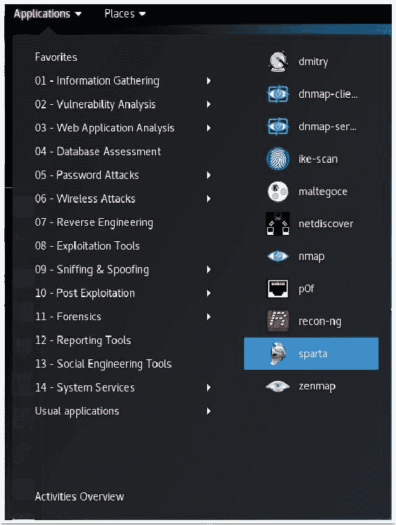
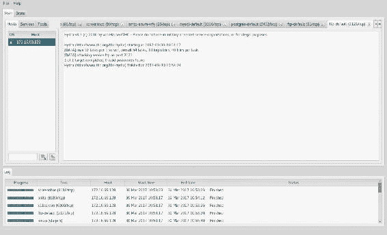
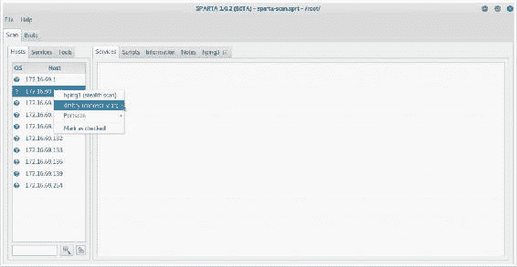
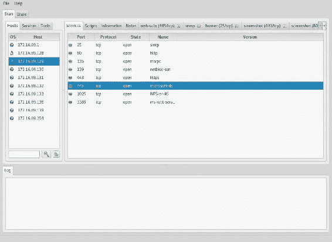

# 第十一章：使用 Sparta

Sparta 是一个集成了我们已涵盖的多个工具的侦察工具，提供一个统一的图形用户界面（GUI）。它包括 Nmap、Hydra、Nikto、Netcat 等工具。此外，Sparta 可以通过编辑 `sparta.conf` 文件来配置使用其他工具。以下是本章我们将讨论的内容：

+   使用 Sparta 进行信息收集

+   为 Sparta 创建自定义命令

+   使用 Sparta 进行端口扫描

+   使用 Sparta 进行指纹识别

+   使用 Sparta 进行漏洞扫描

+   使用 Sparta 进行 Web 应用扫描

# 使用 Sparta 进行信息收集

Sparta 默认提供了很多功能。在这个示例中，我们将查看 Sparta 界面，探索当您将主机添加到范围时 Sparta 默认的操作，查看 Sparta 使用的一些工具，并进行暴力破解密码。

# 准备工作

Sparta 已预装 Kali Linux 2。要使用它进行扫描，您需要有一个运行网络服务的远程系统。在提供的示例中，使用 Metasploitable2 实例来执行此任务。有关如何设置 Metasploitable2 的更多信息，请参考第一章，*入门指南*。

# 如何操作...

现在我们直接进入 Sparta：

1.  要开始，请导航到 应用程序 | 信息收集 | sparta：



1.  一旦 Sparta 启动，我们需要定义目标。在主机窗格中，选择点击此处添加主机到范围。对于我们的示例，我们将使用 IP 地址 `172.16.69.128`：


1.  点击“添加到范围”按钮后，扫描开始。首先，Sparta 将运行一个分阶段的 Nmap 扫描。分阶段的 Nmap 扫描实际上是一系列扫描，用于确定开放端口和运行的服务：


1.  随着扫描的进行，找到的服务将开始出现在右侧的服务窗口中，位于主机窗格的右侧。此外，Sparta 会尽可能识别特定的软件和版本：


1.  我们还可以通过点击服务窗格来查看找到的服务信息。如果我们扫描的是一个网络范围，并希望按服务而非主机列出找到的内容，这将更有用：


1.  在发现某些服务后，Sparta 会自动部署工具以收集进一步的信息。在以下截图中，当发现正在运行的 FTP 服务时，Sparta 启动了 Hydra，试图破解密码，如下图所示：


1.  如果发现了 Web 服务，它将运行 nikto。此外，它还会运行 screenshooter 来截取找到网站的截图：


1.  当我们查看 Sparta 所收集和组织的所有信息时，给人留下了深刻的印象。它已经找到了许多服务，并发现了大量服务的用户名和密码，包括 MySQL、PostgreSQL 和 FTP 服务。然而，它没有找到某个 FTP 服务的凭据；请查看以下屏幕截图：



1.  由于没有找到密码，我们来看看能否通过 Sparta 的暴力破解选项卡找到密码。如果点击该选项卡，我们可以配置 IP、端口和服务：


1.  我们还将使用用户名列表和密码列表。我们通过点击单选按钮并浏览到我们想要使用的列表来实现这一点。Kali 在`/usr/share/wordlists`目录下提供了一些很棒的词汇列表。我们将使用`/usr/share/wordlists/unix_users.txt`作为用户名列表，`/usr/share/wordlists/unix_passwords.txt`作为密码列表：


1.  一旦我们正确配置好，就会出现一个对话框；只需点击“运行”按钮，让它来完成工作。它会很快找到用户名/密码组合，并将其显示在屏幕上：


# 它是如何工作的...

Sparta 已经集成了许多工具，且它是将侦察结果整合到一个地方的绝佳方式。配置好范围后，它将扫描一个或多个主机的开放端口和服务。当发现某些服务时，还会使用其他工具进行扫描。

# 为 Sparta 创建自定义命令

在前面的示例中，我们看到 Sparta 开箱即用的功能。Sparta 的一个很棒的功能是可以添加其他工具。这些工具可以出现在上下文菜单中，结果可以在 Sparta 界面中汇总。在本示例中，我们将介绍如何自定义集成一个新工具。

# 准备工作

Sparta 预装了 Kali Linux 2。要使用 Sparta 执行扫描，您需要有运行网络服务的远程系统。在提供的示例中，使用了 Linux 和 Windows 系统的组合。有关在本地实验环境中设置系统的更多信息，请参阅第一章中的*安装 Metasploitable2*和*安装 Windows Server*部分，*入门指南*。

我们还将编辑 Sparta 的配置文件；请参阅第一章中的*使用文本编辑器（Vim 和 GNU nano）*部分，*入门指南*。

# 如何操作...

Sparta 是一个很棒的界面，可以在一个地方执行扫描并收集我们的信息。在开始之前，让我们对 Sparta 进行一些更改，以防止它自动运行所有工具。正如我们在前面的步骤中看到的，Sparta 会执行大量扫描，并根据它发现的内容启动多个工具。这种方式可能并非总是我们希望采用的，特别是当我们试图保持低调时。要进行这个更改，打开一个终端窗口并输入`vi /usr/share/sparta/sparta.conf`。

将行`enable-scheduler-on-import=True`更改为`enable-scheduler=False`并保存：


以下步骤将指导你创建自定义命令：

1.  要开始，请导航到“应用程序 | 信息收集 | sparta”：

1.  一旦 Sparta 启动，我们需要定义我们的目标。选择“点击此处添加主机到范围”。在我们的示例中，我们将使用`172.16.69.0/24`的 IP 范围。

1.  取消勾选“运行阶段性 nmap 扫描”。如果保持勾选，它将执行一系列 Nmap 扫描，识别端口和服务：

1.  在运行 Nmap 主机发现扫描后，我们可以在“主机”标签下看到已发现的 IP，如下图所示：


1.  现在我们有了一份已发现主机的列表，我们可以右键点击任何一台主机，查看接下来可以执行的操作菜单，如下图所示：


1.  在我们继续之前，让我们通过“文件 | 另存为”保存我们的 Sparta 会话。保存你的会话：

我们可以向 Sparta 中添加更多工具，只要它们以非交互模式运行。为了演示这一点，我们将把`fping`添加到 Sparta 包含的工具中。

在 Sparta 中，你可以定义三种类型的操作：

+   **主机**：主机操作是针对特定计算机的操作

+   **端口**：端口操作针对特定的端口或服务

+   **终端**：终端操作允许你从 Sparta 内启动一个终端

要添加一个操作，它需要按照以下格式进行定义：

`tool=label, command, services`

现在，让我们来看一下这些词的含义：

+   `tool`：这是我们正在添加的工具名称。

+   `label`：这是在 Sparta 的上下文菜单中显示的内容。

+   `command`：这是你在终端中运行工具时输入的内容。`command`工具使用以下占位符：`[IP]`、`[PORT]`和`[OUTPUT]`。这些变量将在运行时被替换为相应的值。

+   `services`：服务是工具将应用的 Nmap 服务名称列表。

现在让我们定义一个工具作为示例。以我们示例中的命令`fping`为例。这将是一个主机操作，因为`fping`用于检查主机是否在线。从命令行运行`fping`可能是类似`fping 172.16.69.130`的形式。

你应该看到类似以下截图的内容：


1.  现在，让我们将`fping`添加到 Sparta 中。打开一个终端窗口并输入以下命令：

```
        vi /usr/share/sparta/sparta.conf

```

你应该会看到类似以下的截图：


1.  现在，我们将向 Sparta 配置中添加一个工具。我们将在`[HostActions]`下定义`fping`，如下所示：

```
        fping=Run fping, fping [IP]

```

你会注意到，我们没有使用`[PORT]`或`[OUTPUT]`，因为`fping`不需要它们。同时，`services`在我们的定义中不需要，因为`fping`是一个主机操作。

1.  通过按*Esc*键保存文件，然后输入`:wq`并按*Enter*键。

1.  为了在 Sparta 中查看我们的新命令，我们需要重新启动服务。要关闭 Sparta，请转到“文件 | 退出”菜单选项。现在我们可以重新打开 Sparta。启动后，转到“文件 | 打开”菜单选项并加载之前保存的 Sparta 扫描。

1.  现在，当我们右键点击主机时，你会看到“运行 fping”，这是我们创建的主机操作。选择该选项，我们的`fping`命令将运行。你会注意到，Sparta 中会打开一个新标签，显示结果：


# 工作原理...

Sparta 已经集成了多个工具到其图形界面中，是将你的侦察工作整合到一个地方的绝佳方式。如果你有其他工具希望集成，可以通过修改配置并添加工具来扩展其功能。

# 使用 Sparta 进行端口扫描

Sparta 开箱即用地使用 Nmap 进行端口扫描。在本教程中，我们将讨论如何通过添加工具并自定义 Sparta 界面来执行端口扫描。

# 准备工作

Sparta 与 Kali Linux 2 一起预装。要使用 Sparta 执行扫描，你需要有运行网络服务的远程系统。在提供的示例中，使用了 Linux 和 Windows 系统的组合。有关在本地实验环境中设置系统的更多信息，请参阅第一章中的*安装 Metasploitable2*和*安装 Windows Server*教程，*入门*。

我们还将编辑 Sparta 的配置文件。请参阅第一章中的*使用文本编辑器（Vim 和 GNU nano）教程*，*入门*。

# 如何操作...

现在，让我们学习如何使用 Sparta 进行端口扫描：

1.  Sparta 使用 Nmap 执行端口扫描操作。我们可以通过右键单击主机并导航到“端口扫描”子菜单来看到这一点。我们可以使用多个 Nmap 扫描选项，这些选项也可以在`sparta.conf`文件中配置：


1.  如果我们想要添加其他选项与不同的工具一起使用，我们也可以这样做。我们从添加一个选项开始，使用`hping3`进行隐身扫描。关闭 Sparta 应用程序并打开一个终端窗口。在这里，让我们使用以下命令编辑 Sparta 配置文件：

```
 vi /usr/share/sparta/sparta.conf  

```

1.  现在让我们添加一个新的主机操作，定义为`hping3=hping3（隐身扫描），hping3 [IP] --scan 0-65535`。你应该会看到类似以下的截图：


1.  现在我们可以保存更改并重新打开 Sparta。现在，如果我们右键点击主机，就会看到新的主机操作：hping3（隐匿扫描）：


1.  点击此选项会对指定主机执行隐匿扫描。打开一个新标签，显示扫描结果：


1.  让我们添加一个端口扫描选项。再次关闭 Sparta 并编辑`/usr/share/sparta/sparta.conf`文件。这次，我们将添加一个主机操作选项，通过`dmitry`执行连接扫描。我们将主机操作配置如下：`dmitry-connect=dmitry (connect scan), dmitry -p [IP]`。然后，保存文件：


1.  现在，让我们重新启动 Sparta 并加载主机。我们再次看到一个新的主机操作：



1.  从我们的主机操作菜单中选择 dimitry（连接扫描），扫描就会启动。打开一个新标签，显示我们的连接扫描结果：


# 操作原理...

Sparta 的 GUI 中已集成了许多工具，是将您的侦察工作集中在一个地方的绝佳方式。默认情况下，Sparta 使用 Nmap 进行端口扫描。在本配方中，我们扩展了 Sparta 的功能，添加了`hping3`和`dmitry`。

# 使用 Sparta 进行指纹识别

我们发现过程中的下一步是指纹识别，这是我们在第五章中讨论过的内容，*指纹识别*。在进行指纹识别时，我们希望揭示更多关于操作系统和使用的服务软件的细节。Sparta 允许我们继续收集这些细节，并将它们保存在其界面中。

# 准备工作

Sparta 预装在 Kali Linux 2 中。要使用 Sparta 进行扫描，您需要确保远程系统正在运行网络服务。在提供的示例中，使用了 Linux 和 Windows 系统的组合。有关在本地实验室环境中设置系统的更多信息，请参阅第一章中的*安装 Metasploitable2*和*安装 Windows Server 配方*，*入门指南*。

我们还将编辑 Sparta 的配置文件；请参阅第一章中*使用文本编辑器（Vim 和 GNU nano）*的配方，*入门指南*。

# 操作步骤...

你会记得我们在第五章中讨论过指纹识别，*指纹识别*，在识别出主机和端口之后，我们希望继续收集有关操作系统和正在运行的服务的详细信息。Sparta 提供了一些很棒的预配置工具来帮助完成这项工作。举个例子，让我们来看一下右键点击服务时弹出的上下文菜单。在下面的示例中，我们正在检查一个 FTP 服务，并且我们有以下选项：打开 Telnet 会话、使用 Netcat 打开、抓取横幅等：


Sparta 会根据服务类型改变上下文菜单。在以下示例中，我们查看的是 HTTP 服务。因此，Sparta 向我们展示了一些与 Web 服务相关的新项目，如运行 nikto 和启动 dirbuster：


让我们配置一个新的主机操作，这将允许我们分析 SNMP。这将是一个主机操作，并显示在上下文菜单中。为了实现这一目标，我们按照以下步骤进行：

1.  如之前所述，我们关闭 Sparta 并使用 `vi /usr/share/sparta/sparta.conf` 命令编辑 Sparta 配置文件。在 `[HostActions]` 下，我们添加一个新项 `snmp=SNMPwalk, snmpwalk [IP] -c public -v 2c`：


1.  编辑完成后，保存并退出配置文件。

1.  现在，当我们启动 Sparta 并重新加载主机时，右键点击某个主机时，我们可以看到一个新的主机操作：


1.  如果我们运行 SNMPwalk，我们可以看到结果在新标签页中打开，如下图所示：


# 工作原理...

Sparta 已经集成了许多工具到其图形界面中，是将你的侦察工作整合到一个地方的极好方式。Sparta 使用 Nmap 收集指纹信息。在这个配方中，我们增加了 SNMPwalk 功能。

# 使用 Sparta 进行漏洞扫描

正如我们所见，Sparta 是一个非常适合进行侦察的工具，并将信息收集到一个中央仓库中。接下来，我们将看到如何将 Sparta 和 Nmap NSE 一起使用，扫描我们目标系统中的特定漏洞。

# 准备工作

Sparta 已预装在 Kali Linux 2 中。要使用 Sparta 进行扫描，你需要远程系统正在运行网络服务。在提供的示例中，使用了 Linux 和 Windows 系统的组合。有关在本地实验环境中设置系统的更多信息，请参见 第一章中关于*安装 Metasploitable2* 和 *安装 Windows Server* 的配方，*入门*部分。

我们还将编辑 Sparta 的配置文件，请参见 第一章中关于*使用文本编辑器（Vim 和 GNU nano）*的配方，*入门*部分。

# 如何操作...

现在，让我们学习如何使用 Sparta 进行漏洞扫描：

1.  为了添加新的端口操作，我们关闭 Sparta，再次使用 `vi` 编辑 Sparta 配置文件，命令为 `vi /usr/share/sparta/sparta.conf`。

1.  导航到`[PortActions]`部分，我们将添加一个新的操作。回到第六章，*漏洞扫描*，我们使用 Nmap NSE 检查 Stuxnet 蠕虫利用的四个漏洞中的一个。我们将在这里添加一个端口操作来运行这个检查。我们将定义`[PortAction]`为`smb-vuln=Check`，对于打印机后台程序伪装，`vuln, nmap -p[PORT] --script=smb-vuln-ms10-061 [IP] -vvvv`和`netbios-ssn,microsoft-ds`：


1.  保存配置文件，打开 Sparta，重新加载我们的 Sparta 项目。我们导航到其中一台 Windows XP 机器并查看可用服务。我们可以看到`445`端口是开放的，并且`microsoft-ds`服务可用。如果我们右键点击该服务，可以看到我们新定义的端口操作已经存在并可用：



1.  现在我们可以直接在 Sparta 界面中检查此漏洞。如果我们运行检查，新的标签页将被打开，并显示测试结果：


# 它是如何工作的...

Sparta 已经将许多工具集成到其图形用户界面中，是将侦察信息集中管理的绝佳方式。Sparta 非常可配置；在本教程中，我们添加了 Nmap NSE 命令的功能，以检查特定的漏洞。

# 使用 Sparta 进行 Web 应用扫描

Sparta 配备了多种工具，我们可以用来检查 web 服务。在接下来的教程中，我们将查看它的扫描功能。

# 准备开始

Sparta 配备了 Kali Linux 2。要使用 Sparta 执行扫描，您需要有运行网络服务的远程系统。在提供的示例中，使用了 Linux 和 Windows 系统的组合。有关在本地实验室环境中设置系统的更多信息，请参考第一章中的*安装 Metasploitable2*和*安装 Windows Server*教程，*入门*部分。

我们还将编辑 Sparta 的配置文件；请参考第一章中的*使用文本编辑器（Vim 和 GNU nano）*教程，*入门*部分。

# 如何操作...

Sparta 配备了多种已定义的端口操作用于 web 服务。如果我们右键点击 web 服务，可以看到列出可用的操作。在本教程中，我们将查看其中的一些端口操作：


+   运行 nikto：其中一个显著的选项是能够针对我们的目标 web 服务运行 Nikto。你应该还记得我们在第九章中讲解的 Nikto，*Web 应用扫描*，它会遍历目标应用并进行大量预配置的请求，尝试识别应用中可能存在的危险脚本和文件：


+   在端口上运行 nmap（脚本）：如果我们在端口上运行 Nmap 脚本，我们会得到一些横幅抓取，识别出 http-methods、http-server-header 和 http-title：


+   启动 dirbuster：我们还可以运行 dirbuster 和 OWASP 工具，它们将查找目标服务器上的目录和文件。如果我们点击启动 dirbuster，目标 URL 和端口会自动预配置。它可以进行纯暴力破解攻击，或者基于文件的列表进行攻击。在我们的示例中，我们将提供一个目录列表供它尝试。这个列表有很多可以在`/usr/share/wordlists/dirbuster/`目录下找到：


Dirbuster 可能需要一些时间来运行，主要取决于扫描类型和/或我们提供的字典列表的大小。一旦我们点击 Start，dirbuster 便开始检查，并在新标签页中报告它所发现的内容：


+   运行 whatweb：Whatweb 是由 Sparta 端口动作配置的，它为我们提供关于 Web 服务器、操作系统和语言的信息。Whatweb 非常强大，在审视其功能后，你可能会考虑创建自己的端口动作。要了解更多关于 whatweb 的信息，可以通过在终端输入`whatweb -h`来查看其帮助文档。在我们的示例中，我们将使用 Sparta 中配置好的 whatweb：


+   启动 webslayer：最后，你会在上下文菜单中看到使用 webslayer 的选项。不幸的是，webslayer 并未包含在 Kali Linux 2.0 发行版中。如果你尝试运行它，它会崩溃，以下是崩溃的截图：


# 它的工作原理...

Sparta 已经将多个工具集成到其图形用户界面（GUI）中，是将侦察工作整合到一个地方的绝佳方式。Sparta 预配置了许多优秀的工具用于分析 Web 应用程序。在本示例中，我们探讨了如何使用这些工具来测试已发现的 Web 服务。
