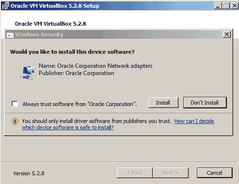
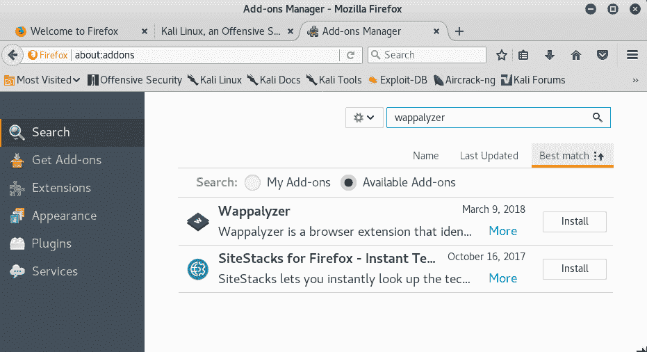
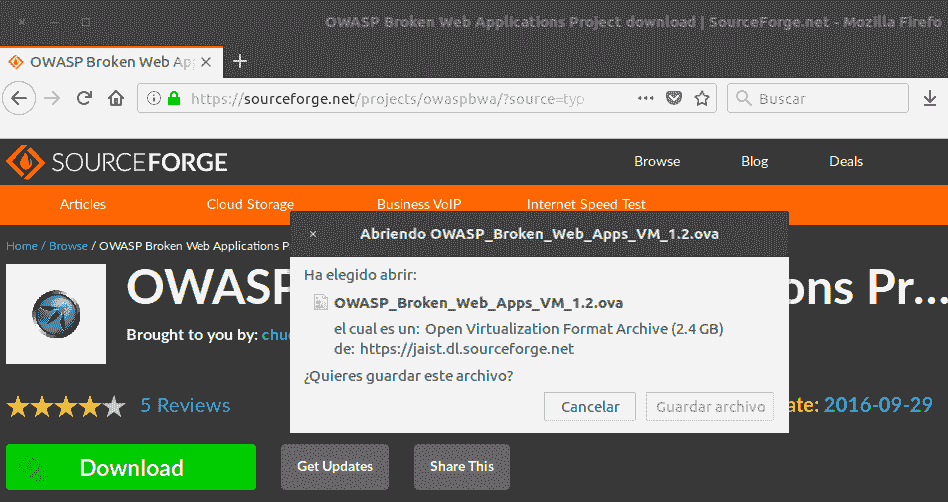

# 第一章：设置 Kali Linux 和测试实验室

在本章中，我们将涵盖：

+   在 Windows 和 Linux 上安装 VirtualBox

+   创建 Kali Linux 虚拟机

+   更新和升级 Kali Linux

+   配置 Web 浏览器以进行渗透测试

+   创建一个脆弱的虚拟机

+   创建客户端虚拟机

+   配置虚拟机以保证正确的通信

+   在脆弱的虚拟机上了解 Web 应用程序

# 简介

在本章的开始部分，我们将讲解如何准备我们的 Kali Linux 安装，以便能够跟随本书中的所有操作，并使用虚拟机设置一个含有脆弱 Web 应用程序的实验室。

# 在 Windows 和 Linux 上安装 VirtualBox

虚拟化或许是建立测试实验室或实验不同操作系统时最方便的工具，因为它允许我们在自己的计算机内运行多个虚拟计算机，而无需额外的硬件支持。

在本书中，我们将使用 VirtualBox 作为虚拟化平台，创建我们的测试目标以及 Kali Linux 攻击机。

在这第一个操作中，我们将展示如何在 Windows 和任何基于 Debian 的 GNU/Linux 操作系统（例如 Ubuntu）上安装 VirtualBox。

读者不需要安装这两个操作系统。本操作展示这两种选项的目的是为了完整性。

# 做好准备

如果我们使用的是 Linux 作为基础操作系统，在安装任何软件之前，需要更新软件仓库的信息。打开终端并输入以下命令：

```
# sudo apt-get update
```

# 如何操作……

以下步骤是安装 VirtualBox 所需的：

1.  要在任何基于 Debian 的 Linux 系统上安装 VirtualBox，我们只需打开终端并输入以下命令：

```
# sudo apt-get install virtualbox
```

1.  安装完成后，我们可以通过导航菜单找到 VirtualBox。

    通过应用程序 | 附件 | VirtualBox 来打开。或者，我们也可以通过终端调用它：

```
# virtualbox
```

如果你使用的是 Windows 机器作为基础系统，请跳至*第 3 步*。

1.  在 Windows 上，我们需要从 [`www.virtualbox.org/wiki/Downloads`](https://www.virtualbox.org/wiki/Downloads) 下载 VirtualBox 安装程序。


1.  下载文件后，我们打开它并开始安装过程。

1.  在第一个对话框中，点击“下一步”，并按照安装流程进行操作。

1.  我们可能会被要求安装来自 Oracle 公司的网络适配器；我们需要安装这些适配器，以确保虚拟机中的网络正常工作：



1.  安装完成后，我们只需从菜单中打开 VirtualBox：


1.  现在 VirtualBox 已经启动，我们准备好设置虚拟机来创建自己的测试实验室。

# 它是如何工作的……

VirtualBox 将允许我们通过虚拟化在计算机内部运行多台机器。借助此功能，我们可以在并行运行的不同计算机中装载完整实验室，使用不同的操作系统，并根据主机的内存资源和处理能力运行它们。

# 还有更多...

VirtualBox 扩展包为 VirtualBox 的虚拟机提供额外功能，如 USB 2.0/3.0 支持和远程桌面功能。可以从 [`www.virtualbox.org/wiki/Downloads`](https://www.virtualbox.org/wiki/Downloads) 下载。下载完成后，只需双击即可，VirtualBox 将完成其余操作。

# 另请参阅

还有其他一些虚拟化选项可供选择。如果您不习惯使用 VirtualBox，可以尝试以下选项：

+   VMware Player/Workstation

+   QEMU

+   Xen

+   **基于内核的虚拟机**（**KVM**）

# 创建 Kali Linux 虚拟机

Kali 是 Offensive Security 构建的 GNU/Linux 发行版，专注于安全和渗透测试。它预装了众多工具，包括安全专业人员用于逆向工程、渗透测试和法证分析的最流行的开源工具。

我们将在本书中始终使用 Kali Linux 作为攻击平台，并在此步骤中从头开始创建虚拟机并在其中安装 Kali Linux。

# 准备就绪

可以从其官方下载页面 [`www.kali.org/downloads/`](https://www.kali.org/downloads/) 获取 Kali Linux。对于本教程，我们将使用 64 位镜像（页面上的第一个选项）。

# 如何操作...

在 VirtualBox 中创建虚拟机的过程非常简单；让我们看一下并执行以下步骤：

1.  要在 VirtualBox 中创建新的虚拟机，我们可以使用主菜单，Machine | New，或点击“新建”按钮。

1.  新对话框将弹出；在这里，我们选择虚拟机的名称、类型和操作系统的版本：


1.  接下来，我们需要为这台虚拟机设置内存大小。Kali Linux 至少需要 1 GB；我们将为我们的虚拟机设置 2 GB。这个值取决于您系统的资源。

1.  点击“下一步”进入硬盘设置。选择“现在创建虚拟硬盘”并点击“创建”，VirtualBox 将在我们的主机文件系统中创建一个新的虚拟磁盘文件：


1.  在下一个屏幕上，选择以下选项：

    +   动态分配：这意味着该虚拟机的磁盘映像将随着我们在虚拟系统中添加或编辑文件而增长（事实上，它将添加新的虚拟磁盘文件）。

    +   对于硬盘文件类型，请选择 VDI（VirtualBox 磁盘映像）并点击“下一步”。

    +   接下来，我们需要选择文件存储在宿主机文件系统中的位置以及它们的最大大小；这是虚拟操作系统的存储容量。我们保持默认位置不变，选择`35.36 GB`的大小。这个大小取决于你的主机资源，但至少应该有 20GB，以便安装所需的工具。现在，点击创建：


1.  虚拟机创建完成后，选择它并点击设置，然后进入存储，选择控制器：IDE 下的 CD 图标。在属性面板中，点击 CD 图标，选择“选择虚拟光盘文件”，浏览到从官方网站下载的 Kali 镜像文件。然后点击确定：


1.  我们已经创建了一个虚拟机，但还需要安装操作系统。启动虚拟机，它将使用我们配置的 Kali 镜像作为虚拟 CD/DVD 进行启动。使用箭头选择图形化安装并按*Enter*：


1.  我们现在开始安装过程。在接下来的屏幕中，选择系统的语言、键盘布局、主机名和域名。

1.  之后，系统会要求你设置 Root 密码；root 是 Unix 系统中的管理员账号，是所有权限最强的用户，在 Kali 中是默认的登录账号。设置密码，确认后点击继续：


1.  接下来，我们需要选择时区，然后配置硬盘；我们将使用全盘引导设置：


1.  选择你想要安装系统的磁盘（应该只有一个）。

1.  下一步是选择分区选项；我们将选择“所有文件在一个分区”。

1.  接下来，我们需要通过选择“完成分区并写入磁盘更改”并点击继续来确认设置。然后选择“是”以写入更改，并在下一屏点击继续。这将开始安装过程：


1.  安装完成后，安装程序会要求你配置包管理器。选择“是”以使用网络镜像并设置代理配置；如果你不使用代理连接到互联网，可以留空。

1.  最后一步是配置 GRUB 启动器：只需选择“是”，然后在下一屏幕中从列表中选择硬盘。接着，点击继续，安装就完成了。

1.  在“安装完成”窗口中点击继续以重启虚拟机。

1.  当虚拟机重启时，它会要求你输入用户名；输入`root`并按*Enter*。然后输入你为 root 用户设置的密码进行登录。现在，Kali Linux 已经安装完毕。

# 它是如何工作的……

在这个步骤中，我们在 VirtualBox 中创建了我们的第一个虚拟机，设置了基础操作系统与其共享的内存量，并为虚拟机创建了一个新的虚拟硬盘文件并设置了最大大小。我们还配置了虚拟机从 CD/DVD 镜像启动，然后按照我们在物理计算机上安装 Kali Linux 的方式进行安装。

为了安装 Kali Linux，我们使用了图形化安装程序并选择了引导式磁盘分区，即当我们安装操作系统，特别是基于 Unix 的操作系统时，我们需要定义系统的各个部分安装（或挂载）在哪些硬盘分区上；幸运的是，Kali Linux 的安装程序可以自动处理这个问题，我们只需要选择硬盘并确认推荐的分区设置。我们还配置了 Kali 使用网络仓库来管理软件包，这样就能从互联网安装和更新软件，保持系统的最新状态。

# 还有更多...

有多种方法（而且更简单）可以在虚拟机中运行 Kali Linux。例如，可以从 Offensive Security 网站下载预构建的虚拟机镜像：[`www.offensive-security.com/kali-linux-vm-vmware-virtualbox-hyperv-image-download/`](https://www.offensive-security.com/kali-linux-vm-vmware-virtualbox-hyperv-image-download/)。我们选择了这种方法，因为它涵盖了从头开始创建虚拟机并安装 Kali Linux 的完整过程。

# 更新和升级 Kali Linux

在开始测试我们的 Web 应用安全性之前，我们需要确保拥有所有必要的、最新的工具。这个步骤涵盖了维护最新 Kali Linux 工具及其最新版本的基本任务。我们还将安装 Web 应用测试的元包。

# 如何操作...

一旦你有了一个正在运行的 Kali Linux 实例，执行以下步骤：

1.  以 root 用户身份登录 Kali Linux；然后打开终端。

1.  运行 `apt-get update` 命令。这将下载可供安装的更新包列表（应用程序和工具）：


1.  更新完成后，运行 `apt-get full-upgrade` 命令，将系统更新到最新版本：


1.  当提示是否继续时，按 `Y` 然后按 *Enter*。

1.  现在，我们的 Kali Linux 已经更新完毕，准备继续进行。

1.  虽然 Kali 自带了很多预安装的工具，但仍有一些工具包含在其软件仓库中，但默认并未安装。为了确保我们拥有进行 Web 应用渗透测试所需的一切，我们通过输入`apt-get install kali-linux-web`命令来安装 `kali-linux-web` 元包：


1.  我们可以在应用菜单中的 03 - Web 应用分析下找到我们已安装的工具：


# 它是如何工作的...

在这个教程中，我们介绍了如何在基于 Debian 的系统（例如 Kali Linux）中使用标准软件管理器`apt`进行包更新的基本步骤。第一次调用`apt-get`并使用`update`参数时，下载了针对我们特定系统在配置的仓库中可用的最新包列表。由于 Kali Linux 现在是一个滚动更新的发行版，这意味着它会持续更新，并且版本之间没有中断；`full-upgrade`参数会下载并安装系统（例如内核和内核模块）以及非系统包的最新版本。如果没有进行重大更改，或者我们只是想保持已经安装的版本最新，我们可以使用`upgrade`参数。

在本教程的最后，我们安装了`kali-linux-web`元包。`apt`的元包是一个可安装的软件包，它包含许多其他软件包，因此我们只需安装一个包，所有包含的包都会被安装。在这种情况下，我们安装了 Kali Linux 中所有的网页渗透测试工具。

# 为渗透测试配置网页浏览器

大多数网页渗透测试发生在客户端，也就是在网页浏览器中；因此，我们需要准备好我们的浏览器，使其成为对我们有用的工具。在本教程中，我们将通过为 Kali Linux 中默认安装的 Firefox 浏览器添加几个插件来完成这项工作。

# 如何操作...

Firefox 是一个非常灵活的浏览器，非常适合用于网页渗透测试；它还在 Kali Linux 中预装。让我们稍作自定义，通过以下步骤让它更适合我们的需求：

1.  打开 Firefox 并在菜单中进入附加组件：


1.  在搜索框中输入`wappalyzer`，寻找我们将要安装的第一个插件：



1.  点击 Wappalyzer 插件中的“安装”按钮进行安装。您可能还需要确认安装。

1.  接下来，我们搜索`FoxyProxy`。

1.  点击“安装”。

1.  现在搜索并安装 Cookies Manager+。

1.  搜索并安装 HackBar。

1.  搜索并安装 HttpRequester。

1.  搜索并安装 RESTClient。

1.  搜索并安装 User-Agent Switcher。

1.  搜索并安装 Tampermonkey。

1.  搜索并安装 Tamper Data 和 Tamper Data Icon Redux。

1.  已安装扩展的列表应如下图所示：


# 它是如何工作的...

到目前为止，我们只是在网页浏览器中安装了一些工具，但这些工具在渗透测试网页应用时有什么用呢？安装的插件如下：

+   **HackBar**：这是一个非常简单的插件，帮助我们尝试不同的输入值，而无需更改或重写完整的 URL。在手动检查跨站脚本和注入时，我们将经常使用它。可以通过按下*F9*键来激活它。

+   **Cookies Manager+**：此插件允许我们查看并有时修改浏览器从应用程序接收的 cookie 的值。

+   **User-Agent Switcher**：此插件允许我们修改发送到服务器的用户代理字符串（浏览器标识）。应用程序有时使用此字符串来显示或隐藏依赖于使用的浏览器和操作系统的某些元素。

+   **Tamper Data**：此插件具有捕获服务器接收到的任何请求的能力，即在浏览器发送请求后，允许我们在数据进入应用程序的表单并达到服务器之前修改数据。Tamper Data Icon Redux 仅添加了一个图标。

+   **FoxyProxy Standard**：一个非常有用的扩展，可以使用用户提供的预设一键更改浏览器的代理设置。

+   **Wappalyzer**：这是一个用于识别网站使用的平台和开发工具的实用程序。这对于指纹识别 Web 服务器及其使用的软件非常有用。

+   **HttpRequester**：使用此工具，可以创建 HTTP 请求，包括`get`、`post`和`put`方法，并查看来自服务器的原始响应。

+   **RESTClient**：这基本上是一个类似 HTTP 请求器的请求生成器，但专注于 REST Web 服务。它包括添加头部、不同认证模式以及`get`、`post`、`put`和`delete`方法的选项。

+   **Tampermonkey**：这是一个扩展，允许我们在浏览器中安装用户脚本，并在页面加载前或加载后即时更改网页内容。从渗透测试的角度来看，这对于绕过客户端控制和其他客户端代码操作非常有用。

# 参见也

其他可能对 Web 应用程序渗透测试有用的插件包括：

+   XSS Me

+   SQL Inject Me

+   iMacros

+   FirePHP

# 创建一个客户端虚拟机

现在，我们准备创建我们的下一个虚拟机；它将是托管我们将用于练习和提高渗透测试技能的 Web 应用程序的服务器。

我们将使用一个名为**OWASP Broken Web Apps**（**BWA**）的虚拟机，这是一组专门设置用于进行安全测试的易受攻击的 Web 应用程序。

# 如何操作...

OWASP BWA 托管在 SourceForge，这是一个流行的开源项目仓库。以下步骤将帮助我们创建一个易受攻击的虚拟机：

1.  前往 [`sourceforge.net/projects/owaspbwa/files/`](http://sourceforge.net/projects/owaspbwa/files/) 并下载最新版本的 `.ova` 文件。在撰写本文时，它是 `OWASP_Broken_Web_Apps_VM_1.2.ova`：



1.  等待下载完成，然后打开文件。

1.  VirtualBox 的导入对话框将启动。如果你想更改虚拟机的名称或描述，可以通过双击相应值来更改。在这里，你可以更改虚拟机的名称和选项；我们将保持默认设置。点击“导入”：


1.  导入应该只需要一分钟，之后，我们将在 VirtualBox 的列表中看到我们的虚拟机。让我们选择它并点击“启动”。

1.  启动机器后，我们将被要求输入登录名和密码；输入`root`作为登录名，`owaspbwa`作为密码，设置完成。

# 它是如何工作的...

OWASP BWA 是一个项目，旨在为安全专业人士和爱好者提供一个安全的环境，以开发攻击技能并识别和利用 Web 应用程序中的漏洞，从而帮助开发人员和管理员修复和预防这些漏洞。

这台虚拟机包括不同类型的 Web 应用程序，其中一些是基于 PHP 的。

一些是基于 PHP 的，其他则是基于 Java 的。我们甚至有几个基于.NET 的易受攻击应用程序。

也有一些已知应用程序的易受攻击版本，例如 WordPress 或 Joomla。

# 另请参见

当我们谈论易受攻击的应用程序和虚拟机时，有很多选项。一个著名的网站，汇集了许多此类应用程序的是 VulnHub ([`www.vulnhub.com/`](https://www.vulnhub.com/))。它还提供了帮助你解决一些挑战并提升技能的教程。

在本书中，我们将使用另一个虚拟机进行一些操作，bWapp bee-box，它可以从项目网站下载：[`sourceforge.net/projects/bwapp/files/bee-box/`](https://sourceforge.net/projects/bwapp/files/bee-box/)。

还有一些虚拟机被认为是自包含的 Web 渗透测试环境，换句话说，它们包含易受攻击的 Web 应用程序，同时也包含用于测试和利用漏洞的工具。另有几个相关示例如下：

+   Samurai Web 测试框架：[`sourceforge.net/projects/samurai`](https://sourceforge.net/projects/samurai)

+   Web Security Dojo：[`www.mavensecurity.com/resources/web-security-dojo`](https://www.mavensecurity.com/resources/web-security-dojo)

# 配置虚拟机以实现正确的通信

为了能够与我们的虚拟服务器和客户端进行通信，我们需要处于相同的网络段；然而，在本地网络中拥有已知漏洞的虚拟机可能会带来重要的安全风险。为了避免这种风险，我们将在 VirtualBox 中进行特殊配置，使得我们能够从 Kali Linux 主机与服务器和客户端虚拟机进行通信，而无需将它们暴露于网络中。

# 准备就绪

在我们继续之前，打开 VirtualBox 并确保易受攻击的服务器和客户端虚拟机已关闭。

# 如何操作...

VirtualBox 会在基础系统中创建虚拟网络适配器，以便管理 DHCP 和虚拟网络。这些适配器与分配给虚拟机的适配器是独立的；我们将通过以下步骤创建一个虚拟网络，并将 Kali 和易受攻击的虚拟机添加到该网络中：

1.  在 VirtualBox 中，导航到 文件 | 偏好设置... | 网络。

1.  选择“仅主机网络”选项卡。

1.  点击加号（+）按钮添加新网络。

1.  新的网络（`vboxnet0`）将被创建，并且其详细信息窗口会弹出。

1.  在此对话框中，你可以指定网络配置；如果它不影响你的本地网络配置，可以保持原样。你也可以更改它，并使用在本地网络段（`10.0.0.0/8`、`172.16.0.0/12`、`192.168.0.0/16`）中保留的其他地址。

1.  现在，转到 DHCP 服务器选项卡；在这里，我们可以配置主机仅网络中的动态 IP 地址分配。我们将从 `192.168.56.10` 开始动态分配：


1.  配置完成后，点击“确定”。

1.  下一步是配置易受攻击的虚拟机（`vm_1`）。选择它并进入其设置。

1.  点击网络，在“连接到”下拉菜单中选择“仅主机适配器”。

1.  在名称中选择 `vboxnet0`。

1.  点击“确定”。

1.  按照*步骤 8* 到 *步骤 11* 的流程，操作 Kali 虚拟机（`Kali Linux 2018.1`）和所有希望包含在实验室中的测试机器。

1.  配置好所有虚拟机后，让我们测试它们是否能够正常通信。我们来看一下 Kali 机器的网络配置；打开终端并输入：

```
ifconfig  
```


1.  我们可以看到有一个名为 eth0 的网络适配器，并且它的 IP 地址是 `192.168.56.10`。根据你使用的配置，可能会有所不同。

1.  对于 `vm_1`，网络地址会显示在启动屏幕上，尽管你也可以登录并使用 `ifconfig` 来检查信息。


1.  现在，我们有了三台机器的 IP 地址：Kali Linux 的 `192.168.56.10` 和易受攻击的 `vm_1` 的 `192.168.56.11`。让我们测试通信；我们将从 Kali Linux 对 `vm_1` 进行 `ping`：

```
ping 192.168.56.11
```

Ping 发送 ICMP 请求到目的地并等待回复；这对于测试网络中两个节点之间是否能够通信非常有用。

1.  我们对实验室中的所有虚拟机进行相同的操作，以检查它们是否能够互相通信。

1.  Windows 桌面系统（如 Windows 7 和 Windows 10）可能不会响应 ping 请求；这是正常的，因为 Windows 7 默认配置为不响应 ping 请求。此时，如果你实验室中有 Windows 机器，你可以在 Kali 机器上使用 `arping` 来检查连通性：

```
arping -c 4 192.168.56.103
```

# 它是如何工作的...

主机专用网络是一个虚拟网络，它充当局域网，但其范围仅限于运行虚拟机的主机，并且不会将虚拟机暴露给外部系统。这种网络还为主机提供一个虚拟适配器，使主机能够与虚拟机进行通信，就像它们在同一个网络段内一样。

通过我们刚刚做的配置，我们将能够在作为客户端和攻击机角色的机器与托管我们目标应用程序的 Web 服务器之间进行通信。

# 了解虚拟机中的 Web 应用程序

OWASP BWA 包含多个 Web 应用程序，这些应用程序故意被设计为容易受到最常见的攻击。其中一些专注于某些特定技术的实践，

而其他应用程序则尝试复制现实世界中的应用程序，这些应用程序恰巧有漏洞。

在本章中，我们将参观我们的`vulnerable_vm`，并了解它包含的一些应用程序。

# 准备工作

我们需要确保`vulnerable_vm`正在运行，并且其网络已正确配置。对于本书，我们将使用`192.168.56.10`作为其 IP 地址。

# 如何操作...

需要执行的步骤如下：

1.  在`vm_1`运行时，打开你的 Kali Linux 主机的网页浏览器并访问`http://192.168.56.10`。你将看到服务器包含的所有应用程序的列表：


1.  让我们进入 Damn Vulnerable Web Application。

1.  使用`admin`作为用户名，`admin`作为密码。我们可以看到左侧的菜单；该菜单包含指向所有漏洞的链接，我们可以在此应用程序中进行练习：暴力破解、命令执行、SQL 注入等。此外，DVWA 安全性部分是我们可以配置漏洞输入的安全（或复杂性）级别的地方：


1.  注销并返回服务器的主页。

    1.  现在，我们点击 OWASP WebGoat.NET。这是一个.NET 应用程序，我们将在其中练习文件和代码注入攻击、跨站脚本攻击以及加密漏洞。它还具有 WebGoat Coins 客户门户，模拟购物应用程序，既可以用来练习漏洞的利用，也可以用来练习漏洞的识别：


1.  现在返回服务器的主页。

1.  这个虚拟机中另一个有趣的应用程序是 BodgeIt，这是一个基于 JSP 的简化版在线商店。它有一个产品列表，我们可以将其添加到购物篮中，一个具有高级选项的搜索页面，一个新用户注册表单和一个登录表单。没有直接提到漏洞；相反，我们需要自己去寻找：


1.  我们无法在一个配方中查看所有应用程序，但我们将在本书中使用其中一些。

# 它是如何工作的...

首页中的应用程序按以下六个组进行组织：

+   **训练应用程序**：这些是专门设有相关部分的应用程序

    特定实践的漏洞或攻击技术；其中一些包括

    教程、解释或其他类型的指导。

+   **真实的、有意脆弱的应用程序**：这些应用程序模拟真实世界的应用程序（商店、博客和社交网络），并且开发人员故意留下漏洞，以便于培训。

+   **旧版（脆弱）真实应用程序**：旧版本的真实应用程序，

    如 WordPress 和 Joomla 等，已知存在可被利用的漏洞；

    这些对于测试我们的漏洞识别技能非常有用。

+   **用于测试工具的应用程序**：此组中的应用程序可作为自动化漏洞扫描器的基准。

+   **演示页面/小型应用程序**：这些是只有一个或几个漏洞的小型应用程序，仅用于演示目的。

+   **OWASP 演示应用程序**：OWASP AppSensor 是一个有趣的应用程序；它模拟了一个社交网络，可能存在一些漏洞。但它会记录任何攻击尝试，这在学习时很有帮助，例如，如何绕过一些安全设备，如 Web 应用防火墙。

# 另见

尽管 OWASP BWA 是用于测试的最完整的脆弱 Web 应用程序集合之一，但仍有其他虚拟机和 Web 应用程序可以补充它，因为它们包含不同的应用程序、框架或配置。以下是值得一试的：

+   OWASP Bricks，包含在 BWA 中，也有一个在线版本：[`sechow.com/bricks/index.html`](http://sechow.com/bricks/index.html)。

+   Hackazon ([`hackazon.webscantest.com/`](http://hackazon.webscantest.com/)) 是一个在线测试范围，用于模拟现代 Web 应用程序。根据其 Wiki ([`github.com/rapid7/hackazon/wiki`](https://github.com/rapid7/hackazon/wiki))，它也可以作为虚拟机 OVA 文件找到。

+   Acunetix 的 Vulnweb ([`www.vulnweb.com/`](http://www.vulnweb.com/)) 是一组脆弱的 Web 应用程序，每个应用程序使用不同的技术（PHP、ASP、JSP、HTML5），用于测试 Acunetix Web 漏洞扫描器的有效性。

+   Testfire ([`testfire.net/`](http://testfire.net/)) 由 Watchfire 发布，模拟一个在线银行应用程序，使用 .NET 框架。

+   惠普公司还创建了一个公共测试站点，用于展示其 Fortify WebInspect 产品的有效性；该站点名为 ZeroBank ([`zero.webappsecurity.com/`](http://zero.webappsecurity.com/))。
