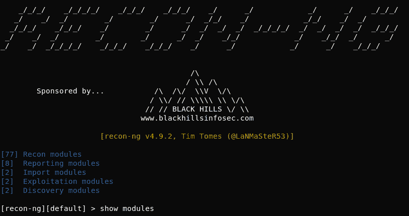
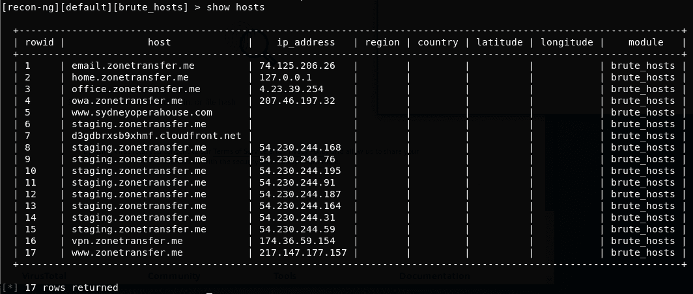
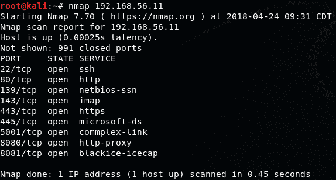
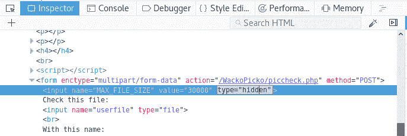
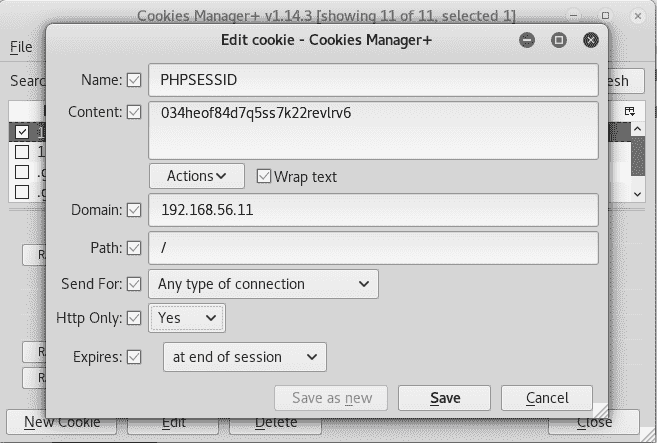

# 第二章：侦察

本章内容包括：

+   被动侦察

+   使用 Recon-ng 收集信息

+   使用 Nmap 扫描和识别服务

+   识别 Web 应用防火墙

+   识别 HTTPS 加密参数

+   使用浏览器的开发者工具分析和修改基本行为

+   获取和修改 Cookies

+   利用 robots.txt

# 介绍

每一次渗透测试，无论是针对网络还是 Web 应用，都有一个工作流程；它包含一系列必须完成的阶段，以提高我们发现并利用所有可能漏洞的机会，这些漏洞可能影响到我们的目标，例如：

+   侦察

+   枚举

+   利用

+   保持访问

+   清理痕迹

在网络渗透测试场景中，侦察是测试人员必须识别网络中所有资产、防火墙和入侵检测系统的阶段。测试人员还会收集关于公司、网络和员工的最大信息。

在我们的案例中，对于 Web 应用渗透测试，这一阶段将专注于了解应用程序、数据库、用户、服务器以及应用程序和我们之间的关系。

侦察是每次渗透测试中的一个重要阶段；我们对目标了解得越多，在寻找漏洞和利用漏洞时可选择的方案也就越多。

# 被动侦察

被动侦察是我们不直接与目标交互时进行的，即我们通过第三方收集关于目标的信息，例如搜索引擎、缓存数据库、声誉监控网站等。

在本节中，我们将请求多个在线服务的信息，这些服务也被称为**开源情报**（**OSINT**），以便构建我们目标的一般图像，并发现从渗透测试的角度有用的信息，假设我们正在测试一个公开可用的网站或应用程序。

# 准备工作

鉴于在本节中，我们将从多个公共来源请求信息，我们需要确保我们的 Kali 虚拟机能够连接到互联网，因此我们需要配置其网络设置以使用 NAT 适配器。为此，请参阅第一章中的*配置虚拟机以实现正确通信*，并选择 NAT，而非 Host-only 适配器。

# 如何操作...

我们将使用 zonetransfer.me 作为目标域名。该域名 zonetransfer.me 由 Robin Wood（来自 DigiNinja）创建([`digi.ninja/projects/zonetransferme.php`](https://digi.ninja/projects/zonetransferme.php))，用于展示允许公开 DNS 区传输的风险：

1.  我们首先使用`whois`查询域名，以获取其注册信息。我们来试着测试一个域名，如 zonetransfer.me：

```
# whois zonetransfer.me 
```


1.  另一个用于获取域名和 DNS 解析信息的工具是`dig`。例如，我们可以查询目标域名的 nameserver：

```
# dig ns zonetransfer.me
```


1.  一旦我们获得了 DNS 服务器的信息，就可以尝试进行区域传输攻击，以获取服务器解析的所有主机名。为此我们使用 `dig`：

```
# dig axfr @nsztm1.digi.ninja zonetransfer.me
```


幸运的是，服务器存在漏洞，给了我们一个完整的子域名列表及其解析的主机。有时我们可以在其中找到一些容易利用的漏洞：

1.  现在我们使用 `theharvester` 来识别与目标域名相关的电子邮件地址、主机名和 IP 地址：

```
# theharvester -b all -d zonetransfer.me
```


1.  对于每个在范围内的 Web 服务器，我们希望了解它使用的软件及其版本；一种不直接查询服务器的方式是通过 Netcraft。访问 [`toolbar.netcraft.com/site_report`](https://toolbar.netcraft.com/site_report) 并在搜索框中输入网址：


1.  此外，有时了解站点在上次更新之前的样子可能会很有用；也许它曾经包含一些后来被删除的有价值的信息。为了获取我们目标的静态副本，可以使用 Wayback Machine，网址是 [`archive.org/web/web.php`](https://archive.org/web/web.php)：


# 它是如何工作的…

在这个过程中，我们使用了多个工具来收集关于目标的不同信息。首先，我们运行了 `whois`，这个 Linux 命令查询域名注册详情，通过它我们可以获取 nameserver 的地址以及所有者的详细信息，如公司、电子邮件地址、电话号码等。`whois` 还可以查询 IP 地址信息，显示有关拥有该网络段地址的公司的信息。接下来，我们使用 `dig` 获取关于域名服务器的信息，然后执行区域传输，获取查询服务器解析的完整主机列表；这仅适用于未正确配置的服务器。

通过使用 `theharvester`，我们获取了与目标域名相关的电子邮件地址、主机名和 IP 地址。在这个过程中使用的选项是 `-b all`，表示使用所有支持的搜索引擎，以及 `-d zonetransfer.me`，指定目标域名。

然后我们使用 Netcraft 获取了该站点所使用的技术信息以及更新和变更的简要历史；这使我们能够在不直接查询实际站点的情况下，进一步规划测试过程。

Wayback Machine 是一个存储互联网网站静态副本的服务，记录其更新和版本；在这里，我们可以查看网站旧版本中发布的信息，也许还能获取以前发布但后来被删除的信息。有时，Web 应用程序的更新可能会泄露敏感数据，而这些更新会被回滚或替换为新版本，因此能够查看先前版本的应用程序非常有用。

# 另见

此外，我们可以使用 Google 的高级搜索选项 ([`support.google.com/websearch/answer/2466433`](https://support.google.com/websearch/answer/2466433)) 来查找有关我们目标域名的信息，而无需直接访问它。例如，通过使用像 `site:site_to_look_into "target_domain"` 这样的搜索，我们可以查找我们目标域名在最近发现的漏洞、泄露信息或成功攻击的页面中的存在，以下是一些我们可以查找的好地方：

+   openbugbounty.org: Open Bug Bounty 是一个独立安全研究人员报告和披露漏洞（仅限跨站脚本攻击和跨站请求伪造）的网站，针对的是公共网站。所以，在 Google 中进行这样的搜索将返回所有提到 "zonetransfer.me" 的内容，这些内容来自 openbugbounty.org 网站。

+   pastebin.com: Pastebin 是黑客用来匿名提取和发布在攻击中获取的信息的非常流行的方式之一。

+   zone-h.org: Zone-H 是一个黑客们用来炫耀自己成果的网站，主要是关于网站篡改的内容。

# 使用 Recon-ng 收集信息

Recon-ng 是一个信息收集工具，它使用许多不同的来源来收集数据，例如 Google、Twitter 和 Shodan。

在本教程中，我们将学习 Recon-ng 的基础知识，并使用它来收集关于目标的公开信息。

# 准备工作

尽管 Recon-ng 在 Kali Linux 中已经可以直接使用，但其某些模块需要 API 密钥来向在线服务发起查询。此外，拥有 API 密钥还可以让你执行更高级的搜索或避免某些服务的查询限制。

这些密钥可以通过在每个搜索引擎的网站上完成注册来生成。

# 如何操作...

让我们做一个基本查询，来展示 Recon-ng 是如何工作的：

1.  要从 Kali Linux 启动 Recon-NG，可以使用应用程序菜单（应用程序 | 01 - 信息收集 | recon-ng），或在终端中输入 `recon-ng` 命令：



1.  我们将看到命令行界面。为了查看可用的模块，我们可以执行 `show modules` 命令。

1.  假设我们想要搜索某个域名的所有子域名，而 DNS 服务器不响应区域传送。我们可以使用暴力破解的方式获取子域名；为此，我们首先加载 `brute_hosts` 模块：`use recon/domains-hosts/brute_hosts`。

1.  要了解在使用任何模块时需要配置的选项，我们可以使用 `show options` 命令。

1.  要为某个选项分配值，我们使用命令 `set`：`set source zonetransfer.me`。

1.  一旦设置好所有选项，我们就发出 `run` 命令来执行模块：


1.  这需要一些时间才能完成暴力破解，并且会显示大量信息。一旦完成，我们可以查询 Recon-ng 数据库以获取已发现的主机（`show hosts`）：



# 它是如何工作的...

Recon-ng 是一个工具和 API 的封装器，能够查询搜索引擎、社交媒体、互联网档案和数据库，以获取关于网站、Web 应用程序、服务器、主机、用户、电子邮件地址等的信息。它通过整合提供不同功能的模块来工作，比如搜索 Google、Twitter、LinkedIn 或 Shodan 等，或者对 DNS 服务器执行查询，就像我们在这个示例中使用的那样。它还具有将文件导入数据库或生成报告（如 HTML、MS Excel 或 CSV 格式）的模块。

# 另见

另一个非常有用的信息收集和 OSINT 工具，Kali Linux 默认包含的工具是 **Maltego** ([`www.paterva.com/web7/buy/maltego-clients/maltego-ce.php`](https://www.paterva.com/web7/buy/maltego-clients/maltego-ce.php))，这是许多渗透测试人员的最爱。该工具提供一个图形用户界面，显示所有被分析的元素（如电子邮件地址、人物、域名、公司等）在图形中，元素之间的关系通过图形直观地展示。例如，代表某个人的节点将通过一条线与该人的电子邮件地址连接，而电子邮件地址又与其所属的域名连接。

# 使用 Nmap 扫描和识别服务

Nmap 可能是世界上使用最广泛的端口扫描器。它可以用来识别在线主机、扫描 TCP 和 UDP 开放端口、检测防火墙、获取远程主机上运行的服务版本，甚至通过脚本查找和利用漏洞。

在这个示例中，我们将使用 Nmap 来识别目标应用程序服务器上运行的所有服务及其版本。为了学习的目的，我们将通过多次调用 Nmap 来实现这一点，但也可以通过单个命令完成。

# 准备就绪

我们需要做的就是确保我们的易受攻击的 `vm_1` 正在运行。

# 如何操作...

本示例中的所有任务都可以通过一行命令完成；它们在这里被分别展示，以更好地说明其功能和结果：

1.  首先，我们想查看服务器是否响应 ping 请求，或者主机是否在线：

```
# nmap -sn 192.168.56.11
```


1.  现在，我们知道它已启动，让我们看看哪些端口是开放的：

```
# nmap 192.168.56.11
```



1.  现在，我们将告诉 Nmap 向服务器请求它正在运行的服务的版本，并根据这些信息猜测操作系统：

```
# nmap -sV -O 192.168.56.11
```


我们可以看到我们的 `vm_1` 很可能运行的是 Linux 操作系统（Nmap 没能准确确定）。它使用的是 Apache 2.2.14 网络服务器，PHP 5.3p1，Jetty 6.1.25 等等。

# 它是如何工作的...

Nmap 是一个端口扫描器；这意味着它向指定 IP 地址上的多个 TCP 或 UDP 端口发送数据包，并检查是否有响应。如果有响应，则表示该端口是开放的，因此该端口上正在运行一个服务。

在第一个命令中，使用 `-sn` 参数，我们指示 Nmap 仅检查服务器是否响应 ICMP 请求（或 ping）。我们的服务器响应了，因此它是活跃的。

第二个命令是调用 Nmap 的最简单方式；它只指定目标 IP 地址。这样做的作用是对服务器进行 ping 测试；如果服务器响应，Nmap 会向 1,000 个 TCP 端口发送探测，查看哪些端口响应以及如何响应，然后报告结果，显示哪些端口是开放的。

第三个命令在第二个命令的基础上增加了以下两个任务：

+   `-sV` 请求获取每个开放端口的横幅头部或自我识别信息，这些信息被用作版本标识。

+   `-O` 告诉 Nmap 尝试通过从开放端口和版本收集的信息来猜测目标所运行的操作系统。

# 还有更多...

使用 Nmap 时的其他有用参数如下：

+   `-sT`：默认情况下，当以 root 用户身份运行时，Nmap 使用一种称为 SYN 扫描的扫描方式。使用此参数，我们强制扫描器执行完整连接扫描。它较慢，会在服务器的日志中留下记录，但不太可能被入侵检测系统检测到或被防火墙阻止。

+   `-Pn`：如果我们已经知道主机是活跃的或没有响应 ping，我们可以使用此参数告诉 Nmap 跳过 ping 测试并扫描所有指定的目标，假设它们是在线的。

+   `-v`：这是详细模式。Nmap 会显示更多关于它正在做的事情和它收到的响应的信息。此参数可以在同一命令中多次使用：使用次数越多，显示的信息越详细（即 `-vv` 或 `-v -v -v -v`）。

+   `-p N1,N2,...,Nn`：如果我们想测试特定端口或一些非标准端口时，可能需要使用此参数，其中 `N1` 到 `Nn` 是我们希望 Nmap 扫描的端口号。例如，要扫描端口 `21`、`80` 到 `90` 和 `137`，参数将是 `-p 21,80-90,137`。此外，使用 `-p-`，Nmap 会扫描从 `0` 到 `65535` 的所有端口。

+   `--script=script_name`：Nmap 包含许多用于漏洞检查、扫描或识别、登录测试、命令执行、用户枚举等的有用脚本。使用此参数告诉 Nmap 在目标的开放端口上运行脚本。你可能想查看一些 Nmap 脚本的使用，参考：[`nmap.org/nsedoc/scripts/`](https://nmap.org/nsedoc/scripts/)。

# 另见

虽然 Nmap 是最流行的端口扫描器，但它并不是唯一可用的工具，而且根据个人偏好，可能也不是最好的选择。Kali Linux 中还包含了一些其他的替代工具，比如：

+   `unicornscan`

+   `hping3`

+   `masscan`

+   `amap`

+   Metasploit 的扫描模块

# 识别 Web 应用防火墙

**Web 应用防火墙**（**WAF**）是一种设备或软件，负责检查数据包

发送到 Web 服务器，以识别并阻止那些可能是恶意的请求，通常基于签名或正则表达式进行判断。

如果未检测到 WAF 阻止我们的请求或封禁我们的 IP 地址，我们可能会在渗透测试中遇到许多问题。在进行渗透测试时，侦察阶段必须包括 WAF、**入侵检测系统**（**IDS**）或**入侵防御系统**（**IPS**）的检测和识别。这样才能采取必要的措施，避免被这些保护设备封锁或封禁。

在本教程中，我们将使用不同的方法以及 Kali Linux 中的工具，来检测和识别目标与我们之间是否存在 Web 应用防火墙。

# 如何操作...

检测应用程序是否受到 WAF 或 IDS 保护的方法有很多种；发起攻击后被阻止和/或列入黑名单是最糟糕的情况，因此我们将使用 Nmap 和 `wafw00f` 在全力进攻之前，识别我们的目标是否被 WAF 保护：

1.  Nmap 包含一些脚本，用于测试所有检测到的 HTTP 端口中是否存在 WAF。我们可以在我们易受攻击的 `vm_1` 上尝试一下：

```
# nmap -sT -sV -p 80,443,8080,8081 --script=http-waf-detect 192.168.56.11
```


看起来我们没有 WAF 保护这个服务器

1.  现在，让我们在一个实际受到防火墙保护的服务器上尝试相同的命令。这里，我们将使用 `example.com` 作为虚构名称；不过，您也可以在任何受保护的服务器上尝试：

```
# nmap -p 80,443 --script=http-waf-detect www.example.com
```


1.  Nmap 还有一个脚本，可以帮助我们更精确地识别正在使用的 WAF。这个脚本是 `http-waf-fingerprint`：

```
# nmap -p 80,443 --script=http-waf-fingerprint www.example.com
```

1.  Kali Linux 中还有一个工具可以帮助我们检测和识别 WAF，那就是 `wafw00f`。假设 `www.example.com` 是一个由 WAF 保护的网站：

```
# wafw00f www.example.com
```


# 它是如何工作的...

WAF 检测通过向服务器发送特定请求并分析响应来工作；例如，在 `http-waf-detect` 的情况下，它会发送一些基本的恶意数据包，并比较响应，寻找被阻止、拒绝或检测到的迹象。`http-waf-fingerprint` 也会做同样的事情，但这个脚本还会尝试解析响应，并根据已知的 IDS 和 WAF 模式对其进行分类。`wafw00f` 也是如此。

# 识别 HTTPS 加密参数

在某种程度上，我们习惯于认为，当一个连接使用 HTTPS 并且采用 SSL 或 TLS 加密时，它是安全的，任何拦截该连接的攻击者也只会得到一系列无意义的数字。嗯，这可能并不完全正确；HTTPS 服务器需要正确配置，以提供强大的加密层并保护用户免受**中间人攻击**（**MITM**）或密码分析的威胁。已经发现 SSL 协议在实现和设计中的一些漏洞，它的继任者 TLS 在某些配置下也被发现存在漏洞，因此在任何 Web 应用渗透测试中，测试安全连接是必须的。

在本教程中，我们将使用 Nmap、SSLScan 和 TestSSL 等工具，从客户端的角度分析服务器在安全通信方面的配置。

# 准备就绪

本教程中我们将使用的工具之一，TestSSL，Kali Linux 默认没有安装，但可以在其软件仓库中找到。我们需要配置我们的 Kali 虚拟机使用 NAT 网络适配器，以便它能够访问互联网，并在终端中执行以下命令：

```
# apt update
# apt install testssl.sh
```

安装 TestSSL 后，将网络适配器切换回仅主机模式，以便与易受攻击的虚拟机进行通信。

# 如何操作...

根据我们在之前教程中的扫描结果，`vm_1`在端口`443`上运行 HTTPS 服务；让我们看看它有多安全：

1.  要查询一个 HTTPS 站点支持的协议和密码套件，我们需要扫描 HTTPS 端口并使用`ssl-enum-ciphers`脚本：

```
nmap -sT -p 443 --script ssl-enum-ciphers 192.168.56.11
```


1.  SSLScan 是一个命令行工具，专门用于评估服务器的 SSL/TLS 配置。使用它时，我们只需要添加服务器的 IP 地址或主机名（`sslscan 192.168.56.11`）：


1.  TestSSL 显示比 Nmap 或 SSLScan 更详细的输入；它的基本使用只需要我们在命令行中将目标附加到命令后即可。它还允许将输出导出为多种格式，如 CSV、JSON 或 HTML（`testssl 192.168.56.11`）：


# 它是如何工作的...

Nmap、SSLScan 和 TestSSL 通过对目标 HTTPS 服务器进行多次连接，尝试不同的密码套件和客户端配置来测试它接受哪些内容。

在所有三种工具显示的结果中，我们可以看到一些可能影响加密通信的问题：

+   使用 SSLv3。自 2015 年以来，SSL 协议已被弃用，它具有固有的漏洞，使其容易受到多种攻击，例如 Sweet32（[`sweet32.info/`](https://sweet32.info/)）和 POODLE（[`www.openssl.org/~bodo/ssl-poodle.pdf`](https://www.openssl.org/~bodo/ssl-poodle.pdf)）。

+   使用 RC4 和 DES 密码套件以及 SHA 和 MD5 哈希。RC4 和 DES 加密算法现在被认为是加密学上脆弱的，SHA 和 MD5 哈希算法也是如此。这是由于现代计算机处理能力的提高，以及这些算法可以在合理的时间内被突破的事实。

+   使用 TLS 1.0。TLS 是 SSL 的继任者，当前版本是 1.2。虽然 TLS 1.1 仍然被认为是可以接受的，但在服务器中允许 TLS 1.0 被认为是不好的做法或安全隐患。

+   证书是自签名的，使用了较弱的签名算法（SHA1），并且 RSA 密钥不够强大（1024 位）。

当浏览器通过 HTTPS 连接到服务器时，它们会交换有关浏览器可以使用哪些密码套件以及服务器支持哪些密码套件的信息，然后它们会达成协议，使用两者共同支持的复杂性更高的密码套件。如果对一个配置不当的 HTTPS 服务器进行中间人攻击（MITM），攻击者可以通过声称客户端仅支持最弱的密码套件（比如通过 SSLv2 使用 56 位的 DES）来欺骗服务器，然后攻击者拦截的通信将使用可能在几天或几小时内就能被现代计算机破解的算法进行加密。

# 另见

这里展示的工具并不是唯一可以从 SSL/TLS 连接中获取密码信息的工具。Kali Linux 中还有一个名为 SSLyze 的工具，作为替代工具，它有时能够提供对我们测试的补充结果：

```
sslyze --regular www.example.com
```

SSL/TLS 信息也可以通过 OpenSSL 命令获取：

```
openssl s_client -connect www2.example.com:443
```

# 使用浏览器的开发者工具分析和修改基本行为

Firebug 是一个浏览器插件，允许我们分析网页的内部组件，如表格元素、CSS 类和框架。它还可以显示 DOM 对象、错误代码以及浏览器与服务器之间的请求-响应通信。

在前面的示例中，我们看到如何查看网页的 HTML 源代码，并找到了一个隐藏的输入字段，该字段为文件的最大大小设置了一些默认值。在本示例中，我们将看到如何使用浏览器的调试扩展工具，具体来说是 Firefox 的 Firebug 或 OWASP Mantra。

# 如何操作...

在运行`vm_1`的情况下，前往你的 Kali 虚拟机，浏览到`http://192.168.56.11/WackoPicko`：

1.  右键点击“检查此文件”选项，然后选择“检查元素”：

浏览器的开发者工具也可以通过按 *F12*，或 *Ctrl* + *Shift* + *C* 来启动。

1.  表单的第一个输入框中有一个`type="hidden"`参数；双击`hidden`以选择它：



1.  将`hidden`替换为`text`，或删除整个属性`type="hidden"`，然后按 *Enter*。

1.  现在，双击`3000`的参数值。

1.  将该值替换为`500000`：


1.  现在我们在页面上看到一个新的文本框，值为 `500000`。我们刚刚更改了文件大小限制，并添加了一个表单字段来修改它。

# 它是如何工作的...

一旦网页被浏览器接收，所有元素都可以被修改，以改变浏览器对页面的解释。如果页面被重新加载，服务器生成的版本

再次显示。

开发者工具允许我们修改页面在浏览器中显示的几乎每个方面；因此，如果页面上有客户端控制，我们可以通过这个工具进行操作。

# 还有更多...

浏览器的开发者工具不仅仅是用来隐藏输入或更改值；它还包含其他一些非常有用的工具：

+   检查器是我们刚刚使用的面板。它以层级方式展示 HTML 源代码，从而使我们可以修改其内容。

+   控制台面板显示错误、警告以及其他生成的消息

    加载页面时。

+   在调试器中，我们可以看到完整的 HTML 源代码，设置断点，当页面加载到达断点时会暂停，并检查和修改运行脚本时的变量值。

+   样式编辑器面板用于查看和修改页面使用的 CSS 样式。

+   在性能面板中，我们可以计算页面上加载的动态和静态元素所使用的时间和资源。从开发者的角度来看，这对于检测瓶颈和客户端代码中过度使用计算资源非常有用。

+   内存面板可用于捕捉进程内存的快照；这在我们想要查找存储在内存中的敏感信息时非常有用。

+   网络面板显示了向服务器发出的请求及其响应，包括请求类型、大小、响应时间以及在时间轴中的顺序。

+   存储面板显示了浏览器的 cookies 和其他客户端存储选项，并可以删除它们或修改其值。

+   可以在工具设置中启用的其他选项卡包括：

    +   DOM

    +   着色器编辑器

    +   Canvas

    +   Web 音频

    +   Scratchpad

# 获取和修改 cookies

Cookies 是由网页服务器发送到客户端（浏览器）的小段信息，用于在本地存储与特定用户相关的一些信息。在现代 web 应用中，cookies 用于存储用户特定的数据，如颜色主题配置、对象排列偏好、之前的活动以及（对我们来说更重要的是）会话标识符。

在这个教程中，我们将使用浏览器的工具查看 cookies 的值、它们是如何存储的，以及如何修改它们。

# 准备工作

我们的 `vm_1` 需要处于运行状态。`192.168.56.11` 将作为该机器的 IP 地址，我们将使用 Firefox 作为网页浏览器。

在 Firefox 中，开发者工具中的存储面板可能默认没有启用；要启用它，我们打开开发者工具（浏览器中按 *F12*），然后进入工具箱选项（右上角的齿轮图标）。在默认开发者工具下，勾选“存储”选项框。

# 如何操作...

要查看和编辑 cookies 的值，我们可以使用浏览器的开发者工具、cookies 管理器以及我们在第一章中安装的插件，*设置 Kali Linux 和测试实验室*。我们来尝试这两种方法：

1.  浏览到 `http://192.168.56.11/WackoPicko`。

1.  打开开发者工具，进入存储 | Cookies：


我们可以通过双击任何 cookie 的值并输入一个新值来更改它。

1.  现在，我们还可以使用插件来检查和编辑 cookies。在 Firefox 的顶部工具栏，点击 Cookies 管理器按钮：


在上图中，我们可以看到当时存储的所有 cookies，以及它们所属的网站，使用这个插件我们还可以修改它们的值、删除它们，或者添加新的 cookies。

1.  从 `192.168.56.11` 选择 `PHPSESSID`，然后点击编辑。

1.  将 Http Only 的值更改为是：



我们刚刚更改的参数（Http Only）告诉浏览器，这个 cookie 不允许被客户端脚本访问。

# 它是如何工作的...

Cookies 管理器是一个浏览器插件，允许我们查看、修改或删除现有的 cookies，也可以添加新的 cookies。由于某些应用程序依赖于这些 cookies 中存储的值，攻击者可以利用它们注入恶意模式，可能会改变页面的行为，或者提供虚假的信息以获得更高的权限。

此外，在现代 Web 应用程序中，通常会使用会话 cookie，并且一旦登录完成，它们往往是唯一的用户标识来源。这就导致了通过替换一个已经活跃会话用户的 cookie 值来冒充有效用户的可能性。

# 还有更多...

在对 Web 应用程序进行渗透测试时，我们应关注 cookies 中的某些特征，以确保它们是安全的：

+   Http Only：如果一个 cookie 设置了此标志，则不能通过脚本代码访问；这意味着 cookie 的值只能从服务器端修改。我们仍然可以使用浏览器工具或插件来更改它们，但不能通过页面中的脚本来修改。

+   安全性：该 cookie 不会通过未加密的通道传输；如果一个站点使用 HTTPS 并且在 cookie 中设置了此标志，则浏览器在通过 HTTP 发起请求时不会获取或发送该 cookie。

+   过期时间：如果过期日期设置为未来，这意味着该 cookie 存储在本地文件中，即使浏览器关闭后仍会保留。攻击者可以直接从文件中获取该 cookie，或许能够窃取有效用户的会话。

# 利用 robots.txt

更进一步进行侦察，我们需要找出网站上是否有任何页面或目录并未链接到普通用户所看到的内容，例如，内联网或**内容管理系统**（**CMS**）管理页面的登录页。发现类似这样的网站将大大扩展我们的测试面，并为我们提供关于应用程序及其基础设施的重要线索。

在这个步骤中，我们将使用`robots.txt`文件来发现一些可能未在主应用程序中链接的文件和目录。

# 如何操作...

为了说明渗透测试人员如何利用`robots.txt`，我们将使用`vm_1`中的易受攻击的 Web 应用程序`vicnum`，它包含三个数字和单词猜谜游戏。我们将利用通过`robots.txt`获得的信息，增加我们在这些游戏中获胜的机会：

1.  浏览到`http://192.168.56.11/vicnum/`。

1.  现在，我们将`robots.txt`添加到网址中，我们将看到以下内容：


这个文件告诉搜索引擎，`jotto`和`cgi-bin`目录的索引对所有浏览器（用户代理）都是不允许的。然而，这并不意味着我们不能浏览它们。

1.  让我们浏览到`http://192.168.56.11/vicnum/cgi-bin/`：


我们可以点击并直接导航到此目录中的任何 Perl 脚本（.pl 文件）。

1.  让我们浏览到`http://192.168.56.11/vicnum/jotto/`。

1.  点击名为`jotto`的文件。你将看到类似于下面的内容：

    以下是截图：


`jotto`是一个猜测五个字母单词的游戏；这可能是一个可能答案的列表吗？使用列表中的单词作为答案玩这个游戏。我们已经破解了这个游戏：


# 如何工作...

`robots.txt`是一个由 Web 服务器使用的文件，用于告诉搜索引擎哪些目录或文件应该被索引，哪些是不允许被查看的。从攻击者的角度来看，这告诉我们服务器中是否有一个目录是可以访问的，但对公众隐藏的，这种方法被称为**安全通过模糊**（即假设用户如果没有被告知某件事的存在，就不会发现它）。
