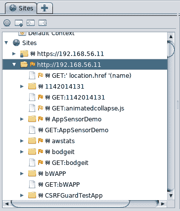

# 第三章：使用代理、爬虫和蜘蛛

本章将涵盖以下内容：

+   使用 Dirb 查找文件和文件夹

+   使用 ZAP 查找文件和文件夹

+   使用 Burp Suite 查看和修改请求

+   使用 Burp Suite 的入侵者查找文件和文件夹

+   使用 ZAP 代理查看和修改请求

+   使用 ZAP 蜘蛛

+   使用 Burp Suite 对网站进行爬虫扫描

+   使用 Burp Suite 的重放器重复请求

+   使用 WebScarab

+   从爬取结果中识别相关的文件和目录

# 介绍

渗透测试可以采用不同的方式进行，分别为黑盒、灰盒和白盒。黑盒是指测试团队除了服务器的 URL 外，对应用程序没有任何先验信息；白盒是指团队拥有目标的所有信息，包括其基础设施、软件版本、测试用户、开发信息等；灰盒则介于两者之间。

对于黑盒和灰盒方法，正如我们在前一章中所见，侦察阶段是必要的，测试团队需要通过这个阶段来发现应用程序所有者在白盒方法中可能提供的信息。

在 Web 渗透测试的侦察阶段，我们需要浏览网页中的每个链接，并记录每个显示的文件。我们可以使用工具来自动化并加速这一任务，这些工具称为网络爬虫或 Web 蜘蛛。这些工具会浏览网页，跟随所有链接和外部文件的引用，有时会填写表单并将其提交到服务器，保存所有请求和响应，给我们提供离线分析的机会。

在本章中，我们将介绍 Kali Linux 中一些代理、蜘蛛和爬虫的使用，并了解在常见网页中可能需要寻找的文件和目录。

# 使用 DirBuster 查找文件和文件夹

DirBuster 是一个工具，通过暴力破解或与字典文件比较来发现 Web 服务器中存在的文件和目录。在本教程中，我们将使用它来查找特定的文件和目录列表。

# 准备工作

我们将使用一个包含我们将要求 DirBuster 查找的单词列表的文本文件。创建一个名为 `dir_dictionary.txt` 的文本文件，其中包含以下内容：

```
info 
server-status 
server-info 
cgi-bin 
robots.txt 
phpmyadmin 
admin 
login 
```

# 如何操作…

DirBuster 是一个用 Java 编写的应用程序；可以通过 Kali 的主菜单或使用 `dirbuster` 命令从终端调用它。以下是进行此类调用所需的步骤：

1.  导航至应用程序 | 03 - Web 应用分析 | 网络爬虫与目录暴力破解 | Dirbuster。

1.  在 DirBuster 窗口中，将目标 URL 设置为 `http://192.168.56.11/`。

1.  将线程数设置为 20，以确保有一个不错的测试速度。

1.  选择基于列表的暴力破解，并点击浏览。

1.  在浏览窗口中，选择我们刚刚创建的文件（`dir_dictionary.txt`）。

1.  取消勾选“递归”选项。

1.  对于本教程，我们将其他选项保持默认设置：


1.  点击启动。

1.  如果我们进入结果标签，我们会看到 DirBuster 至少找到了我们字典中的两个文件：`cgi-bin` 和 `phpmyadmin`。响应代码 200 意味着文件或目录存在并且可以读取。`phpmyadmin` 是一个基于 Web 的 MySQL 数据库管理工具；找到这个名称的目录告诉我们服务器中可能存在一个**数据库管理系统**（**DBMS**），并且可能包含有关应用程序及其用户的相关信息：


# 工作原理...

DirBuster 是爬虫和暴力破解工具的结合体；它会跟踪页面中的所有链接，同时也会尝试不同的文件名。这些文件名可能与我们使用的文件相似，或者可能是 DirBuster 通过纯暴力破解选项自动生成的，设置字符集以及生成单词的最小和最大长度。

为了确定文件是否存在，DirBuster 使用来自服务器的响应代码。最常见的响应如下所示：

+   200 OK：文件存在，用户可以读取

+   404 File not found：文件在服务器中不存在

+   301 Moved permanently：这是一个重定向到指定 URL 的响应

+   401 Unauthorized：访问该文件需要认证

+   403 Forbidden：请求有效，但服务器拒绝响应

# 另见

`dirb` 是 Kali Linux 中的一个命令行工具，它同样使用字典文件强制浏览服务器，以识别现有的文件和目录。要查看其语法和选项，可以打开终端并输入 `# dirb` 命令。

# 使用 ZAP 查找文件和文件夹

OWASP **Zed Attack Proxy**（**ZAP**）是一个功能非常强大的网络安全测试工具。它包括代理、被动和主动漏洞扫描器、模糊测试器、爬虫、HTTP 请求发送器以及一些其他有趣的功能。在本食谱中，我们将使用最近添加的**强制浏览**功能，它是 ZAP 内部实现的 DirBuster。

# 准备工作

为了使本食谱生效，我们需要将 ZAP 作为我们的网络浏览器的代理：

1.  从 Kali Linux 菜单启动 OWASP ZAP，然后从应用程序菜单中依次导航到应用程序 | 03 - Web 应用分析 | owasp-zap。

1.  接下来，我们将更改 ZAP 的代理设置。默认情况下，它使用 `8080` 端口，但如果我们同时运行其他代理（如 Burp Suite），这可能会产生冲突。在 ZAP 中，依次进入工具 | 选项 | 本地代理，并将端口更改为 `8088`：


1.  现在，在 Firefox 中，进入主菜单，依次导航到首选项 | 高级 | 网络；在连接设置中，点击设置。

1.  选择手动代理配置，并设置 `127.0.0.1` 为 HTTP 代理，`8088` 为端口。勾选“对所有协议使用相同的代理”选项，然后点击 OK：


1.  我们还可以使用 FoxyProxy 插件来设置多个代理配置，并通过点击切换它们：


# 如何操作…

现在我们已经配置好了浏览器和代理，准备好按照以下步骤扫描服务器以查找现有文件夹：

1.  配置好代理后，浏览到 `http://192.168.56.11/WackoPicko`。

1.  我们将看到 ZAP 对此操作的反应，通过显示主机的树形结构

    我们刚刚访问的。

1.  现在，在 ZAP 的左上角面板（Sites 标签）中，右键点击 `http://192.168.56.11` 网站中的 `WackoPicko` 文件夹。然后，在右键菜单中，导航到攻击 | 强制浏览目录（及其子目录）；这将执行递归扫描：


1.  在底部面板中，我们可以看到显示了 Forced Browse 标签。在这里我们可以看到扫描的进度及其结果：


# 工作原理…

代理是一个充当客户端与服务器或提供不同服务的服务器群之间中介的应用程序。客户端向代理请求服务，代理具有将请求转发给适当的服务器并从服务器获取响应的能力。

当我们配置浏览器使用 ZAP 作为代理时，它并不会直接将请求发送到托管我们要查看的页面的服务器，而是发送到我们定义的地址。在这个案例中，就是 ZAP 正在监听的地址。然后，ZAP 将请求转发给服务器，但不会在没有记录和分析我们发送的信息的情况下直接转发。

ZAP 的 Forced Browse 与 DirBuster 的工作原理相同；它会使用我们配置的字典，向服务器发送请求，就像是在尝试访问列表中的文件一样。如果文件存在，服务器会作出响应；如果文件不存在或当前用户无法访问，服务器会返回错误。

# 另请参见

另一个非常有用的代理工具是 Kali Linux 中包含的 Burp Suite。它也有一些非常有趣的功能；其中一个可以作为我们刚刚使用的 Forced Browse 的替代工具，就是 Burp 的 Intruder。尽管它并不是专门为此目的设计的，但它是一个多功能的工具，值得一试。

# 使用 Burp Suite 查看和修改请求

Burp Suite 不仅仅是一个简单的 Web 代理工具，它是一个功能全面的 Web 应用测试工具包。它包含代理、请求重放器、模糊测试工具、请求自动化、字符串编码和解码器、漏洞扫描器（在专业版中提供）、插件以扩展功能，以及其他有用的功能。

在本教程中，我们将使用 Burp Suite 的代理功能，拦截浏览器与服务器之间的请求并修改其内容。

# 准备工作

从应用菜单启动 Burp Suite，路径为应用 | 03 - Web 应用分析 | Burpsuite，或者通过终端输入命令启动，并将浏览器配置为通过 `8080` 端口使用它作为代理。

# 如何操作…

为了让事情更有趣一点，让我们使用这个拦截/修改技巧绕过一个基本的保护机制。请执行以下步骤：

1.  浏览到 OWASP Bricks 并进入练习 Upload 2（`http://192.168.56.11/owaspbricks/upload-2`）。

1.  Burp Suite 默认启用了请求拦截；如果页面无法加载，请转到 Burp Suite 然后选择 Proxy | Intercept 并点击按下的按钮，拦截已开启：


1.  这里我们有一个文件上传表单，应该只允许上传图像。让我们尝试上传一个。点击浏览并选择任何图像文件（PNG、JPG 或 BMP）：


1.  点击打开后，点击上传并验证文件是否上传成功：


1.  现在让我们尝试看看如果我们上传另一种类型的文件，会发生什么，比如说，HTML 文件：


1.  看起来，如练习描述所说，服务器正在验证上传的文件类型。为了绕过这个限制，我们首先在 Burp Suite 中启用请求拦截。

1.  浏览到 HTML 文件并再次尝试上传它。

1.  Burp 会捕获请求：


在这里，我们可以看到一个 `POST` 请求，它是 `multipart`（第一个 `Content-Type` 头部），每个部分的分隔符是一长串的破折号 (-) 和一个长数字。接下来，在第一部分，我们可以看到我们要上传的文件以及它的信息和它自己的 `Content-Type`。

1.  我们知道服务器只接受图像文件，所以让我们更改头部，将其改为表示我们上传的文件是图像的类型：


1.  接下来，我们通过点击“转发”提交请求，如果我们希望继续拦截请求，或者如果不希望拦截，则禁用拦截。

1.  上传成功了。如果我们将鼠标指针移动到这里的单词上，我们会看到它是指向我们文件的链接：


# 它是如何工作的...

在这个案例中，我们使用 Burp Suite 作为代理捕获一个请求，捕获该请求时它已经通过了应用程序在客户端（即浏览器）建立的验证机制，然后修改了该请求的内容，通过更改 `Content-Type` 头部来绕过应用程序中的文件类型限制。

`Content-Type` 是由客户端设置的标准 HTTP 头部，特别是在 `POST` 和 `PUT` 请求中，用于向服务器指示它接收的数据类型。在允许用户上传文件的应用程序中，Web 应用程序通常使用此字段和文件扩展名来筛选出危险或未经授权的类型。正如我们刚才看到的，仅凭这个保护措施不足以防止用户上传恶意内容到服务器。

能够拦截和修改请求是任何 web 应用渗透测试中非常重要的一个方面，不仅可以绕过一些客户端验证—正如我们在这个示例中所做的那样—还可以研究发送了哪些信息，并尝试理解应用的内部工作原理。我们还可能需要根据对这些内容的理解，为了方便起见，添加、删除或替换一些值。

# 另见

渗透测试人员必须理解 HTTP 协议的工作原理。要更好地理解不同的 HTTP 方法，请参考：

+   [`en.wikipedia.org/wiki/Hypertext_Transfer_Protocol`](https://en.wikipedia.org/wiki/Hypertext_Transfer_Protocol)

+   [`www.w3.org/Protocols/rfc2616/rfc2616-sec9.html`](https://www.w3.org/Protocols/rfc2616/rfc2616-sec9.html)

# 使用 Burp Suite 的 Intruder 查找文件和文件夹

Burp Intruder 是一个工具，可以让我们自动重放请求，按照我们设置或根据可配置规则生成的输入列表来修改请求的部分内容。

尽管这不是它的主要用途，但我们可以使用 Intruder 来查找现有但未被引用的文件和文件夹，就像我们之前使用的工具 DirBuster 和 ZAP 的 Forced Browse 一样。

在这个示例中，我们将进行首次使用 Burp Suite Intruder 的练习，并利用它通过 Kali Linux 中包含的名称列表强制浏览我们易受攻击的虚拟机中的目录。

# 如何进行操作...

假设我们已经将 Burp Suite 设置为浏览器的代理，并且访问了 WackoPicko（`http://192.168.56.11/WackoPicko`）。请参考以下步骤：

1.  在 Target 或 Proxy 选项卡中，找到发送到 WackoPicko 根 URL 的请求，右键单击该请求并选择 Send to Intruder：


1.  然后切换到 Intruder 选项卡，再切换到 Positions 选项卡；你将看到请求中的一些字段被高亮显示，并被 § 符号包围。这些是 Intruder 在每个请求中将要修改的输入。点击 Clear 按钮以删除它们。

1.  在 URL 中最后一个 `/` 后，我们添加任何字符，例如 `a`，然后选择它并点击 Add。这样，这个字符就成为输入列表的插入点：


1.  现在切换到 Payloads 选项卡。我们只有一个插入点，因此我们将只有一个 Payload 集需要配置。Payload 类型保持为简单列表，并且我们从文件中加载 payloads。

1.  现在点击 Load 按钮，这样我们可以从文件中加载 payload 列表，选择文件 `/usr/share/wordlists/dirb/small.txt`：


1.  要开始向服务器发送请求，点击 Start attack。如果你正在使用 Burp Suite 的免费版本，你将收到关于 Intruder 一些限制的警告；接受这些限制，攻击将开始：


如果我们按状态排序结果（通过点击列标题），可以看到最小的数字排在最前面；记住，200 是表示文件或目录存在且可访问的响应代码，重定向是 300，错误位于 400 和 500 之间。

# 如何操作...

Intruder 做的是，它修改我们指定的特定位置的请求，并将这些位置的值替换为在 Payloads 部分中定义的有效负载。有效负载可能是以下几种：

+   简单列表：一个可以从文件中获取、从剪贴板粘贴或在文本框中手动输入的列表

+   运行时文件：Intruder 可以从在运行时读取的文件中获取有效负载，因此如果文件非常大，它不会完全加载到内存中

+   数字：生成一个数字列表，数字可以是顺序的或随机的，并以十六进制或十进制形式呈现

+   用户名生成器：从电子邮件地址列表中提取可能的用户名

+   暴力破解器：使用一个字符集，并利用它生成所有在指定长度限制内的排列组合

这些有效负载通过 Intruder 以不同的方式发送，这些方式由 Positions 标签中的攻击类型指定。攻击类型根据有效负载在标记位置中组合和排列的方式不同：

+   狙击手：使用一组有效负载，它会将每个有效负载值依次放置到每个标记位置。

+   撞锤：与 Sniper 类似，使用一组有效负载；区别在于它将相同的值设置到每个请求的所有位置。

+   齿轮叉：使用多个有效负载集，并将每个集中的一个项目放置在每个标记位置。适用于我们有预定义的数据集并且这些数据集不应混合的情况，例如测试已知的用户名/密码对。

+   集群炸弹：测试多个有效负载彼此之间的所有可能组合。

关于结果，我们可以看到有几个现有文件的名称与列表中的文件名称匹配（`account` 和 `action`），并且有一个名为 `admin` 的目录，可能包含执行应用程序管理功能的页面，例如添加用户或内容。

# 使用 ZAP 代理查看和修改请求

OWASP ZAP 类似于 Burp Suite，也不仅仅是一个网络代理。它不仅拦截流量，还有很多其他功能，比如我们在之前章节中使用的爬虫、漏洞扫描器、模糊测试工具和暴力破解工具。它还有一个脚本引擎，可以用来自动化任务或创建新的功能。

在本教程中，我们将开始使用 OWASP ZAP 作为 Web 代理，拦截请求，并在更改一些值后将其发送到服务器。

# 如何操作...

启动 ZAP 并配置浏览器使用它作为代理。接下来，执行以下步骤：

1.  转到 `vm_1` 中的 OWASP Bricks 并选择内容练习第四项（`http://192.168.56.11/owaspbricks/content-4/`）：


我们可以看到页面的即时响应是一个错误，表示用户不存在。还显示了 SQL 代码，表明应用程序正在将一个字段（`ua`）与浏览器发送的用户代理头字符串进行比较。

用户代理字符串是浏览器在每个请求头中发送的一段信息，用于向服务器标识自己。通常，它包含浏览器的名称和版本、基础操作系统和 HTML 渲染引擎。

1.  由于用户代理是由浏览器在发送请求时设置的，我们无法在应用程序内部做太多更改。我们将使用 OWASP ZAP 来捕获请求，并设置我们想要的用户代理文本。首先，通过点击工具栏中的绿色圆圈（鼠标悬停时变红）来启用代理中的拦截（称为 break）。这将拦截所有通过代理的请求：


1.  启用拦截后，去浏览器并刷新页面。回到 ZAP，新的 Break 标签将出现在 Request 和 Response 标签旁边。

1.  在 Break 标签中，我们可以看到刷新页面时浏览器发出的请求。在这里，我们可以更改请求的任何部分；对于本练习，我们只会更改用户代理值，例如，将其更改为`123456`：


1.  通过点击播放图标（蓝色三角形）提交请求。每当发出新请求时，它会再次暂停；如果你不想继续在每个请求上进行拦截，可以使用红色圆圈按钮来禁用拦截。

1.  现在让我们再次进入浏览器查看响应：


错误信息仍然显示用户不存在，但我们输入的值现在在线索代码中显示出来。在后续章节中，我们将学习如何利用像这样的功能，并用它们从数据库中提取信息。

# 它是如何工作的……

在这个例子中，我们使用 ZAP 代理拦截了一个有效的请求，服务器分析了头部部分。我们修改了头部并验证了服务器实际上接受了我们提供的值。

首先，我们发出了一个测试请求，发现服务器正在使用用户代理头。了解这一点后，我们发出了一个有效的请求并通过代理拦截了它；这使我们能够看到请求在离开浏览器后。然后，我们更改了头部，使用户代理包含我们希望它包含的信息，并将请求提交给服务器，服务器接收并显示了我们提供的值。

另一个无需拦截和手动修改请求的方式是使用我们在 第一章 中安装的 User-Agent Switcher Firefox 扩展程序，*设置 Kali Linux 和测试实验室*。这样做的问题是，每次我们想要测试不同的值时，都需要在扩展程序中设置一个不同的用户代理，这在渗透测试中非常不便。

# 使用 ZAP 蜘蛛

在 Web 应用程序中，爬虫或蜘蛛是一种自动浏览网站的工具，它会跟随网站中的所有链接，有时还会填写并提交表单；这使我们能够获取网站内所有被引用页面的完整地图，并记录为获取这些页面所做的请求及其响应。

在本教程中，我们将使用 ZAP 的蜘蛛爬取我们脆弱虚拟机 `vm_1` 中的一个目录，并查看它捕获到的信息。

# 如何操作...

我们将使用 BodgeIt (`http://192.168.56.11/bodgeit/`) 来演示 ZAP 的蜘蛛是如何工作的。请参照以下步骤：

1.  在 Sites 标签中，打开与测试网站对应的文件夹（本书中为 `http://192.168.56.11`）。

1.  右键点击 GET:bodgeit。

1.  从下拉菜单中选择 Attack | Spider：


1.  在 Spider 对话框中，我们可以查看爬虫是否为递归模式（即爬取在找到的目录内部），设置起始点和其他选项。暂时，我们保留所有默认选项不变，点击开始扫描：


1.  结果将在底部面板的 Spider 标签中显示：


1.  如果我们想要分析单个文件的请求和响应，我们可以前往 Sites 标签，打开网站文件夹，查看其中的文件和文件夹：



# 它是如何工作的...

像其他爬虫一样，ZAP 的蜘蛛会跟踪它在每个请求的范围内页面中找到的每个链接，以及该页面中的链接。此外，这个蜘蛛还会跟踪表单响应、重定向以及 `robots.txt` 和 `sitemap.xml` 文件中包含的 URL，然后它会存储所有请求和响应，供后续分析和使用。

# 还有更多

在爬取一个网站或目录后，我们可能想要使用存储的请求进行一些测试。利用 ZAP 的功能，我们将能够执行以下操作，当然这只是其中的一部分：

+   重复请求，修改部分数据

+   执行主动和被动漏洞扫描

+   模糊化输入变量，寻找可能的攻击向量

+   在浏览器中打开请求

# 使用 Burp Suite 对网站进行爬虫

与 ZAP 功能类似，并且具有一些独特功能以及更易用的界面，Burp Suite 是最常用的应用安全测试工具。Burp Suite 能做的不仅仅是爬取网站，但目前我们只会介绍它的爬虫功能，这是侦察阶段的一部分。

# 准备就绪

通过转到 Kali 的应用程序菜单并点击 03 - Web 应用程序分析 | Burpsuite 来启动 Burp Suite。

然后，配置浏览器通过端口`8080`使用它作为代理。

# 如何操作...

Burp Suite 的代理默认配置为拦截所有请求，这时我们想在没有中断的情况下浏览，所以我们需要禁用它（代理 | 拦截 | 拦截已开启）。然后继续以下步骤：

1.  一旦使用 Burp Suite 的代理，在浏览器中访问 bWAPP（`http://192.168.56.11/bWAPP`）；这将注册 Burp 的目标和代理标签中的网站和目录。

1.  转到目标 | 网站地图，右键单击`http://192.168.56.11`中的`bWAPP`文件夹，然后从上下文菜单中选择“蜘蛛此分支”：


1.  会弹出一个警告，询问是否要扫描超出范围的元素（仅当您没有将其添加到范围中时）。点击“是”将其添加到范围中，然后蜘蛛抓取将开始。

1.  在某个时刻，蜘蛛会发现一个注册或登录表单；当这种情况发生时，Burp Suite 会弹出一个对话框，询问如何填写表单的字段。我们可以忽略它，蜘蛛会继续，或者我们可以提交一些测试值，蜘蛛会填写这些值：


1.  我们可以在“蜘蛛”标签中查看蜘蛛的状态。我们也可以通过点击“蜘蛛正在运行”按钮来停止它。现在让我们停止它：


1.  我们还可以看到，随着蜘蛛找到新页面和目录，目标标签中的分支是如何被填充的：


# 它的工作原理...

Burp 的蜘蛛遵循与其他蜘蛛相同的方法，但它的操作方式稍有不同。我们可以在浏览网站时让它运行，它会将我们跟踪的符合范围定义的链接添加到爬虫队列中。

就像在 ZAP 中一样，我们可以使用 Burp 的抓取结果执行我们可以对任何请求进行的任何操作，例如扫描（如果我们有付费版本）、重复、比较、模糊测试和在浏览器中查看等。

# 还有更多

蜘蛛抓取通常是一个自动化的过程，蜘蛛几乎不对它们跟踪的链接进行任何检查。在具有缺陷的授权控制或暴露敏感链接和表单的应用程序中，这可能导致蜘蛛发送请求到执行敏感任务的操作或页面，这些任务可能会破坏应用程序或其数据。因此，非常重要的是，抓取必须非常小心地进行，利用所选工具提供的所有排除/包含过滤功能，确保抓取范围内没有敏感信息或高风险任务，并且最好在没有其他选择的情况下作为最后手段通过手动浏览网站。

# 使用 Burp Suite 的 Repeater 重复请求

在分析蜘蛛爬取的结果并测试表单的可能输入时，发送相同请求的不同版本并更改特定值可能很有用。

在这个配方中，我们将学习如何使用 Burp 的 Repeater 多次发送带有不同值的请求。

# 准备中

我们从上一个配方的结束点开始本次操作。需要确保 `vm_1` 虚拟机正在运行，在我们的 Kali 机器上启动 Burp Suite，并且浏览器正确配置以将其作为代理使用。

# 如何操作...

对于这个配方，我们将使用 OWASP Bricks。以下是所需的步骤：

1.  转到第一个内容练习（`http://192.168.56.11/owaspbricks/content-1/`）。

1.  在 Burp Suite 中，转到 Proxy | History，找到 URL 末尾带有 `id=0` 或 `id=1` 的 `GET` 请求，右键点击它，并从菜单中选择 Send to Repeater：


1.  现在我们切换到 Repeater 标签页。

1.  在 Repeater 中，我们可以在左侧看到原始请求。点击 Go 以查看右侧服务器的响应：


分析请求和响应，我们可以看到服务器使用我们发送的参数（`id=1`）来查找具有相同 ID 的用户，并在响应体中显示该信息。

1.  因此，服务器上的此页面期望一个名为 ID 的参数，包含一个表示用户 ID 的数字参数。我们来看看如果应用程序收到一个字母而不是数字会发生什么：


响应是一个错误，显示了关于数据库（MySQL）的信息、预期的参数类型、文件的内部路径以及导致错误的代码行。这种详细技术信息的显示本身就表明存在安全风险。

1.  所以，如果预期值是一个数字，看看如果我们发送一个算术运算会发生什么。将 `id` 值更改为 `2-1`：


如所见，服务器执行了该操作，并返回了与用户 ID `1` 相对应的信息，这就是我们操作的结果。这表明该应用程序可能容易受到注入攻击。我们将在第六章，*利用注入漏洞* 中深入探讨它们。

# 它是如何工作的...

Burp Suite 的 Repeater 允许我们手动测试相同 HTTP 请求的不同输入和场景，并分析服务器对每个请求的响应。这是测试漏洞时非常有用的功能，因为可以研究应用程序如何对不同输入作出反应，并相应采取措施识别或利用配置、编程或设计上的潜在弱点。

# 使用 WebScarab

WebScarab 是另一个功能丰富的 Web 代理，可能对渗透测试人员非常有用。在这个配方中，我们将使用它来爬取一个网站。

# 准备工作

在其默认配置中，WebScarab 使用端口`8008`来捕获 HTTP 请求，因此我们需要配置浏览器使用本地主机的该端口作为代理。我们按照 OWASP ZAP 和 Burp Suite 在浏览器中的配置步骤进行；在这种情况下，端口必须是`8008`。

# 如何做到...

WebScarab 可以在 Kali 的应用程序菜单中找到；转到 03 - Web Application Analysis | webscarab。或者，从终端运行`webscarab`命令。按照以下步骤进行：

1.  浏览到`vulnerable_vm`的 BodgeIt 应用程序（`http://192.168.56.11/bodgeit/`）。我们将看到它出现在 WebScarab 的 Summary 选项卡中。

1.  现在，右键单击`bodgeit`文件夹，从菜单中选择 Spider tree：


1.  所有请求将显示在 Summary 的底部，树将随着蜘蛛发现新文件而填充：


摘要还显示了关于每个特定文件的一些相关信息，例如它是否存在注入或可能的注入漏洞，是否设置了 cookie，是否包含表单，以及表单是否包含隐藏字段。它还指示代码中是否存在注释或文件上传。

1.  如果我们右键单击底部一些请求，我们将看到可以执行的操作。我们将分析一个请求，找到路径`/bodgeit/search.jsp`，右键单击它，然后选择 Show conversation。会弹出一个新窗口，显示各种格式的响应和请求：


1.  现在点击 Spider 选项卡：


在这个选项卡中，我们可以通过使用 Allowed Domains 和 Forbidden Paths 文本框来调整蜘蛛获取的正则表达式。我们还可以通过使用 Fetch Tree 来刷新结果。我们还可以通过单击 Stop 按钮来停止蜘蛛。

# 它的工作原理...

与 ZAP 和 Burp Suite 的蜘蛛一样，WebScarab 的蜘蛛对于发现网站或目录中所有引用的文件非常有用，而无需手动浏览所有可能的链接，并深入分析发送到服务器的请求，以及使用它们执行更复杂的测试。

# 从爬取结果中识别相关文件和目录

我们已经爬取了完整应用程序的目录，并且列出了其中所有引用的文件和目录。自然的下一步是确定哪些文件包含相关信息或者代表找到漏洞的更大机会。

更多的是一个方法，这将是一个常见名称、后缀或前缀的目录，通常包含有关于渗透测试人员有用的信息，或者可以导致完全系统妥协的漏洞利用的目录。

# 如何做到...

这里是步骤：

1.  我们首先想要寻找的是登录和注册页面，这些页面可能让我们有机会成为应用程序的合法用户，或者通过猜测用户名和密码来冒充一个用户。一些名称或部分名称的示例包括：

    +   账户

    +   认证

    +   登录

    +   登录

    +   注册

    +   注册

    +   注册

    +   登录

1.  与此类信息相关的用户名、密码和设计漏洞的其他常见来源是密码恢复页面：

    +   更改

    +   忘记

    +   忘记密码

    +   密码

    +   恢复

    +   重置

1.  接下来，我们需要确定是否有应用程序的管理部分或一些功能集，可能允许我们在其上执行高权限任务。例如，我们可能会寻找：

    +   管理员

    +   配置

    +   管理员

    +   根目录

1.  其他有趣的目录包括**内容管理系统** (**CMS**) 管理、数据库或应用程序服务器：

    +   `admin-console`

    +   `adminer`

    +   `administrator`

    +   `couch`

    +   `manager`

    +   `Mylittleadmin`

    +   `phpMyAdmin`

    +   `SqlWebAdmin`

    +   `wp-admin`

1.  应用程序的测试版和开发版通常比最终版本保护较少，更容易出现漏洞，因此它们是我们寻找弱点的好目标。这些目录的名称可能包括：

    +   测试版

    +   测试版

    +   开发

    +   开发

    +   QA

    +   测试

1.  Web 服务器信息和配置文件有时可以提供关于框架、软件版本和可能被利用的特定设置的有价值信息：

    +   `config.xml`

    +   `info`

    +   `phpinfo`

    +   `server-status`

    +   `web.config`

1.  此外，`robots.txt` 中标记为 disallow 的所有目录和文件也可能有用。

# 如何工作...

之前列出的一些名称及其在目标应用程序所使用的语言中的变体，可能允许我们访问网站的受限部分，这在渗透测试中是一个非常重要的步骤；如果我们忽视它们的存在，就无法发现漏洞。它们中的一些会提供关于服务器、其配置以及使用的开发框架的信息。其他一些，如 Tomcat 管理员页面和 JBoss 管理页面，如果配置不当，可能会让我们（或恶意用户）控制 Web 服务器。
