# 第八章：使用自动化扫描器

本章内容包括：

+   使用 Nikto 进行扫描

+   自动化扫描时的注意事项

+   使用 Wapiti 查找漏洞

+   使用 OWASP ZAP 扫描漏洞

+   使用 Skipfish 进行扫描

+   使用 WPScan 查找 WordPress 漏洞

+   使用 JoomScan 查找 Joomla 漏洞

+   使用 CMSmap 扫描 Drupal

# 介绍

几乎每个渗透测试项目都必须遵循严格的时间表，这通常由客户的要求或开发交付日期决定。对渗透测试人员来说，拥有一个能够在短时间内对应用程序执行大量测试的工具非常有用，以便在规定的时间内识别尽可能多的漏洞。自动化漏洞扫描器是完成这一任务的理想工具。它们还可以用于寻找攻击替代方案，或者确保在渗透测试中没有留下明显的漏洞。

Kali Linux 包含了多个针对 Web 应用程序或特定 Web 应用程序漏洞的漏洞扫描器。在本章中，我们将介绍一些渗透测试人员和安全专业人员最常用的工具。

# 使用 Nikto 进行扫描

每个测试人员工具箱中必备的工具是 Nikto；它可能是世界上最广泛使用的免费扫描器。正如其官方网站上所述([`cirt.net/Nikto2`](https://cirt.net/Nikto2))：

“Nikto 是一个开源（GPL）Web 服务器扫描器，对 Web 服务器执行全面的测试，涵盖多项内容，包括 6700 多个潜在危险的文件/程序，检查超过 1250 个服务器的过时版本，以及超过 270 个服务器的版本特定问题。它还检查服务器配置项，例如多个索引文件的存在、HTTP 服务器选项，并尝试识别已安装的 Web 服务器和软件。扫描项和插件会定期更新，并且可以自动更新。”

在本教程中，我们将使用 Nikto 来搜索 Web 应用程序中的漏洞并分析结果。

# 操作方法...

Nikto 是 Kali Linux 中默认包含的命令行工具；打开终端开始扫描服务器：

1.  我们将扫描 Peruggia 漏洞应用程序，并使用`nikto -h http://192.168.56.11/peruggia/ -o result.html`命令将结果导出为 HTML 报告。输出将如下所示：

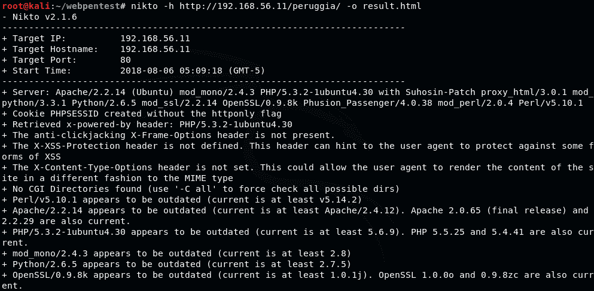

`-h`选项告诉 Nikto 扫描哪个主机，`-o`选项告诉它输出结果保存的位置，文件扩展名决定了文件的格式。在本例中，我们使用了`.html`来获得 HTML 格式的报告。输出也可以是 CSV、TXT 或 XML 格式。

1.  扫描完成需要一些时间。当扫描完成后，我们可以打开`result.html`文件：

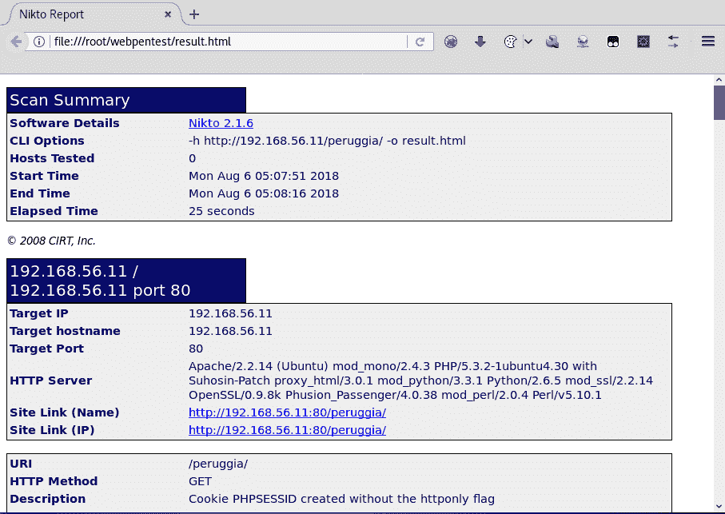

# 工作原理...

在本教程中，我们使用 Nikto 扫描了一个应用程序并生成了 HTML 报告。该工具还提供了其他选项来执行特定扫描或生成特定的输出格式。以下是一些最有用的选项：

+   `-H`：显示 Nikto 的帮助信息。

+   `-config <file>`：在扫描中使用自定义配置文件。

+   `-update`：更新插件数据库。

+   `-Format <format>`：定义输出格式；可以是 CSV、HTM、NBE（Nessus）、SQL、TXT 或 XML 等格式。当我们想将 Nikto 的结果作为其他工具的输入时，CSV、XML 和 NBE 等格式非常有用。

+   `-evasion <technique>`：使用一些编码技术帮助避免被 Web 应用防火墙和入侵检测系统检测到。

+   `-list-plugins`：查看可用的测试插件。

+   `-Plugins <plugins>`：选择在扫描中使用哪些插件（默认：全部）。

+   `-port <port number>`：如果服务器使用非标准端口（`80`、`443`），我们可能需要使用 Nikto 并选择此选项。

# 自动化扫描时的注意事项

普通漏洞扫描器如 OpenVas 和 Nessus 通常通过扫描目标机器的开放端口，识别这些端口上运行的服务及其版本，且不会发送可能导致服务器中断的恶意负载。相反，Web 漏洞扫描器通过提交数据到 Web 表单和参数中，尽管这些扫描器经过彻底测试且它们的负载旨在确保安全，但此类数据仍然可能会危及应用程序的稳定性和信息完整性。因此，在渗透测试项目中使用这些工具时，我们需要特别小心。

在本教程中，我们将讨论在企业环境中对目标应用程序进行自动化测试之前需要考虑的一系列方面。

# 如何操作...

在为 Web 应用程序准备自动化扫描时，以下是一些关键的考虑事项：

1.  始终优先选择测试环境而非生产环境，这样如果发生任何问题，真实数据不会丢失或损坏。

1.  确保有一个恢复机制。应用程序的所有者应该采取预防措施，以便在出现不良结果时能够恢复数据和代码。

1.  定义扫描范围。虽然我们可以直接对整个网站进行扫描，但建议首先定义工具的配置，避免扫描应用程序的敏感或不稳定部分，仅扫描与服务器架构和应用程序开发平台相关的模块。

1.  了解你的工具。始终抽时间在实验室中测试工具，了解它们的功能以及它们可能对应用程序正常运行产生的影响。

1.  保持工具及其模块的更新，以便结果与最新的漏洞披露和攻击技术保持一致。

1.  在启动扫描之前，检查扫描器的参数和范围，以确保不会执行超出范围的测试。

1.  保持扫描过程的全面日志。大多数工具都有保存其活动日志并发布发现报告的选项；始终使用这些功能，并以安全的方式存储日志。

1.  不要让扫描器无人看管。虽然在扫描过程中不必一直盯着屏幕，但我们需要保持警觉，并定期检查扫描进度，随时准备在发现扫描可能导致服务器或网络问题时立即停止。

1.  不要依赖单一工具。我们都有自己喜爱的工具，但需要记住，没有任何一款工具能够覆盖渗透测试中涉及的所有可能的替代方案，因此使用替代工具可以最大程度地减少误报和漏报的发生率。

# 它是如何工作的...

在这个示例中，我们展示了一些关键方面，帮助避免在对目标应用执行自动化扫描时造成信息损害和服务中断。

需要特殊措施的主要原因是，网络应用漏洞扫描器在默认配置下，倾向于爬取整个网站，并使用从爬取中获得的 URL 和参数继续发送负载和探针。在那些没有正确过滤接收数据的应用中，这些探针可能被存储在数据库中或被服务器执行，这可能会导致数据完整性问题、永久改变或损坏现有信息，甚至中断服务。

为了防止这些损害，我们推荐了一系列集中在准备测试环境、了解工具的工作原理、保持工具更新、仔细选择扫描对象并记录所有操作的措施。

# 使用 Wapiti 发现漏洞

Wapiti 是另一种基于终端的网络漏洞扫描工具，它向目标网站发送`GET`和`POST`请求，寻找以下漏洞（[`wapiti.sourceforge.net/`](http://wapiti.sourceforge.net/)）：

+   文件泄露

+   数据库注入

+   **跨站脚本攻击** (**XSS**)

+   命令执行检测

+   CRLF 注入

+   **XML 外部实体** (**XXE**) 注入

+   使用已知的潜在危险文件

+   弱`.htaccess`配置，可能被绕过

+   存在泄露敏感信息的备份文件（源代码泄露）

在这个示例中，我们将使用 Wapiti 发现我们的测试应用中的漏洞，并生成扫描报告。

# 如何操作...

Wapiti 是一个命令行工具；在 Kali Linux 中打开终端，并确保在开始之前运行易受攻击的虚拟机：

1.  在终端中，执行`wapiti http://192.168.56.11/peruggia/ -o wapiti_result -f html -m "-blindsql"`来扫描我们易受攻击的虚拟机中的 Peruggia 应用，输出以 HTML 格式保存在`wapiti_result`目录中，并跳过盲注 SQL 测试。

1.  等待扫描完成并打开报告所在目录，然后打开`index.html`文件；接着，你会看到类似这样的内容：

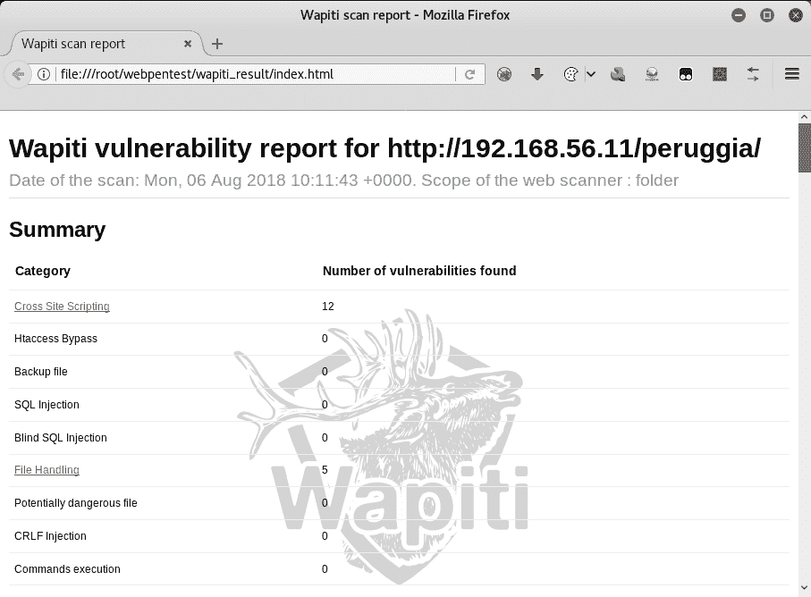

在这里，我们可以看到 Wapiti 已经发现了 12 个 XSS 漏洞和五个文件处理漏洞。

1.  现在，点击 Cross Site Scripting 查看漏洞的详细信息。

1.  选择一个漏洞并点击 HTTP 请求。我们将选择第二个，并选择并复制请求的 URL 部分：

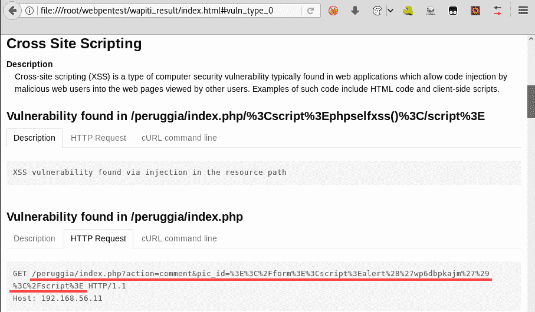

1.  现在，我们将那个 URL 粘贴到浏览器中，并添加服务器部分（`http://192.168.56.11/peruggia/index.php?action=comment&pic_id=%3E%3C%2F%3E%3Cscript%3Ealert%28%27wp6dpkajm%27%29%3C/script%3E`）；结果应如下所示：

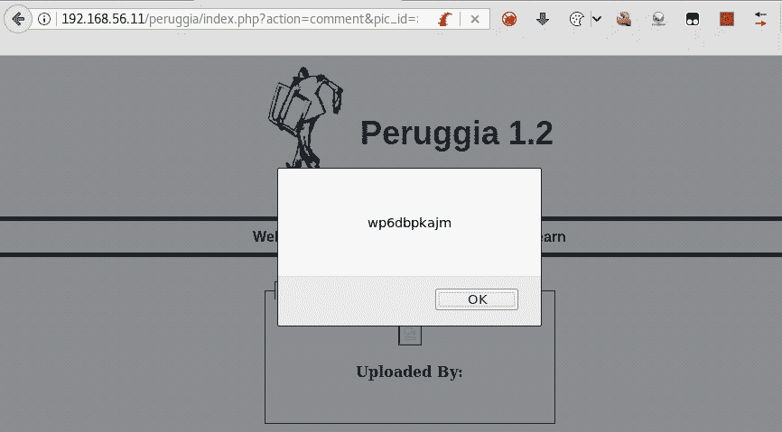

结果我们确实发现了一个 XSS 漏洞。

# 它的工作原理...

我们跳过了这次配方中的盲 SQL 注入测试（`-m "-blindsql"`），因为我们已经知道这个应用存在漏洞。当它达到计算基于时间的注入时，触发了一个超时错误，使得 Wapiti 在扫描完成前就关闭了，因为 Wapiti 会多次通过注入 `sleep()` 命令来测试，直到服务器超过超时阈值。

此外，我们选择了 HTML 格式的输出（`-f html`），并将 `wapiti_result` 作为报告的目标目录；我们也可以选择其他格式，如 JSON、OpenVas、TXT 或 XML。

Wapiti 中的其他有趣选项包括：

+   `-x <URL>`：从扫描中排除指定的 URL；对于登出和密码更改 URL 特别有用。

+   `-i <file>`：从 XML 文件恢复之前保存的扫描。文件名是可选的，如果省略，Wapiti 会从 `scans` 文件夹中获取文件。

+   `-a <login%password>`：使用指定的凭证对应用进行身份验证。

+   `--auth-method <method>`：定义 `-a` 选项的认证方式；可以是 `basic`、`digest`、`kerberos` 或 `ntlm`。

+   `-s <URL>`：定义扫描开始的 URL。

+   `-p <proxy_url>`：使用 HTTP 或 HTTPS 代理。

# 使用 OWASP ZAP 扫描漏洞

OWASP ZAP 是我们在本书中已使用过的工具，用于执行各种任务，在它的众多功能中，包括了一个自动化漏洞扫描器。它的使用和报告生成将在本配方中详细讲解。

# 准备工作

在我们成功执行 OWASP ZAP 漏洞扫描之前，我们需要先爬取该网站：

1.  打开 OWASP ZAP 并配置 Web 浏览器以使用其作为代理

1.  导航至 `http://192.168.56.11/peruggia/`

1.  按照 *使用 ZAP 的蜘蛛程序* 中的说明操作，见 第三章，*使用代理、爬虫和蜘蛛程序*

# 如何操作...

一旦你浏览完应用或运行了 ZAP 的蜘蛛程序，就可以开始扫描了：

1.  转到 OWASP ZAP 的 Sites 面板，右键单击 `peruggia` 文件夹。

1.  从菜单中，导航到 Attack | Active Scan，如下图所示：

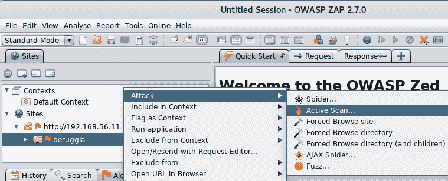

1.  一个新的窗口将弹出。此时，我们已经知道应用程序和服务器使用的技术，因此，进入“技术”标签（Technology），仅勾选 MySQL、PHP、Linux 和 Apache：

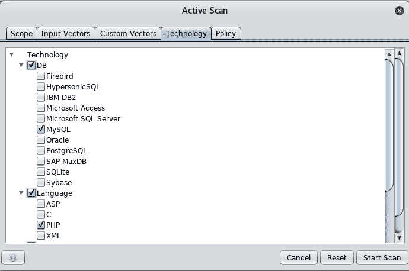

在这里，我们可以根据范围（Scope）（从哪里开始扫描，在哪些上下文中进行扫描等）、输入向量（Input Vectors）（选择是否测试`GET`和`POST`请求、头部、Cookie 和其他选项中的值）、自定义向量（Custom Vectors）（将原始请求中的特定字符或单词作为攻击向量）、技术（Technology）（执行特定技术测试）和策略（Policy）（为特定测试选择配置参数）来配置我们的扫描。

1.  点击“开始扫描”按钮（Start Scan）。

1.  “主动扫描”标签将在底部面板中显示，扫描期间所做的所有请求都会显示在此。

1.  扫描完成后，我们可以在“警报”标签页中查看结果，以下截图显示了该过程：

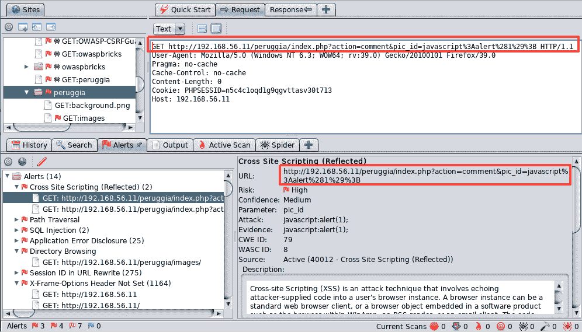

如果我们选择一个警报，可以看到请求和服务器返回的响应。这使我们能够分析攻击并确定它是否为真正的漏洞或误报。我们还可以利用这些信息进行模糊测试、在浏览器中重复请求，或进一步挖掘漏洞利用。

1.  如同前面提到的工具一样，要生成 HTML 报告，请进入主菜单中的报告（Report），然后选择生成 HTML 报告（Generate HTML Report）。

1.  一个新的对话框将要求输入文件名和位置。例如，设置为`zapresult.html`，完成后打开该文件：

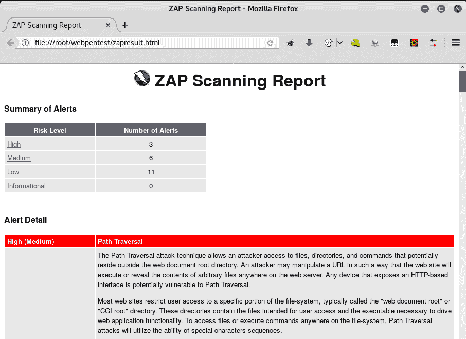

# 它是如何工作的……

OWASP ZAP 具备执行主动和被动漏洞扫描的能力；被动扫描是 OWASP ZAP 在我们浏览、发送数据和点击链接时进行的非侵入式测试。主动测试则是使用各种攻击字符串针对每个表单变量或请求值进行攻击，以检测服务器是否以我们可以称之为脆弱行为的方式作出响应。

OWASP ZAP 拥有适用于多种技术的测试字符串；首先识别目标所使用的技术非常有用，可以优化我们的扫描并减少被检测到或导致服务中断的可能性。

这个工具的另一个有趣功能是，我们可以在同一个窗口中分析导致检测到漏洞的请求及其相应的响应，并且在检测到的瞬间就进行分析。这使我们能够快速判断它是否为真正的漏洞或误报，以及是否开发我们的**概念验证**（**PoC**）或开始漏洞利用。

# 还有更多…

本书中我们也使用了 Burp Suite。Kali Linux 仅包括免费版，免费版没有主动和被动扫描功能。强烈建议购买 Burp Suite 的专业版，因为它比免费版提供了更有用的功能和改进，比如这些功能。

+   被动漏洞扫描会在我们浏览网页时发生，Burp Suite 配置为浏览器的代理。Burp 将分析所有请求和响应，并寻找与已知漏洞对应的模式。

+   在主动扫描中，Burp Suite 会向服务器发送特定的请求，并检查响应是否与某些漏洞模式匹配。这些请求是特别设计的，用于在应用程序存在漏洞时触发特定行为。

# 使用 Skipfish 扫描

Skipfish ([`code.google.com/archive/p/skipfish/`](https://code.google.com/archive/p/skipfish/)) 是由谷歌创建并于 2010 年公开发布的；其创建者将其描述为一种主动的 Web 应用安全侦察工具，默认包含在 Kali Linux 中，且它不仅仅是纯粹的侦察工具。它是一个完整的漏洞扫描器。它的一些亮点包括：

+   高速：它的请求速度可以达到每秒超过 400 次，并声称在高速局域网中可以达到超过 2000 次。

+   它的命令行选项简单易用。

+   它可以检测各种问题，从目录列出和其他信息泄露漏洞，到不同类型的 SQL 和 XML 注入。

在本食谱中，我们将看一个简单的例子，了解如何使用 Skipfish 并检查其结果。

# 如何操作...

在 Kali Linux 中安装的 Skipfish 已经可以直接使用。我们将用它扫描 Peruggia：

1.  打开终端并执行`skipfish -o skipfish_result -I peruggia http://192.168.56.11/peruggia/`。

1.  将出现一条包含一些使用建议的消息；按 *Enter* 键或等待 60 秒，扫描就会开始。

1.  扫描将开始，扫描统计信息会显示在屏幕上。*Ctrl* + *C* 可以随时停止扫描。扫描时，终端窗口会显示如下内容：

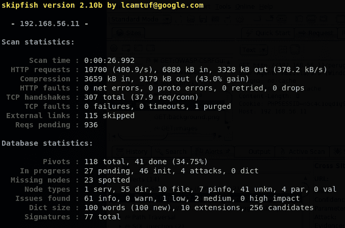

1.  扫描完成后，打开报告。在我们的例子中，报告将位于`skipfish_result/index.html`，相对于我们运行 Skipfish 的目录。

1.  在“问题类型概览 - 点击展开：”部分中，我们可以点击问题名称，查看每个问题的确切 URL 和有效载荷，显示如下：

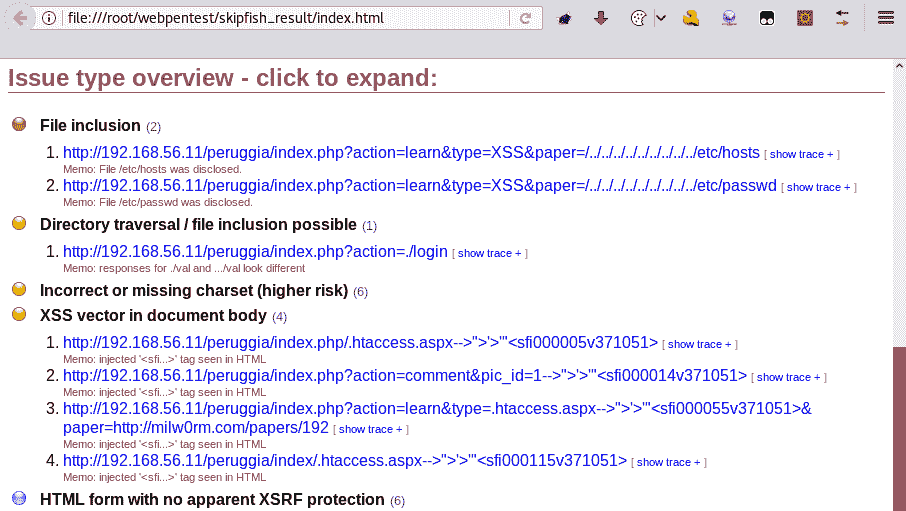

# 它是如何工作的...

Skipfish 将首先通过爬取网站并可选地使用字典进行目录和文件名扫描来构建站点地图。然后，站点地图会通过多个安全检查进行处理。

在这个例子中，我们使用它扫描了我们的易受攻击虚拟机中的 Peruggia。为了防止它扫描整个服务器，我们使用了`-I peruggia`选项，该选项只扫描包含指定文本的 URL。我们还使用了`-o`选项来告诉 Skipfish 保存报告的位置；在扫描运行时，这个目录必须不存在。

Skipfish 的主要缺点是根据其 Google Code 页面，它自 2012 年以来没有更新，因此可能无法针对新技术和攻击向量。尽管如此，它仍然是一个非常有用的工具。

# 使用 WPScan 查找 WordPress 漏洞

WordPress 是全球使用最多的**内容管理系统**（**CMS**）之一，甚至可能是最常用的。CMS 是一个应用程序——通常是一个 Web 应用程序——使用户可以轻松创建完全功能的网站，无需或只需少量编程知识。WPScan 是一个专门用于检测 WordPress 网站漏洞的漏洞扫描工具。

在这个实例中，我们将使用 WPScan 来识别安装在 OWASP BWA 虚拟机中的 WordPress 网站上的漏洞组件。

# 如何操作...

WPScan 是一个命令行工具；打开终端开始使用：

1.  使用 `wpscan http://192.168.56.11/wordpress/` 命令对我们的目标运行 WPScan；该 URL 是我们要扫描的 WordPress 网站的位置。

1.  如果这是你第一次运行 WPScan，它会要求更新数据库，这需要互联网连接。在我们的实验室环境中，Kali Linux 虚拟机没有互联网连接，因此最好先更改其网络设置，更新我们使用的工具，并在完成后将其重新连接到实验室。要更新，只需在提示时回答`Y`并按*Enter*键。以下截图显示了预期的输出：

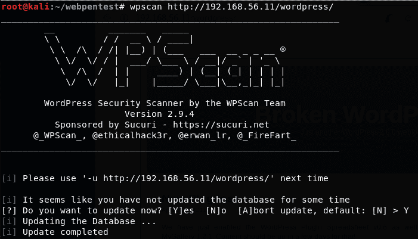

1.  更新完成后，WPScan 将继续扫描目标网站。它将在终端中显示其发现的内容；例如，在以下截图中，我们可以看到它检测到 Web 服务器和 WordPress 版本，并且该特定版本存在若干漏洞：

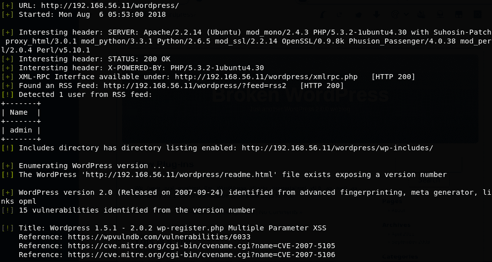

1.  通过关于现有漏洞的信息，我们可以跟踪参考资料并搜索已发布的漏洞利用工具；例如，如果我们搜索 CVE-2007-5106，这是用户注册表单中的 XSS 漏洞，我们会发现 Security Focus 上发布了一个漏洞利用：[`www.securityfocus.com/bid/25769/exploit`](https://www.securityfocus.com/bid/25769/exploit)。

1.  寻找其他漏洞并尝试利用 WPScan 识别的漏洞。

# 它是如何工作的...

WordPress 允许没有开发 Web 应用程序经验的用户创建自己的网站，用户可以加入由其他用户创建的插件，而这些插件并不需要经过与主 CMS 相同的质量保证和测试；这意味着，当其中一个插件或模块存在严重安全漏洞时，成千上万的用户可能已经在他们的网站上安装了易受攻击的代码，并且暴露于可能会危及整个服务器的攻击中。

在这个教程中，我们使用 WPScan 来识别旧版 WordPress 安装中的漏洞。我们首先更新了工具的数据库；这在连接互联网时会自动完成。完成更新后，扫描通过识别已安装的 WordPress 版本、用户和网站使用的插件继续进行；通过这些信息，WPScan 在其数据库中搜索已知的漏洞，并在终端显示结果。扫描完成后，我们查找了已识别问题的信息和漏洞利用。进一步利用这些漏洞的工作留给读者。

# 使用 JoomScan 查找 Joomla 中的漏洞

另一个在全球广泛使用的内容管理系统（CMS）是 Joomla。与 WordPress 一样，Joomla 基于 PHP，其目标是帮助没有技术知识的用户创建网站，尽管它可能不像 WordPress 那样用户友好，更适合用于电子商务网站，而非博客和新闻网站。

Kali Linux 还包含一个专门用于查找 Joomla 安装漏洞的漏洞扫描工具——JoomScan。在本教程中，我们将使用它来分析安装在我们易受攻击的虚拟机`vm_1`上的 Joomla 网站。

# 如何操作…

与 Kali Linux 中的大多数工具一样，JoomScan 是一个命令行工具，因此我们需要打开终端来运行它：

1.  首先运行`joomscan -h`查看如何使用该工具及其选项，如下图所示：

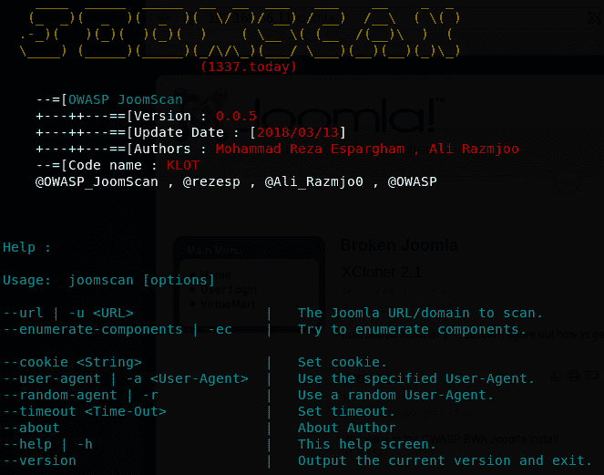

1.  现在我们知道需要使用`-u`选项，后面跟上我们想扫描的网址，我们还可以修改请求中的其他参数，如 cookies 和用户代理。我们将运行最简单的命令：`joomscan -u http://192.168.56.11/joomla/`。

1.  JoomScan 将开始扫描并显示结果。如下面的截图所示，这些结果包括受影响的 Joomla 版本、漏洞类型、CVE 编号以及对渗透测试人员非常有用的 Exploit-DB 参考，如果有公开的漏洞利用可用：

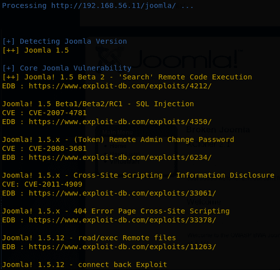

1.  当扫描完成后，JoomScan 将显示扫描报告存储的路径。此路径是相对于 JoomScan 安装路径的；在我们的例子中，报告保存在`/usr/share/joomscan/reports/192.168.56.11/`：

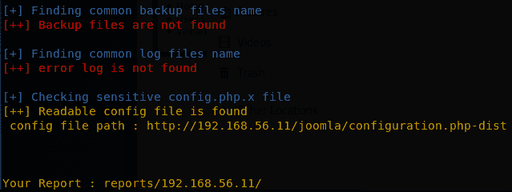

1.  我们可以打开给定目录并查看报告，该报告是 HTML 格式的，如下图所示：

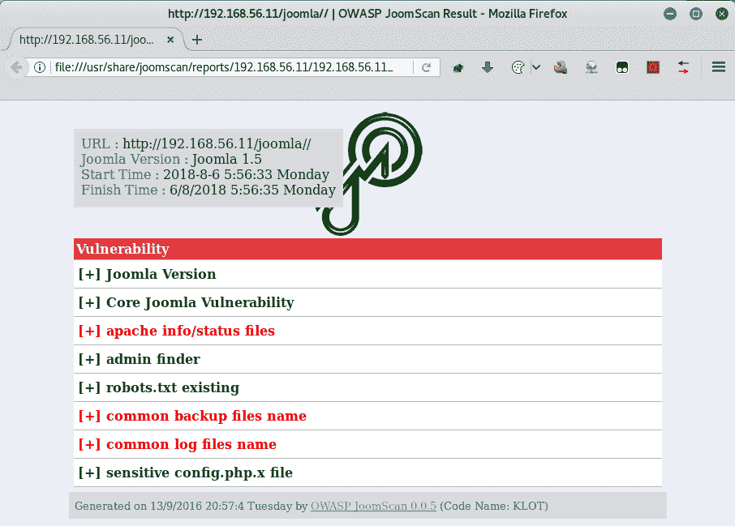

# 它是如何工作的…

在本教程中，我们使用了 JoomScan 来识别脆弱安装中的漏洞。这个工具识别 Joomla 的版本和启用的插件，并将这些信息与其已知漏洞和漏洞利用的数据库进行对比。这个过程的结果显示在终端中，并以 HTML 格式保存报告。JoomScan 在扫描结束时会提供该报告的保存位置。

# 使用 CMSmap 扫描 Drupal

另一个流行的 CMS 是 Drupal，它也是开源的，并与前面提到的 CMS 一样基于 PHP。虽然它的使用范围不如其他 CMS 广泛，但根据其官方网站的数据（[`www.drupal.org/project/usage/drupal`](https://www.drupal.org/project/usage/drupal)），它仍然占据了相当大的市场份额，超过 100 万个网站在使用它。

在本教程中，我们将安装 CMSmap，一个用于扫描 Drupal、WordPress 和 Joomla 漏洞的工具，并使用它来识别安装在 bee-box 中的 Drupal 版本的漏洞。找到相关的攻击向量后，我们将利用它并获得服务器上的命令执行权限。

# 准备工作

CMSmap 没有预装在 Kali Linux 中，也不包含在其官方软件库中；然而，我们可以很容易地从其 GitHub 库获取它。打开终端并运行`git clone https://github.com/Dionach/CMSmap.git`；这将把最新的源代码下载到`CMSmap`目录中。由于它是用 Python 编写的，因此不需要编译代码，直接可以运行。要查看使用示例和可用选项，请进入`CMSmap`目录并运行`python cmsmap.py`命令。此过程如以下截图所示：

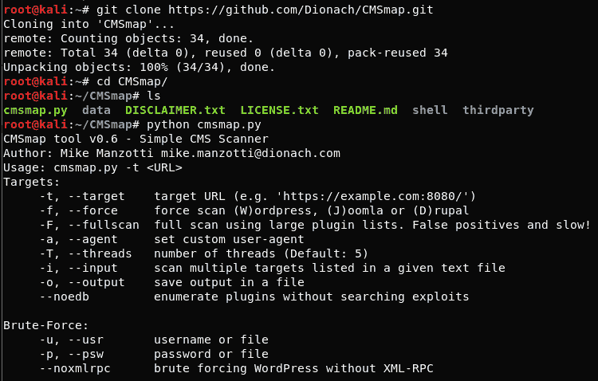

# 如何操作...

一旦我们准备好运行 CMSmap，启动 bee-box。在这个例子中，它的 IP 地址是`192.168.56.12`。

1.  访问`http://192.168.56.12/drupal/`来验证是否有正在运行的 Drupal 版本。结果应该如下所示：

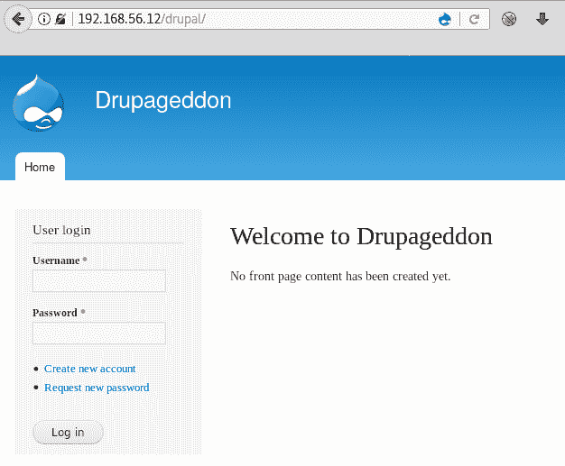

1.  现在，启动扫描器针对站点进行扫描。打开终端，进入下载 CMSmap 的目录，并运行`python cmsmap.py -t http://192.168.56.12/drupal`命令。以下截图展示了结果应该如何显示：

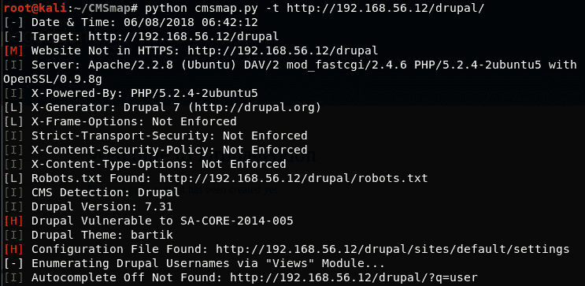

我们可以看到一些漏洞排名较高（红色的`[H]`）。其中之一是 SA-CORE-2014-005；通过快速的谷歌搜索，我们可以知道这是一个 SQL 注入漏洞，这个漏洞也被昵称为`Drupageddon`（恰好与我们的目标站点名称相同）。

1.  现在，让我们看看是否有简单的方法来利用这个众所周知的漏洞。打开 Metasploit 控制台（`msfconsole`），搜索`drupageddon`；你应该能找到至少一个漏洞利用，如下所示：

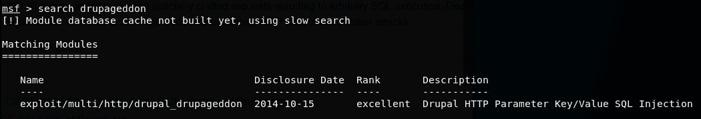

1.  使用`multi/http/drupal_drupageddon`模块，并根据场景设置选项，使用通用反向 shell。下一张截图显示了最终设置：

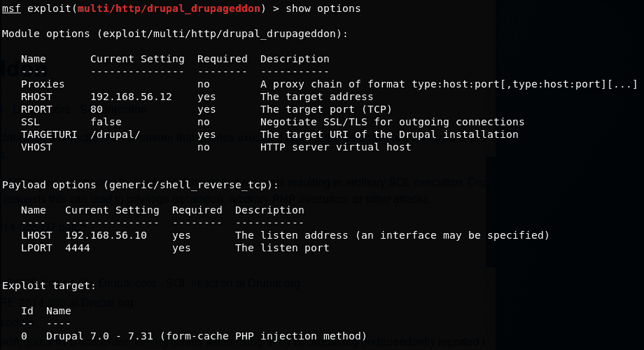

1.  运行利用并验证我们是否有命令执行权限，如下所示：

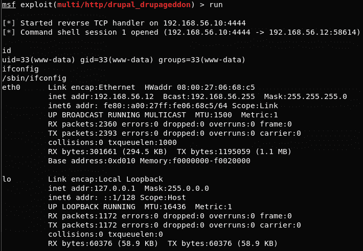

# 工作原理如下...

在这个示例中，我们首先使用`git`命令行客户端从其 GitHub 源代码仓库下载了 CMSmap，使用`clone`命令创建了指定仓库的本地副本。安装完成 CMSmap 后，我们检查其是否准备就绪并查看了使用选项，然后针对我们的目标运行了它。

在结果中，我们看到一个由扫描器评定为高影响的漏洞，并在线查找相关信息，发现它是一个 SQL 注入漏洞，有几个公开的利用方式。

此漏洞在 Drupal 的安全公告 SA-CORE-2014-005 中披露（[`www.drupal.org/forum/newsletters/security-advisories-for-drupal-core/2014-10-15/sa-core-2014-005-drupal-core-sql`](https://www.drupal.org/forum/newsletters/security-advisories-for-drupal-core/2014-10-15/sa-core-2014-005-drupal-core-sql)）。根据该公告，这是一个 SQL 注入漏洞，可用于特权升级、PHP 执行，并且正如我们在例子中看到的那样，在受影响的主机上执行命令。

我们选择在 Metasploit 中查找现有的利用方式。我们使用的利用方式有两种方法可以实现远程 shell：第一种方法利用 SQLi 将恶意内容上传到 Drupal 的缓存，并触发该缓存条目执行有效负载。我们的利用方式选择了这个选项，因为我们没有修改`TARGET`参数（从`0`改为`1`）。第二种方法是在 Drupal 中创建一个管理员用户，并使用该用户上传 PHP 代码以供服务器执行。

最后，我们在服务器上获得了有限的 shell，可以执行非交互式命令并检索信息。
