# 第八章：中间人攻击

> 作者：Gilberto Najera-Gutierrez

> 译者：[飞龙](https://github.com/)

> 协议：[CC BY-NC-SA 4.0](http://creativecommons.org/licenses/by-nc-sa/4.0/)

## 简介

中间人（MITM）攻击是一种攻击类型，其中攻击者将它自己放到两方之间，通常是客户端和服务端通信线路的中间。这可以通过破坏原始频道之后拦截一方的消息并将它们转发（有时会有改变）给另一方来实现。

让我们观察下面这个例子：


Alice 连接到了 Web 服务器上，Bob 打算了解 Alice 正在发送什么信息。于是 Bob 建立 MITM 攻击，通过告诉服务器他是 Alice，并且告诉 Alice 他是服务器。现在，所有 Alice 的请求都会发给 Bob，Bob 会将它们转发给服务器，并对服务器的响应做相同操作。这样，Bob 就能够拦截、读取或修改所有 Alice 和服务器之间的流量。

虽然 MITM 攻击并不特定与 Web 攻击，了解如何执行它们，以及如何防止它们，对于任何渗透测试者都非常重要，因为它们可以用于偷取密码，劫持会话，或者执行 Web 应用中的非授权操作。

这一章中，我们会建立起中间人攻击，并使用它来获得信息，以及执行更加复杂的攻击。

## 8.1 使用 Ettercap 执行欺骗攻击

地址解析协议（ARP）欺骗可能是最常见的 MITM 攻击。它基于一个事实，就是 ARP 并不验证系统所收到的响应。这就意味着，当 Alice 的电脑询问网络上的所有设备，“IP 为 xxx.xxx.xxx.xxx 的机器的 MAC 地址是什么”时，它会信任从任何设备得到的答复。该设备可能是预期的服务器，也可能是不是。ARP 欺骗或毒化的工作方式是，发送大量 ARP 响应给通信的两端，告诉每一端攻击者的 MAC 地址对应它们另一端的 IP 地址。

这个秘籍中，我们会使用 Ettercap 来执行 ARP 欺骗攻击，并将我们放到客户端和服务器之间。

### 准备

对于这个秘籍，我们会使用第一章配置的客户端虚拟机，和 vulnerable_vm。客户端的 IP 是 192.168.56.101，vulnerable_vm 是 192.168.56.102。

### 操作步骤

1.  将两个虚拟机打开，我们的 Kali Linux（192.168.56.1）主机是攻击者的机器。打开终端窗口并输入下列命令：

    ```
    ettercap –G 
    ```
    
    从 Ettercap 的主菜单中，选择`Sniff | Unified Sniffing`。
    
2.  在弹出的对话框中选择你打算使用的网络接口，这里我们选择`vboxnet0`，像这样：

    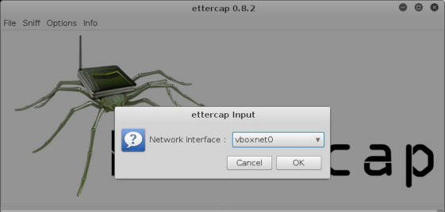
    
3.  既然我们嗅探了网络，下一步就是识别哪个主机正在通信。访问主菜单的`Hosts`之后选择`Scan for hosts`。

4.  从我们发现的主机中，选择我们的目标。从`Hosts `菜单栏中选择`Hosts list`。

    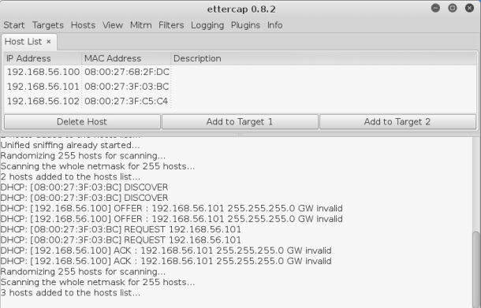
    
5.  从列表中选择`192.168.56.101`，并点击`Add to Target 1`。

6.  之后选择`192.168.56.102 `，之后点击`Add to Target 2`。

7.  现在我们检查目标：在`Targets`菜单中，选择` Current targets`。

    

8.  我们现在准备好了开始欺骗攻击，我们的位置在服务器和客户端中间，在`Mitm `菜单中，选择`ARP poisoning`。

9.  在弹出的窗口中，选中`Sniff remote connections`，然后点击`OK`。

    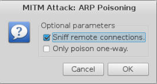

这就结束了，我们现在可以看到在客户端和服务端之间的流量。

### 工作原理

在我们键入的第一个命令中，我们告诉 Ettercap 启动 GTK 界面。

> 其它界面选项为`-T`启动文本界面，`-C`启动光标（以 ASCII 文本），`-D`运行为守护进程，没有界面。

之后，我们启动了 Ettercap 的嗅探功能。统一模式意味着我们会通过单一网络接口接受并发送信息。当我们的目标通过不同网络接口到达时，我们选择桥接模式。例如，如果我们拥有两个网卡，并且通过其一连接到客户端，另一个连接到服务端。

在嗅探开始之后，我们选择了目标。

> 事先选择你的目标

> 单次攻击中，选择唯一必要主机作为目标非常重要，因为毒化攻击会生成大量网络流量，并导致所有主机的性能问题。在开始 MITM 攻击之前，弄清楚那两个系统会成为目标，并仅仅欺骗这两个系统。

一旦设置了目标，我们就可以开始 ARP 毒化攻击。`Sniffing remote connections`意味着 Ettercap 会捕获和读取所有两端之间的封包，`Only poison one way`在我们仅仅打算毒化客户端，而并不打算了解来自服务器或网关的请求时（或者它拥有任何对 ARP 毒化的保护时）非常实用。

## 8.2 使用 Wireshark 执行 MITM 以及捕获流量

Ettercap 可以检测到经过它传播的相关信息，例如密码。但是，在渗透测试的时候，它通常不足以拦截一些整数，我们可能要寻找其他信息，类似信用卡的号码，社会安全号码，名称，图片或者文档。拥有一个可以监听网络上所有流量的工具十分实用，以便我们保存和之后分析它们。这个工具是个嗅探器，最符合我们的目的的工具就是 Wireshark，它包含于 Kali Linux。

这个秘籍中，我们会使用 Wireshark 来捕获所有在客户端和服务端之间发送的封包来获取信息。

### 准备

在开始之前我们需要让 MITM 工作。

### 操作步骤

1.  从 Kali `Applications`菜单的`Sniffing & Spoofing`启动 Wireshark，或者从终端中执行：

    ```
    wireshark 
    ```
    
2.  当 Wireshark 加载之后，选项你打算用于捕获封包的网卡。我们这里选择`vboxnet0`，像这样：

    
    
3.  之后点击`Start`。你会立即看到 Wireshark 正在捕获 ARP 封包，这就是我们的攻击。


    
    
4.  现在，来到客户端虚拟机，浏览`http://192.168.56.102/ dvwa`，并登陆 DVWA。

5.  在 Wireshark 中的`info `区域中，查找来自`192.168.56.101`到`192.168.56.102`，带有 POST `/dvwa/login.php` 的 HTTP 封包。

    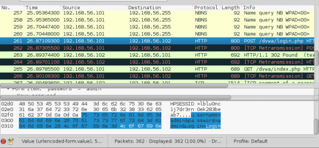
    
    如果我们浏览所有捕获的封包，我们会看到一个封包对应授权，并会看到我们可以以纯文本获得用户名和密码。
    
    > 使用过滤器
    
    > 我们可以在 Wireshark 中使用过滤器来只展示我们感兴趣的封包。例如，为了只查看 登录页面的 HTTP 请求，我们可以使用：`http. request.uri contains "login"`。
    
    如果我们查看 Ettercap 的窗口，我们也能看到用户名和密码，像这样：
    
    
    
    通过捕获客户端和服务端之间的流量，攻击者能够提取和利用所有类型的敏感信息，例如用户名、密码、会话 Cookie、账户号码、信用卡号码、私人邮件，以及其它。
    
### 工作原理

Wireshark 监听每个我们选择监听的接口上的封包，并在它的界面中显示。我们可以选择监听多个接口。

当我们首先启动嗅探的时候，我们了解了 ARP 欺骗如何工作。它发送大量 ARP 封包给客户端和服务端，以便防止它们的地址解析表（ARP 表）从正当的主机获得正确的值。

最后，当我们向服务器发送请求时，我们看到了 Wireshark 如何捕获所有包含在请求中的信息，包含协议、来源和目的地 IP。更重要的是，它包含了由客户端发送的数据，其中包含管理员密码。

### 另见

研究 Wireshark 数据有一些无聊，所以了解如何在捕获封包时使用显示过滤器非常重要。你可以访问下列站点来了解更多信息。

+ https://www.wireshark.org/docs/wsug_html_chunked/ChWorkDisplayFilterSection.html
+ https://wiki.wireshark.org/DisplayFilters

使用 Wireshark，你可以通过捕获过滤器来选择捕获哪种数据。这是非常实用的特性，尤其是执行 MITM 攻击时生成大量流量的时候。你可以从下列站点中阅读更多信息。

+ https://www.wireshark.org/docs/wsug_html_chunked/ChCapCaptureFilterSection.html
+ https://wiki.wireshark.org/CaptureFilters

## 8.3 修改服务端和客户端之间的数据

在执行 MITM 攻击时，我们不仅仅能够监听在受害者系统之间发送的任何数据，也能够修改请求和响应，因而按照我们的意图调整它们的行为。

这个秘籍中，我们会使用 Ettercap 过滤器来检测封包是否包含我们感兴趣的信息，并触发改变后的操作。

### 准备

在开始之前我们需要让 MITM 工作。

### 操作步骤

1.  我们的第一步是创建过滤器文件。将下列代码保存到文本文件中（我们命名为`regex-replace-filter.filter`）:

    ```
    # If the packet goes to vulnerable_vm on TCP port 80 (HTTP) 
    if (ip.dst == '192.168.56.102'&& tcp.dst == 80) {
        # if the packet's data contains a login page    
        if (search(DATA.data, "POST")){        
            msg("POST request");        
            if (search(DATA.data, "login.php") ){
                msg("Call to login page");            
                # Will change content's length to prevent server from failing            
                pcre_regex(DATA.data, "Content-Length\:\ [0-9]*","Content-Length: 41");            
                msg("Content Length modified");            
                # will replace any username by "admin" using a regular expression            
                if (pcre_regex(DATA.data, "username=[a-zAZ]*&","username=admin&"))    {
                    msg("DATA modified\n");              
                }            
                msg("Filter Ran.\n");        
            }    
        } 
    }
    ```
    
    > `#` 符号使注释。这个语法非常类似于 C，除了注释和一些不同。
    
2.  下面我们需要为 Ettercap 编译过滤器来使用它。从终端中，执行下列命令。

    ```
    etterfilter -o regex-replace-filter.ef regex-replace-filter.filter
    ```
    
    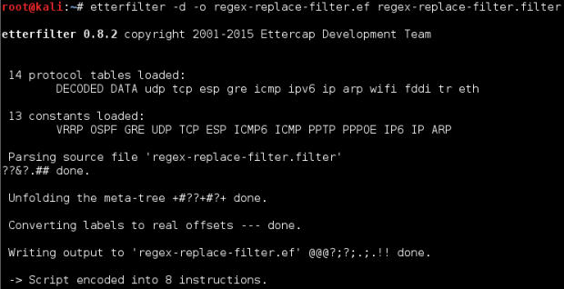
    
3.  现在，从 Ettercap 的菜单中，选择`Filters | Load a filter`，后面是`regexreplace-filter.ef`，并点击`Open`。

    我们会看到 Ettercap 的日志窗口中出现新的条目，表明新的过滤器已经加载了。
    
    
    
    用户现在登陆为管理员，并且攻击者拥有了对两个用户都生效的密码。)
    
5.  如果我们检查 Ettercap 的日志，我们可以看到我们编写在代码中的消息会出现在这里，像这样：

    
    
### 工作原理

ARP 欺骗攻击是更加复杂的攻击的开始。这个秘籍中，我们使用了 Ettercap 的封包过滤功能来识别带有特定内容的封包，并修改它来强制让用户以管理员登录应用。这也可以从服务端到客户端来完成，可以用来通过展示一些伪造信息来欺骗用户。

我们的第一步是创建过滤脚本，它首先检查被分析的封包是否含有我们打算改变的信息，像这样：

```
if (ip.dst == '192.168.56.102'&& tcp.dst == 80) { 
```

如果目标 IP 是  vulnerable_vm 之一，且 TCP 端口是 80（默认 HTTP 端口号），它就是发往我们打算拦截的服务器的请求。

```
if (search(DATA.data, "POST")){    
    msg("POST request");    
    if (search(DATA.data, "login.php") ){
```

如果请求使用 POST 方法，且去往`login.php`页面，它就是登录尝试，因为这是我们的目标应用接收登录尝试的方式。

```
pcre_regex(DATA.data, "Content-Length\:\ [0-9]*","Content-Length: 41");
```

我们使用正则表达式来获取请求中的`Content-Length`参数，并将它的值改为 41，这是我们发送带有`admin/admin`凭证的登录封包的长度。

```
if (pcre_regex(DATA.data, "username=[a-zA-Z]*&","username=admin&")){    
    msg("DATA modified\n");  
} 
```

同样，使用正则表达式，我们在请求中查找用户名称值，并将它替换为`admin`。

消息（`msg`）仅仅用于跟踪和调试目的，可以被从脚本中忽略。

在编写完脚本之后，我们使用 Ettercap 的 etterfilter 编译他，以便执行它。之后，我们在 Ettercap 中加载它，然后等待客户端连接。

## 8.4 发起 SSL MITM 攻击

如果我们使用我们目前的方法嗅探 HTTPS 会话，我们不能从中得到很多信息，因为所有通信都是加密的。

为了拦截、读取和修改 SSL 和 TLS 的连接，我们需要做一系列准备步骤，来建立我们的 SSL 代理。SSLsplit 的仿作方式是使用两个证书，一个用于告诉服务器这是客户端，以便它可以接收和解密服务器的响应，另一个告诉客户端这是服务器。对于第二个证书，如果我们打算代替一个拥有自己的域名的网站，并且它的证书由认证中心（CA）签发，我们就需要让 CA 为我们签发根证书，但因为我们是攻击者，我们就需要自己来做。

这个秘籍中，我们会配置我们自己的 CA，以及一些 IP 转发规则来执行 SSL 中间人攻击。

### 操作步骤

1.  首先，我们打算在 Kali 上创建 CA 私钥，所以在 root 终端中键入下列命令：

    ```
    openssl genrsa -out certaauth.key 4096 
    ```
    
2.  现在让我们创建一个使用这个密钥签名的证书：

    ```
    openssl req -new -x509 -days 365 -key certauth.key -out ca.crt 
    ```
    
3.  填充所需信息（或者仅仅对每个字段按下回车）。

4.  下面，我们需要开启 IP 转发来开启系统的路由功能（将目标不是本地主机的 IP 包转发到网关）：

    ```
    echo 1 > /proc/sys/net/ipv4/ip_forwar
    ```
    
5.  现在我们打算配置一些会泽来防止转发任何东西。首先，让我们检查我们的 iptables 的`nat`表中是否有任何东西：

    ```
    iptables -t nat -L
    ```
    
    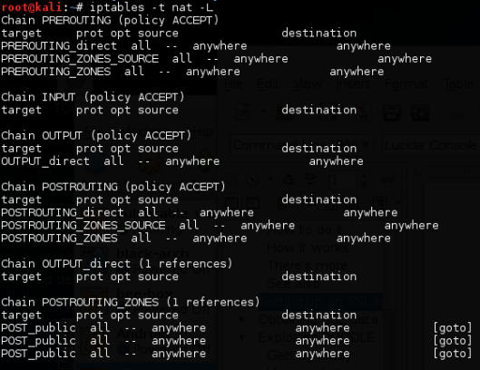
    
6.  如果有东西，你可能打算备份一下，因为我们会刷新它们，如下：

    ```
    iptables -t nat -L > iptables.nat.bkp.txt 
    ```
    
7.  现在让我们刷新整个表。

    ```
    iptables -t nat -F
    ```
    
8.  之后我们建立 PREROUTING 规则：

    ```
    iptables -t nat -A PREROUTING -p tcp --dport 80 -j REDIRECT --toports 8080 
    iptables -t nat -A PREROUTING -p tcp --dport 443 -j REDIRECT --toports 8443 
    ```
    
现在我们已经准备好嗅探加密连接。

### 工作原理

这个秘籍中，我们配置了 Kali 主机来充当 CA，这意味着它可以校验 SSLsplit 使用的证书。在前两步中，我们仅仅创建了私钥，和使用私钥签名的证书。

下面，我们建立了端口转发规则。我们首先开启了转发选项，之后创建了 iptables 规则来将 80 端口的请求转发到 443（HTTP 到 HTTPS）。这是为了重定向请求。我们的 MITM 攻击会拦截 SSLsplit，便于它使用一个证书来解密收到的消息、处理它，使用另一个证书加密并发送到目的地。

### 另见

你应该了解更多加密证书以及 SSL 和 TLS 协议，还有 SSLsplit，可以访问这里：

+ https://en.wikipedia.org/wiki/Public_key_certificate 
+ https://www.roe.ch/SSLsplit 
+ https://en.wikipedia.org/wiki/Iptables 
+ `man iptables`

## 8.5 使用 SSLsplit 获得 SSL 数据

在之前的密集中，我们准备了环境来攻击 SSL/TLS 连接。而这个秘籍中，我们会使用 SSLsplit 来完成 MITM 攻击并从加密连接中提取信息。

### 准备

我们需要在开始秘籍之前执行 ARP 欺骗攻击，并成功完成了上一个秘籍。

### 操作步骤

1.  首先，我们需要创建目录，其中 SSLsplit 在里面存放日志。打开终端并创建两个目录，像这样：

    ```
    mkdir /tmp/sslsplit 
    mkdir /tmp/sslsplit/logdir
    ```
    
2.  现在，让我们启动 SSLSplit：

    ```
    sslsplit -D -l connections.log -j /tmp/sslsplit -S logdir -k certauth.key -c ca.crt ssl 0.0.0.0 8443 tcp 0.0.0.0 8080
    ```
    
    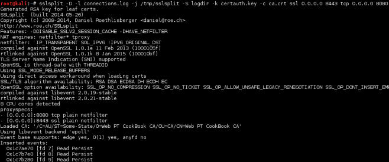
    
3.  现在，SSLSplit 正在运行，Windows 客户端和 vulnerable_vm 之间存在 MITM，来到客户端并访问` https://192.168.56.102/dvwa/`。

4.  浏览器会要求确认，因为我们的 CA 和证书并不是被任何浏览器官方承认的。设置例外并继续。

    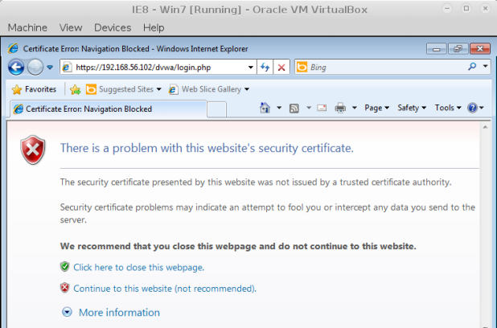
    
5.  现在登录 DVWA ，使用管理员用户和密码。

6.  让我们看看 SSLSplit 中发生了什么。打开新的终端并检查日志内容，在我们为 SSLSplit 创建的目录中：

    ```
    ls /tmp/sslsplit/logdir/ 
    cat /tmp/sslsplit/logdir/*
    ```
    
    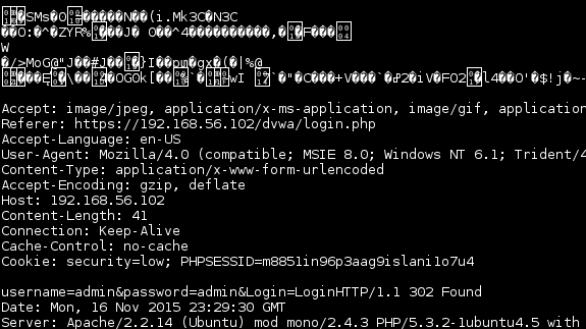
    
现在，即使 Ettercap 和 Wireshark 只能看到加密数据，我么也可以以纯文本在 SSLSplit 中查看通信。

### 工作原理

这个秘籍中，我们继续 SSL 连接上的攻击。在第一步中，我们创建了目录，其中 SSLSplit 会将捕获到的信息存在里面。

第二部就是使用下列命令执行 SSLSplit：

+   `-D`：这是在前台运行 SSLSplit，并不是守护进程，并带有详细的输出。

+   `-l connections.log`：这将每个连接的记录保存到当前目录的` connections.log`中。

+   `-j /tmp/sslsplit`：这用于建立`jail directory`目录，`/tmp/sslsplit`会作为 root（`chroot`）包含 SSLSplit 的环境。

+   `-S logdir`：这用于告诉 SSLSplit 将内容日志（所有请求和响应）保存到`logdir`（在 jail 目录中），并将数据保存到单独的文件中。

+   `-k`和`-c`：这用于指明和充当 CA 时，SSLSplit 所使用的私钥和证书。

+   `ssl 0.0.0.0 8443`：这告诉 SSLSplit 在哪里监听 HTTPS（或者其它加密协议）连接。要记住这是我们在上一章中使用 iptables 从 443 转发的接口。

+   `tcp 0.0.0.0 8080`：这告诉 SSLSplit 在哪里监听 HTTP 连接。要记住这是我们在上一章中使用 iptables 从 80 转发的接口。

在执行这些命令之后，我们等待客户端浏览器服务器的 HTTPS 页面并提交数据，之后我们检查日志文件来发现未加密的信息。

## 8.6 执行 DNS 欺骗并重定向流量

DNS 欺骗是一种攻击，其中执行 MITM 攻击的攻击者使用它来修改响应受害者的 DNS 服务器中的名称解析，发送给他们恶意页面，而不是他们请求的页面，但仍然使用有效名称。

这个秘籍中，我们会使用 Ettercap 来执行 DNS 欺骗攻击，并在受害者打算浏览别的网站时，使其浏览我们的网站。

### 准备

对于这个秘籍，我们需要使用我们的 WIndows 客户端虚拟机，但是这次网络识别器桥接到 DNS 解析中。这个秘籍中它的 IP 地址为 192.168.71.14。

攻击者的机器是我们的 Kali 主机，IP 为  192.168.71.8。它也需要运行 Apache 服务器，并拥有`index.html`演示页面，我们会包含下列东西：

```html
<h1>Spoofed SITE</h1>
```

### 操作步骤

1.  假设我们已经启动了 Apache 服务器，并正确配置了伪造页面，让我们编辑`/etc/ettercap/etter.dns`，使它仅仅包含下面这一行：

    ```
    * A 192.168.71.8 
    ```
    
    我们仅仅设置一条规则：所有 A 记录（地址记录）都解析到`192.168.71.8`，这是我们 Kali 的地址。我们可以设置其他条目，但是我们打算在这里避免干扰。
    
2.  这次，我们从命令行运行 Ettercap。打开 root 终端并键入下列命令：

    ```
    ettercap -i wlan0 -T -P dns_spoof -M arp /192.168.71.14///
    ```
    
    它会以文本模式运行 Ettercap，并开启 DNS 欺骗插件来执行 ARP 欺骗攻击，目标仅仅设置为`192.168.71.14`。
    
    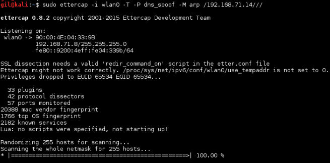
    
3.  启动攻击之后，我们来到客户端主机，并尝试通过网站自己的域名来浏览网站，例如，` www.yahoo.com`，像这样：

    
    
    要注意，现在地址和标签栏显示原始站点的名称，但是内容来自不同的地方。
    
4.  我们也可以尝试使用`nslookup`执行地址解析，像这样：

    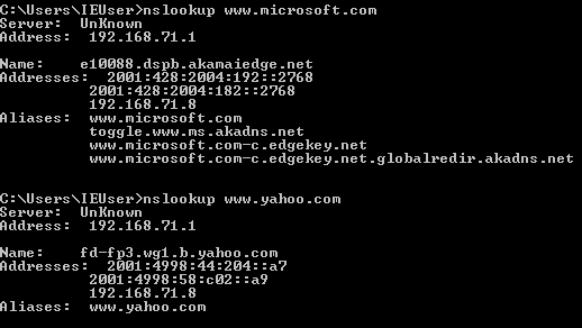
    
### 工作原理

这个秘籍中，我们看到如何使用中间人攻击来强制用户浏览某个页面，他们甚至相信自己在其它站点上。

在第一步中，我们修改了 Ettercap 的名称解析文件，让它将所有请求的名称重定向到我们的 Kali 主机。

之后，我们以下列参数运行 Ettercap：`-i wlan0 -T -P dns_spoof -M arp /192.168.71.14///`。

+   `-i wlan0`：要技术我们需要客户端进行 DNS 解析，所以我们需要让它连接到桥接的适配器，并到达我们的 Kali 主机，所以我们将嗅探接口设为`wlan0`（攻击者计算机上的无线网卡）。

+   `-T`：使用纯文本界面。

+   `-P dns_spoof`：启动 DNS 欺骗插件。

+   `-M arp`：执行 ARP 欺骗攻击。

+   `/192.168.71.14///`：这是我们在命令行中对 Ettercap 设置目标的方式：`MAC/ip_address/port`。其中`//`表示任何对应 IP 192.168.71.14（客户端）任何端口的 MAC 地址。

最后，我们确认了攻击能够正常工作。

### 另见

也有另一个非常实用的用于这些类型攻击的工具，叫做 dnsspoof。你应该下载下来并加入工具库：

```
man dnsspoof
```

http://www.monkey.org/~dugsong/dsniff/

另一个值得提及的工具是中间人攻击框架：MITMf。它包含内建的 ARP 毒化、DNS 欺骗、WPAD 代理服务器，以及其它攻击类型的功能。

```
mitmf --help
```
