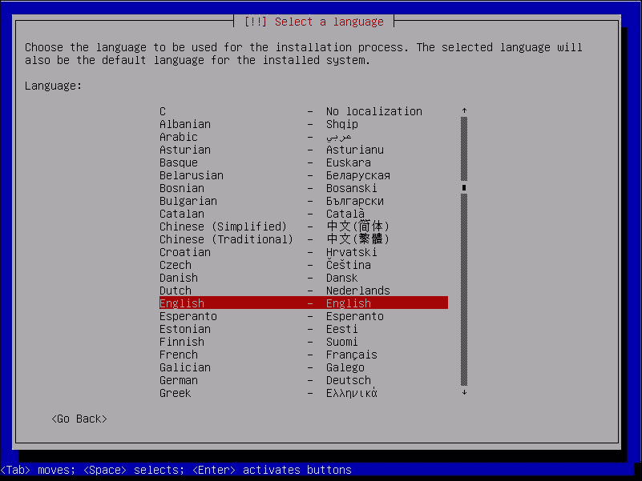
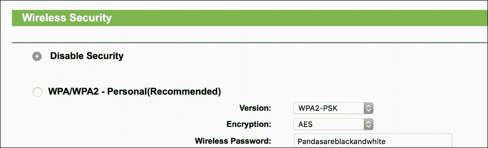
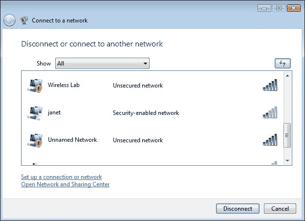
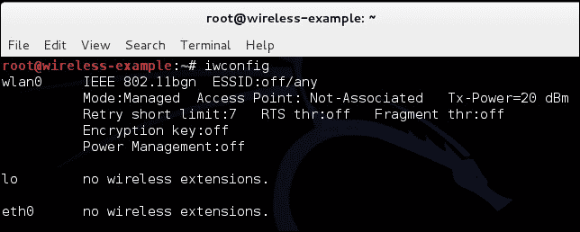
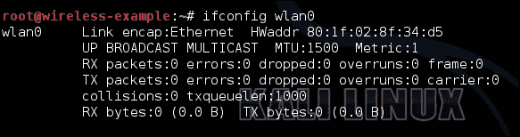
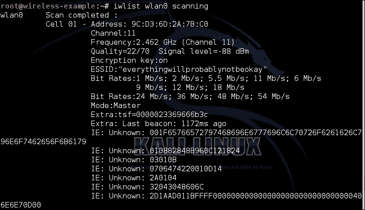
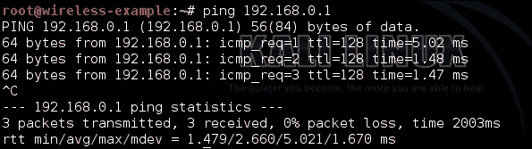
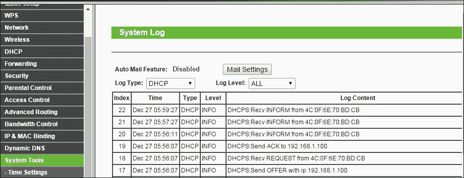

# 第一章 无线实验室设置

|   | *“如果我有八个小时来砍倒一棵树，我会花六个小时来磨利我的斧头。”* |   |
| --- | --- | --- |
|   | --*亚伯拉罕·林肯，第 16 任美国总统* |

*每一次成功的执行背后都需要数小时或数天的准备工作，无线渗透测试也不例外。在这一章中，我们将创建一个无线实验室，供本书中的实验使用。把这个实验室当作你进入实际渗透测试前的准备场地吧！*

*无线渗透测试是一个实用的学科，首先设置一个实验室非常重要，在这里我们可以在安全、受控的环境中尝试本书中的所有不同实验。在继续本书之前，重要的是你首先要设置好这个实验室。*

在本章中，我们将了解以下内容：

+   硬件和软件要求

+   安装 Kali

+   设置一个接入点并进行配置

+   安装无线网卡

+   测试笔记本与接入点之间的连接

那么，让我们开始吧！

# 硬件要求

我们需要以下硬件来设置无线实验室：

+   **两台带内置 Wi-Fi 卡的笔记本电脑**：我们将把其中一台笔记本作为实验室中的“受害者”电脑，另一台作为渗透测试者的笔记本。虽然几乎任何一台笔记本都能满足这个要求，但至少需要 3GB RAM 的笔记本会更理想。因为我们在实验中可能会运行很多占用内存的软件。

+   **一个无线适配器（可选）**：根据你笔记本的无线网卡，我们可能需要一个支持数据包注入和数据包嗅探的 USB Wi-Fi 卡，而 Kali 是支持这一功能的。最好的选择似乎是来自 Alfa Networks 的 Alfa AWUS036H 卡，因为 Kali 自带支持此卡。在撰写本书时，它在[www.amazon.com](http://www.amazon.com)上的零售价格为 18 英镑。另一个可选的选择是 Edimax EW-7711UAN，它更小巧且略微便宜。

+   **一个接入点**：任何支持 WEP/WPA/WPA2 加密标准的接入点都可以。为了说明本书中的内容，我将使用 TP-LINK TL-WR841N 无线路由器。你可以在[www.amazon.com](http://www.amazon.com)上购买，零售价格大约为 20 英镑（截至撰写时）。

+   **互联网连接**：这对于进行研究、下载软件以及我们的某些实验将非常有用。

# 软件要求

我们需要以下软件来设置无线实验室：

+   **Kali**：你可以从官方网站[`www.kali.org`](http://www.kali.org)下载此软件。该软件是开源的，你应该能够直接从网站下载。

+   **Windows XP/Vista/7/10**：你需要在其中一台笔记本上安装 Windows XP、Windows Vista、Windows 7 或 Windows 10 中的任意一种。这台笔记本将作为本书余下章节中的“受害者”机器。

### 注意

需要注意的是，即使我们在测试中使用基于 Windows 的操作系统，所学到的技术也可以应用于任何支持 Wi-Fi 的设备，例如智能手机和平板电脑等。

# 安装 Kali

现在让我们快速看看如何快速上手并运行 Kali。

Kali 将安装在笔记本电脑上，作为本书中渗透测试人员的主要工具。

# 行动时间 - 安装 Kali

Kali 的安装相对简单。我们将通过启动光盘来运行 Kali，并将其安装在硬盘上。

按照以下步骤逐步执行：

1.  将您下载的 Kali 32 位 ISO 刻录到可启动的 DVD 上。

1.  使用此 DVD 启动笔记本电脑，并从启动菜单中选择 **Install** 选项：

1.  如果启动成功，您将看到一个很棒的复古屏幕，如下面的截图所示：

1.  此安装程序类似于大多数 Linux 系统的基于 GUI 的安装程序，应该很容易跟随。在每个屏幕上选择适当的选项并开始安装过程。安装完成后，按提示重新启动机器并移除光盘。

1.  一旦机器重新启动，将显示登录屏幕。以 `root` 用户登录，密码是您在安装过程中设置的密码。现在您应该已经成功登录到安装好的 Kali 版本。恭喜！

1.  我将更改桌面主题和一些设置以适应本书。随意使用您自己的主题和颜色设置！

## *刚刚发生了什么？*

我们已成功在笔记本电脑上安装了 Kali！在本书的所有其他实验中，我们将使用这台笔记本电脑作为渗透测试人员的工作设备。

## 挑战英雄 - 在 VirtualBox 上安装 Kali

我们还可以在诸如 VirtualBox 等虚拟化软件中安装 Kali。如果您不想将整个笔记本专用于 Kali，这是最佳选择。在 VirtualBox 中，Kali 的安装过程完全相同。唯一的区别是您需要在 VirtualBox 中进行预设置。试试看吧！您可以从 [`www.virtualbox.org`](http://www.virtualbox.org) 下载 VirtualBox。

我们还可以通过 USB 驱动器安装和使用 Kali。如果您不想在硬盘上安装，但仍想存储持久数据（如脚本和新工具），这将特别有用。我们也鼓励您尝试这种方法！

# 设置访问点

现在我们将设置访问点。如前所述，我们将在本书的所有实验中使用 TP-LINK TL-WR841N 无线路由器。不过，您可以自由选择其他访问点。操作和使用的基本原理保持不变。

# 行动时间 - 配置访问点

让我们开始吧！我们将配置接入点使用**开放认证**（**OAuth**），并将 SSID 设置为 `Wireless Lab`。

按照以下步骤操作：

1.  打开接入点，并使用以太网线将你的笔记本电脑连接到接入点的一个以太网端口。

1.  在浏览器中输入接入点配置终端的 IP 地址。对于 TP-Link，默认地址是 `192.168.1.1`。你应查阅接入点的设置指南以找到其 IP 地址。如果没有接入点的手册，也可以通过运行 `route –n` 命令来找到 IP 地址。网关 IP 地址通常就是接入点的 IP。连接后，你应该会看到一个配置门户，其界面类似于以下**TP-LINK 无线路由器 WR841N**的截图：

1.  登录后，浏览门户中的各种设置，找到与配置新 SSID 相关的设置。

1.  将 SSID 更改为 `Wireless Lab`。根据接入点的不同，你可能需要重启它才能使设置生效。

1.  同样，找到与**无线安全**相关的设置，并将其更改为**禁用安全**。**禁用安全**表示它使用的是开放认证模式。

1.  保存接入点的更改并重新启动它（如果需要）。现在你的接入点应该已成功启动，SSID 为 `Wireless Lab`。

验证这一点的简单方法是使用 Windows 中的无线配置工具，并观察使用 Windows 笔记本电脑可用的网络。你应该能在列表中找到`Wireless Lab`作为其中一个网络：

## *刚刚发生了什么？*

我们已成功设置接入点的 SSID 为 `Wireless Lab`。它正在广播其存在，并且 Windows 笔记本电脑及其他在接入点**无线频率**（**RF**）范围内的设备可以接收到它。

需要注意的是，我们将接入点配置为**开放**模式，这是最不安全的。建议暂时不要将此接入点连接到互联网，因为任何在无线频率范围内的人都可以利用它访问互联网。

## 英雄出击——配置接入点使用 WEP 和 WPA

玩弄接入点的配置选项。尝试使用加密方案，如 WEP 和 WPA/WPA2，使其正常运行。我们将在后续章节中使用这些模式来演示对它们的攻击。

# 设置无线网卡

设置无线适配器比配置接入点要简单得多。优势在于 Kali 开箱即用支持此卡，并且自带所有必要的设备驱动程序，可以启用数据包注入和数据包嗅探。

# 行动时间——配置你的无线网卡

我们将使用无线适配器与渗透测试人员的笔记本进行配合使用。

请按照以下步骤逐步设置您的网卡：

1.  将网卡插入 Kali 笔记本的 USB 端口并启动它。登录后，打开终端窗口并输入 `iwconfig`。您的屏幕应该如下所示：

    如您所见，`wlan0` 是为无线适配器创建的无线接口。

    输入 `ifconfig wlan0 up` 来启用接口。然后，输入 `ifconfig wlan0` 来查看接口的当前状态：

    

1.  MAC 地址 `00:c0:ca:3e:bd:93` 应该类似于您 Alfa 网卡下写的 MAC 地址。我使用的是 Edimax 网卡，给我提供了前面的 MAC 地址 `80:1f:02:8f:34:d5`。这是一个快速检查，以确保您启用了正确的接口。

## *刚刚发生了什么？*

Kali 系统自带了 Alfa 和 Edimax 适配器所需的所有驱动程序。机器启动后，适配器被识别并分配了网络接口 `wlan0`。现在我们的无线适配器已经启动并正常工作了！

# 连接到接入点

现在我们来看看如何使用无线适配器连接到接入点。我们的接入点有一个 SSID，即 `Wireless Lab`，并且不使用任何认证方式。

# 现在开始操作 – 配置您的无线网卡

让我们开始吧！请按照以下步骤将您的无线网卡连接到接入点：

1.  让我们先看看无线网卡当前检测到哪些无线网络。执行 `iwlist wlan0 scanning` 命令，您将看到您附近的网络列表：

    继续向下滚动，您应该在此列表中找到 `Wireless Lab` 网络。在我的设置中，它被检测为 `Cell 05`，在您的设备中可能会有所不同。`ESSID` 字段包含网络名称。

1.  由于多个接入点可能有相同的 SSID，请确保前面提到的 `Address` 字段中的 MAC 地址与接入点的 MAC 地址匹配。一个快速且简单的方法是查看接入点底部的 MAC 地址，或者使用基于网页的 GUI 设置来查找。

1.  现在，执行 `iwconfig wlan0 essid "Wireless Lab"` 命令，然后执行 `iwconfig wlan0` 来检查状态。如果您已成功连接到接入点，您应该在 `iwconfig` 输出的 `Access Point` 字段中看到接入点的 MAC 地址。

1.  我们知道接入点的管理界面 IP 地址是 `192.168.0.1`，这个信息可以从其手册中找到。或者，当我们运行 `route –n` 命令时，默认的路由器 IP 地址也是这个。让我们通过执行 `ifconfig wlan0 192.168.0.2 netmask 255.255.255.0 up` 命令，将 IP 地址设置在同一子网中。通过输入 `ifconfig wlan0` 并检查输出，验证命令是否成功执行。

1.  现在，让我们通过执行 `ping 192.168.0.1` 命令来 ping 接入点。如果网络连接设置正确，您应该看到来自接入点的响应。您还可以额外执行 `arp –a` 命令来验证响应是否来自接入点。您应该会看到 IP `192.168.0.1` 的 MAC 地址是我们之前记录的接入点的 MAC 地址。需要注意的是，一些较新的接入点可能会禁用对 **互联网控制消息协议** (**ICMP**) 回显请求包的响应。这通常是为了让接入点在最小配置设置下更安全。遇到这种情况，您可以尝试启动浏览器并访问 Web 界面，验证连接是否正常：

1.  在接入点上，我们可以通过查看连接日志来验证连接情况。正如您在以下日志中看到的，无线网卡的 MAC 地址 `4C:0F:6E:70:BD:CB` 已经记录了来自路由器的 DHCP 请求：

## *刚刚发生了什么？*

我们刚刚成功地通过 Kali 使用无线适配器连接到接入点。我们还学习了如何在无线客户端和接入点两侧验证连接是否已建立。

## 英雄试试 – 在 WEP 配置中建立连接

这里有一个具有挑战性的练习：在 WEP 配置中设置接入点。对于每个设置，尝试使用无线适配器与接入点建立连接。提示：通过输入 `man iwconfig` 查阅 `iwconfig` 命令的手册，查看如何配置网卡以连接到 WEP。

## 快速测验 – 理解基础知识

Q1. 执行 `ifconfig wlan0` 命令后，如何验证无线网卡是否正常工作？

Q2. 我们能仅使用 Kali live CD 进行所有实验吗？我们不能将 CD 安装到硬盘上吗？

Q3. `arp –a` 命令显示什么？

Q4. 我们应该使用 Kali 中的哪个工具连接到 WPA/WPA2 网络？

# 总结

本章为您提供了如何设置自己的无线实验室的详细说明。此外，您还学习了执行以下基本步骤：

+   在硬盘上安装 Kali 并探索其他选项，如虚拟机和 USB。

+   通过 Web 界面配置接入点

+   理解并使用多个命令来配置和使用您的无线网卡

+   验证无线客户端与接入点之间的连接状态

增强配置系统的信心对您很重要。如果您不自信，建议您多次重复前面的示例。在后续章节中，我们将设计更复杂的场景。

在下一章中，你将学习到 WLAN 设计中固有的基于设计的安全隐患。我们将使用网络分析工具 Wireshark，以一种实践的方式来理解这些概念。
