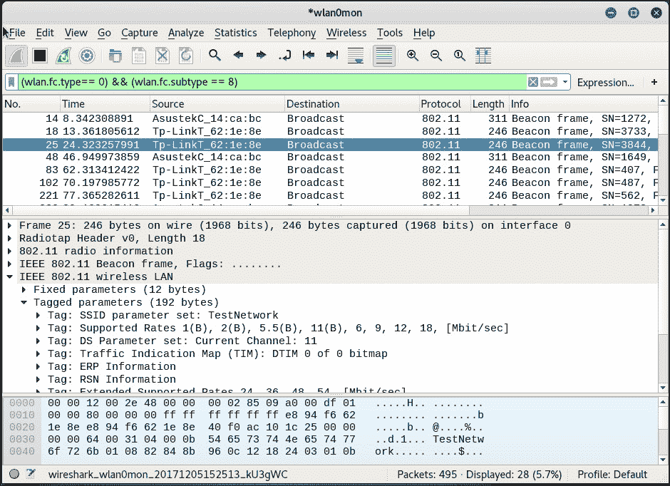
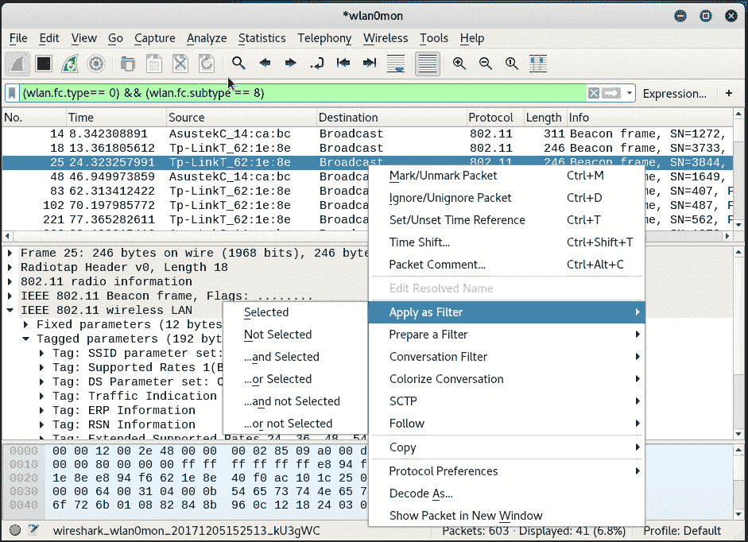
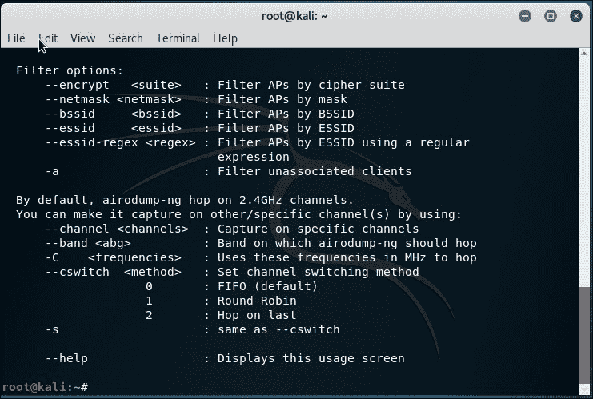

# 第二章 WLAN 及其固有的不安全性

|   | *"建筑越高，基础必须越深。"* |   |
| --- | --- | --- |
|   | --*托马斯·阿·坎皮斯* |

*没有伟大的东西可以建立在脆弱的基础上，在我们的背景下，没有安全的东西可以建立在本质上不安全的基础上。*

*WLAN 设计上存在某些相对容易被利用的不安全性，例如数据包欺骗、数据包注入和嗅探（甚至可以远程进行）。我们将在本章探讨这些缺陷。*

在本章中，我们将讨论以下内容：

+   重访 WLAN 帧

+   不同的帧类型和子类型

+   使用 Wireshark 来嗅探管理、控制和数据帧

+   对给定无线网络进行数据包嗅探

+   向给定无线网络注入数据包

让我们开始吧！

# 重访 WLAN 帧

由于本书涉及无线安全方面的内容，我们假定您已经对协议和数据包头部有基本了解。如果没有，或者如果您已经有一段时间没有处理无线网络，那么现在是重新学习这个主题的好时机。

现在让我们快速回顾一些大家可能已经了解的 WLAN 基本概念。在 WLAN 中，通信是通过帧来进行的。一个帧会有以下头部结构：


`Frame Control`字段本身具有更复杂的结构：


`Type`字段定义了三种 WLAN 帧类型：

+   **管理帧**：管理帧负责维护接入点和无线客户端之间的通信。管理帧可以有以下子类型：

    +   认证

    +   注销认证

    +   关联请求

    +   关联响应

    +   重新关联请求

    +   重新关联响应

    +   断开连接

    +   信标

    +   探测请求

    +   探测响应

+   **控制帧**：控制帧负责确保接入点和无线客户端之间数据的正确交换。控制帧可以具有以下子类型：

    +   **Request to Send** (**RTS**)

    +   **Clear to Send** (**CTS**)

    +   **确认** (**ACK**)

+   **数据帧**：数据帧携带实际在无线网络上传输的数据。数据帧没有子类型。

当我们讨论不同攻击时，我们将讨论每个帧的安全影响。

现在我们将看看如何使用 Wireshark 在无线网络上嗅探这些帧。还有其他工具——如 Airodump-NG、Tcpdump 或 Tshark，你也可以用来进行嗅探。在本书中，我们主要使用 Wireshark，但我们鼓励你也探索其他工具。首先要做的是创建一个监视模式接口。这将为我们的适配器创建一个接口，允许我们读取空中的所有无线帧，无论它们是否是为我们而来的。在有线世界中，这通常称为**混杂模式**。

# 开始操作 – 创建监控模式接口

现在，让我们将无线适配器设置为监控模式。

按照以下步骤开始操作：

1.  启动 Kali 并连接适配器。进入控制台后，输入`iwconfig`命令确认网卡已经被检测到并且驱动程序已正确加载：

1.  使用`ifconfig wlan0 up`命令启用网卡（其中`wlan0`是你的适配器）。通过运行`ifconfig wlan0`命令验证网卡是否已启用。你应该在输出的第一行看到`UP`字样，如下图所示：

1.  为了将我们的网卡设置为监控模式，我们将使用 Kali 系统默认提供的`airmon-ng`工具。首先运行`airmon-ng`命令以验证是否能够检测到可用的网卡。你应该在输出中看到`wlan0`或`wlan1`接口：

1.  现在输入`airmon-ng start wlan0`命令，为`wlan0`设备创建一个监控模式接口。这个新的监控模式接口将被命名为`wlan0mon`。（你可以通过再次运行`airmon-ng`命令来验证它是否已经创建）：

1.  此外，运行`ifconfig wlan0mon`命令现在应该显示一个名为`wlan0mon`的新接口：

## *刚刚发生了什么？*

我们已经成功创建了一个名为`wlan0mon`的监控模式接口。这个接口将用于捕获无线数据包。这个接口是为我们的无线适配器创建的。

## 挑战一下英雄 – 创建多个监控模式接口

可以使用相同的物理网卡创建多个监控模式接口。使用`airmon-ng`工具查看如何操作。

太棒了！我们已经有了一个监控模式接口，等待从空中捕获数据包。那么，让我们开始吧。

在下一个练习中，我们将使用 Wireshark 通过我们刚刚创建的`wlan0mon`监控模式接口来捕获无线数据包。

# 开始操作 – 捕获无线数据包

按照以下步骤开始捕获数据包：

1.  启动我们在第一章中配置的接入点`Wireless Lab`，*无线实验室设置*。

1.  在控制台中输入`Wireshark &`启动 Wireshark。一旦 Wireshark 启动，导航到**Capture** | **Options**：

1.  通过点击界面右下角的**开始**按钮，选择来自 `wlan0mon` 接口的数据包捕获，正如前面截图所示。Wireshark 将开始捕获，现在你应该能在 Wireshark 窗口中看到数据包。

1.  这些是无线数据包，你的无线适配器正在从空中嗅探它们。为了查看任何数据包，在顶部窗口中选择它，整个数据包将在中间窗口显示。

    点击**IEEE 802.11 无线局域网**管理帧前的三角形展开，查看更多信息。

查看数据包中的不同头部字段，并将其与之前学过的 WLAN 帧类型和子类型进行关联。

## *刚刚发生了什么？*

我们刚刚从空中嗅探到第一组数据包！我们启动了 Wireshark，它使用了我们之前创建的监控模式接口 `wlan0mon`。通过查看 Wireshark 的底部区域，你应该能看到数据包捕获的速度以及目前已捕获的数据包数量。

## 挑战时刻 – 查找不同的设备

Wireshark 的跟踪信息有时可能让人望而生畏；即使是一个相对繁忙的无线网络，你也可能嗅探到几千个数据包。因此，能够深入分析我们感兴趣的数据包非常重要。通过在 Wireshark 中使用过滤器可以实现这一点。探索如何使用这些过滤器来识别跟踪中独特的无线设备——包括接入点和无线客户端。

如果你无法做到这一步，别担心，因为这是我们接下来要学习的内容。

# 行动时间 – 查看管理帧、控制帧和数据帧

现在，我们将学习如何在 Wireshark 中应用过滤器来查看管理帧、控制帧和数据帧。

请按步骤逐一操作：

1.  若要查看捕获的数据包中的所有管理帧，请在过滤器窗口中输入过滤器 `wlan.fc.type == 0` 并按 *Enter* 键。如果你希望防止数据包滚动得太快，可以停止数据包捕获。

1.  要查看控制帧，请修改过滤器表达式为 `wlan.fc.type == 1`：

1.  要查看数据帧，请修改过滤器表达式为 `wlan.fc.type == 2`：

1.  若要额外选择一个子类型，请使用 `wlan.fc.subtype` 过滤器。例如，要查看所有管理帧中的信标帧，请使用以下过滤器：

    ```
    (wlan.fc.type == 0) && (wlan.fc.subtype == 8)
    ```

    

1.  或者，你也可以右键单击中间窗口中的任何头字段，然后选择**应用为过滤器** | **所选内容**，将其添加为过滤器：

1.  这将自动在**过滤器**字段中为你添加正确的过滤器表达式。

## *刚才发生了什么？*

我们刚刚学习了如何使用各种过滤器表达式在 Wireshark 中过滤数据包。这有助于我们监控来自我们感兴趣设备的选定数据包，而不是试图分析空中的所有数据包。

另外，我们可以看到，管理帧、控制帧和数据帧的包头是明文的，并且没有加密。任何能够嗅探数据包的人都可以读取这些头部。还需要注意的是，黑客也有可能修改这些数据包中的任何内容并重新传输它们。由于协议中没有完整性检查或重放攻击的缓解措施，因此这是非常容易做到的。我们将在后续章节中探讨这些攻击。

## 英雄，来试试吧——玩转过滤器

你可以查阅 Wireshark 的手册，了解更多可用的过滤器表达式及其使用方法。尝试通过各种过滤器组合进行实验，直到你有信心可以在非常大的数据包追踪中深入到任何细节层级。

在下一个练习中，我们将学习如何嗅探在我们的接入点与无线客户端之间传输的数据包。

# 行动时刻——嗅探我们网络的数据包

在本练习中，我们将学习如何嗅探给定无线网络的数据包。为了简化起见，我们将观察没有加密的数据包。

按照这些指令开始操作：

1.  打开我们命名为`Wireless Lab`的接入点，并保持其配置为不使用加密。

1.  我们首先需要找出`Wireless Lab`接入点所在的频道。为此，打开终端并运行`airodump-ng --bssid <mac> wlan0mon`，其中<`mac`>是我们接入点的 MAC 地址。让程序运行，不久你应该能看到你的接入点和它运行的频道出现在屏幕上。

1.  我们可以从上面的截图看到，我们的接入点`Wireless Lab`正在频道 11 上运行。请注意，这可能与你的接入点不同。

    为了嗅探进出这个接入点的数据包，我们需要将我们的无线网卡锁定到相同的频道，即频道 11。为此，运行命令`iwconfig wlan0mon channel 11`，然后运行`iwconfig wlan0mon`进行验证。你应该在输出中看到`Frequency: 2.462 GHz`的值。这对应于频道 11。

    

1.  现在启动 Wireshark 并开始在`wlan0mon`接口上嗅探数据包。在 Wireshark 开始嗅探数据包后，应用一个过滤器，针对我们的接入点的`bssid`，如以下屏幕截图所示，使用`wlan.bssid == <mac>`进行过滤。请使用适合你的接入点的 MAC 地址。操作时间 – 嗅探我们网络的数据包

1.  为了查看我们接入点的数据包，请将以下内容添加到过滤器中`(wlan.bssid == <mac>) && (wlan.fc.type_subtype == 0x20)`。在客户端笔记本上打开浏览器，并在管理界面中输入接入点的 URL。根据我们在第一章中看到的*无线实验室设置*，它是`http://192.168.0.1`。这将生成 Wireshark 可以捕获的数据包。

1.  数据包嗅探使我们能够非常容易地分析未加密的数据包。这就是我们需要在无线网络中使用加密的原因。

## *刚刚发生了什么？*

我们刚刚通过 Wireshark 使用不同的过滤器嗅探了无线数据包。由于我们的接入点没有启用加密，所以我们能够看到所有的明文数据。这是一个重大的安全问题，因为任何处在接入点射频范围内的人都可以使用像 Wireshark 这样的嗅探工具看到所有数据包。

## 试试看，英雄 – 分析数据包

使用 Wireshark 进一步分析数据包。你会注意到客户端发出了一个 DHCP 请求，并且如果有 DHCP 服务器可用，它会响应一个地址。然后你会看到 ARP 数据包和其他协议数据包。这是一种在无线网络上进行被动主机发现的简单有效方法。能够查看数据包的跟踪并重建无线主机如何与网络上的其他部分通信是非常重要的。Wireshark 提供的一个有趣功能是能够跟踪流。这使你可以查看属于同一个 TCP 交换的多个数据包，集中在同一个连接中。

另外，尝试登录到[www.gmail.com](http://www.gmail.com)或任何其他流行的网站，并分析生成的数据流量。

我们现在将演示如何向无线网络中注入数据包。

# 操作时间 – 数据包注入

本次练习将使用`aireplay-ng`工具，该工具在 Kali 中可用。

请仔细遵循以下说明：

1.  为了进行注入测试，首先启动 Wireshark，并应用过滤表达式`(wlan.bssid == <mac>) && !(wlan.fc.type_subtype == 0x08)`。这将确保我们只看到我们实验室网络中的非信标数据包。

1.  现在在终端中运行命令`aireplay-ng -9 -e Wireless Lab -a <mac> wlan0mon`。

1.  返回到 Wireshark，你现在应该在屏幕上看到很多数据包。其中一些数据包是由我们启动的`aireplay-ng`发送的，其他的则是接入点`Wireless Lab`响应注入数据包后的数据包。

## *刚刚发生了什么？*

我们刚刚通过`aireplay-ng`成功向测试实验室网络注入了数据包。需要注意的是，我们的卡在没有实际连接到接入点`Wireless Lab`的情况下，向网络注入了这些任意的数据包。

## 英雄出击 – 在 VirtualBox 上安装 Kali

我们将在后面的章节中更详细地讨论数据包注入；不过，您可以随时探索`aireplay-ng`工具的其他选项来注入数据包。你可以使用 Wireshark 来监视无线电频谱，验证注入是否成功。

# 关于 WLAN 嗅探和注入的重要注意事项

WLAN 通常在三个不同的频段内工作——2.4 GHz、3.6 GHz 和 4.9/5.0 GHz。并非所有 Wi-Fi 卡都支持所有这些频段及其相关的子频带。例如，旧版的 Alfa 卡仅支持 IEEE 802.11b/g，这意味着这些卡无法在 802.11a/n 频段下工作。关键在于要在特定频段中进行嗅探或注入数据包；你的 Wi-Fi 卡需要支持该频段。

Wi-Fi 的另一个有趣方面是，在每个频段内都有多个频道。需要注意的是，你的 Wi-Fi 卡在任何时刻只能在一个频道上。无法同时调谐到多个频道。最好的类比是你的汽车收音机。你一次只能调到一个可用频道。如果你想听不同的频道，你必须换台。WLAN 嗅探也遵循相同的原则。这让我们得出一个重要结论——我们不能同时嗅探所有频道；我们需要选择一个感兴趣的频道。这意味着，如果我们的目标接入点在频道 1，我们就需要将卡设置到频道 1。

虽然我们在前面的段落中已经讨论了 WLAN 嗅探，但注入的原理也相同。要在特定频道上注入数据包，我们需要将卡的无线电设置到那个频道。

现在我们来做一些练习，设置我们的卡到特定频道，进行频道跳跃，设置监管域、功率级别等。

# 开始行动 – 实验你的适配器

请仔细按照以下步骤操作：

1.  要将卡设置到特定频道，我们使用`iwconfig wlan0mon channel X`命令：

1.  `iwconfig`系列命令没有频道跳跃模式。可以编写一个简单的脚本来实现此功能。更简单的方法是使用`airodump-ng`，通过选项来任意跳跃频道、仅使用部分频道或仅使用特定频段。所有这些选项可以通过运行`airodump-ng --help`命令时的截图来查看：

## *刚刚发生了什么？*

我们理解到，无线嗅探和数据包注入都依赖于硬件的支持。这意味着我们只能操作网卡允许的频段和频道。此外，无线网卡的射频一次只能工作在一个频道上。因此，这意味着我们一次只能在一个频道上进行嗅探或注入。

## 尝试一下，英雄 – 嗅探多个频道

如果你需要同时在多个频道上进行嗅探，你将需要多个物理 Wi-Fi 网卡。如果能够获得额外的网卡，可以尝试同时在多个频道上进行嗅探。

## 快速测验 – WLAN 数据包嗅探与注入

Q1\. 哪些帧类型负责 WLAN 中的认证？

1.  控制

1.  管理

1.  数据

1.  QoS

Q2\. 使用`airmon-ng`在`wlan0`上创建的第二个监视模式接口名称是什么？

1.  `wlan0mon`

1.  `wlan0mon1`

1.  `1mon`

1.  `monb`

Q3\. 在 Wireshark 中查看所有非信标帧的过滤表达式是什么？

1.  `!(wlan.fc.type_subtype == 0x08)`

1.  `wlan.fc.type_subtype == 0x08`

1.  `(无信标)`

1.  `wlan.fc.type == 0x08`

# 总结

在本章中，我们对 WLAN 协议进行了若干关键观察。

管理帧、控制帧和数据帧未加密，因此可以很容易地被监控空域的任何人读取。这里需要注意的是，数据包有效载荷可以通过加密来保护，从而保持机密性。我们将在下一章讨论这一点。

我们可以通过将无线网卡设置为监视模式，嗅探我们周围的整个空域。

由于管理帧和控制帧没有完整性保护，因此通过修改这些数据包或使用像`aireplay-ng`这样的工具将其重放为原样非常容易。

未加密的数据包也可以被修改并重新播放回网络。如果数据包是加密的，我们仍然可以原样重新播放该数据包，因为 WLAN 设计上没有数据包重放保护。

在下一章中，我们将探讨 WLAN 中使用的不同认证机制，如 MAC 过滤和共享认证，并通过现场演示了解它们的各种安全漏洞。
