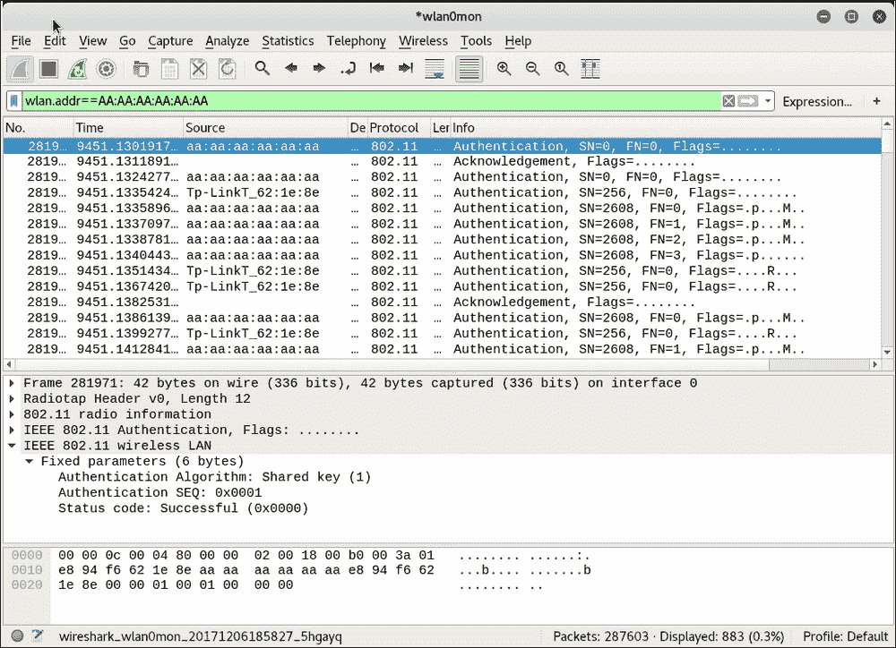

# 第三章 绕过 WLAN 认证

|   | *"虚假的安全感比不确定更糟糕。"* |   |
| --- | --- | --- |
|   | --*匿名* |

*虚假的安全感比没有安全感更糟糕，因为你可能没有准备好面对被黑客攻击的结果。*

*WLAN 可能具有脆弱的认证方案，容易被破解和绕过。在本章中，我们将研究 WLAN 中使用的各种基本认证方案，并学习如何击败它们。*

在本章中，我们将讨论以下主题：

+   揭露隐藏的 SSID

+   击败 MAC 过滤器

+   绕过开放认证

+   绕过 **共享密钥认证**（**SKA**）

# 隐藏 SSID

在默认配置模式下，所有接入点都会在信标帧中广播其 SSID。这使得附近的客户端能够轻松发现它们。隐藏 SSID 是一种配置，其中接入点不在信标帧中广播其 SSID。因此，只有知道接入点 SSID 的客户端才能连接到它。

不幸的是，这一措施并未提供强大的安全性，但大多数网络管理员认为它有效。隐藏 SSID 绝不应被视为一种安全措施。现在我们将探讨如何揭露隐藏的 SSID。

# 开始行动 – 揭露隐藏的 SSID

请按照以下指示操作，开始进行：

1.  使用 Wireshark，如果我们监控无线实验室网络中的信标帧，我们能够看到 SSID 明文。你应该能看到信标帧，如下图所示：

1.  配置你的接入点，将 `Wireless Lab` 网络设置为隐藏 SSID。不同的接入点配置选项可能不同。在我的案例中，我需要在 **可见性状态** 选项中勾选 `Invisible`，如下图所示：

1.  现在，如果你查看 Wireshark 跟踪，你会发现 SSID `Wireless Lab` 已经从信标帧中消失。这就是隐藏 SSID 的本质：

1.  为了绕过信标帧，我们将首先使用被动技术，等待合法客户端连接到接入点。这将生成探测请求和探测响应数据包，其中包含网络的 SSID，从而揭示其存在：

1.  或者，你也可以使用`aireplay-ng`工具代表`Wireless Lab`接入点向所有站点发送去认证数据包，命令为`aireplay-ng -0 5 -a <mac> --ignore-negative wlan0mon`，其中`<mac>`是路由器的 MAC 地址。`-0`选项用于选择去认证攻击，`5`是要发送的去认证数据包的数量。最后，`-a`指定你要攻击的接入点的 MAC 地址：

1.  前面的去认证数据包将迫使所有合法客户端断开连接并重新连接。最好添加一个过滤器来以隔离的方式查看去认证数据包，方法是使用`wlan.fc.type_subtype == 0x0c`：

1.  来自接入点的探测响应最终会揭示其隐藏的 SSID。这些数据包会显示在 Wireshark 中，如下截图所示。一旦合法客户端重新连接，我们可以通过探测请求和探测响应帧查看隐藏的 SSID。你可以使用过滤器`(wlan.bssid == <the AP MAC>) && !(wlan.fc.type_subtype == 0x08)`来监视进出接入点的所有非信标数据包。`&&`表示逻辑与运算符，`!`表示逻辑非运算符：

## *刚刚发生了什么？*

即使 SSID 被隐藏且未广播，每当合法客户端尝试连接到接入点时，它们会交换探测请求和探测响应数据包。这些数据包包含接入点的 SSID。由于这些数据包没有加密，因此可以非常轻松地从空气中嗅探到，SSID 也就暴露出来。

我们将在后续章节中讲解使用探测请求进行其他目的，如跟踪。

在许多情况下，所有客户端可能已经连接到接入点，Wireshark 跟踪中可能没有探测请求/响应数据包。此时，我们可以通过在空中发送伪造的去认证数据包，强制客户端从接入点断开连接。这些数据包将迫使客户端重新连接接入点，从而揭示 SSID。

## 动起来，英雄 – 选择去认证

在上一个练习中，我们发送了广播去认证数据包以迫使所有无线客户端重新连接。试着验证如何使用`aireplay-ng`工具有选择地针对单个客户端。

需要注意的是，尽管我们使用 Wireshark 说明了许多概念，但也可以使用其他工具来进行这些攻击，比如`aircrack-ng`套件。我们鼓励你探索整个`aircrack-ng`工具集，并查阅其官网上的其他文档：[`www.aircrack-ng.org`](http://www.aircrack-ng.org)。

# MAC 过滤器

MAC 过滤器是一种古老的身份验证和授权技术，其根源在有线网络中。不幸的是，它们在无线环境中效果极差。

基本思路是基于客户端的 MAC 地址进行身份验证。MAC 过滤器是分配给网络接口的身份识别码；路由器能够检查这个代码，并将其与批准的 MAC 地址列表进行比较。允许的 MAC 地址列表将由网络管理员维护，并输入到接入点。接下来我们将看看绕过 MAC 过滤有多么容易。

# 行动时刻——突破 MAC 过滤

按照下面的说明开始操作：

1.  首先，我们配置接入点使用 MAC 过滤，并将受害者笔记本的客户端 MAC 地址添加到白名单中。我路由器的设置页面如下所示：

1.  一旦启用 MAC 过滤，只有允许的 MAC 地址才能成功通过接入点的身份验证。如果我们尝试从具有非白名单 MAC 地址的机器连接接入点，连接将会失败。

1.  在后台，接入点正在向客户端发送认证失败消息。数据包跟踪如下所示：

1.  为了绕过 MAC 过滤器，我们可以使用`airodump-ng`来查找连接到接入点的客户端的 MAC 地址。我们可以通过执行`airodump-ng -c 10 -a --bssid <mac> wlan0mon`命令来实现。通过指定`bssid`命令，我们将只监控感兴趣的接入点。`-c 10`命令设置频道为`10`，即接入点所在的频道。`-a`命令确保在`airodump-ng`输出的客户端部分中，仅显示已关联并连接到接入点的客户端。这将展示与接入点关联的所有客户端 MAC 地址：

1.  一旦我们找到了白名单客户端的 MAC 地址，就可以使用 Kali 自带的`macchanger`工具伪造该客户端的 MAC 地址。你可以使用`macchanger –m <mac> wlan0mon`命令来完成此操作。你在`-m`命令选项中指定的 MAC 地址将是`wlan0mon`接口的新伪造 MAC 地址：

1.  如你所见，我们现在能够通过伪造一个白名单客户端的 MAC 地址来连接到接入点。

## *刚才发生了什么？*

我们使用`airodump-ng`监控无线信号，找到了连接到无线网络的合法客户端的 MAC 地址。然后，我们使用`macchanger`工具将无线网卡的 MAC 地址更改为与客户端相匹配的地址。这样接入点误以为我们是合法客户端，允许我们访问其无线网络。

您被鼓励通过查阅它们网站上的文档来探索`airodump-ng`工具的不同选项：[`www.aircrack-ng.org/doku.php?id=airodump-ng`](http://www.aircrack-ng.org/doku.php?id=airodump-ng)。

# 开放认证

开放认证这一术语几乎是一个误称，因为它实际上根本不提供认证。当接入点配置为使用开放认证时，它将成功地认证所有连接到它的客户端。

现在我们将进行一个练习，以通过开放认证对接入点进行身份验证和连接。

# 操作时间 - 绕过开放认证

现在让我们看看如何绕过开放认证：

1.  我们将首先设置我们的实验室接入点 Wireless Lab 以使用开放认证。在我的接入点上，这只需通过将**安全模式**设置为**禁用安全**来完成：

1.  然后，我们使用`iwconfig wlan0 essid Wireless Lab`命令连接到此接入点，并验证连接是否成功以及我们是否已连接到接入点。

1.  请注意，我们无需提供任何用户名/密码/口令即可通过开放认证。

## *刚才发生了什么？*

到目前为止，这可能是最简单的练习了。正如您所见，连接到开放认证网络并连接到接入点没有障碍。

# 共享密钥认证

SKA 使用共享密钥，如 WEP 密钥，用于对客户端进行身份验证。以下截图显示了信息的确切交换过程（来自[www.netgear.com](http://www.netgear.com)）：

无线客户端向接入点发送认证请求，接入点响应挑战。现在客户端需要用共享密钥加密此挑战并将其发送回接入点，接入点解密以检查是否可以恢复原始挑战文本。如果成功，客户端成功认证；否则，发送认证失败消息。

这里的安全问题在于，通过侦听空中的整个通信，攻击者可以访问明文挑战和加密挑战。他可以应用 XOR 操作来检索密钥流。此密钥流可用于加密接入点发送的任何未来挑战，而无需知道实际密钥。

最常见的共享认证形式被称为**有线等效隐私**（**WEP**）。它很容易被破解，随着时间的推移，已经开发出了许多工具来帮助破解 WEP 网络。

在这个练习中，我们将学习如何侦听空中以检索挑战和加密挑战，检索密钥流，并使用它来认证到接入点，而无需共享密钥。

# 操作时间 - 绕过共享认证

绕过共享认证比以前的练习更具挑战性，因此请仔细跟随以下步骤：

1.  让我们首先为我们的无线实验室网络设置共享认证。我已经在我的访问点上通过将安全模式设置为**WEP**和**认证**设置为**共享密钥**来完成此操作：

1.  现在让我们使用我们在步骤 1 中设置的共享密钥将合法客户端连接到该网络。

1.  为了绕过 SKA，我们首先开始嗅探访问点和其客户端之间的数据包。然而，我们也希望记录整个共享认证交换过程。为了做到这一点，我们使用`airodump-ng`实用程序，并使用命令`airodump-ng wlan0mon -c 11 --bssid <mac> -w keystream`。这里的`-w`选项是新加入的，请求`airodump-ng`将数据包存储在以单词`keystream`为前缀的文件中。顺便说一句，将不同会话的数据包捕获到不同的文件中可能是个好主意，这样您可以在收集跟踪数据之后长时间分析它们：

1.  我们可以等待合法客户端连接到访问点，或者使用之前使用的去认证技术强制重新连接。一旦客户端连接并 SKA 成功，`airodump-ng`将通过嗅探到的空中捕获此交换。捕获成功的指示是`AUTH`列显示 WEP。

1.  捕获的密钥流存储在当前目录中以单词`keystream`为前缀的文件中。在我的情况下，文件名为`keystream-01-00-21-91-D2-8E-25.xor`。

1.  如果这个方法不起作用，您可以使用`aireplay-ng -4 -h <Connected Device MAC> -a <AP BSSID> wlan0mon`生成一个`.xor`文件。这需要一个连接设备连接到目标 WEP 保护网络，并生成伪造其 MAC 地址的数据包来识别 XOR 流和密钥。

1.  为了伪造 SKA，我们将使用`aireplay-ng`工具。我们运行`aireplay-ng -1 0 -e "无线实验室" -y keystream-01-00-21-91-D2-8E-25.xor -a <mac> -h AA:AA:AA:AA:AA:AA wlan0mon`命令。这个`aireplay-ng`命令使用我们刚刚检索到的密钥流，并尝试使用 SSID 为`无线实验室`、MAC 地址为`00:21:91:D2:8E:25`的访问点进行身份验证，并使用任意客户端 MAC 地址`AA:AA:AA:AA:AA:AA`。

1.  启动 Wireshark 并通过应用`wlan.addr == AA:AA:AA:AA:AA:AA`过滤器嗅探所有感兴趣的数据包。我们可以使用 Wireshark 进行验证。您应该在 Wireshark 屏幕上看到一个跟踪，如下图所示：

1.  第一个数据包是`aireplay-ng`工具发送给接入点的认证请求：

1.  第二个数据包包含接入点发送给客户端的挑战文本，如下图所示：

1.  在第三个数据包中，工具将加密的挑战发送到接入点：

1.  由于`aireplay-ng`工具使用推导出的密钥流进行加密，认证成功，接入点在第四个数据包中发送了成功消息：

1.  认证成功后，工具伪造了与接入点的关联，且成功连接。如果你检查接入点管理界面的无线日志，你应该能看到一个无线客户端，其 MAC 地址为`AA:AA:AA:AA:AA:AA`连接：

## *刚才发生了什么？*

我们成功地从共享认证交换中推导出了密钥流，并使用它伪造了对接入点的认证。

## 动手吧英雄 – 填充接入点的表格

接入点在达到最大客户端数后会开始拒绝连接。通过在`aireplay-ng`上写一个简单的包装程序，可以自动化并发送数百个来自随机 MAC 地址的连接请求到接入点。这将填充内部表格，一旦达到最大客户端数，接入点将停止接受新连接。这通常被称为**拒绝服务**（**DoS**）攻击，并可能迫使路由器重启或使其无法正常工作。这可能导致所有无线客户端断开连接并无法使用授权网络。

检查你是否可以在实验室中验证这一点！

## 小测试 – WLAN 认证

Q1. 如何强制无线客户端重新连接到接入点？

1.  通过发送去认证数据包

1.  通过重启客户端

1.  通过重启接入点

1.  所有上述情况

Q2. 开放认证做了什么？

1.  它提供了不错的安全性

1.  它不提供任何安全性

1.  它需要使用加密

1.  上述都不是

Q3. 破解 SKA 是如何工作的？

1.  通过从数据包中推导密钥流

1.  通过推导加密密钥

1.  通过向接入点发送去认证数据包

1.  通过重启接入点

# 总结

在本章中，我们学习了 WLAN 认证。隐藏 SSID 是一种安全隐蔽特性，相对容易被突破。MAC 地址过滤并不提供任何安全性，因为 MAC 地址可以通过无线数据包从空中嗅探到。这是可能的，因为 MAC 地址在数据包中是未加密的。开放认证根本不提供任何真实的认证。SKA 虽然有点难以突破，但借助合适的工具，我们可以推导出存储和密钥流，从而能够回应接入点发送的所有未来挑战。结果是，我们可以在不需要知道实际密钥的情况下完成认证。

在下一章中，我们将看看不同的 WLAN 加密机制——WEP、WPA 和 WPA2，并探讨它们存在的安全漏洞。
