# 第四章 WLAN 加密缺陷

|   | *“640K 是任何人永远不需要的内存。”* |   |
| --- | --- | --- |
|   | --*比尔·盖茨，微软创始人* |

*即使怀着最好的意图，未来总是不可预测的。WLAN 委员会设计了 WEP 和 WPA，旨在成为万无一失的加密机制，但随着时间的推移，这两种机制都暴露出了缺陷，这些缺陷已经被广泛报道并在现实世界中被利用。*

*WLAN 加密机制长期以来一直容易受到密码学攻击。它始于 2000 年初的 WEP，最终完全被破解。近年来，WPA 已被证明包含多个缺陷，这些缺陷已经被多次处理和重新处理。尽管目前没有公开的攻击能够在所有一般条件下破解 WPA，但在特殊情况下，某些攻击是可行的。*

在本章中，我们将讨论以下主题：

+   WLAN 中的不同加密方案

+   破解 WEP 加密

+   破解 WPA 加密

# WLAN 加密

WLAN 通过空气传输数据，因此保护数据机密性是一个内在需求。最好的方法是使用加密。WLAN 委员会（IEEE 802.11）制定了以下数据加密协议：

+   **有线等效隐私**（**WEP**）

+   **Wi-Fi 受保护访问**（**WPA**）

+   **Wi-Fi 受保护访问 v2**（**WPA2**）

在本章中，我们将逐一了解这些加密协议，并演示对它们的各种攻击。

# WEP 加密

WEP 协议早在 2000 年就已被发现存在缺陷，但令人惊讶的是，它仍然存在于许多组织中，很多接入点仍然出厂时启用了 WEP 功能。

WEP 存在许多加密弱点，这些弱点是由 Walker、Arbaugh、Fluhrer、Martin、Shamir、KoreK 等人发现的。从密码学的角度评估 WEP 并不是理解如何破解它的基本要求。在本节中，我们将看看如何使用 Kali Linux 上现成的工具破解 WEP 加密。这包括整个`aircrack-ng`工具套件：`airmon-ng`、`aireplay-ng`、`airodump-ng`、`aircrack-ng`等。

WEP 的根本弱点是其使用 RC4 和一个每 224 帧就会回收的短 IV 值。虽然这看起来是一个大数字，但每 5000 个数据包就有 50%的概率出现四次 IV 重用。为了利用这一点，我们需要生成大量流量，以增加 IV 被重用的可能性，从而比较使用相同 IV 和密钥加密的两个密文。

现在让我们首先在测试实验室中设置 WEP，并看看我们如何破解它。

# 行动时间——破解 WEP

按照给定的说明开始操作：

1.  让我们首先连接到我们的接入点无线实验室，进入处理无线加密机制的设置区域。

1.  在我的接入点上，可以通过将**安全模式**设置为**WEP**来完成此操作。我们还需要设置 WEP 密钥长度。如下截图所示，我已将 WEP 设置为使用**128 位**密钥。我已将默认密钥设置为 WEP 的**密钥 1**，十六进制值为`abcdefabcdefabcdefabcdef12`，作为 128 位 WEP 密钥。您可以根据需要进行设置：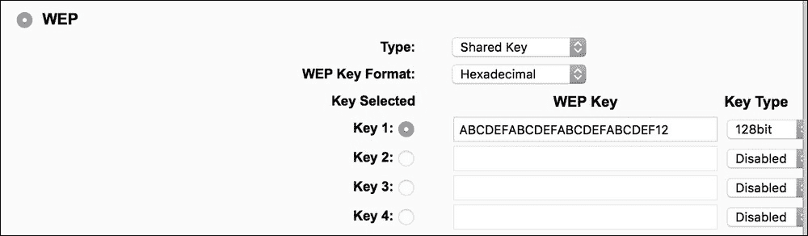

1.  应用设置后，接入点现在应该提供 WEP 作为首选的加密机制。现在让我们设置攻击者机器。

1.  让我们通过发出以下命令来启动`wlan0`：

    ```
    **ifconfig wlan0 up**

    ```

1.  然后，我们将运行以下命令：

    ```
    **airmon-ng start wlan0**

    ```

1.  这是为了创建`wlan0mon`，一个监控模式接口，如下截图所示。使用`ifconfig`命令验证`wlan0mon`接口是否已创建：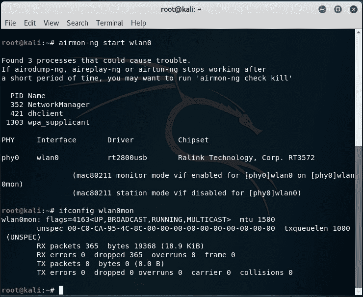

1.  让我们运行`airodump-ng`以查找我们的实验室接入点，使用以下命令：

    ```
    **airodump-ng wlan0mon**

    ```

1.  如您在下面的截图中所见，我们能够看到运行 WEP 的`Wireless Lab`接入点：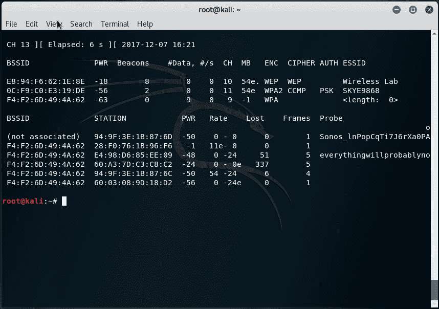

1.  对于此练习，我们只关心`Wireless Lab`网络，因此可以调整命令以仅查看此网络的数据包：

    ```
    **airodump-ng --bssid <Your AP MAC> --channel <whatever channel it's on> --write WEPCrackingDemo wlan0mon**

    ```

    下面的截图显示了一个示例命令行：

    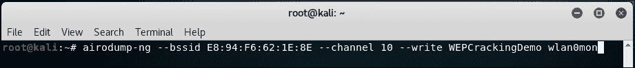

1.  我们将请求`airodump-ng`使用`--write`标志将数据包保存到`pcap`文件中：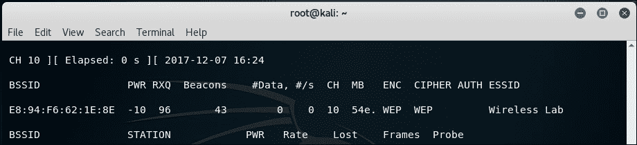

1.  现在，让我们将无线客户端连接到接入点，并使用 WEP 密钥作为`abcdefabcdefabcdefabcdef12`。一旦客户端成功连接，`airodump-ng`应在屏幕上报告它：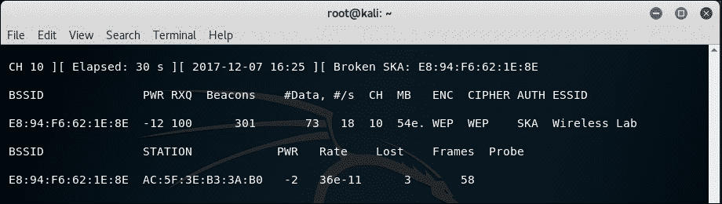

1.  如果您在同一目录中执行`ls`命令，您将能够看到以`WEPCrackingDemo-*`为前缀的文件，如下截图所示。这些是由`airodump-ng`创建的流量转储文件：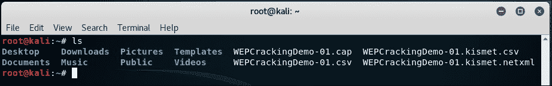

1.  如果您注意到`airodump-ng`屏幕，`#Data`下列出的数据包非常少（仅`35`）：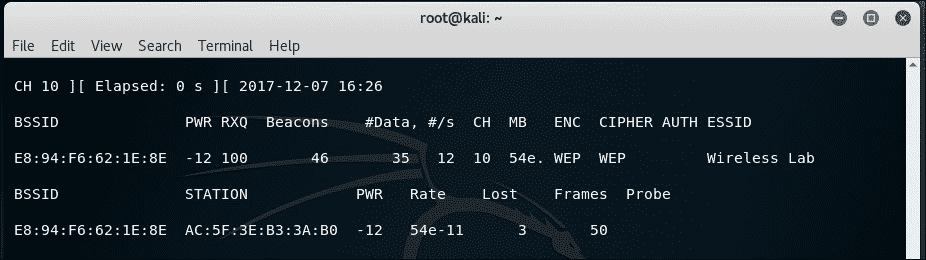

1.  在 WEP 破解中，我们需要大量使用相同密钥加密的数据包来利用协议中的弱点。因此，我们将不得不强制网络产生更多数据包。为此，我们将使用`aireplay-ng`工具。

1.  我们将使用`aireplay-ng`在无线网络上捕获 ARP 数据包，并将它们注入网络以模拟 ARP 响应。我们将在单独的窗口中启动`aireplay-ng`，如下一张截图所示。重复这些数据包数千次，我们将在网络上生成大量的数据流量。尽管`aireplay-ng`不知道 WEP 密钥，但它能够通过检查数据包的大小识别 ARP 数据包。ARP 是一个固定头部的协议；因此，可以轻松确定 ARP 数据包的大小，甚至在加密流量中也可以识别它们。我们将运行带有下列讨论的选项的`aireplay-ng`。`-3`选项是 ARP 重放，`-b`指定我们网络的 BSSID，`-h`指定我们正在欺骗的客户端 MAC 地址。不要忘记添加要使用的适配器。我们需要这样做，因为重放攻击仅适用于经过身份验证和关联的客户端 MAC 地址：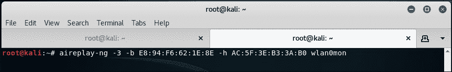

1.  非常快速，你应该看到`aireplay-ng`能够嗅探 ARP 数据包，并开始将它们重新发送到网络中。如果像我一样遇到与信道相关的错误，请在命令末尾添加`--ignore-negative-one`，如下截图所示：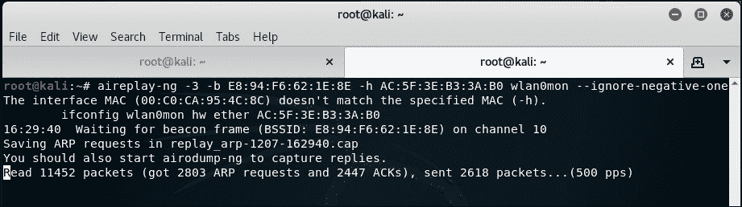

1.  此时，`airodump-ng`也将开始注册大量的数据包。所有这些嗅探到的数据包都将存储在我们之前看到的`WEPCrackingDemo-*`文件中：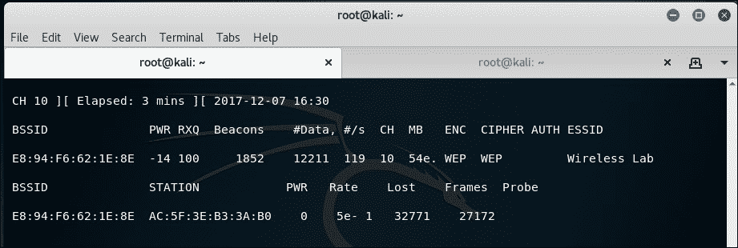

1.  现在，让我们开始实际的破解部分！在新窗口中启动`aircrack-ng`，使用选项`WEPCrackingDemo-0*.cap`。这将启动`aircrack-ng`软件，并开始使用文件中的数据包破解 WEP 密钥。请注意，让`airodump-ng`收集 WEP 数据包，让`aireplay-ng`执行重播攻击，并让`aircrack-ng`尝试基于捕获的数据包破解 WEP 密钥，是个好主意。在这个实验中，它们都在单独的窗口中打开：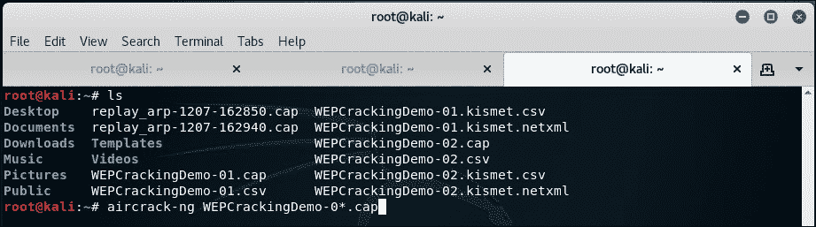

1.  当 Aircrack-ng 正在处理数据包以破解 WEP 密钥时，你的屏幕应该像下面的截图一样：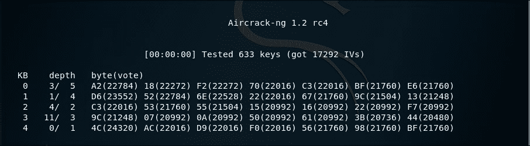

1.  破解密钥所需的数据包数量是不确定的，但通常在十万个或更多的数量级上。在快速网络上（或使用`aireplay-ng`），这应该最多需要 5-10 分钟。您可能需要多次重启此过程。

1.  一旦捕获并处理了足够的数据包，`aircrack-ng`应该能够破解密钥。一旦成功，它会在终端中骄傲地显示密钥并退出，如下面的截图所示：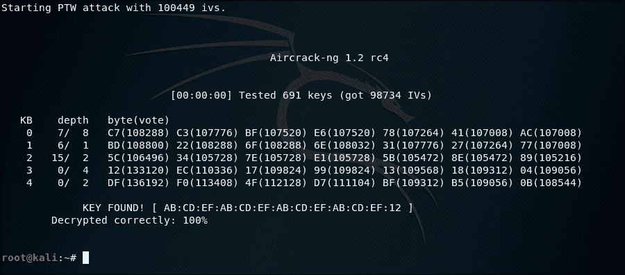

1.  需要注意的是，WEP 是完全有缺陷的，任何 WEP 密钥（无论多复杂）都会被`aircrack-ng`破解。唯一的要求是，必须有足够多的数据包（使用此密钥加密）可以提供给`aircrack-ng`。

## *刚才发生了什么？*

我们在实验室中设置了 WEP 并成功破解了 WEP 密钥。为此，我们首先等待网络的合法客户端连接到接入点。之后，我们使用`aireplay-ng`工具将 ARP 数据包重放到网络中。这导致网络发送 ARP 重放数据包，从而大大增加了通过无线传输的数据包数量。然后，我们使用`aircrack-ng`工具，通过分析这些数据包中的加密弱点来破解 WEP 密钥。

请注意，我们还可以通过使用**共享密钥认证**（**SKA**）绕过技术来伪造对接入点的认证，这种技术是我们在上一章学到的。如果合法客户端离开网络，这个方法会非常有用。这样，我们可以伪造认证和关联，并继续将重放的数据包发送到网络中。

## 动手试试，英雄 – 使用 WEP 破解伪造认证

在上一个练习中，如果合法客户端突然从网络中注销，我们将无法重放数据包，因为接入点会拒绝接收来自未关联客户端的数据包。

你的挑战是，在 WEP 破解进行的同时，利用我们在上一章学到的 SKA 绕过技术伪造认证和关联。将合法客户端从网络中注销，并验证你是否仍然能够向网络注入数据包，以及接入点是否接受并响应这些数据包。

# WPA/WPA2

WPA（或有时称为 WPA v1）主要使用**临时密钥完整性协议**（**TKIP**）加密算法。TKIP 旨在改进 WEP，而不需要完全新的硬件来支持它。相比之下，WPA2 强制使用 AES-CCMP 算法进行加密，这比 TKIP 强大且稳定得多。

WPA 和 WPA2 都允许使用基于 EAP 的认证，通过 RADIUS 服务器（企业版）或基于**预共享密钥**（**PSK**）（个人版）的认证方案。

WPA/WPA2 PSK 容易受到字典攻击。这种攻击所需的输入是客户端和接入点之间的四次握手（WPA 四次握手），以及一个包含常见密码短语的字典。然后，使用诸如`aircrack-ng`之类的工具，我们可以尝试破解 WPA/WPA2 PSK 密码短语。

以下截图展示了四次握手的过程：

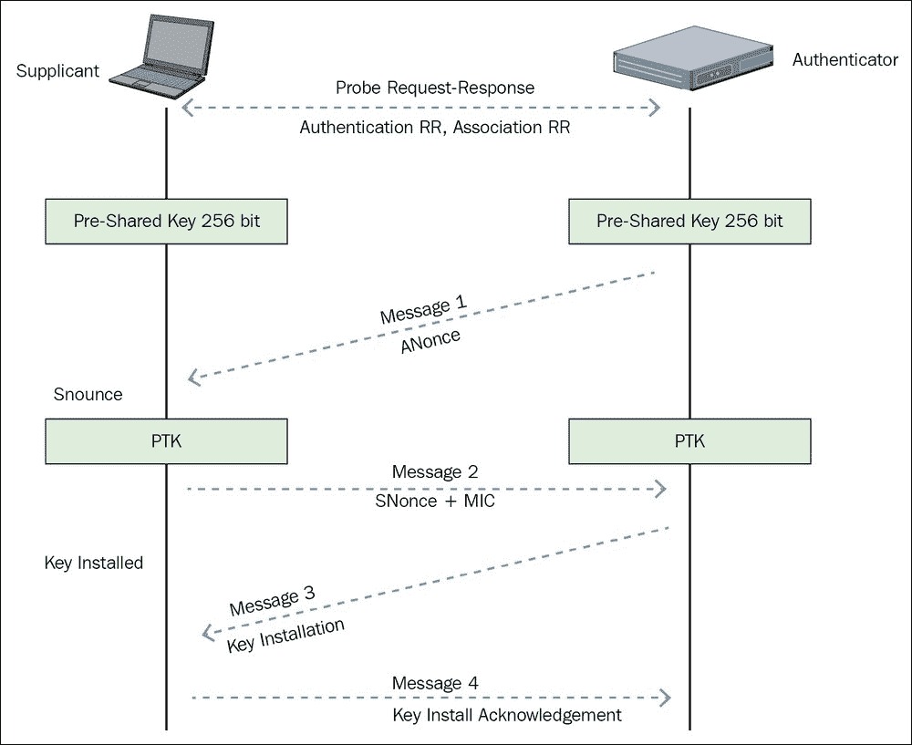

WPA/WPA2 PSK 的工作方式是，它使用 PSK 和其他五个参数（网络的 SSID，**认证者随机数**（**ANonce**），**客户端随机数**（**SNonce**），认证者 MAC 地址（接入点 MAC），客户端 MAC 地址（Wi-Fi 客户端 MAC））来推导每个会话密钥，称为**配对瞬时密钥**（**PTK**）。然后，该密钥用于加密接入点和客户端之间的所有数据。

一名通过嗅探空气来窃听整个对话的攻击者，可以获取前文提到的所有五个参数。唯一缺失的是 PSK。那么，PSK 是如何生成的呢？它是通过使用用户提供的 WPA-PSK 密码以及 SSID 来推导的。两者的组合通过**基于密码的密钥推导函数**（**PBKDF2**）输出 256 位共享密钥。

在典型的 WPA/WPA2 PSK 字典攻击中，攻击者会使用一个包含大量可能密码的字典与攻击工具。该工具从每个密码推导出 256 位 PSK，并与前面描述的其他参数一起使用来创建 PTK。PTK 将用于验证某个握手包中的**消息完整性检查**（**MIC**）。如果匹配，则字典中的猜测密码是正确的；如果不匹配，则是错误的。

最终，如果授权的网络密码存在于字典中，它将被识别出来。这就是 WPA/WPA2 PSK 破解的工作原理！以下图示说明了相关步骤：

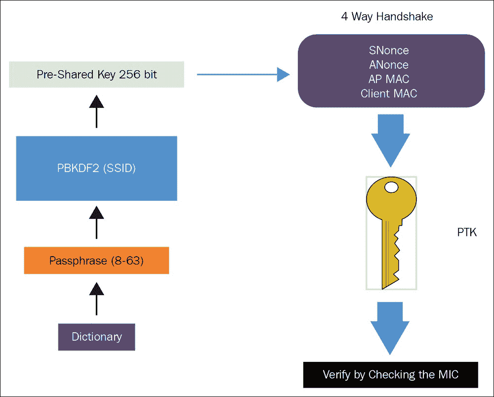

在接下来的练习中，我们将学习如何破解 WPA PSK 无线网络。破解 WPA2-PSK 网络时，使用 CCMP（AES）时将涉及完全相同的步骤。

# 时间行动——破解 WPA-PSK 弱密码

按照给定的说明开始操作：

1.  我们首先连接到我们的接入点`Wireless Lab`并将接入点设置为使用 WPA-PSK。我们将 WPA-PSK 密码设置为`abcdefgh`，使其易受字典攻击：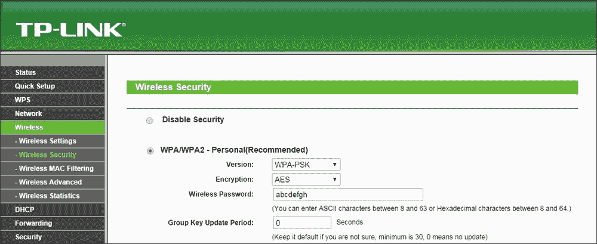

1.  我们使用以下命令启动`airodump-ng`，使其开始捕获并存储我们网络的所有数据包：

    ```
    **airodump-ng --bssid 00:21:91:D2:8E:25 --channel 11 --write WPACrackingDemo wlan0mon**

    ```

    以下截图展示了输出结果：

    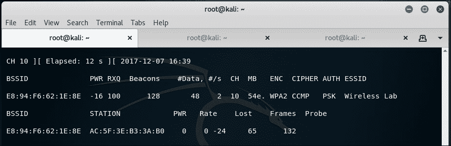

1.  现在，我们可以等待新客户端连接到接入点，以便我们捕获四次握手 WPA 握手包，或者我们可以发送广播的去身份验证数据包，强制客户端重新连接。为了加快进度，我们选择后者。未知频道错误可能会再次发生，再次使用`--ignore-negative-one`。这也可能需要多次尝试：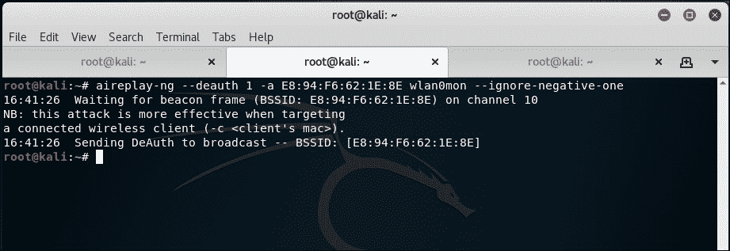

1.  一旦我们捕获到 WPA 握手，`airodump-ng`工具将在屏幕的右上角显示一个 WPA 握手，后面跟着接入点的 BSSID：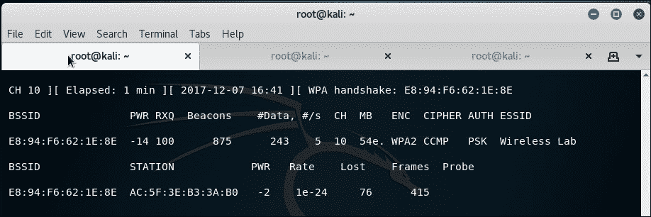

1.  如果你使用`--ignore-negative-one`，工具可能会用一个固定频道信息替换 WPA 握手。只需留意 WPA 握手的快速闪烁。如果我们检查工作目录，应该会看到生成了一个`.cap`文件：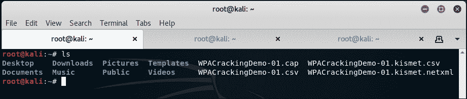

1.  现在我们可以停止`airodump-ng`工具了。让我们在 Wireshark 中打开捕获文件，查看四次握手。你的 Wireshark 终端应当显示以下截图中的内容。我在截图中选中了追踪文件中的四次握手的第一个数据包。握手数据包的协议是`EAPOL`。你可以通过在过滤器栏输入`eapol`来进行过滤：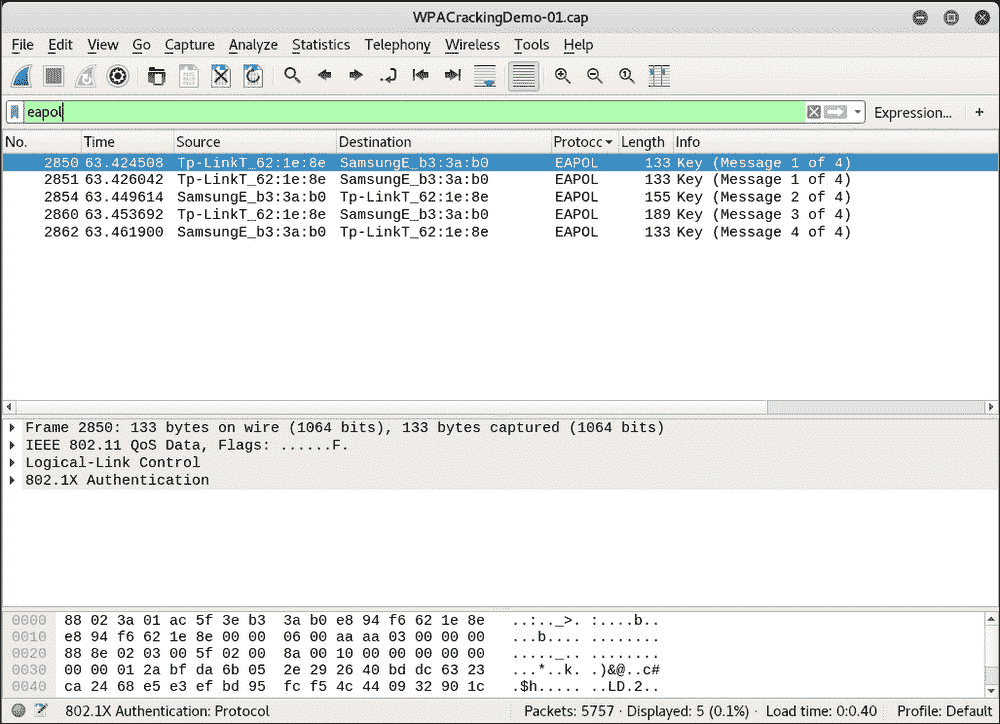

1.  现在，我们将开始实际的密钥破解练习！为此，我们需要一个常用单词的字典。Kali 中提供了许多字典文件，这些文件位于`metasploit`文件夹中，路径如下截图所示。需要注意的是，在 WPA 破解中，你的字典决定了破解的效果。Kali 附带了一些字典文件，但这些可能不够用。人们选择的密码取决于很多因素，包括用户所在的国家、该地区的常用名称和短语、用户的安全意识等。进行渗透测试时，收集特定国家和地区的字典列表是个不错的主意：

1.  现在我们将调用`aircrack-ng`工具，输入`pcap`文件和字典文件的链接，如下截图所示。我使用的是`nmap.lst`，它可以在`/usr/share/wordlists/`目录下找到，如终端所示：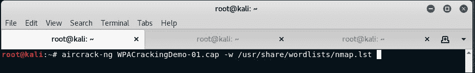

1.  `aircrack-ng`工具使用字典文件尝试各种密码短语组合，试图破解密钥。如果密码短语存在于字典文件中，它最终会破解该密钥，屏幕上将显示类似于截图中的内容：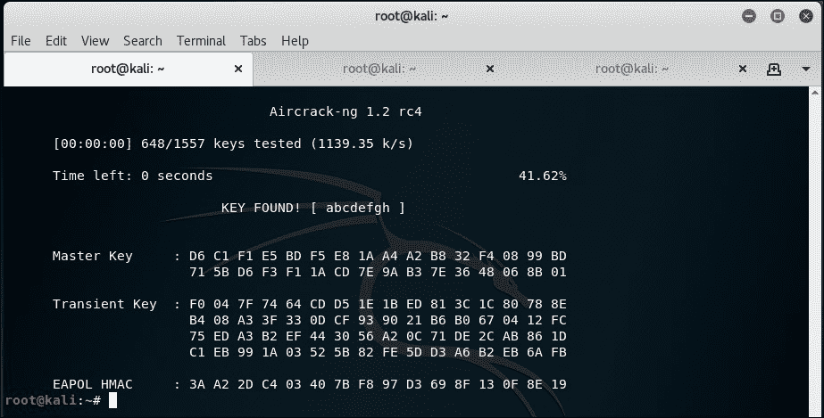

1.  请注意，由于这是字典攻击，因此前提是密码短语必须存在于你提供给`aircrack-ng`的字典文件中。如果密码短语不在字典中，攻击将会失败！

## *刚刚发生了什么？*

我们在接入点上设置了 WPA-PSK，使用了一个常见的密码短语：`abcdefgh`。然后，我们使用去身份验证攻击使合法客户端重新连接到接入点。当我们重新连接时，我们捕获到接入点和客户端之间的四次握手 WPA 握手。

由于 WPA-PSK 易受字典攻击，我们将包含 WPA 四次握手的捕获文件和常见密码短语的列表（以字典文件形式）提供给 `aircrack-ng`。由于密码短语 `abcdefgh` 在字典中，`aircrack-ng` 能够破解 WPA-PSK 共享密码短语。再次强调，在 WPA 字典攻击中，你的成功与否完全取决于你使用的字典。因此，在开始之前，准备一个庞大且详细的字典是非常重要的。尽管 Kali 带有自带字典，但有时它可能不够充分，可能需要更多的单词，特别是考虑到本地化因素。

## 大胆尝试——使用 Cowpatty 破解 WPA-PSK

**Cowpatty** 是一款工具，使用字典攻击也可以破解 WPA-PSK 密码短语。这个工具包含在 Kali 中。我留给你作为练习，使用 Cowpatty 来破解 WPA-PSK 密码短语。

此外，设置一个字典中没有的罕见密码短语，并再次尝试攻击。现在，你将无法使用 Aircrack-ng 和 Cowpatty 破解密码短语。

需要注意的是，同样的攻击也适用于 WPA2 PSK 网络。我鼓励你自行验证这一点。

# 加速 WPA/WPA2 PSK 破解

正如我们在上一节中所见，如果我们的字典中有正确的密码短语，破解 WPA-Personal 将每次都像魅力一样顺利。那么，为什么不创建一个包含数百万常见密码和短语的庞大字典呢？这将对我们非常有帮助，而且大多数时候，我们最终会破解密码短语。一切听起来很棒，但我们忽略了一个关键因素——时间。最耗费 CPU 和时间的计算之一是通过 PBKDF2 使用 PSK 密码短语和 SSID 计算 PSK。此函数会将两者的组合哈希 4,096 次，然后输出 256 位的 PSK。破解的下一步是使用该密钥与四次握手中的参数一起验证，并与握手中的 MIC 进行比对。此步骤的计算开销不大。而且，握手中的参数每次都会变化，因此此步骤无法预计算。因此，为了加速破解过程，我们需要尽可能快地计算密码短语生成的 PSK。

我们可以通过预先计算 PSK，也就是在 802.11 标准术语中称为 **Pairwise Master Key**（**PMK**）的方法来加速这一过程。需要注意的是，由于 SSID 也用于计算 PMK，使用相同的密码短语和不同的 SSID 时，我们将得到不同的 PMK。因此，PMK 依赖于密码短语和 SSID。

在下一个练习中，我们将了解如何预计算 PMK 并将其用于 WPA/WPA2 PSK 的破解。

# 行动时间——加速破解过程

我们可以继续进行以下步骤：

1.  我们可以使用`genpmk`工具和以下命令预计算给定 SSID 和字典的 PMK：

    ```
    **genpmk -f <chosen wordlist> -d PMK-Wireless-Lab -s "Wireless Lab"**

    ```

    这将创建一个名为`PMK-Wireless-Lab`的文件，其中包含预生成的 PMK：

    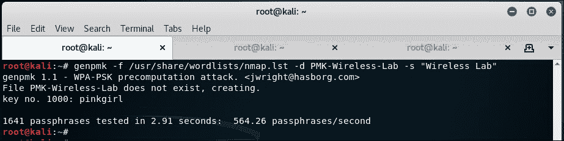

1.  我们现在创建一个 WPA-PSK 网络，密码是`abcdefgh`（它在我们使用的字典中），并像上一个练习一样捕获该网络的 WPA 握手；或者使用我们之前使用的文件。然后，我们使用 Cowpatty 破解 WPA 密码，如下图所示：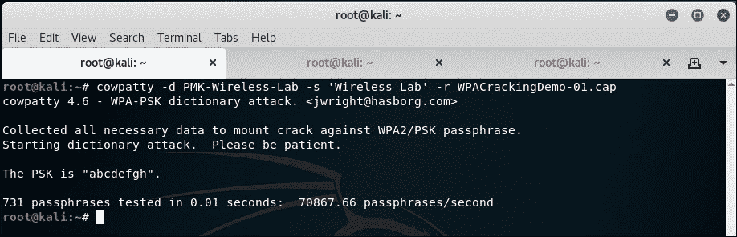

    使用预先计算的 PMK，Cowpatty 破解密钥大约需要 7.18 秒。

1.  我们现在使用相同的字典文件，使用`aircrack-ng`进行破解，整个过程需要超过 22 分钟。这表明通过预计算，我们节省了大量时间。

## *刚才发生了什么？*

我们查看了多种不同的工具和技术来加速 WPA/WPA2-PSK 的破解。其核心思想是为给定的 SSID 和字典中的密码列表预先计算 PMK。

# 解密 WEP 和 WPA 数据包

在我们到目前为止做过的所有练习中，我们使用各种技术破解了 WEP 和 WPA 密钥。那么我们如何利用这些信息呢？第一步是使用这些密钥解密我们捕获的数据包。

在下一个练习中，我们将使用我们破解的密钥解密我们在空中捕获的同一跟踪文件中的 WEP 和 WPA 数据包。

# 行动时间——解密 WEP 和 WPA 数据包

我们可以继续进行以下步骤：

1.  我们将解密之前创建的 WEP 捕获文件中的数据包：`WEPCrackingDemo-01.cap`。为此，我们将使用 Aircrack-ng 套件中的另一个工具`airdecap-ng`。我们将运行以下命令，如下图所示，使用我们之前破解的 WEP 密钥：

    ```
    **airdecap-ng -w abcdefabcdefabcdefabcdef12 WEPCrackingDemo-01.cap**

    ```

    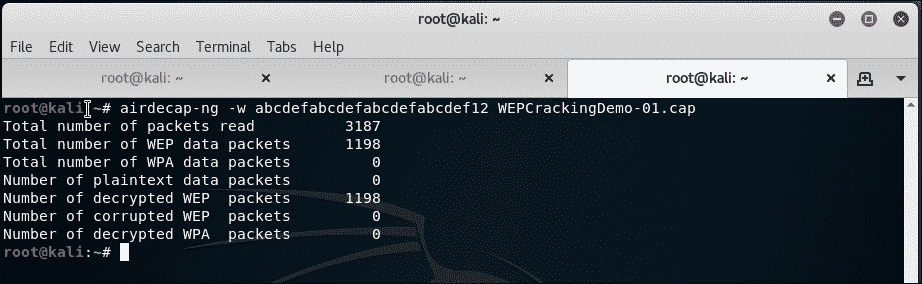

1.  解密后的文件存储在名为`WEPCrackingDemo-01-dec.cap`的文件中。我们使用`tshark`工具查看文件中的前十个数据包。请注意，根据你捕获的内容，显示的可能会有所不同：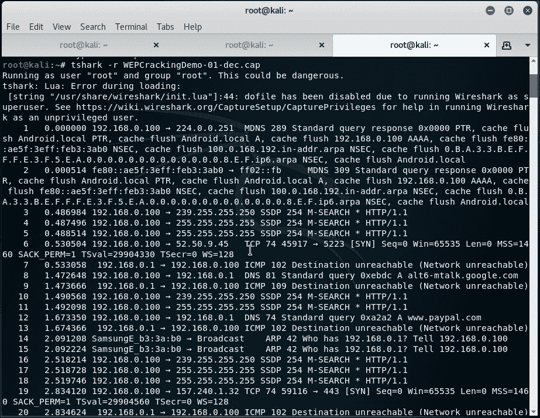

1.  WPA/WPA2 PSK 的工作方式与 WEP 完全相同，使用`airdecap-ng`工具，如下图所示，运行以下命令：

    ```
    **airdecap-ng -p abcdefgh WPACrackingDemo-01.cap -e "Wireless Lab"**

    ```

    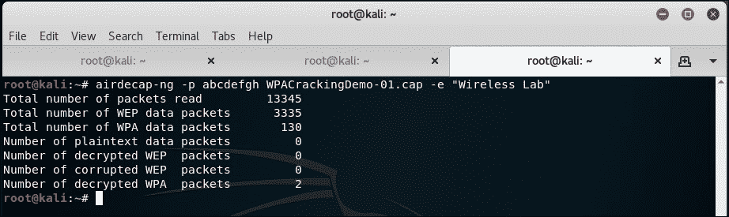

## *刚才发生了什么？*

我们刚刚看到如何使用`airdecap-ng`解密 WEP 和 WPA/WPA2-PSK 加密的数据包。有趣的是，我们也可以使用 Wireshark 做到这一点。我们建议你通过查阅 Wireshark 文档，探索如何进行操作。

# 连接到 WEP 和 WPA 网络

我们在破解网络密钥后，也可以连接到授权网络。这在渗透测试中非常有用。通过破解的密钥登录授权网络是向客户证明其网络不安全的终极证据。

# 行动时间 - 连接到 WEP 网络

我们可以继续进行以下步骤：

1.  使用`iwconfig`工具连接到 WEP 网络，一旦获得密钥。在之前的练习中，我们破解了 WEP 密钥—`abcdefabcdefabcdefabcdef12`: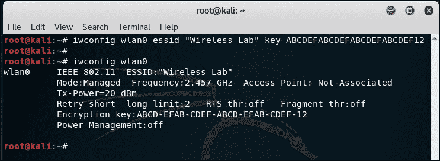

## *刚刚发生了什么？*

我们刚刚学习了如何连接到 WEP 网络。

# 行动时间 - 连接到 WPA 网络

我们可以继续进行以下步骤：

1.  对于 WPA，情况稍微复杂一些。`iwconfig`工具不能与 WPA/WPA2 个人版和企业版一起使用，因为它不支持。我们将在本实验中使用一个名为`wpa_supplicant`的新工具。为了在网络上使用`wpa_supplicant`，我们需要创建一个配置文件，如下图所示。我们将此文件命名为`wpa-supp.conf`：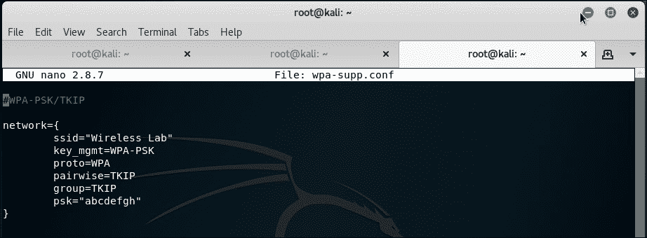

1.  然后，我们将使用以下命令调用`wpa_supplicant`工具：

    ```
    **wpa_supplicant -D wext -i wlan0 -c wpa-supp.conf**

    ```

1.  这将把设备连接到我们刚刚破解的 WPA 网络。一旦连接成功，`wpa_supplicant`会给出以下信息：**与 XXXX 的连接完成**。

1.  对于 WEP 和 WPA 网络，一旦连接，你可以使用`dhclient`从网络获取 DHCP 地址，只需输入`dhclient3 wlan0`。

## *刚刚发生了什么？*

默认的 Wi-Fi 工具`iwconfig`不能用于连接到 WPA/WPA2 网络。用于此目的的实际工具是`wpa_supplicant`。在这个实验中，我们看到如何使用它连接到 WPA 网络。

## 随堂小测 - WLAN 加密漏洞

Q1. 哪些数据包用于数据包重放？

1.  去认证数据包

1.  关联数据包

1.  加密的 ARP 数据包

1.  以上都不是

Q2. WEP 什么时候会被破解？

1.  总是

1.  只有选择了弱密钥/密码短语时

1.  仅在特殊情况下

1.  只有当接入点运行旧软件时

# 总结

在这一章中，我们学习了 WLAN 加密。WEP 是有缺陷的，无论 WEP 密钥是什么，只要有足够的数据包样本，就总是可以破解 WEP。目前，WPA/WPA2 在加密上是无法破解的；然而，在特殊情况下，比如在 WPA/WPA2-PSK 中选择了弱密码短语时，使用字典攻击有可能恢复密码短语。

在下一章，我们将看看针对 WLAN 基础设施的不同攻击方式，比如恶意接入点、双胞胎攻击、位翻转攻击等。
