# 第五章 WLAN 基础设施的攻击

|   | *"因此，战争中最重要的是攻击敌人的战略"* |   |
| --- | --- | --- |
|   | --*孙子，《孙子兵法》* |

*在本章中，我们将攻击 WLAN 基础设施的核心！我们将重点介绍如何使用各种新的攻击向量渗透到授权网络中，并诱使授权客户端连接到我们——攻击者。*

WLAN 基础设施为系统中的所有 WLAN 客户端提供无线服务。本章将介绍针对基础设施可能实施的各种攻击：

+   接入点的默认账户和凭据

+   拒绝服务攻击

+   恶意双胞胎和接入点 MAC 欺骗

+   恶意接入点

# 接入点的默认账户和凭据

WLAN 接入点是无线基础设施的核心组成部分。尽管它们在整个系统中扮演着如此重要的角色，但在安全性方面它们有时是最被忽视的部分。在本次练习中，我们将检查接入点的默认密码是否已更改。然后，我们将继续验证，即使密码已更改，是否仍然容易猜测，并能通过基于字典的攻击破解。

需要注意的是，随着我们进入更高级的章节，将假设你已经完成了前面的章节并且熟悉了那里讨论的所有工具的使用。这样，我们就可以在此基础上构建知识，并尝试更复杂的攻击！

# 行动时刻 – 破解接入点的默认账户

请按照以下说明开始：

1.  首先，让我们连接到我们的无线实验室接入点，并尝试访问 HTTP 管理界面。我们看到接入点的型号是**TP-LINK 无线 N 路由器 WR841N**，如以下截图所示：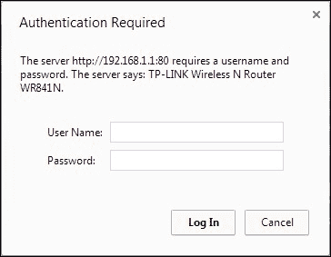

1.  从制造商的网站上，我们发现`admin`的默认密码是`admin`。我们在登录页面尝试了这个密码，并成功登录。这表明，使用默认凭据破入账户是多么容易。我们强烈建议你在线获取路由器的用户手册。这将帮助你在渗透测试过程中了解自己正在处理的内容，并为你提供其他可能检查的配置缺陷。

## *刚才发生了什么？*

我们验证了该接入点的默认凭据从未更改，这可能导致整个网络遭到完全的妥协。此外，即使默认凭据已更改，结果也不应该是容易猜测的，或者容易通过简单的字典攻击破解。

## 来吧，英雄 – 使用暴力破解攻击破解账户

在上一个练习中，将密码更改为难以猜测或在字典中查找的内容，并查看是否能够通过暴力破解法将其破解。限制密码的长度和字符，使你最终能够成功。最常用的 HTTP 身份验证破解工具之一叫做**Hydra**，它可以在 Kali 上使用。

# 服务拒绝攻击

WLAN 易受到**服务拒绝**（**DoS**）攻击，使用各种技术，包括但不限于：

+   去认证攻击

+   去关联攻击

+   CTS-RTS 攻击

+   信号干扰或频谱干扰攻击

在本书的范围内，我们将通过以下实验讨论 WLAN 基础设施上的去认证攻击。

# 行动时间 – 去认证 DoS 攻击

按照以下说明开始操作：

1.  让我们配置无线实验室网络，使用开放认证并不加密。这将使我们能够轻松地使用 Wireshark 查看数据包：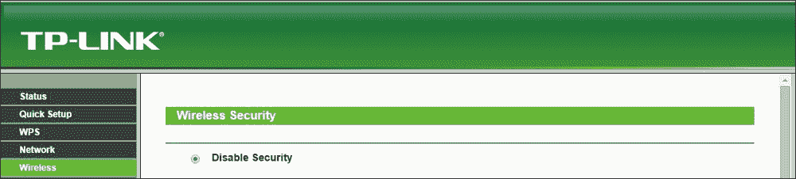

1.  让我们将 Windows 客户端连接到接入点。我们将在 `airodump-ng` 屏幕上看到连接：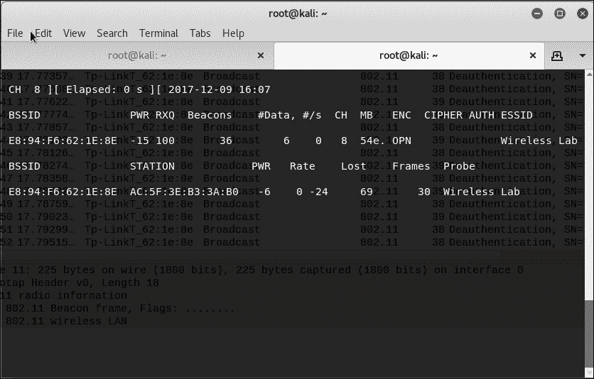

1.  现在，在攻击者的机器上，让我们对其进行定向去认证攻击：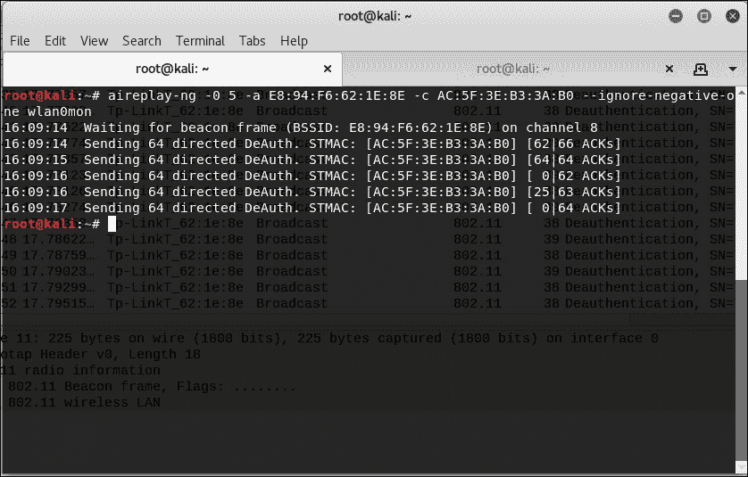

1.  注意客户端如何完全断开与接入点的连接。我们也可以在 `airodump-ng` 屏幕上验证这一点：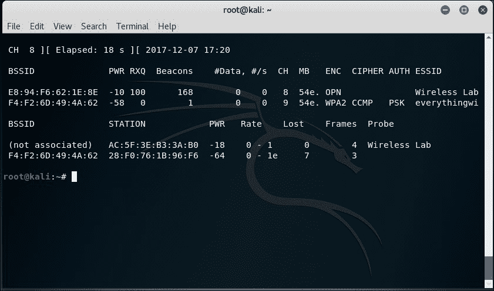

1.  如果我们使用 Wireshark 查看流量，你会注意到我们刚刚通过空中发送了大量去认证包：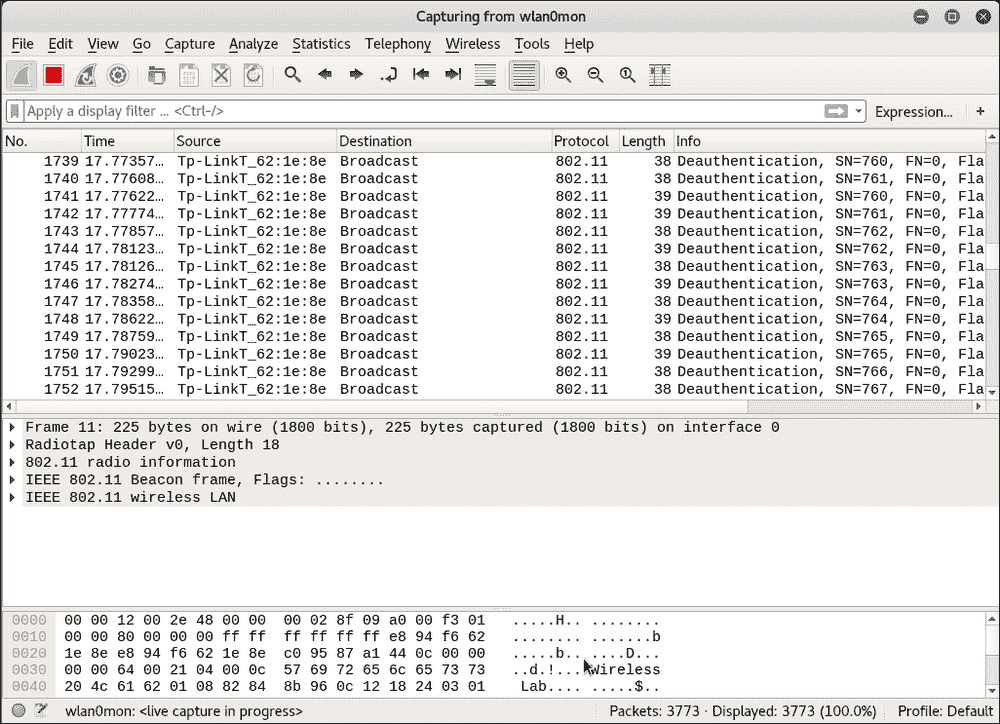

1.  我们可以通过代表接入点向整个无线网络发送广播去认证包来进行相同的攻击。这将导致断开所有已连接的客户端：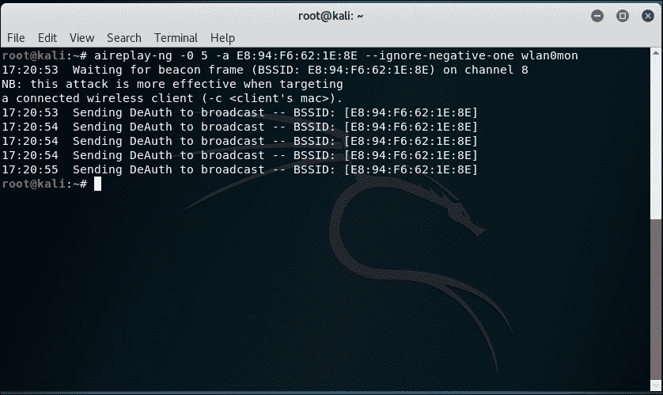

## *刚刚发生了什么？*

我们成功地向接入点和客户端发送了去认证帧。这导致它们被断开连接，并完全失去通信。

我们还发送了广播去认证包，这将确保附近的任何客户端都无法成功连接到我们的接入点。

需要注意的是，一旦客户端断开连接，它将尝试重新连接到接入点，因此去认证攻击必须以可持续的方式进行，以产生完全的 DoS 效果。

这是最容易组织的攻击之一，但它具有最具破坏性的效果。这可以很容易地在现实世界中用来让无线网络崩溃。

## 来试试吧，英雄 – 去关联攻击

尝试检查如何使用 Kali 中可用的工具对基础设施进行去关联攻击。你能进行广播去关联攻击吗？

# 恶意双胞胎与接入点 MAC 伪造

对 WLAN 基础设施的最强攻击之一就是**恶意双胞胎**。这个思路基本上是将一个攻击者控制的接入点引入 WLAN 网络的附近。这个接入点将广播与授权 WLAN 网络完全相同的 SSID。

许多无线用户可能会不小心连接到这个恶意接入点，误以为它是授权网络的一部分。一旦建立连接，攻击者就可以策划一个中间人攻击，并在透明地转发流量的同时监听整个通信。我们将在后续章节中看看如何进行中间人攻击。在现实世界中，攻击者通常会在靠近授权网络的地方发起此攻击，这样用户会感到困惑并误连接到攻击者的网络。

拥有与授权接入点相同 MAC 地址的恶意双胞胎更难被发现和防范。这就是接入点 MAC 伪造的作用！在接下来的实验中，我们将看看如何创建一个恶意双胞胎，并结合接入点 MAC 伪造。

# 行动时刻 – 带有 MAC 伪造的恶意双胞胎

按照以下说明开始操作：

1.  使用`airodump-ng`来查找接入点的 BSSID 和 ESSID，我们想要在恶意双胞胎中模仿它们：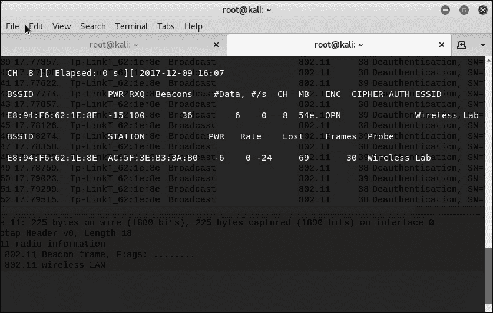

1.  使用这些信息，我们通过以下`airbase-ng`命令创建一个新的接入点：`airbase-ng –essid <你选择的 ssid> -c <频道> <接口>`。在较新的版本中可能会出现一些小错误：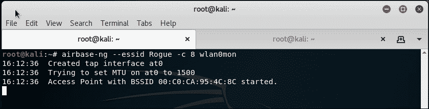

1.  这个新的接入点也会出现在`airodump-ng`屏幕上。需要注意的是，你需要在一个新的窗口中运行`airodump-ng`，并使用以下命令：

    ```
    **airodump-ng -c <channel> wlan0mon**

    ```

    让我们来看一下这个新的接入点：

    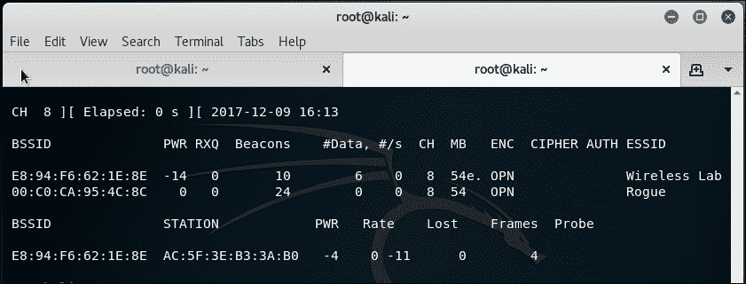

1.  现在我们要做的是通过以下命令伪造接入点的 ESSID 和 MAC 地址：

    ```
    **airbase-ng –a <router mac> --essid "Wireless Lab" –c 11 wlan0mon**

    ```

1.  现在如果我们通过`airodump-ng`查看，几乎无法视觉上区分两者：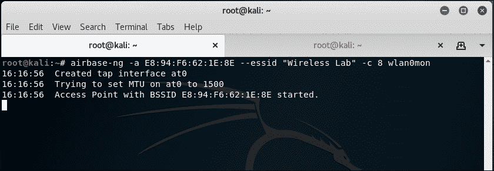

1.  即使是`airodump-ng`也无法辨别在同一频道上实际上有两个不同的物理接入点。这就是恶意双胞胎的最强形式。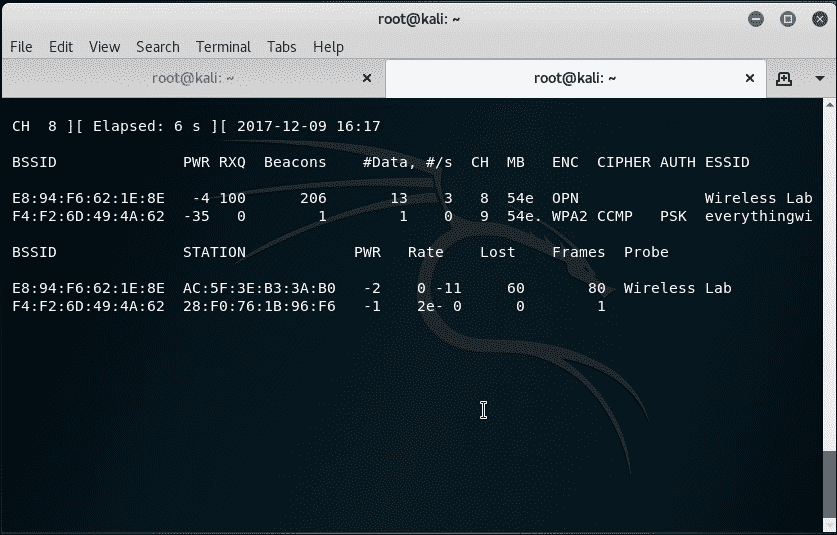

1.  现在我们向客户端发送去认证帧，让它断开连接并立即尝试重新连接：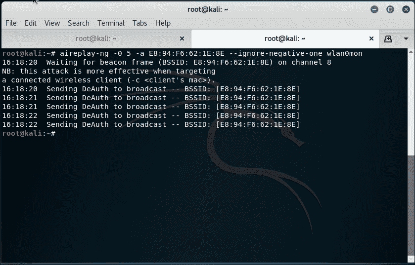

1.  由于我们离这个客户端更近，信号强度更高，因此它连接到了我们的邪恶双胞胎接入点。如以下 `airbase-ng` 输出所示：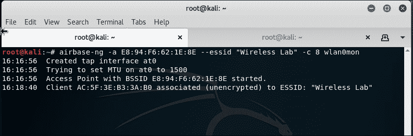

## *刚刚发生了什么？*

我们为授权网络创建了一个“邪恶双胞胎”，并使用去认证攻击让合法客户端重新连接到我们，而不是授权网络接入点。

需要注意的是，在使用加密（如 WEP/WPA）的授权接入点情况下，进行能够窃听流量的攻击更加困难。我们将在后续章节中探讨如何使用 Caffe Latte 攻击在仅使用客户端的情况下破解 WEP 密钥。

## 来吧英雄 – 邪恶双胞胎与频道跳跃

在之前的练习中，在不同频道上运行邪恶双胞胎，并观察客户端一旦断开连接，如何切换频道重新连接接入点。客户端决定连接哪个接入点的决定因素是什么？是信号强度吗？进行实验并验证。

# 一个 rogue 接入点

**rogue 接入点**是一个未经授权的接入点，它连接到授权网络。通常，攻击者可以利用这个接入点作为后门，从而绕过网络上的所有安全控制。这意味着，网络边界的防火墙、入侵预防系统等，几乎无法阻止他访问网络。

在最常见的情况下，rogue 接入点设置为开放认证且没有加密。可以通过以下两种方式创建 rogue 接入点：

+   在授权网络上安装实际的物理设备作为 rogue 接入点。（这是我留给你的练习。）此外，除了无线安全之外，这还涉及到突破授权网络的物理安全。

+   在软件中创建 rogue 接入点，并将其与本地授权以太网网络进行桥接。这将使任何运行在授权网络上的笔记本电脑都能作为 rogue 接入点。我们将在下一个实验中探讨这一点。

# 行动时间 – 设置 rogue 接入点

按照以下说明开始：

1.  让我们首先使用 `airbase-ng` 启动 rogue 接入点，并将其 ESSID 设置为 `Rogue`：

1.  现在我们想在以太网接口（它是授权网络的一部分）和我们的 rogue 接入点接口之间创建一个桥接。为此，我们将首先安装 `bridge-utils` 文件，创建一个桥接接口，并将其命名为 `Wifi-Bridge`：

    ```
    **apt-get install bridge-utils**
    **brctl addbr Wifi-Bridge**

    ```

    以下截图显示了执行所需命令的操作：

    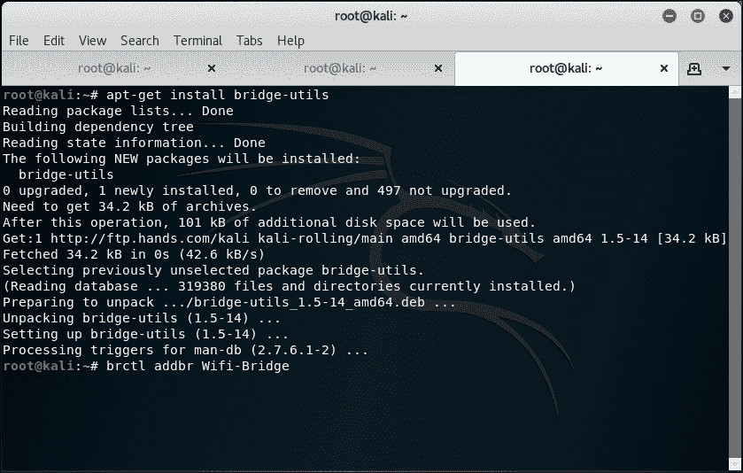

1.  然后，我们将把以太网接口和 `airbase-ng` 创建的 `at0` 虚拟接口添加到这个桥接中：

    ```
    **brctl addif Wifi-Bridge eth0**
    **brctl addif Wifi-Bridge at0**

    ```

    以下是命令的截图：

    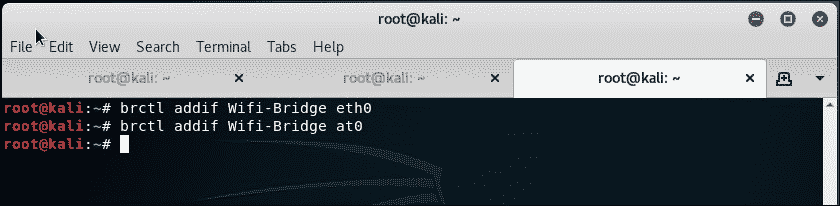

1.  我们接着通过以下命令启用此接口，以便启动桥接：

    ```
    **ifconfig eth0 0.0.0.0 up**
    **ifconfig at0 0.0.0.0 up**

    ```

    以下是命令的截图：

    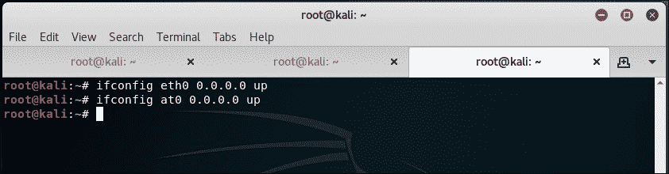

1.  我们接着会在内核中启用 IP 转发，以确保数据包被转发：

    ```
    **echo 1 > /proc/sys/net/ipv4/ip_forward**

    ```

    以下是命令的截图：

    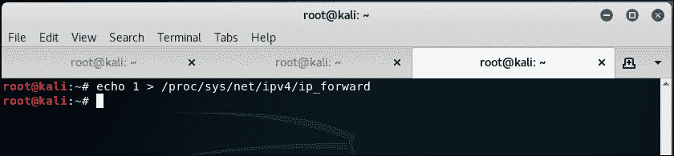

1.  太棒了！我们完成了。现在，任何连接到我们恶意接入点的无线客户端都可以通过我们刚刚建立的无线到有线`Wifi-Bridge`完全访问授权网络。我们可以通过将客户端连接到恶意接入点来验证这一点。

1.  然后使用以下命令启动桥接：

    ```
    **ifconfig Wifi-Bridge up**

    ```

1.  注意，它从运行在授权局域网上的 DHCP 守护进程获取了一个 IP 地址。

1.  现在，我们可以使用这个恶意接入点从无线客户端访问有线网络上的任何主机。

## *刚才发生了什么？*

我们创建了一个恶意接入点，并用它通过无线网络桥接所有授权网络的局域网流量。如你所见，这是一种非常严重的安全威胁，因为任何人都可以通过这个桥接进入有线网络。

## 来挑战吧英雄 – 恶意接入点挑战

检查你是否可以创建一个使用 WPA/WPA2 加密的恶意接入点，以使其在无线网络上看起来更合法。

## 快问快答 – 无线局域网基础设施攻击

Q1. 恶意接入点通常使用什么加密？

1.  无

1.  WEP

1.  WPA

1.  WPA2

Q2. 恶意双胞胎拥有与授权接入点相同的 MAC 地址有什么优势？

1.  它使得检测恶意双胞胎变得更加困难

1.  它强制客户端连接到它

1.  它增加了网络的信号强度

1.  以上都不是

Q3. 拒绝服务攻击做什么？

1.  它们降低了网络的整体吞吐量

1.  它们不针对客户端

1.  只有在我们知道网络 WEP/WPA/WPA2 凭据的情况下才能完成这些攻击

1.  以上所有

Q4. 恶意接入点做什么，它们如何被创建？

1.  它们允许通过后门进入授权网络

1.  它们仅使用 WPA2 加密

1.  它们可以作为基于软件的接入点创建，或者可以是实际的设备

1.  1 和 3 都对

# 总结

在本章中，我们探讨了破坏无线局域网基础设施安全的不同方式：

+   破坏接入点上的默认帐户和凭据

+   拒绝服务攻击

+   恶意双胞胎和 MAC 伪造

+   企业网络中的恶意接入点

在下一章，我们将查看针对无线局域网客户端的不同攻击。有趣的是，大多数管理员认为客户端没有什么安全问题需要担心。我们将看到，事实远非如此。
