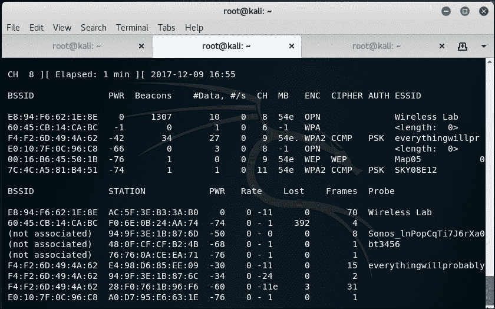
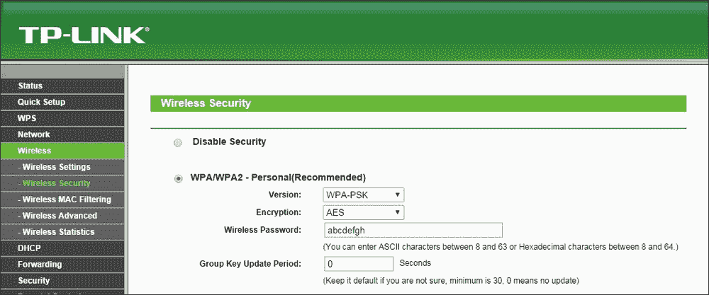

# 第六章：攻击客户端

|   | *“安全就像是最弱的一环。”* |   |
| --- | --- | --- |
|   | --*信息安全领域的名言* |

*大多数渗透测试人员似乎把所有注意力都集中在 WLAN 基础设施上，却没有给予无线客户端同等的关注。然而，有趣的是，黑客也可以通过攻破无线客户端来访问授权的网络。*

*在本章中，我们将把注意力从 WLAN 基础设施转移到无线客户端。客户端可以是已连接的，也可以是孤立的未关联客户端。我们将探讨可以用来针对客户端的各种攻击。*

我们将覆盖以下主题：

+   蜜罐和错误关联攻击

+   Caffe Latte 攻击

+   去认证和断开关联攻击

+   Hirte 攻击

+   无 AP 的 WPA-Personal 破解

# 蜜罐和错误关联攻击

通常，当一个无线客户端（如笔记本电脑）开启时，它会探测之前连接过的网络。这些网络会存储在 Windows 系统中的 **首选网络列表** (**PNL**) 中。同时，客户端会显示其范围内的任何可用网络。

黑客可能会做以下一项或多项事情：

+   静默监控探测并启动一个虚假接入点，使用客户端正在搜索的相同 ESSID。这将导致客户端连接到黑客机器，认为它是合法的网络。

+   创建具有相同 ESSID 的虚假接入点，以劝说用户连接到黑客的设备。这类攻击在咖啡馆和机场等场所非常容易进行，因为用户可能正在寻找 Wi-Fi 连接。

+   使用记录的信息来了解受害者的活动和习惯，我们将在后续章节中详细介绍。

这些攻击被称为**蜜罐攻击**，因为黑客的接入点与合法的接入点发生了错误关联。

在接下来的练习中，我们将在实验室中进行这两种攻击。

# 行动时间 – 策划一个错误关联攻击

按照以下说明开始操作：

1.  在前面的实验中，我们使用了一个已连接到 `Wireless Lab` 接入点的客户端。现在让我们打开客户端，但不启动实际的 `Wireless Lab` 接入点。接下来运行 `airodump-ng wlan0mon` 并查看输出。你很快就会发现客户端处于 `未关联` 模式，并在其存储的配置文件中查找 `Wireless Lab` 和其他 SSID：

1.  为了了解发生了什么，让我们运行 Wireshark 并开始在`wlan0mon`接口上嗅探。正如预期的那样，你可能会看到很多与我们分析无关的数据包。应用 Wireshark 过滤器，只显示来自你使用的客户端 MAC 的探测请求数据包。过滤器应为`wlan.addr==<你的 mac> && wlan.fc.subtype==0x04)`：

1.  现在，你应该只看到来自客户端的探测请求数据包，且这些数据包是针对先前识别的 SSID 的。

1.  现在，让我们在黑客机器上使用以下命令启动一个名为`Wireless Lab`的伪接入点：

    ```
    **airbase-ng -a <MAC> --essid "Wireless Lab" -c <channel> wlan0mon**

    ```

    

1.  一分钟左右，客户端应该会自动连接到我们。这表明让客户端与伪接入点断开关联是多么容易：

1.  现在，我们将与另一个路由器竞争。我们将在合法接入点存在的情况下创建一个名为`Wireless Lab`的伪接入点。让我们打开我们的接入点，确保`Wireless Lab`对客户端可用。为了进行此实验，我们已将接入点的频道设置为`13`。让客户端连接到接入点。我们可以从`airodump-ng`中验证这一点，如下图所示：

1.  现在，让我们启动一个 SSID 为`Wireless Lab`的伪接入点：

1.  请注意，客户端仍然连接到`Wireless Lab`，即合法接入点：

1.  现在，我们将代表合法接入点向客户端发送广播去认证消息，以断开它们的连接：

假设我们伪造的接入点`Wireless Lab`的信号强度比合法接入点的信号强，客户端将连接到我们的伪接入点，而不是合法接入点。

我们可以通过查看`airbase-ng`的输出，验证客户端与我们伪接入点的新关联：


## *刚刚发生了什么？*

我们刚刚使用客户端探测到的列表并使用与邻近接入点相同的 ESSID 创建了一个蜜罐。在第一种情况下，客户端在搜索网络时自动连接到了我们；在后一种情况下，由于我们离客户端比真实接入点更近，我们的信号强度更高，客户端连接到了我们。

## 来试试吧英雄 – 强制客户端连接到蜜罐

在之前的练习中，如果客户端没有自动连接到我们，我们该怎么办？我们需要发送去认证包（deauthentication packet）来断开合法客户端与接入点的连接，然后，如果我们的信号强度更强，客户端就会连接到我们伪造的接入点。试试这个方法：将客户端连接到一个合法接入点，然后强制它连接到你的蜜罐。

# Caffe Latte 攻击

在蜜罐攻击中，我们注意到客户端会不断地探测之前连接过的 SSID。如果客户端曾连接到一个 WEP 加密的接入点，像 Windows 这样的操作系统会缓存并存储 WEP 密钥。下次客户端连接到同一个接入点时，Windows 无线配置管理器会自动使用已存储的密钥。

**Caffe Latte 攻击**是由本书的作者之一 Vivek 发明的，并在美国圣地亚哥的 Toorcon 9 大会上进行了展示。Caffe Latte 攻击是一种 WEP 攻击，允许黑客通过客户端仅仅从客户端获取授权网络的 WEP 密钥。这个攻击不要求客户端必须靠近授权 WEP 网络，它可以仅使用隔离的客户端来破解 WEP 密钥。

在下一个练习中，我们将通过 Caffe Latte 攻击从客户端获取一个网络的 WEP 密钥。

# 行动时刻 – 执行 Caffe Latte 攻击

按照以下说明开始操作：

1.  让我们首先为网络`Wireless Lab`设置一个合法的 WEP 接入点，使用`ABCDEFABCDEFABCDEF12`这个十六进制密钥：

    让我们将客户端连接到该接入点，并使用`airodump-ng`验证连接是否成功，如下图所示：

    

1.  让我们拔掉接入点电源，确保客户端处于未关联状态，并开始搜索 WEP 网络`Wireless Lab`。

1.  现在，我们使用`airbase-ng`启动一个接入点，SSID 设置为`Wireless Lab`，命令参数为`airbase-ng -a <AP MAC> --essid <AP SSID> -L -W 1 -c <channel> wlan0mon`，如下所示：

1.  一旦客户端连接到该接入点，`airbase-ng`将启动 Caffe Latte 攻击，如下所示：

1.  现在我们启动`airodump-ng`，只收集该接入点的数据包，正如我们在 WEP 破解场景中做的那样，命令为`airodump-ng wlan0mon -c <AP channel> --essid <AP SSID> -w <prefix>`：

1.  我们还像之前 WEP 破解练习中那样启动`aircrack-ng`来开始破解过程。命令行格式为`aircrack-ng filename`，其中 filename 是由`airodump-ng`创建的文件名。

## *刚刚发生了什么？*

我们成功地从无线客户端中提取了 WEP 密钥，而无需实际使用或接近接入点。这就是 Caffe Latte 攻击的威力。

简单来说，WEP 接入点不需要向客户端证明它知道 WEP 密钥就能接收加密流量。每次连接到新网络时，发送到路由器的第一个数据流量将是一个 ARP 请求，请求一个 IP 地址。

攻击通过翻转位并重放无线客户端在与我们创建的伪接入点关联后发送的 ARP 数据包来进行。这些翻转的 ARP 请求数据包导致无线客户端发送更多的 ARP 响应数据包。

位翻转会改变加密值，生成不同的加密值。在这种情况下，我们可以通过翻转加密的 ARP 请求来创建一个高精度的 ARP 响应。一旦我们发送回有效的 ARP 响应，就可以反复重放该值，以生成我们需要的流量来解密 WEP 密钥。

请注意，所有这些数据包都是使用存储在客户端上的 WEP 密钥加密的。一旦我们能够收集到大量这些数据包，`aircrack-ng`就能够轻松恢复 WEP 密钥。

## 加油英雄 – 练习成就完美！

尝试更改 WEP 密钥并重复攻击。这是一个难度较大的攻击，成功组织它需要一些练习。使用 Wireshark 并检查无线网络上的流量也是一个不错的主意。

# 去认证和去关联攻击

我们在之前的章节中也看到过去认证攻击，尤其是在接入点的上下文中。在本章中，我们将探索客户端上下文中的这种攻击。

在下一个实验中，我们将只向客户端发送去认证数据包，打破接入点与客户端之间已建立的连接。

# 行动时间 – 使客户端断开连接

按照以下说明开始：

1.  让我们首先重新启动我们的接入点`Wireless Lab`。我们保持其在 WEP 模式下运行，以证明即使启用了加密，仍然可以攻击接入点和客户端连接。我们将使用`airodump-ng`验证接入点是否已启动：

1.  让我们将客户端连接到这个接入点，并使用`airodump-ng`验证：

1.  现在我们将运行`aireplay-ng`来针对接入点连接进行攻击：

1.  客户端被断开连接并尝试重新连接到接入点。我们可以使用 Wireshark 来验证这一点，就像我们之前做的一样：

1.  我们现在已经看到，即使在 WEP 加密存在的情况下，也可以取消认证客户端并断开连接。在 WPA/WPA2 加密存在的情况下也是如此。现在让我们将接入点设置为 WPA 加密并进行验证：

1.  让我们将客户端连接到接入点并确保它已连接：

1.  现在让我们运行`aireplay-ng`，将客户端从接入点断开：

## *刚才发生了什么？*

我们刚刚学会了如何使用去认证帧在即使存在像 WEP/WPA/WPA2 这样的加密协议时，选择性地将无线客户端从接入点断开连接。这是通过仅向接入点-客户端对发送去认证数据包，而不是向整个网络发送广播去认证来实现的。

## 动手吧，英雄 – 对客户端进行去关联攻击

在上一个练习中，我们使用了取消认证攻击来中断连接。尝试使用去关联数据包来中断客户端与接入点之间的已建立连接。

# Hirte 攻击

我们已经看到如何进行 Caffe Latte 攻击。Hirte 攻击通过使用分片技术扩展了 Caffe Latte 攻击，并允许几乎任何数据包都能被使用。

有关 Hirte 攻击的更多信息，请访问 Aircrack-ng 官网：[`www.aircrack-ng.org/doku.php?id=hirte`](http://www.aircrack-ng.org/doku.php?id=hirte)。

现在我们将使用`aircrack-ng`对同一客户端进行 Hirte 攻击。

# 行动时间 – 使用 Hirte 攻击破解 WEP

按照以下步骤开始：

1.  使用`airbase-ng`工具创建一个与 Caffe Latte 攻击中完全相同的 WEP 接入点。唯一的额外选项是使用`-N`选项而不是`-L`选项来启动 Hirte 攻击：

1.  在一个单独的窗口中启动`airodump-ng`，以捕获`无线实验室`蜜罐的数据包：

1.  现在，`airodump-ng`将开始监控该网络，并将数据包存储在`Hirte-01.cap`文件中：

1.  一旦漫游客户端连接到我们的蜜罐接入点，Hirte 攻击将由`airbase-ng`自动启动：

1.  我们像进行 Caffe Latte 攻击一样启动`aircrack-ng`，最终密钥将被破解。

## *刚才发生了什么？*

我们针对一个被隔离且远离授权网络的 WEP 客户端发起了 Hirte 攻击。我们用与 Caffe Latte 攻击相同的方式破解了密钥。

## 动手吧，英雄 – 练习，练习，再练习

我们建议在客户端设置不同的 WEP 密钥，并尝试多次进行这个练习，以增强信心。你可能会注意到，很多时候你需要重新连接客户端才能使其正常工作。

# 无 AP WPA-Personal 破解

在第四章中，*WLAN 加密漏洞*一节，我们演示了如何使用`aircrack-ng`破解 WPA/WPA2 PSK。基本的思路是捕获四路 WPA 握手数据包，然后发起字典攻击。

一百万美元的问题是：仅凭客户端是否能破解 WPA-Personal？不，接入点不需要！

让我们回顾一下 WPA 破解练习，唤起我们的记忆：


要破解 WPA，我们需要从四路握手中获取以下四个参数——**认证者随机数**（**ANonce**）、**请求者随机数**（**SNonce**）、认证者 MAC 地址和请求者 MAC 地址。现在，有趣的是，我们并不需要四个握手数据包中的所有数据包就能提取这些信息。我们可以通过四个数据包，数据包 1 和 2，或者仅仅是数据包 2 和 3 来获取这些信息。

为了破解 WPA-PSK，我们将启动一个 WPA-PSK 蜜罐，当客户端连接到我们时，只有**消息 1**和**消息 2**会传递过来。由于我们不知道密码短语，我们无法发送**消息 3**。然而，**消息 1**和**消息 2**包含了开始破解密钥过程所需的所有信息：


# 行动时间——无 AP WPA 破解

1.  我们将设置一个 WPA-PSK 蜜罐，ESSID 为`Wireless Lab`。`-z 2`选项会创建一个使用 TKIP 的 WPA-PSK 接入点：

1.  让我们同时启动`airodump-ng`来捕获这个网络的数据包：

1.  现在，当我们的漫游客户端连接到这个接入点时，它会启动握手过程，但在**消息 2**后未能完成，正如之前所讨论的那样；然而，破解握手所需的数据已经被捕获。

1.  我们将`airodump-ng`捕获的文件通过`aircrack-ng`与之前相同的字典文件进行处理；最终，密码短语像之前一样被破解。

## *刚刚发生了什么？*

我们成功地通过仅使用客户端破解了 WPA 密钥。这是因为，即使只有前两个数据包，我们也已经具备了发起字典攻击所需的所有信息。

## 来一场挑战吧——无 AP WPA 破解

我们建议在客户端设置不同的 WEP 密钥，并尝试多次进行这个练习，以增强信心。你可能会注意到，很多时候你需要重新连接客户端才能使其正常工作。

## 快速测试——攻击客户端

Q1. Caffe Latte 攻击可以恢复哪个加密密钥？

1.  无

1.  WEP

1.  WPA

1.  WPA2

Q2. 蜜罐接入点通常会使用什么？

1.  无加密，开放认证

1.  无加密，共享认证

1.  WEP 加密，开放认证

1.  上述内容都不包括

Q3. 以下哪个是 DoS 攻击？

1.  误关联攻击

1.  去认证攻击

1.  去关联攻击

1.  2 和 3 都正确

Q4. Caffe Latte 攻击需要什么？

1.  无线客户端必须处于接入点的无线范围内

1.  客户端包含一个缓存和存储的 WEP 密钥

1.  WEP 加密至少使用 128 位加密

1.  1 和 3 都正确

# 总结

在这一章中，我们了解到即使是无线客户端也容易受到攻击。这些攻击包括蜜罐攻击和其他误关联攻击；Caffe Latte 攻击，用来从无线客户端获取密钥，去认证和去关联攻击导致拒绝服务（Denial of Service），Hirte 攻击作为从漫游客户端获取 WEP 密钥的替代方法，最后是仅通过客户端破解 WPA-Personal 密码。

在下一章中，我们将利用目前所学的知识，对客户端和基础设施侧进行各种高级无线攻击。所以，赶紧翻到下一章吧！
