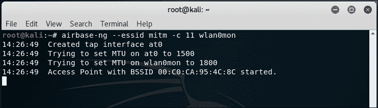
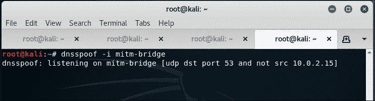

# 第七章 高级 WLAN 攻击

|   | *“知己知彼，百战不殆。”* |   |
| --- | --- | --- |
|   | --*孙子，《孙子兵法》* |

*作为一名渗透测试员，了解黑客可以执行的高级攻击非常重要，即使你在渗透测试中可能不会检查或演示这些攻击。本章将展示黑客如何利用无线接入点作为起点来实施高级攻击。*

在本章中，我们将探讨如何利用到目前为止学到的知识进行高级攻击。我们将主要关注**中间人**（**MITM**）攻击，这种攻击需要一定的技巧和实践才能成功实施。一旦我们完成这一步，我们将利用 MITM 攻击作为基础，进行更复杂的攻击，比如窃听和会话劫持。

本章将涵盖以下主题：

+   中间人攻击

+   使用 MITM 进行无线窃听

+   使用 MITM 进行会话劫持

# 中间人攻击

MITM 攻击可能是对 WLAN 系统最具威胁的攻击之一。可以使用不同的配置来进行此攻击。我们将使用最常见的配置——攻击者通过有线局域网连接到互联网，并在其客户端卡上创建一个虚假的接入点。这个接入点广播一个与附近本地热点相似的 SSID。用户可能会不小心连接到这个虚假的接入点（或者根据我们在前几章讨论的较强信号理论，被迫连接到该接入点），并可能继续认为自己连接的是合法的接入点。

攻击者现在可以通过他在有线和无线接口之间创建的桥接，透明地转发所有用户的互联网流量。

在接下来的实验中，我们将模拟此攻击。

# 行动时间 – 中间人攻击

按照以下指示开始：

1.  为了创建 MITM 攻击环境，我们将首先在黑客的笔记本上使用`airbase-ng`创建一个名为`mitm`的软接入点。我们运行以下命令：

    ```
    **airbase-ng --essid mitm -c 11 wlan0mon**

    ```

    该命令的输出如下：

    

1.  需要注意的是，当运行`airbase-ng`时，它会创建一个接口`at0`（一个 tap 接口）。可以把它当作我们基于软件的接入点`mitm`的有线侧接口：

1.  现在我们在黑客的笔记本上创建一个由有线接口（`eth0`）和无线接口（`at0`）组成的桥接。使用的命令序列如下：

    +   `brctl addbr mitm-bridge`

    +   `brctl addif mitm-bridge eth0`

    +   `brctl addif mitm-bridge at0`

    +   `ifconfig eth0 0.0.0.0 up`

    +   `ifconfig at0 0.0.0.0 up`

    

1.  我们可以为这个桥接分配一个 IP 地址，并检查与网关的连接性。请注意，我们也可以使用 DHCP 来完成此操作。我们可以通过以下命令为桥接接口分配 IP 地址：

    ```
    **ifconfig mitm-bridge 192.168.0.199 up**

    ```

    

    然后我们可以尝试 ping 网关`192.168.0.1`，以确保我们已连接到网络的其余部分。

1.  现在让我们开启内核中的 IP 转发功能，以便路由和数据包转发能够正确进行，使用以下命令：

    ```
    **echo 1 > /proc/sys/net/ipv4/ip_forward**

    ```

    命令的输出如下：

    

1.  现在让我们将一个无线客户端连接到我们的接入点`mitm`。它将自动通过 DHCP（运行在有线网关上的服务器）获取 IP 地址。在这种情况下，客户端机器接收到 IP 地址`192.168.0.197`。我们可以通过 ping 有线网关`192.168.0.1`来验证连接性：

1.  我们可以看到主机响应了`ping`请求，如下所示：

1.  我们还可以通过查看黑客机器上的`airbase-ng`终端来验证客户端是否已连接：

1.  有趣的是，由于所有流量都从无线接口转发到有线接口，我们可以完全控制流量。我们可以通过启动 Wireshark 并在`at0`接口上嗅探来验证这一点：

1.  现在让我们从客户端机器 ping 网关`192.168.0.1`。即使这些数据包并不发送给我们，我们也能在 Wireshark 中看到这些数据包（应用 ICMP 显示过滤器）。这就是 MITM 攻击的威力：

## *刚刚发生了什么？*

我们成功地创建了一个无线中间人攻击（MITM）的设置。我们通过创建一个假接入点，并将其与以太网接口桥接来实现这一点。这确保了任何连接到假接入点的无线客户端都会感知到自己通过有线局域网连接到了互联网。

## 来吧，英雄 – 纯无线 MITM 攻击

在上一个练习中，我们将无线接口与有线接口桥接。如前所述，这是 MITM 攻击的一种可能连接架构。还有其他组合也是可能的。一种有趣的方式是使用两张无线网卡，其中一张用于创建假接入点，另一张则连接到授权的接入点。这两张网卡会被桥接。因此，当无线客户端连接到我们的假接入点时，它会通过攻击者的机器连接到授权的接入点。

请注意，这个配置需要攻击者的笔记本电脑上使用两张无线网卡。

检查是否可以使用笔记本电脑内置的网卡与外部网卡一起进行此攻击——请注意，您可能没有执行此操作所需的注入驱动程序。这应该是一个不错的挑战！

# 使用 MITM 进行无线窃听

在前一个实验中，我们学习了如何创建 MITM 设置。现在，我们将看看如何使用此设置进行无线窃听。

整个实验的核心原则是：受害者的所有流量现在都通过攻击者的计算机路由。因此，攻击者可以无线窃听受害者计算机发送和接收的所有流量。

# 行动时间 - 无线窃听

按照以下说明开始操作：

1.  复制前一个实验中的所有设置。启动 Wireshark。有趣的是，即使是 MITM-bridge 也显示了出来。如果我们愿意，可以通过此接口查看桥接流量：

1.  在`at0`接口上开始嗅探，以便我们可以监控无线客户端发送和接收的所有流量。在无线客户端上，打开任意网页。以我的情况为例，无线接入点还连接到 LAN，我将通过地址`http://192.168.0.1`打开它：

1.  使用密码登录并进入管理界面。

1.  在 Wireshark 中，我们应该看到大量的活动：

1.  设置 HTTP 过滤器，仅查看网页流量：

1.  我们可以轻松找到用于将密码发送到无线接入点的 HTTP post 请求：

## *刚刚发生了什么？*

我们创建的 MITM 设置现在允许我们在受害者不知情的情况下窃听其无线流量。这之所以可能，是因为在 MITM 中，所有流量都通过攻击者的机器中转。因此，受害者的所有未加密流量都可以被攻击者窃听。

# 无线会话劫持

另一个我们可以在 MITM 攻击之上构建的有趣攻击是应用会话劫持。在 MITM 攻击过程中，受害者的数据包被发送到攻击者。此时，攻击者的责任是将这些数据包转发到合法目的地，并将目的地的响应转发给受害者。需要注意的是，在此过程中，攻击者可以修改数据包中的数据（如果未加密且未防篡改）。这意味着他可以修改、篡改，甚至默默丢弃数据包。

在下一个例子中，我们将查看如何使用 MITM 设置进行无线 DNS 劫持。然后，利用 DNS 劫持，我们将劫持浏览器会话并访问[`www.google.com`](https://www.google.com)。

# 行动时间 - 无线会话劫持

1.  按照 MITM 攻击实验中的设置进行测试。在受害者机器上，启动浏览器并输入[`www.google.com`](https://www.google.com)。我们使用 Wireshark 来监控此流量。你的屏幕应该类似于以下内容：

1.  对 DNS 应用 Wireshark 过滤器，如我们所见，受害者正在为[`www.google.com`](https://www.google.com)发出 DNS 请求：

1.  为了劫持浏览器会话，我们需要发送伪造的 DNS 响应，将[`www.google.com`](https://www.google.com)的 IP 地址解析为黑客机器的 IP 地址`192.168.0.199`。我们将使用的工具是`dnsspoof`，其语法如下：

    ```
    **dnsspoof –i mitm-bridge**

    ```

    命令的输出如下：

    

1.  刷新浏览器窗口，现在，我们可以通过 Wireshark 看到，一旦受害者向任何主机（包括[`www.google.com`](https://www.google.com)）发出 DNS 请求，`dnsspoof`便会回复。

1.  在受害者机器上，我们看到错误提示**无法连接**。这是因为我们将[`www.google.com`](https://www.google.com)的 IP 地址设置为`192.168.0.199`，即黑客机器的 IP，但`80`端口上没有服务在监听：

1.  使用以下命令在 Kali 上运行 Apache：

    ```
    **apachet2ctl start**

    ```

    命令的输出如下：

    

1.  现在，一旦我们刷新受害者的浏览器，浏览器便显示 Apache 的默认**It Works!**页面：

1.  本示范展示了如何拦截数据并发送伪造的响应来劫持受害者的会话。

## *发生了什么？*

我们进行了一次应用劫持攻击，基于无线 MITM 攻击。那幕后发生了什么？MITM 的设置确保我们能够看到受害者发送的所有数据包。一旦我们看到受害者发出的 DNS 请求数据包，运行在攻击者笔记本上的`dnsspoof`程序就会向受害者发送一个 DNS 响应，包含攻击者机器的 IP 地址（即[`www.google.com`](https://www.google.com)的地址）。受害者的笔记本接受了这个响应，并且浏览器向攻击者的 IP 地址发出了 HTTP 请求，端口为`80`。

在实验的第一部分，攻击者机器的`80`端口上没有监听进程，因此，Firefox 报错。然后，一旦我们在攻击者的机器上启动了`80`端口（默认端口）的 Apache 服务器，浏览器的请求便收到了攻击者机器的响应，并显示了默认的**It Works!**页面。

本实验向我们展示了，一旦我们完全控制了较低层（在此为第二层），就很容易劫持运行在更高层的应用程序，如 DNS 客户端和网页浏览器。

## 动手吧，英雄——应用程序劫持挑战

使用无线 MITM 进行会话劫持的下一步是修改客户端传输的数据。探索 Kali 中可用的软件**Ettercap**。这将帮助你创建用于网络流量的搜索和替换过滤器。

在这个挑战中，编写一个简单的过滤器，将网络流量中所有的安全出现的地方替换为不安全。尝试在 Google 上搜索安全，查看结果是否会显示为不安全。

# 查找客户端的安全配置

在前几章中，我们已经看到如何为开放接入点、WEP 保护和 WPA 创建蜜罐，但是，当我们在现场并看到客户端的探测请求时，如何知道探测的 SSID 属于哪个网络呢？

尽管这开始看起来有点棘手，但这个问题的解决方案其实很简单。我们需要同时创建广播相同 SSID 但具有不同安全配置的接入点。当客户端漫游时，它会根据存储在客户端上的网络配置，自动连接到这些接入点之一。

那么，让游戏开始吧！

# 行动时刻 – 对客户端的去认证攻击

我们假设无线客户端上配置了一个名为`Wireless Lab`的网络，并且当它未连接到任何接入点时，会主动发送该网络的探测请求。为了找到该网络的安全配置，我们需要创建多个接入点。对于我们的讨论，我们假设客户端配置的网络为开放网络、WEP 保护、WPA-PSK 或 WPA2-PSK。这意味着我们将需要创建四个接入点：

1.  为此，我们将首先创建四个虚拟接口——从`wlan0mon`到`wlan0mon3`，使用命令`iw wlan0 interface add wlan0mon type monitor`多次执行，每次将监视器名称的末尾加 1：

1.  你可以使用命令`iwconfig`查看所有这些新创建的接口：

1.  现在我们将在`wlan0mon`上创建开放 AP：

1.  让我们在`wlan0mon1`上创建 WEP 保护的 AP：

1.  WPA-PSK AP 将位于`wlan0mon2`上：

1.  WPA2-PSK AP 将位于`wlan0mon3`上：

1.  我们可以在相同的频道上运行`airodump-ng`，以确保所有四个接入点都在正常运行， 如下图所示：

1.  现在让我们切换漫游客户端的 Wi-Fi。根据您之前连接的 `Wireless Lab` 网络，它将连接到相应的安全配置。以我的情况为例，它连接到 WPA-PSK 网络，如下图所示：

## *刚刚发生了什么？*

我们创建了多个具有相同 SSID 但不同安全配置的蜜罐。根据客户端为 `Wireless Lab` 网络存储的配置，它将连接到相应的网络。

这一技巧非常有用，因为在进行渗透测试时，您并不清楚客户端笔记本上存储的具体安全配置。通过设置诱饵，您可以找到合适的配置。这种技术也称为**WiFishing**。

## 试试看 – 诱饵客户端

在客户端上为相同的 SSID 创建不同的安全配置，并检查您的蜜罐集合是否能够检测到它们。

需要注意的是，许多 Wi-Fi 客户端可能不会主动探测它们在配置文件中存储的网络。使用我们在这里讨论的技术可能无法检测到这些网络。

## 快速小测验 – 高级 WLAN 攻击

Q1\. 在 MITM 攻击中，谁处于中间？

1.  接入点

1.  攻击者

1.  受害者

1.  以上都不是

Q2\. `dnsspoof`：

1.  欺骗 DNS 请求

1.  欺骗 DNS 响应

1.  需要在 DNS 服务器上运行

1.  需要在接入点上运行

Q3\. 无线 MITM 攻击可以通过以下方式进行：

1.  同时在所有无线客户端上

1.  一次只能使用一个频道

1.  在任何 SSID 上

1.  2 和 3

Q4\. 在我们的 MITM 设置中，哪个接口最接近受害者？

1.  `at0`

1.  `eth0`

1.  `br0`

1.  `en0`

# 总结

在本章中，我们学习了如何利用无线进行高级攻击。我们为无线 MITM 攻击创建了一个设置，然后用它窃听受害者的流量。接着，我们利用相同的设置，通过 DNS 欺骗攻击劫持了受害者的应用层（具体来说是 Web 流量）。

在下一章中，我们将学习如何从规划、发现、攻击到报告阶段进行无线渗透测试。我们还将讨论如何保护 WLAN 的最佳实践。
