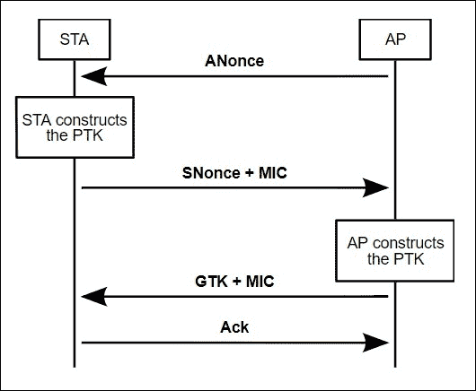
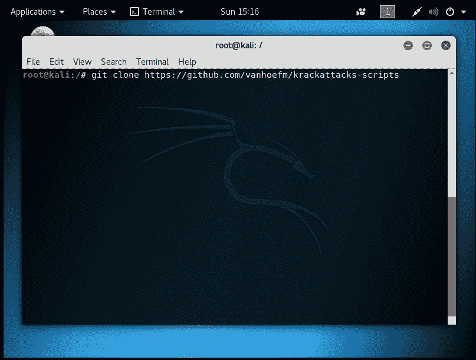
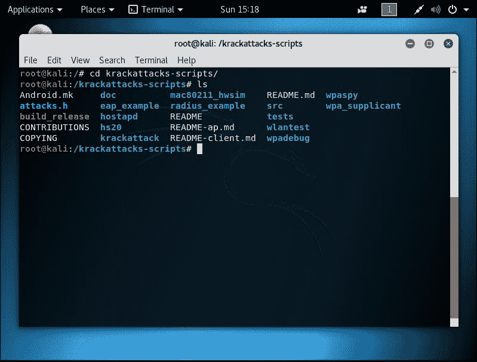
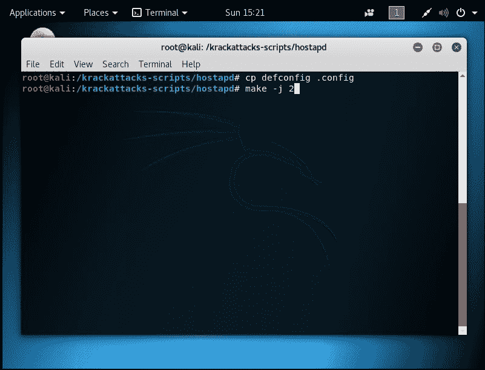
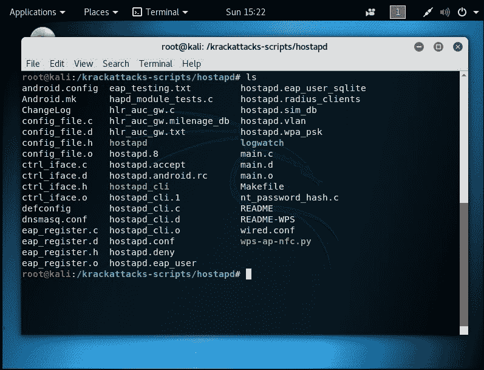
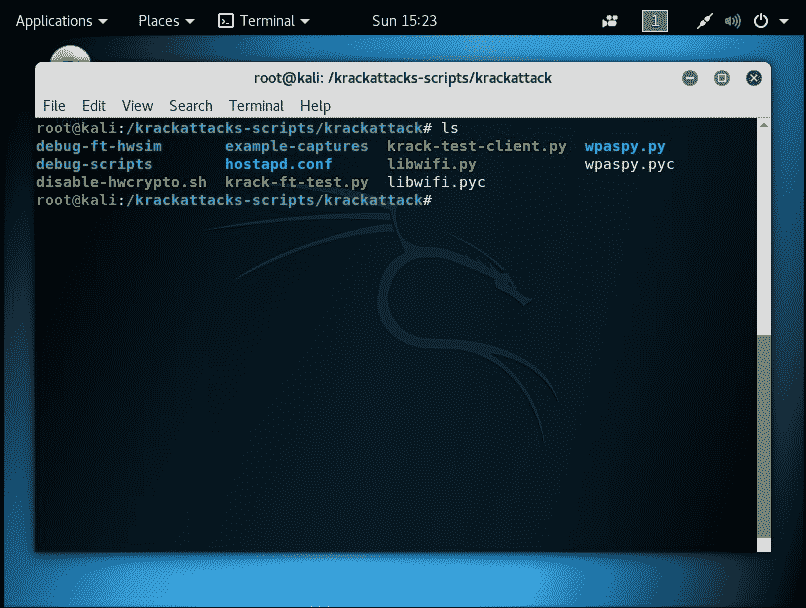
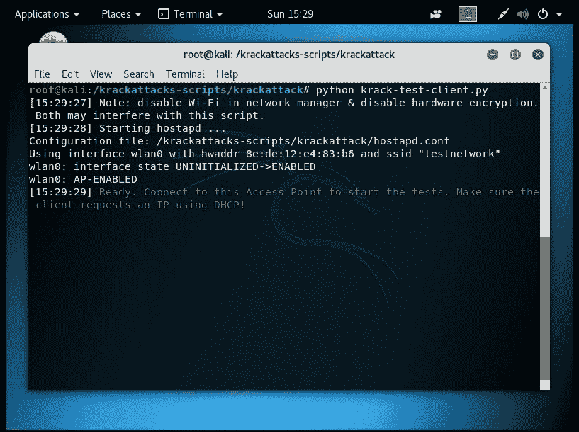
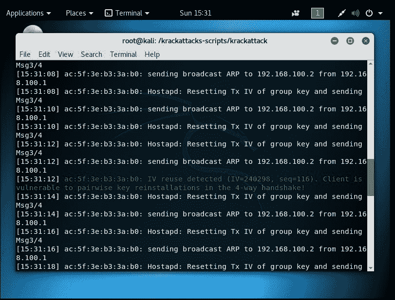

# 第八章 KRACK 攻击

|   | *"无视山脉，获取帝国"* |   |
| --- | --- | --- |
|   | --*汉尼拔（可能）* |

*本章讨论了最近发现的 KRACK 漏洞，并探讨了当前能够识别易受攻击设备的工具的状态。本章深入分析了 WPA2 握手的内部工作原理，推荐给高级读者。*

# KRACK 攻击概述

**KRACK** 代表 **密钥重安装攻击**。这是一个在 2017 年 10 月由 KU Leuven 团队公开披露的漏洞集合。该攻击利用了 WPA2 握手中的基本缺陷，允许重新发送握手的某个阶段，以便覆盖加密数据。本章将从理论层面介绍该攻击，并提供成功识别和利用此漏洞的一些指导。

让我们看看 WPA2 握手，标准可以在 IEEE 802.11 标准中找到，链接如下：[`ieeexplore.ieee.org/document/7792308/`](http://ieeexplore.ieee.org/document/7792308/)。在此解释中，我们从关联和身份验证后的阶段开始，因为该漏洞不受这些阶段的影响。

用于加密的 **对等临时密钥** (**PTK**) 由五个属性组成：

+   一个共享的秘密密钥，称为对等主密钥 (PMK)

+   由接入点创建的一个随机数值 (ANonce)

+   由用户站点创建的一个随机数值 (SNonce)

+   接入点 MAC 地址 (APMAC)

+   用户站点 MAC 地址 (STAMAC)

在整个过程中，**消息标识码** (**MIC**) 被用来提供一定程度的完整性和安全性。尽管它们在过程中至关重要，但在最终的加密数据中并未使用。以下是一个表示：



此时，由于初始的身份验证和关联过程，用户站点和接入点都拥有 PMK、接入点 MAC 地址和用户站点 MAC 地址。此外，每个阶段将有一个密钥重放计数器，跟踪数据包的顺序；这将在稍后发挥作用：

1.  **阶段 1**：接入点将 **ANonce** 值传输给用户站点，这为用户站点提供了生成 PTK 所需的一切。用户站点创建 PTK，并持有将用于加密的密钥。

1.  **阶段 2**：用户站点返回其自己的随机数值和 MIC。接入点现在持有创建 PTK 所需的一切。接入点创建 PTK，并处于与用户站点相同的状态。

1.  **阶段 3**：接入点创建并发送 **组临时密钥** (**GTK**) 给用户，使其能够读取非定向流量，如多播/广播流量。

1.  **阶段 4**：用户站点返回一个确认的声明。

在四阶段握手完成后，用户站点现在可以向接入点发送加密数据，并被接纳。在此时，协商阶段已完成，用户站点可以自由使用网络。

## *刚刚发生了什么？*

我们在为 KRACK 攻击的解释做准备时讨论了四阶段握手。到这一阶段时应该是回顾，但在深入技术细节之前，复习基础是很重要的。

# 四阶段握手 KRACK 攻击

记住我们刚才讨论的内容，你现在可能会惊讶地发现这个过程容易受到攻击！然而，问题并不在于核心概念，而是在于标准的实际实施。与大多数技术标准一样，为了使其易于使用，安全性在某些方面被妥协。具体而言，为了使解决方案可用，妥协的部分是使握手中的某些阶段在消息丢失时可以重放。

尽管对大多数过程而言这不是一个大问题，但第三阶段是可重放的，可能会对整体解决方案的安全性产生重大影响。通过在身份验证过程中处于**中间人**(**MITM**)位置，攻击者可以在某些情况下阻止正确协商的 PTK，并安装他们自己的 PTK。密钥协商时会重置密钥重放计数器和相关的 nonce 值。因此，通过阻止某些数据包，MITM 攻击者可以预测密钥重装时计数器和 nonce 值，并强迫重新安装密钥。这将使未来的攻击者能够执行恶意操作，例如解密、伪造和数据包重放。

然而，考虑到安全行业的运作方式，研究人员明智地只发布了**概念验证**(**PoC**)脚本，显示攻击可以在客户端设备上执行，并且他们没有发布完整的攻击脚本来完全对已建立的网络进行攻击。值得注意的是，他们已经宣布，Android 和 Linux 发行版易受密钥重装攻击的影响，该攻击迫使使用全零密钥，从而使流量解密变得轻而易举。

# 行动时间 – 开始破解 KRACK

我们现在将通过 Mathy VanHoef 的 GitHub 页面分发的脚本进行操作。

1.  首先，在 Kali 中打开终端并输入如下面截图所示的命令：

1.  我们需要安装项目所依赖的依赖项。我们将通过以下命令来实现：

    ```
    **apt-get install libnl-3-dev libnl-genl-3-dev pkg-config libssl-dev net-tools git sysfsutils python-scapy python-pycryptodome**

    ```

1.  进入创建的`krackattacks-scripts`目录并检查其中的内容。它应该如下所示：

    在这个文件夹中，你可以看到测试脚本的主体和 Mathy 以及团队共同编写的解决方案。不过，在开始使用它们之前，我们需要将`hostapd`编译成它们需要的格式。

    脚本本身在首次使用时会提供这些说明。不过，我在这里写出来以便更清楚。

1.  使用以下命令进入`hostapd`目录，如下截图所示：

    这将编译出可供 KRACK 攻击 PoC 脚本使用的`hostapd`。要验证它是否正确构建，文件夹应该如下所示：

    

1.  进入项目根目录下的`krackattack`目录。它应该看起来像以下截图所示：

    脚本建议首次使用时执行`disable-hwcrypto.sh`脚本。然而，在使用 Alfa AWUS051NH 和 Kali Linux 虚拟机时，我发现这个脚本会导致虚拟机崩溃，而脚本本身仍然能正常工作。是否执行这一步是用户的选择，但建议谨慎操作。

    该目录中还有另外三个重要的文件。首先，`hostapd.conf`定义了要生成的网络的 Wi-Fi 细节。默认值为`testnetwork`作为 SSID 和`abcdefgh`作为密码短语。可以根据需要更改这些设置。

    第二个，`krack-test-client.py`脚本是我们用来识别易受攻击设备的脚本。这是本章的主要内容。

    最后，有一个`krack-ft-test.py`脚本，由于它适用于一些特殊的无线设备，本章不会讲解如何使用它。

    接下来，我们就开始*KRACKing*。

1.  我们需要禁用网络管理器，以避免冲突，使用以下命令：

    ```
    **systemctl stop NetworkManager.service**
    **systemctl disable NetworkManager.service**

    ```

1.  然后，我们可以使用以下命令执行`krack-test-client.py`脚本：

    ```
    **python krack-test-client.py**

    ```

    然后你将看到以下截图：

    

1.  现在拿起一台测试设备，任何支持 Wi-Fi 的设备，并使用之前描述的凭据或你自己设置的凭据连接到创建的网络。

    终端将显示大量文本，但脚本会友好地将任何成功的攻击标记为绿色，如下截图所示：

    

该脚本将遍历潜在的攻击并通知用户所测试的设备是否存在漏洞。

## *刚刚发生了什么？*

我们成功地从 Mathy VanHoef 的 GitHub 页面获取了 PoC，并测试了一个用户设备，看看它是否存在漏洞。

# 总结

在本章中，我们已经讲解了新的 KRACK 攻击，介绍了 WPA2 握手的工作原理，并展示了如何对设备进行 PoC 检查。随着时间的推移，KRACK 攻击会不断发展，更多的脚本会被释放到网络中。读者应关注社区，保持对这一研究的新应用和有趣发展的关注。

读者还应访问研究人员的网页：[`www.krackattacks.com/`](https://www.krackattacks.com/)。

此外，阅读白皮书以便更好地理解，白皮书地址为：[`papers.mathyvanhoef.com/ccs2017.pdf`](https://papers.mathyvanhoef.com/ccs2017.pdf)。
