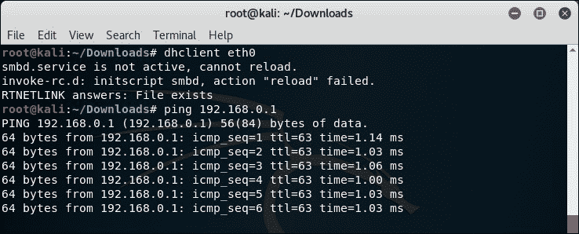

# 第九章 攻击 WPA-Enterprise 和 RADIUS

|   | "个子越大，摔得越重。" |   |
| --- | --- | --- |
|   | --*流行语* |

*WPA-Enterprise 一直被认为是一个无懈可击的安全方案。大多数网络管理员将其视为解决所有无线安全问题的万能药。在本章中，我们将看到，事实远非如此。*

在本章中，我们将学习如何使用 Kali 上可用的不同工具和技术攻击 WPA-Enterprise。

在本章中，我们将涵盖以下主题：

+   设置 FreeRADIUS-WPE

+   攻击 Windows 客户端上的 PEAP

+   企业安全最佳实践

# 设置 FreeRADIUS-WPE

我们需要一个 RADIUS 服务器来协调 WPA-Enterprise 攻击。最广泛使用的开源 RADIUS 服务器是 FreeRADIUS。然而，设置它是很困难的，而且为每个攻击配置它可能非常繁琐。

著名的安全研究员 Joshua Wright 为 FreeRADIUS 创建了一个补丁，使其更容易进行设置和攻击。这个补丁以 FreeRADIUS-WPE（**无线破坏版**）发布。Kali 默认不带 FreeRADIUS-WPE，因此你需要执行以下步骤来设置 FreeRADIUS-WPE：

使用`apt-get install freeradius-wpe`安装 FreeRADIUS-WPE。现在检查输出，确保它看起来像以下截图：

现在让我们快速在 Kali 上设置 RADIUS 服务器。

# 操作时间 – 使用 FreeRADIUS-WPE 设置 AP

按照以下说明开始：

1.  将接入点的一个 LAN 端口连接到运行 Kali 的计算机上的以太网端口。在我们的案例中，接口是`eth0`。启动该接口，并通过运行 DHCP 获取 IP 地址，如下所示的截图所示：

1.  登录到接入点并将安全模式设置为**WPA/WPA2-Enterprise**，将**版本**设置为**WPA2**，**加密方式**设置为**AES**。然后，在 EAP（802.1x）部分，输入**Radius 服务器 IP**地址作为 Kali 构建的 IP 地址。**Radius 密码**为`test`，如下所示的截图所示：

1.  现在让我们打开一个新的终端并进入目录`/etc/freeradius-wpe/3.0`。这里是所有 FreeRADIUS-WPE 配置文件所在的地方。

1.  打开`/mods-available/eap`。你会发现`default_eap_type`命令设置为`md5`。

1.  让我们将其更改为`peap`：

1.  让我们打开`clients.conf`文件。这是我们定义可以连接到 RADIUS 服务器的客户端列表的地方。有趣的是，如果你直接浏览到文件的底部，忽略示例设置，客户端的`secret`默认为`testing123`。我们需要将其更改为`test`，以匹配步骤 2：

1.  现在，我们已经准备好通过`freeradius-wpe –s –X`命令启动 RADIUS 服务器：

1.  一旦运行此命令，您将看到屏幕上显示大量调试信息，但最终服务器会稳定下来，开始监听请求。太棒了！我们现在已经准备好开始本章的实验。

## *刚才发生了什么？*

我们已经成功设置了 FreeRADIUS-WPE。我们将在本章接下来的实验中使用它。

## 大胆尝试，英雄 – 玩转 RADIUS

FreeRADIUS-WPE 有很多选项，熟悉这些选项可能是个好主意。最重要的是，花时间查看不同的配置文件以及它们如何协同工作。

# 攻击 PEAP

**受保护的扩展认证协议**（**PEAP**）是最常用的 EAP 版本。它是 Windows 系统原生支持的 EAP 机制。

PEAP 有两个版本：

+   PEAPv0 与 EAP-MSCHAPv2（这是最流行的版本，因为 Windows 本身支持此协议）

+   PEAPv1 与 EAP-GTC

PEAP 使用服务器端证书来验证 RADIUS 服务器。几乎所有针对 PEAP 的攻击都利用了证书验证中的错误配置。

在下一个实验中，我们将看看当客户端关闭证书验证时，如何破解 PEAP。

# 行动时间 – 破解 PEAP

按照给定的说明开始：

1.  我们再次检查`eap.conf`文件，确保启用了 PEAP：

1.  然后，我们通过`freeradius-wpe –s –X`命令重新启动 RADIUS 服务器：

1.  我们监控 FreeRADIUS-WPE 创建的日志文件：

1.  Windows 本身支持 PEAP。让我们确保证书验证已关闭：

1.  我们需要点击**配置**选项卡，在**安全密码（EAP-MSCHAP v2）**旁边，并告诉 Windows 不要自动使用我们的 Windows 登录名和密码：

1.  我们还需要强制它在**高级设置**对话框中选择**用户认证**：

1.  一旦客户端连接到接入点，客户端将被提示输入用户名和密码。我们使用`Monster`作为用户名，`abcdefghi`作为密码：

1.  一旦我们这样做，您应该能在日志文件中看到 MSCHAP-v2 挑战响应的出现。

1.  我们现在使用`asleap`工具，通过包含密码`abcdefghi`的密码列表文件来破解密码，我们成功破解了密码！

## *刚刚发生了什么？*

我们使用 FreeRADIUS-WPE 设置了我们的蜜罐。企业客户端错误配置，未使用 PEAP 的证书验证。这使得我们可以向客户端呈现自己的假证书，而客户端欣然接受。一旦这样做，MSCHAP-v2（内层身份验证协议）就会启动。当客户端使用我们的假证书加密数据时，我们能够轻松恢复用户名、挑战和响应元组。

MSCHAP-v2 容易受到字典攻击。我们使用`asleap`破解挑战和响应对，因为它似乎基于字典单词。

## 挑战一下，英雄 – 攻击 PEAP 的变种

PEAP 可能会被错误配置。即使启用了证书验证，如果管理员没有在“连接到这些服务器列表”中提到真实的服务器，攻击者也可以从任何列出的认证机构获得另一个域的真实证书。客户端仍然会接受这个证书。这个攻击还有其他变种。

我们鼓励您在本节中探索不同的可能性。

# EAP-TTLS

我们鼓励您尝试类似于我们为 PEAP 建议的攻击方法，来攻击 EAP-TTLS。

# 企业的安全最佳实践

我们已经见识了大量针对 WPA/WPA2 的攻击，包括个人版和企业版。根据我们的经验，我们推荐以下做法：

+   对于 SOHO 和中型企业，使用带有强密码的 WPA2-PSK。您可以使用最多 63 个字符，充分利用它们。

+   对于大型企业，使用带有 EAP-TLS 的 WPA2-Enterprise。这种方式使用客户端和服务器端证书进行身份验证，目前是无法破解的。

+   如果您必须在 WPA2-Enterprise 中使用 PEAP 或 EAP-TTLS，请确保启用证书验证，选择正确的认证机构，使用授权的 RADIUS 服务器，最后关闭任何允许用户接受新的 RADIUS 服务器、证书或认证机构的设置。

## 小测验 – 攻击 WPA-Enterprise 和 RADIUS

Q1. 以下哪项是 FreeRADIUS-WPE？

1.  从零开始编写的 RADIUS 服务器

1.  一个针对 FreeRADIUS 服务器的补丁

1.  默认在所有 Linux 系统中附带

1.  以上都不是

Q2. 以下哪项可以用来攻击 PEAP？

1.  假凭证

1.  假证书

1.  使用 WPA-PSK

1.  以上所有

Q3. EAP-TLS 使用什么？

1.  客户端证书

1.  服务器端证书

1.  选项 1 或 2

1.  选项 1 和 2

Q4. EAP-TTLS 使用什么？

1.  仅客户端证书

1.  服务器端证书

1.  基于密码的身份验证

1.  LEAP

# 总结

在本章中，我们看到了如何 compromise 一种运行 PEAP 或 EAP-TTLS 的 WPA-Enterprise 网络的安全，这两种是企业中最常见的认证机制。

在下一章中，我们将看看如何在实际渗透测试中将我们所学的所有内容付诸实践。
