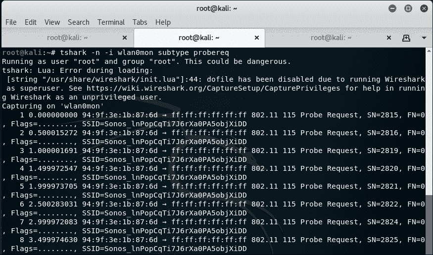

# 第十一章：WPS 和探测

|   | *“太阳底下无新事。”* |   |
| --- | --- | --- |
|   | --*俗话说* |

*本章涵盖了与 WPS 攻击和探测监控相关的新技术，还介绍了让无线测试变得更加简单的菠萝工具。这些攻击和工具自原书发布以来已出现，我们将确保尽可能全面地涵盖这些内容。*

# WPS 攻击

**无线保护设置**（**WPS**）于 2006 年推出，旨在帮助没有无线知识的用户建立安全网络。其理念是，Wi-Fi 设备会有一个单一的隐藏硬编码值，允许通过记住密钥进行访问。新设备将通过 Wi-Fi 路由器上的按钮进行身份验证。没有访问设备的外部人员将无法访问，从而减少了记住 WPA 密钥或设置较短密钥的问题。

在 2011 年末，发现了一个安全漏洞，使得 WPS 身份验证系统可以受到暴力破解攻击。协商 WPS 交换所需的流量是可以伪造的，而且 WPS PIN 只有八个字符，范围为 0-9。与八个字符的 azAZ09 密码相比，这一设置提供的可能组合只有 100,000,000，而后者有 218,340,105,584,896 种组合。

然而，仍然存在其他漏洞：

+   在 WPS PIN 的八个字符中，最后一个字符是前七个字符的校验和，因此是可预测的，这就只剩下最多 10,000,000 种可能性。

+   此外，剩余字符中的前四个和接下来的三个字符是分别检查的，这意味着有 104 + 103 种选择，或者说 11,000 种可能性。

通过在身份验证机制中做出的两个决策，我们将可能的组合从 100,000,000 个缩减到了 11,000 个。这意味着在暴力破解算法时，差距达到了六个小时。正是这些决策使得针对 WPS 的攻击变得可行。

在接下来的实验中，我们将通过使用 Wash 和 Reaver 来识别和攻击脆弱的 WPS 设置。

# 行动时间 – WPS 攻击

按照给定的说明开始：

1.  在我们攻击一个启用 WPS 的接入点之前，需要先创建一个。我们使用的 TP-Link 路由器默认开启了这一功能，这虽然让人担心，但也很方便。为了再次确认这一点，我们可以登录到路由器并点击 **WPS**。它应该如下所示：

1.  现在我们已经确认它准备好了。我们需要设置目标。我们需要设置测试环境。我们将使用 Wash 工具，而 Wash 需要一个监控接口才能工作。像之前做过的多次一样，我们需要通过以下命令设置一个接口：

    ```
    **airmon-ng start wlan0**

    ```

    输出将如下所示：

    

1.  我们已设置好监控接口 `wlan0mon`，并可以通过以下命令调用 Wash：

    ```
    **wash -i wlan0mon**

    ```

    

1.  Wash 会显示所有支持 WPS 的附近设备，指示它们是否已启用 WPS，是否解锁，并显示运行的版本：

1.  我们可以看到`Wireless Lab`网络支持 WPS。它使用的是版本 1，并且没有被锁定。太棒了。我们记录下 MAC 地址，在我的案例中是`E8:94:F6:62:1E:8E`，因为它将用于定位我们接下来的工具：`reaver`。

1.  Reaver 尝试通过暴力破解给定 MAC 地址的 WPS 密码。启动该过程的语法如下：

    ```
    **reaver -i wlan0mon -b <mac> -vv**

    ```

    输出结果如下：

    

1.  一旦启动，该工具将遍历所有可能的 WPS 密码组合并尝试进行认证。成功后，它将返回 WPS 密码和密码，如下所示的截图所示：

1.  拥有 WPA-PSK 后，我们现在可以正常认证了。我将我的设备保持在与 WPS 密码匹配的默认 WPA-PSK 上。然而，如果你想使用 WPS 密码进行认证，可以通过在`reaver`中指定密码来实现，命令如下：

    ```
    **reaver -i wlan0mon -b <mac> -vv -p 88404148**

    ```

    用你的密码替换我的密码。

## *刚刚发生了什么？*

我们成功地通过 Wash 识别了一个存在 WPS 漏洞的无线网络。然后我们使用 Reaver 恢复了 WPA 密钥和 WPS 密码。有了这些信息，我们就能认证该网络并继续进行网络渗透测试。

## 尝试一下，英雄 – 限制速率

在前面的练习中，我们攻击了一个完全没有保护的 WPS 安装。为了进一步保障安全，可以采用多种方法来保护安装，而无需完全移除 WPS。

尝试将 WPS 密码设置为任意值，然后再试一次，看看 Reaver 是否同样有效地破解它。

获取一款可以限制 WPS 尝试次数的无线路由器。尝试配置你的攻击，避免触发锁定。

# 探测嗅探

我们之前讨论过探测，以及它们如何用于识别隐藏网络和执行有效的恶意接入点攻击。它们还可以用来识别个体作为目标，或者通过最少的设备在大范围内跟踪他们。

当设备想要连接到一个网络时，它会发送一个包含其 MAC 地址和希望连接的网络名称的探测请求。我们可以使用诸如`airodump-ng`之类的工具来跟踪这些请求。然而，如果我们想确定某个特定时间、特定地点是否有某个个体出现，或者寻找 Wi-Fi 使用趋势，我们就需要使用不同的方法。

在本节中，我们将使用`tshark`和 Python 来收集数据。你将收到代码和关于正在做的事情的解释。

# 行动时间 – 收集数据

按照给出的说明开始：

1.  首先，我们需要一个能够搜索多个网络的设备。通常，一个普通的智能手机，如安卓设备或 iPhone 就可以达到目的。台式机通常不适合作为目标，因为它们往往停留在一个位置。更新的 iPhone 和安卓设备可能禁用了探测请求或进行了混淆，所以在放弃之前，请确认一下。

1.  一旦你有了设备，确保开启 Wi-Fi。

1.  然后，像之前做过的那样，设置你的监控接口：

1.  下一步是通过以下命令使用` tシャーク`查找探测请求：

    ```
    **tshark -n -i wlan0mon subtype probereq**

    ```

    以下命令的截图如下：

    

1.  目前你的输出有点粗糙，因为` tシャーク`的默认输出并不是为了可读性设计的，而是尽可能包含更多信息。它应该像下面这样：

1.  你可以清楚地看到探测请求的 MAC 地址和 SSID；然而，这个输出还可以进一步优化。我们可以使用以下命令来使其更具可读性：

    ```
    **tshark –n –i wlan0mon –T fields -e wlan.sa –e wlan.ssid**

    ```

    以下命令的截图如下：

    

1.  这里的输出更加易于阅读：

1.  现在我们有了可读格式的输出，接下来做什么呢？我们要做的是创建一个 Python 脚本，该脚本将运行命令并记录输出以供后续分析。在运行代码之前，你需要确保你的监控接口已经准备好，并且在你所在的目录下创建了一个名为`results.txt`的文件。Python 脚本如下：

    ```
    import subprocess
    import datetime
    results = open("results.txt", "a")
    while 1:
        cmd = subprocess.check_output(["tshark –n –i wlan0mon –T fields -e wlan.sa –e wlan.ssid –c 100"], shell=True)
        split = cmd.split("\n")
        for value in split[:-1]:
               if value.strip():
                       splitvalue = value.split("\t")
                       MAC = str(splitvalue[0])
                       SSID = str(splitvalue[1])
                       time = str(datetime.datetime.now())
                       results.write(MAC+" "+SSID+" "+time+"\r\n")
    ```

    让我们简要了解一下 Python 脚本：

    +   `import subprocess` 和 `import datetime`：这两行代码允许我们引用`subprocess`和`datetime`库。`subprocess`库让我们能够通过 Linux 命令行监控接口，而`datetime`库则帮助我们获取准确的时间和日期信息。

    +   `results = open("results.txt", "a")`：这行代码打开一个具有追加权限的文件，并将其赋值给`results`。追加权限只允许脚本向文件中添加内容，这样可以避免文件被不断覆盖。

    +   `while 1`：这一行表示一直运行，直到停止。

    +   `cmd = subprocess.check_output(["tshark –n –i wlan0mon –T fields -e wlan.sa –e wlan.ssid –c 100"], shell=True)`：这会打开一个 shell 来执行我们之前测试过的`tshark`命令。唯一的不同是这次添加了`-c 100`。这个标志的作用是限制命令执行 100 次查询。这样，我们可以将结果返回而无需停止程序。由于我们已经设定了程序执行完后会继续运行，脚本会重新启动。此行代码将 shell 的输出赋值给变量`cmd`。脚本将显示计数至 100，停止，然后重新启动。也就是说，如果你希望它结束，你必须终止进程。

    +   `split = cmd.split("\n")`：这会将变量按行拆分。

    +   `for value in split[:-1]`：这会对输出中的每一行执行以下操作，忽略包含标题的第一行。

    +   `if value.strip()`：这检查值是否为空，在继续之前考虑到非探测请求。

    +   `value = value.split("\t")`：这将每一行根据制表符拆分成更小的块。

    +   以下三行将每个文本块分配给一个变量：

        ```
        MAC = str(splitvalue[0])
        SSID = str(splitvalue[1])
        time = str(datetime.datetime.now())
        ```

    +   `results.write(MAC+" "+SSID+" "+time+"\r\n")`：这会将所有值写入文件，值之间用空格分隔，最后加上回车和换行符以保持格式整齐。输出将是整齐的文本行写入文件。

## *刚才发生了什么？*

我们从探测请求中获取输入，并使用 Python 将其输出到文件。你可能会问，这样做的目的是什么？其实，可以通过简单地执行原始的`tshark`命令，并在末尾添加`>> results.txt`命令来实现。你是对的；然而，我们创建的是一个与其他工具、可视化平台、数据库和服务集成的框架。

例如，使用 WiGLE 数据库将 SSID 映射到位置，你可以添加几行代码来获取 SSID 变量并查询 WiGLE 数据库。或者，你可以设置一个 MySQL 数据库，将结果输出到数据库中并执行 SQL 命令。本节为你提供了创建自己探测监控工具的第一步。通过实验和使用这段简单代码作为起点，你可以创建多种有用的工具。

## 加油，英雄——扩展想法

研究哪些工具可以进行可视化或数据分析，并且易于与 Python 集成。像 Maltego 这样的工具有免费的版本，可以用来绘制信息。

设置一个 MySQL 数据库来记录数据，并重新配置前面的 Python 脚本将结果输出到数据库中。然后，构建另一个脚本（或者在同一个脚本中完成）来检索数据并将其输出到 Maltego。

重新配置脚本以查询 WiGLE，并收集探测请求的地理位置数据。通过 Maltego 将这些数据输出。

尝试通过 Flask、Django 或 PHP 搭建一个基于 Web 的前端来展示你的结果。调查目前存在的展示数据的解决方案，并通过与其创作者的讨论来尝试模仿或改进这些解决方案。

# 总结

在本章中，我们讨论了自原书发布以来出现的针对 WPS 的攻击，并且初步探讨了如何将无线工具与 Python 集成。唉，书籍已经接近尾声，希望它对你有所启发并且有趣。
