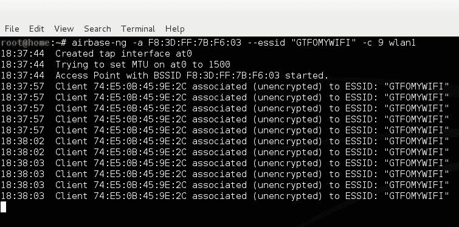
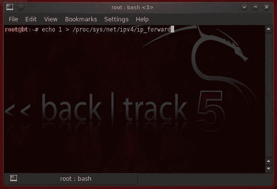
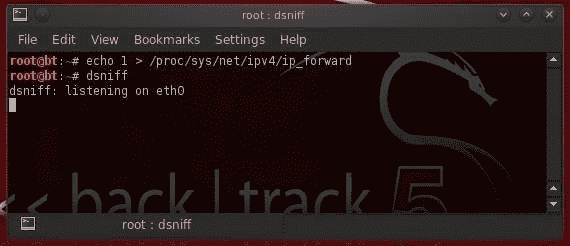

# 第四章：攻击机密性

在本章中，我们将涵盖以下内容：

+   创建一个恶意的双胞胎

+   无线中间人攻击

+   破解 WEP

# 介绍

正如我们在上一章中所学到的，数据的完整性是安全的一个重要组成部分，但它只是 CIA 三要素中的一部分。这个三要素的另一个方面是保密性，它涉及到保护信息免受未经授权的披露。这一方面单独就可能成为一个组织的成败关键，因为失去信息的控制，并且这些信息出现在网站、报纸或其他媒体上，可能会带来许多负面后果，包括诉讼。

一个很好的例子是，一个受损的无线网络如何导致对一家公司的严重后果，就像零售商 TJ Maxx 一样。

在 21 世纪初，TJ Maxx 留下了一个无线网络没有保护，后来发现并被网络犯罪分子利用，收集了敏感客户信息，包括信用卡、姓名和地址。

尽管最终发现并阻止了这次攻击，犯罪分子也被绳之以法，TJ Maxx 仍然需要解决技术保护方面的问题。TJ Maxx 因疏忽导致客户信息被盗而成为一场大规模集体诉讼的对象。最终，由于这起诉讼造成的赔偿金额使得零售商损失了数百万美元。

在当今世界，数据的保密性对于一个组织来说非常重要，因此不容忽视。事实上，困扰商业环境中无线网络的一个问题是，它们被认为是不安全的，并且很有可能将数据暴露给未经授权的人。正因为这个原因，许多企业很长一段时间内都不考虑实施无线网络，而且在许多情况下，这些公司禁止在企业场所使用无线设备。这意味着无线接入点可以在企业中设置。企业也会避免购买任何具有无线功能的设备，以避免由于有人连接到企业拥有并包含商业敏感数据的设备上的伪造或不安全的接入点而可能引起的任何问题。这是许多年前的事情了，世界已经改变；许多企业已经将无线网络作为其整体业务战略的一部分。尽管对这些无线网络的保密性和安全性仍然存在一定程度的担忧，但它们已经被广泛采用，并且可以在许多以前不存在的企业中看到。

导致对无线网络保密性的担忧的原因是，除非使用专门的天线或设备，否则它们会向所有方向发射信号。随着设计更好地聚焦信号的专用天线的引入，保护技术和其他技术已经在多年内得到发展，使得无线网络得到了更广泛的接受。

技术已经被证明可以有效保护无线网络的保密性；让我们来看看一些可以用来保护无线网络免受未经授权的侵入和数据泄露的技术：

+   **加密**：加密可能是可以用来提高无线网络或任何网络安全性的最简单和最广泛使用的技术之一。我们在这里讨论的无线网络中的加密类型将被设计用于保护传输中的数据，换句话说，即从 A 点到 B 点移动的数据。这对于无线网络来说至关重要，因为将数据从 A 点传输到 B 点的过程涉及通过空中传输信息；因此，任何可以拦截无线电波的人都有可能窃听传输并查看未加密的数据。

+   **密码学**：无线网络有许多形式，并使用许多不同的算法，如 AES 或 3DES，来保护数据的机密性，同时提供其他机制来确保数据在传输过程中不被修改。

+   **天线**：这是可以用来保护无线网络和无线信号的更有趣的领域之一——使用专门的天线来聚焦和控制信号及其传输，使其不会不加区别地发送信息。专门的天线可以用来将信号聚焦到特定区域，甚至控制信号的传播范围或距离；因此，在这两种情况下限制谁能监听传输。需要注意的是，大多数无线接入点配备的天线被认为是全向天线，这意味着它们被设计为在所有方向均匀地发送信号，以便最大限度地覆盖其区域。虽然这对于消费者或家庭环境来说是可以接受的，因为需要或希望获得最大的覆盖面积，但如果您处于多租户环境或希望将信号聚焦到只有需要的人才能访问的区域，您可能希望进行控制。

+   **预共享密钥**（**PSK**）：这种机制用于在多个工作站之间共享一个密钥和访问点，目的是使用该密钥对数据进行编码和保护，并防止未经授权的各方修改或披露数据。这些预共享密钥系统非常适用于规模较小的环境，甚至是家庭环境，其中需要保护少量系统。这主要是因为密钥必须手动输入到各个系统中，而其他系统可以进行集中管理。如果必须在每个客户端系统以及访问点上手动输入密钥，随着网络规模的增长，事情可能会变得相当乏味和繁琐。

+   **企业认证**：这种类型的系统与基于 PSK 的环境工作方式相同，只是密钥管理是通过诸如 RADIUS 之类的系统进行集中管理的。这些企业系统的好处是它们几乎可以随着企业或部署规模的增长而成倍增长，这意味着密钥管理和安全性仍然可以进行集中管理。企业认证系统确实有一个缺点，那就是它们需要更多的基础设施和时间来进行正确设置和配置；然而，一旦完成了这一步，它就变得更多是一个维护问题。

这只是可以部署以强制保密的潜在措施的简短清单；然而，在无线环境之外还有许多其他可供选择的措施，可以补充或替代上述清单中提到的内容。

一旦获得了网络访问权限，并且数据的完整性受到质疑，攻击者可能选择修改事物以达到他们所选择的任何目的。

# 攻击类型

针对无线网络的保密性攻击在熟练和知识丰富的攻击者或入侵者手中非常有效和强大。保护无线网络的机制和设备通常会被错误配置，或者这些网络的所有者可能不知道可用的攻击类型。对于不知道其无线网络或保护机制中的配置问题、缺陷或缺陷的系统所有者来说，它们会被广泛地暴露于可以用来攻击它们的各种攻击之中，并且在某些情况下可能会产生毁灭性的影响。请记住，无线网络可以得到保护，但就像任何事情一样，您必须花时间和精力来确保安全性足够并且按照预期的方式存在。

在我们开始探索每种攻击之前，让我们首先列出本章将涵盖的攻击类型：

+   嗅探

+   数据重放

+   WEP 数据包注入

+   检测信标帧

+   伪造信标帧

记住，这些只是可以用来破坏无线网络保密性的攻击类型中的一部分，它们永远不应被视为唯一的攻击类型。

# 创建恶意双胞胎

用于攻击保密性的第一种攻击类型被称为恶意双胞胎攻击，或者恶意双胞胎 AP。这种类型的攻击通常不是作为独立攻击使用的，而是与其他攻击一起使用，正如我们将看到的那样。

我们在这里提到的攻击类型最常见的名称往往是恶意双胞胎。然而，不要惊讶地听到诸如流氓接入点、影子接入点、无线蜜罐等许多其他潜在名称。无论你如何称呼它，如果你理解这种攻击中发生的机制，无论它被称为什么名字，你都会没事的。

恶意双胞胎攻击发生在流氓接入点被配置成与合法接入点相同并且放置在附近的情况下。对于外部世界和用户来说，放置更近和/或产生更强信号的恶意双胞胎很可能会成为他们连接的接入点，而不是合法接入点。如果用户选择手动或自动连接到接入点，恶意双胞胎将成为最终用户的接入点和互联网网关。由于恶意方将控制恶意双胞胎，他们将能够拦截通过他们的 AP 传输的任何流量，甚至根据需要修改或重定向它。这意味着攻击者有能力窃取包括密码、用户名和其他数据在内的敏感信息。

实际上，如果稍加思考和计划，并考虑用户连接到无线网络的方式，邪恶的双胞胎攻击可能非常有效。考虑到大多数笔记本电脑、手机或平板电脑等设备的用户通常可以打开无线设备，找到无线网络并连接到它。如果他们进入机场、购物中心，甚至是咖啡店等公共场所，他们通常可以打开无线设备并搜索免费的无线网络。记住这一点，可以很容易地构建一个无线接入点，提供看似免费的互联网访问，并将其保持不安全，以便受害者连接到无线网络并开始浏览互联网或查看电子邮件，从而使自己容易受到攻击。还要考虑这样一个事实，即如果您将无线网络命名为类似于某个公司或组织拥有的东西，用户很可能会连接到它，认为它是一个完全合法和真实的接入点 - 而实际上并非如此。一旦用户连接到这个接入点并开始交换数据，他们可能为保护自己而为时已晚。用户连接到一个不安全或未知的接入点，比如邪恶的双胞胎，可能会无意中被重定向到其他人控制的网站，并且可能包含可部署到他们客户端系统的恶意软件。 

# 准备工作

要开始，您需要准备以下物品：

+   能够进入监视模式的无线网卡

+   Kali Linux

+   第二个有线或无线适配器连接到互联网

# 如何做...

要创建一个恶意的双胞胎，我们将按照几个步骤进行，每个步骤都旨在使系统的一部分准备好执行攻击。

# 第一步 - 使用 airmon-ng 监视模式

我们必须做的第一步是将无线适配器置于混杂模式或监视模式。这与我们在以前的章节中所做的没有什么不同。在这种情况下，我们将假设我们的无线适配器使用名称`wlan0`，但请仔细检查以确保您系统上的名称相同。

```
    airmon-ng start wlan0  
```

就像以前一样，`airmon-ng`实用程序已经将我们的无线网卡切换到监视模式，并在此过程中将其重命名为类似`mon0`的东西。完成后，我们将能够查看所有我们需要的流量。以下图片显示了`airmon-ng`命令的结果：


airmon-ng 将 wlan0 切换到监视模式。

请记住，我们将在本书中多次使用此实用程序，并且在每种情况下步骤几乎相同。当我们使用此实用程序时，经常变化的是连接后的步骤，以及我们与其一起使用的无线接口的名称。特别注意使用此命令的语法，这样您在未来尝试或练习中使用此命令行应用程序时可以更轻松地进行操作。

# 第二步 - airdump-ng

监视模式已经就位，现在我们将开始使用相同的无线适配器收集流量。要使用`airodump-ng`执行此操作，我们将键入以下内容：

```
    airodump-ng mon0

```

请注意我们使用了监控接口`mon0`的新名称；您应该使用`ifconfig`验证名称，以确保您的新接口名称相同。

完成此步骤后，您应该开始看到访问点；由您选择要创建恶意双胞胎的访问点：


就像以前一样，这个实用程序并不是你见过的最后一个 - 实际上，在本书中的几个其他配方中都使用了几乎完全相同的语法。密切关注语法以及如何使用它，以及它的作用，因为这将节省您以后的时间。

# 第三步 - 创建具有相同 SSID 和 MAC 地址的新 AP

使用相同的 SSID 和 MAC 地址创建一个新的 AP，有效地克隆了一个好的双胞胎和一个坏的双胞胎，我们需要使用`airbase-ng`实用程序，并假设我们想要克隆前面截图中名为`Tarlogic`的网络：

```
    airbase-ng -a 60:A4:4C:69:D2:48 --essid "Tarlogic" -c 1 mon0

```

如果该过程有效，您应该会看到如下截图所示的结果：



使用 airbase-ng 的结果

请注意，在截图中，我们创建了一个访问点，然后不久后一个客户端与访问点关联。

有可能在设置访问点并开始广播名称后，您可能会有客户端相当快速地连接，但如果没有发生这种情况，请不要灰心。在某些情况下，您可能必须等待一段时间，直到客户端实际连接到您的访问点。这需要多长时间可能因情况而异。如果您设置了一个模仿咖啡店访问点名称的访问点，并且有很多顾客，那么很可能会有人连接到您的访问点，因为它看起来和行为都像咖啡店的访问点。请记住，我不建议您创建一个模仿咖啡店访问点或其他公共访问点的访问点，除非您有明确的许可。仅仅因为您想要设置一个通常是非法的。

# 第四步- 强制重新连接

如果您想要查看是否可以让客户端连接到访问点的速度比如果您只是等待要快，您可以有效地将他们从当前的访问点（好双胞胎）中踢下来，并让他们重新连接到您的访问点。为了做到这一点，我们将向目标访问点发送一个去认证帧，将所有人都踢下来。一旦他们被踢下来，如果我们已经正确地定位了自己，他们将连接到我们的邪恶双胞胎。我们的下一步是将邻居从他的访问点中踢下来。

我们可以使用`aireplay-ng`和`deauth`数据包来实现这一点：

```
    aireplay-ng --deauth 0 -a 60:A4:4C:69:D2:48

```

我们用`aireplay`发送了一个带有`Tarlogic`访问点地址的`deauth`帧。以下图片显示了在`aireplay`中运行`-deauth`选项的结果：


发送去认证帧

# 第五步- 增加功率

为了确保我们有最好的机会捕获客户端，我们需要确保我们的信号比我们正在克隆的接入点更好。如果您无法让自己更靠近，您可以随时增加功率以确保您有更强的信号。

为了产生更强的信号，我们可以这样做：

```
    iwconfig wlan0 txpower 27

```

以下显示了`iwconfig`命令的结果。请注意`Tx-Power`设置：

通过发送一个去认证数据包，我们故意将连接到合法访问点的客户端从网络中踢出，以便让他们重新连接到我们的网络。尽管仅仅向连接到特定访问点的客户端发送去认证帧并不足以确保他们会重新连接到我们的访问点，但这确实给了他们这样做的机会。有可能您已经捕获到了连接到您的访问点的客户端，而无需进一步操作，但我们希望有更多的保险来实现这一点。所以，让我们继续。

以下显示了`iwconfig`命令的结果。请注意`Tx-Power`设置：


使用 iwconfig 命令的结果

这个命令将把 AP 的功率提升到在美国允许的最大值，即 27 dBm 或 500 毫瓦。虽然在一些卡上可能会将功率提升到超过这个限制，比如 2000 毫瓦，但这不仅是非法的，而且会因为额外的热量和压力而缩短您的卡的寿命。

值得强调的是，无谓地增加接入点的功率会带来很多麻烦。正如我们已经提到的，将接入点的功率调高到一定阈值以上可能在您的国家是非法的。将接入点或无线设备的功率调高到超出容量的另一个问题是，它会产生更多的热量，因为用于调制信号的收发器被推到了设计规格之外。随着热量的积聚，它会减少该设备的使用寿命。您甚至可能会将您的设备变成火灾风险。最后，无谓地提高功率违反了法律标准，这意味着您可能会淹没其他接入点范围内的无线设备的信号。虽然这听起来可能是个好主意，但它确实增加了您被抓到的可能性。确保您了解将无线设备的功率调高到超出设计规格或法律限制的问题。

在这一点上，我们可以再次运行`airodump`来查看客户端是否连接到我们的接入点。我们还可以使用嗅探器来捕获流量或运行中间人攻击，这些我们稍后会做。请记住，到目前为止，我们所做的是从客户端捕获无线流量并将其重定向到我们的接入点。此时还很重要的一点是，我们在本文中所做的一切只是设置了恶意的双胞胎。我们还没有设置自己来捕获任何流量。我们如何做到这一点取决于我们自己。

# 中间人攻击与无线

中间人攻击是一种更高级的攻击形式，它建立在先前的行动基础之上。这种攻击发生在第三方拦截两个系统之间的通信并观察流量或以某种方式更改流量时。这种类型的攻击绝对比通过嗅探进行的窃听更进一步，但最初它的开始方式非常相似。

让我们从讨论一些基本要点开始这次攻击，首先是关于交换机和欺骗的主题。

我们对交换机的解释旨在作为交换机的功能和放置位置以及网络设备的层次结构的入门或复习。它并不意味着对交换机的细节或设备的解剖以及它们的功能方式进行详尽的讨论。如果您对交换机、它们的功能、为什么要在网络上放置它们以及它们相对于其他传统网络设备（如集线器）的优势不熟悉，那么您可能需要在继续之前查看相关信息。这样做将有助于您充分利用本文并具体了解我们试图实现的目标。

正如您可能已经知道的那样，交换机是一种用于通过 MAC 地址控制流量的设备。这些设备在当今的环境中被广泛使用，您应该期望了解并处理它们，以便在它们阻止您的攻击尝试时能够正确地参与和击败它们。交换机很受欢迎，因为它们可以减少网络拥塞和相关的网络流量，更不用说它们只向 MAC 地址发送流量，也就是说，发送到预期目的地。正是因为这些能力，交换机已经取代了集线器，集线器无法控制流量或阻止其他客户端窃听与它们无关的连接。为了对抗交换机的安全性，已经开发了一些技术，包括 MAC 洪泛、DHCP 饥饿和 ARP 欺骗等行动。其中一些技术用于绕过交换机，而其他技术则旨在直接针对交换机并使其像集线器一样运行，从而使我们的攻击更容易实施。

通常，洪泛攻击不适用于过去十年或更长时间内部署的交换机。通常，现代交换机不再起作用，即使在旧的交换机上，警惕的网络管理员也会注意到网络流量和数量的变化。为了让交换机知道将流量发送到何处，它们维护一个 CAM 表，该表基本上将 IP 地址映射到 MAC 地址。例如，该表表示当流量发送到 IP 地址`192.168.1.101`时，将该流量发送到 MAC 地址`11:22:33:44:EE:FF`。

如果我们可以改变表中的条目，我们就可以成功地获取别人的流量。这就是所谓的 ARP 欺骗，因为 CAM 表中的条目来自交换机发送的 ARP，以从网卡获取这些信息。

在本节的示例中，我们将利用一种称为 ARP 欺骗的技术，这种技术旨在允许我们插入自己在目标之间，并让他们相信他们仍在直接交谈。

ARP 欺骗是一种攻击形式，通常被用作另一种攻击的组成部分或前兆。在这种攻击中，恶意方在本地网络上发送伪造的 ARP 消息序列。这样做的目的是创建或更改系统或计算机上 IP 和 MAC 地址的连接或关联，使其与应该是的不同。一旦攻击者完成了欺骗部分，他们就可以有效地改变网络段上的流量。一旦攻击者的 MAC 地址连接到一个真实的 IP 地址，攻击者将开始接收任何发送给该 IP 地址的数据。

关于窃听的一点要记住的是，可以使用许多不同的协议进行窃听，如 FTP、HTTP 等。基本上，任何形式的在线通信都可能受到中间人攻击，只要采用正确的方法。在本节的示例中，我们将演示如何仅使用特定协议执行攻击，但这个示例可以扩展到其他适当的协议。

讨论类似 DCF 这样的工具时要记住的一件事是，它利用了许多协议（如 FTP 和 HTTP）在设计时没有考虑安全性的事实。这些协议的设计是为了执行非常特定的功能，比如文件或其他信息的传输，它们在核心功能上表现出色，几乎没有问题。然而，由于这些协议的设计者在实际设计过程中没有考虑到今天我们看到的安全问题，因此像 dsniff 或 Wireshark 等工具就会利用这种缺乏安全性。

在 Wi-Fi 网络的情况下，中间人攻击是一种特别吸引人的攻击，因为环境的设计。在这种环境中，攻击者所要做的就是等待客户端连接，然后开始游戏。使用伪造接入点等方法，或者破解 WEP 或 WPA 密钥并连接到现有网络，都是执行中间人攻击的有效方法。

需要指出的一点是，中间人攻击可能对受攻击的客户端是无法检测到的。就受害者而言，当中间人攻击发生时，他们正在与最初打算进行通信的人进行通信；他们不知道有第三方正在拦截并可能以某种方式操纵他们的流量。如果攻击者不采取任何行动来让他们的存在得到确认，或者不向任何人透露他们的存在，那么很难察觉到他们的存在。然而，有办法可以做到。例如，网络入侵检测系统可以检测到流量的变化，并通知系统所有者或管理员进行响应。

# 准备工作

要开始操作，您需要准备以下物品：

+   能够进入监视器模式的无线网卡

+   安装了 Wireshark 的 Kali Linux

# 如何做...

为了执行中间人攻击，我们需要整合一些新的和旧的工具和技术。话虽如此，让我们开始吧。

在这种攻击中需要关注的一点是，我们将同时在 Kali 中使用多个终端窗口。事实上，在这个特定的步骤中，我们将使用三个同时运行的终端窗口，每个窗口执行过程的不同部分。因此，请记住要集中注意力，并注意在这个步骤中应该在哪个窗口中。

请记住，在本书中以及在现实生活中，您会发现自己处于多种情况下，需要同时运行多个终端窗口。这通常是因为您需要在命令行中运行多个实用程序，每个实用程序都设计用于执行一个过程或任务的一部分。因此，在执行这些攻击时，请确保您真正注意自己在任何时候处于哪个窗口中，以确保您不会无意中取消或运行一个命令或序列，从而产生与您预期不同的结果。

在这个步骤中，我们将执行一些旨在捕获我们正在寻找的信息的步骤。

将发生的第一步是运行 ARP 欺骗，旨在帮助我们重定向和捕获流量，然后能够在以后捕获凭据。

在尝试此攻击时要记住的一点是，此攻击只能在本地网络上进行；它不会跨不同子网或甚至在两个不同的网络上进行。原因是 ARP 协议只在本地网络上工作——它不是设计用于其他情况。因此，在除本地网络以外的任何地方尝试执行此攻击将导致失败。这是一个非常重要的细节，要记住，忘记它可能会导致攻击失败，这可能会非常令人沮丧。

我们将通过用我们本地系统的 MAC 地址替换服务器的 MAC 地址来执行客户端的第一步。这将把流量重定向到我们的系统而不是实际的服务器。

我们通过在一个终端窗口中运行`arpspoof`来执行此操作，如下所示：

```
    arpspoof <client IP> <server IP> 

```

这将告诉客户端我们是他们在尝试联系服务器时正在寻找的系统。

下一步是用我们系统的 MAC 地址替换客户端的 MAC 地址。这只需简单地颠倒之前使用的 IP 地址的顺序：

```
Arpspoof <server IP> <client IP> 
```

以下屏幕截图显示了颠倒 IP 地址的顺序：


在这里，我们告诉服务器我们是客户端。

现在执行这两个命令。当我们这样做时，客户端会认为我们是服务器，服务器会认为我们是客户端！


一旦我们伪造了客户端的 MAC 地址以重定向其流量，我们需要执行一个称为转发或 IP 转发的过程。实质上，我们所做的是通过我们的系统从客户端到服务器和从服务器到客户端转发流量，以确保来自一方的请求到达另一方，反之亦然。如果我们不执行转发，连接将会被有效地中断，因为从一个网络接口路由到另一个网络接口的流量将无法到达目的地。

请记住，此攻击的成功取决于客户端与其预期目的地之间保持可靠和一致的连接。您正在介入此连接尝试以及任何随后的信息交换，并且您正在尝试在所需的时间内保持您的存在未知和未被检测到，以收集您正在寻找的信息。

要启用转发，我们使用`ip_forward`命令，默认情况下 Linux 中包含此功能，允许我们尝试配置的过程。在正常情况下，此功能是禁用的，因此我们需要重新启用它。Linux 具有内置功能来转发它接收到的数据包。

我们通过使用以下命令来实现这一点：

```
echo 1 > /proc/sys/net/ipv4/ip_forward
```



现在，我们的系统已插入到这些通信主机之间，并且我们的客户端和服务器已被调用，我们可以开始下一阶段，即开始嗅探流量，以寻找有用的凭据。

请记住，在使用中间人攻击或任何其他使用嗅探的攻击时，未受保护的协议（如 HTTP 或 FTP）会使攻击变得更加容易。而采用旨在保护信息机密性和完整性的加密的技术（如 SSH）将使嗅探极其无效，无法收集有用的信息或凭据，因为它们旨在保护客户数据。

为了执行这一步，我们将使用一套称为`dsniff`套件的工具，这套工具已经存在了好几年，但在执行各种不同的攻击时仍然非常有用。该套件包括多种不同的工具，旨在捕获各种流量并提取有用信息，例如来自 FTP、telnet、HTTP、SNMP、POP、LDAP 等容易被拦截和处理其信息的凭据。

为了使用 dsniff，我们发出以下命令：

```
    dsniff

```



当我们执行此命令时，您会看到`dsniff`会迅速回应说它正在`eth0`上监听。但是，使用`-I`命令可以告诉它完全在不同的接口上监听。

执行此命令后，我们现在所要做的就是等待。我们正在等待的是客户端连接到服务器。有了`dsniff`的帮助，我们会发现一旦客户端登录，他们将成为我们嗅探努力的受害者，他们的凭据将直接显示在我们的屏幕上，我们可以记下它们，稍后可以像以下截图所示那样使用它们：


在这个截图中，您会注意到 DCF 已经捕获了连接到服务器的客户端的凭据。实际上，在这里，您可以看到谁连接到谁，因此能够建立客户端/服务器关系。

一旦您在屏幕上看到凭据，您还将看到这些凭据发送到的 IP 地址，这意味着现在您所要做的就是打开您的 FTP 客户端，并将其指向相同的 IP 地址。在提供用户名和密码后，您可以登录到该系统并浏览其中的任何信息和服务。

# 破解 WEP

无线网络的一个独特特点当然是它们不使用传统媒体，而是使用无线电波将信息从一个点传输到另一个点。这就是使得网络如此吸引人和受欢迎的原因，一个人可以在无线网络的范围内的任何地方携带他们的设备，并且仍然可以保持访问而不必担心电缆等。然而，这种优势是有代价的，即无线电信号是不加区分的，任何能够接收它们的人也能够处理它们携带的信息。

幸运的是，无线网络的设计者将这视为一个问题，并决定在 IEEE 802.11b 网络设计的初始规范中添加保护，即**有线等效协议**（**WEP**）。在发布时，WEP 被视为一个很好的功能，然而，不久之后问题出现并随后迅速扩大。

WEP 是可用加密协议中最古老且可以说是最薄弱的。WEP 标准被引入作为无线安全的初始解决方案，但很快被发现存在缺陷和极易受攻击。该协议被发现存在缺陷和易受攻击的原因有很多；其中之一是协议中的密码学实现不佳。不仅实现设计和实施不佳，而且没有经验丰富的密码学家审查，他们可能能够发现任何缺陷和漏洞并解决它们。

WPA，或 Wi-Fi 保护访问，是 WEP 的继任者，旨在解决困扰 WEP 的许多问题。在许多领域，它成功了，并成为了一个更加严格的安全协议。WPA 使用 TKIP、MIC 和 AES 加密作为其保护信息的主要机制。

WPA2 是 WPA 的升级或继任者，旨在解决和取代 WPA 的问题。WPA2 更加强大，使用更严格的 AES 和 CCMP 加密。该标准还有一个版本，使用更强大的系统，如 EAP、TKIP 和 AES（带有更长的密钥）。

然而，在我们讨论问题之前，让我们看看 WEP 应该如何工作。之后，我们将继续讨论如何利用它的问题。

WEP 是无线加密协议中最古老的，最初引入并集成到 802.11b 标准中，它被视为提供安全数据传输的一种方式，或多或少与有线网络相当。按设计，WEP 协议利用了一些现有技术，包括 RC4 加密协议。

当它被设计和推出时，旨在实现以下目标：

+   打败窃听通信和试图减少未经授权的数据披露

+   在数据流经网络时检查数据的完整性

+   在传输之前使用共享的秘密密钥加密数据包

+   在轻量级、高效的系统中提供机密性、访问控制和完整性

它的问题源于以下情况：

+   该协议是在没有经验丰富的密码学家、学术界甚至公众的审查下设计的。

+   它没有明确定义的密钥分发方法（如集中式密钥管理），除了预共享密钥，必须手动输入到每个站点。因此，密钥在大规模更改时很麻烦，因此很少更改。

+   其设计使得可以通过嗅探工具和操作系统中免费提供的破解工具被动地发现密钥，例如基于 Linux 的 Kali。

+   不同供应商使用的密钥生成器设计不一致且设计不良，导致漏洞，例如使用 40 位密钥的问题。

+   用于执行密钥调度的算法已被证明容易受到攻击。

+   CRC32 在完整性检查中存在缺陷，并且通过轻微修改，攻击者可以一致地修改数据包以产生他们期望的结果。

+   **初始化向量**（**IVs**）只有 24 位长度，这意味着一个轻度活跃的网络可以在五小时或更短的时间内耗尽整个 IV 池。

+   它容易受到通过分析数据包进行已知明文攻击的影响。

+   密钥可以通过分析数据包来获取，从而创建解密表。

+   它容易受到拒绝服务攻击的影响，通过使用 WEP 未经身份验证的关联和取消关联消息。

# 准备工作

要开始，您需要准备好以下项目：

+   能够进入监视模式的无线网卡

+   Kali Linux

这里列出的项目是基本要求，如果需要，您可以轻松使用更多（或不同）组件。例如，如果您想要增强范围，您可以使用一个带有外部天线连接的基于 USB 的无线网卡，这样可以获得更好的接收效果。

在这个练习中需要记住的一件重要事情是，我们将使用一系列工具，这些工具都来自一个旨在破解和分析无线网络流量的工具套件。在随后的章节中，我们将重新访问套件中的不同工具，并在途中为不同目的使用它们。这将是你对 air-crack 套件中一些成员的首次探索。

# 第一步 - 监视模式 airmon-ng

我们必须做的第一步是将无线适配器置于混杂模式或监视模式。这与我们在以前的章节中所做的没有什么不同。在这种情况下，我们假设我们的无线适配器使用名称`wlan0`，但请仔细检查以确保您系统上的名称相同。

```
    airmon-ng start wlan0
```

与以前一样，`airmon-ng`实用程序已将我们的无线网卡切换到监视模式，并且应该已将其重命名为类似`mon0`的名称。完成此操作后，我们现在将能够查看所有我们需要的流量。以下屏幕截图显示了`airmon-ng`命令的结果：


airmon-ng 将 wlan0 切换到监视模式。

# 第二步 - airdump-ng

有了监视模式，我们现在将开始使用相同的无线适配器收集流量。要使用`airodump-ng`执行此操作，我们将输入以下内容：

```
    airodump-ng mon0
```

请注意我们使用了监视接口的新名称`mon0`。您应该使用`ifconfig`验证名称，以确保您的新接口名称与之前相同。

完成此步骤后，您应该开始看到访问点，选择要创建恶意双胞胎的访问点取决于您：


# 第三步 - airdump-ng 和流量捕获

从此屏幕截图中的访问点列表中，您将注意到有两个启用 WEP 的访问点，我们将选择名为`7871`的访问点。

```
airodump-ng --bssid 0A:86:3B:74:22:77 -c 6 -w crack mon0 
```

这将开始捕获来自 SSID`7871`的通道`6`上的数据包，并将它们写入名为 crack 的文件中，该文件将以`pcap`格式保存。这种方法的问题在于我们需要捕获大量数据包或流量才能真正破解或检索密钥。如果你是一个喜欢耐心等待的人，你可以等待捕获 50,000 或 60,000 甚至 100,000 个数据包后再进行破解过程。然而，这还不够好；我们想要密钥，而且希望在最短的时间内获得它。让我们通过设置可以实现这一目标的情况来做到这一点。

关于需要捕获的数据包数量，实际上存在一些争论，以使破解过程成功，因此您可能需要进行一些实验，以获得一致可靠的结果。然而，仅供参考，需要收集的流量量通常在 60,000 个数据包到 100,000 个或更多之间。

# 第四步 - 重放流量

为了加快这个过程，我们需要在很短的时间内生成大量的流量。为了做到这一点，我们将执行一个称为数据包注入的过程，我们还将伪造一个 MAC 地址，以诱发一波我们可以捕获的流量。

有许多不同的方法可以重放流量，实际上，这种技术用于在主机或应用程序之间重放认证流量和其他类型的网络流量。然而，请记住，有些类型的流量不能轻松地或根本无法重放。事实上，阻止数据重放攻击的最大因素之一是时间戳，其中包括告诉数据包何时传输以及有效期多长的信息。幸运的是，ARP 流量默认情况下没有这种保护，尽管可以通过其他机制提供。我们在这里使用的技术不会遇到这种限制，因为我们没有捕获或重放受此保护或限制的流量。

执行此步骤所需的组件将是接入点的 SSID，已连接到接入点的客户端的 MAC 地址，以及一个名为`aireplay-ng`的工具。我们将使用以下格式的实用程序发出命令：

```
aireplay-ng -3 -b 0A:86:3B:74:22:77 -h 44:60:57:c8:58:A0 mon0 
```

如果到目前为止我们已经做得一切正确，我们在另一个窗口中运行的`airodump`仍将在运行，并且能够将我们生成的所有流量捕获到我们命名为 crack 的文件中，然后我们将使用它来进行分析并检索密钥。

# 第五步 - 破解流量

在我们继续进行第五步，也就是我们实际破解流量的地方，我们需要确保我们已经捕获了数万个数据包，以确保我们有足够的流量进行适当的分析。如果您没有捕获足够的流量，那么这个过程很可能会失败，您将不得不重新生成流量，以捕获更多的流量。因此，请记住要耐心，并确保捕获足够的流量以合理成功地执行该过程。

在尝试从捕获的流量中恢复密钥时要记住的一件事是，这可能需要一些时间，这取决于试图恢复密钥的系统上可用的资源。如果您有一个速度较慢或较旧的系统，预计这个过程会比在具有更多处理能力或内存的系统上花费更长的时间。如果您已经收集了足够的流量，那么这个过程应该是成功的 - 无论花费多长时间。

为了破解流量，我们需要拥有一个捕获文件，这是我们之前使用`airodump`生成的。我们使用`aireplay`生成的所有流量都应该被捕获到这个文件中，然后我们可以使用以下实用程序进行分析：

```
aircrack-ng crack.cap 
```

如果成功了，`aircrack`将在屏幕上以十六进制显示密钥，然后您可以将其用于与目标接入点关联时输入到您的无线客户端中。

如果您耐心和细心地执行了这次攻击的步骤，您会发现您有很大的成功机会，并且应该能够随需访问任何启用 WEP 的网络。还要记住，确保使用`airodump`将足够的流量捕获到文件中可能需要一些练习；学习曲线是正常的。

这种保护无线网络的方式在很大程度上受到了利用，因此被视为一种不被赞同或避之不及的保护形式。当这种保护机制在早期无线网络中首次亮相时，它被认为是一种体面的保护形式。然而，随着技术的发展和攻击者寻求捕获信息的不同方式，很快就发现了一种漏洞。正是这种漏洞在这个特定的配方中被利用。如今的网络不应该将这种保护措施作为保护无线流量的主要手段，因为它并不难破解 - 只需要一点技巧和耐心，你就能得到你想要的信息。
