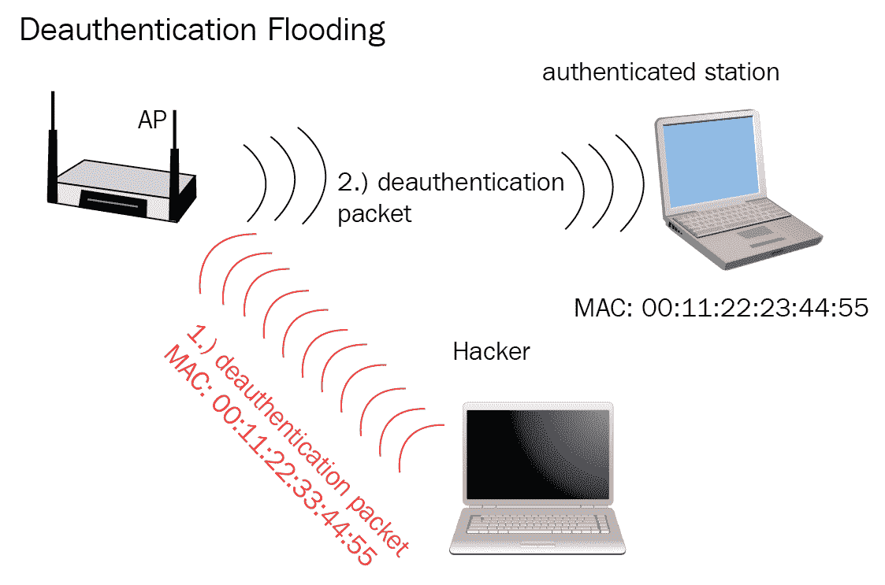
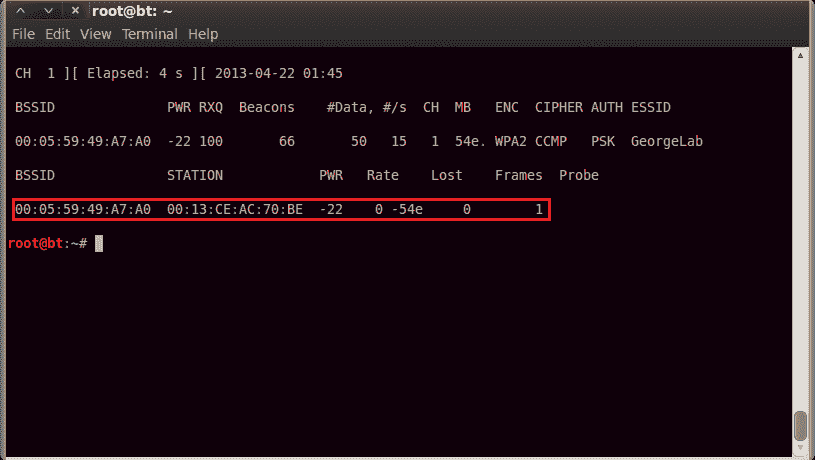
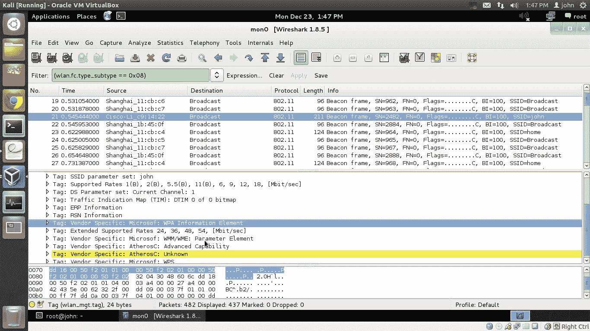
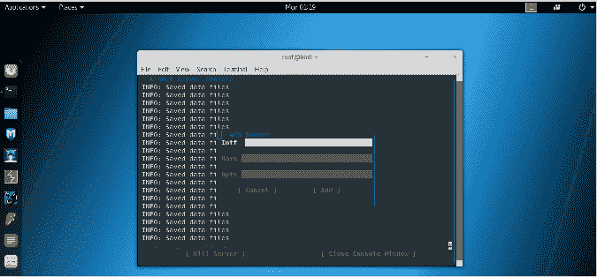
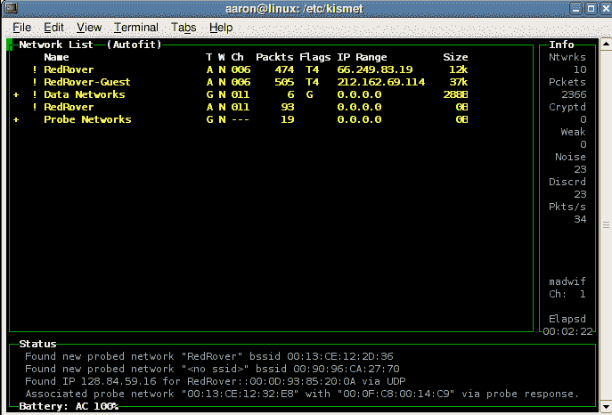
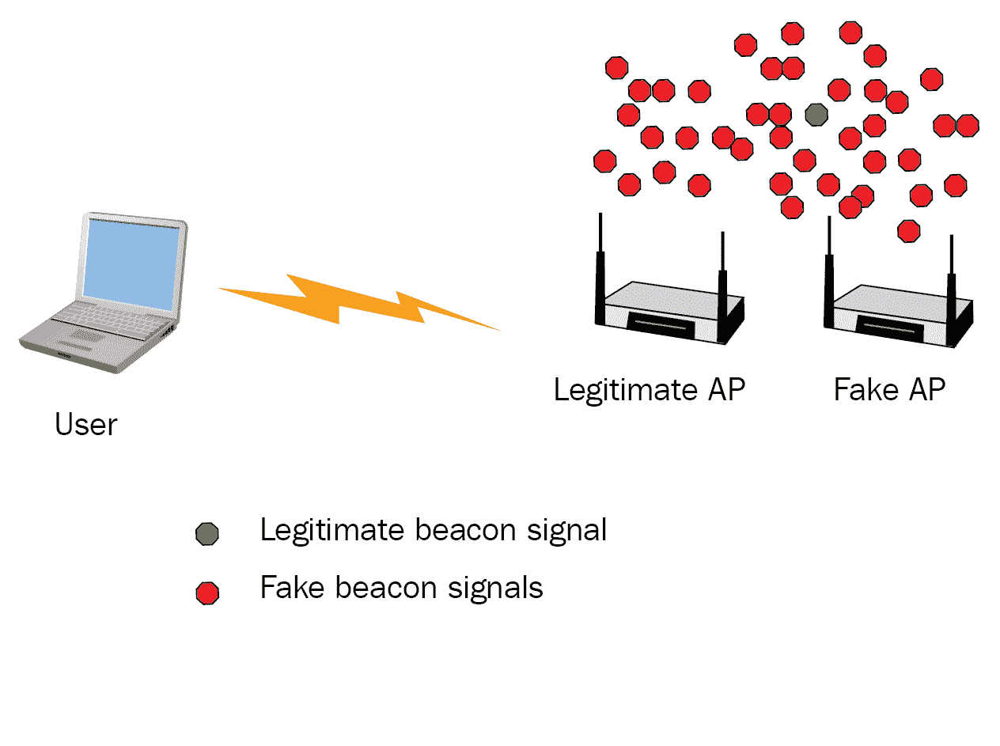
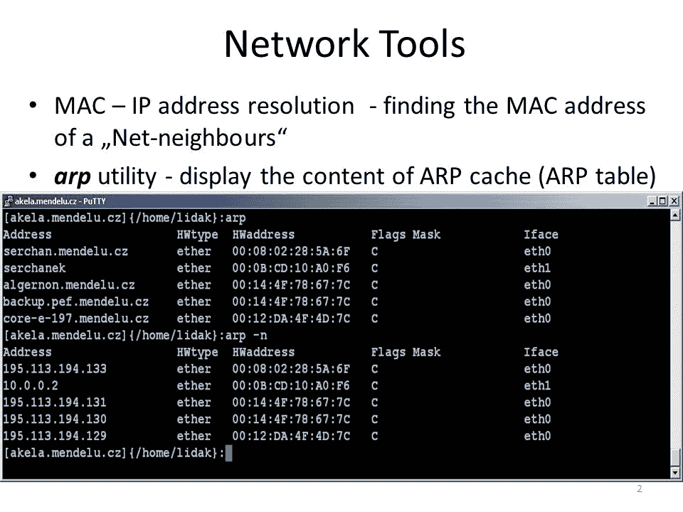
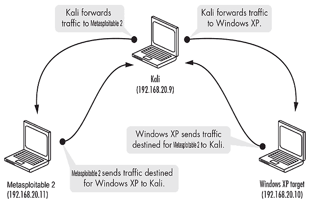

# 第五章：攻击可用性

在本章中，我们将涵盖以下内容：

+   执行去认证洪水攻击

+   检测信标帧

+   欺骗信标帧

+   创建信标洪水攻击

+   ARP 缓存中毒

# 介绍

到目前为止，我们已经看到了 CIA 三要素中的两个。现在是时候看看 CIA 三要素的第三个和最后一个部分，即可用性。简单地说，可用性处理围绕着对资源（如文件、计算机甚至整个网络）丧失访问的问题，正如我们将在本章中看到的。可以想象，可用性的丧失是一个大问题，主要是因为如果您无法访问某物，无论那是什么，它对您来说基本上变得毫无价值，直到您再次获得访问权限。可以说，丧失对某物的访问权限也是相当令人沮丧的，因为这意味着您可能无法完成工作或任务，直到重新获得访问权限。

让我们在讨论可用性概念时再思考一下。想象一下在无线基础网络或环境中，客户端依赖于对文件、服务器甚至互联网的持续可靠访问，而无线访问丢失的情况。在这种情况下，如果这些客户端依赖于该访问来进行工作，您可能会有一个无法有效运行的业务或客户，这意味着业务本身可能无法运行，这绝对不是理想的情况。请记住，在某些情况下，即使部分丢失或受阻的可用性也足以严重影响业务。我们可以通过简单地想象自己可能遇到的情况来想象这种情况，比如在咖啡店、机场甚至酒店连接到无线网络。一个超出容量的拥挤网络，极其缓慢并且提供不可靠的资源访问，也会对业务的运营产生重大影响。事实上，在这种情况下，即使访问存在但速度非常慢，也会导致业务陷入停滞，这是不可接受的，需要避免。

在无线网络中，对抗可用性的影响是一个棘手的过程，但是非常可行。您会发现您有几种选项来对抗我们在本章中将看到的攻击类型，并使您的无线网络更具弹性和抵抗丧失可用性的影响。只是为了让您一窥究竟，这里有一些我们可以采用的对策，可以限制丧失可用性的影响，甚至可以消除这种可能性：

+   **调谐**：我所说的调谐是设置和配置您的无线接入点，以避免使用其他接入点可能正在使用的频道和频率。通过避免使用这些频道，您可以在很大程度上防止由于争夺频率和拥挤的频道而导致的减速、可用性丧失和减少范围。现在，请记住，您可能并不总是能够在特定区域独占使用频道和频率。您可以选择一个比其他区域的监狱拥挤得少的频道和频率，这样您就可以比在更拥挤的频道上有更多的空间。

+   **冗余**：使用这种技术简单地意味着我们实施了一种称为网状网络的东西，这是一种类似蜘蛛网的设置，设置在多个用于覆盖区域的接入点之间。通过使用这种设置，可以让多个接入点覆盖一个区域，以便如果其中任何一个接入点，甚至多个接入点，变得拥挤，我们可以安排提供一个强信号，其他节点或接入点可以接收并给客户一个更强大和更可靠的信号。虽然这种设置需要一些规划和努力才能使其发挥作用，但对于任何处理慢速或拥挤网络的人来说，它可以带来巨大的回报。值得注意的是，与之前几年可用的一些解决方案不同，现在可以以更具用户友好性甚至是消费者为基础的解决方案来廉价快速地设置网状网络，从家庭环境一直到大规模企业部署。

+   **企业认证**：虽然在保密性和完整性的前几章中提到了这个解决方案，但在可用性方面，它实际上有了不同的目的。使用其技术的企业认证系统，比如 radius 或直径，可以使无线网络的认证方面更难以被挤掉线，因此在面对基于拒绝服务的攻击时更具弹性。主要采用这种系统或机制意味着攻击者必须付出更多的努力才能通过认证系统将这个网络挤掉线，而不是如果他们有一个在自己身上做所有的专用接入点。这种解决方案的缺点是它需要更多的努力和更多的专业知识来设置和使其有效运行，但如果你想给自己一些额外的保护，这是值得考虑的。

+   **补丁和更新**：对于任何在 IT 领域工作了足够长时间的人来说，你可能不需要我来解释定期对固件软件进行补丁和更新的概念，但这是值得一提的。我们对客户和接入点的固件进行补丁和更新的原因是为了确保我们利用最新的功能和修复程序，其中一些可以使我们挫败拒绝服务和其他可用性攻击。

+   **配置**：这是一个涵盖了很多内容的大领域，可以帮助你极大地击败影响可用性的攻击。当我说这是一个大领域时，配置涵盖了从接入点的放置和设置、要使用的天线类型、要覆盖的设施或校园的部分，甚至一些小细节，比如在客户工作期间需要覆盖多少区域，以及他们在移动时需要访问无线网络的距离。

再次强调，这只是一个简短的清单，只是为了让你意识到一些可以用来阻碍可用性的事情。你应该始终保持对可用性问题和无线网络的最新了解，因为这往往是影响无线网络被客户群体认知和接受程度最大的领域之一。虽然保密性和完整性很重要，但客户更有可能注意到与可用性相关的问题，而不是其他两个方面。慢速网络和不可用的网络更加明显，因此不仅应该从用户满意度的角度来解决，还应该从安全的角度来解决。

# 攻击类型

正如所说，有很多方法可以影响无线网络的可用性。它们都有相同的基本目标，即防止无线网络被有效地连接和使用，或者根本无法连接。

在我们开始深入讨论每种攻击之前，我们应该首先定义本章将涵盖的攻击类型：

+   执行去关联洪水

+   检测信标帧

+   欺骗信标帧

+   执行信标洪水

+   执行去认证洪水

+   ARP 缓存中毒

+   执行拒绝服务

+   隐藏无线网络

这些攻击代表了一些影响无线网络可用性的更受欢迎的方式，因此我们在这里介绍它们。总之，还有其他故意和意外的可用性攻击可能困扰你的无线环境，你需要自行进行更多的研究。

# 执行去认证洪水

这种首次可用性攻击是一个有趣的攻击，而且非常有效。这种攻击被称为去关联洪水。在这种类型的攻击中，恶意方试图打破客户端与接入点的关联。当进行这种类型的攻击时，客户端将经历这样一种情况，他们被从无线接入点中踢出，并发现自己试图重新连接到接入点。关键词在于，他们是否能够连接到无线接入点。如果这种洪水以足够高的音量进行，并保持在那个水平，这意味着没有客户端能够长时间或根本无法连接到无线网络，这取决于条件如何发展。

只是为了明确，我们在这个章节讨论的攻击类型不是基于干扰的攻击。我们所说的干扰是指没有无线电信号或任何干扰被发送出去，用来阻止或阻碍无线网络所使用的频率。在执行基于干扰的攻击时，通常会使用一些东西，比如一个特定的重建设备，设计用来用无线电流量轰炸空气波，在这种情况下。虽然这种攻击会起作用，因为干扰会扰乱无线频率，但它的工作方式也是不加区别的。基本上，你不能选择哪些客户端会保持连接，哪些不会，也不能选择你想要阻塞的无线网络。在这些频率范围内的任何东西都将被阻塞。这种类型的攻击也存在非常真实的问题，即非法行为，并可能面临严厉的罚款甚至监禁。我们在本书中不会使用干扰。

提出这一点的唯一原因是，有时候去认证洪水被错误地称为干扰攻击。我们所讨论的攻击类型非常有选择性，意味着它可以使无线网络或个别客户端中断。它也不会用不加区别的无线电流量轰炸空气波，而是使用特制的帧来瞄准它的受害者或受害者。

关于这种类型的攻击，一个问题是为什么无线网络中实际上存在去认证帧？嗯，对此实际上有一个很好的答案，最明显的是它可以用来断开行为不端或因某种原因需要断开连接的无线客户端。这种帧类型存在的其他原因也有。例如，使用去认证帧将客户端踢出可能用于发现连接到您的无线网络的恶意客户端的情况。一旦发现它们，可以有选择性地针对性地断开连接。这种认证帧的另一个更恶意的用途不仅可以造成服务拒绝，还可以迫使客户端连接到我们控制的伪装接入点。在这种情况下，我们会在合法接入点的附近设置我们自己的无线接入点。然后，我们会发送去认证帧将人们从合法网络中踢出，并可能迫使或诱使他们连接到我们控制的接入点。这个接入点恰好是可用的，准备好并开放与他们一起工作。以下图表显示了连接到无线网络的正常认证过程：


无线网络的正常认证过程和去认证

如果我不提及另一种半合法（我轻描淡写地使用这个词）使用去认证帧的情况，那就真的是我的疏忽了。一个半合法使用去认证帧的例子发生在美国，一家酒店连锁被发现强迫人们使用酒店的 Wi-Fi 而不是其他提供商的 Wi-Fi。在这种情况下，酒店使用设备发送去认证帧，阻止酒店客人使用外部 Wi-Fi，而是支付酒店自己的 Wi-Fi 服务。一旦发现酒店使用这种类型的设备，很快就会遭到客人和客户的法律挑战。最终发现，在美国任何一家使用这种技术强制使用他们服务的酒店都是非法的，任何使用这种技术的企业都将受到联邦通信委员会的重罚和法律诉讼。

值得一提的是，关于在需要保障设施和数据传输安全的地方是否可以使用去认证洪水的讨论仍在进行中。目前，答案似乎是没有直接的答案，因为去认证洪水已被用于创建只有授权网络对某一商业区域的人员可用的安全空间。

以下图表显示了去认证洪水的概念：



去认证洪水

取消认证帧还有另一个用途，对于针对无线网络或网络进行渗透测试的人来说非常方便，那就是用它来获取网络的密码或密钥。在这种情况下，攻击者将发送 AE 取消认证洪水，并从目标网络中的客户端中踢出一个客户端。当该客户端尝试重新连接时，攻击者将嗅探在该连接期间生成的流量，并尝试提取连接信息交换。这种类型的攻击也可以用于诱导中间人情况，攻击者将取消认证受害者，然后强制他们通过一个恶意接入点重新认证。然后，他们将把流量引导到互联网连接或实际合法网络。实质上，首先我们会发出取消认证帧或洪水，然后我们会使用我们在前一章中探讨过的中间人或恶意接入点设置，然后我们将能够捕获这些凭据作为握手。

# 准备工作

要开始，您需要准备以下物品：

+   能够进入监视模式的无线网卡

+   Kali Linux

# 如何做...

要执行关联洪水，我们只需要使用我们在早期章节中看到的步骤的组合，并额外添加一些内容以调整它以适应我们的目的。

在这种情况下，我们有一个客户端连接到无线接入点或无线路由器，正在进行他们的业务。攻击者将尝试中断他们与网络的连接：

1.  为了开始，我们需要首先将我们的网络卡置于监视模式。再次强调，这与我们在以前的教程中所做的没有什么不同。为了简化事情，我们将假设我们的无线适配器使用名称`wlan0`，但请双重检查以确保在您的系统上名称相同：

```
    airmon-ng start wlan0
```

与以前一样，`airmon-ng`实用程序已将我们的无线卡切换到监视模式，并应该将其重命名为类似`mon0`的名称。完成后，我们将能够查看我们需要的所有流量。以下屏幕截图显示了`airmon-ng`命令的结果：


airmon-ng 将 wlan0 切换到监视模式。

1.  接下来，我们需要使用`airodump-ng`工具从监视接口中捕获信息，如下所示：

```
 airodump-ng mon0 
```

此时，攻击者将可以访问有关目标系统范围内无线接入点的信息（ESSID、信道、BSSID 等）：

1.  有了手头的网络列表，我们现在可以选择一个，并将该网络的十六进制值放入`airodump-ng`命令中，以便专注于特定网络。这个命令的结果是，我们将能够检索到当前活跃连接到接入点的客户端列表。要找到这些信息，我们将使用以下命令：

```
 airodump-ng mon0 -c 1 -bssid 00:05:59:49:A7:A0 
```

其中`airodump-ng`是工具，`mon0`是接口，`-c`是信道，`-bssid`是接入点的 MAC 地址：



仔细检查后，结果将显示当前连接到接入点的客户端。为了简化操作，您只需浏览客户端列表，选择要踢掉的客户端，并注意其 MAC 地址，例如`00:13:CE:AC:70:BE`。

1.  最后一步是实际上取消认证或与接入点断开客户端的关联。我们这样做：

```
 aireplay-ng -0 1000 -a  00:05:59:49:A7:A0 -c 
    00:13:CE:AC:70:BE mon0 
```

其中`aireplay-ng`是工具，`-0`是取消认证攻击的参数，`1000`是要传输的取消认证的数量，`-a`是无线路由器的 MAC 地址，`-c`是客户端的 MAC 地址，`mon0`是接口：


前面的截图显示了攻击成功执行。客户端从网络中断开，并且在攻击者停止发送去认证消息之前无法建立连接。

# 检测信标帧

先前，我们讨论了信标帧及其对无线网络的重要性，以及它们在无线网络中的使用方式。现在，让我们更仔细地研究一下它们，看看信标帧中包含了什么，以及如何分析它，以便在本章节后续的攻击中使用这些信息。

那么，什么是信标帧？信标帧是由无线接入点发送的，用于识别无线网络的名称，关于该无线网络的一些参数，以及一些其他用于维护和其他任务的信息。每个无线网络都会定期发送信标帧，用于向处于该接入点范围内的无线客户端和设备宣布该网络的存在。

让我们分解一下由无线局域网发送的信标帧中的一些部分或组件：

+   **时间戳**：时间戳作为信标帧的一部分包含在其中，目的是为了通知该网络上的所有无线客户端和设备同步或将其时钟设置为该时间。这允许网络比如果时钟运行在不同的间隔并且不相互同步时更有效地运行。这个时间戳随着信标一起发送，客户端会查看时间戳并将其时钟设置为这个时间，以便参与无线局域网的每个人都能同步。

+   **信标间隔**：可以想象，像信标间隔这样的名称，这一定会告诉我们信标帧发送的频率。这个数值将告诉无线局域网上的节点信标帧必须发送的频率。在一些无线网络中，这是用户或系统管理员可配置的设置。然而，在大多数消费者级别的接入点和设备上，这是不可访问的，并且在制造接入点时由制造商定义。

+   **能力信息**：这实际上是信标帧的一个重要组成部分，因为它描述了网络的格式，无论是运行基础设施还是自组网模式，无论是使用某些安全功能，甚至是支持的加密类型。可以想象，获取这些信息并能够解析它可以告诉你关于网络运行方式以及你需要了解的内容。

需要记住的一点是，虽然可以在无线网络上调整信标帧的间隔，但在每种情况下都改变间隔可能并不理想。虽然有好处，但也可能存在一些需要谨慎的缺点。例如，加快信标帧的传输可以更频繁地发送这些信标帧，但也会导致网络上的额外流量，这意味着从网络用户那里取走带宽，或者更具体地说，降低了网络的吞吐量，这意味着你实际上使网络变慢了。

加快信标帧的好处是客户端可以更快地关联到网络，如果它们漫游，它们将能够更快地跟踪网络和服务的变化。另一方面，拉长信标帧之间的时间将减少网络的开销。这样做的直接影响是关联速度变慢，漫游的客户端关联过程更慢，并且无法快速获取关于网络变化的信息。如果你是无线网络工程师，通常最好不要改变信标间隔，因为它可能会产生负面影响，正如它可能产生积极影响一样。

实际上，信标帧确实会增加无线网络上生成的流量。但是通常很少，重要的是要发送这个信标以使网络正常运行。当无线客户端在支持的频道上扫描和寻找无线网络时，它正在寻找信标帧，告诉它有一个接入点区域以及有关该接入点的一些详细信息。这些信息还允许客户端不仅确定区域内的无线网络和功能，还允许它们根据提供的功能和服务对它们进行优先排序，并因此允许用户或客户端本身确定哪个是要连接的最佳网络。以下屏幕截图显示了在 Wireshark 中捕获的信标帧：



在 Wireshark 中显示信标帧

请记住，即使客户端已经与无线网络关联，扫描过程仍在继续，客户端仍在寻找跨其他频道识别其他无线网络的信标。这样做的想法是通过不断扫描和寻找其他无线网络，使用户能够在当前网络不足或不可用时切换到另一个网络。信标帧还有利于同步时钟，这不仅会发生一次，而且会定期发生，以确保时钟始终保持与彼此接近的同步，并且它们不会慢慢地脱离同步，因此它具有重要作用。信标帧还作为一个方便的机制，通知连接到网络的客户端网络中的变化，例如速度或频道，将会发生，并且他们需要为此做好准备并预期这种变化。

话虽如此，让我们继续捕获和分析信标帧，以便我们连接以直接了解其中包含的内容以及对我们的意义。这些信息本身并不是一种攻击，但它可以作为我们将在本章中看到的攻击的前兆，因此，我们将使用这个配方来使您熟悉这一点。

# 准备工作

要开始，您需要准备以下项目：

+   能够进入监视模式的无线网卡

+   安装了 Wireshark 的 Kali Linux

# 如何做...

Kismet 是一个有效的工具，用于定位和提取无线接入点和设备中的有用信息，在这种情况下，它将被用于检测传输的信标帧。

在这个配方中，我们将从命令提示符开始 Kismet。但是它也可以从应用程序菜单的无线攻击部分启动。在任何一种情况下，启动 Kismet 都将导致这里记录的步骤：

1.  打开一个终端窗口。

1.  在命令提示符下，输入`kismet`命令。

1.  现在，您将从半图形环境中配置 Kismet。您将使用*Tab*和*Enter*键进行导航。

1.  如果看不到灰色字母行，请使用*Tab*键突出显示`No`。否则，保持`Yes`突出显示。

1.  按一次*Enter*键。

1.  按一次*Enter*键以确认 Kismet 正在以 root 身份运行。

1.  按一次*Enter*键自动启动 Kismet 服务器。

1.  按一次*Enter*键以确认您要启动 Kismet 服务器。

1.  按一次*Enter*键以验证您可以添加捕获源。

1.  使用`ifconfig`输入您的无线接口的名称。如果您不记得，可以打开另一个控制台窗口，并再次运行`ifconfig`命令以确定正确的接口（通常会以`wlan`开头命名）。以下屏幕截图显示了接口输入屏幕：



Kismet 界面配置

1.  按一次*Tab*键。

1.  在“名称”字段中键入无线接口的名称。

1.  再次按下*Tab*键。

1.  再次按下*Tab*键。

1.  按下*Enter*键一次。

1.  如果您输入了正确的名称，Kismet 应该能够识别命名的无线接口。它还会生成不需要的虚拟接口的名称，如`wlan0mon`、`wlan0monmon`和`wmaster0`。

1.  当在 shell（Kismet 窗口）的右下角显示“关闭控制台窗口”时，按一次*Tab*键以突出显示“关闭控制台窗口”。

1.  按下*Enter*键一次。

1.  无线接入点列表将显示在 Shell（Kismet 窗口）的左上象限。

1.  点击下拉菜单上的“查看”。

1.  点击“监视活动”。

一旦到达这一点，您将看到接入点名称（以及客户端）开始快速填充界面。与此工具之前看到的一样，与列表上出现的每个网络名称或 SSID 相关的详细信息和信息。这些条目是从开始填充窗口的信标帧中提取的信息填充的。您将看到每个设备的名称、信道、无线标准和其他相关信息。如果等待足够长的时间，您会注意到其他设备会出现，列表中的其他项目可能会有更多的信息填充，这些信息以前可能不存在。

在查看 Kismet 窗口中显示的网络列表时，可能会看到一些看起来有些不同的条目。例如，看一下以下的屏幕截图：



显示主 Kismet 窗口显示检测到的无线客户端。

如果您查看窗口中的项目，您会注意到列表中有一个“探测网络”的条目，如果您移动到列表中的这个项目并使用*+*或*- *键来打开或关闭选择。展开项目后，将显示一个项目列表。这个列表记录了来自附近系统的探测请求。这些问题是由一个无线启用的系统发送的，它试图连接到它过去连接过的网络。仔细分析出现在探测请求下的网络名称可以揭示系统连接到不同接入点的名称，并让您了解系统可能是如何或在哪里使用的。请记住，只要设备未与无线网络关联，许多操作系统就会发送这些探测请求。

还有其他软件包可以用来做 Kismet 正在做的同样的事情，但是 Kismet 具有高度可定制和被动的优势。被动意味着软件不会发送任何东西来引发附近无线接入点的响应。相反，软件监听与接入点相关的连接和流量，以揭示其存在并确定其名称。此外，该软件包还具有检测隐藏接入点的能力，而其他类似的软件包可能无法做到这一点。

# 伪造信标帧

在这个教程中，我们将看一下伪造信标帧。现在我们已经看到了信标帧的实际样子，以及一些信标帧的属性，我们可以理解伪造信标帧的价值以及如何利用它来影响无线网络或特定接入点的可用性。

在检查信标帧的内容之后，我们可以看到重要的信息，如时间的下沉、网络的识别以及其他属性都包含在这个重要的帧中。如果攻击者想要干扰无线网络的运行，比如减慢网络速度或使网络不可用，信标帧是一个理想的地方来采取这个行动。

重要的是要事先知道欺骗信标帧攻击的可能性。破坏无线网络的一种可接受形式是缺乏对伪造帧的验证或验证。虽然在过去几年中市场上出现了旨在帮助检测伪造到无线网络的帧的产品和技术，但这远非是一种可以用来保护无线网络的常见情况。对于那些确实对伪造帧进行了某种检测的无线网络，存在另一个问题，由于无线网络的不稳定性和不同供应商提供的多种通信形式，要检测伪造帧变得更加棘手。此外，系统和网络管理员有一些技术可以结合使用，以覆盖整个频谱，并允许检测伪造帧，从而防止这类攻击。

在审查可以用于针对目标网络的信标帧时，有一件非常重要的事情需要考虑，那就是这不是一种容易执行的攻击。虽然我们让它听起来很容易，但在实践中，需要一些耐心和努力才能使其正确运行。虽然恶意方可能会在网上寻找有关如何执行这种攻击的具体信息，甚至阅读这里的步骤，但这仍然需要一些试验、错误和耐心。

需要记住的另一件事是，这种类型的攻击肯定可以被检测到，因为技术和技巧已经发展到足够先进的程度，可以有效地检测伪造的信标帧。网络所有者面临的挑战是要理解这是一种潜在的攻击。他们需要明白这是他们应该部署或采用保护措施，以降低这种类型攻击发生的风险。

在我们逐步介绍如何成功执行这种攻击之前，让我们简要地看一下欺骗信标帧的过程。我将描述各个组成部分，并给出这种类型攻击的解剖，然后我们将继续并在真实环境中实施这种攻击。

在最基本的层面上，实际上执行欺骗信标帧攻击有两个阶段，其中一个阶段依赖于我们已经知道的工具，即`airmon-ng`。这个工具用于将无线适配器置于监视模式，以便能够观察区域内所有无线网络的流量，即使它没有与任何网络关联。使用这个工具来欺骗信标帧与以往使用它的方式并无不同。我们只需告诉工具在特定接口上进入监视模式，然后这个阶段就完成了。

欺骗信标帧的第二阶段是魔术发生的地方，使整个过程成为现实。为了执行第二阶段，我们将使用一个名为`mdk3`的工具，这是本诊所发行版中包含的另一个命令行实用程序。这个工具将允许我们生成具有我们选择的任何名称和属性的信标帧，并在开放环境中进行传输。最终结果是，这个工具可以发送大量的信标帧，可以从文本文件中读取，您可以预先填充自己的名称。这将在区域内生成大量虚假接入点，会使客户端变慢和困惑，并且在某些情况下，甚至会中断它们与当前网络的关联，如果名称恰好相同的话。我们在这里所做的是通过使用这个单一工具创建一种拒绝服务。

# 准备工作

要开始进行操作，您需要准备以下物品：

+   能够进入监视模式的无线网卡

+   Kali Linux

这里列出的项目是基本要求，如果你愿意，你可以轻松地使用更多（或不同的）组件。例如，如果你想要增强范围，你可以使用一个带有外部天线连接的基于 USB 的无线网卡，这样可以获得更好的接收效果。

在这个练习中，需要记住的一点是，我们将使用一系列工具，这些工具都来自一个套件，旨在破解和分析无线网络的流量。虽然套件中可能包含了大约十几个工具，但在本章中我们只使用了三到四个。然而，在后续章节中，我们将重新访问套件中的不同工具，并在途中使用它们。这将是你对 air crack 套件中一些成员的首次探索。

# 如何做...

第一步是将无线适配器置于监视模式。在这种情况下，我们假设我们的无线适配器使用名称`wlan0`（就像以前一样），但请仔细检查确保在您的系统上名称相同：

```
    airmon-ng start wlan0

```

就像以前一样，`airmon-ng`实用程序已经将我们的无线网卡切换到监视模式，并应该将其重命名为类似`mon0`的名称。一旦完成这一步，我们就能够查看所有我们需要的流量：


airmon-ng 将 wlan0 切换到监视模式。

接下来，我们需要使用`airodump-ng`工具来从监视接口捕获信息，就像这样：

```
airodump-ng mon0 
```

此时，攻击者将可以访问有关目标系统范围内的无线接入点的信息（ESSID、信道、BSSID 等）。

一旦我们从列表中选择了一个要欺骗的网络，我们可以继续下一步，即使用一个名为`mdk3`的工具。`mdk3`是一个实用程序，用于利用 802.11 标准中存在的漏洞和其他问题，其中之一是伪造信标帧的能力。

要使用`mdk3`工具，我们可以从列表中选择一个接入点，或者使用我们自己制作的名称。一旦我们有一个想法，我们就可以使用以下语法运行`mdk3`命令（我们将伪造一个名为`impa`的网络）：

```
mdk3 mon0 b -n "impa" -b 54 -w a -m -c 11 
```

`b`激活信标洪水模式，`-n`设置名称，`-b 54`使其为`54` MB，`-w a`仅启用 WPA2/AES，`-m`使`mdk3`仅使用有效地址，因此攻击者将很难进行过滤，`-c`设置正确的信道。

此时，如果你使用另一个无线设备来检查该区域的无线网络，你会看到一个新的网络正在广播，这种情况下被命名为 IMPA。

# 创建信标洪水

在这个配方中，我们将继续从上一个配方中的思路和探索开始，那里我们伪造了一个信标帧，但我们将通过尝试洪水式地发送信标帧来提高强度。在上一个配方中，我们主要关注如何创建伪造的信标帧。在这里，我们想要做的是连续发送假的接入点，以混淆该区域的客户端，并导致它们出现性能问题。事实上，进行信标洪水的迷人之处在于，在某些条件下，它可以导致扫描仪、软件甚至驱动程序不仅表现不佳，甚至会崩溃或甚至锁定它们所在的系统。你可以想象这是一种拒绝服务，对于那些软件设备的所有者或者出现问题的节点来说，这将是非常令人沮丧的。以下图表显示了信标洪水的概念：



信标洪水的概念

通过信标洪水，我们可以生成大量的虚假接入点，以及改变这些虚假接入点的参数和信道，进一步完善和增强攻击，造成更大的破坏。你会发现这次攻击的初始步骤与上一个攻击的步骤完全相同。变化发生的地方是当我们开始使用`mdk`实用程序来开始改变那些参数，以达到造成影响的目的。

# 做好准备

为了开始，你需要准备以下物品：

+   能够进入监视模式的无线网卡

+   Kali Linux

这里列出的项目是基本要求，如果你愿意，你可以轻松地使用更多（或不同）的组件。例如，如果你想要增强范围，你可以使用一个基于 USB 的无线网卡，它具有外部天线的连接，可以获得更好的接收。

在这个练习中需要记住的一件重要的事情是，我们将使用一系列工具，这些工具都来自一个套件，旨在破解和分析无线网络的流量，可能有大约十几个工具包含在套件中，而我们在这一特定章节中只使用了三到四个。然而，在随后的章节中，我们将实际上重新访问套件中的不同工具，并在途中为不同的目的使用它们。因此，这将是你对 air crack 套件中一些成员的首次探索。

第一步是将无线适配器置于混杂模式或监视模式。这与我们在第四章中所做的没有什么不同，*攻击机密*。在这种情况下，我们将假设我们的无线适配器使用名称`wlan0`，但请仔细检查以确保在您的系统上名称相同：

```
airmon-ng start wlan0 
```

就像以前一样，`airmon-ng`实用程序已经将我们的无线网卡切换到监视模式，并且应该已经将其重命名为类似`mon0`的东西。一旦这样做了，我们就能够查看所有我们需要的流量。以下屏幕截图显示了`airmon-ng`命令的结果：


airmon-ng 将 wlan0 切换到监视模式。

下一步是再次激活`airodump-ng`实用程序，以查看附近的无线网络或接入点列表。记住，我们需要有一个目标网络来攻击，否则这将不会产生预期的效果。我们将创建的信标将使用我们提供的给定网络的 SSID 来生成：

```
airodump-ng mon0 
```

如果命令执行正确，我们应该看到附近的无线网络列表。在这一点上，你会选择你想要攻击的那个。你特别想要的是你想要攻击的站点的 ESSID 标签的信息；其他任何东西（比如 BSSID）都需要修改命令。

一旦你选择了目标，你需要使用以下命令：

```
mdk3 mon0 b -t <BSSID target> -c <channel> 
```

如果你想改变洪水的时间，你可以添加`-s`命令行，所以：

```
mdk3 mon0 b -t station/bssid -s 360 
```

在这种情况下，`360`是每秒将被传输的数据包数量。

如果你想查看信标的流动，你可以在另一台 Kali 工作站上运行 Kismet，你会看到一大堆信标被接收，代表我们原始攻击系统的努力。

# ARP 缓存投毒

在这个配方中，我们不会直接攻击无线网络，而是操纵网络中存在的东西来执行操作，比如嗅探或中间人攻击。我们在这里探讨的技术被称为 ARP 缓存投毒，可以用于使用 TCP/IP 协议的任何网络。

那么 ARP 是什么？嗯 ARP，或地址解析协议，是 TCP/IP 协议的一个组成部分，用于将逻辑地址或 IP 地址链接到物理地址或 MAC 地址。在实践中，以下是 ARP 的工作原理。

让我们想象一种情况，你有两个位于同一子网上的客户端，它们希望彼此发起通信。在这种情况下，IP 地址在正常意义上并不需要，因为没有路由要求。在这种情况下，如果一个客户端希望向另一个客户端发送流量，它将首先检查其 ARP 缓存，看看它是否先前与预期目标进行过通信。如果 ARP 缓存或表中存在 IP 到 MAC 地址映射，则发送站将直接使用该信息将数据发送到接收方。然而，如果 ARP 缓存中没有传输所需的信息，它将在该子网上发送 ARP 广播。当发送方正在寻找的客户端接收到这个广播时，接收方将向发送方发送其 IP 地址和 MAC 地址的组合。在那时，发送方将使用这些信息来正确地寻址和传输数据，从而确保它到达预期的目的地，IP 和 MAC 地址的组合也将保留在本地 ARP 缓存中，以便未来的传输可以更快地进行。以下屏幕截图显示了 ARP 缓存的内容：



在 Linux 中的 ARP 缓存

在进行 ARP 缓存欺骗时要记住的一件事是，你可以主动地对其进行欺骗，并使用我们正在讨论的技术将信息放入目标的缓存中。然而，如果被定位的用户或受害者重新启动系统，那么您放入其缓存中的信息将被清除，您将不得不重新发起欺骗。

让我们剖析一次 ARP 欺骗攻击，以便我们了解我们试图做的是什么，以引起混乱。正如我们发现的那样，ARP 有一种非常特定的工作方式，允许上升方找到其预期接收方的 IP 地址和 MAC 地址组合，该过程在设计上相当简单。在进行缓存欺骗攻击时，我们希望向受害者发送伪造或欺骗的 ARP 回复，目的是让他们缓存我们的回复，然后在以后的操作中使用它们来发送信息。现在，仔细看看我刚才说的我们试图做的事情。我说我们试图发送 ARP 回复，但我从来没有说过要出去引诱那个回复。换句话说，这就好像我走到你面前说再见，然后走开。如果我在现实生活中这样做，你会认为我有点疯狂，因为没有什么可以和我说再见。然而，由于 ARP 的工作方式，这种情况实际上在数字世界中是有效的。

所以这里的问题是，我在尝试用什么回复来毒害你的缓存？嗯，答案很简单：里面有什么？发送 ARP 广播是因为系统在本地子网上有一个客户端的 IP 地址。由于它不需要 IP 地址和本地子网，它想要使用 MAC 地址。因此，通过发送这个请求来说，“我有这个 IP 地址，现在谁拥有这个 IP 地址”，在你的网络卡上有一个 MAC 地址，我会得到一个 IP 和 MAC 的组合。攻击者会修改这个回复，以便在你寻找特定 IP 地址时，转而去寻找另一个 MAC 地址，这恰好是恶意方控制的系统上的网络卡的 MAC 地址。通过主动向受害者发送这个组合，ARP 过程被颠覆，因为传输系统将寻找是否有关于它正在尝试传输数据的站点的信息，因为这些信息将被主动缓存，不会进行广播以找到具有合法 IP 地址和 MAC 地址组合的真正所有者。结果是流量将被定向到与接收者认为正确的客户端不同的地方。

以下图片显示了 ARP 攻击的过程：



ARP 缓存中毒攻击

就 IP 到 MAC 地址解析和组合而言，有两面。ARP 用于将 IP 地址解析为 MAC 地址。然而，还有一个伴随协议称为 RARP（反向地址解析协议），它用于将 MAC 地址解析为 IP 地址。虽然这两个协议存在于彼此的伴侣中，但我们实际上只需要 ARP，而不是反向 ARP。然而，重要的是要知道存在一个伴随协议。

# 准备工作

要开始操作，您需要准备好以下项目：

+   能够进入监视器模式的无线网卡

+   Kali Linux

这里列出的项目是基本要求，如果需要，您可以轻松地使用更多（或不同）组件。例如，如果您想要增强范围，可以使用一个带有外部天线连接的基于 USB 的无线网卡，以获得更好的接收效果。

第一步是启用 IP 转发；这样可以使流量通过攻击者的系统进行重定向。要执行此攻击，我们执行以下命令：

```
#echo "1″ > /proc/sys/net/ipv4/ip_forward 
```

查看 IP 转发的设置值；这将返回一个值`1`。如果没有，重复前面的步骤：

```
#cat /proc/sys/net/ipv4/ip_forward 
```

输出将是：`1`

```
#sysctl -p 
```

请注意，这里的`1`表示我们正在启用 IP 转发。如果我们想要关闭此功能，可以使用`0`来运行相同的命令。

下一步是在流经我们系统时重定向流量，这很容易通过使用`iptables`命令来实现。

在这个设置中，接收到端口`80`的流量将被重定向到不同的端口号。在这种情况下，端口`80`被重定向到端口`8080`，端口`443`被重定向到端口`8883`。有了这组简单的规则，流量将被相应地重定向。

要实施我们的设置，我们只需在命令行中输入以下内容：

```
#iptables -t nat -A PREROUTING -p tcp -destination-port 80 -j REDIRECT -to-port 8880 
#iptables -t nat -A PREROUTING -p tcp -destination-port 443 -j REDIRECT -to-port 8883 
```

iptables 是一个命令行实用程序，它在 Linux 中已经存在很长时间，用于配置 Linux 内核中的防火墙设置。该实用程序比这里介绍的要复杂得多，但我们只需要使用基础知识来进行设置。

现在来到重要的部分，即执行实际的 ARP 欺骗。为此，我们将使用`arpspoof`命令来更改受害系统的缓存以包含不同的值。在这种情况下，我们将把默认网关更改为其他内容。我们可以使用以下命令来实现：

```
arpspoof -i interface -t target-ip target-gateway-ip 
```

更具体地说，我们将更改受害机器以包含网关的不同地址：

```
arpspoof -i eth0 -t 192.168.1.23 192.168.0.253 
```

我们也可以对网关执行相同的操作，就像这样：

```
arpspoof -i eth0 -t 192.168.0.253 192.168.1.23 
```

完成这些步骤后，我们将进入一个阶段，在这个阶段我们可以拦截网络中传输的请求。在 Kali 中，我们在这种情况下有一些信息收集的选择，比如`sslstrip`/`drifnet`。让我们简要地看一下如何设置每个选项。

`sslstrip`是一个嗅探和中间人工具，旨在捕获通过 SSL 协议传输的信息。使用这个命令，诸如用户名、密码、电子邮件账户和数据库用户详细信息等信息都有可能被拦截。

以下命令将允许攻击者嗅探目标 PC `192.168.1.23` 的流量，并指定`iptable nat`规则中定义的端口：

```
python /usr/share/sslstrip/sslstrip.py -p -s -l 8880 
```

等一会儿，记录在`/usr/share/sslstrip/sslstrip.log`中的嗅探数据，或者您可以使用用户定义的文件来转储捕获的数据。

另一个有趣的工具被称为`driftnet`。Driftnet 是一个基于 GUI 的工具，旨在捕获从浏览器访问的任何内容。这个工具非常简单易用，只需在命令行中使用`driftnet`命令，结果将随着流量的流动而开始出现。以下是使用该工具获得的输出示例：


driftnet 命令的输出
