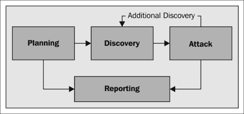

# 第一章：无线渗透测试简介

在本章中，我们将介绍渗透测试过程的关键概念，特别是无线渗透测试。

渗透测试是模拟对系统或网络的攻击过程，以指出其错误配置、弱点或安全漏洞及其相关的利用方式，这些方式可能被真正的攻击者用来获取对系统或网络的访问权限。

识别和评估漏洞的过程称为**漏洞评估**，有时被用作渗透测试的同义词，但它们实际上是不同的过程；事实上，渗透测试通常包括漏洞评估以及随后的攻击阶段，以实际利用发现的漏洞。在某些情况下，根据渗透测试的范围，可能不需要进行完整的漏洞评估，因为渗透测试可能只专注于特定的漏洞进行攻击。

渗透测试可以是外部的或内部的。外部渗透测试（有时也称为“黑盒”渗透测试）试图模拟真实的外部攻击，渗透测试人员对目标系统和网络没有先前的信息，而内部渗透测试（也称为“白盒”）是由获得内部权限的渗透测试人员执行的，他们试图利用网络漏洞来增加权限并做一些未经授权的事情，例如发动中间人攻击，正如我们将在第七章“无线客户端攻击”中看到的。

在本书中，我们主要将专注于外部渗透测试。

# 渗透测试的阶段

渗透测试过程可以分为四个主要阶段，即：

+   规划

+   发现

+   攻击

+   报告

描述这些阶段的渗透测试过程和方法的有用指南是 NIST CSRC SP800-115《信息安全测试和评估技术指南》（请参见附录 1.1 的参考部分），网址为[`csrc.nist.gov/publications/nistpubs/800-115/SP800-115.pdf`](http://csrc.nist.gov/publications/nistpubs/800-115/SP800-115.pdf)。

渗透测试方法的四个阶段的方案如下图所示，取自前述出版物：

我们现在将探讨这四个阶段中的每一个。

## 规划阶段

规划阶段是渗透测试的关键部分，尽管它并不总是被赋予应有的重要性。在这个阶段，我们定义了渗透测试的范围和所谓的“参与规则”，这是渗透测试人员和客户之间达成的协议的结果，将在双方之间的合同中正式规定。必须明确的是，渗透测试人员绝不能在没有合同或超出合同规定的范围和参与规则的情况下进行操作，否则他/她可能会陷入严重的法律纠纷。范围涉及要测试的网络、客户希望通过渗透测试实现的目标和目标。

在这一阶段，我们需要考虑的是，例如，要扫描无线网络的区域、网络信号的覆盖范围以及预计连接的客户数量。我们还定义了测试的目标，例如应该评估的特定漏洞及其优先级；是否应该列举伪装和隐藏的接入点，以及是否应该对客户进行无线攻击。

参与规则包括，但不限于，预计时间表以及何时进行测试的日期和时间，客户的合法授权，要生成的报告格式，付款条款以及保密协议条款，根据该条款，测试结果由测试人员保密。

### 注意

在附录中提供的参考文献 1.4 和 1.5 的链接中提供了定义范围和参与规则的工作表（需要注册 SANS Institute 网站）。

一旦确定了范围和参与规则，渗透测试团队就会定义要用于测试执行的资源和工具。

## 发现阶段

在发现阶段，我们收集尽可能多关于渗透测试范围内的网络的信息。这个阶段也被称为信息收集阶段，非常重要，因为它精确定义了我们测试的目标，并允许收集关于它们的详细信息并暴露它们的潜在漏洞。

特别是对于我们的范围，我们将收集诸如：

+   隐藏网络和伪造接入点

+   连接到网络的客户端

+   网络使用的认证类型；我们想要找出开放或使用 WEP 的网络，因此易受攻击

+   组织外部通过无线信号可达的区域

发现阶段可以通过两种主要类型的无线网络扫描来实现，**主动**和**被动**。主动扫描意味着发送探测请求数据包以识别*可见*接入点，而被动扫描意味着捕获和分析所有无线流量，并且还允许发现隐藏的接入点。

我们将在第三章 *WLAN 侦察*中了解更多关于无线扫描以及如何使用 Kali Linux 中包含的无线扫描器，如 airmon、airodump 和 Kismet，来执行无线渗透测试的发现阶段。

## 攻击阶段

攻击阶段是渗透测试过程中最实际的部分，我们试图利用发现阶段确定的漏洞来访问目标网络。

这被称为*利用*子阶段，在我们的情况下可能涉及尝试破解认证密钥以连接到网络，设置伪造和蜜罐接入点并直接攻击客户端以恢复密钥。下一个阶段（如果合同需要）被称为*后利用*，在我们获得对其的访问权限后，涉及攻击网络和基础设施，例如控制访问点并对客户端执行中间人攻击。

值得重申的是，我们不应进行未在合同中明确要求的攻击。此外，攻击阶段应根据与客户建立的规则和方式进行，定义在参与规则中。例如，如果目标是生产系统或网络，我们可以与客户协商在工作时间之外进行此类攻击，因为无线连接和提供的服务可能会受到干扰。

我们将覆盖攻击阶段从第四章 *WEP 破解*到第七章 *无线客户端攻击*。

## 报告阶段

报告是渗透测试的最终阶段。之前的阶段非常重要，因为它们是我们计划和执行测试的地方，但有效地向客户传达其结果和发现仍然很重要。报告对于定义应对已识别的漏洞的对策和缓解活动是有用的。它通常由两个主要部分组成，执行摘要和技术报告。

### 执行摘要

执行摘要是对测试的目标、方法和发现的高层次总结，主要面向非技术管理层。因此，摘要应以清晰的语言和可理解的术语编写，避免使用过多的技术术语和表达。

执行摘要应包括：

+   测试目标的描述

+   发现问题的概述和描述

+   客户组织的安全风险概况定义

+   发现漏洞并减轻风险的纠正计划

+   改进组织安全姿态的建议

### 技术报告

技术报告包括对渗透测试的深入描述，以及有关发现和攻击阶段的详细信息，以及对客户所面临的已识别漏洞所带来的风险的评估和风险缓解计划。因此，技术报告涵盖了执行摘要的内容，但是从技术角度来看，主要是针对 IT 高管，他们应该根据报告中提供的纠正活动进行应用。

我们将在第八章*报告和结论*中涵盖报告阶段。

# 摘要

在本章中，我们介绍了无线渗透测试，并简要描述了其分为四个主要阶段：规划、发现、攻击和报告。

在下一章中，我们将看到如何在您的计算机上安装 Kali Linux，并检查您的无线适配器必须满足的要求，以开始进行无线渗透测试。
