# 第二章：使用 Kali Linux 设置您的机器

在本章中，我们将涵盖以下主题，为您的笔记本电脑设置无线渗透测试：

+   介绍 Kali Linux 发行版

+   安装 Kali Linux

+   无线适配器设置和配置

# 介绍 Kali Linux 发行版

Kali Linux 是最受欢迎和使用最广泛的渗透测试和安全审计发行版。它由 Offensive Security 开发和维护，取代了 Backtrack Linux 成为 Kali Linux 的第一个版本，是 Backtrack 5 版本 3 的继任者。

Kali Linux 已经完全重建，现在它基于 Debian。它包括广泛的用于侦察和信息收集、嗅探和欺骗、漏洞评估、密码破解、利用、逆向工程、硬件黑客、取证调查、事件处理和报告的工具。对于无线渗透测试，有一个专门的集合（`kali-linux-wireless`元包），包括最知名的开源工具，如 Aircrack-ng 套件、Kismet、Fern Wifi Cracker、Wifite 和 Reaver 等。

在本书中，我们将主要使用 Aircrack-ng 套件，由 Thomas d'Otreppe 开发，因为它是用于审计无线网络的最完整和最受欢迎的工具集。有关 Aircrack-ng 项目的更多信息，请访问其网站[`www.aircrack-ng.org/`](http://www.aircrack-ng.org/)，本书中经常引用。此外，Kali Linux 支持各种无线适配器，并且其内核会不断更新以获取最新的无线注入补丁。

出于所有这些原因，Kali Linux 是我们目的的最佳选择。下一节演示了如何在我们的笔记本电脑上安装它。

# 安装 Kali Linux

有三种方法可以安装 Kali Linux，可以安装在硬盘上（单引导或多引导），可以安装在 USB 闪存驱动器上以用作实时系统，也可以使用软件（如 Oracle VirtualBox 和 VMware Workstation 或 Player）在虚拟机上安装。

安装至少需要 10GB 的硬盘空间，建议至少 1,024MB 的 RAM，尽管 Kali Linux 可以在只有 512MB 的 RAM 上运行。

在硬盘上安装 Kali Linux 在性能上更好，但缺点是要将所有硬盘空间都分配给它，或者对硬盘进行分区并使用一个分区来安装它，而在虚拟机上安装则提供了一个轻微较慢的系统，但也更加灵活，我们不必修改硬盘的配置。

我们可以使用可下载的 ISO 在虚拟机上安装 Kali Linux，也可以直接使用 VMware 或 VirtualBox 预构建的映像。32 位或 64 位的 ISO 可以从[`www.kali.org/downloads/`](https://www.kali.org/downloads/)下载，VMware 和 VirtualBox 映像可以从[`www.offensive-security.com/kali-linux-vmware-arm-image-download/`](https://www.offensive-security.com/kali-linux-vmware-arm-image-download/)下载。有趣的是，Kali Linux 也可以安装在树莓派等 ARM 设备上。

本章的其余部分涉及在虚拟机上安装和配置 Kali Linux，这个过程与直接在硬盘上安装非常相似。

## 在虚拟机上安装

要创建新的虚拟机并在其上安装 Kali Linux，我们需要使用虚拟化软件。

在本书中，我们将使用 Oracle VirtualBox，这是一款免费的开源虚拟化软件，适用于各种平台，如 Windows、Linux、Mac OS X 和 Solaris。要下载并获取有关如何安装它的信息，请参阅附录中的*参考资料*。

### 创建新的虚拟机

要创建新的虚拟机（VM），请按照以下步骤进行：

1.  在工具栏菜单上点击**新建**按钮，向导将开始。我们为虚拟机分配一个名称，并选择操作系统类型和版本，在我们的情况下分别为 Linux 和 Debian（架构，32 位或 64 位，取决于您的机器）：

1.  我们分配给虚拟机的 RAM 数量；这里推荐的大小是 512 MB，但对于我们的目的，至少 1,024 MB 会是更好的选择：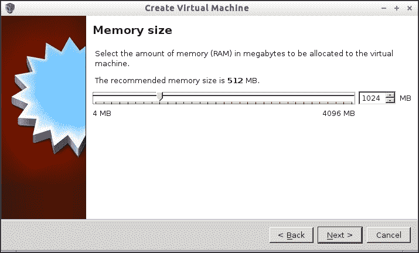

1.  然后，我们必须为我们的安装创建一个新的虚拟硬盘：

1.  我们选择**VDI（VirtualBox 磁盘映像）**作为虚拟磁盘格式：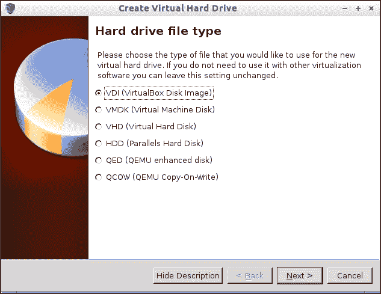

1.  我们选择**动态分配**选项，这只会在虚拟磁盘文件增长时使用物理驱动器上的空间，直到达到固定的最大大小：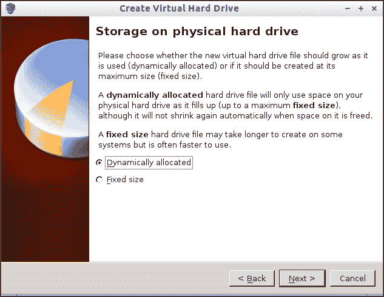

1.  我们设置虚拟磁盘文件位置和最大大小；然后点击**创建**按钮，虚拟机就准备好了！创建新虚拟机

### 安装步骤

此时，虚拟机已创建，我们准备在其上安装 Kali Linux 操作系统。为此，我们按照以下步骤进行：

1.  我们在 Oracle VM VirtualBox Manager 的左窗格中选择新创建的 Kali Linux VM，然后点击工具栏菜单上的**设置**，然后点击**存储**。我们选择与**CD/DVD 驱动器**字段关联的**控制器：IDE**条目，并在**属性**部分选择硬盘上的 Kali Linux ISO。这类似于在直接在硬盘上安装 Kali Linux 时在物理驱动器上插入 Kali Linux 安装 DVD，以便机器可以从中引导：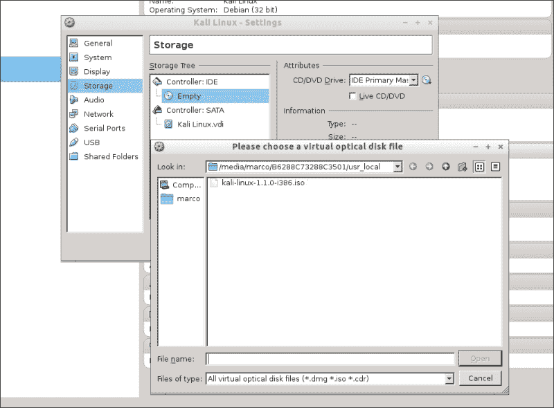

1.  现在，我们点击工具栏菜单上的**启动**按钮启动虚拟机。虚拟机从 ISO 引导，并在以下截图中显示安装引导菜单：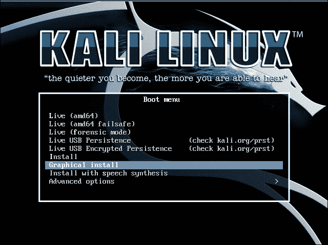

1.  我们按照安装向导的步骤，依次选择语言（默认为英语）、国家、区域设置、键盘布局、主机名和域名。然后，我们需要设置 root 帐户的密码。Root 是系统中默认和最高特权的帐户，具有完全的管理权限：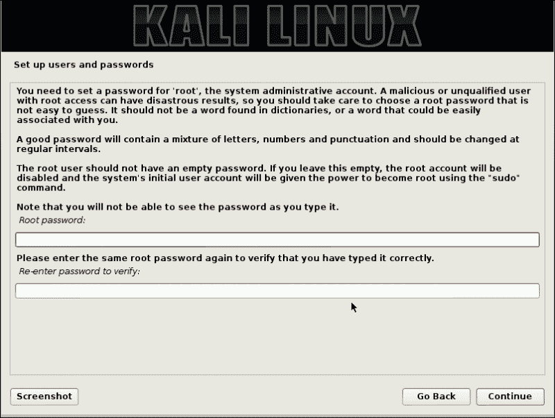

1.  我们选择时区，然后需要选择磁盘分区方法。我们可以选择引导方法（使用三种不同的方案）或手动方法，如果我们希望对磁盘进行分区。在我们的情况下，我们将选择第一种方法，并使用与虚拟机关联的整个虚拟磁盘：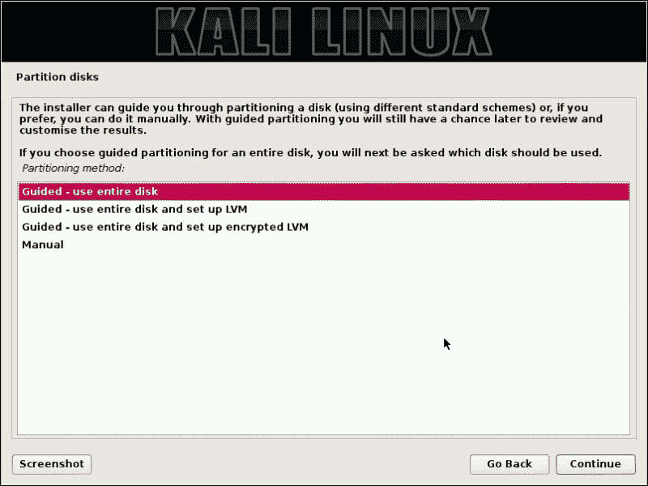

1.  然后，安装程序询问要使用哪个磁盘来安装系统（在我们的情况下，是唯一的），在接下来的窗口中，询问我们是否要使用单个分区或为不同的挂载点创建单独的分区（例如，`/home`，`/usr/local`，`/opt`等）：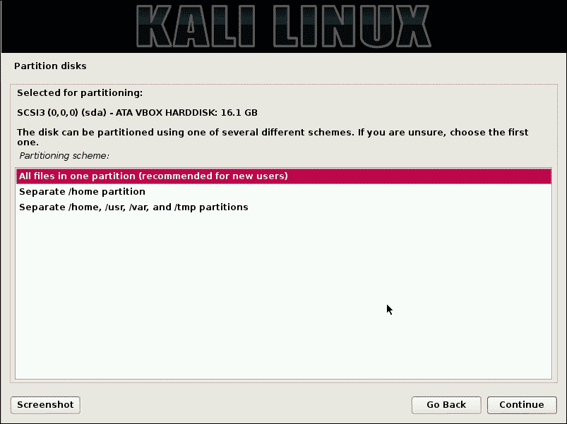

1.  安装程序创建根（`/`）和交换分区，并要求确认，将更改写入虚拟磁盘：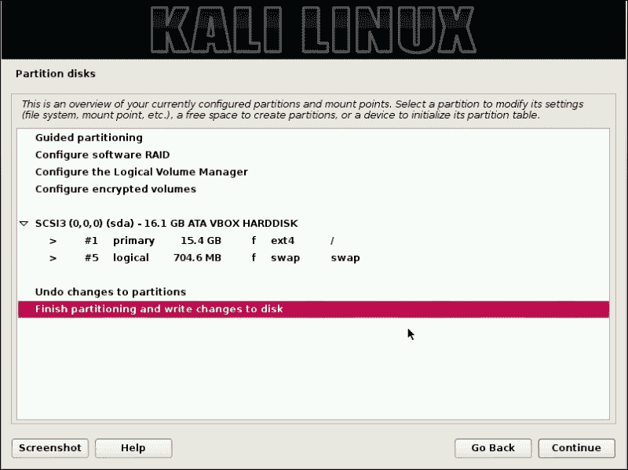

1.  在所有数据复制到磁盘后，安装程序询问我们是否要使用网络镜像来安装未包含在安装 ISO 中的软件或更新已安装的软件。然后，我们需要选择是否要在虚拟磁盘的**主引导记录**（**MBR**）上安装 GRUB 引导加载程序。我们将安装它：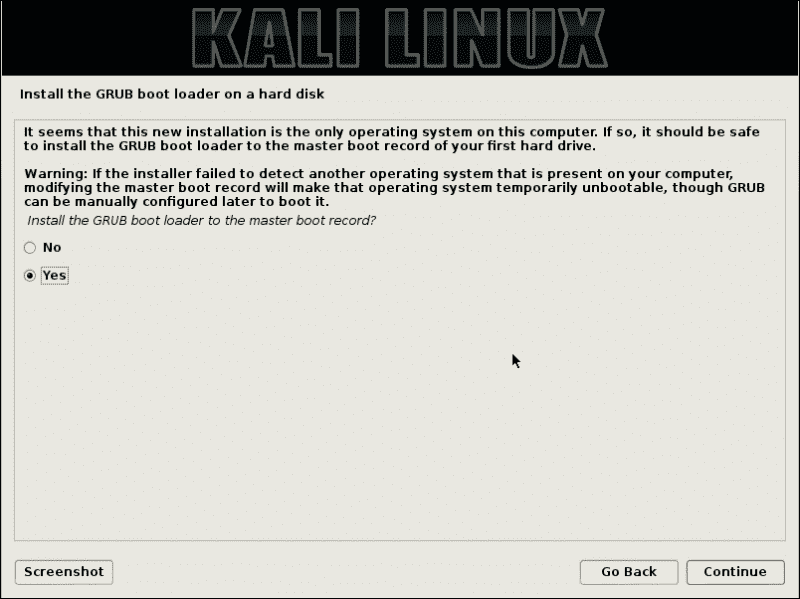

1.  再走一步，安装就完成了。现在我们在虚拟机上有了一个全新的 Kali Linux 系统！我们可以重新启动虚拟机来启动它，然后从虚拟 CD/DVD 驱动器中删除安装 ISO：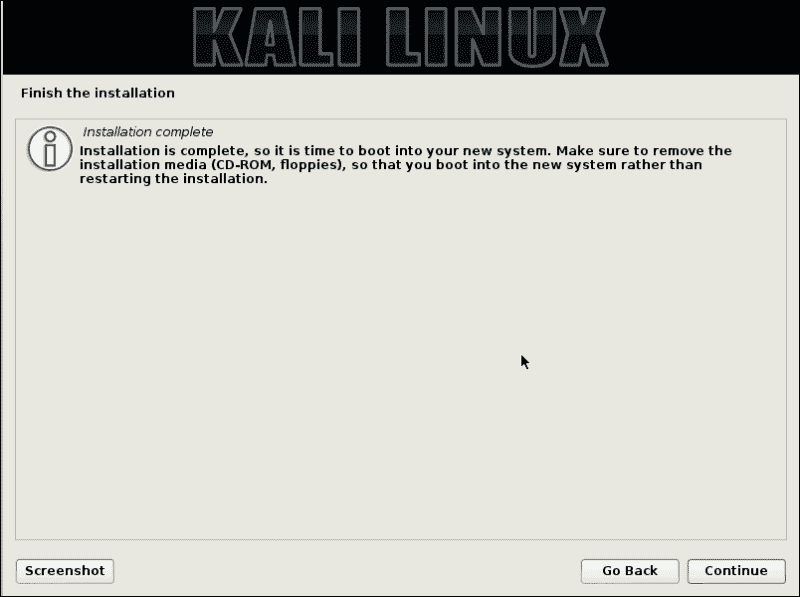

# 无线适配器的设置和配置

现在我们已经在虚拟机上安装了 Kali Linux，是时候谈谈无线适配器的配置了。但是，首先让我们看看它的要求。

## 无线适配器的要求

无线适配器必须满足进行无线渗透测试的主要要求是：

+   与 IEEE 802.11b/g/n Wi-Fi 标准兼容，可能还与在 5 GHz 频段上运行的 802.11a 兼容（双频支持）。

+   能够将卡放入所谓的*监控模式*，这允许对所有无线流量进行嗅探。监控模式相当于有线网络中的混杂模式。

+   支持*数据包注入*的能力，以主动向网络中注入流量。

要验证我们的 Wi-Fi 适配器是否满足这些要求，我们首先需要确定其芯片组，并验证其 Linux 驱动程序是否支持监控模式和数据包注入。我们将在本章后面看到如何实际测试我们的适配器是否满足这些要求。

### 注意

**验证适配器芯片组的兼容性**

确定芯片组并验证其兼容性的绝佳资源是 Aircrack-ng 文档 wiki 上的*Tutorial: Is My Wireless Card Compatible?*和*Compatibility_drivers*部分（请参阅附录中*第二章*，*使用 Kali Linux 设置您的机器*，*参考资料*）。

它们提供了一个详细的芯片组列表，以及它们在无线渗透测试中的支持级别。

如果我们的笔记本电脑不是很旧，几乎肯定配备了内置 Wi-Fi 卡。内置卡通常不是进行无线渗透测试的最佳选择，因为它们的大多数芯片组在 Kali Linux 上不支持此目的。此外，我们无法在虚拟机中使用内置卡，因为我们需要直接访问设备才能使其工作，而虚拟机只允许对 USB 设备进行直接访问。因此，如果 Kali Linux 在虚拟机上运行，我们只能使用 USB 无线适配器。

因此，推荐的选择是使用带有外置高增益天线的 USB 无线适配器，它比集成天线具有更多的发射功率和灵敏度，从而允许长距离信号接收和发送。

具有这些功能的适配器在 Kali Linux 中得到了很好的支持，价格便宜，因此在无线渗透测试人员中非常受欢迎的是 Alfa Networks AWUS036NH USB 卡。该卡具有 Ralink 芯片组。在 Linux 下得到很好支持的其他芯片组是 Atheros 和 Realtek RTL8187L 芯片组。

在本书的其余部分，我们将假设您正在使用 USB 无线适配器。

## 无线卡配置

将适配器连接到 USB 端口后，我们必须配置它以在安装了 Kali Linux 的虚拟机中使用。

1.  我们启动 VirtualBox VM Manager，在左窗格中选择我们的 Kali Linux VM，然后导航到**设置** | **USB**。首先，如果我们还没有启用 USB 2.0 控制器，我们应该启用它。这需要安装 VirtualBox 扩展包（有关更多信息，请参阅*安装 VirtualBox 扩展包*信息框）。

1.  我们点击右侧的添加新 USB 设备过滤器（绿色加号图标），然后选择与我们的无线适配器对应的设备：

### 注意

**安装 VirtualBox 扩展包**

我们可以从[`www.virtualbox.org/wiki/Downloads`](https://www.virtualbox.org/wiki/Downloads)下载扩展包，根据安装的 VirtualBox 版本选择适当的文件。

有关 VirtualBox 扩展包及其安装方法的信息，请访问[`www.virtualbox.org/manual/ch01.html#intro-installing`](https://www.virtualbox.org/manual/ch01.html#intro-installing)。

1.  我们启动我们的虚拟机，现在应该能够通过 USB 直通功能使用我们的无线适配器。在虚拟机中启动 Kali Linux 后，我们以 root 用户登录系统并打开终端仿真器。我们输入`iwconfig`命令来列出系统上所有可用的无线接口：

系统已分配`wlan0`接口给我们的适配器，但它仍未激活，如`ifconfig`输出所示：


1.  为了启用`wlan0`接口，我们执行`ifconfig wlan0 up`命令，然后使用`ifconfig`来验证它是否已被激活。现在，我们的无线接口已经启动运行，如下截图所示：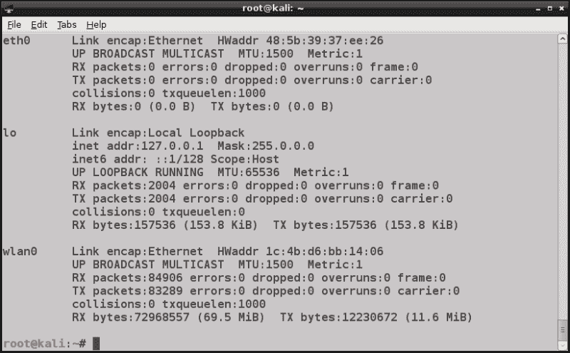

### 测试适配器进行无线渗透测试

现在我们已经设置好了适配器，我们可以进行一个小测试，以验证它是否真的适合进行无线渗透测试，即它是否可以被置于监视模式并支持数据包注入。为此，我们将使用 Aircrack-ng 套件中的两个程序，这些程序在本书的其余部分中也将被广泛使用。

首先，我们执行`airmon-ng start wlan0`将接口置于监视模式。

如果命令成功完成，并且新创建的接口`mon0`启用了监视模式，那么它已通过了这个测试！

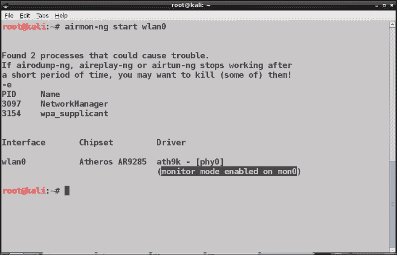

接下来，我们运行`aireplay-ng -9 wlan0`命令，其中`-9`选项表示这是一个注入测试（完整形式为`--test`）：

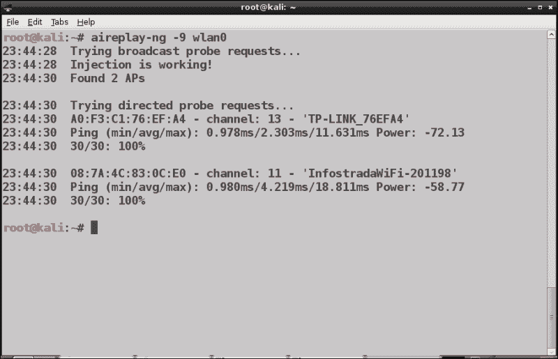

Aireplay-ng 是一个用于生成和注入帧的工具，我们将使用它来进行本书中涵盖的许多攻击。

如果输出中出现`Injection is working!`字符串，则测试成功，我们的适配器支持数据包注入！

测试还提供其他有价值的信息；它告诉我们无线接口使用的信道以及通过响应广播探测或接收的信标找到的接入点，以及相关的连接质量（我们将在第三章中讨论这些主题，*WLAN Reconnaissance*）。

有关注入测试的更多信息，请访问[`www.aircrack-ng.org/doku.php?id=injection_test`](http://www.aircrack-ng.org/doku.php?id=injection_test)。

### 故障排除

正如我们所看到的，Kali Linux 发行版支持各种无线适配器，我们不应该在配置无线适配器时遇到任何问题。

然而，有时我们的适配器在`iwconfig`输出中没有显示。在这种情况下，我们可以使用`lsusb`或`lspci`工具（取决于接口类型）来检查操作系统是否已检测到设备，并使用`dmesg`来检查相关驱动程序是否已正确加载。

有时，无线适配器可能被识别，但`ifconfig wlan0 up`命令无法启用接口，出现错误消息`'SIOCSIFFLAGS : No such file or directory'`。这个错误通常表示驱动程序无法加载适配器固件，因为固件丢失或未正确安装。

我们可以通过安装正确的固件来解决这个问题，这些固件可以在适配器驱动的文档中找到。

例如，要为 Ralink 芯片组适配器安装固件包，我们执行以下命令：

```
apt-get install firmware-ralink

```

有关无线适配器配置故障排除的更详细信息，可以在附录中找到一些有用的参考资料。

# 总结

在本章中，我们看到了如何使用 Virtual Box 创建虚拟机以及如何在其中安装 Kali Linux。在涵盖了无线适配器对无线渗透测试的要求之后，我们已经配置了 USB 无线适配器以在 Kali Linux 上工作，并对我们之前分析的要求进行了测试。

在下一章中，我们将涵盖无线渗透测试的发现和信息收集阶段。
