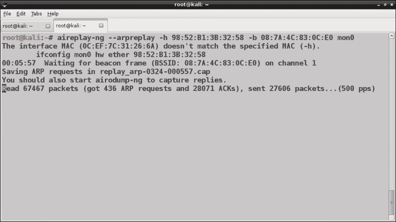
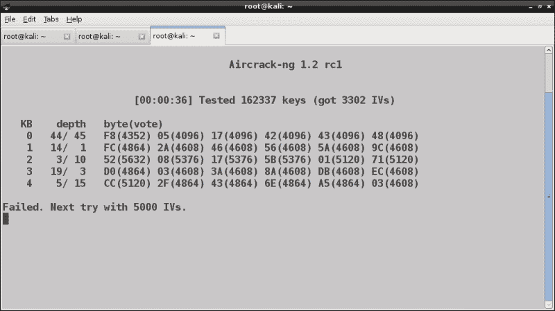
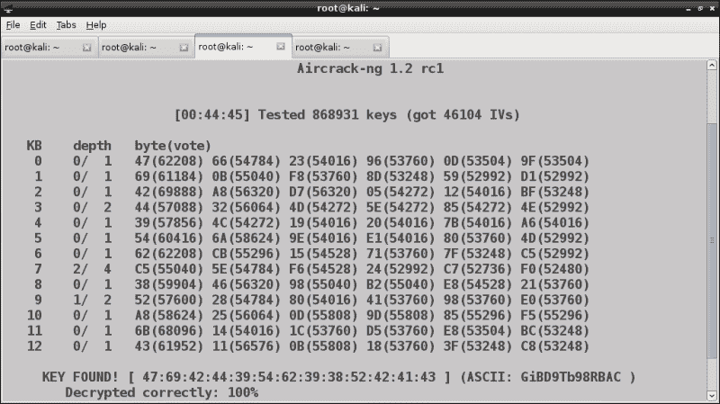
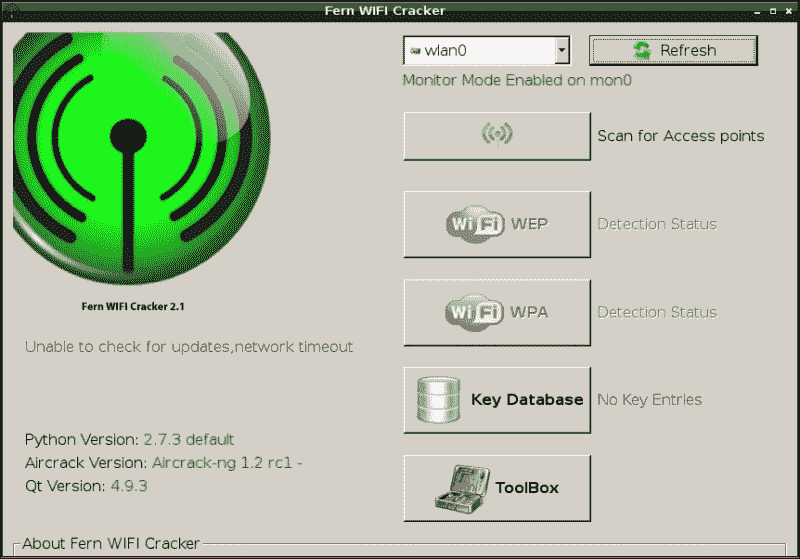
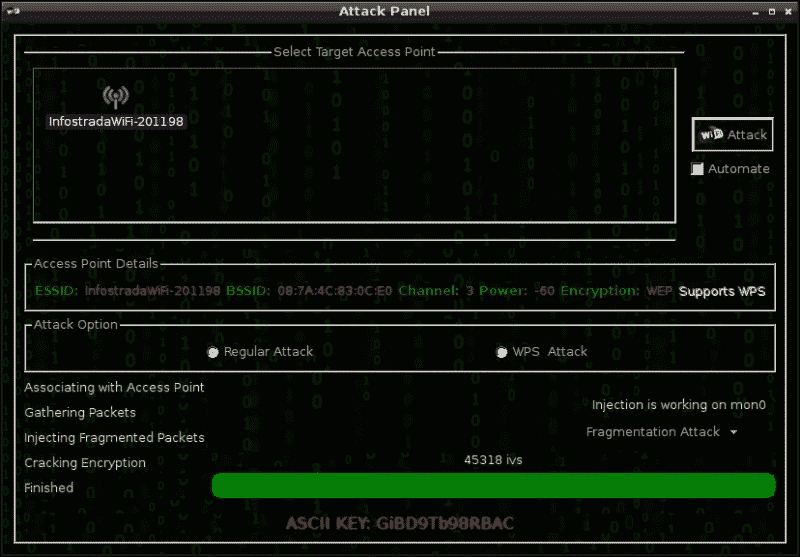

# 第四章：WEP 破解

在本章中，我们将介绍**有线等效隐私**（**WEP**）协议及其漏洞，展示如何使用 Kali Linux 中包含的一些工具，即 Aircrack-ng 套件和 Fern WiFi Cracker 来破解 WEP 密钥。

我们将涵盖以下主题：

+   WEP 介绍

+   使用 Aircrack-ng 破解 WEP

+   使用自动化工具破解 WEP

# WEP 简介

WEP 协议是在最初的 802.11 标准中引入的，作为为无线局域网实现提供身份验证和加密的手段。它基于**RC4**（**Rivest Cipher 4**）流密码，使用 40 位或 104 位的**预共享密钥**（**PSK**），具体取决于实现。24 位伪随机**初始化向量**（**IV**）与预共享密钥连接在一起，用于生成 RC4 用于实际加密和解密过程的每个数据包密钥流。因此，生成的密钥流可能是 64 位或 128 位长。

在加密阶段，密钥流与明文数据进行异或运算，以获得加密数据，而在解密阶段，加密数据与密钥流进行异或运算，以获得明文数据。加密过程如下图所示：


## 针对 WEP 的攻击

首先，我们必须说 WEP 是一个不安全的协议，并已被 Wi-Fi 联盟弃用。它存在与密钥流的生成、IV 的使用和密钥长度相关的各种漏洞。

IV 用于向密钥流添加随机性，试图避免重用相同的密钥流来加密不同的数据包。WEP 的设计并未实现这一目的，因为 IV 只有 24 位长（具有 2²⁴ = 16,777,216 个可能的值），并且在每个帧中以明文形式传输。因此，在一定时间后（取决于网络流量），将重用相同的 IV，因此也将重用相同的密钥流，使攻击者能够收集相关的密文并执行统计攻击以恢复明文和密钥。

针对 WEP 的第一个著名攻击是 2001 年的**Fluhrer, Mantin and Shamir**（**FMS**）攻击。FMS 攻击依赖于 WEP 生成密钥流的方式，以及它还使用*weak* IV 来生成弱密钥流，使得攻击者能够收集足够数量的使用这些密钥流加密的数据包，对其进行分析，并恢复密钥。

完成 FMS 攻击所需收集的 IV 数量约为 40 位密钥为 250,000 个，104 位密钥为 1,500,000 个。

FMS 攻击已经被 Korek 改进，提高了其性能。

Andreas Klein 发现了 RC4 密钥流与密钥之间的更多相关性，这些相关性可以用来破解 WEP 密钥。

2007 年，**Pyshkin, Tews, and Weinmann**（**PTW**）扩展了 Andreas Klein 的研究，并改进了 FMS 攻击，显著减少了成功恢复 WEP 密钥所需的 IV 数量。

事实上，PTW 攻击不像 FMS 攻击那样依赖于弱 IV，并且非常快速和有效。它能够在不到 40,000 帧的情况下以 50%的成功概率恢复 104 位 WEP 密钥，并且在 85,000 帧的情况下以 95%的概率成功。

PTW 攻击是 Aircrack-ng 用来破解 WEP 密钥的默认方法。

FMS 和 PTW 攻击都需要收集相当多的帧才能成功，并且可以被动地进行，嗅探目标 AP 的同一信道上的无线流量并捕获帧。问题在于，在正常情况下，我们将不得不花费相当长的时间 passively 收集攻击所需的所有必要数据包，特别是 FMS 攻击。

为了加快这个过程，想法是重新向网络中注入帧以产生响应流量，以便更快地收集所需的 IV。适合这一目的的一种帧类型是 ARP 请求，因为 AP 会广播它，并且每次都会有一个新的 IV。由于我们没有与 AP 关联，如果我们直接向其发送帧，它们将被丢弃并发送去认证帧。相反，我们可以捕获关联客户端的 ARP 请求并将其重发到 AP。

这种技术被称为**ARP 请求重放**攻击，也被 Aircrack-ng 采用用于实施 PTW 攻击。

### 注意

**深入破解 WEP**

这些攻击背后的数学和密码学超出了本书的范围。对于那些有兴趣了解攻击的细节和技术的人来说，一个有价值的资源是 Aircrack-ng 链接和参考页面上的*技术论文*部分，网址为[`www.aircrack-ng.org/doku.php?id=links#technique_papers`](http://www.aircrack-ng.org/doku.php?id=links#technique_papers)。

# 使用 Aircrack-ng 破解 WEP

现在我们已经探讨了 WEP 的漏洞及其相关攻击，我们准备开始实际操作部分。在本节中，我们将看到如何使用 Aircrack-ng 套件破解 WEP 密钥。

在侦察阶段，我们已经收集了关于每个要测试的网络的信息，例如 BSSID、操作频道和使用的安全协议。在这里，我们专注于一个受 WEP 保护的网络，并开始捕获在相关频道上 AP 和关联客户端之间交换的帧。

我们可以通过将我们的 WiFi 路由器设置为使用 WEP 来尝试这种攻击。我们假设 AP 的 BSSID 是 08:7A:4C:83:0C:E0，频道是 1。第一步是在频道 1 上启动监视模式，就像我们在前一章中看到的那样：

```
airmon-ng start wlan0 1

```

为了捕获我们目标网络的流量，我们将执行以下命令：

```
airodump-ng --channel 1 --bssid 08:7A:4C:83:0C:E0 --write wep_crack mon0

```


这个命令将所有捕获的帧保存到`wep_crack` pcap 文件中。我们将看到如何在有客户端连接到 AP 和没有客户端连接到 AP 时破解 WEP 密钥。

## 使用连接的客户端破解 WEP 密钥

从前面的截图中，我们看到有一个客户端（其 MAC 地址为 98:52:B1:3B:32:58）连接到我们的目标 AP。

由于我们没有与 AP 关联，也无法自己发送 ARP 请求，我们捕获并重发由此客户端发送的请求。

为此，我们使用 aireplay-ng，这是一个旨在注入帧的工具，它有各种选项可以执行不同的攻击，我们将在本书中看到。我们已经在第二章中使用它来测试无线适配器的注入，*使用 Kali Linux 设置您的机器*。

为了破解 WEP 密钥，我们将执行以下步骤：

1.  我们在终端模拟器中打开一个新标签并运行以下命令：

```
aireplay-ng --arpreplay -h 98:52:B1:3B:32:58 -b 08:7A:4C:83:0C:E0 mon0

```

这里，`-b`是 BSSID，`-h`是客户端 MAC 地址，`-arpreplay`（或-3）是 ARP 请求重放攻击选项。



我们切换到终端并输出`airodump-ng`，我们应该注意到捕获的帧数（#Data）迅速增加。

1.  在收集了足够数量的数据包后（即，如我们所见，Aircrack-ng 实施的 PTW 攻击需要约 40,000 个数据包），我们可以开始尝试破解 WEP 密钥，启动一个新的控制台标签中的`aircrack-ng`。

Aircrack-ng 是一个工具，可以使用 PTW 攻击从保存在`.cap`文件中的帧中恢复密钥。我们运行以下命令：

```
aircrack-ng -b 08:7A:4C:83:0C:E0 wep_crack-01.cap

```

这里`-b`是（通常）BSSID。如果`aircrack-ng`无法破解 WEP 密钥，它会等待`airodump-ng`收集更多的 IV 并重试该过程（默认情况下，每收集 5000 个 IV）：



在下面的屏幕截图中，我们可以看到`aircrack-ng`尝试破解密钥，但捕获的 IV 数量仍然很少：


最后，它以十六进制和 ASCII 显示破解的密钥：



## 无连接客户端的 WEP 密钥破解

在本节中，我们涵盖了在没有与 AP 关联的客户端的更复杂情况下恢复密钥的情况。

由于我们无法回复 ARP 请求帧，我们需要以某种方式模拟与 AP 的认证（虚假认证）。为此，我们执行以下命令：

```
aireplay-ng --fakeauth 0 -o 1 -e InfostradaWiFi-201198 -a 08:7A:4C:83:0C:E0 -h 1C:4B:D6:BB:14:06 mon0

```

这里，`--fakeauth`（或-1）是虚假认证选项，`0`是重新关联的时间间隔（无延迟），`-o`是每次发送的数据包数，`-e`是网络 SSID，`-a`是 BSSID，`-h`是`mon0`接口的 MAC 地址：


我们应该看到消息说虚假认证已成功。如果我们收到`Got a deauthentication packet!`的消息，可能 AP 应用了 MAC 过滤，只允许特定的 MAC 地址访问。

### 分段和 ChopChop 攻击

接下来，我们需要找到一种方法来生成使用 AP 使用的 WEP 密钥加密的 ARP 请求帧，但我们没有它，我们正在寻找恢复它的方法！

这时两种攻击可以帮助我们：**分段**和**ChopChop**攻击。并非所有无线设备驱动程序都支持它们，也并非所有 AP 都能成功受到攻击，因此这些攻击可以交替进行。

即使没有客户端连接，接入点也会传输帧。分段攻击允许从 AP 传输的单个帧开始恢复用于加密帧的密钥流（而不是实际密钥）。密钥流的最大大小可能等于**MTU**（**最大传输单元**），即 1500 字节。

要执行攻击，我们运行以下命令：

```
aireplay-ng --fragment -b 08:7A:4C:83:0C:E0 -h 1C:4B:D6:BB:14:06 mon0

```


该程序捕获了一个来自 AP 的帧，并询问我们是否要使用这个数据包。我们确认后，程序会尝试恢复高达 1500 字节的密钥流。当它达到足够的字节数（384）时，它会要求退出并保存恢复的密钥流。如果我们接受，输出中会出现`Saving keystream in fragment...`的消息，攻击将成功终止：


然后我们可以继续伪造一个 ARP 请求注入到网络中，接下来我们会看到。否则，我们可以尝试 ChopChop 攻击。

ChopChop 攻击也可以像分段攻击一样从单个 WEP 加密帧中恢复密钥流，但它更复杂，通常速度较慢，因为它仅依赖于密文，而不依赖于任何已知的明文。

要执行它，我们执行以下命令：

```
aireplay-ng --chopchop -b 08:7A:4C:83:0C:E0 -h 1C:4B:D6:BB:14:06 mon0

```

输出将类似于以下屏幕截图：


如果攻击成功，我们会注意到密钥流和明文已保存。

### 伪造和注入 ARP 请求帧

恢复了密钥流后，现在可以使用`packetforge-ng`工具伪造加密的 ARP 请求：

```
packetforge-ng --arp -a 08:7A:4C:83:0C:E0 -h 1C:4B:D6:BB:14:06 -k 192.168.1.100 -l 192.168.1.1 -y fragment-0325-172339.xor -w arp- request

```

这里，`--arp`（或-0）是用于 ARP 数据包的选项，`-a`是 AP 的 MAC 地址，`-h`是源 MAC 地址，`-k`是目标 IP 地址，`-l`是源 IP 地址，`-y`指定密钥流文件（使用先前看到的攻击获得），`-w`是我们需要保存生成的 ARP 请求的文件：

伪造和注入 ARP 请求帧

一旦我们伪造了 ARP 请求，我们就可以用`aireplay-ng`注入它：

```
aireplay-ng --interactive -r arp-request mon0

```

在下面的屏幕截图中，我们可以注意到正在注入的 ARP 请求的详细信息：


`--interactive`选项允许我们注入我们选择的帧，使用`-r`选项指定。

我们切换回`airodump-ng`终端，应该观察到捕获的帧数（#Data）在增加：

当我们有足够数量的帧时，我们可以开始使用`aircrack-ng`来处理生成的`pcap`文件并恢复密钥：

```
aircrack-ng -b 08:7A:4C:83:0C:E0 wep_crack-10.cap

```


## 使用自动化工具进行 WEP 破解

在前面的部分中，我们介绍了使用 Aircrack-ng 套件中包含的工具进行 WEP 密钥破解，该套件提供了广泛的选项和很高的控制和细粒度。对于无线渗透测试人员来说，学会使用这些工具并理解实施攻击的逻辑是至关重要的。

Kali Linux 中还有其他工具可以自动化 WEP 破解过程，因此更容易和立即使用。

其中一个是名为 Wifite 的 Python 脚本，它使用 Aircrack-ng 工具进行密钥破解。我们可以在 Wifite 网站[https://code.google.com/p/wifite/]下载程序并阅读文档和使用示例。程序的最新版本可在[https://github.com/derv82/wifite]找到。我们将在第五章中介绍 Wifite，*WPA/WPA2 破解*。

另一个简单的自动化程序是 Fern WiFi Cracker，我们将在下一节中探讨。

## 使用 Fern WiFi Cracker 进行 WEP 破解

Fern WiFi Cracker 是一个用 Python 编写的 GUI 工具，基于 Qt 库，并依赖于 Aircrack-ng 工具来执行底层工作。

它不仅设计用于仅需点击几下鼠标即可破解 WEP 和 WPA/WPA2 密钥，还可以对 AP 和客户端执行各种其他无线攻击。

要运行该程序，我们导航至**应用程序菜单** | **Kali Linux** | **无线攻击** | **802.11 无线工具** | **fern-wifi-cracker**。

GUI 界面简单直观。窗口顶部有一个下拉菜单，列出了可用的无线接口。我们选择我们的接口，程序将其置于监视模式：



要扫描无线网络，我们点击**扫描接入点**按钮，应该看到检测到的带有 WEP 或 WPA 加密的网络数量，以及相关的按钮：


我们点击**Wi-Fi WEP**按钮，打开一个窗口，顶部显示检测到的 WEP 网络。

我们选择目标网络并在下方的窗格中查看其详细信息。在底部是攻击面板，我们可以选择针对网络执行哪种攻击。在本例中，我们在左侧选择**分段攻击**选项，然后在右上角点击**Wi-Fi 攻击**：


攻击面板显示攻击的进展，捕获的 IVs 数量在增加：


最后，程序会在窗口底部返回破解的密钥（十六进制）。我们可以右键单击它并复制密钥或转换为 ASCII 文本：


完成后，攻击面板将显示 ASCII 密钥如下：



在主窗口中，我们可以看到**密钥数据库**条目已填充了我们恢复的密钥：


确实，在完成攻击后，破解的密钥将保存在 SQLite 数据库中，我们可以通过点击**密钥数据库**按钮查看其详细信息：


# 总结

在本章中，我们介绍了 WEP 协议、已经开发出来用于破解密钥的攻击、Aircrack-ng 套件以及 Kali Linux 中包含的其他自动化工具来实施这些攻击。

在下一章中，我们将介绍 WPA/WPA2 协议以及用于攻击它的工具。
