# 第六章：攻击接入点和基础设施

在第五章中，*WPA/WPA2 破解*，我们学习了如何在 WPA-Personal 模式下破解 WPA 预共享密钥。还有另一种恢复 PSK 的方法；攻击 AP 以利用**Wi-Fi Protected Setup**（**WPS**）中的缺陷。在本章中，我们将介绍这种攻击，针对 WPA-Enterprise 的攻击以及针对接入点和网络基础设施的其他攻击，解释 Kali Linux 中用于进行此类攻击的技术和工具。

我们将要涵盖的主题是：

+   针对 Wi-Fi Protected Setup 的攻击

+   攻击 WPA-Enterprise

+   拒绝服务攻击

+   Rogue 接入点

+   攻击 AP 认证凭据

# 针对 Wi-Fi Protected Setup 的攻击

WPS 是由 Wi-Fi 联盟于 2006 年引入的用于接入点的安全机制，允许客户端通过提供八位数字 PIN 而不是预共享密钥更轻松地连接到无线网络。如果 PIN 正确，AP 将向客户端提供 WPA PSK 以进行网络认证。

WPS 规范还支持**Push-Button-Connect**（**PBC**）方法，其中在 AP 和客户端设备上都按下按钮以开始连接。

2011 年，两位研究人员 Stefan Viehböck 和 Craig Heffner 分别发现了 WPS 中的一个漏洞，可以允许攻击者通过暴力攻击在几小时内恢复 PIN 并访问网络。Heffner 还开发并发布了一个实现此攻击的工具**Reaver**。

漏洞存在于 AP 检查 PIN 的方式中。事实上，八位数字 PIN 并没有完整地发送到 AP，而是只发送和检查前半部分，然后，如果正确，发送和验证后半部分。如果前半部分不正确，AP 会向客户端发送负面响应。因此，AP 独立地检查 PIN 的两个部分。

此外，PIN 的最后一位是其他七位数字的校验和，因此可以从中推导出来。

以这种方式，攻击者可以尝试猜测 PIN 的前四位数字，最多尝试*10⁴ = 10,000*个值，然后再尝试后半部分，最多*10³ = 1,000*个可能性，总共有 11,000 个可能值，而整个 PIN 有*10⁷ = 10,000,000*个可能的组合。这在暴力攻击中产生了很大的差异，大大减少了执行所需的时间。

WPS 可以在接入点的管理面板中禁用。在这种情况下，我们启用它，保留 AP 的预配置 PIN，以演示攻击的工作原理，如下面的屏幕截图所示：

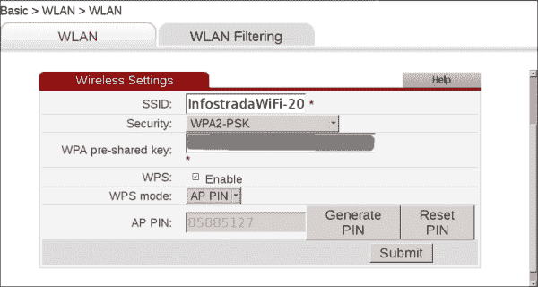

最近的 AP 型号在尝试猜测 PIN 的次数达到一定数量后会实施锁定机制。

另一种针对 WPS 的攻击，**Pixie Dust**攻击，是由 Dominique Bongard 在 2014 年引入的。这是一种*离线*暴力攻击，用于恢复 PIN，而之前由 Reaver 实施的攻击是一种不断与 AP 交互的在线攻击。

Pixie Dust 攻击极大地提高了 WPS PIN 恢复过程的速度，在最坏的情况下将所需的时间减少到几秒或几分钟。

攻击的技术细节可以在[`archive.hack.lu/2014/Hacklu2014_offline_bruteforce_attack_on_wps.pdf`](http://archive.hack.lu/2014/Hacklu2014_offline_bruteforce_attack_on_wps.pdf)找到。

一种名为**Pixiewps**的用 C 编写的工具已经开发出来，作为演示 Pixie Dust 攻击的概念验证代码。这个工具已经集成到 Reaver 的社区分支版本 reaver-wps-fork-t6x 中，以支持这种新的攻击。

并非所有 AP 都容易受到攻击；易受攻击的 AP 型号数据库可在[`docs.google.com/spreadsheets/d/1tSlbqVQ59kGn8hgmwcPTHUECQ3o9YhXR91A_p7Nnj5Y/edit#gid=2048815923`](https://docs.google.com/spreadsheets/d/1tSlbqVQ59kGn8hgmwcPTHUECQ3o9YhXR91A_p7Nnj5Y/edit#gid=2048815923)找到。

在下一小节中，我们将看到如何使用 Reaver 来恢复 WPS PIN，包括在线和离线两种暴力破解攻击。

## Reaver

Reaver 是一个可以暴力破解 WPS PIN 的命令行工具。在启动程序之前，我们必须确定我们的目标，即启用了 WPS 并且没有针对暴力破解攻击进行锁定的接入点。这就是一个名为**Wash**的工具派上用场的地方，它是 Reaver 捆绑的 WPS 扫描程序。

执行在线暴力破解攻击的步骤是：

1.  首先，我们需要将无线接口置于监视模式，使用以下命令：

```
airmon-ng start wlan0

```

1.  要扫描启用了 WPS 的 AP，我们执行以下命令：

```
wash -i mon0 -C

```

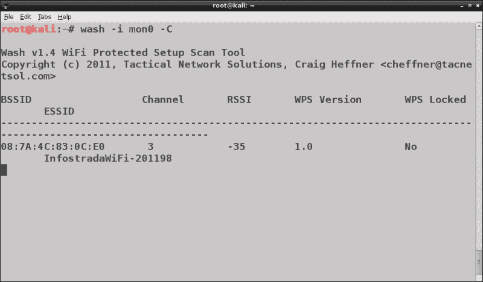

Wash 显示了有关检测到的 AP 的信息，如 BSSID、信道、使用的 WPS 版本、WPS 是否被锁定以及 ESSID。

1.  我们选择目标 AP 并运行 Reaver 来恢复 WPS PIN：

```
reaver -i mon0 -b 08:7A:4C:83:0C:E0

```

这里，`-b`选项指定了 AP 的 MAC 地址。


Reaver 尝试每个 PIN 的可能组合并等待响应，因此通常需要几个小时才能完成攻击，即使 PIN 的可能组合并不多。

要执行离线 Pixie Dust 攻击，我们必须使用 reaver-wps-fork-t6x 版本，对应于 Reaver 的 1.5.2 版本。这个版本需要 Pixiewps，建议升级到最新版本（写作时）的 Aircrack-ng，即 1.2 RC2。更新的 Reaver、pixiewps 和更新的 Aircrack-ng 都可以在 Kali Linux 存储库中找到。

我们按照以下步骤进行：

1.  我们使用以下命令升级软件：

```
apt-get install aircrack-ng reaver

```

注意，pixiewps 也作为一个依赖项安装。

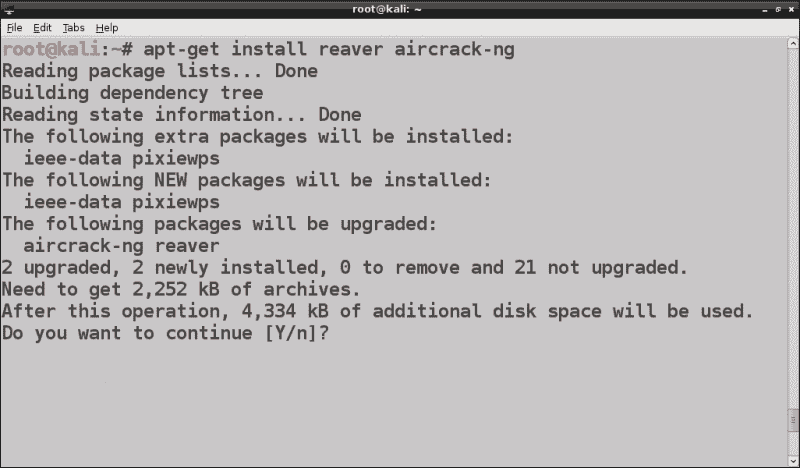

1.  然后我们使用`airmon-ng start wlan0`将无线接口置于监视模式：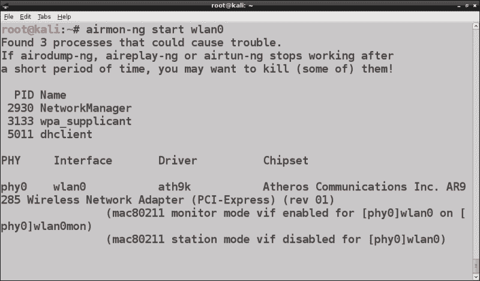

我们可以观察到虚拟监视接口的名称是`wlanXmon`，而不是新版本的 Aircrack-ng 中的`monX`。

1.  要执行攻击，我们运行以下命令：

```
reaver -i wlan0mon -b 08:7A:4C:83:0C:E0 -vvv -K 1

```

这里的`-i`选项指定了我们的监视接口，`-b`指定了 AP 的 MAC 地址，`-vvv`是最详细的输出模式，`-K 1`指定了 Pixie Dust 攻击。


在下面的截图中，我们注意到 pixiewps 被调用并立即发现 PIN：


Pixie Dust 攻击展示了如何轻松快速地恢复 WPS PIN，因此强烈建议禁用 WPS。

# 攻击 WPA-Enterprise

WPA-Enterprise，顾名思义，是企业网络中使用的认证模式。

在 WPA-Enterprise 中，AP 不像 WPA-Personal 模式那样对客户端进行认证，而是委托给一个通过 RADIUS 协议与 AP 通信的**认证服务器**（**AS**）。

AP 和 AS 之间交换的认证数据包使用**可扩展认证协议**（**EAP**）和特别是**EAP Over LAN**（**EAPOL**）进行传输，EAPOL 是 802.1x 标准中定义的用于有线局域网认证的协议。AP（认证器）充当中继，转发两方之间的认证数据包，即客户端（请求者）和 AS。

EAP 是一个认证框架，而不是单一协议，有许多类型，其中最重要的是：

+   **轻量级 EAP**（**LEAP**）

+   EAP-MD5

+   EAP-TLS

+   EAP-FAST

+   EAP-TTLS

+   PEAP

最后三个是企业网络中使用的最常见的 EAP 类型。认证过程通过 EAP 握手进行，如下图所示的 EAP-TLS：


LEAP 和 EAP-MD5 已经被弃用，因为它们容易受到暴力和字典攻击的影响，并且不验证认证服务器的证书。

LEAP 基于 MS-CHAPv2，这是一种挑战-响应协议，以明文形式传输认证数据，允许攻击者检索并发动暴力攻击以获取凭据。

EAP-MD5 也容易受到离线字典和暴力攻击的影响。

EAP-TLS 是最初的 WPA-Enterprise 标准认证协议，因为它依赖于**传输层安全性**（**TLS**），所以它是安全的。除了服务器端证书外，TLS 还需要客户端证书验证，因此组织需要部署**公钥基础设施**（**PKI**）来管理用户的证书。

这阻止了 EAP-TLS 在 WPA-Enterprise 实现中变得普遍，为 EAP-FAST、EAP-TTLS 和尤其是 PEAP 的采用留下了空间，这些协议不需要验证客户端的证书，但仍然安全，因为它们基于 TLS。

事实上，这些协议使用 TLS 隧道封装内部认证协议。例如，在 Microsoft Windows 实现中，PEAP 使用 MS-CHAPv2，如 LEAP，但封装在 TLS 隧道中。

以下表总结了 EAP 认证类型及其主要特点：


在接下来的章节中，我们将看到对 WPA-Enterprise 的攻击的实际示例。

## 设置 WPA-Enterprise 网络

为了看到攻击是如何在实践中工作的，我们将不得不配置我们的接入点使用 WPA-Enterprise 并设置 RADIUS 服务器。

由于许多消费者 AP 不支持 WPA-Enterprise，并且设置 RADIUS 服务器是一项繁琐的操作，一个实际的解决方案是安装**hostapd-wpe**（**hostapd Wireless Pwnage Edition**），这是**hostapd**工具的补丁版本，允许我们在无线接口上创建虚拟 AP。

Hostapd-wpe 由 Joshua Wright（Cowpatty 的作者和其他无线安全工具）和 Brad Antoniewicz 开发，配备了捆绑的 FreeRADIUS-WPE 服务器，这是 FreeRADIUS 服务器的补丁，大大简化了其配置。

Hostapd-wpe 最近取代了 FreeRADIUS-WPE 项目本身。它没有预装在 Kali Linux 上，所以我们需要下载并安装它。

为了设置一个虚拟的 WPA-Enterprise 启用的 AP，我们将执行以下步骤：

1.  我们首先安装必要的库：

```
apt-get update; apt-get install libssl-dev libnl-dev

```

hostapd 的最新版本是 2.4，但我们必须下载并安装 2.2 版本，因为`hostapd-wpe`补丁只支持这个版本（在撰写本书时）。我们使用以下命令下载 hostapd：

```
wget http://w1.fi/releases/hostapd-2.2.tar.gz

```

1.  接下来，我们从其 Git 存储库下载`hostapd-wpe`补丁：

```
git clone https://github.com/OpenSecurityResearch/hostapd-wpe

```

1.  我们解压 hostapd tar 存档并进入提取的目录：

```
tar -xzf hostapd-2.2.tar.gz; cd hostapd-2.2

```

1.  现在，我们必须应用`hostapd-wpe`补丁：

```
patch -p1 < ../hostapd-wpe/hostapd-wpe.patch

```

1.  我们进入`hostapd`目录并编译：

```
cd hostapd; make

```

1.  编译完成后，我们进入`certificate`目录并运行引导脚本以生成自签名证书：

```
cd ../../hostapd-wpe/certs; ./bootstrap

```

1.  在执行`hostapd-wpe`之前，我们必须编辑其配置文件`hostapd-wpe.conf`，位于`hostapd-2.2/hostapd`目录中。我们必须在`# Interface`部分中设置`interface=wlan0`，在`#Driver`部分中注释掉`driver=wired`行，并取消注释`802.11 Options`，指定我们想要 AP 使用的 SSID。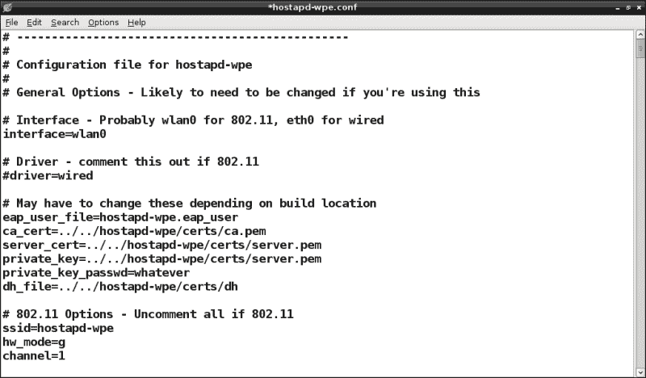

1.  一旦我们保存了配置文件，我们可以使用以下命令运行程序：

```
./hostapd-wpe hostapd-wpe.conf

```

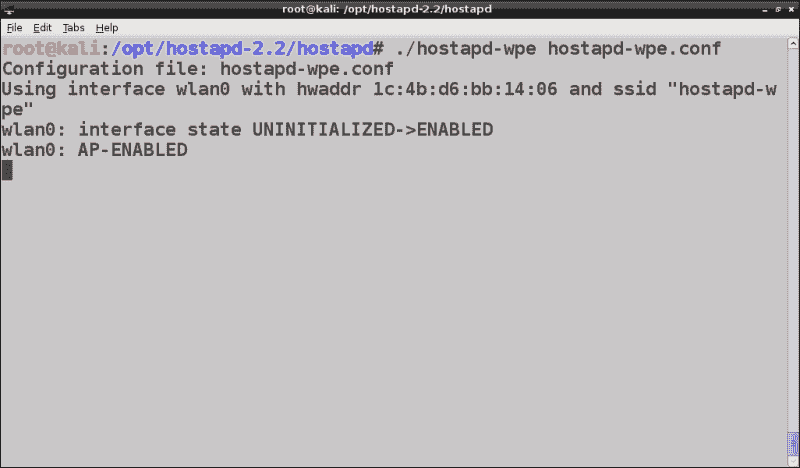

现在我们已经设置好了我们的 WPA-企业网络，我们准备攻击 EAP。

## 针对 EAP 的攻击

要执行对 EAP 的攻击，我们执行以下步骤：

1.  首先，我们需要使用`airodump-ng`来捕获 EAP 握手，这与我们在上一章中捕获 WPA 四路握手的方式相同：

```
airodump-ng --channel <nr> --bssid <AP_MAC_ADDR> --write eap_crack mon0

```

1.  要攻击特定的 EAP 实现，我们必须确定正在使用的 EAP 类型。Airodump-ng 不会告诉我们 EAP 类型，因此我们必须使用 Wireshark 等数据包分析工具分析捕获的 EAP 握手数据包。

要运行它，我们导航到应用程序菜单，**Kali Linux** | **嗅探/欺骗** | **网络嗅探器** | **Wireshark**。

1.  我们打开我们的捕获文件，应该看到一个如下截图所示的窗口：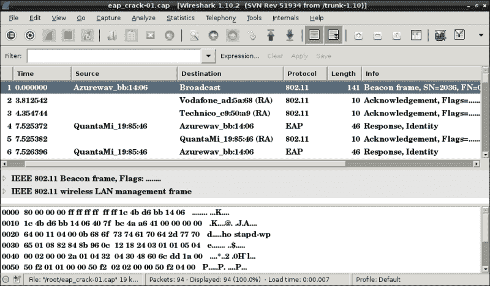

1.  我们使用表达式`eap`过滤数据包，只显示我们感兴趣的数据包：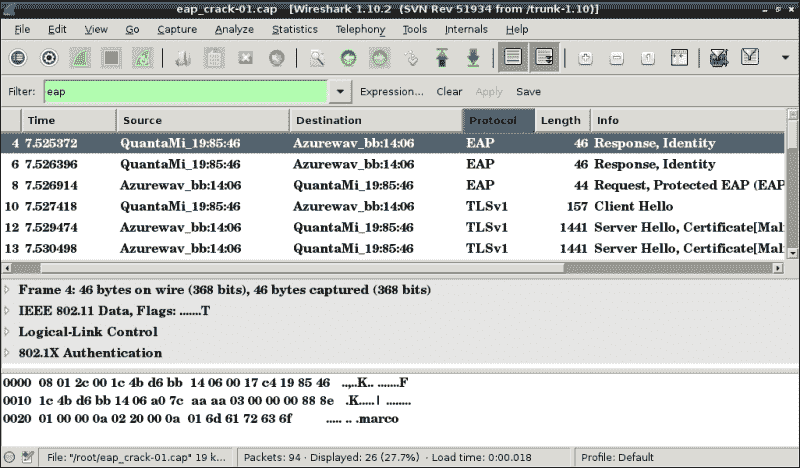

1.  在数据包列表面板中向下滚动，我们会注意到**信息**列中的 EAP 握手数据包，如下截图所示：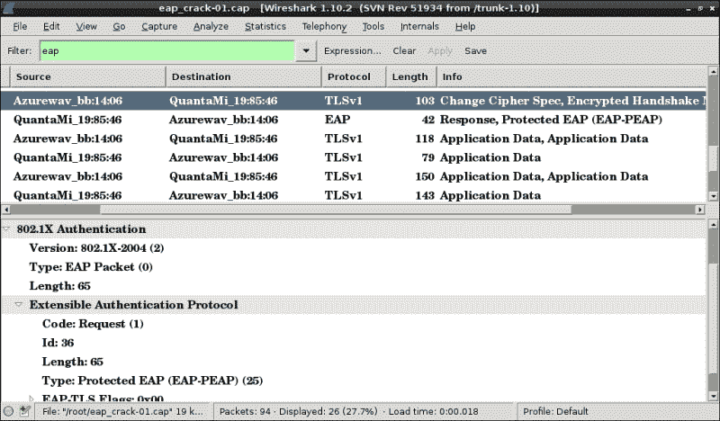

1.  现在我们已经发现了 EAP 类型，接下来我们可以进行攻击。如果认证服务器使用 LEAP 或 EAP-MD5，那么我们可以使用两个分别实现这些攻击的工具：`asleap`和`eapmd5pass`，这两个工具都是由 Joshua Wright 开发的。

要使用 asleap，我们必须使用`genkeys`工具从字典文件生成哈希表：

```
genkeys -r wordlist.txt -f wordlist.hash -n wordlist.idx

```

然后，将哈希表和捕获文件一起传递给`asleap`：

```
asleap -r eap_crack-01.cap -f wordlist.hash -n wordlist.idx

```

`Eapmd5pass`的工作方式类似，它将捕获文件和字典文件作为输入参数。

只有当攻击者拥有客户端的私钥并且因此冒充客户端向认证服务器时，EAP-TLS 才会有漏洞。

如果客户端不验证认证服务器的证书，PEAP 和 EAP-TTLS 可能会受到攻击。攻击者可以建立一个假的 AP 并冒充合法的 AP，从而破坏 TLS 加密隧道，让他攻击内部认证协议。

在下一小节中，我们将以 PEAP 为例进行介绍，因为它是部署最广泛的 EAP 类型。

### 攻击 PEAP

在这个例子中，我们使用一个默认支持 PEAP 和 MS-CHAPv2 的 Windows 客户端机器。

1.  要连接到我们之前创建的虚拟 AP，我们必须在**控制面板** | **网络和互联网** | **网络和共享中心** | **管理无线网络**中手动添加一个无线连接。

我们选择**手动创建网络配置文件**，然后输入我们 AP 的 SSID（`hostapd-wpe`）作为网络名称，并选择**WPA-Enterprise**作为安全类型：

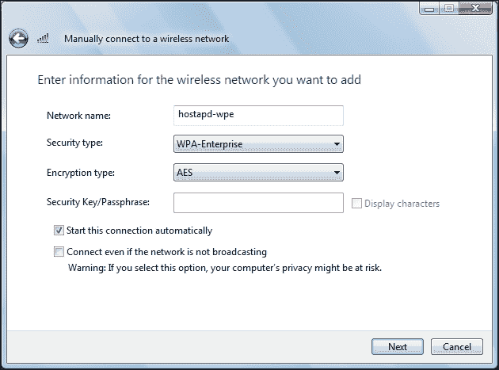

1.  在随后的窗口中，我们点击**更改连接**设置，然后点击**安全**选项卡和**设置…**：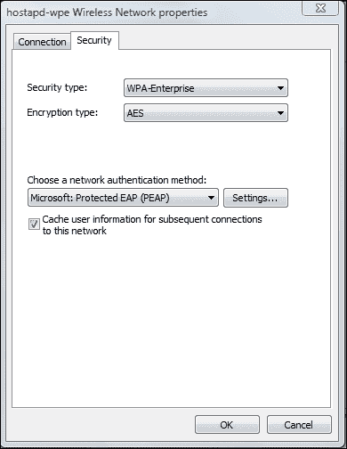

1.  我们取消选中**验证服务器证书**选项，以禁用客户端对服务器证书的验证：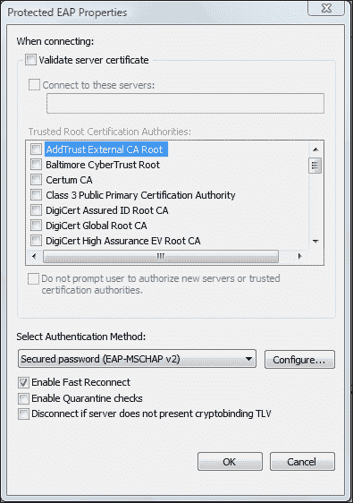

1.  我们将 EAP-MSCHAPv2 作为认证方法，点击**配置…**按钮，然后取消选中**Windows 域登录认证**选项。

1.  接下来，我们使用以下命令在 Kali Linux 机器上启动`hostapd-wpe`：

```
hostapd-wpe hostapd-wpe.conf

```

正如我们所见，这个命令启动了一个以`hostapd-wpe`作为 SSID 的 AP。

1.  我们将 Windows 客户端连接到`hostapd-wpe`网络，然后提示我们输入用户名和密码。在这种情况下，我们可以输入任何我们想要的凭据，只是为了演示攻击。这里的密码是`my_eap_password`：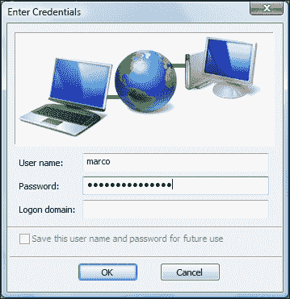

1.  在`hostapd-wpe`终端窗口日志中，我们可以观察到这个认证尝试，包括 MSCHAPv2 协议的挑战和响应：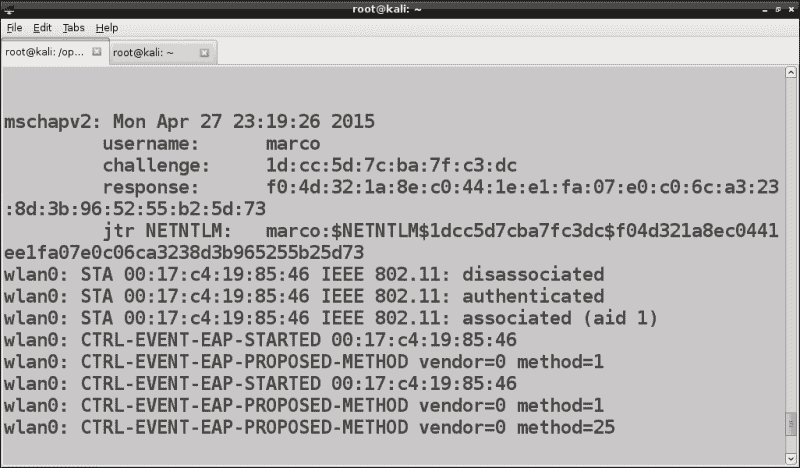

1.  这就是我们启动使用`asleap`进行离线字典攻击所需要的一切，通过使用`-C`和`-R`选项将挑战和响应传递给程序：

```
asleap -C 1d:cc:5d:7c:ba:7f:c3:dc -R f0:4d:32:1a:8e:c0:44:1e:e1:fa:07:e0:c0:6c:a3:23:8d:3b:96:52:55 :b2:5d:73 -W wordlist.txt

```

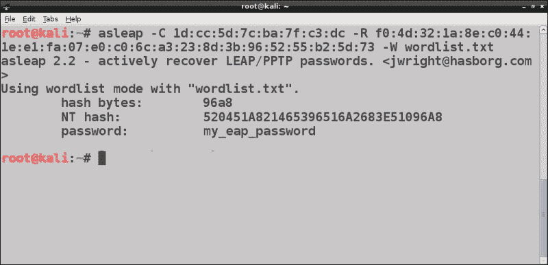

# 拒绝服务攻击

无线网络可能会受到针对客户端和 AP 的**拒绝服务**（**DoS**）攻击。

通过不断发送广播去认证数据包来强制断开连接并阻止客户端重新连接，从而执行这种攻击。

使用`aireplay-ng`工具来完成这个任务，命令如下：

```
aireplay-ng --deauth 0 -a 08:7A:4C:83:0C:E0 mon0

```


在这个命令中，`0`选项表示持续发送去认证数据包，只指定了 AP 的 MAC 地址，使用了`-a`选项。我们也可以针对单个无线客户端进行攻击，就像我们将在第七章中看到的那样，*无线客户端攻击*。

在下一小节中，我们将介绍另一个工具来对无线网络执行 DoS 攻击，MDK3。

## 使用 MDK3 进行 DoS 攻击

MDK3 支持以下模式来执行针对无线网络的 DoS 攻击：

+   信标（SSID）洪泛模式

+   认证 DoS

+   去认证/去关联（Amok）模式

在这里，`b`选项是信标洪泛模式，`-f`指定一个包含要用于 AP 的 SSID 名称列表的文件。如果未指定`-f`选项，则使用随机的 SSID。如果我们想使用特定的信道，我们需要使用`-c`选项：

要使用 MDK3，我们首先需要使用`airmon-ng start wlan0`命令将无线接口置于监视模式。

要运行信标洪泛攻击，我们执行以下命令：

```
mdk3 mon0 b -f SSIDs

```

在信标洪泛模式中，MDK3 发送一系列信标帧，广告虚假的 AP。这种方法主要不是为了 DoS 攻击而设计的，但有时可能会导致网络扫描程序和无线适配器的驱动程序崩溃，从而阻止客户端连接到网络。此外，它可以将合法的 AP 隐藏在众多的虚假 AP 中，最终具有非常相似的 SSID，使客户端难以识别他们想要连接的合法网络。


认证洪泛模式意味着向 AP 发送许多认证请求，这可能会导致 AP 无法处理这些请求并因此冻结。这并不总是有效，可能需要多个 MDK3 实例才能成功执行此攻击。

在这种情况下，命令的语法很简单：

```
mdk3 mon0 a -a 08:7A:4C:83:0C:E0

```

这里`a`代表认证洪泛模式，`-a`指定目标 AP 的 MAC 地址：


我们注意到目标 AP 似乎不容易受到这种攻击方法的影响。

DoS 攻击最有效的方法是去认证/去关联（Amok）模式，它发送去认证帧以断开客户端与 AP 的连接。要使用`mdk3`执行此攻击，我们首先将我们的目标 AP 的 MAC 地址保存在黑名单文件中。然后，我们运行以下命令：

```
mdk3 mon0 d -b blacklist_file

```

在这里，`d`显然是去认证/去关联模式，`-b`选项指定要使用的黑名单文件，这里只包含一个目标 AP：

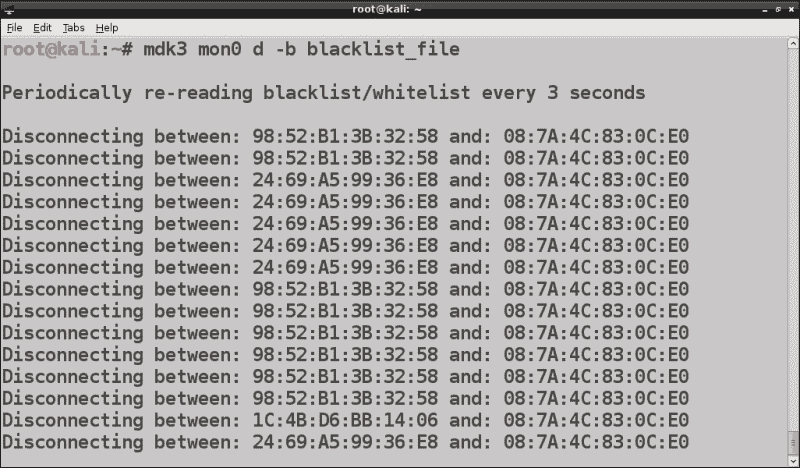

# Rogue 访问点

到目前为止，我们已经介绍了针对无线网络的未经身份验证的攻击，以破解 WEP 或 WPA 密钥，攻击 WPA-Enterprise，恢复 WPS PIN，并获得对这些网络的访问权限。

在这一部分，我们将介绍一种攻击，假设攻击者（内部人员或外部人员）正在控制已连接到有线 LAN 的机器：Rogue 访问点。

事实上，Rogue AP 是未经授权安装在 LAN 上的接入点，可以被攻击者用作网络的后门。

Rogue AP 可以通过物理方式或软件（软 AP）安装。物理 AP 的安装涉及违反网络的物理安全策略，更容易被识别。我们将看到如何安装一个 Rogue 软 AP 并将其桥接到有线 LAN。

我们可以使用`hostapd-wpe`来完成这个任务，但是这里我们使用 Aircrack-ng 套件中的一个工具`airbase-ng`。

我们使用 airmon-ng 将无线接口设置为监视模式，并运行以下命令：

```
airbase-ng --essid Rogue-AP -c 1 mon0

```

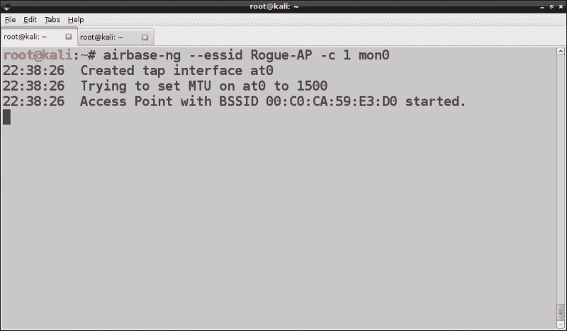

我们注意到创建了一个 tap 接口`at0`。为了能够通信，我们必须在恶意 AP 和有线网络之间创建一个桥接，因此在`at0`和以太网（`eth0`）接口之间。

为此，我们安装`bridge-utils`实用程序：

```
apt-get install bridge-utils

```

我们使用名称`bridge-if`创建桥接接口：

```
brctl addbr bridge-if

```

然后，我们将`at0`和`eth0`接口连接到`bridge-if`：

```
brctl addif bridge-if eth0; brctl addif bridge-if at0

```

我们使用以下命令启动接口：

```
ifconfig eth0 0.0.0.0 up; ifconfig at0 0.0.0.0 up

```

我们还需要启用内核级 IP 转发，因为恶意 AP 充当无线和有线网络之间的路由器：

```
sysctl -w net.ipv4.ip_forward=1

```

否则，我们执行以下命令，具有相同的效果：

```
echo 1 > /proc/sys/net/ipv4/ip_forward

```

当客户端连接到恶意 AP 时，`airbase-ng`会在其日志中显示。

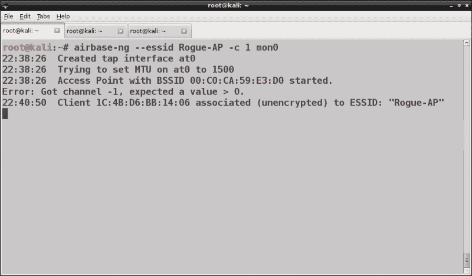

运行`airodump-ng`，我们可以看到我们的恶意 AP 的详细信息：

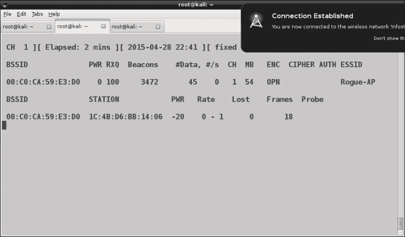

认证类型是开放的，因此没有认证和加密，通常恶意 AP 默认设置。这可以使 AP 很容易被检测到，因为开放的无线网络立即引起渗透测试人员或网络管理员的注意。

恶意 AP 也可以设置为使用 WEP 或 WPA/WPA2。例如，要使用 WPA2-CCMP 运行 AP，我们将执行以下命令：

```
airbase-ng --essid Rogue-AP -c 1 -Z 4 mon0

```

这里，`-Z`选项是用于 WPA2（`-z`用于 WPA），值`4`是用于 CCMP。

在下面的截图中，我们可以看到`airodump-ng`的输出：

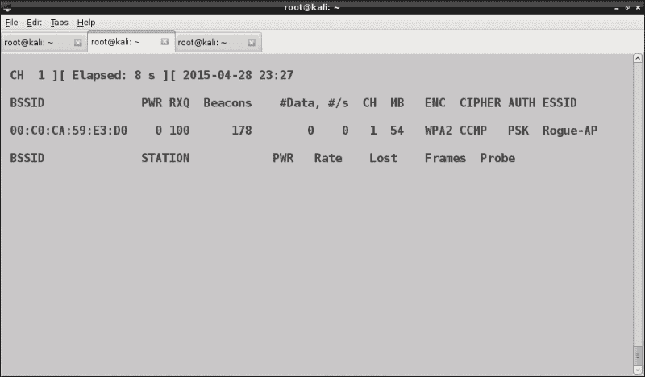

我们还可以通过使用`-X`选项而不是`–essid`选项来启动隐藏的恶意 AP，运行`airbase-ng`：

```
airbase-ng -X -c 1 mon0

```

恶意 AP 对网络安全构成严重威胁，因为它们允许未经授权访问网络，绕过防火墙和 IDS 等安全系统。事实上，连接到恶意 AP 的攻击者可以对本地网络、服务器和连接的客户端发动攻击。攻击者还可以创建一个恶意 AP 来冒充合法 AP，并对无线客户端进行中间人攻击，我们将在下一章中看到。

# 攻击 AP 身份验证凭据

家用路由器和 AP 提供了一个 Web 管理面板，用于配置通常无法从互联网访问但只能从本地网络访问的设备。

一个可能看起来是原子的安全方面，但通常不被认为足够重要的是默认的身份验证凭据。

通常的做法是不更改访问 AP 管理界面的默认用户名和密码，许多型号预先配置了诸如 admin/admin 之类的弱凭据。在网络上，可以找到带有相关默认凭据的 AP 和路由器型号列表。即使默认凭据被修改，通常也会选择弱密码。

这是一个严重的安全问题，因为如果攻击者控制了 AP，他/她可以通过在网络上执行中间人攻击、嗅探流量、更改 DNS 设置和发动药物和钓鱼攻击来危害整个网络。

可以用于破解 HTTP 身份验证凭据的工具是**hydra**，这是一个支持各种协议的在线密码破解工具。该程序还有一个 GUI 版本，名为 hydra-gtk。这两者都已安装在 Kali Linux 上。

Hydra 接受用户名或用户名列表和密码列表作为输入，并尝试所有可能的组合来攻击指定的目标。

要了解有关 Hydra 及其如何使用它来破解密码的更多信息，请参阅手册页面和项目网站[`www.thc.org/thc-hydra/`](https://www.thc.org/thc-hydra/)。

近年来，已经开发出了一些攻击，允许甚至从互联网访问路由器/AP 的管理面板。其中一个例子是**DNS 重绑定**攻击，攻击者滥用 DNS 向受害者的浏览器提供恶意的客户端脚本，针对内部网络。因此，浏览器对攻击者来说就像是内部代理，用来攻击和控制路由器/AP。这种类型的攻击在近年来变得广泛。

一个实施 DNS 重绑定攻击的工具被称为**rebind**，由 Craig Heffner 编写并包含在 Kali Linux 中。关于它的更多信息可以在程序网页[`code.google.com/p/rebind/`](https://code.google.com/p/rebind/)上找到。要了解攻击的细节，请阅读 Heffner 的白皮书*远程攻击 SOHO 路由器*[`media.blackhat.com/bh-us-10/whitepapers/Heffner/BlackHat-USA-2010-Heffner-How-to-Hack-Millions-of-Routers-wp.pdf`](https://media.blackhat.com/bh-us-10/whitepapers/Heffner/BlackHat-USA-2010-Heffner-How-to-Hack-Millions-of-Routers-wp.pdf)。

# 总结

在本章中，我们已经涵盖了针对接入点和网络的攻击，特别是针对 WPS 和 WPA-Enterprise 的攻击，以及如何设置一个伪造的 AP，DoS 攻击和 AP 认证攻击。

在第七章*无线客户端攻击*中，我们将看到针对无线客户端的攻击，比如蜜罐和恶意双子 AP，Caffe Latte 和 Hirte 攻击，中间人攻击和客户端去认证。
