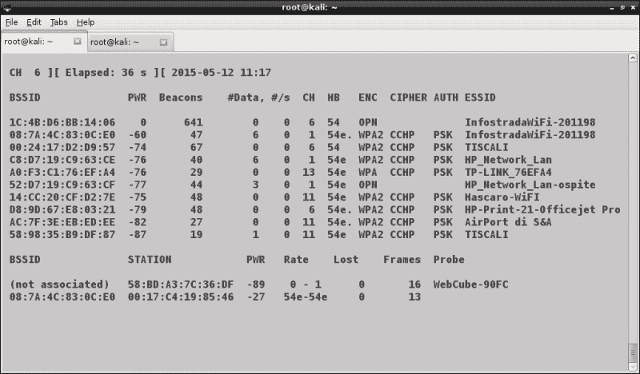
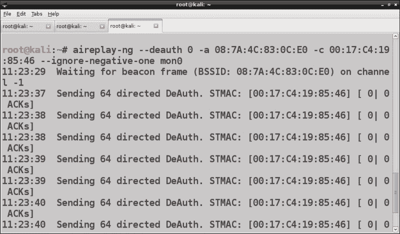
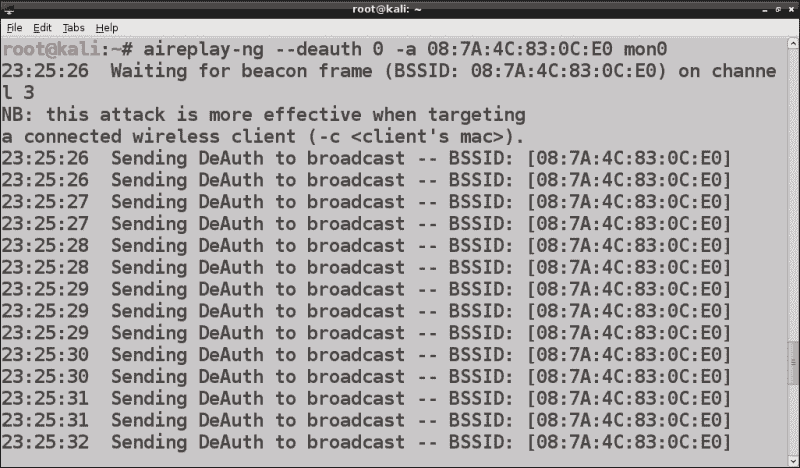
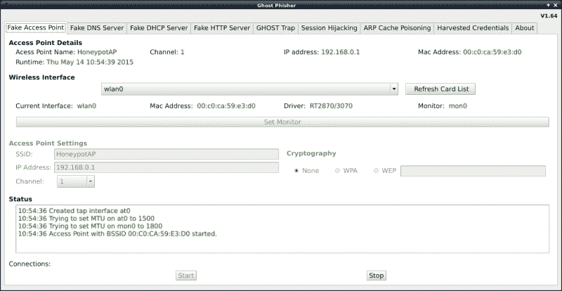
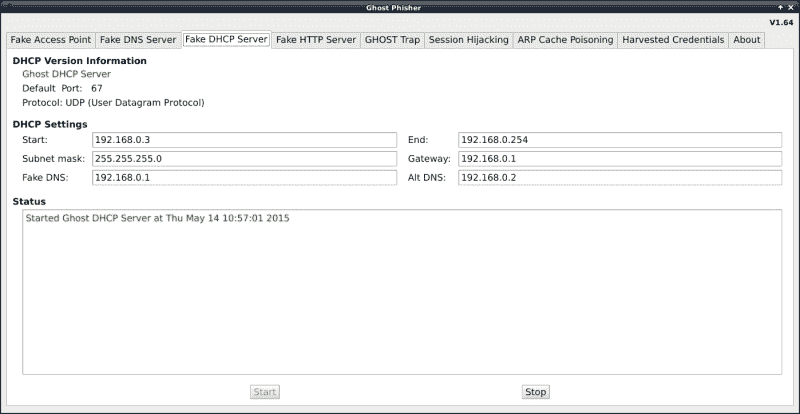
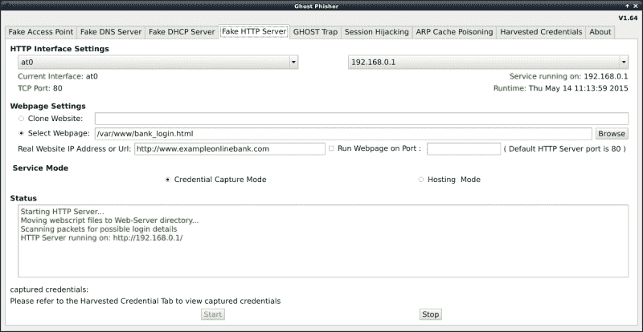
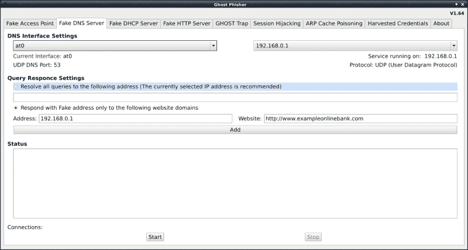
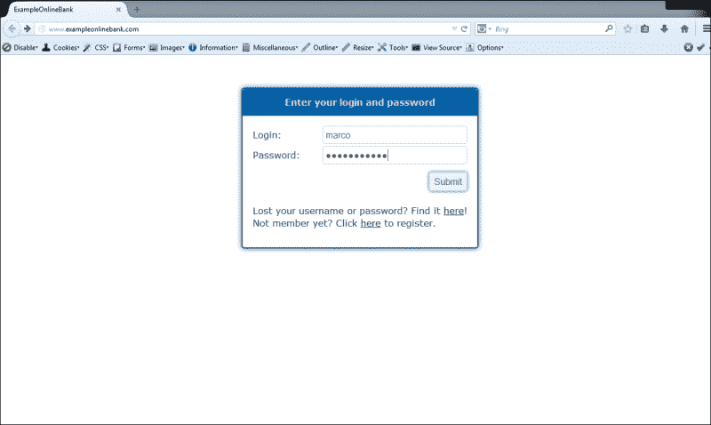
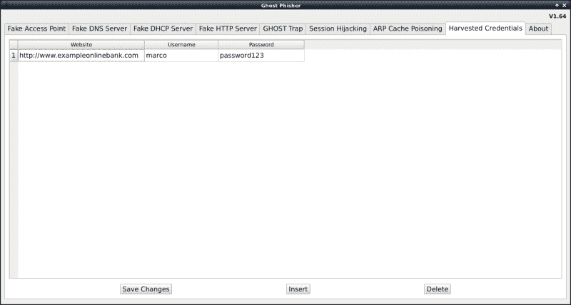
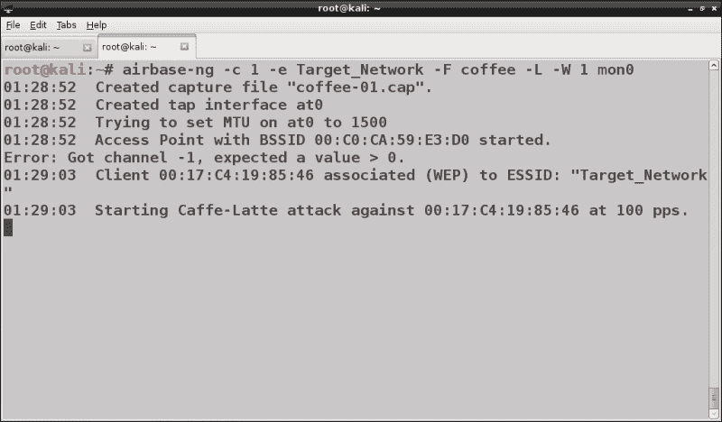

# 第七章：无线客户端攻击

到目前为止，我们已经涵盖了针对 WEP 和 WPA/WPA2 协议、接入点和网络基础设施的攻击。在本章中，我们将讨论针对客户端的攻击，无论它们是否连接到 Wi-Fi 网络。本章将涵盖以下主题：

+   蜜罐接入点和 Evil Twin 攻击

+   中间人攻击

+   Caffe Latte 和 Hirte 攻击

+   无需 AP 即可破解 WPA 密钥

# 蜜罐接入点和 Evil Twin 攻击

在上一章中，我们已经看到了如何设置一个属于本地有线网络的恶意接入点。攻击者还可以设置一个看似合法但未连接到本地网络的假 AP。这种 AP 被称为**蜜罐**AP，因为它诱使客户端与其关联。模拟真实 AP 的蜜罐 AP，站在其附近，可用于进行所谓的**Evil Twin**攻击。事实上，蜜罐 AP 伪造了真实 AP 的 SSID（以及可能的 MAC 地址），在发送的信标帧中进行广告。无线客户端的操作系统通常会跟踪客户端过去连接过的网络。当客户端在这些网络的范围内且信号足够强时，客户端可以配置为自动连接到这些网络。因此，如果假 AP 比合法 AP 更接近客户端，因此其信号更强，那么前者就会胜过后者，客户端会连接到前者。

客户端无法对 AP 进行身份验证，因为 802.11 管理帧没有加密签名。使用 WEP 或 WPA-PSK 用于对客户端进行身份验证，并在关联发生后加密交换的数据，但不对服务器进行客户端身份验证。

即使启用了 WPA-Enterprise 的 AP 也可能受到这种攻击的影响，因为客户端通常配置为不检查认证服务器证书，正如我们在上一章中所看到的。

此外，这些证书与网络 SSID 没有紧密绑定，攻击者可以设置其认证服务器并向客户端呈现看似合法的证书。为此，攻击者可以注册一个类似于目标网络的域名，并从认证机构获取有效证书。

这种技术也被用于针对 WPA-Enterprise 网络的 Evil Twin 攻击的变种，该攻击在研究论文中有描述，可在[`seclab.ccs.neu.edu/static/publications/ndss2013wpa.pdf`](http://seclab.ccs.neu.edu/static/publications/ndss2013wpa.pdf)找到。

### 注意

**Multipot 攻击**

另一个有趣的 Evil Twin 攻击变种是所谓的 Multipot 攻击，由 K.N. Gopinath 在 2007 年的 Defcon 15 会议上提出，其中使用多个蜜罐 AP 来进行攻击。演示的相关白皮书和演示文稿（以及音频和视频）可在[`www.defcon.org/html/links/dc-archives/dc-15-archive.html#Gopinath`](https://www.defcon.org/html/links/dc-archives/dc-15-archive.html#Gopinath)上找到。

在下一小节中，我们将看到如何设置蜜罐 AP 并使用 aircrack-ng 套件进行 Evil Twin 攻击。

## 实践中的 Evil Twin 攻击

在创建蜜罐 AP 之前，我们假设已经进行了侦察阶段，并识别了连接的 AP 和客户端，遵循第三章中介绍的方法，*WLAN 侦察*。

一旦我们选择了要模拟的目标 AP，我们就在新的终端模拟器窗口中使用相同的 SSID 设置我们的蜜罐 AP，运行 airbase-ng：

```
airbase-ng --essid InfostradaWiFi-201198 -c 1 mon0

```

请注意，`--essid`选项定义了我们 AP 的 SSID，`-c`选项定义了它使用的信道。


在`airodump-ng`输出窗口中，我们可以看到我们的两个双胞胎 AP，具有相同的 SSID：



我们可以通过使用的加密类型（虚假 AP 使用开放认证）、信道和其他字段（如信标和数据包传输）以及信号功率水平（`Pwr`）来区分它们。`Pwr`字段的较低负值意味着更高的信号水平。蜜罐 AP 的信号水平应该高于真实 AP 的信号水平，以吸引客户端连接。

如果当前没有客户端连接到合法的 AP，我们需要等待客户端连接到虚假 AP，同时相信连接到真实 AP。

如果客户端已经连接，我们可以使用`aireplay-ng`工具强制其从网络中注销：

```
aireplay-ng --deauth 0 -a 08:7A:4C:83:0C:E0 -c 00:17:C4:19:85:46 -- ignore-negative-one mon0

```

这个命令也可以用来对目标客户端进行 DoS 攻击：



如果有更多的客户端连接，我们可以发送广播去认证数据包，将所有客户端从网络中断开：

```
aireplay-ng --deauth 0 -a 08:7A:4C:83:0C:E0 mon0

```



在下面的屏幕截图中，我们可以看到客户端再次重新连接到蜜罐 AP，这意味着我们成功了：


在接下来的部分，我们将看到如何对连接到蜜罐 AP 的客户端进行中间人攻击。

# 中间人攻击

**中间人**（**MITM**）攻击是一种攻击，攻击者在两个通信方之间插入自己，通常（但不一定）是客户端和服务器，并透明地中继交换的消息，使双方相信他们直接在交谈。

在我们的情况下，中间人攻击是一个蜜罐软件 AP，诱使客户端连接到它，相信它是合法的。这样，客户端发送和接收的所有网络流量都通过虚假 AP，并且攻击者可以窃听和操纵它，获取密码和敏感信息，更改数据，并劫持会话。

例如，攻击者可以使用网络嗅探器如 tcpdump、Wireshark 和**Ettercap**来窃听和嗅探流量。Ettercap 不仅是一个嗅探器，还是一个用于发动中间人攻击的工具，提供了 GUI 并支持许多网络协议。有关更多信息，请参阅附录，*参考资料*或手册页（`man ettercap`）。

典型的中间人攻击是通过 ARP 缓存投毒、DNS 欺骗和会话劫持进行的。例如，通过 DNS 欺骗，攻击者可以将用户重定向到一个克隆的网站，并欺骗他们输入他们的凭据。

此外，如果攻击者利用类似于 OpenSSL 中的 CVE-2014-0224 的漏洞或向客户端呈现一个虚假证书，即使客户端浏览器显示警告，也可以攻击 TLS 加密会话。

为了使蜜罐 AP 充当无线客户端和有线网络和/或互联网之间的路由器，我们必须创建一个桥接接口并启用 IP 转发，按照第六章中描述的相同过程，*攻击访问点和基础设施*，来设置一个恶意 AP。

Kali Linux 提供了许多用于进行中间人攻击的工具，如`arpspoof`、`dnsspoof`、`ettercap`、`burp suite`、`urlsnarf`、`driftnet`和`webmitm`。

Kali Linux 还提供了一个用于中间人攻击的全功能图形程序，名为**Ghost-phisher**。

## Ghost phisher

Ghost phisher 是一个用 Python 编写的 GUI 程序，提供各种功能来执行中间人攻击，包括设置蜜罐 AP 和虚假网络服务（HTTP、DNS 和 DHCP）、会话劫持、ARP 欺骗和密码收集。

该程序易于使用且直观。要启动它，我们在终端中执行 ghost-phisher 命令。程序窗口分为不同的选项卡，每个选项卡用于不同的功能，并且每个选项卡包括顶部的配置部分和底部的状态部分。

要执行中间人攻击，我们可以执行以下步骤：

1.  第一个选项卡窗口与虚假 AP 设置有关。在**无线接口**部分，我们可以选择要使用的接口，然后通过单击下面的**设置监视器**按钮将其置于监视模式：

1.  在**访问点设置**中，我们为诱饵 AP 分配 SSID、有效的私有 IP 地址（例如 192.168.0.1）、信道和加密类型。

然后，我们单击**开始**按钮，AP 正在运行，因为**状态**窗格向我们显示：



1.  然后，我们使用类 C 网络 IP 分配范围（在我们的情况下为 192.168.0.2 到 192.168.0.254）启动虚假 DHCP 服务器，将 AP（`192.168.0.1`）的 IP 设置为网关和虚假 DNS 服务器。因此，当客户端连接到 AP 时，它将被分配在此范围内的 IP 地址。

1.  我们设置了一个虚假的 HTTP 服务器，用于托管合法网站的克隆页面，客户端打算登录，例如，访问他/她的在线银行账户。在这种情况下，我们可以指定客户端访问虚构网站`www.exampleonlinebank.com`时要显示的网页：

1.  然后，是虚假 DNS 服务器的时间，它将此特定域的客户端查询解析为我们 AP 的 IP 地址。

1.  点击**添加**按钮，使用虚假 AP（`192.168.0.1`）的 IP 地址来解析目标域`www.exampleonlinebank.com`。我们还可以将其他目标域名添加到此 IP 地址以及攻击者控制的主机的 IP 地址进行解析。

1.  当客户端连接到上述网站时，它会看到一个伪造的登录页面，类似于合法网站上的页面：

1.  用户输入的凭证被虚假 HTTP 服务器抓取，并显示在**收集的凭证**选项卡窗口中，如下面的屏幕截图所示：

收集的凭证存储在 SQLite 数据库中，位于`/usr/share/ghost-phisher/Ghost-Phisher-Database`下。

这种攻击的另一个例子可能是为真实 AP 的 Web 管理面板设置一个虚假的身份验证页面，以便连接到虚假 AP 的网络管理员被重定向到此页面并透露身份验证凭据。

值得强调的是，这些攻击以及书中描述的所有攻击，如果未经网络所有者的书面和明确许可，都是非法的！

# Caffe Latte 攻击

在第四章中，*WEP 破解*，我们介绍了当客户端连接到 AP 时如何破解 WEP 密钥，注入 ARP 请求数据包并捕获生成的流量以收集一致数量的 IV，然后发起统计攻击来破解密钥。

两位无线安全研究人员 Vivek Ramachandran 和 MD Sohail Ahmad 在 Toorcon 2007 会议上提出了一种名为**Caffe Latte**的新攻击，允许您即使客户端未连接并且远离网络，也可以检索 WEP 密钥。

这种攻击被命名为 Caffe Latte，因为作者证明完成它所需的时间（几乎）与在咖啡店或餐厅喝一杯咖啡的时间一样短（这两个地方是这种攻击的经典场所）！

要执行攻击，我们必须诱使孤立的客户端生成足够的加密 WEP 数据包。诸如 Windows 之类的操作系统会将 WEP 共享密钥与相关网络详细信息一起缓存到**首选网络列表**（**PNL**）中，以便自动连接到这些网络。

客户端发送对其 PNL 中网络的探测请求。如果我们嗅探这些探测请求，我们可以确定网络的 SSID，并设置一个具有相同 SSID 的虚假 AP，向客户端发送探测响应。即使后者不知道密钥，客户端也会与此 AP 关联，因为 WEP 协议不要求 AP 对客户端进行身份验证。

一旦客户端关联，它将被分配一个 IP 地址，可以是静态分配或通过 DHCP 动态分配。如果没有 DHCP 服务器或者服务器未能响应，Windows 会为客户端分配一个来自 169.254.0.0/16 子网范围的 IP 地址。客户端开始发送一些伪造的 ARP 数据包，显然是使用 WEP 密钥加密的。为了破解密钥，我们需要强制客户端持续发送这些数据包，直到我们收集到足够数量的数据包（对于 PTW 攻击大约为 80,000 个）。一种做法是反复取消客户端的认证，但这需要相当长的时间。

Caffe Latte 攻击提供了一个更有效的解决方案，捕获这些伪造的 ARP 数据包，并翻转适当的位以修改数据包中固定位置的发送者 MAC 和 IP 地址。

这些伪造的 ARP 数据包被转换为 ARP 请求，不断地发送回客户端。这是可能的，因为 WEP 数据包的完整性没有得到加密保护，攻击者可以修改有效载荷和 CRC，从而创建一个仍然有效的加密数据包。

这样，客户端将响应这些 ARP 请求并快速生成流量，加快密钥破解过程。有关 Caffe Latte 攻击的更多细节，请参考附录中提供的链接，*参考资料*。

现在我们已经了解了攻击的理论，我们可以看看如何使用 aircrack-ng 套件来实现它，特别是使用 airbase-ng。

我们将接口设置为监视模式，并运行`airodump-ng mon0`来检测不在范围内的网络的探测请求。我们可以在 airodump-ng 输出的右下部分看到这些探测请求：


一旦目标网络的 SSID 被识别出来，我们就使用以下命令设置一个具有相同 SSID 的虚假 AP：

```
airbase-ng -c 1 -e Target_Network -F coffee -L -W 1 mon0

```

这里，`-L`选项是用于 Caffe Latte 攻击，`-W 1`允许我们在信标帧中指定 WEP 协议，`-F`将捕获的数据包写入指定的文件。

当客户端连接到虚假 AP 并开始发送伪造的 ARP 请求时，airbase-ng 启动 Caffe Latte 攻击。



当我们收集到足够数量的数据包时，我们可以运行 aircrack-ng 来破解 WEP 密钥：

```
aircrack-ng -e Target_Network coffee-01.cap

```

Caffe Latte 攻击的一个优化方案已经开发出来，即 Hirte 攻击。

# Hirte 攻击

Hirte 攻击扩展了 Caffe Latte 攻击，因为它还允许使用任何 IP 数据包，而不仅仅是从客户端收到的伪造 ARP 数据包。

通过位翻转这些数据包，我们生成 ARP 请求发送回客户端，然后执行攻击。与 Caffe Latte 的另一个不同之处在于，Hirte 还使用数据包分片将 ARP 请求发送到客户端。

关于这次攻击的更多技术细节可以在 Aircrack-ng Wiki 上找到，网址为[`www.aircrack-ng.org/doku.php?id=hirte`](http://www.aircrack-ng.org/doku.php?id=hirte)。

实际上，启动 Hirte 攻击几乎与启动 Caffe Latte 攻击相同；唯一的区别是使用特定于此攻击的`-N`选项，而不是`-L`选项：

```
airbase-ng -c 1 -e Target_Network -F hirte -N -W 1 mon0

```


对于那些更喜欢使用图形化、自动化工具的人，Caffe Latte 和 Hirte 攻击都可以使用 Fern WiFi Cracker 来执行，我们在第四章中已经介绍过了。

这些攻击代表了停止使用 WEP 协议并采用 WPA2 的另一个理由（如果需要的话），尽管后者可能会受到类似的攻击。

# 在没有 AP 的情况下破解 WPA 密钥

Caffe Latte 和 Hirte 攻击允许我们在没有目标 AP 的情况下破解 WEP 密钥，攻击断开连接的客户端。

在本节中，我们将看到即使在这种情况下，破解 WPA 密钥也是可能的。

回想一下第五章中提到，要破解 WPA 密钥，我们必须捕获 WPA 四路握手以检索运行破解过程所需的所有参数：A-nonce、S-nonce、客户端、AP MAC 地址和 MIC（消息完整性检查）。

值得注意的是，不需要完成四路握手，因为所有这些参数在前两个数据包中交换，AP 不需要知道预共享密钥，如下图所示：


因此，我们可以使用以下命令设置一个带有 WPA 协议和目标网络相同 SSID 的蜜罐 AP：

```
airbase-ng -c 1 -e Target_Network -F wpa -z 2 -W 1 mon0

```

这里，`-z`选项代表 WPA，值`2`代表 TKIP 加密。

如果我们想设置一个 WPA2-CCMP AP，命令将如下所示：

```
airbase-ng -c 1 -e Target_Network -F wpa -Z 4 -W 1 mon0

```

实际上，`-Z`选项表示 WPA2，`4`表示 CCMP 加密。

收集了握手参数后，我们按照第五章中描述的相同步骤，使用 aircrack-ng 来破解密钥。

显然，这种攻击提供了另一种破解 WPA 密钥的机会，因为它针对孤立的客户端，并且不需要捕获与 AP 的真实四路握手。

破解 WPA 密钥通常不像破解 WEP 密钥那么容易，但如果使用弱预共享密钥，可能会变得简单；因此，有必要使用强大的 WPA 密钥！

# 总结

在本章中，我们分析了针对无线客户端的最常见攻击，介绍了如何设置一个冒充合法 AP 并诱使客户端连接的蜜罐 AP（恶意双胞胎攻击）。我们还介绍了针对连接的客户端的 MITM 攻击以及在客户端与网络隔离时恢复 WPA 和 WEP 密钥的攻击（Caffe Latte 和 Hirte 攻击）。

下一章将涵盖报告阶段，展示如何撰写智能有效的渗透测试报告。
