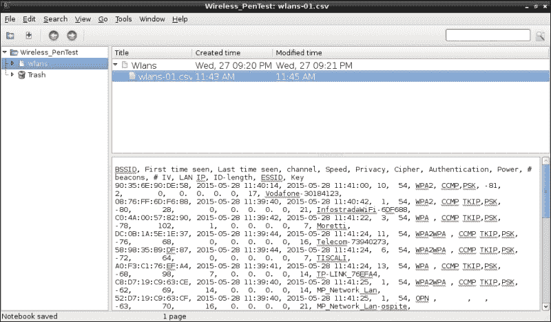

# 第八章：报告和结论

到目前为止，我们已经分析了无线渗透测试的规划、发现和攻击阶段。所有这些阶段同样重要，以实现准确可靠的结果，但需要完成最终阶段，即报告阶段。

在这个阶段，从渗透测试中出现的所有信息和发现都被收集并描述在一份报告中提交给客户。

本章涵盖的主题如下：

+   报告撰写的四个阶段

+   报告格式

在下一节中，我们将分析规划和撰写专业报告的过程。

# 报告撰写的四个阶段

报告阶段经常被低估其重要性，并被认为是渗透测试中沉闷但必要的部分。当然，发现和攻击阶段是核心和最激动人心的部分，因为在这个阶段，渗透测试人员的技术技能得以实践。渗透测试人员可能非常有技术，并且可能做得很出色，但如果他们在某种程度上未能有效地向客户传达他们的成就，那么他们的工作就是徒劳的。

撰写良好的报告是渗透测试人员必备的能力，几乎是一种艺术，就像所有技能一样，可以通过实践来提高。

撰写专业渗透测试报告的过程包括四个阶段：

+   报告规划

+   信息收集

+   撰写初稿

+   审查和最终确定

## 报告规划

在第一个阶段，即报告规划阶段，我们定义报告的目标、目标受众和内容，以及我们将花费在撰写报告上的预计时间。定义目标意味着解释为什么进行测试以及将从中获得的好处，帮助渗透测试人员和客户都专注于最重要的要点。报告的目标受众通常由组织/公司的管理层和高管以及 IT 经理和员工组成，特别是如果组织中有信息安全团队。根据受众类型，报告的布局和内容可以分为两个主要部分：**执行摘要**和**技术报告**。我们稍后将在相关专门部分中涵盖这两个部分。定义受众还意味着定义报告的分类和分发。一份文件的分类通常确定其机密级别，因此允许阅读它的人员。

分发是关于如何以安全的方式将其交付给正确的人员。例如，如果我们必须通过电子邮件发送报告，最好在加密消息中发送，使用公共加密工具，如 GnuPGP。事实上，渗透测试报告包含可能被用于攻击网络和组织系统的关键信息，如果落入错误的手中！

## 信息收集

在信息收集阶段，我们收集从先前的渗透测试阶段得出的所有结果和发现。

在渗透测试期间，记录和记录网络扫描和漏洞评估的结果、使用的工具和程序以及实施活动的有意义的截图是至关重要的。

在使用命令行工具时，将输出保存在文件中是一个好习惯。例如，发现阶段中使用的 airodump-ng 和 Kismet 都有选项将输出保存为文本可读格式，如 CSV 和 XML。

事实上，记录所有步骤也很重要，因为其他渗透测试人员或最终客户的 IT 人员必须能够重复这些步骤。

## 文档工具

Kali Linux 中有一些工具可帮助我们记笔记和记录渗透测试步骤。

其中一个是**KeepNote**，这是一个跨平台程序，用 Python 编写，支持笔记的分层组织，富文本格式和文件附件。以下是该程序的屏幕截图：

另一个有用的文档工具是**Dradis**，这是一个专门用于安全评估的协作和信息共享的开源框架。Dradis 是一个独立的 Web 应用程序，提供了一个集中的信息存储库，在团队执行渗透测试时特别有用。

要执行 Dradis，从应用程序菜单中，导航到**Kali Linux** | **报告工具** | **文档** | **Dradis**。

相关服务已启动，并打开了一个浏览器窗口，连接到 URL `https://localhost:3004`，其中`3004`是 Dradis Web 服务器监听的默认端口。第一次运行程序时，需要设置我们将用于后续登录的密码：

登录应用程序后，会显示以下界面：

Dradis 还可以生成 HTML 和 Word 格式的简单报告，可用于撰写完整报告。

更高级的报告功能，可以使用 Dradis 的专业版本。

通常用于终端工具的 Linux 用户可能会发现使用 Vim 或 Emacs 等编辑器以及使用 Markdown 或 reStructuredText 等纯文本标记语言编写文档更加方便。这些标记语言提供了一种易于使用、清晰且与格式无关的方式来生成文档，可以轻松导出为不同的格式，例如 PDF 和 HTML。

## 编写第一稿

在收集了发现和攻击阶段的信息后，下一步是撰写报告的第一稿。在这个阶段，我们以结构化的方式组织所有收集到的信息，并描述渗透测试期间执行的所有步骤。报告的撰写应该遵循一定的格式，我们将在本章后面看到。第一稿通常需要花费报告撰写时间的 60%。

## 审查和最终确定

最终阶段，审查和最终确定，是检查报告以纠正可能的错误和/或不准确之处，并进行专业编辑以满足客户的要求和标准。

如果报告是由单个渗透测试人员编写的，建议进行同行评审；而如果是由渗透测试团队编写的，所有团队成员都应该进行审查。

# 报告格式

在这一部分，我们描述了用于生成专业渗透测试报告的典型格式。

在撰写报告之前，我们必须选择文档的外观；标题和文本的字体和颜色，页边距，页眉和页脚内容等等。

报告通常以封面页开始，包含报告名称和版本、日期、服务提供商和组织名称。服务提供商是渗透测试人员或渗透测试团队。在后一种情况下，包括所有团队成员的姓名是一个良好的做法。

在封面页之后，如果报告超过几页，我们应该包括目录，列出报告的所有部分及其页码。

报告的内容可以分为两个主要部分：执行摘要和技术报告，正如我们之前所见。

## 执行摘要

执行摘要，顾名思义，是为客户组织的管理/高管而设计的，面向非技术人员。

摘要应该是对渗透测试的范围、目标和结果的高层次简洁概述，用清晰的语言表达，避免使用技术术语。

我们不需要提及使用的工具和技术，而应该专注于结果和状态，以查看被测试网络是否安全；我们应该描述安全性，即信息的保密性、完整性和可用性如何受到发现的问题的影响，以及应该采取什么措施来解决这些问题。

事实上，高管们对漏洞可能对他们业务的影响更感兴趣，而不是了解它们的技术细节。

## 技术报告

技术报告是针对 IT 经理和员工（通常是网络和系统管理员）以及信息安全经理和分析师（如果组织中有的话）。

技术报告部分通常以描述所采用的测试方法论开始，其中可能包括渗透测试人员拥有的认证、使用的软件类型（商业或开源）以及如何计算漏洞的风险评级。例如，评估漏洞严重程度的一个免费和开放的标准是**通用漏洞评分系统**（**CVSS**）。

在方法论部分之后，无线渗透测试报告通常包括检测到的网络和客户端的全面列表，按严重程度分组的检测到的漏洞摘要，以及每个漏洞的详细描述。

这个描述必须说明漏洞的来源、威胁级别、相关风险和被攻击者利用的可能性（概率）。描述使用的工具和命令也很重要。

描述应该以必须采取的对策结束，以纠正漏洞。

在我们的情况下，最常见的漏洞可能是配置为开放认证、WEP 或 WPA 弱密钥和启用 WPS、蜜罐和伪装接入点的无线网络。

建议按照严重程度递减的顺序呈现漏洞，即首先暴露最关键的漏洞，以更好地引起客户对必须紧急解决的问题的注意。

在描述渗透测试的发现时，可以适当地使用表格、图表和图表来使信息更清晰、更直观。例如，可以包括由 giskismet 生成的无线网络的图形地图，正如我们在第三章中所见的那样，*WLAN 侦察*。

技术报告可以以附录结束，包括一个参考部分，在那里作者引用外部来源（出版物、书籍、网站等），这些来源可能对观众更好地理解报告的内容有用。

报告阶段并不总是以报告的撰写结束，还包括向客户展示和解释报告。事实上，即使 IT 人员可能也没有充分理解报告内容的技术技能、背景和/或专业知识，因此可能需要渗透测试人员的一些解释。

在向高管呈现报告时，使用幻灯片或动画演示可能非常有用，也可以使用 Prezi 等基于云的软件制作。

在附录中，*参考资料*，有一些样本报告的参考资料，特别是关于无线渗透测试的（参见参考文献 8.4）。

# 总结

在本章中，我们已经涵盖了无线渗透测试的报告阶段，从报告规划到审查和最终确定，描述了专业报告的典型格式。

本章还强调了有效地向客户传达渗透测试工作的重要性，而一份写得好、呈现得好的报告无疑是最好的方式！

# 结论

我们已经到达了我们对无线渗透测试的旅程的结尾。这是一个非常令人兴奋的渗透测试领域，它正在迅速发展，并且由于无线网络的无处不在和移动设备的广泛增长，将来肯定会变得越来越重要。

学习和掌握 Kali Linux 用于无线渗透测试不仅为我们提供了一套很棒的工具，而且由于它们都是开源的，也给了我们理解它们实施逻辑和深入攻击的机会。
