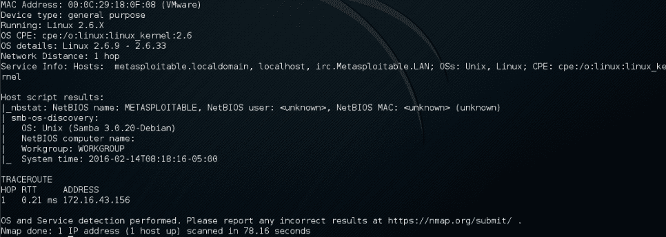
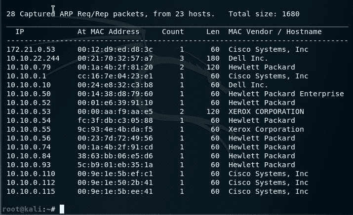
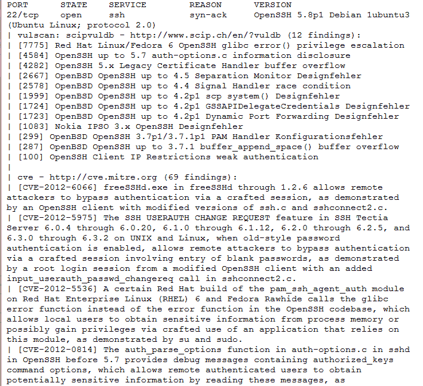
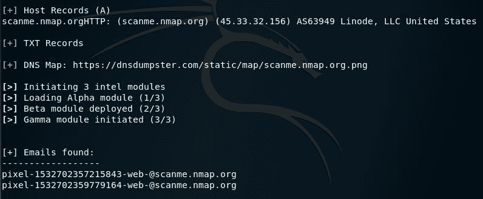

# 第五章：扫描和规避技术

在本章中，我们将描述在 Kali Linux 中使用各种工具以及 GitHub 上其他可用工具发现目标网络上的设备的过程。我们将研究以下主题：

+   目标发现过程的描述

+   使用 Kali Linux 工具识别目标机器的方法

+   查找目标机器操作系统所需的步骤（操作系统指纹识别）

+   使用 Striker 进行自动扫描

+   使用 Nipe 进行匿名化

为了帮助您轻松理解这些概念，我们将使用虚拟网络作为目标网络。

# 技术要求

这些是技术要求：

+   最低硬件要求：6 GB RAM，四核 2.4 GHz 处理器和 500 GB 硬盘

+   Kali Linux 2018

+   用于测试的虚拟机，例如 Metasploitable 或 BadStore 等（参见第二章，*设置您的测试实验室*）

# 识别目标机器

此类工具用于识别渗透测试人员可以访问的目标机器。在开始识别过程之前，我们需要了解客户的条款和协议。如果协议要求我们隐藏渗透测试活动，我们需要隐藏我们的活动。隐蔽技术也可以用于测试**入侵检测系统**（**IDS**）或**入侵预防系统**（**IPS**）的功能。如果没有这样的要求，我们可能不需要隐藏我们的渗透测试活动。

# ping

`ping`是用于检查特定主机是否可用的最著名的工具。`ping`工具通过向目标主机发送**Internet 控制消息协议**（**ICMP**）回显请求数据包来工作。如果目标主机可用且防火墙没有阻止 ICMP 回显请求数据包，它将回复 ICMP 回显回复数据包。

ICMP 回显请求和 ICMP 回显回复是可用的 ICMP 控制消息之一。有关其他 ICMP 控制消息，请参阅以下网址：[`en.wikipedia.org/wiki/Internet_Control_Message_Protocol#Control_messages`](https://en.wikipedia.org/wiki/Internet_Control_Message_Protocol#Control_messages)。

虽然您在 Kali Linux 菜单中找不到`ping`，但您可以打开控制台并输入`ping`命令以及其选项。

要使用`ping`，您只需输入`ping`和目标地址，如下面的屏幕截图所示：


在 Kali Linux 中，默认情况下，`ping`将持续运行，直到按下*Ctrl* + *C*。

`ping`工具有很多选项，但以下是经常使用的一些选项：

+   **`-c`** **计数**：这是要发送的回显请求数据包的数量。

+   **`-I`** **接口地址**：这是源地址的网络接口。参数可以是数字 IP 地址（如`192.168.56.102`）或设备的名称（如`eth0`）。如果要 ping IPv6 链路本地地址，则需要此选项。

+   **`-s`** **数据包大小**：指定要发送的数据字节数。默认值为 56 字节，与 ICMP 头数据的 8 字节组合在一起，可以得到 64 个 ICMP 数据字节。

让我们将前面的信息付诸实践。

假设您要开始内部渗透测试工作。客户通过局域网电缆为您提供了他们网络的访问权限，并提供了目标服务器的 IP 地址列表。

在启动完整的渗透测试工具之前，您可能想要做的第一件事是检查这些服务器是否可以从您的机器访问。您可以使用`ping`来完成这项任务。

目标服务器位于`172.16.43.156`，而您的机器的 IP 地址为`172.16.43.150`。要检查目标服务器的可用性，您可以给出以下命令：

```
    ping -c 1 172.16.43.156
```

除了 IP 地址，`ping`还接受主机名作为目标。

以下屏幕截图是前述`ping`命令的结果：


从前面的屏幕截图中，我们知道已向目的地（IP 地址=`172.16.43.156`）发送了一个 ICMP echo 请求数据包。同时，发送主机（IP 地址=`172.16.43.150`）收到了一个 ICMP echo 回复数据包。所需的往返时间为`.869 ms`，在整个过程中没有丢包。

让我们看看我们的机器发送和接收的网络数据包。我们将在我们的机器上使用网络协议分析器 Wireshark 来捕获这些数据包，如下图所示：


从前面的屏幕截图中，我们可以看到我们的主机（`172.16.43.150`）向目标主机（`172.16.43.156`）发送了一个 ICMP echo 请求数据包。由于目标是活动的并允许 ICMP echo 请求数据包，它将 ICMP echo 回复数据包发送回我们的机器。我们将在第九章*特权提升*的*网络嗅探器*部分更详细地介绍*Wireshark*。

如果您的目标使用 IPv6 地址，例如`fe80::20c:29ff:fe18:f08`，您可以使用`ping6`工具来检查其可用性。您需要为命令指定`-I`选项，以针对链路本地地址进行操作：

```
    # ping6 -c 1 fe80::20c:29ff:fe18:f08 -I eth0
    PING fe80::20c:29ff:fe18:f08(fe80::20c:29ff:fe18:f08) from fe80::20c:29ff:feb3:137 eth0: 56 data bytes
    64 bytes from fe80::20c:29ff:fe18:f08: icmp_seq=1 ttl=64 time=7.98 ms

    --- fe80::20c:29ff:fe18:f08 ping statistics ---
    1 packets transmitted, 1 received, 0% packet loss, time 0ms
    rtt min/avg/max/mdev = 7.988/7.988/7.988/0.000 ms

```

以下屏幕截图显示了发送完成`ping6`请求的数据包：


从前面的屏幕截图中，我们知道`ping6`正在使用`ICMPv6`请求和回复。

要阻止`ping`请求，防火墙可以配置为仅允许来自特定主机的 ICMP `echo`请求数据包，并丢弃从其他主机发送的数据包。

# fping

`ping`和`fping`之间的区别在于`fping`工具可以用来一次向多个主机发送 ping（ICMP echo）请求。您可以在命令行上指定多个目标，也可以使用包含要 ping 的主机的文件。

在默认模式下，`fping`通过监视目标主机的回复来工作。如果目标主机发送回复，将对其进行记录并从目标列表中删除。如果主机在一定时间内没有响应，将标记为`不可达`。默认情况下，`fping`将尝试向每个目标发送三个 ICMP echo 请求数据包。

要访问`fping`，可以使用控制台执行以下命令：

```
    # fping -h
```

这将显示`fping`中的用法和可用选项的描述。

以下情景将让您了解`fping`的用法。

如果我们想要一次知道`172.16.43.156`、`172.16.43.150`和`172.16.43.155`的活动主机，我们可以使用以下命令：

```
fping 172.16.43.156 172.16.43.150 172.16.43.155  
```

以下是前述命令的结果：

```
    # fping 172.16.43.156 172.16.43.150 172.16.43.155
    172.16.43.156 is alive
    172.16.43.150 is alive
    ICMP Host Unreachable from 172.16.43.150 for ICMP Echo sent to 172.16.43.155
    ICMP Host Unreachable from 172.16.43.150 for ICMP Echo sent to 172.16.43.155
    ICMP Host Unreachable from 172.16.43.150 for ICMP Echo sent to 172.16.43.155
    ICMP Host Unreachable from 172.16.43.150 for ICMP Echo sent to 172.16.43.155
    172.16.43.155 is unreachable 
```

我们还可以自动生成主机列表，而不需要逐个定义 IP 地址并识别活动主机。假设我们想要在`172.16.43.0/24`网络中找到活动主机；我们可以使用`-g`选项并定义要检查的网络，使用以下命令：

```
# fping -g 172.16.43.0/24  
```

如果我们想要更改发送到目标的 ping 尝试次数，可以使用`-r`选项（重试限制），如下命令行所示。默认情况下，有三次 ping 尝试：

```
    fping  -r 1 -g 172.16.43.149 172.16.43.160

```

命令的结果如下：

```
    # fping -r 1 -g 172.16.43.149 172.16.43.160
    172.16.43.150 is alive
    172.16.43.156 is alive
    172.16.43.149 is unreachable
    172.16.43.151 is unreachable
    172.16.43.152 is unreachable
    172.16.43.153 is unreachable
    172.16.43.154 is unreachable
    172.16.43.155 is unreachable
    172.16.43.157 is unreachable
    172.16.43.158 is unreachable
    172.16.43.159 is unreachable
    172.16.43.160 is unreachable

```

可以使用`-s`选项（打印累积统计信息）显示累积统计信息，如下所示：

```
    fping -s www.yahoo.com www.google.com www.msn.com

```

以下是前述命令行的结果：

```
    #fping -s www.yahoo.com www.google.com www.msn.com
    www.yahoo.com is alive
    www.google.com is alive
    www.msn.com is alive

           3 targets
           3 alive
           0 unreachable
           0 unknown addresses

           0 timeouts (waiting for response)
           3 ICMP Echos sent
           3 ICMP Echo Replies received
           0 other ICMP received

     28.8 ms (min round trip time)
     30.5 ms (avg round trip time)
     33.6 ms (max round trip time)
            0.080 sec (elapsed real time)

```

# hping3

`hping3`工具是一个命令行网络数据包生成器和分析器工具。创建自定义网络数据包的能力使`hping3`可以用于 TCP/IP 和安全测试，如端口扫描、防火墙规则测试和网络性能测试。

根据开发人员的说法，`hping3`还有以下几种用途：

+   测试防火墙规则

+   测试 IDS

+   利用 TCP/IP 堆栈中已知的漏洞

要访问`hping3`，请转到控制台并键入`hping3`。

您可以通过命令行、交互式 shell 或脚本的方式给`hping3`发送命令。

在没有给定命令行选项的情况下，`hping3`将向端口`0`发送一个空 TCP 数据包。

为了切换到不同的协议，您可以在命令行中使用以下选项来定义协议：

| No. | Short option | Long option | Description |
| --- | --- | --- | --- |
| 1 | `-0` | `--raw-ip` | 这发送原始 IP 数据包 |
| 2 | `-1` | `--icmp` | 这发送 ICMP 数据包 |
| 3 | `-2` | `--udp` | 这发送 UDP 数据包 |
| 4 | `-8` | `--scan` | 这表示使用扫描模式 |
| 5 | `-9` | `--listen` | 这表示使用监听模式 |

在使用 TCP 协议时，我们可以使用不带任何标志的 TCP 数据包（这是默认行为），或者我们可以使用以下标志选项之一：

| No. | Option | Flag name |
| --- | --- | --- |
| 1 | `-S` | `syn` |
| 2 | `-A` | `ack` |
| 3 | `-R` | `rst` |
| 4 | `-F` | `fin` |
| 5 | `-P` | `psh` |
| 6 | `-U` | `urg` |
| 7 | `-X` | `xmas: flags fin, urg, psh set` |
| 8 | `-Y` | `ymas` |

让我们使用`hping3`进行几种情况。 

向`192.168.56.101`机器发送一个 ICMP 回显请求数据包。使用的选项是`-1`（用于 ICMP 协议）和`-c 1`（将计数设置为一个数据包）：

```
hping3 -1 172.16.43.156 -c 1
```

以下是此命令的输出：

```
    # hping3  -1 172.16.43.156 -c 1
    HPING 172.16.43.156 (eth0 172.16.43.156): icmp mode set, 28 headers + 0 data bytes
    len=46 ip=172.16.43.156 ttl=64 id=63534 icmp_seq=0 rtt=2.5 ms

    --- 172.16.43.156 hping statistic ---
    1 packets transmitted, 1 packets received, 0% packet loss
    round-trip min/avg/max = 2.5/2.5/2.5 ms

```

从前面的输出中，我们可以确定目标机器是存活的，因为它已经回复了我们的 ICMP 回显请求。

为了验证这一点，我们使用`tcpdump`捕获了流量，以下屏幕截图显示了数据包：


我们可以看到目标已经用 ICMP 回显回复数据包做出了响应。

除了在命令行中给出选项外，您还可以交互地使用`hping3`。打开控制台并输入`hping3`。然后，您将看到一个提示符，可以在其中输入您的 Tcl 命令。

以下链接是 Tcl 的资源：[`www.invece.org/tclwise/`](http://www.invece.org/tclwise/)和 [`wiki.tcl.tk/`](http://wiki.tcl.tk/)。

对于上面的示例，以下是相应的 Tcl 脚本：

```
    hping3> hping send {ip(daddr=172.16.43.156)+icmp(type=8,code=0)}
```

打开一个命令行窗口，并输入以下命令以从目标服务器获取响应：

```
    hping recv eth0
```

之后，打开另一个命令行窗口输入发送请求。

以下屏幕截图显示了收到的响应：


您还可以使用`hping3`来检查防火墙规则。假设您有以下防火墙规则：

+   接受任何发送到端口`22`（SSH）的 TCP 数据包

+   接受与已建立连接相关的任何 TCP 数据包

+   丢弃其他数据包

要检查这些规则，您可以在`hping3`中给出以下命令，以发送一个 ICMP 回显请求数据包：

```
hping3 -1 172.16.43.156 -c 1  
```

以下代码是结果：

```
# hping3 -1 172.16.43.156 -c 1 
HPING 172.16.43.156 (eth0 172.16.43.156): icmp mode set, 28 headers + 0 data bytes 
--- 172.16.43.156 hping statistic --- 
1 packets transmitted, 0 packets received, 100% packet loss 
round-trip min/avg/max = 0.0/0.0/0.0 ms 
```

我们可以看到目标机器没有响应我们的 ping 探测。

发送一个带有 SYN 标志设置为端口`22`的 TCP 数据包，我们将得到以下屏幕截图中显示的结果：


从前面的屏幕截图中，我们可以看到目标机器的防火墙允许我们的 SYN 数据包到达端口`22`。

让我们检查一下 UDP 数据包是否允许到达端口`22`：


从前面的屏幕截图中，我们可以看到目标机器的防火墙不允许我们的 UDP 数据包到达端口`22`。

`hping3`还有其他功能，但在本章中，我们只讨论了其能力的一小部分。如果您想了解更多信息，可以查阅[hping3](http://wiki.hping.org)文档网站。

# 操作系统指纹识别

在我们确认目标机器存活后，我们可以找出目标机器使用的操作系统。这种方法通常被称为**操作系统**（**OS**）指纹识别。有两种方法可以进行操作系统指纹识别：主动和被动。

在主动方法中，该工具向目标机器发送网络数据包，然后分析接收到的响应以确定目标机器的操作系统。这种方法的优点是指纹识别过程很快。然而，缺点是目标机器可能会注意到我们尝试获取其操作系统信息。

为了克服主动方法的缺点，存在一种被动的操作系统指纹识别方法。这种方法是由 Michal Zalewsky 首创的，他发布了一个名为`p0f`的工具。被动 OS 指纹识别的主要优点是在减少测试机器和目标之间的交互的同时完成工作，大大增加了指纹识别的隐蔽性。被动方法的最大缺点是这个过程比主动方法慢。

在本节中，我们将描述一些用于操作系统指纹识别的工具。

# p0f

`p0f`工具被用来 passively 对操作系统进行指纹识别。它可以用来识别以下机器上的操作系统：

+   连接到您的机器的机器（SYN 模式；这是默认模式）

+   连接到您的机器的机器（SYN + ACK 模式）

+   无法连接的机器（`RST`+模式）

+   您可以观察到其通信的机器

`p0f`工具通过分析网络活动期间发送的 TCP 数据包来工作。然后，它收集了默认情况下没有被任何公司标准化的特殊数据包的统计信息。例如，Linux 内核使用 64 字节的 ping 数据报，而 Windows 操作系统使用 32 字节的 ping 数据报或**生存时间**（**TTL**）值。对于 Windows，TTL 值为`128`，而对于 Linux，这个 TTL 值在 Linux 发行版之间有所不同。然后，`p0f`使用这些信息来确定远程机器的操作系统。

在使用 Kali Linux 附带的`p0f`工具时，我们无法对远程机器上的操作系统进行指纹识别。我们发现`p0f`工具没有更新其指纹数据库。不幸的是，我们找不到最新版本的指纹数据库。因此，我们使用了`p0f v3`（版本 3.06b）。要使用这个版本的`p0f`，只需从[`lcamtuf.coredump.cx/p0f3/releases/p0f-3.06b.tgz`](http://lcamtuf.coredump.cx/p0f3/releases/p0f-3.06b.tgz)下载`TARBALL`文件，并通过运行`build.sh`脚本来编译代码。默认情况下，指纹数据库文件（`p0f.fp`）的位置在当前目录中。如果要更改位置，例如更改为`/etc/p0f/p0f.fp`，则需要在`config.h`文件中更改这个位置并重新编译`p0f`。如果不更改位置，可能需要使用`-f`选项来定义指纹数据库文件的位置。

要访问`p0f`，打开控制台并输入`p0f -h`。这将显示其用法和选项描述。让我们使用`p0f`来识别我们正在连接的远程机器上使用的操作系统。只需在控制台中输入以下命令：

```
 p0f -f /etc/p0f/p0f.fp -o p0f.log
```

这将从文件中读取指纹数据库，并将日志信息保存到`p0f.log`文件中。然后它将显示以下信息：

```
        --- p0f 3.07b by Michal Zalewski <lcamtuf@coredump.cx> ---

    [+] Closed 1 file descriptor.
    [+] Loaded 320 signatures from '/usr/share/p0f/p0f.fp'.
    [+] Intercepting traffic on default interface 'eth0'.
    [+] Default packet filtering configured [+VLAN].
    [+] Log file 'p0f.log' opened for writing.
    [+] Entered main event loop.

```

接下来，您需要生成涉及 TCP 连接的网络活动，比如浏览远程机器或让远程机器连接到您的机器。为了进行演示，建立了与 2 号机器上 HTTP 站点的连接。

如果`p0f`成功对操作系统进行了指纹识别，您将在控制台和日志文件（`p0f.log`）中看到有关远程机器操作系统的信息。

以下是显示在控制台上的摘要信息：

```
    .-[ 172.16.43.150/41522 -> 172.16.43.156/80 (syn+ack) ]-
    |
    | server   = 172.16.43.156/80
    | os       = Linux 2.6.x
    | dist     = 0
    | params   = none
    | raw_sig  = 4:64+0:0:1460:mss*4,5:mss,sok,ts,nop,ws:df:0

```

以下截图显示了日志文件的内容：


根据前面的结果，我们知道目标是一个`Linux 2.6`机器。

以下截图显示了来自目标机器的信息：


通过比较这些信息，我们知道`p0f`正确地获取了操作系统信息。远程机器正在使用 Linux 2.6 版本。

您可以通过按下*Ctrl* + *C*组合键来停止`p0f`。

# 介绍端口扫描

端口扫描的最简单定义是它是一种用于确定目标机器上**传输控制协议**（**TCP**）和**用户数据报协议**（**UDP**）端口状态的方法。开放的端口可能意味着有一个网络服务在该端口上监听，并且该服务是可访问的，而关闭的端口意味着该端口上没有网络服务在监听。

在获取端口状态之后，攻击者将检查网络服务使用的软件版本，并找出该软件版本的漏洞。例如，假设服务器 A 有 web 服务器软件版本 1.0。几天前，发布了一个安全公告。该公告提供了关于 web 服务器软件版本 1.0 中的漏洞的信息。如果攻击者发现了服务器 A 的 web 服务器并能够获取版本信息，攻击者可以利用这些信息来攻击服务器。这只是攻击者在获取有关机器上可用服务的信息后可以做的一个简单示例。

在我们深入研究端口扫描之前，让我们先讨论一下 TCP/IP 协议的理论。

# 理解 TCP/IP 协议

在 TCP/IP 协议套件中，有数十种不同的协议，但最重要的是 TCP 和 IP。IP 提供寻址、数据包路由和其他功能，用于将一台机器连接到另一台机器，而 TCP 负责管理连接，并在两台机器上的进程之间提供可靠的数据传输。IP 位于**开放系统互连**（**OSI**）模型的网络层（第 3 层），而 TCP 位于 OSI 模型的传输层（第 4 层）。

除了 TCP，传输层中的另一个关键协议是 UDP。您可能会问这两种协议之间的区别是什么。

简而言之，TCP 具有以下特点：

+   **这是一种面向连接的协议**：在 TCP 可以用于发送数据之前，想要通信的客户端和服务器必须使用三次握手机制建立 TCP 连接，如下所示：

+   客户端通过向服务器发送一个包含 SYN（同步）标志的数据包来发起连接。客户端还在 SYN 段的序列号字段中发送**初始序列号**（**ISN**）。这个 ISN 是随机选择的。

+   服务器回复自己的 SYN 段，其中包含自己的 ISN。服务器通过发送一个包含客户端`ISN` + `1`值的 ACK（确认）标志来确认客户端的 SYN。

+   客户端通过发送一个包含服务器 ISN + `1`的 ACK 标志来确认服务器。此时，客户端和服务器可以交换数据。

+   要终止连接，TCP 必须遵循这个机制：

+   客户端发送一个包含`FIN`（结束）标志的数据包。

+   服务器发送一个`ACK`（确认）数据包以通知客户端服务器已经收到了 FIN 数据包。

+   应用服务器准备关闭后，服务器发送一个 FIN 数据包。

+   然后客户端发送`ACK`数据包以确认接收服务器的`FIN`数据包。在正常情况下，每一方（客户端或服务器）都可以通过发送`FIN`数据包独立地终止其通信端。

+   **这是一种可靠的协议**：TCP 使用序列号和确认来标识数据包数据。接收方在接收到数据包时发送确认。当数据包丢失时，如果没有从接收方收到任何确认，TCP 将自动重传。如果数据包到达顺序不对，TCP 将在将其提交给应用程序之前重新排序。

+   需要传输文件或重要数据的应用程序使用 TCP，例如**超文本传输协议**（**HTTP**）和**文件传输协议**（**FTP**）。

UDP 具有与 TCP 相反的特性，如下：

+   这是一种无连接的协议。要发送数据，客户端和服务器不需要首先建立 UDP 连接。

+   它会尽力将数据包发送到目的地，但如果数据包丢失，UDP 不会自动重新发送。由应用程序重新传输数据包。

可以承受一些数据包丢失的应用程序，例如视频流和其他多媒体应用程序，使用 UDP。使用 UDP 的其他知名应用程序包括**域名系统**（**DNS**）、**动态主机配置协议**（**DHCP**）和**简单网络管理协议**（**SNMP**）。

为了使应用程序能够正确通信，传输层使用称为端口的寻址。软件进程在服务器端的特定端口号上监听，并且客户端机器将数据发送到该服务器端口，以便由服务器应用程序处理。端口号有一个 16 位地址，数字范围从`0`到`65,535`。为了避免端口号的混乱使用，有关端口号范围的通用协议如下：

+   **众所周知的端口号（**`0` **至** `1,023`**）**：此范围内的端口号是保留端口号，通常由系统管理员或特权用户运行的服务器进程使用。应用服务器使用的端口号示例包括 SSH（端口`22`）和 HTTP（端口`80`）、HTTPS（端口`443`）。

+   **注册端口号（**`1,024` **至** `49,151`**）**：用户可以向**互联网编号分配机构**（**IANA**）发送请求，为他们的客户端-服务器应用程序保留其中一个端口号。

+   **私有或动态端口号（**`49,152` **至** `65,535`**）**：任何人都可以使用此范围内的端口号，而无需向 IANA 注册。

在简要讨论了 TCP 和 UDP 之间的区别之后，让我们描述一下 TCP 和 UDP 消息格式。

# 理解 TCP 和 UDP 消息格式

TCP 消息称为段。TCP 段由头部和数据部分组成。TCP 头通常为 20 个字节长（不包括 TCP 选项）。可以使用以下屏幕截图描述 TCP 头：


以下是对每个字段的简要描述：

+   **源端口**和**目标端口**各自的长度为 16 位。源端口是发送机上传输数据包的端口，而目标端口是接收数据包的目标机器上的端口。

+   **序列号（32 位）**在正常传输中，是此段数据的第一个字节的序列号。

+   **确认号（32 位）**包含发送方的序列号，增加了一个。

+   **H.Len.（4 位）**是 TCP 头的大小，以 32 位字为单位。

+   **Rsvd.** 保留供将来使用。它是一个 4 位字段，必须为零。

+   **控制位**（控制标志）包含八个 1 位标志。在原始规范（RFC 793；可以从[`www.ietf.org/rfc/rfc793.txt`](http://www.ietf.org/rfc/rfc793.txt)下载 RFC）中，TCP 只有六个标志，如下：

+   **SYN**：此标志同步序列号。此位在会话建立期间使用。

+   **ACK**：此标志表示 TCP 头中的**确认**字段是重要的。如果数据包包含此标志，这意味着它是对先前接收的数据包的确认。

+   **RST**：此标志重置连接。

+   **FIN**：此标志表示一方没有更多数据要发送。它用于优雅地终止连接。

+   **PSH**：此标志表示缓冲数据应立即推送到应用程序，而不是等待更多数据。

+   **URG**：这个标志表示 TCP 头部中的**紧急指针**字段是重要的。紧急指针指的是重要的数据序列号。

稍后，RFC 3168（RFC 可以从[`www.ietf.org/rfc/rfc3168.txt`](http://www.ietf.org/rfc/rfc3168.txt)下载）添加了两个扩展标志，如下所示：

+   **拥塞窗口减小（CWR）**：这是数据发送方用来通知数据接收方由于网络拥塞而减少了待发送的未决数据包队列

+   **显式连接通知-回显（ECN-Echo）**：这表示网络连接正在经历拥塞

+   **窗口大小（16 位）**指定接收方愿意接受的字节数

+   **校验和（16 位）**用于对 TCP 头部和数据进行错误检查

标志可以独立设置。

要获取有关 TCP 的更多信息，请参阅 RFC 793 和 RFC 3168。

当使用 SYN 数据包对目标机器的 TCP 端口进行端口扫描时，攻击者可能会面临以下行为：

+   目标机器以 SYN+ACK 数据包回应。如果我们收到这个数据包，我们就知道端口是开放的。这种行为在 TCP 规范（RFC 793）中定义，规定如果端口是开放的，SYN 数据包必须用 SYN + ACK 数据包回应，而不考虑 SYN 数据包的有效负载。

+   目标机器发送一个设置了 RST 和 ACK 位的数据包。这意味着端口是关闭的。

+   目标机器发送 ICMP 消息，比如`ICMP 端口不可达`，这意味着该端口对我们不可访问，很可能是因为防火墙阻止了它。

+   目标机器对我们没有任何回应。这可能表示该端口上没有网络服务监听，或者防火墙正在默默地阻止我们的 SYN 数据包。

从渗透测试人员的角度来看，端口开放时的行为是有趣的，因为这意味着该端口上有一个可以进一步测试的服务。

如果进行端口扫描攻击，您应该了解各种 TCP 行为的列表，以便能够更有效地进行攻击。

在扫描 UDP 端口时，您将看到不同的行为；这些将在稍后解释。在我们继续看各种 UDP 行为之前，让我们先看一下 UDP 头部格式，如下图所示：


以下是 UDP 头部中每个字段的简要解释，如前图所示。

就像 TCP 头部一样，UDP 头部也有**源端口**和**目标端口**，每个端口长度为 16 位。源端口是发送数据包的发送机器上的端口，而目标端口是接收数据包的目标机器上的端口。

+   **UDP 长度**是 UDP 头部的长度

+   **UDP 校验和（16 位）**用于对 UDP 头部和数据进行错误检查

请注意，在 UDP 头部中没有序列号、确认号和控制位字段。

在对目标机器的 UDP 端口进行端口扫描活动时，攻击者可能会面临以下行为：

+   目标机器以 UDP 数据包回应。如果我们收到这个数据包，我们就知道端口是开放的。

+   目标机器发送 ICMP 消息，比如`ICMP 端口不可达`。可以得出结论，端口是关闭的。然而，如果发送的消息不是 ICMP 不可达消息，那么意味着端口被防火墙过滤了。

+   目标机器对我们没有任何回应。这可能表示以下情况之一：

+   端口是关闭的

+   入站 UDP 数据包被阻止

+   响应被阻止

与 TCP 端口扫描相比，UDP 端口扫描的可靠性较低，因为有时 UDP 端口是开放的，但在该端口上监听的服务正在寻找特定的 UDP 有效负载。因此，服务将不会发送任何回复。

现在我们已经简要描述了端口扫描理论，让我们将其付诸实践。在接下来的几节中，我们将看看几个工具，可以帮助我们进行网络扫描。

在本章的实际场景中，我们将利用一个 Metasploitable 虚拟机作为我们的目标机器。它的 IP 地址是`172.16.43.156`，而我们的攻击机器的 IP 地址是`172.16.43.150`。

# 网络扫描仪

在本节中，我们将看看几个工具，可以用来查找开放端口、指纹远程操作系统，并枚举远程机器上的服务。

服务枚举是一种用于查找目标系统上特定端口上可用服务版本的方法。这个版本信息很重要，因为有了这个信息，渗透测试人员可以搜索存在于该软件版本的安全漏洞。

虽然通常使用标准端口，但有时系统管理员会更改某些服务的默认端口。例如，SSH 服务可能绑定到端口`22`（作为约定），但系统管理员可能会将其更改为绑定到端口`2222`。如果渗透测试人员只对 SSH 的常用端口进行端口扫描，可能无法找到该服务。当处理运行在非标准端口上的专有应用程序时，渗透测试人员也会遇到困难。通过使用服务枚举工具，这两个问题可以得到缓解，因此有可能找到服务，无论它绑定到哪个端口。

# Nmap

Nmap 是一个全面的、功能丰富的、广泛被 IT 安全社区使用的端口扫描器。它由 Fyodor 编写和维护。由于其质量和灵活性，它是渗透测试人员必备的工具。

除了用作端口扫描器外，Nmap 还具有以下几个功能：

+   主机发现：Nmap 可以用来在目标系统上找到活动的主机。默认情况下，Nmap 将发送一个 ICMP 回显请求，一个 TCP SYN 数据包到端口`443`，一个 TCP ACK 数据包到端口`80`，以及一个 ICMP 时间戳请求来进行主机发现。

+   服务/版本检测：在 Nmap 发现端口后，它可以进一步检查目标机器上使用的服务协议、应用程序名称和版本号。

+   操作系统检测：Nmap 向远程主机发送一系列数据包，并检查响应。然后，它将这些响应与其操作系统指纹数据库进行比较，并在有匹配时打印出详细信息。如果它无法确定操作系统，Nmap 将提供一个 URL，您可以提交指纹以更新其操作系统指纹数据库。当然，如果您知道目标系统使用的操作系统，应该提交指纹。

+   网络路由跟踪：这是为了确定最有可能到达目标系统的端口和协议。Nmap 路由跟踪从一个较高的 TTL 值开始，并递减直到 TTL 值达到零。

+   Nmap 脚本引擎：有了这个功能，Nmap 可以被扩展。如果您想添加一个默认 Nmap 中没有包含的检查，可以使用 Nmap 脚本引擎编写检查。目前，有检查网络服务漏洞和枚举目标系统资源的功能。

始终检查 Nmap 的新版本是一个好习惯。如果您找到了适用于 Kali Linux 的最新版本的 Nmap，可以通过发出以下命令来更新您的 Nmap：

```
apt-get update
apt-get install nmap  
```

要启动 Nmap，可以转到应用程序，然后转到信息收集。您也可以通过转到控制台来执行以下命令来启动 Nmap：

```
nmap  
```

这将显示所有 Nmap 选项及其描述。

对于 Nmap 新手来说，可用选项可能会让人感到不知所措。

幸运的是，您只需要一个选项来扫描远程机器。该选项是您的目标 IP 地址或主机名，如果您已正确设置 DNS。这可以通过以下命令完成：

```
    nmap 172.16.43.156
```

以下是没有其他选项的扫描结果：

```
    Nmap scan report for 172.16.43.156
    Host is up (0.00025s latency).
    Not shown: 977 closed ports
    PORT     STATE SERVICE
    21/tcp   open  ftp
    22/tcp   open  ssh
    23/tcp   open  telnet
    25/tcp   open  smtp
    53/tcp   open  domain
    80/tcp   open  http
    111/tcp  open  rpcbind
    139/tcp  open  netbios-ssn
    445/tcp  open  microsoft-ds
    512/tcp  open  exec
    513/tcp  open  login
    514/tcp  open  shell
    1099/tcp open  rmiregistry
    1524/tcp open  ingreslock
    2049/tcp open  nfs
    2121/tcp open  ccproxy-ftp
    3306/tcp open  mysql
    5432/tcp open  postgresql
    5900/tcp open  vnc
    6000/tcp open  X11
    6667/tcp open  irc
    8009/tcp open  ajp13
    8180/tcp open  unknown
    MAC Address: 00:0C;29:18:0F:08 (VMware)

    Nmap done: 1 IP address (1 host up) scanned in 1.7 seconds
```

从前面的结果中，我们可以看到目标机器非常容易受到攻击，因为它有许多开放的端口。

在继续使用 Nmap 之前，让我们看一下 Nmap 可以识别的端口状态。Nmap 可以识别六种端口状态，如下所示：

+   **打开**: 这意味着有一个应用程序接受 TCP 连接、UDP 数据报或 SCTP 关联。

+   **关闭**: 这意味着虽然端口是可访问的，但没有应用程序在该端口上监听。

+   **过滤**: 这意味着 Nmap 无法确定端口是否打开，因为有一个数据包过滤设备阻止了探测到达目标。

+   **未过滤**: 这意味着端口是可访问的，但 Nmap 无法确定它是打开还是关闭的。

+   **打开|过滤**: 这意味着 Nmap 无法确定端口是打开还是过滤的。当打开端口的扫描没有响应时会发生这种情况。这可以通过设置防火墙来实现丢弃数据包。

+   **关闭|过滤**: 这意味着 Nmap 无法确定端口是关闭还是过滤的。

在描述端口状态之后，我们将描述在渗透测试中常用的几个选项，然后我们将在实践中使用这些选项。

# Nmap 目标规范

Nmap 将处理命令行上不是选项或选项参数的所有内容作为目标主机规范。我们建议您使用 IP 地址规范而不是主机名。通过使用 IP 地址，Nmap 不需要首先进行 DNS 解析。这将加快端口扫描过程。

在当前版本中，Nmap 支持以下 IPv4 地址规范：

+   它支持单个主机，比如`172.16.43.156`。

+   它支持使用 CIDR 表示法的相邻主机的整个网络，比如`172.16.43.0/24`。这个规范将包括从`172.16.43.0`到`172.16.43.255`的 256 个 IP 地址。

+   它支持八进制范围寻址，比如`172.16.2-4,6.1`。这种寻址将包括四个 IP 地址：`172.16.2.1`、`172.16.3.1`、`172.16.4.1`和`172.16.6.1`。

+   它支持多个主机规范，比如`172.16.43.1 172.168.3-5,9.1`。

对于 IPv6 地址，Nmap 只支持完全合格的 IPv6 格式和主机名，比如`fe80::a8bb:ccff:fedd:eeff%eth0`。

除了从命令行获取目标规范外，Nmap 还可以通过使用`-iL <inputfilename>`选项从文本文件中接受目标定义。如果我们已经从另一个程序获得了 IP 地址，这个选项就很有用。

确保文件中的条目使用 Nmap 支持的目标规范格式。每个条目必须用空格、制表符或新行分隔。

以下代码是该文件的示例：

```
172.16.1.1-254 
172.16.2.1-254 
```

现在，让我们扫描`172.16.430/24`的网络。我们想要查看 Nmap 发送的数据包。为了监视发送的数据包，我们可以使用数据包捕获实用程序，比如`tcpdump`。

打开一个控制台，输入以下命令：

```
tcpdump -nnX tcp and host 172.16.43.150  
```

`172.16.43.150` IP 地址属于我们的机器，它启动了 Nmap。您需要根据您的配置进行调整。

在同一台机器上打开另一个控制台，输入以下命令：

```
    nmap 172.16.43.0/24

```

在`tcpdump`控制台中，您将看到以下数据包：

```
    22:42:12.107532 IP 172.16.43.150.49270 >172.16.43.156.23: Flags [S], seq 239440322, win 1024, options [mss 1460], length 0
      0x0000:  4500 002c eb7f 0000 3006 ad2e c0a8 3866  E..,....0.....8f
      0x0010:  c0a8 3867 c076 0017 0e45 91c2 0000 0000  ..8g.v...E......
      0x0020:  6002 0400 4173 0000 0204 05b4            `...As......

```

根据前面的数据包信息，我们知道攻击机器从端口`49270`向目标机器端口`23`（Telnet）发送了一个设置了 SYN 标志的数据包。如果 Nmap 由特权用户（如 Kali Linux 中的`root`）运行，默认情况下会设置 SYN 标志。

以下屏幕截图显示了攻击机器发送到目标网络上其他机器和端口的数据包：


如果远程机器响应，响应数据包将如下所示：

```
22:36:19.939881 IP 172.16.43.150.1720 >172.16.43.156.47823: Flags [R.], seq 0, ack 1053563675, win 0, length 0 
  0x0000:  4500 0028 0000 4000 4006 48b2 c0a8 3867  E..(..@.@.H...8g 
  0x0010:  c0a8 3866 06b8 bacf 0000 0000 3ecc 1b1b  ..8f........>... 
  0x0020:  5014 0000 a243 0000 0000 0000 0000       P....C........ 
```

请注意，发送的标志由字符`R`表示，即重置。这意味着目标机器中的端口`1720`是关闭的。我们可以通过之前的 Nmap 结果来验证这一点。

但是，如果端口是开放的，您将看到以下网络流量：

```
22:42:12.108741 IP 172.16.43.156.23 >172.16.43.150.49270:Flags [S.], seq 1611132106, ack 239440323, win 5840,options [mss 1460], length 0 
  0x0000:  4500 002c 0000 4000 4006 48ae c0a8 3867  E..,..@.@.H...8g 
  0x0010:  c0a8 3866 0017 c076 6007 ecca 0e45 91c3  ..8f...v`....E.. 
  0x0020:  6012 16d0 e1bf 0000 0204 05b4 0000 
```

您可以看到前面代码中的数据包是用来确认先前显示的数据包的序列号的。此数据包的确认号为`239440323`，而前一个数据包的序列号为`239440322`。

# Nmap TCP 扫描选项

要能够使用大多数 TCP 扫描选项，Nmap 需要一个特权用户（Unix 世界中的根级帐户或 Windows 世界中的管理员级帐户）。这用于发送和接收原始数据包。默认情况下，Nmap 将使用 TCP SYN 扫描，但如果 Nmap 没有特权用户，则将使用 TCP 连接扫描。Nmap 使用的各种扫描如下：

+   TCP 连接扫描（-sT）：此选项将完成与每个目标端口的三次握手。如果连接成功，则认为端口是开放的。由于需要对每个端口进行三次握手，因此此扫描类型速度较慢，并且很可能会被目标记录。如果 Nmap 由没有任何特权的用户运行，则使用此默认扫描选项。

+   SYN 扫描（-sS）：此选项也称为半开放或 SYN 隐身。使用此选项，Nmap 发送一个 SYN 数据包，然后等待响应。SYN/ACK 响应表示端口正在监听，而 RST/ACK 响应表示端口未在监听。如果没有响应或者是 ICMP 不可达的错误消息响应，则认为端口被过滤。此扫描类型可以快速执行，并且由于三次握手从未完成，因此不会引人注目和隐秘。如果以特权用户身份运行 Nmap，则这是默认的扫描选项。

+   TCP NULL 扫描（-sN）、FIN 扫描（-sF）和 XMAS 扫描（-sX）：`NULL`扫描不设置任何控制位。FIN 扫描只设置 FIN 标志位，而`XMAS`扫描设置 FIN、PSH 和 URG 标志。如果收到 RST 数据包作为响应，则认为端口关闭，而没有响应则表示端口是开放/被过滤的。

+   TCP Maimon 扫描（-sM）：TCP Maimon 扫描是由 Uriel Maimon 发现的。此类型的扫描将发送一个设置了 FIN/ACK 标志位的数据包。如果端口是开放的，基于 BSD 的系统将丢弃数据包，并在端口关闭时响应 RST。

+   TCP ACK 扫描（-sA）：此扫描类型用于确定防火墙是否具有状态，并且哪些端口被过滤。此类型的网络数据包仅设置 ACK 位。如果返回 RST，则表示目标未被过滤。

+   TCP 窗口扫描（-sW）：此扫描类型通过检查 RST 数据包响应的 TCP 窗口字段来工作。开放端口将具有正的 TCP 窗口值，而关闭端口将具有零的 TCP 窗口值。

+   TCP 空闲扫描（-sI）：使用此技术，您的机器不会向目标发送任何数据包；相反，扫描将反弹到您指定的僵尸主机。IDS 将报告僵尸为攻击者。

+   Nmap 还支持您通过提供**scanflags**选项来创建自己的自定义 TCP 扫描。该选项的参数可以是数字，例如`9`表示 PSH 和 FIN，也可以是符号名称。只需以任何顺序组合 URG、ACK、PSH、RST、SYN、FIN、ECE、CWR、ALL 和 NONE；例如，`--scanflags URGACKPSH`将设置 URG、ACK 和 PSH 标志。

# 禁用主机发现

如果主机阻止了 ping 请求，Nmap 可能会检测到主机不活动；因此，Nmap 可能不会执行诸如端口扫描、版本检测和操作系统检测等重型探测。为了克服这一点，Nmap 具有一个禁用主机发现的功能。使用此选项，Nmap 将假定目标机器可用，并将对该机器执行重型探测。

此选项使用`-Pn`选项激活。

# Nmap UDP 扫描选项

尽管 TCP 扫描有许多类型的扫描，但 UDP 扫描只有一种类型，即 UDP 扫描（`-sU`）。尽管 UDP 扫描不如 TCP 扫描可靠，但作为渗透测试人员，您不应忽视此扫描，因为这些 UDP 端口上可能有有趣的服务。

UDP 扫描的最大问题是如何快速执行扫描。Linux 内核限制发送`ICMP 端口不可达`消息每秒一条。对一台机器进行 65,536 个端口的 UDP 扫描将需要超过 18 小时才能完成。

为了帮助缓解这个问题，可以使用几种方法，如下所示：

+   并行运行 UDP 扫描

+   首先扫描最流行的端口

+   在防火墙后面扫描

+   将`--host-timeout`选项设置为跳过慢主机

这些方法可以帮助减少进行 UDP 端口扫描所需的时间。

让我们看一个场景，我们想要找出目标机器上开放的 UDP 端口。为了加快扫描过程，我们将仅检查端口`53`（DNS）和`161`（SNMP）。以下是用于执行此操作的命令：

```
nmap -sU 172.16.43.156 -p 53,161  
```

以下是此命令的结果：

```
Nmap scan report for 172.16.43.156
Host is up (0.0016s latency).
PORT    STATE  SERVICE
53/udp  open   domain
161/udp closed snmp  
```

# Nmap 端口规范

在默认配置中，Nmap 将仅随机扫描每个协议的 1,000 个最常见端口。`nmap-services`文件包含用于选择顶端口的流行度分数。

要更改该配置，Nmap 提供了几个选项：

+   `-p` **端口范围**：这只扫描定义的端口。要扫描端口`1`到`1024`，命令是`-p 1-1024`。要扫描端口`1`到`65535`，命令是`-p-`。

+   `-F` **（快速）**：这将仅扫描 100 个常见端口。

+   `-r` **（不随机化端口）**：此选项将设置顺序端口扫描（从最低到最高）。

+   `--top-ports <1 或更大>`：此选项将仅扫描`nmap-service`文件中发现的`N`个最高比例端口。

要使用 TCP NULL 扫描方法扫描端口`22`和`25`，可以使用以下命令：

```
nmap -sN -p 22,25 172.16.43.156 
```

以下命令行是结果：

```
    Nmap scan report for 172.16.43.156
    Host is up (0.00089s latency).
    PORT     STATE         SERVICE
    22/tcp   open|filtered ssh
    25/tcp   open|filtered smtp
    MAC Address: 00:0C:29:18:0F:08 (VMware)
    Nmap done: 1 IP address (1 host up) scanned in 1.52 seconds
```

以下是数据包的转储片段：

```
23:23:38.581818 IP 172.16.43.150.61870 >172.16.43.156.22: Flags [], win 1024, length 0 
  0x0000:  4500 0028 06e4 0000 2f06 92ce c0a8 3866  E..(..../.....8f 
  0x0010:  c0a8 3867 f1ae 0016 dd9e bf90 0000 0000  ..8g............ 
  0x0020:  5000 0400 2ad2 0000                      P...*... 

23:23:38.581866 IP 172.16.43.150.61870 >172.16.43.156.25: Flags [], win 1024, length 0 
  0x0000:  4500 0028 1117 0000 3106 869b c0a8 3866  E..(....1.....8f 
  0x0010:  c0a8 3867 f1ae 0019 dd9e bf90 0000 0000  ..8g............ 
  0x0020:  5000 0400 2acf 0000                      P...*... 

23:23:39.683483 IP 172.16.43.150.61871 >172.16.43.156.25: Flags [], win 1024, length 0 
  0x0000:  4500 0028 afaf 0000 2706 f202 c0a8 3866  E..(....'.....8f 
  0x0010:  c0a8 3867 f1af 0019 dd9f bf91 0000 0000  ..8g............ 
  0x0020:  5000 0400 2acc 0000                      P...*... 

23:23:39.683731 IP 172.16.43.150.61871 >172.16.43.156.22: Flags [], win 1024, length 0 
  0x0000:  4500 0028 5488 0000 3506 3f2a c0a8 3866  E..(T...5.?*..8f 
  0x0010:  c0a8 3867 f1af 0016 dd9f bf91 0000 0000  ..8g............ 
  0x0020:  5000 0400 2acf 0000                      P...*...   
```

从前面的代码中显示的数据包中，我们可以看到以下内容：

+   在第一和第二个数据包中，攻击机器检查目标机器上的端口`22`是否开放。一段时间后，它检查目标机器上的端口`25`。

+   在第三和第四个数据包中，攻击机器检查目标机器上的端口`25`是否开放。一段时间后，它检查目标机器上的端口`22`。

+   等待一段时间后，由于目标机器仍未响应，Nmap 得出结论认为这两个端口是开放的或被过滤的。

# Nmap 输出选项

Nmap 的结果可以保存到外部文件。如果您想要使用其他工具处理 Nmap 结果，此选项非常有用。即使将输出保存到文件，Nmap 仍会在屏幕上显示结果。

Nmap 支持几种输出格式，如下所示：

+   **交互式输出**：这是默认的输出格式，结果发送到标准输出。

+   **正常输出（**`-oN`**）**：此格式类似于交互式输出，但不包括运行时信息和警告。

+   **XML 输出（**`-oX`**）**：此格式可以转换为 HTML 格式，由 Nmap 图形用户界面（GUI）解析，或导入到数据库。我们建议您尽可能使用此输出格式。

+   Grepable 输出（`-oG`）：此格式已被弃用，但仍然相当受欢迎。Grepable 输出包括注释（以井号（`#`）开头的行）和目标行。目标行包括六个标记字段的组合，这些字段由制表符分隔，并在冒号后面。字段是`Host`、`Ports`、`Protocols`、`Ignored State`、`OS`、`Seq Index`、`IP ID Seq`和`Status`。如果我们想要使用 UNIX 命令（如`grep`和`awk`）处理 Nmap 输出，有时会使用此输出。

您可以使用`-oA`选项一次保存 Nmap 结果为三种格式（正常、XML 和 grepable）。

要将扫描结果保存到 XML 文件（`myscan.xml`），请使用以下命令：

```
nmap 172.16.43.156 -oX myscan.xml  
```

以下是 XML 文件的片段：

```
<?xml version="1.0" encoding="UTF-8"?> 
<!DOCTYPE nmaprun> 
<?xml-stylesheet href="file:///usr/bin/../share/nmap/nmap.xsl" type="text/xsl"?> 
<!-- Nmap 6.49BETA4 scan initiated Mon Feb 15 18:06:20 2016 as: nmap -oX metasploitablescan.xml 172.16.43.156 --> 
<nmaprun scanner="nmap" args="nmap -oX metasploitablescan.xml 172.16.43.156" start="1455588380" startstr="Mon Feb 15 18:06:20 2016" version="6.49BETA4" 
<scaninfo type="syn" protocol="tcp" numservices="1000" services="1,3-4,6-7,9,13,17,19-26,30,32-33,37,42-43,49,53,70,79-85,88-90,99-100,106,109-111,113,119,125,135,139,143-144,146,161,163,179,199,211-212,222,254-256,259,264,280,301,306,311,340,366,389,406-407,416-417,425,427,443-445,458,464-465,481,497,500,512-515,524,541,543-545,548,554-555,563,587,593,616-617,625,631,636,646,648,666-668,683,687,691,700, 
```

出于简洁起见，上面的片段中删除了一些端口。在 XML 输出中，您将看到 Nmap 针对每个端口进行扫描。以下显示了每个被单独扫描的端口及其响应。同样，出于简洁起见，未包括所有端口：

```
    <verbose level="0"/>
    <debugging level="0"/>
    <host starttime="1455588380" endtime="1455588382"><status state="up" reason="arp-response" reason_ttl="0"/>
    <address addr="172.16.43.156" addrtype="ipv4"/>
    <address addr="00:0C:29:18:0F:08" addrtype="mac" vendor="VMware"/>
    <hostnames>
    </hostnames>
    <ports><extraports state="closed" count="977">
    <extrareasons reason="resets" count="977"/>
    </extraports>
    <port protocol="tcp" portid="21"><state state="open" reason="syn-ack" reason_ttl="64"/><service name="ftp" method="table" conf="3"/></port>
    <port protocol="tcp" portid="22"><state state="open" reason="syn-ack" reason_ttl="64"/><service name="ssh" method="table" conf="3"/></port>
    <port protocol="tcp" portid="23"><state state="open" reason="syn-ack" reason_ttl="64"/><service name="telnet" method="table" conf="3"/></port>
    <port protocol="tcp" portid="25"><state state="open" reason="syn-ack" reason_ttl="64"/><service name="smtp" method="table" conf="3"/></port>
    <port protocol="tcp" portid="53"><state state="open" reason="syn-ack" reason_ttl="64"/><service name="domain" method="table" conf="3"/></port>
    <port protocol="tcp" portid="80"><state state="open" reason="syn-ack" reason_ttl="64"/><service name="http" method="table" conf="3"/></port>
    <port protocol="tcp" portid="111"><state state="open" reason="syn-ack" reason_ttl="64"/><service name="rpcbind" method="table" conf="3"/></port>
    <port protocol="tcp" portid="139"><state state="open" reason="syn-ack" reason_ttl="64"/><service name="netbios-ssn" method="table" conf="3"/></port>

```

XML 输出有点令人生畏。为了使其更容易，您可以将 Nmap XML 文件转换为 HTML。这样，您可以获得干净的输出以供报告使用，因为您可能向非技术人员报告，他们可能不习惯查看原始输出。要转换 XML 文件，您可以使用`xsltproc`程序。以下命令用于将 XML 文件转换为 HTML 文件：

```
xsltproc myscan.xml -o myscan.html 
```

以下是 HTML 报告的一部分，由 Kali Linux 中包含的 Firefox ESR 浏览器显示：


如果您想要根据自己的喜好处理 Nmap XML 输出，有几个通用的编程语言 XML 库可供您使用。此外，还有几个专门开发用于处理 Nmap 输出的库：

+   Perl：Nmap-Parser（[`search.cpan.org/dist/Nmap-Parser/`](http://search.cpan.org/dist/Nmap-Parser/)）

+   Python：python-nmap（[`xael.org/norman/python/python-nmap/`](http://xael.org/norman/python/python-nmap/)）

+   Ruby：Ruby Nmap（[`rubynmap.sourceforge.net/`](http://rubynmap.sourceforge.net/)）

+   PowerShell：用于解析 Nmap XML 输出的 PowerShell 脚本（[`www.sans.org/windows-security/2009/06/11/powershell-script-to-parse-nmap-xml-output`](http://www.sans.org/windows-security/2009/06/11/powershell-script-to-parse-nmap-xml-output)）

# Nmap 时间选项

Nmap 配有六种定时模式，您可以使用选项（`-T`）进行设置：

+   `paranoid (0)`: 在此时间模式下，每五分钟发送一个数据包。数据包是串行发送的。此模式可用于避免 IDS 检测。

+   `sneaky (1)`: 此模式每 15 秒发送一个数据包，没有并行发送数据包。

+   `polite (2)`: 此模式每 0.4 秒发送一个数据包，没有并行传输。

+   `normal (3)`: 此模式将多个数据包同时发送到多个目标。这是 Nmap 使用的默认时间模式。它在时间和网络负载之间平衡。

+   `aggressive (4)`: Nmap 将在移动到下一个目标之前仅扫描给定主机 5 分钟。Nmap 不会等待超过 1.25 秒的响应。

+   `insane (5)`: 在此模式下，Nmap 将在移动到下一个目标之前仅扫描给定主机 75 秒。Nmap 不会等待超过 0.3 秒的响应。

根据我们的经验，默认的定时模式通常效果很好，除非您想要进行更隐秘或更快速的扫描。

# 有用的 Nmap 选项

在本节中，我们将讨论在进行渗透测试工作时非常有用的几个 Nmap 选项。

# 服务版本检测

在进行端口扫描时，也可以要求 Nmap 检查服务版本。在进行后续的漏洞识别过程时，此信息非常有用。

要使用此功能，请给 Nmap 添加`-sV`选项。

以下是此功能用法的示例。我们想要找到端口`22`上使用的软件版本：

```
    nmap -sV 172.16.43.156 -p 22
```

以下是此命令的结果：


根据上述信息，我们知道端口`22`上有一个使用`OpenSSH`软件版本 4.7p1 的 SSH 服务，SSH 协议是`2.0`。

# 操作系统检测

Nmap 还可以查询目标机器使用的操作系统。在进行后续的漏洞识别过程中，这些信息非常有用。

要使用此功能，请给 Nmap 加上`-O`选项。

以下是此功能用法的示例。我们想要找到目标机器上使用的操作系统：

```
    nmap -O 172.16.43.156 
```

以下命令行是此命令的结果：


根据上述信息，我们可以看到远程系统是使用 Linux 内核版本`2.6.9 - 2.6.33`的 Linux 操作系统。如果这些 Linux 内核存在漏洞，我们可以利用它们。

# Aggressive scan

如果使用`-A`选项，它将启用以下探测：

+   服务版本检测（`-sV`）

+   操作系统检测（`-O`）

+   脚本扫描（`-sC`）

+   Traceroute（`--traceroute`）

这种扫描类型可能需要一些时间才能完成。以下命令可用于进行主动扫描：

```
    nmap -A 172.16.43.156
```

以下是此命令的摘要结果：


除了有关端口、服务和证书的详细信息之外，我们还可以在结果的后面获得有关配置在目标机器上的 Apache Web 服务器的详细信息：



# 用于扫描 IPv6 目标的 Nmap

在前一节中，我们提到您可以在 Nmap 中指定 IPv6 目标。在本节中，我们将深入讨论这个问题。

对于这种情况，每台机器的 IPv6 地址如下：

```
    Target machine: fe80::20c:29ff:fe18:f08
```

要扫描 IPv6 目标，只需使用`-6`选项并定义 IPv6 目标地址。目前，您只能指定单个 IPv6 地址。以下是扫描 IPv6 地址的示例命令：

```
    nmap -6 fe80::20c:29ff:fe18:f08
```

以下是此命令的结果：


我们可以看到，在 IPv6 测试中，开放的端口数量比 IPv4 测试中少。这可能是由于远程机器上的服务尚不支持 IPv6。

# 使用 Netdiscover 进行扫描

Netdiscover 是另一个发现工具，内置于 Kali Linux 2018.2 中。目前处于.03-pre-beta7 版本，由 Jaime Penalba 编写，Netdiscover 可以使用 ARP 请求对无线和交换网络进行侦察和发现。

要启动 Netdiscover，请键入`netdiscover -h`以查看使用选项。（如果只键入`netdiscover`命令，Netdiscover 将启动默认扫描。）


要扫描一系列 IP 地址，请键入`netdiscover -r`，然后输入 IP 范围。在本例中，我们使用了`netdiscover -r 10.10.0.0/24`。您还可以选择使用`netdiscover -p`选项进行被动扫描。



在前面的扫描中，我们可以看到发现了 Dell 和 HP 工作站、思科设备，甚至还有施乐多功能设备。

# Nmap 脚本引擎

尽管 Nmap 本身已经成为一个强大的网络探索工具，但通过额外的脚本引擎功能，Nmap 变得更加强大。使用**Nmap 脚本引擎**（**NSE**），用户可以自动化各种网络任务，例如检查应用程序中的新安全漏洞、检测应用程序版本或其他 Nmap 中不可用的功能。Nmap 已经在其软件包中包含了各种 NSE 脚本，但用户也可以编写自己的脚本以满足其需求。

NSE 脚本利用了嵌入在 Nmap 中的 Lua 编程语言（[`www.lua.org`](http://www.lua.org)），目前，NSE 脚本分为以下几类：

+   `auth`：此类别中的脚本用于查找目标系统上的身份验证设置；例如，通过使用暴力破解技术。

+   `default`：这些脚本使用`-sC`或`-A`选项运行。如果脚本满足以下要求，脚本将被分组到默认类别中：

+   它必须快速

+   它需要产生有价值且可操作的信息

+   它的输出需要详细而简洁

+   它必须是可靠的

+   它不应对目标系统造成侵入

+   它应该向第三方泄露信息

+   `discovery`：这些脚本用于查找网络。

+   **DoS**：此类别中的脚本可能会在目标系统上引起**拒绝服务**（**DoS**）。请谨慎使用。

+   `exploit`：这些脚本将利用目标系统上的安全漏洞。渗透测试人员需要获得在目标系统上运行这些脚本的权限。

+   `external`：这些脚本可能泄露信息给第三方。

+   `fuzzer`：这些脚本用于对目标系统进行模糊测试。

+   `intrusive`：这些脚本可能会使目标系统崩溃或使用目标系统的所有资源。

+   `malware`：这些脚本将检查目标系统上恶意软件或后门的存在。

+   `safe`：这些脚本不应该导致服务崩溃，**拒绝服务**（**DoS**）或利用目标系统。

+   `version`：这些脚本与版本检测选项（`-sV`）一起使用，以对目标系统上的服务进行高级检测。

+   `vuln`：这些脚本用于检查目标系统的安全漏洞。

在 Kali Linux 中，这些 Nmap 脚本位于`/usr/share/nmap/scripts`目录中，目前，包含在 Kali Linux 中的 Nmap 版本 7.70 包含 588 个脚本。

有几个命令行参数可用于调用 NSE，如下所示：

+   `-sC 或--script=default`：这将使用默认脚本执行扫描。

+   `--script <filename> | <category> | <directories>`：这将使用文件名、类别或目录中定义的脚本执行扫描。

+   `--script-args <args>`：这提供了一个脚本参数。这些参数的一个示例是用户名或密码，如果您使用`auth`类别。

对于端口扫描`172.16.43.156`主机并利用默认脚本类别，我们可以给出以下命令：

```
    nmap -sC 172.16.43.156

```

以下是一个缩短的结果：

```
    Starting Nmap 6.49BETA4 ( https://nmap.org ) at 2016-02-22 17:09 PST
    Nmap scan report for 172.16.43.156
    Host is up (0.000099s latency).
    Not shown: 977 closed ports
    PORT     STATE SERVICE
    21/tcp   open  ftp
    |_ftp-anon: Anonymous FTP login allowed (FTP code 230)
    22/tcp   open  ssh
    | ssh-hostkey: 
    |   1024 60:0f:cf:e1:c0:5f:6a:74:d6:90:24:fa:c4:d5:6c:cd (DSA)
    |_  2048 56:56:24:0f:21:1d:de:a7:2b:ae:61:b1:24:3d:e8:f3 (RSA)
    23/tcp   open  telnet
    25/tcp   open  smtp
    |_smtp-commands: metasploitable.localdomain, PIPELINING, SIZE 10240000, VRFY, ETRN, STARTTLS, ENHANCEDSTATUSCODES, 8BITMIME, DSN, 
    | ssl-cert: Subject: commonName=ubuntu804-base.localdomain/organizationName=OCOSA/stateOrProvinceName=There is no such thing outside US/countryName=XX
    | Not valid before: 2010-03-17T14:07:45
    |_Not valid after:  2010-04-16T14:07:45
    |_ssl-date: 2016-02-12T05:51:52+00:00; -10d19h17m25s from scanner time.
    53/tcp   open  domain
    | dns-nsid: 
    |_  bind.version: 9.4.2
    80/tcp   open  http
    |_http-methods: No Allow or Public header in OPTIONS response (status code 200)
    |_http-title: Metasploitable2 - Linux
    8009/tcp open  ajp13
    |_ajp-methods: Failed to get a valid response for the OPTION request
    8180/tcp open  unknown
    |_http-favicon: Apache Tomcat
    |_http-methods: No Allow or Public header in OPTIONS response (status code 200)
    |_http-title: Apache Tomcat/5.5
    MAC Address: 00:0C:29:18:0F:08 (VMware)

    Host script results:
    |_nbstat: NetBIOS name: METASPLOITABLE, NetBIOS user: <unknown>, NetBIOS MAC: <unknown> (unknown)
    | smb-os-discovery: 
    |   OS: Unix (Samba 3.0.20-Debian)
    |   NetBIOS computer name: 
    |   Workgroup: WORKGROUP
    |_  System time: 2016-02-12T00:51:49-05:00

    Nmap done: 1 IP address (1 host up) scanned in 12.76 seconds

```

从前面的信息中，您可以看到 Nmap 结果现在更加彻底。这是因为它利用了 NSE 默认脚本。

然而，如果您只想获取有关目标系统的特定信息，可以单独使用脚本。如果我们想收集有关 HTTP 服务器的信息，可以使用 NSE 中的几个 HTTP 脚本，例如`http-enum`，`http-headers`，`http-methods`和`http-php-version`，使用以下命令：

```
    nmap --script http-enum,http-headers,http-methods,http-php-version -p 80 172.16.43.156  
```

以下是此命令的结果：


通过利用与 HTTP 相关的四个 NSE 脚本，我们可以获得有关目标系统 Web 服务器的更多信息：

+   有几个有趣的目录要检查：`Tikiwiki`，`test`和`phpMyAdmin`

+   我们有一个有趣的文件：`phpinfo.php`

+   我们知道服务器正在使用 PHP 版本`5.2.3 -5.2.5`

在讨论了 Nmap 之后，让我们讨论另一个端口扫描工具。

有一个有用的 NSE 脚本称为 Nmap NSE Vulscan（[`www.computec.ch/mruef/software/nmap_nse_vulscan-1.0.tar.gz`](http://www.computec.ch/mruef/software/nmap_nse_vulscan-1.0.tar.gz)），它可以帮助您将从目标机器获取的版本信息与 CVE（[`cve.mitre.org/`](http://cve.mitre.org/)）、VulDB（[`vuldb.com/?`](https://vuldb.com/?)）、SecurityTracker（[`securitytracker.com/`](http://securitytracker.com/)）和 SecurityFocus（[`www.securityfocus.com/`](http://www.securityfocus.com/)）等漏洞数据库进行映射。

以下屏幕截图显示了 CVE 脚本的示例结果：



# 防火墙/IDS 规避的 Nmap 选项

在渗透测试期间，您可能会遇到使用防火墙和 IDS 保护系统的系统。如果您只使用默认设置，您的操作可能会被检测到，或者您可能无法从 Nmap 获得正确的结果。以下选项可用于帮助您规避防火墙/IDS：

+   -f **（分片数据包）**：此选项的目的是使数据包更难被检测到。通过指定此选项一次，Nmap 将在 IP 头之后将数据包分割为 8 字节或更少。

+   --mtu：使用此选项，您可以指定自己的数据包大小分片。**最大传输单元**（**MTU**）必须是 8 的倍数，否则 Nmap 将出错并退出。

+   -D **（诱饵）**：通过使用此选项，Nmap 将从用户指定的欺骗 IP 地址发送一些探测。其想法是掩盖用户在日志文件中的真实 IP 地址。用户 IP 地址仍然在日志中。您可以使用`RND`生成随机 IP 地址，或使用`RND：number`生成`<number>`个 IP 地址。您用于诱饵的主机应该是活动的，否则将会淹没目标。还要记住，使用许多诱饵可能会导致网络拥塞，因此您可能希望避免这种情况，特别是在扫描客户网络时。

+   --source-port <portnumber>或-g（欺骗源端口）：如果防火墙设置为允许来自特定端口的所有传入流量，此选项将非常有用。

+   --data-length：此选项用于更改 Nmap 发送的默认数据长度，以避免被检测为 Nmap 扫描。

+   --max-parallelism：通常将此选项设置为 1，以指示 Nmap 一次发送不超过一个探测到目标主机。

+   --scan-delay <time>：此选项可用于规避使用阈值检测端口扫描活动的 IDS/IPS。

您还可以尝试其他 Nmap 规避选项，如 Nmap 手册中所述（[`nmap.org/book/man-bypass-firewalls-ids.html`](http://nmap.org/book/man-bypass-firewalls-ids.html)）。

# 使用 Striker 进行自动扫描

Striker 是一个内置 Python 的自动扫描和深度信息收集工具，用于执行端口/服务和漏洞扫描。与我们在上一章中使用的自动化工具（Red_Hawk 和 Devploit）类似，Striker 安装和使用都很简单。

我们必须首先下载 Striker。为此，请打开终端并输入以下内容更改为`Desktop`（或您选择的目录）：

```
cd Desktop
```

输入以下内容将 Striker 克隆到您的桌面或（或您选择的目录）：

```
git clone https://github.com/s0md3v/Striker.git
```


一旦成功下载完成（如前一个屏幕截图中所示，对象和增量均为 100%），输入`cd Striker`，然后使用`ls`命令列出 Striker 文件夹中的文件。您应该看到列出了五个文件，包括`requirements.txt`和`striker.py`。


为了使 Striker 无错误地运行，我们必须首先使用软件包管理安装程序（`pip`）来确保满足运行 Striker 所需的所有要求，包括 Whois 模块（这对于信息收集是必要的）。

为此，我们运行以下两个命令，`pip install -r requirements.txt`，然后是`pip install whois`：


安装成功所有要求后，输入`pip install whois`（即使可能已经安装了要求）：


最后，要运行 Striker，我们输入`python striker.py`：


现在将运行 Striker GUI。作为一个完全自动化的工具，从这一点开始所需的只是目标 IP 或 URL。

在此示例中，我们使用了用于 Nmap 扫描部分的[`scanme.nmap.org/`](http://scanme.nmap.org/)网站。将扫描结果与 Nmap 之前发现的结果进行比较：


请注意，Striker 还发现了 DNS 记录信息以及两个电子邮件地址，如下截图所示：



# 使用 Nipe 进行匿名

Nipe 是一种利用 Tor 网络作为用户默认网关的工具，从而通过 Tor 网络路由所有流量，通常用于提供一定程度的隐私和匿名性。需要注意的是，当使用隐私和匿名性工具时，仅掩盖 IP 地址将不会提供匿名性，因为 DNS 信息可能仍然可用。必须同时掩盖 IP 和 DNS 信息。

我们首先通过将 Nipe 克隆到我们的计算机的桌面或您选择的目录来安装 Nipe。打开终端并更改目录到桌面（或您选择的目录）：

```
Cd Desktop
```

通过输入以下内容将 Nipe 克隆到您的计算机：

```
git clone https://github.com/GouveaHeitor/nipe.git
```


通过输入`cd Nipe`更改到 Nipe 目录，然后通过输入`ls`列出目录内容：


安装 Nipe，输入`cpan install Switch JSON LWP::UserAgent`。在提示进行自动安装时，按*Enter*：


安装 Nipe 依赖项，运行命令`perl nipe.pl install`：


在启动 Nipe 之前，检查您的公共 IP 地址和 DNS IP，并在启动 Nipe 后将它们与给定的 IP 进行比较。您可以使用的一些查看公共 IP 的网站示例是[www.whatsmyipaddress.com](http://www.whatsmyipaddress.com)和[www.dnsleak.com](http://www.dnsleak.com)。

要启动 Nipe 服务，请输入`perl nipe.pl start`：


您还可以通过输入`perl nipe.pl restart`重新启动服务，以将您的 IP 掩盖到不同的地区。安装和使用 Nipe 工具的所有命令也可以在其 GitHub 页面上找到[`github.com/GouveaHeitor/nipe`](https://github.com/GouveaHeitor/nipe)。

使用先前列出的 IP 和 DNS 验证网站来检查您的设置是否确实已更改。

# 总结

在本章中，我们讨论了目标发现过程。我们首先讨论了目标发现的目的：识别目标机器并找出目标机器使用的操作系统。然后，我们继续使用 Kali Linux 和 GitHub 提供的工具，这些工具可用于发现和识别目标机器。

我们讨论了用于主机发现和扫描的几种工具，如`ping`，Nmap，`p0f`和 Striker，并且还研究了使用 Nipe 来掩盖您的 IP 和 DNS 以逃避检测。

在下一章中，我们将讨论漏洞扫描以及在 Kali Linux 中用于此目的的工具。

# 问题

1.  哪个工具可以用于一次向多个主机发送 ICMP 回显请求？（`fping`）

1.  Nmap 7.7 中有多少个脚本？（588 个脚本）

1.  FIN 标志的目的是什么？（它表示没有更多数据要发送，并且连接应该被终止。）

1.  过滤端口表示什么？（阻止数据包的设备阻止了探测到达目标。）

1.  在规避防火墙和 IDS 时，可以使用哪个 Nmap 选项使数据包更难被检测到？（`-f`，用于分片数据包）

1.  使用 Netdiscover 工具扫描一系列 IP 的命令是什么？（netdiscover `-r`）

1.  在 Netdiscover 中可以使用哪个选项来运行被动扫描？（`-p`）

1.  哪个网站可以用来确保 DNS 信息没有泄漏？（[www.dnsleak.com](http://www.dnsleak.com/)）

# 进一步阅读

Linux 网络工具: [`gist.github.com/miglen/70765e663c48ae0544da08c07006791f`](https://gist.github.com/miglen/70765e663c48ae0544da08c07006791f)

Nmap 脚本引擎: [`nmap.org/book/nse.html`](https://nmap.org/book/nse.html)

端口扫描技术: [`nmap.org/book/man-port-scanning-techniques.html`](https://nmap.org/book/man-port-scanning-techniques.html)
